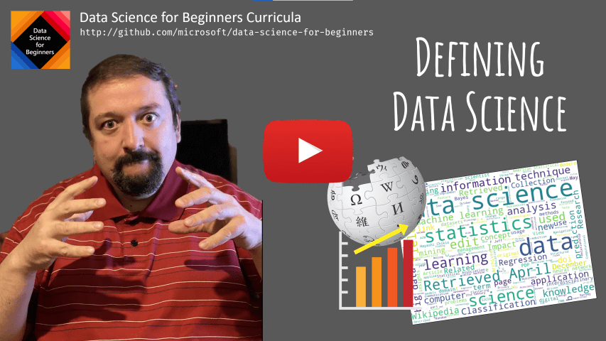

# Что такое наука о данных?

| ](../../../sketchnotes/01-Definitions.png)|
|:---:|
|Что такое наука о данных - _Рисунок [@nitya](https://twitter.com/nitya)_ |

---

## [Вступительный тест](https://purple-hill-04aebfb03.1.azurestaticapps.net/quiz/0)

## Что такое данные?
В повседневной жизни мы окружены данными. Текст, который Вы в данный момент читаете, является данными, список номеров телефонов друзей в Вашем смартфоне является данными, также как и время на Ваших часах. Люди умеют оперировать даными естественным образом, считая деньги, которые у нас есть, или составляя письма нашим друзьям.

Однако данные стали намного более важными с изобретением компьютеров. Главная роль компьютеров заключается в вычислениях, но им нужны данные, над которыми их производить. Таким образом, нам необходимо понимать, как компьютеры хранят и обрабатывают информацию.

С появлением Интернета роль компьютеров как вычислительных устройств возрасла. Если задуматься, сейчас мы всё больше используем компьютеры для обработки данных и коммуникации, чем непосредственно для вычислений. Когда пишем электронное письмо другу или ищем что-то в Интернете, мы, в действительности, создаём, храним, передаём и управляем данными.

>Можете ли Вы припомнить, когда последний раз использовали компьютер, чтобы что-то посчитать?

## Что такое наука о данных?

В [Википедии](https://ru.wikipedia.org/wiki/%D0%9D%D0%B0%D1%83%D0%BA%D0%B0_%D0%BE_%D0%B4%D0%B0%D0%BD%D0%BD%D1%8B%D1%85), **Наука о данных** определяется как *научная область, использующая научные методы для извлечения знаний и инсайтов из структурированных и неструктурированных данных и для применения их в широком спектре приложений.*

Данное определение подчеркивает следующие важные аспекты науки о данных:

* Главная цель науки о данных - **извлечение знаний** из данных, другими словами, - **понимание** данных, нахождение скрытых взаимосвязей и построение **модели**.
* Наука о данных использует **научные методы**, заимствованные из теории вероятности и статистики. Когда термин "наука о данных" был впервые введён, некоторые специалисты заявляли, что наука о данных - это просто новое модное название статистики. Сегодня уже стало очевидно, что данная область гораздо шире.
* Полученные знания должны быть использованы для получения **практических инсайтов**.
* Мы должны уметь оперировать как **структурированными** так и **неструктурированными данными**. Мы вернёмся к обсуждению различных типов данных далее в нашем курсе.
* **Область применения** - важное понятие, и специалисту в науке о данных часто необходима экспертиза в предметной области.

> Другой важный аспект науки о данных заключается в том, что она исследует, как данные должны быть собраны, сохранены и обработаны с использованием компьютеров. В то время как статистика предоставляет нам математические основы, наука о данных применяет математические знания для того, чтобы извечь инсайты из данных.

Одним из способов (приписываемым [Джиму Грею](https://ru.wikipedia.org/wiki/%D0%93%D1%80%D0%B5%D0%B9,_%D0%94%D0%B6%D0%B8%D0%BC)) взглянуть на науку о данных является рассмотрение её как отдельных научных парадигм:

* Эмпирической, следуя которой мы полагаемся в большей степени на наблюдения и результаты экспериментов.
* Теоретической, в которой новые концепции появляются из уже существующих научных знаний.
* Вычислительной, в которой мы открываем новые принципы, основанные на вычислительных экспериментах.
* Парадигмой на основе данных (data-driven), которая основывается на исследовании взаимосвязей и паттернов в данных.

## Другие смежные области

Так как данные - это всепроникающая концепция, наука о данных сама по себе также является широкой областью, пересекающаяся с другими дисциплинами.

<dl>
<dt>Базы данных</dt>
<dd>

Самым очевидным вопросом является "как хранить" данные, т.е. как организовать их так, чтобы обеспечить более быструю обработку. Существуют различные типы баз данных, позволяющие хранить структурированные и неструктурированные данные, <a href="../../2-Working-With-Data/translations/README.ru.md"> которые мы рассмотрим далее в нашем курсе</a>.
</dd>
<dt>Область больших данных</dt>
<dd>

Зачастую нам необходимо хранить и обрабатывать по-настоящему огромное количество данных с относительно простой структурой. Для этого существуют специальные подходы и методы хранения и эффективной обработки таких данных распределённым способом на вычислительном кластере.
</dd>
<dt>Машинное обучение</dt>
<dd>

Одним из способов понять данные это **построить модель**, способную предсказывать желаемую величину. Способность обучать подобные модели на данных изучается в **машинном обучении**. При желании Вы можете взглянуть на наш курс <a href="https://aka.ms/ml-beginners">"Машинное обучение для начинающих"</a>, чтобы погрузиться глубже в данную область.
</dd>
<dt>Искусственный интеллект</dt>
<dd>

Также как и машинное обучение, искусственный интеллект строится на данных и включает в себя построение сложных комплексных моделей, которые ведут себя подобно человеку. В дополнение, методы ИИ часто позволяют нам трансформировать неструктурированные данные (например, естественную речь) в структурированные при помощи извлечения некоторых признаков. 
</dd>
<dt>Визуализация</dt>
<dd>

Человек способен воспринимать ограниченное количество данных, но с построением полезной визуализации мы начинаем извлекать больше смысла из данных и строить различные выводы. Таким образом, важно знать несколько способов визуализации информации, те, что мы изучим в <a href="../../3-Data-Visualization/translations/README.ru.md">Секции 3</a> нашего курса. Смежными областями здесь также являются **Инфографика** и **Человеко-машинное взаимодействие** в целом.
</dd>
</dl>

## Типы данных

Как мы уже упоминали, данные находятся повсюду, нам нужно просто правильно их собрать. Различают **структурированные** и **неструктурированные** данные. Первые часто представлены в чётко структурированном виде, зачастую в виде одной или нескольких таблиц, в то время как вторые являются простым набором файлов. Иногда мы можем выделить **полуструктурированнные** данные, которые имеют некоторую каждый раз различную структуру.

| Структурированные | Полуструктурированные | Неструктурированные |
|----------- |-----------------|--------------|
| Список людей и их номеров телефона | Страницы Wikipedia с ссылками | Тексты энциклопедии Britannica |
| Поминутная температура во всех помещениях здания за последние 20 лет | Коллекция научных статей в формате JSON с указанием авторов, даты публикации и краткого описания | Корпоративные документы общего доступа |
| Возраст и пол каждого входящего в здание человека | Страницы сети Интернет | Необработанный видеопоток с камеры наблюдения |

## Источники данных

Существует множество возможных источников данных и невозможно перечислить их все. Однако, давайте рассмотрим несколько мест, где можно добыть данные:

* **Структурированные данные**
  - **Интернет вещей**, включающий в себя данные с различных датчиков, например, датчиков температуры или давления, содержит много полезных данных. В случае, если офисное помещение оборудовано датчиками с поддержкой Интернета вещей, то мы можем автоматически управлять отоплением и освещением, чтобы минимизировать затраты.
  - **Опросы**, в которых участвуют пользователи после покупки товара или посещения сайта.
  - **Анализ поведения**, например, может помочь понять, насколько далеко пользователь заходит на сайте и какие основные причины ухода с него.
* **Неструктурированные данные**
  - **Тексты** могут быть богатым источником инсайтов, начиная от общей **эмоциональной оценки** вплоть до извлечения ключевых слов и даже семантического значения.
  - **Изображения** или **видео**. Видео с камеры наблюдения может быть использовано для оценки загруженности дорог и информирования о возможных пробках.
  - **Логи** веб-сервисов могут быть использованы для того, чтобы понять, какие страницы нашего сайта посещают больше всего и насколько долго задерживаются на них.
* **Полуструктурированные данные**
  - Граф **социальной сети** может быть отличным источником данных о личности пользователя и возможной эффективности распространения информации рядом с ним.
  - В случае, когда у нас имеется пачка фотографий с вечеринки, мы можем попытаться извлечь данные **групповой динамики**, построив граф людей, фотографировавшихся друг с другом.

Зная различные возможные источники данных, Вы можете придумать другие сценарии, когда методы науки о данных могут быть применены наилучшим образом для усовершенствования бизнес-процессов.

## Этапы работы с данными

В науке о данных мы фокусируемся на следующих шагах работы с данными:

<dl>
<dt>1) Сбор данных</dt>
<dd>
Первый шаг - это сбор данных. Часто, это довольно примитивный процесс, например данные сохраняются в базу данных из веб-приложения, но иногда нам необходимые специальные методы. В случае данных с датчиков Интернета вещей, данных может оказаться слишком много, и хорошая практика использовать промежуточные точки, такие как хаб Интернета вещей, для сбора всех данных и последующей обработки.

</dd>
<dt>2) Хранение данных</dt>
<dd>
Хранение данных может быть непростой задачей, особенно когда мы говорим о больших данных. Принимая решение хранить данные, стоит продумать их дальнейшее использование. Вот некоторые из способов хранения данных:
<ul>
<li>Реляционные базы данных хранят коллекцию таблиц и используют специальный язык запросов SQL. Обычно, таблицы соединены друг с другом по определённой схеме. Очень часто нам необходимо преобразовать данные, чтобы они подходили под схему.
</li>
<li><a href="https://ru.wikipedia.org/wiki/NoSQL">Нереляционные (NoSQL)</a> базы данных, такие как  <a href="https://azure.microsoft.com/services/cosmos-db/?WT.mc_id=academic-77958-bethanycheum">CosmosDB</a>, не навязывают строгую модель данных и позволяют хранить более сложные данные, например иерархические JSON документы или графы. С другой стороны, нереляционные базы данных не имеют широких возможностей языка SQL и не гарантируют ссылочной целостности данных.
</li>
<li><a href="https://en.wikipedia.org/wiki/Data_lake">Озеро данных</a> - хранилище, используемое для больших коллекций "сырых" данных. Озёра данных часто встречаются в больших данных, когда все данные не помещаются в память одного компьютера и их необходимо хранить и обрабатывать вычислительным кластером. <a href="https://en.wikipedia.org/wiki/Apache_Parquet">Parquet</a> - формат данных, часто применяемый в связке с большими данными.
</li> 
</ul>
</dd>
<dt>3) Обработка данных</dt>
<dd>

Это наиболее увлекательная часть работы с данными, которая включает в себя обработку данных из их оригинального формата в формат, пригодный для визуализации и/или обучения модели. Имея дело с неструктурированными данными, мы, возможно, вынуждены применять некоторые методы ИИ для извлечения **признаков** из данных, конвертируя их, таким образом, в структурированный формат.

</dd>
<dt>4) Визуализация / Визуальный анализ</dt>
<dd>
Зачастую, чтобы понять данные, нам необходимо их визуализировать. Имея множество различных методов визуализации, мы можем найти нужный для получения инсайта. Нередко, специалистам по данным необходимо "играть данными", визуализируя их несколько раз в поисках взаимосвязей. Мы также можем использовать статистические методы для проверки гипотез или для доказательства наличия корреляции между двумя наборами данных.
</dd>
<dt>5) Тренировка прогнозной модели</dt>
<dd>
Из-за того, что главная цель науки о данных - предоставить возможность принятия решения на основе данных, мы можем использовать методы <a href="http://github.com/microsoft/ml-for-beginners">машинного обучения</a> для построения прогнозной модели, которая будет способна решить нашу задачу.
</dd>
</dl>

Разумеется, в зависимости от реальных данных некоторые шаги могут отсутствовать (например, в случае, когда наши данные уже лежат в базе данных или когда нам не нужно тренировать модель) или могут повторяться несколько раз (например, обработка данных).

## Цифровизация и цифровая трансформация

В последнее десятилетие, многие компании начали понимать важность данных при принятии решений. Чтобы применить науку о данных к бизнесу, необходимо собрать некоторые данные, т.е. преобразовать бизнес-процессы в цифровой формат. Этот процесс известен как **цифровизация** и сопровождается методами науки о данных для принятия решений. Зачастую, цифровизация ведёт к значительному увеличению продуктивности (и даже смене курса компании), называемому **цифровой трансформацией**.

Рассмотрим пример. Предположим, у нас есть учебный курс по науке о данных (похожий на данный), который мы предоставляем нашим студентам в режиме онлайн, и мы хотим использовать методы науки о данных чтобы улучшить его. Как мы можем это сделать?

Мы можем начать с вопроса "что может быть оцифровано"? Наиболее простой подход - измерить время, затрачиваемое студентами на прохождение каждого модуля, и полученные знания (например, организовав проверочный тест с несколькими вариантами ответов в конце каждого модуля). Усредняя время на завершение модуля по всем студентам, мы можем определить, какие модули курса вызывают наибольшие затруднения среди студентов, и поработать над их упрощением.

> Вы, может быть, возразите, что данный подход не идеален, потому что разделы могут быть различной длины. Вероятно, наиболее справедливым будет разделить затраченное время на длину модуля (количество символов), и сравнить полученные величины.

Когда мы приступаем к анализу результатов проверочных тестов, мы можем распознать отдельные понятия, которые студенты воспринимают плохо, и улучшить материал. Чтобы сделать это, нам необходимо спроектировать тесты таким образом, чтобы каждый вопрос покрывал определённое понятие или небольшую часть урока.

Если же мы хотим усложнить задачу, мы можем построить график времени, затраченного на каждый модуль, и отметить возраст студентов. Мы можем узнать, что для некоторых возрастных категорий прохождение одного модуля занимает непозволительно много времени, или студенты бросают курс на каком-либо этапе. Это поможет нам предоставить возрастные рекомендации для модулей и минимизировать неудовлетворённость студентов от несоответствия их ожиданиям.

## 🚀 Задача

При решении данной задачи мы попробуем найти понятия, относящиеся к науке о данных, рассматривая тексты. Мы возьмем статьи из Википедии о науке о данных, скачаем и обработаем тексты, а затем построим облако слов, похожее на это:

Откройте [`notebook.ipynb`](../notebook.ipynb), чтобы ознакомиться с исходным кодом. Вы также можете запустить выполнение кода и понаблюдать, как происходит трансформация данных в реальном времени. 

> Если Вы не знаете, как запустить код в Jupyter Notebook, прочтите [данную статью](https://soshnikov.com/education/how-to-execute-notebooks-from-github/).

## [Проверочный тест](https://purple-hill-04aebfb03.1.azurestaticapps.net/quiz/1)

## Домашнее задание

* **Задача 1**: Доработайте код из задачи выше, чтобы узнать понятия, относящиеся к областям "большие данные" (**Big Data**) и "машинное обучение" (**Machine Learning**)
* **Задача 2**: [Поразмыслите о сценариях работы в науке о данных](../assignment.md)

## Благодарности

Данный модуль был написан с ♥️ [Дмитрием Сошниковым](http://soshnikov.com)
