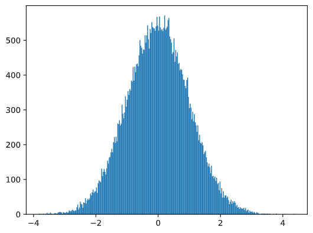

# Uma Breve Introdução a Estatística e Probabilidade

| ](../../../sketchnotes/04-Statistics-Probability.png)|
|:---:|
| Estatística e Probabilidade - _Sketchnote por [@nitya](https://twitter.com/nitya)_ |

Teoria da Probabilidade e Estatística são duas áreas altamente relacionadas da Matemática que são altamente relevante para a Ciência de Dados. É possível operar com dados sem um conhecimento aprofundado de matemática, mas ainda é bom saber pelo menos alguns conceitos. Aqui nós vamos apresentar uma breve introdução que ajudará você a começar.

[](https://youtu.be/Z5Zy85g4Yjw)


## [Quiz Pré Aula](https://purple-hill-04aebfb03.1.azurestaticapps.net/quiz/6)

## Probabilidade e Variáveis Aleatórias

**Probabilidade** é um número entre 0 e 1 que expressa o quão provável um **evento** é. É definida como um número de resultados positivos (que levam ao evento), divido pelo número possível de resultados, dado que todos os resultados são igualmente prováveis. Por exemplo, quando jogamos um dado, a probabilidade de termos um número par é 3/6 = 0.5.

Quando falamos de eventos, usamos **variáveis aleatórias**. Por exemplo, a variável aleatória que representa o número obtido quando jogamos um dado assumiria valores entre 1 e 6. O conjunto de números entre 1 a 6 é chamado de **espaço amostral**. Podemos falar sobre a probabilidade de uma variável aleatória ser um certo valor, como por exemplo P(X=3)=1/6.

A variável aleatória nos exemplos anteriores são chamadas de **discretas**, pois possui um espaço amostral contável, ex. existem valores separados que podem ser numerados. Existem casos onde o espaço amostral é uma gama de valores reais, ou todo o conjunto de números reais. Essas variáveis são chamadas de **contínuas**. Um bom exemplo é a hora em que o ônibus chega.

## Distribuição de Probabilidade

No caso de variáveis discretas, é fácil descrever a probabilidade de cada um por uma função P(X). Para cada valor *s* do espaço amostrals *S* vai dar um número entre 0 e 1, de modo que todos os valores P(X=s) para todos os eventos seria 1.

A distribuição discreta mais conhecida é a **distribuição uniforme**, no qual existe um espaço amostral de N elementos, com probabilidade de 1/N para todos eles.

É mais difícil descrever a distribuição de probabilidade para uma variável contínua, com valores sorteados dentro de um intervalo [a, b], ou todo o conjunto dos números reais &Ropf;. Considere o caso da chegado do horário de ônibus. Na verdade, para cada horário de chegada exato $t$, a probabilidade do ônibus chegar exatamente naquele horário é 0!

> Agora você sabe que eventos com probabilidade 0 acontecem, e muito frequentemente! Pelo menos toda vez que o ônibus chegar!

Nós só podemos falar da probabilidade de uma variável cair em um determinado intervalo de valores, ex. P(t<sub>1</sub>&le;X&lt;t<sub>2</sub>). Nesse caso, a distribuição de probabilidade é descrita por uma **função densidade de probabilidade** p(x), sendo que


Um análogo contínuo de distribuição uniforme é chamado de **uniforme contínuo**, o qual é definido em um intervalo finito. Uma probabilidade de que o valor X caia em um intervalo de tamanho l é proporcional a l, e vai até 1.

Outra distribuição importante é a **distribuição normal**, a qual vamos falar sobre em mais detalhes abaixo.

## Média, Variância e Desvio Padrão

Vamos supor que sorteamos um sequência de n amostras da variável aleatória X: x<sub>1</sub>, x<sub>2</sub>, ..., x<sub>n</sub>. Nós podemos definir o valor da **média** (ou **média aritmética**) da sequência da forma tradicional como (x<sub>1</sub>+x<sub>2</sub>+x<sub>n</sub>)/n. Conforme aumentamos o tamanho da amostra (ex. obter o limite com n&rarr;&infin;), nós vamos obter a média (também chamada de **expectância ou esperança**) da distribuição. Nós vamos denotá-la por **E**(x).

> Pode ser demonstrado que para qualquer distribuição discreta com valores {x<sub>1</sub>, x<sub>2</sub>, ..., x<sub>N</sub>} e probabilidades correspondentes p<sub>1</sub>, p<sub>2</sub>, ..., p<sub>N</sub>, a expectativa seria igual a E(X)=x<sub>1</sub>p<sub>1</sub>+x<sub>2</sub>p<sub>2</sub>+...+x<sub>N</sub>p<sub>N</sub>.

Para demonstrar o quanto os valores estão espalhados, nós podemos computar a variância &sigma;sup>2</sup> = &sum;(x<sub>i</sub> - &mu;)<sup>2</sup>/n, onde &mu; é a média da sequência. O valor de &sigma; é chamado de **desvio padrão**, e &sigma;<sup>2</sup> é chamado de **variância**.

## Moda, Média e Quartis

Algumas vezes, a média não representa adequadamente o valor "típico" para dados. Por exemplo, quando existem poucos valores extremos que estão completamente fora da faixa, eles podem afetar a média. Outra boa indicação é a **mediana**, um valor sendo que metade dos pontos de dados estão abaixo dele, e a outra metade - acima.

Para nos ajudar a entender a distribuição dos dados, é útil falar de **quartis**:

* O primeiro quartil, ou Q1, é um valor sendo que 25% dos dados estarão abaixo dele
* O terceiro quartil,ou Q3, é um valor sendo que 75% dos dados estarão abaixo dele

Graficamente nós podemos representar a relação entre mediana e quartis em um diagrama chamado de **box plot**:


Nós também podemos computar o **intervalo interquartil** IQR=Q3-Q1, e os tão chamados **outliers** - valores que se localizam fora dos limites [Q1-1.5*IQR,Q3+1.5*IQR].

Para distribuições finitas que contenham um pequeno número de valores positivos, um bom valor "típico" é aquele que aparece mais frequentemente, que é chamado de **moda**. Geralmente é aplicado para dados categóricos, como cores. Considere uma situação onde nós temos dois grupos de pessoas - alguns preferem fortemente vermelho, enquanto outros preferem azul. Se atribuirmos números a cores, o valor médio para uma cor favorita estaria em algum lugar entre o espectro laranja-verde, o que não indica, de fato, a preferência de nenhum grupo. No entanto, a moda seria ou uma das cores, ou ambas as cores, se os números de pessoas que votaram para elas fossem iguais (nesse caso nós chamamos a amostra de **multimodal**).
## Dados do Mundo Real

Quando analisamos dados da vida real, eles normalmente não são variáveis aleatórias como tal, no sentido de que não realizamos experimentos com resultado desconhecido. Por exemplo, considere um time de jogadores de baseball, e os seus dados corporais, como altura, peso e idade. Esses númerps não são exatamente aleatórios, mas nós podemos aplicar os mesmos conceitos matemáticos. Por exemplo, a sequência da altura das pessoas pode ser considerada uma sequência de valores sortidos de alguma variável aleatória. Abaixo  está a sequência de pesos de jogadores reais da [Major League Baseball](http://mlb.mlb.com/index.jsp), retirados [desse dataset](http://wiki.stat.ucla.edu/socr/index.php/SOCR_Data_MLB_HeightsWeights) (para a sua conveniência, apenas os primeiros 20 valores são mostrados):

```
[180.0, 215.0, 210.0, 210.0, 188.0, 176.0, 209.0, 200.0, 231.0, 180.0, 188.0, 180.0, 185.0, 160.0, 180.0, 185.0, 197.0, 189.0, 185.0, 219.0]
```

> **Nota**: Para ver o exemplo de trabalhar com esse dataset, olhe o [notebook](../notebook.ipynb). Existe também um número de desafios nessa aula, e você pode completá-los adicionando alguns códigos nesse notebook. Se você não tem certeza de como operar os dados, não se preocupe - nós vamos voltar a trabalhar com dados usando Python em um outro momento. Se você não sabe como rodar código no Jupyter Notebook, dê uma olhada [neste artigo](https://soshnikov.com/education/how-to-execute-notebooks-from-github/).

Aqui está o box plot mostrando a média, mediana e quartis para os nossos dados:


Já que os nossos dados possuem informação de **posições** diferentes dos jogadores, nós podemos fazer o box plot baseado nas posições - permitirá a gente ter uma ideia de como os valores dos parâmetros mudam conforme diferentes posições. Agora vamos considerar a altura:


Esse diagrama sugere que, em média, a altura do jogador na primeira base é maior do que a altura dos jogadores na segunda base. Mais tarde nessa aula nós vamos aprender como podemos testar essa hipótese mais formalmente, e como demonstrar que o nosso dado é estatisticamente significante para mostrar isso.

> Quando trabalhando com dados do mundo real, nós assumimos que todos os pontos de dados são amostras sortidas de alguma distribuição de probabilidade. Essa suposição permite que a gente aplica técnicas de aprendizado de máquina e contrua modelos preditivos que funcionam.

Para ver qual a distribuição dos nossos dados é, nós podemos "plotar" um gráfico chamado de **histograma**. O eixo x seria um número de diferentes intervalos de valores para peso (chamados de **grupos** (bins)), e o eixo vertical mostrari o número de vezes que a amostra da nossa variável aleatória estava dentro do intervalo dado.


A partir desse histograma você pode ver que todos os valores estão centrados ao redor de uma certa média de peso, e quanto mais longe nós formos - menos pesos desse valor são encotnrados. Ex. é muito improvável que o peso de um jogador de baseball seja muito diferente da média de pesos. Variância dos pesos mostram até que pontos os pesos tendem a diferir da média.

> Se nós pegarmos os pesos de outras pessoas, não da liga de baseball, a distribuição provavelmente será diferente. No entante, a forma da distribuição será a mesma, mas a média e a variância iria mudar. Então, se treinarmos o modelo nos jogadores de baseball, provavelmente teremos resultados errados quando aplicado em estudantes de uma universidade, pois a distribuição subjacente é diferente.
## Distribuição Normal

A distribuição de pesos que vimos acima é bem típica, e muitas medidas do mundo real seguem o mesmo tipo de distribuição, mas com médias e variâncias diferentes. Essa distribuição é chamada de **distribuição normal**, e possui um papel importante na estatística.

Usar distribuição normal é uma forma correta de gerar pesos aleatórios para potenciais jogadores de baseball. Uma vez que sabemos a média de pesso `mean` e desvio padrão `std`, nós podemos gerar 1000 amostras de peso da seguinte forma:
```python
samples = np.random.normal(mean,std,1000)
``` 

Se "plotarmos" o histograma das amostras geradas nós vamos ver a figura bem similar com a mostrada acima. Se aumentarmos o número de amostrar e o número de grupos (bins), nós podemos gerar a figura de uma distribuição normal que é mais perto do ideal:



*Distribuição Normal com mean=0 e std.dev=1*

## Intervalos de Confiânça

Quando falamos sobre os pesos de jogadores de baseball, nós assumimos que existem certas **variáveis aleatórias W** que correspondem a distribuição de probabilidade ideal dos pesos de todos os jogadores de baseball (chamados de **população (population)**). Nossa sequência de pesos correspondem a um subset de todos os jogadores que chamamos de **amostra**. Uma questão interessante é, nós podemos saber os parâmetros da distribuição W, ex. média e variância de uma população?

A resposta mais fácil seria calcular média e variância da nossa amostra. No entante, pode acontecer que nossa amostra aleatória não representa precisamente a população completa. Portanto faz sentido falar sobre **intervalos de confiança**.

> **Intervalo de confiança** é a estimação da média verdadeira de uma população dada a nossa amostra, que é precisa é uma certa probabilidade (ou **nível de confiança**).

Suponha que temos uma amostra X<sub>1</sub>, ..., X<sub>n</sub> da nossa distribuição. Cada vez que sorteamos uma amostra da nossa distribuição, nós acabaríamos com diferentes valores de média &mu;. Portanto &mu; pode ser considerado uma variável aleatória. Um **intervalo de confiança** com confiança p é um par de valores (L<sub>p</sub>,R<sub>p</sub>), de forma que **P**(L<sub>p</sub>&leq;&mu;&leq;R<sub>p</sub>) = p, ex. a probabilidade da média medida estar dentro do intervalo igual a p.

Vai além da nossa pequena introdução discutir detalhadamente como esses intervalos de confiança são calculados. Mais detalhes podem ser encontrados [na Wikipedia](https://en.wikipedia.org/wiki/Confidence_interval). Resumidamente, nós definimos a distribuição da média da amostra computada em relação a média verdadeira da população, que é chamada de **distribuiçao student (student distribution)**.

> **Fato interessante**: distribuição Student é nomeada em homenagem ao matemático William Sealy Gosset, que publicou seu artigo com o pseudônimo "Student". Ele trabalhou na cervejaria Guinness, e, de acordo com uma das versões, seu empregador não queria que o público geral soubesse que eles estavam usando testes estatísticos para determinar a qualidade de materiais brutos.

Se nós quiséssemos estimar a média &mu; da nossa população com confiança p, nós precisamos pegar *percentil número (1-p)/2 ((1-p)/2-th percentile)* de uma distribuição Student A, que pode ser coletada de tabelas, ou computadores usando alguma função imbutida de uma software de estatística (ex. Python, R, etc.). Então o intervalo &mu; seria dados por X&pm;A*D/&radic;n, onde X é a média obtida da amostra, D é o desvio padrão.

> **Nota**: Nós também omitimos a discussão de um conceito importante de [degrees of freedom (graus de liberdade)](https://en.wikipedia.org/wiki/Degrees_of_freedom_(statistics)), que é importante em relação a distribuição Student. Você pode dar uma olhada em livros mais completos sobre estatísticas para entender esse conceito mais profundadamente.

Um exemplo para calcular o intervalo de confiança para pesos e alturas é dado no [notebook](../notebook.ipynb).

| p | Weight mean |
|-----|-----------|
| 0.85 | 201.73±0.94 |
| 0.90 | 201.73±1.08 |
| 0.95 | 201.73±1.28 |

Perceba que quanto maior é a probabilidade da confiança, mais amplo é o intervalo de confiança.

## Testando Hipóteses
No nosso dataset de jogadores de baseball, existem diferentes posições, as quais podem ser sumarizadas abaixo (olhe o [notebook](../notebook.ipynb) para ver como essa tabela pode ser calculada):

| Role | Height | Weight | Count |
|------|--------|--------|-------|
| Catcher | 72.723684 | 204.328947 | 76 |
| Designated_Hitter | 74.222222 | 220.888889 | 18 |
| First_Baseman | 74.000000 | 213.109091 | 55 |
| Outfielder | 73.010309 | 199.113402 | 194 |
| Relief_Pitcher | 74.374603 | 203.517460 | 315 |
| Second_Baseman | 71.362069 | 184.344828 | 58 |
| Shortstop | 71.903846 | 182.923077 | 52 |
| Starting_Pitcher | 74.719457 | 205.163636 | 221 |
| Third_Baseman | 73.044444 | 200.955556 | 45 |

Nós podemos ver que a média das alturas dos jogadores na primeira base é maior que a dos jogadores na segunda base. Portanto, nós podemos ser tentados a concluir que **jogadores da primeira base é maior que os da segunda base**.

> Essa afirmação é chamada de **uma hipótese**, pois nós não sabemos se é verdade ou não.

No entanto, nem sempre é óbvio fazer essa conclusão. A partir da discussão acima nós sabemos que cada média tem um intervalo de confiança associado, e portante esse diferença pode ser apenas um erro estatístico. Nós precisamos de formas mais formais de testar nossa hipótes.

Vamos computar o intervalo de confiança separadamente para as alturas dos jogadores na primeira base e dos jogadores da segunda base:

| Confidence | First Basemen | Second Basemen |
|------------|---------------|----------------|
| 0.85 | 73.62..74.38 | 71.04..71.69 |
| 0.90 | 73.56..74.44 | 70.99..71.73 |
| 0.95 | 73.47..74.53 | 70.92..71.81 |

Nós podemos ver que sobre nenhuma confiança os intervalos se sobrepõem. Isso prova a nossa hipótese de que os jogador na primeira base são mais altos que os jogadores da segunda base.

Mais formalmente, o problema que estamos resolvendo é ver se **duas distribuições de probabilidades são as mesmas**, ou se pelo menos possuem os mesmos parâmetros. Dependendo da distribuição, nós precisamos usar diferentes testes para isso. Se nós soubermos que a nossa distribuição é normal, nós podemos aplicar **[Teste t de Student (Student t-test)](https://en.wikipedia.org/wiki/Student%27s_t-test)**.

No teste t de Student, nós computamos o **valor t**, que indica a diferença entre a média, levando em conta a variância. É demonstrado que o valor t segue a **distribuição student**, o que nos permite ter o valor limite para um determinado nível de confiança **p** (isso pode ser computado, ou procurado nas tabelas numéricas). Nós então comparamos o valor t para esse limite para aprovar ou rejeitar a hipótese

Em Python, nós podemos usar o pacote **SciPy**, o qual inclui a função `ttest_ind` (e mais funções estatísticas!). Ela computa o valor t para a gente, e também faz a pesquisa inversa do valor de confiança p, para que podemos apenas olhar para a confiança para chegarmos a uma conclusão.

Por exemplo, nossa comparação entre alturas dos jogadores da primeira base e da segunda base nos dá o seguinte resultado:
```python
from scipy.stats import ttest_ind

tval, pval = ttest_ind(df.loc[df['Role']=='First_Baseman',['Height']], df.loc[df['Role']=='Designated_Hitter',['Height']],equal_var=False)
print(f"T-value = {tval[0]:.2f}\nP-value: {pval[0]}")
```
```
T-value = 7.65
P-value: 9.137321189738925e-12
```
No nosso caso, o valor p é bem baixo, o que significa que existem fortes evidências que confirmam que os jogadores da primeira base são maiores.

Existe também outros tipos diferentes de hipótes que podemos querer testar, por exemplo:
* Provar que uma dada amostra segue alguma distribuição. No nosso caso nós assumimos que alturas são normalmente distribuídas, mas isso precisa de verificação estatística formal.
* Provar que uma valor média de uma amostra corresponde a algum valor predefinido
* Comparar as médias de um número de amostras (ex. qual é a diferença em níveis de felicidade entre diferentes faixas etárias)

## Lei dos Números Grandes e Teorema do Limite Central

Uma das razões pelo qual a distribuição normal é tão importante é a tão chamada **teorema do limite central**. Vamos supor que temos uma grande amostra de N valores independentes X<sub>1</sub>, ..., X<sub>N</sub>, amostrado de qualquer distribuição com média &mu; e variância &sigma;<sup>2</sup>. Então, para N suficientemente grande (em outras palavras, quando N&rarr;&infin;), a média &Sigma;<sub>i</sub>X<sub>i</sub> seria normalmente distribuída, com média &mu; e variância &sigma;<sup>2</sup>/N.

> Outra forma de interpretar o teorema do limite central é dizer que independentemente da distribuição, quando você computa a média da soma de quaisquer valores de variável aleatória você acabará com uma distribuição normal.

A partir do teorema do limite central também segue que, quando when N&rarr;&infin;, a probabilidade da média da amostra ser igual a &mu; se torna 1. Isso é conhecido como a **lei dos números grandes**.

## Covariância e Correlação

Uma das coisas que Ciência dos Dados faz é encontrar relações entre dados. Nós dizemos que duas sequências **correlacionam** quando elas exibem um comportamento similar ao mesmo tempo, ex. eles sobem/caem simultâneamente, ou uma sequência sobe enquanto a outra desce e vice-versa. Em outras palavras, aparenta ter algum tipo de relaçõa entre as duas sequências.

> Correlação não necessariamente indica uma relação causal entre duas sequências; algumas vezes ambas as variáveis podem depender de alguma causa externa, or pode ser puramente uma coincidência que duas sequências se relacionem. No entanto, uma forte correlaçõe matemática é um bom indício

 Matematicamente, o conceito principal que mostra uma relações entre duas variávies aleatórias é **covariância**, que é computada da seguinte forma: Cov(X,Y) = **E**\[(X-**E**(X))(Y-**E**(Y))\]. Nós computamos o desvio de ambas as variáveis em relação a média, e então o produto desses desvios. Se ambas as variáveis desviam juntas, o produto seria sempre um valor positivo, que resulta em uma covariância positiva. Se ambas as variáveis desviam de forma não sincronizadas (ex. uma está abaixo da média enquanto outra está acima), nós sempre vamos ter números negativos, que resulta em uma covariância negativa. Se os desvios não são dependentes, eles sempre vão resultar em quase zero.

O valor absoluto da  covariância não nos informa o quão grande a correlação é, pois depende da magnitude dos valores reais. Para normalizar isso, nós podemos dividir a covariância pelo desvio padrão de ambas as variáveis, para conseguirmos a **correlação**. O bom é que a correlação sempre vai estar na faixa de [-1, 1], onde 1 indica uma forte correlaçao positiva entre os valores, -1 - forte correlação negativa, e 0 - nenhuma correlação (variáveis são independentes).

**Exemplo**: Nós podemos computar a correlação entre pesos e alturas de jogadores de baseball do dataset mencionado acima:
```python
print(np.corrcoef(weights,heights))
```
Como resultado, temos uma **matriz de correlação** como essa:
```
array([[1.        , 0.52959196],
       [0.52959196, 1.        ]])
```

> Matriz de correlação C pode ser computada para qualquer número de sequências de input S<sub>1</sub>, ..., S<sub>n</sub>. O valor de C <sub>ij</sub> é a correlação entre S<sub>i</sub> e S<sub>j</sub>, e elementos diagonais são sempre 1 (o que também é uma auto-correlação de S<sub>i</sub>).

No nosso caso, o valor 0.53 indica que existe alguma correlação entre peso e altura de uma pessoa. Nós podemos fazer um gráfico de pontos de um valor contra o outro para ver a relação visualmente:


> Mais exemplos de correlação e covariância podem ser encontrados no [notebook](../notebook.ipynb).

## Conclusão

Nessa seção nós aprendemos:
* propriedades estatísticas básicas dos dados, como média, variância, moda e quartis
* diferentes distribuições para variáveis aleatórias, incluindo distribuição normal
* como encontrar a correlação entre propriedades diferentes
* como usar aparelhos de som de matemática e estatística para provar algumas hipóteses,
* como computar intervalos de confiância para variáveis aleatórias dado uma amostra de dados

Enquanto essa definitivamente não é uma lista exaustiva de tópicos que existem dentro de probabilidade e estatística, deve ser o suficiente para você começar bem esse curso.

## 🚀 Desafio

Use o código de exemplo no notebook para testar outras hipóteses que:
1. Jogadores na primeira base e mais velhos que jogadores na segunda base
2. Jogadores na primeira base e mais altos que jogadores na terceira base
3. Interbases (Shortstops) são maiores que jogadores na segunda base

## [Quis Pós Aula](https://purple-hill-04aebfb03.1.azurestaticapps.net/quiz/7)

## Revisão e Autoestudo

Probabilidade e estatística é um tópico muito amplo que merece um curso próprio. Se você está interessado em aprofundar a teoria, talvez você queira continuar lendo alguns dos seguintes livros:

1. [Carlos Fernanderz-Granda](https://cims.nyu.edu/~cfgranda/) da Universidade de Nova Iorque (New York University) tem boas notas de aula [Probability and Statistics for Data Science](https://cims.nyu.edu/~cfgranda/pages/stuff/probability_stats_for_DS.pdf) (disponíveis online)
1. [Peter and Andrew Bruce. Estatística prática para Cientistas de Dados (Practical Statistics for Data Scientists).](https://www.oreilly.com/library/view/practical-statistics-for/9781491952955/) [[sample code in R](https://github.com/andrewgbruce/statistics-for-data-scientists)]. 
1. [James D. Miller. Estatística para Ciência de Dados (Statistics for Data Science)](https://www.packtpub.com/product/statistics-for-data-science/9781788290678) [[sample code in R](https://github.com/PacktPublishing/Statistics-for-Data-Science)]

## Tarefa

[Small Diabetes Study (Pequeno Estudo de Diabetes)](assignment.pt-br.md)

## Créditos

Essa aula foi autorada com ♥️ por [Dmitry Soshnikov](http://soshnikov.com)
