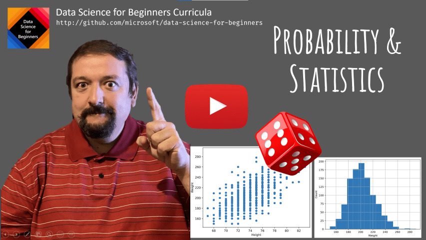
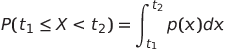
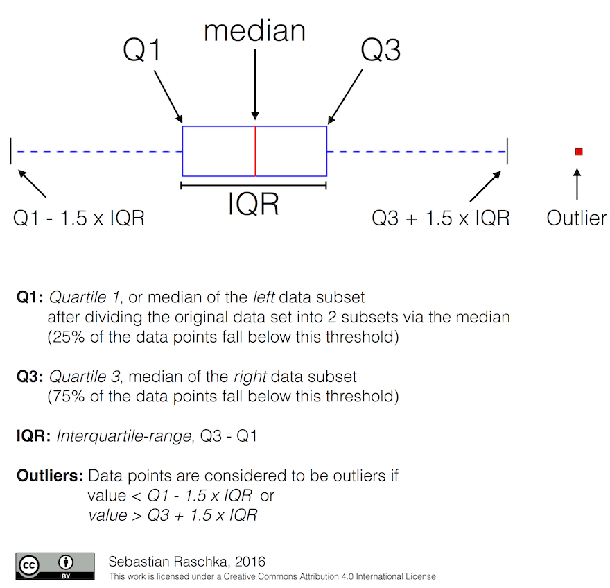
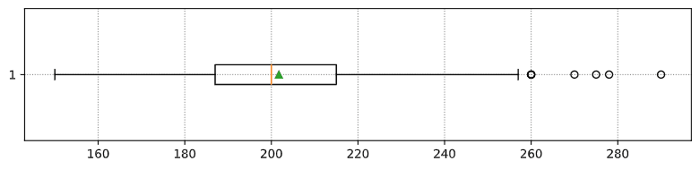
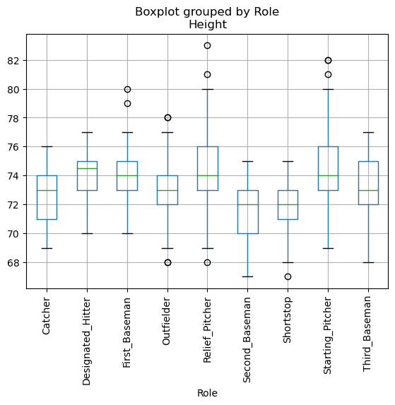
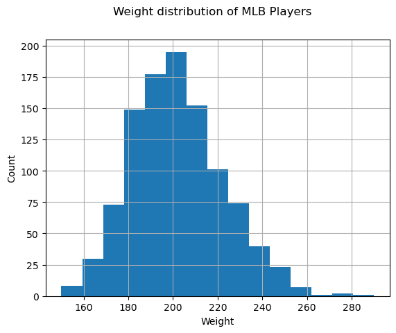
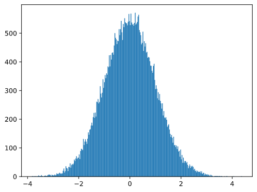
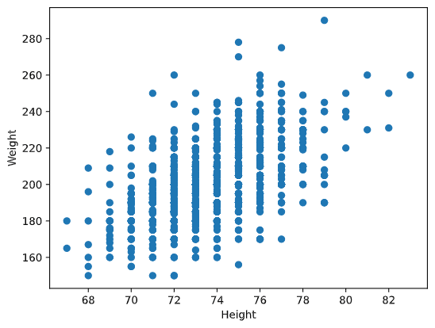

# Краткое введение в теорию вероятности и статистику

| ](../../../sketchnotes/04-Statistics-Probability.png)|
|:---:|
| Теория вероятности и статистика - _Рисунок [@nitya](https://twitter.com/nitya)_ |


Статистика и теория вероятности - две связанные друг с другом области математики, которые активно применяются в науке о данных. Оперировать данными вполе возможно без глубоких знаний математики, но всё лучше знать, по крайней мере, некоторые базовые концепции. В этом уроке мы приводим краткое введение, чтобы помочь Вам их понять. 

[](https://youtu.be/Z5Zy85g4Yjw)


## [Вступительный тест](https://purple-hill-04aebfb03.1.azurestaticapps.net/quiz/6)

## Вероятность и случайная величина

**Вероятность** - число от 0 до 1, которое выражает, насколько вероятным является **событие**. Она определяется как число благоприятных исходов (которые ведут к появлению события), делённое на число всех исходов, при условии, что все исходы одинаково вероятны. Например, при броске кубика, вероятность того, что мы получим чётное числов равна 3/6 = 0.5.

Когда мы говорим о событиях, мы используем **случайные величины**. Например, случайная величина, которая представляет собой число, выпавшее при броске кубика, принимает значения от 1 до 6. Числа от 1 до 6 в данном случае называются **пространством элементарных событий**. Мы можем говорить о вероятности случайной величины, оперируя конкретным числом, например P(X=3)=1/6.

Случайная величина из предыдущего примера называется **дискретной**, потому что она имеет счётное пространство элементарных событий, т.е. принимает отдельные значения, которые можно перечислить. Существуют случаи, когда пространство событий представляет собой диапазон действительных чисел, или целый их набор. Такие величины называются **непрерывными**. Отличным примером такой величины является время прибытия автобуса.


## Распределение вероятности

В случае случайных дискретных величин, легко описать вероятность каждого события функцией P(X). Для каждого значения *s* из пространства событий *S* она возвращает число от 0 до 1 таким образом, что сумма всех значений функции P(X=s) для всех событий равна 1.

Наиболее широко известное распределение - **равномерное распределение**, при котором элементы пространства событий N имеют равную вероятность 1/N.

Описать распределение вероятности непрерывной величины, принимающей значения в интервале [a,b] или в пространстве действительных чисел &Ropf;, гораздо сложнее. Рассмотрим случай со временем прибытия автобуса. На самом деле, для каждого отдельного времени прибытия $t$, вероятность прибытия автобуса точно в данное время равна 0!

> Теперь Вы знаете, что события с нулевой вероятностью встречаются, и очень часто! По крайней мере, каждый раз, когда приходит автобус.

Мы можем говорить о вероятности случайной величины, распределённой на интервале значений, напр. P(t<sub>1</sub>&le;X&lt;t<sub>2</sub>). В этом случае, распределение вероятности описывается **функцией плотности вероятности** p(x), например



Непрерывный аналог равномерного распределения называется **непрерывное равномерное распределение**, которое определено на конечном интервале. Вероятность того, что величина X попадёт в интервал длиной l, пропорциональна l и возрастает вплоть до 1.

Другим важным распределением является **нормальное распределение**, о котором мы поговорим подробнее ниже.

## Среднее, дисперсия и стандартное отклонение

Предположим мы построили последовательность из n элементов случайной величины X: x<sub>1</sub>, x<sub>2</sub>, ..., x<sub>n</sub>. Мы можем рассчитать **среднее** (or **арифметическое среднее**) значение традиционным способом: (x<sub>1</sub>+x<sub>2</sub>+x<sub>n</sub>)/n. По мере увеличения числа элементов выборки (т.е. взять неограниченное число n&rarr;&infin;), мы получим среднее (также называемое **математическим ожиданием**) распределения. Обозначим его **E**(x).

> Можно продемонстрировать, что для любого дискретного распределения, принимающего значения {x<sub>1</sub>, x<sub>2</sub>, ..., x<sub>N</sub>} с вероятностями p<sub>1</sub>, p<sub>2</sub>, ..., p<sub>N</sub>, математическое ожидание равно E(X)=x<sub>1</sub>p<sub>1</sub>+x<sub>2</sub>p<sub>2</sub>+...+x<sub>N</sub>p<sub>N</sub>.

Чтобы определить, насколько широко распределены данные, мы можем посчитать дисперсию &sigma;<sup>2</sup> = &sum;(x<sub>i</sub> - &mu;)<sup>2</sup>/n, где &mu; - среднее значение ряда. Величина &sigma; называется **стандартным отклонением**, а &sigma;<sup>2</sup> - **дисперсией**.


## Мода, медиана и квартили

Иногда, среднее значение необъективно отображает "обычное" значение в данных. Например, когда имеются несколько экстремальных значений, которые лежат далеко за пределами интервала, они могут влиять на среднее. Ещё одна полезная величина - **медиана**, значение, меньше которого половина точек, а другая половина - больше.

Чтобы лучше понять распределение данных, полезно упомянуть **квартили**:

* Первая квартиль, или Q1, - величина, меньше которой 25% всех данных
* Третья квартиль, или Q3 - величина, меньше которой 75% всех данных

Взаимосвязь между медианой и квартилями мы можем изобразить графически при помощи диаграммы **ящик с усами**:




Мы также можем посчитать **интерквартильный размах** IQR=Q3-Q1 и так называемые **выбросы** - значения, оторые лежат за пределами [Q1-1.5*IQR,Q3+1.5*IQR].


Для конечного распределения, которое принимает небольшое число возможных значений, хорошее "обычное" значение - то, которое появляется наиболее часто, оно называется **мода**. Она актуальна для категориальных данных, таких как цвета. Представим ситуцию, в которой у нас есть две группы людей, одни из них предпочитают красный цвет, другим больше нравится синий. Если мы закодируем цвета при помощи цифр, среднее значение для предпочитаемого цвета будет где-то в оранжево-зелёном спектре и не отобразит реальные предпочтения ни одной из групп. Однако, мода примет значение одного из цветов, или обоих, если число проголосовавших за них людей одинаково (в этом случае мы называем выборку **мультимодальной**).

## Реальные данные

Когда мы анализируем данные из реального мира, они зачастую не являются случайными по своей природе, в том смысле, что мы не проводим эксперименты с неизвестным результатом. Например, рассмотрим игроков бейсбольной команды и их параметры, такие как рост, вес и возраст. Эти числа не совсем случайные, но, несмотря на это, мы можем применять те же самые математические концепции. Например, последовательность весов людей может быть рассмотрена как последовательность чисел, взятых из какой-либо случайной величины. Ниже приведена последовательность весов реальных бейсбольных игроков [Главной бейсбольной лиги](http://mlb.mlb.com/index.jsp), взятых из [этого датасета](http://wiki.stat.ucla.edu/socr/index.php/SOCR_Data_MLB_HeightsWeights) (приводим только первые 20 значений для Вашего ознакомления)

```
[180.0, 215.0, 210.0, 210.0, 188.0, 176.0, 209.0, 200.0, 231.0, 180.0, 188.0, 180.0, 185.0, 160.0, 180.0, 185.0, 197.0, 189.0, 185.0, 219.0]
```

> **Замечание**: Чтобы ознакомиться с примером работы с данным датасетом, взгляните на [соответствующий блокнот](../notebook.ipynb). Также там доступны задачи из данного урока, и Вы можете выполнить их, добавив свой код в этот блокнот. Если Вы не знаете как обращаться с данными, не переживайте, мы вернёмся к работе с данными при помощи языка Python позже. Если вы не знаете, как запускать код в Jupyter блокнотах, взгляните на [эту статью](https://soshnikov.com/education/how-to-execute-notebooks-from-github/).

Ниже приведён график "ящик с усами", отображающий среднее значение, медину и квартили для наших данных:



Так как наши данные содержат информацию о различных **ролях** игроков, мы также может построить подобный график по ролям, это позволит нам увидеть, как параметры игроков варьируются в зависимости от роли. На этот раз отобразим рост:



Из этого графика следует, что, в среднем, бейсболист с первой базы выше ростом, чем со второй. Далее в этом уроке мы рассмотрим, как проверить эту гипотезу формально и как продемонстрировать, что наши данные обладают статистической значимостью, чтобы подтвердить нашу гипотезу.

> При работе с реальными данными, мы предполагаем, что все экземпляры данных взяты из одного распределения. Это предположение позволяет нам применять методы машинного обучения и строить работающие предиктивные модели.

Для того, чтобы увидеть распределение наших данных, мы можем построить график под названием **гистограмма**. Шкала X будет содержать различные интервалы весов (так называемые **столбцы**), а шкала Y - количество попаданий случайной величины в заданный интервал.



На гистограмме вы можете увидеть, что все значения сосредоточены вокруг определённого среднего веса и что чем дальше мы от этого веса, тем меньше весов находится в столбце. Т.е. крайне маловероятно, что веса бейсболистов будут сильно отличаться от среднего веса. Дисперсия весов показывает степень вероятности, с которой веса будут отличаться от своего среднего значения.

> Если мы возьмём веса других людей, не из бейсбольной лиги, то распределение наверняка будет другим. Однако форма распределения останется той же самой, но среднее и дисперсия изменятся. Таким образом, если мы натренируем нашу модель на бейсбольных игроках, мы, вероятно, получим плохие результаты, применяя эту модель к студентам университета, потому что распределение их весов другое.

## Нормальное распределение

Распределение весов, которое мы наблюдали выше, крайне типичное, множество измерений величин реального мира подчиняются этому типу распределений, но с другими средним значением и дисперсией. Данное распределение называется **нормальным распределением**, и оно занимает очень важное место в статистике.

Использование нормального распределения - верный способ сгенерировать случайные веса потенциальных бейсболистов. Как только мы узнаем средний вес `mean` и стандартное отклонение `std`, мы можем сгенерироваться 1000 примеров весов следующей командой:

```python
samples = np.random.normal(mean,std,1000)
``` 

Если мы построим гистограмму сгенерированных примеров, мы увидим картину, очень похожую на ту, что мы видели выше. И в случае увеличения количества примеров и количества столбцов, мы можем получить изображение нормального распределения, которое более близко к идеальному:



*Нормальное распределение с параметрами среднее (mean) = 0 и стандартным отклонением (std.dev) = 1*

## Доверительные интервалы

Когда мы говорим о весе бейсболистов, мы полагаем, что существует **случайная величина W**, которая соответствует идеальному распределению вероятности весов всех бейсболистов (так называемой **популяции**). Наша последовательность весов соответствует подмножеству множества всех бейсболистов, которое мы называем **выборкой**. Интересный вопрос состоит в том, можем ли мы узнать параметры распределения W, т.е. среднее значение и дисперсию популяции?

Самым простым решением может быть посчитать среднее и дисперсию нашей выборки. Однако, может произойти так, что наша случайная выборка не достаточно точно представляет полную популяцию. Таким образом, имеет смысл обсудить понятие **доверительных интервалов**.

> **Доверительный интервал** - оценка реального среднего значения популяции при условии нашей выборки, которая точна для определенного уровня вероятности (или **степени достоверности**)

Предположим у нас есть выборка X<sub>1</sub>, ..., X<sub>n</sub> из нашего распределения. Каждый раз, когда мы выделяем выборку из нашего распределения, мы получаем различные среднее значение &mu;. Таким образом, &mu; может быть рассмотрено в качестве случайной величины. **Доверительный интервал** с уверенностью p - пара таких значений (L<sub>p</sub>,R<sub>p</sub>), что **P**(L<sub>p</sub>&leq;&mu;&leq;R<sub>p</sub>) = p, т.е. вероятность измеренного среднего значения попадает лежит в данном интервале с вероятностью p.

Детальное обсуждение расчёта подобных доверительных интервалов лежит за рамками нашего краткого введения. Некоторые подробности Вы можете найти [на портале Wikipedia](https://ru.wikipedia.org/wiki/%D0%94%D0%BE%D0%B2%D0%B5%D1%80%D0%B8%D1%82%D0%B5%D0%BB%D1%8C%D0%BD%D1%8B%D0%B9_%D0%B8%D0%BD%D1%82%D0%B5%D1%80%D0%B2%D0%B0%D0%BB). Коротко, мы нашли распределение рассчитанного выборочного среднего по отношению к реальному среднему популяции, которое называется **распределением Стьюдента**.

> **Интересный факт**: распределение Стьюдента названо в честь математика Уильяма Сили Госсета, который публиковал свои статьи под псевдонимом "Стьюдент". Он работал в пивоварне Гиннес и, по одной из версий, его работодатель не хотел, чтобы широкая публика знала, что на производстве использовали статистические методы для определения качества исходных материалов.

Если мы хотим подсчитать среднее значение &mu; популяции с уверенностью p, нам необходимо взять *(1-p)/2-ую перцентиль* распределения Стьюдента A, которая находится в специальной таблице или рассчитывается встренными функциями статистического ПО (например языки программирования Python, R, и др.). Затем найдём интервал для &mu; при помощи X&pm;A*D/&radic;n, где X - полученное выборочное среднее, D - стандартное отклонение.

> **Замечание**: мы также опустим обсуждение важной концепции [степени свободы](https://ru.wikipedia.org/wiki/%D0%A1%D1%82%D0%B5%D0%BF%D0%B5%D0%BD%D0%B8_%D1%81%D0%B2%D0%BE%D0%B1%D0%BE%D0%B4%D1%8B_(%D1%82%D0%B5%D0%BE%D1%80%D0%B8%D1%8F_%D0%B2%D0%B5%D1%80%D0%BE%D1%8F%D1%82%D0%BD%D0%BE%D1%81%D1%82%D0%B5%D0%B9)), которая имеет прямое отношение к распределению Стьюдента. Вы также можете ознакомиться с более полными пособиями по статистике, чтобы глубже изучить данное понятие.

Пример расчёта доверительных интервалов для весов и высот бейсболистов приведёт в [соответствующем блокноте](../notebook.ipynb).

| p | Weight mean |
|-----|-----------|
| 0.85 | 201.73±0.94 |
| 0.90 | 201.73±1.08 |
| 0.95 | 201.73±1.28 |

Отметим, что чем выше степень уверенности, тем шире доверительный интервал.

## Проверка гипотез

В нашем датасете бейсболистов есть разные роли игроков, которые могут быть агрегированы как в примере ниже (взгляните на [соответствующий блокнот](../notebook.ipynb), чтобы увидеть, как рассчитывается данная таблица):

| Роль | Высота | Вес | Количество |
|------|--------|--------|-------|
| Кэтчер | 72.723684 | 204.328947 | 76 |
| Назначенный хиттер | 74.222222 | 220.888889 | 18 |
| Игрок первой базы | 74.000000 | 213.109091 | 55 |
| Аутфилдер | 73.010309 | 199.113402 | 194 |
| Релиф-питчер | 74.374603 | 203.517460 | 315 |
| Игрок второй базы | 71.362069 | 184.344828 | 58 |
| Шорт-стоп | 71.903846 | 182.923077 | 52 |
| Стартовый питчер | 74.719457 | 205.163636 | 221 |
| Игрок третьей базы | 73.044444 | 200.955556 | 45 |

Мы можем отметить, что средняя высота игрока первой базы больше, чем игрока второй. Поэтому, мы можем заключить, что **игрок первой базы выше, чем игрок второй базы**.

> Данное утверждение называется **гипотезой**, потому что мы не знаем, правдив ли данный факт.

Однако, не всегда очевидно, можем ли мы сделать такой вывод. Из обсуждения выше мы знаем, что каждое среднее ассоциировано с доверительным интервалом, и, таким образом, эта разница может быть всего лишь статистической погрешностью. Нам необходим более формальный способ, чтобы проверить нашу гипотезу.

Давайте посчитаем доверительные интервалы отдельно для высот игроков первой и второй баз:

| Степень уверенности | Игрок первой базы | Игрок второй базы |
|------------|---------------|----------------|
| 0.85 | 73.62..74.38 | 71.04..71.69 |
| 0.90 | 73.56..74.44 | 70.99..71.73 |
| 0.95 | 73.47..74.53 | 70.92..71.81 |

Мы можем заметить, что нет никакой уверенности, что интервалы пересекаются. Это подтверждает нашу гипотезу о том, что игрок первой базы выше, чем игрок второй.

Более формально задача, которую мы решаем, состоит в том, чтобы увидеть, **являются ли два распределения вероятности одинаковыми**, или, по крайней мере, имеют те же самые параметры. Нам необходимо использовать разные тесты в зависимости от рассматриваемого распределения. В случае, когда мы знаем, что наше распределение нормальное, мы можем применять **[t-критерий Стьюдента](https://ru.wikipedia.org/wiki/T-%D0%BA%D1%80%D0%B8%D1%82%D0%B5%D1%80%D0%B8%D0%B9_%D0%A1%D1%82%D1%8C%D1%8E%D0%B4%D0%B5%D0%BD%D1%82%D0%B0)**. 

В t-критерии Стьюдента мы рассчитываем так называемое **t-значение**, которое показывает разницу между двумя средними, обращая внимание на дисперсию. Оно показывает, что t-значение подчиняется **распределению Стьдента**, которое позволяет нам определить пороговое значение при условии степени уверенности **p** (оно также может быть вычислено или найдено в расчётных таблицах). Мы можем сравнивать t-значения с полученным пороговым значением, чтобы подтвердить или опровергнуть гипотезу.

В языке Python, мы можем использовать библиотеку **SciPy**, которая содержит функцию `ttest_ind` (в дополнение ко многим другим полезным статистическим функциям). Она вычисляет t-значение и также проводит обратный поиск степени уверенности p-значения, поэтому мы можем просто взглянуть на степень уверенности для построения вывода.

Например, наше сравнение между высотами игроков первой и второй баз имеет следующие результаты:
```python
from scipy.stats import ttest_ind

tval, pval = ttest_ind(df.loc[df['Role']=='First_Baseman',['Height']], df.loc[df['Role']=='Designated_Hitter',['Height']],equal_var=False)
print(f"T-value = {tval[0]:.2f}\nP-value: {pval[0]}")
```
```
T-value = 7.65
P-value: 9.137321189738925e-12
```

В нашем случае, p-значение очень маленькое и означает, что существует веское доказательство того, что игрок первой базы выше.

Существуют также и другие виды гипотез, которые мы можем хотеть проверить, например:
* Доказать, что данная выборка подчиняется некоторому распределению. В нашем случае мы полагали, что высоты распределены нормально, но данный факт требует формального статистического подтверждения.
* Доказать, что среднее значение выборки совпадает с некоторым определённым заранее значением.
* Сравнить средние нескольких выборок (например, какова разница в уровне счастья среди разных возрастных групп)

## Закон больших чисел и центральная предельная теорема

Одной из причин, почему нормальное распределение настолько важно, является так называемая **центральная предельная теорема**. Предположим, у нас имеется большое число N независимых величин X<sub>1</sub>, ..., X<sub>N</sub>, взятых из любого распределения со средним значением &mu; и дисперсией &sigma;<sup>2</sup>. Тогда, для достаточного большого N (другими словами, при N&rarr;&infin;), среднее значение &Sigma;<sub>i</sub>X<sub>i</sub> будет распределено нормально, со средним &mu; и дисперсией &sigma;<sup>2</sup>/N.

> Другая интерпретация центральной предельной теоремы заключается в том, что вне зависимости от распределения, когда вы вычисляете среднее значение суммы значений любой случайной величины, вы приходите к нормальному распределению.

Из центральной предельной теоремы также следует, что когда N&rarr;&infin;, вероятность того, что выборочное среднее будет равно &mu;, равняется 1. Данный факт называется **законом больших чисел**.

## Ковариация и корреляция

Одна из задач науки о данных - нахождение зависимостей в данных. Мы говорим, что две последовательности **коррелируют**, когда они демонстрируют похожее поведение в одно и то же время, т.е. они либо растут/падают совместно, либо одна последовательность растет, когда другая падает и наоборот. Другими словами, между ними существует какая-либо связь.

> Корреляция не обязательно означает каузацию (причинно-следственную связь) между двумя последовательностями; иногда обе переменные могут зависеть от одной внешней причины, или их корреляция может быть чистым совпадением. Однако, сильная математическая корреляция является хорошим индикатором, что две переменные как-либо связаны.

Математически, **ковариация** - основная концепция, которая показывает связь двух случайных величин, и рассчитывается по формуле: Cov(X,Y) = **E**\[(X-**E**(X))(Y-**E**(Y))\]. Мы вычисляем стандартное отклонение обоих переменных от их средних значений, затем произведение этих отклонений. Если обе переменные отклоняются совместно, произведение будет всегда положительной величиной и приведёт к положительной ковариации. Если обе переменные отклоняются по-разному (т.е. одна снижается ниже среднего, когда другая поднимается выше), мы всегда будем получать отрицательные числа, которые приведут к отрицательной ковариации. Если отклонения не зависят друг от друга, их сумма будет примерно равна нулю.

Абсолютная величина ковариации не может сказать нам, насколько сильная корреляция, потому что она зависит от величины реальных значений. Для того, чтобы нормализовать их, мы можем поделить ковариацию на стандартное отклонение обоих переменных и получить **корреляцию**. Очень удачно, что корреляция всегда находится в диапазоне [-1,1], где 1 означает сильную положительную корреляцию, -1 - сильную отрицательную корреляцию, а 0 - отсутствие корреляции (переменные являются независимыми).

**Пример**: Мы можем рассчитать корреляцию между весом и ростом бейсболистм из датасета, рассмотренного выше:
```python
print(np.corrcoef(weights,heights))
```
В результате, мы получаем **корреляционную матрицу** наподобие этой:
```
array([[1.        , 0.52959196],
       [0.52959196, 1.        ]])
```

> Корреляционная матрица может быть построена для любого числа входных последовательностей S<sub>1</sub>, ..., S<sub>n</sub>. Значение C<sub>ij</sub> является коэффициентом корреляции между S<sub>i</sub> и S<sub>j</sub>, а диагональные элементы всегда равны 1 (что по сути является автокорреляцией последовательности S<sub>i</sub>).

В нашем случае, значение 0.52 означает, что существует некоторая корреляция между весом и ростом человека. Мы также можем построить точечный график зависимости между одной величиной от другой, чтобы оценить связь между ними визуально:



> Больше примеров корреляции и ковариации Вы можете найти в [соответствующем ноутбуке](notebook.ipynb).

## Заключение

В данной главе мы изучили:

* базовые статистические свойства данных, такие как среднее значение, дисперсия, мода и квартили
* различные распределени случайной величины, включая нормальное распределение
* как найти корреляцию между различными величинами
* как использовать математические и статистические методы, чтобы доказать некоторые гипотезы
* как вычислить доверительные интервалы случайной величины при условии данной выборки

Хотя всё вышеперечисленное не является исчерпывающим списком тем в теории вероятности и статистике, этого должно быть достаточно для Вашего успешного погружения в этот курс.

## 🚀 Задача

Используя примеры из блокнота, проверьте другие гипотезы:
1. Игрок первой базы старше, чем игрок второй
2. Игрок первой базы выше, чем игрок третьей
3. Шорт-стоп выше, чем игрок второй базы

## [Проверочный тест](https://purple-hill-04aebfb03.1.azurestaticapps.net/quiz/7)

## Материалы для самостоятельного изучения

Теория вероятности и статистика - это широкий набор тем, которые заслуживают отдельного курса. Если Вы хотите изучить теорию поглубже, ознакомьтесь со следующими книгами:

1. [Carlos Fernanderz-Granda](https://cims.nyu.edu/~cfgranda/) из университета Нью-Йорка написал отличные лекционные материалы [Probability and Statistics for Data Science](https://cims.nyu.edu/~cfgranda/pages/stuff/probability_stats_for_DS.pdf) (доступны онлайн)
1. [Peter and Andrew Bruce. Practical Statistics for Data Scientists.](https://www.oreilly.com/library/view/practical-statistics-for/9781491952955/) [[примеры кода на языке R](https://github.com/andrewgbruce/statistics-for-data-scientists)]. 
1. [James D. Miller. Statistics for Data Science](https://www.packtpub.com/product/statistics-for-data-science/9781788290678) [[примеры кода на языке R](https://github.com/PacktPublishing/Statistics-for-Data-Science)]

## Домашнее задание

[Небольшое исследование диабета](assignment.ru.md)

## Благодарности

Данный урок был написан с ♥️ [Дмитрием Сошниковым](http://soshnikov.com)
