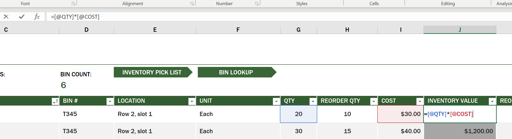
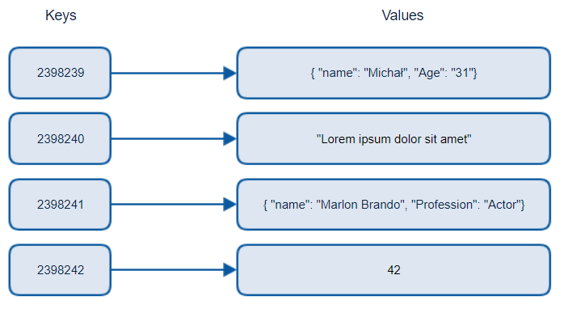

# Working with Data: Non-Relational Data

Data is not limited to relational databases. This lesson focuses on non-relational data and will cover the basic of spreadsheets and NoSQL.

## Spreadsheets

Spreadsheets are a popular way to store and explore data because it requires less work to setup and get started. In this lesson you'll learn the basic components of a spreadsheet, as well as formulas and functions. The examples will be illustrated with Microsoft Excel, but most of the parts and topics will have similar names and steps in comparison to other spreadsheet software. 

A spreadsheet is a file and will be accessible in the file system of a computer, device, or cloud based file system. The software itself may be browser based or an application that must be installed on a computer or downloaded as an app. In Excel these files are also defined as **workbooks** and this terminology will be used the remainder of this lesson.

A workbook contains one or more **worksheets**, where each worksheet are labeled by tabs. Within a worksheet are rectangles called **cells**, which will contain the actual data. A cell is the intersection of a row and column, where the columns are labeled with alphabetical characters and rows labeled numerically. Some spreadsheets will contain headers in the first few rows to describe the data in a cell.

With these basic elements of an Excel workbook, we'll use and an example from [Microsoft Templates](https://templates.office.com/) focused on an inventory to walk through some additional parts of a spreadsheet. 

### Managing an Inventory 

The spreadsheet file named "InventoryExample" is a formatted spreadsheet of items within an inventory that contains three worksheets, where the tabs are labeled "Inventory List", "Inventory Pick List" and "Bin Lookup". Row 4 of the Inventory List worksheet is the header, which describes the value of each cell in the header column.

There are instances where a cell is dependent on the values of other cells to generate its value. The Inventory List spreadsheet keeps track of the cost of every item in its inventory, but what if we need to know the value of everything in the inventory? [**Formulas**](https://support.microsoft.com/en-us/office/overview-of-formulas-34519a4e-1e8d-4f4b-84d4-d642c4f63263) perform actions on cell data and is used to calculate the cost of the inventory in this example. This spreadsheet used a formula in the Inventory Value column to calculate the value of each item by multiplying the quantity under the QTY header and its costs by the cells under the COST header. Double clicking or highlighting a cell will show the formula. You'll notice that formulas start with an equals sign, followed by the calculation or operation. 

We can use another formula to add all the values of Inventory Value together to get its total value. This could be calculated by adding each cell to generate the sum, but that can be a tedious task. Excel has [**functions**](https://support.microsoft.com/en-us/office/sum-function-043e1c7d-7726-4e80-8f32-07b23e057f89), or predefined formulas to perform calculations on cell values. Functions require arguments, which are the required values used to perform these calculations. When functions require more than one argument, they will need to be listed in a particular order or the function may not calculate the correct value. This example uses the SUM function, and uses the values of on Inventory Value as the argument to add generate the total listed under row 3, column B (also referred to as B3).

## NoSQL

NoSQL is an umbrella term for the different ways to store non-relational data and can be interpreted as "non-SQL", "non-relational" or  "not only SQL". These type of database systems can be categorized into 4 types.

> Source from [Michał Białecki Blog](https://www.michalbialecki.com/2018/03/18/azure-cosmos-db-key-value-database-cloud/)

[Key-value](https://docs.microsoft.com/en-us/azure/architecture/data-guide/big-data/non-relational-data#keyvalue-data-stores) databases pair unique keys, which are a unique identifier associated with a value. These pairs are stored using a [hash table](https://www.hackerearth.com/practice/data-structures/hash-tables/basics-of-hash-tables/tutorial/) with an appropriate hashing function.

> Source from [Microsoft](https://docs.microsoft.com/en-us/azure/cosmos-db/graph/graph-introduction#graph-database-by-example)

[Graph](https://docs.microsoft.com/en-us/azure/architecture/data-guide/big-data/non-relational-data#graph-data-stores) databases describe relationships in data and are represented as a collection of nodes and edges. A node represents an entity, something that exists in the real world such as a student or bank statement. Edges represent the relationship between two entities  Each node and edge have properties that provides additional information about each node and edges.

[Columnar](https://docs.microsoft.com/en-us/azure/architecture/data-guide/big-data/non-relational-data#columnar-data-stores) data stores organizes data into columns and rows like a relational data structure but each column is divided into groups called a column family, where the all the data under one column is related and can be retrieved and changed in one unit. 

### Document Data Stores with the Azure Cosmos DB Emulator

[Document](https://docs.microsoft.com/en-us/azure/architecture/data-guide/big-data/non-relational-data#document-data-stores) data stores build on the concept of a key-value data store and is made up of a series of fields and objects. This section will explore document databases with the Cosmos DB emulator.

#### The Cosmos DB Emulator

A Cosmos DB database fits the definition of "Not Only SQL" as you have choices on the type of non-relational database you'd like to use. The document database relies SQL to query the data. The previous lesson on SQL covers the basics, and we'll be able to apply these same queries to a document database here. We'll be using the Cosmos DB emulator, which allows us to create and explore a document database locally on a computer.

## Pre-Lecture Quiz

[Pre-lecture quiz]()

## 🚀 Challenge

## Post-Lecture Quiz

[Post-lecture quiz]()

## Review & Self Study

- There are some additional formatting and features added to this spreadsheet that this lesson does not cover. Microsoft has a [large library of documentation and videos](https://support.microsoft.com/excel) on Excel if you're interested in learning more.

- This architectural documentation details the characteristics in the different types of non-relational data: [Non-relational Data and NoSQL](https://docs.microsoft.com/en-us/azure/architecture/data-guide/big-data/non-relational-data)

## Assignment

[Assignment Title](assignment.md)
