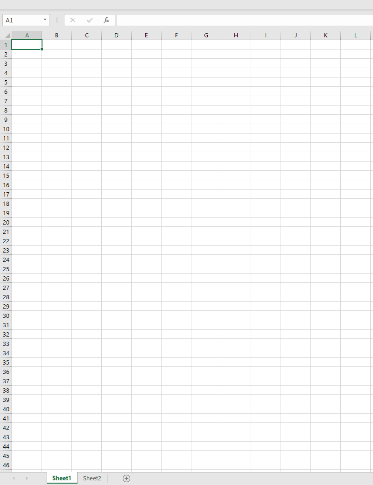

# Working with Data: Non-Relational Data

Data can come from various sources, and is not limited to relational databases. This lesson focuses on non relational data and will cover spreadsheets and NoSQL.

## Spreadsheets

Many data scientists will not pick spreadsheets as their first tool for various and valid reasons. However, it's a popular way to store and explore data because it requires less work to setup and get started. In this lesson you'll learn the basic components of a spreadsheet, how to apply formulas and functions, generating charts and pivot tables, and how to sort and filter a spreadsheet. This lesson provides foundational knowledge of spreadsheets in the rare event that you find yourself working with with them. The examples will be illustrated with Microsoft Excel, but most of the parts and topics will have similar names and steps in comparison to other spreadsheet software. 

A spreadsheet is a file and will be accessible in the file system of a computer, device, or cloud based file system. The software itself may be browser based or an application that must be installed on a computer or downloaded as an app. When it comes to Excel, these files are also defined as workbooks and this terminology will be used the remainder of this lesson.

A workbook contains one or more worksheets
Worksheets
Columns 
Row
Cell
Header

### Exploring Values
Date (slash or dash) times (colon)
Numbers
Text/alpha characters 
Autofill?

### Formulas and Functions
- How to start one (equal and cell id)
- formula bar
- copying by dragging over by fill handle
- Basic mathematics
- Sum
- Average
- XLookup/lookup functions -relationships

### Charts
- Creating a chart
- Pivot Tables

## NoSQL

### Types

Document
Key Value
Graph
Columnar

### 

  

## Pre-Lecture Quiz

[Pre-lecture quiz]()

## 🚀 Challenge

## Post-Lecture Quiz

[Post-lecture quiz]()

## Review & Self Study

## Assignment

[Assignment Title](assignment.md)
