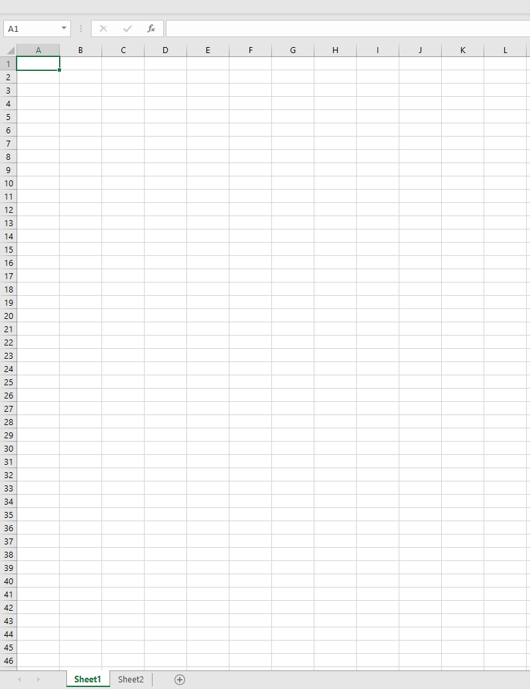
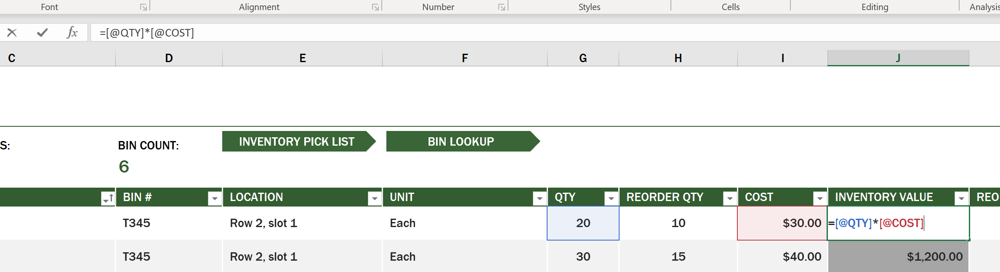
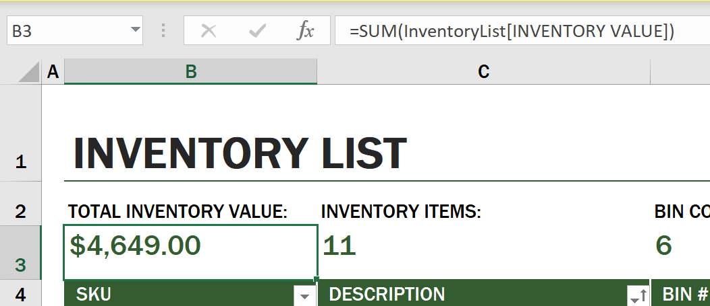
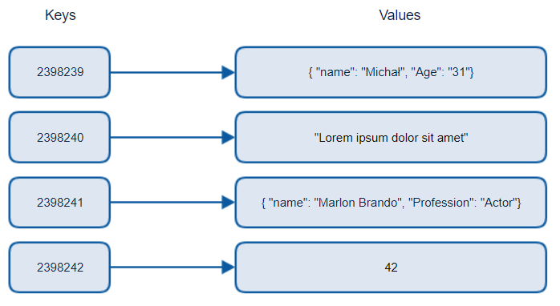
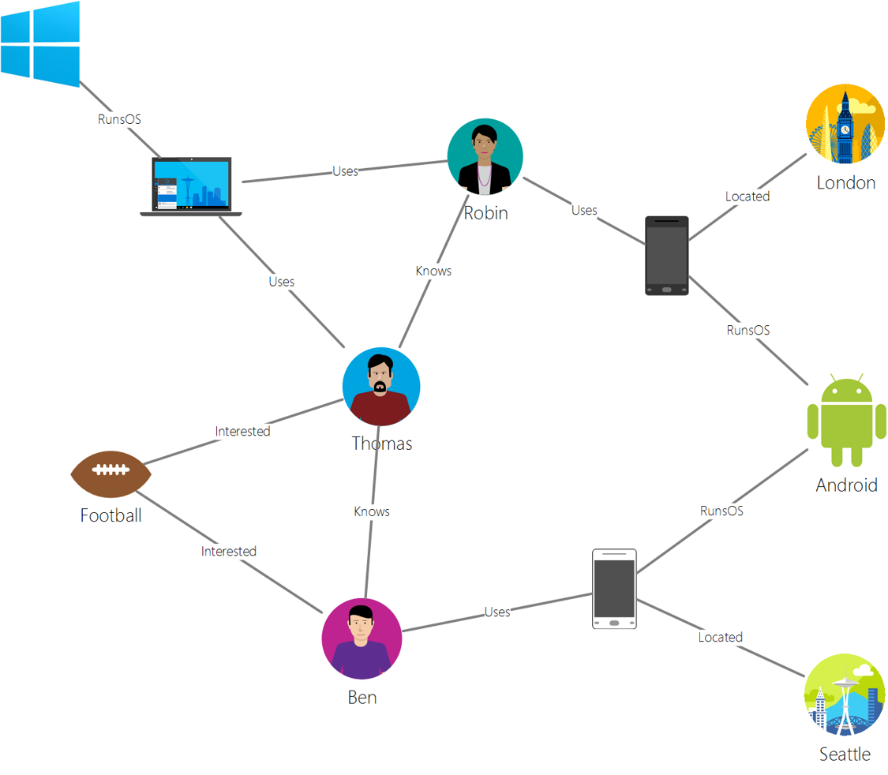
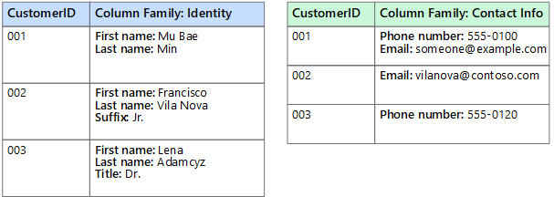
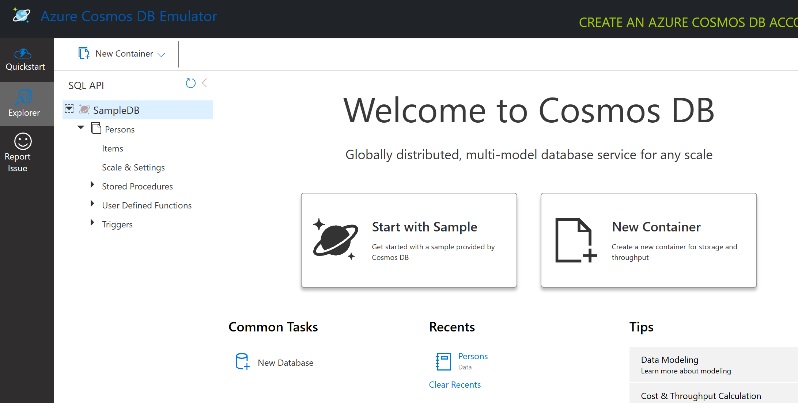
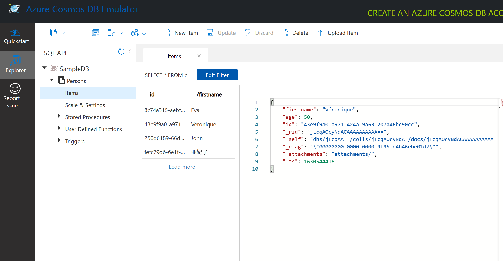
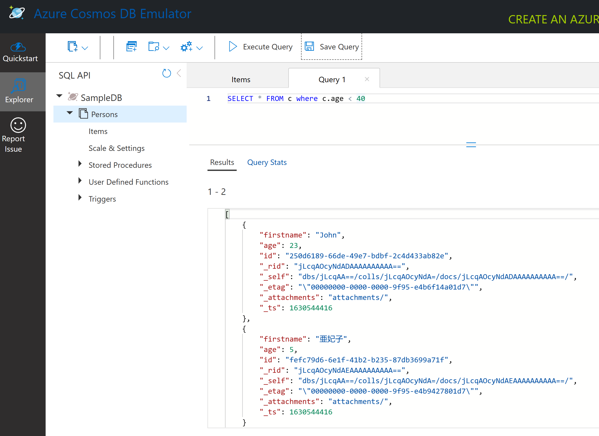

# डेटा के साथ कार्य करना: गैर-संबंधपरक डेटा

| ](../../../sketchnotes/06-NoSQL.png)|
|:---:|
|NoSQL डेटा के साथ काम करना - _Sketchnote by [@nitya](https://twitter.com/nitya)_ |

## [प्री-लेक्चर क्विज](https://purple-hill-04aebfb03.1.azurestaticapps.net/quiz/10)

डेटा रिलेशनल डेटाबेस तक सीमित नहीं है। यह पाठ गैर-संबंधपरक डेटा पर केंद्रित है और इसमें स्प्रेडशीट और NoSQL की मूल बातें शामिल होंगी।

## स्प्रेडशीट

स्प्रेडशीट डेटा को स्टोर और एक्सप्लोर करने का एक लोकप्रिय तरीका है क्योंकि इसे सेटअप करने और आरंभ करने के लिए कम काम की आवश्यकता होती है। इस पाठ में आप स्प्रेडशीट के बुनियादी घटकों के साथ-साथ सूत्रों और कार्यों के बारे में जानेंगे। उदाहरणों को Microsoft Excel के साथ चित्रित किया जाएगा, लेकिन अधिकांश भागों और विषयों में अन्य स्प्रेडशीट सॉफ़्टवेयर की तुलना में समान नाम और चरण होंगे।



स्प्रैडशीट एक फ़ाइल है और इसे कंप्यूटर, डिवाइस या क्लाउड आधारित फ़ाइल सिस्टम के फ़ाइल सिस्टम में एक्सेस किया जा सकता है। सॉफ़्टवेयर स्वयं ब्राउज़र आधारित या एक एप्लिकेशन हो सकता है जिसे कंप्यूटर पर इंस्टॉल किया जाना चाहिए या ऐप के रूप में डाउनलोड किया जाना चाहिए। Excel में इन फ़ाइलों को **कार्यपुस्तिका** के रूप में भी परिभाषित किया जाता है और इस शब्दावली का उपयोग इस पाठ के शेष भाग में किया जाएगा।

किसी कार्यपुस्तिका में एक या अधिक **कार्यपत्रक** होते हैं, जहां प्रत्येक कार्यपत्रक को टैब द्वारा लेबल किया जाता है। वर्कशीट के भीतर **सेल्स** नामक आयत होते हैं, जिनमें वास्तविक डेटा होगा। एक सेल एक पंक्ति और स्तंभ का प्रतिच्छेदन है, जहां स्तंभों को वर्णानुक्रमिक वर्णों और पंक्तियों को संख्यात्मक रूप से लेबल किया जाता है। कुछ स्प्रैडशीट्स में सेल में डेटा का वर्णन करने के लिए पहली कुछ पंक्तियों में हेडर होंगे।

Excel कार्यपुस्तिका के इन बुनियादी तत्वों के साथ, हम उपयोग करेंगे और [माइक्रोसॉफ्ट टेम्पलेट्स](https://templates.office.com/) के एक उदाहरण का उपयोग एक स्प्रैडशीट के कुछ अतिरिक्त भागों के माध्यम से चलने के लिए एक इन्वेंट्री पर केंद्रित होगा।

### एक सूची का प्रबंधन

"इन्वेंटरी उदाहरण" नाम की स्प्रैडशीट फ़ाइल एक इन्वेंट्री के भीतर आइटम्स की एक स्वरूपित स्प्रेडशीट है जिसमें तीन वर्कशीट होते हैं, जहां टैब को "इन्वेंटरी लिस्ट", "इन्वेंटरी पिक लिस्ट" और "बिन लुकअप" के रूप में लेबल किया जाता है। इन्वेंटरी लिस्ट वर्कशीट की पंक्ति 4 हेडर है, जो हेडर कॉलम में प्रत्येक सेल के मूल्य का वर्णन करता है।



ऐसे उदाहरण हैं जहां एक सेल अपना मूल्य उत्पन्न करने के लिए अन्य कोशिकाओं के मूल्यों पर निर्भर है। इन्वेंटरी लिस्ट स्प्रैडशीट अपनी इन्वेंट्री में प्रत्येक आइटम की लागत का ट्रैक रखती है, लेकिन क्या होगा यदि हमें इन्वेंट्री में हर चीज का मूल्य जानने की आवश्यकता है? [**सूत्र**](https://support.microsoft.com/en-us/office/overview-of-formulas-34519a4e-1e8d-4f4b-84d4-d642c4f63263) सेल डेटा पर कार्रवाई करते हैं और इसका उपयोग गणना करने के लिए किया जाता है इस उदाहरण में सूची की लागत। इस स्प्रैडशीट ने प्रत्येक आइटम के मूल्य की गणना करने के लिए इन्वेंटरी वैल्यू कॉलम में एक सूत्र का उपयोग किया है, जो कि QTY हेडर के तहत मात्रा को गुणा करके और इसकी लागत को COST हेडर के तहत सेल द्वारा गुणा करके किया जाता है। किसी सेल पर डबल क्लिक या हाईलाइट करना फॉर्मूला दिखाएगा। आप देखेंगे कि सूत्र बराबर चिह्न से शुरू होते हैं, उसके बाद गणना या संचालन होता है।



हम इसका कुल मूल्य प्राप्त करने के लिए इन्वेंटरी वैल्यू के सभी मूल्यों को एक साथ जोड़ने के लिए एक अन्य सूत्र का उपयोग कर सकते हैं। योग उत्पन्न करने के लिए प्रत्येक सेल को जोड़कर इसकी गणना की जा सकती है, लेकिन यह एक कठिन काम हो सकता है। Excel में [**functions**](https://support.microsoft.com/en-us/office/sum-function-043e1c7d-7726-4e80-8f32-07b23e057f89), या सेल मानों पर गणना करने के लिए पूर्वनिर्धारित सूत्र हैं . फ़ंक्शंस के लिए तर्कों की आवश्यकता होती है, जो इन गणनाओं को करने के लिए उपयोग किए जाने वाले आवश्यक मान हैं। जब फ़ंक्शंस को एक से अधिक तर्क की आवश्यकता होती है, तो उन्हें किसी विशेष क्रम में सूचीबद्ध करने की आवश्यकता होगी या फ़ंक्शन सही मान की गणना नहीं कर सकता है। यह उदाहरण SUM फ़ंक्शन का उपयोग करता है, और पंक्ति 3, कॉलम B (जिसे B3 भी कहा जाता है) के तहत सूचीबद्ध कुल जोड़ने के तर्क के रूप में इन्वेंट्री वैल्यू के मानों का उपयोग करता है।

## नोएसक्यूएल (NoSQL)

NoSQL गैर-संबंधपरक डेटा को संग्रहीत करने के विभिन्न तरीकों के लिए एक छत्र शब्द है और इसे "गैर-एसक्यूएल", "गैर-संबंधपरक" या "न केवल एसक्यूएल" के रूप में व्याख्या किया जा सकता है। इस प्रकार के डेटाबेस सिस्टम को 4 प्रकारों में वर्गीकृत किया जा सकता है।


> [माइकल बियालेकी ब्लॉग](https://www.michalbialecki.com/2018/03/18/azure-cosmos-db-key-value-database-cloud/) से स्रोत

[मौलिक मूल्य](https://docs.microsoft.com/en-us/azure/architecture/data-guide/big-data/non-relational-data#keyvalue-data-stores) डेटाबेस अद्वितीय कुंजी जोड़ते हैं, जो एक मूल्य से जुड़े एक अद्वितीय पहचानकर्ता हैं। इन जोड़ियों को एक उपयुक्त हैशिंग फ़ंक्शन के साथ [हैश टेबल](https://www.hackerearth.com/practice/data-structures/hash-tables/basics-of-hash-tables/tutorial/) का उपयोग करके संग्रहीत किया जाता है।


> [माइक्रोसॉफ्ट](https://docs.microsoft.com/en-us/azure/cosmos-db/graph/graph-introduction#graph-database-by-example) से स्रोत

[ग्राफ](https://docs.microsoft.com/en-us/azure/architecture/data-guide/big-data/non-relational-data#graph-data-stores) डेटाबेस डेटा में संबंधों का वर्णन करते हैं और उनका प्रतिनिधित्व करते हैं नोड्स और किनारों के संग्रह के रूप में। एक नोड एक इकाई का प्रतिनिधित्व करता है, कुछ ऐसा जो वास्तविक दुनिया में मौजूद है जैसे कि छात्र या बैंक स्टेटमेंट। किनारे दो संस्थाओं के बीच संबंध का प्रतिनिधित्व करते हैं प्रत्येक नोड और किनारे में ऐसे गुण होते हैं जो प्रत्येक नोड और किनारों के बारे में अतिरिक्त जानकारी प्रदान करते हैं।



[Columnar](https://docs.microsoft.com/en-us/azure/architecture/data-guide/big-data/non-relational-data#columnar-data-stores) डेटा स्टोर डेटा को कॉलम और पंक्तियों में व्यवस्थित करता है एक संबंधपरक डेटा संरचना की तरह लेकिन प्रत्येक कॉलम को एक कॉलम परिवार नामक समूहों में विभाजित किया जाता है, जहां एक कॉलम के तहत सभी डेटा संबंधित होते हैं और एक इकाई में पुनर्प्राप्त और बदला जा सकता है।

### Azure Cosmos DB के साथ दस्तावेज़ डेटा स्टोर

[दस्तावेज़](https://docs.microsoft.com/en-us/azure/architecture/data-guide/big-data/non-relational-data#document-data-stores) डेटा स्टोर एक की अवधारणा पर निर्मित होते हैं कुंजी-मूल्य डेटा स्टोर और फ़ील्ड और ऑब्जेक्ट्स की एक श्रृंखला से बना है। यह खंड कॉसमॉस डीबी एमुलेटर के साथ दस्तावेज़ डेटाबेस का पता लगाएगा।

एक Cosmos DB डेटाबेस "न केवल SQL" की परिभाषा में फिट बैठता है, जहाँ Cosmos DB का दस्तावेज़ डेटाबेस डेटा को क्वेरी करने के लिए SQL पर निर्भर करता है। SQL पर [पिछला पाठ](../../05-relational-databases/README.md) भाषा की मूल बातें शामिल करता है, और हम यहां दस्तावेज़ डेटाबेस में कुछ समान प्रश्नों को लागू करने में सक्षम होंगे। हम Cosmos DB Emulator का उपयोग करेंगे, जो हमें कंप्यूटर पर स्थानीय रूप से एक दस्तावेज़ डेटाबेस बनाने और एक्सप्लोर करने की अनुमति देता है। एमुलेटर के बारे में और पढ़ें [यहां](https://docs.microsoft.com/en-us/azure/cosmos-db/local-emulator?tabs=ssl-netstd21)।

एक दस्तावेज़ फ़ील्ड और ऑब्जेक्ट मानों का संग्रह है, जहां फ़ील्ड वर्णन करते हैं कि ऑब्जेक्ट मान क्या दर्शाता है। नीचे एक दस्तावेज़ का एक उदाहरण है।

```json
{
    "firstname": "Eva",
    "age": 44,
    "id": "8c74a315-aebf-4a16-bb38-2430a9896ce5",
    "_rid": "bHwDAPQz8s0BAAAAAAAAAA==",
    "_self": "dbs/bHwDAA==/colls/bHwDAPQz8s0=/docs/bHwDAPQz8s0BAAAAAAAAAA==/",
    "_etag": "\"00000000-0000-0000-9f95-010a691e01d7\"",
    "_attachments": "attachments/",
    "_ts": 1630544034
}
```

इस दस्तावेज़ में रुचि के क्षेत्र हैं: `firstname`, `id`, और `age`। अंडरस्कोर के साथ बाकी फ़ील्ड कॉसमॉस डीबी द्वारा उत्पन्न किए गए थे।

#### कॉसमॉस डीबी एम्यूलेटर के साथ डेटा एक्सप्लोर करना

आप एमुलेटर [यहां विंडोज के लिए](https://aka.ms/cosmosdb-emulator) डाउनलोड और इंस्टॉल कर सकते हैं। इस [दस्तावेज़ीकरण](https://docs.microsoft.com/en-us/azure/cosmos-db/local-emulator?tabs=ssl-netstd21#run-on-linux-macos) को देखें। macOS और Linux के लिए एमुलेटर चलाएँ।

एमुलेटर एक ब्राउज़र विंडो लॉन्च करता है, जहां एक्सप्लोरर व्यू आपको दस्तावेजों का पता लगाने की अनुमति देता है।



यदि आप साथ चल रहे हैं, तो नमूना डीबी नामक नमूना डेटाबेस उत्पन्न करने के लिए "नमूना के साथ प्रारंभ करें" पर क्लिक करें। यदि आप तीर पर क्लिक करके नमूना डीबी का विस्तार करते हैं तो आपको `Persons` नामक एक कंटेनर मिलेगा, एक कंटेनर में वस्तुओं का संग्रह होता है, जो कंटेनर के भीतर दस्तावेज होते हैं। आप `Items` के तहत चार अलग-अलग दस्तावेजों का पता लगा सकते हैं।



#### कॉसमॉस डीबी एमुलेटर के साथ दस्तावेज़ डेटा को क्वेरी करना

हम नए SQL क्वेरी बटन (बाएं से दूसरा बटन) पर क्लिक करके नमूना डेटा को क्वेरी कर सकते हैं।

`SELECT * FROM c` कंटेनर में सभी दस्तावेज लौटाता है। आइए एक क्लॉज जोड़ें और 40 से कम उम्र के सभी लोगों को खोजें।

`SELECT * FROM c where c.age < 40`

 

क्वेरी दो दस्तावेज़ लौटाती है, ध्यान दें कि प्रत्येक दस्तावेज़ के लिए आयु मान 40 . से कम है.

#### JSON और दस्तावेज़

यदि आप जावास्क्रिप्ट ऑब्जेक्ट नोटेशन (JSON) से परिचित हैं, तो आप देखेंगे कि दस्तावेज़ JSON के समान दिखते हैं। इस निर्देशिका में अधिक डेटा वाली एक `PersonsData.json` फ़ाइल है जिसे आप `Upload Item` बटन के माध्यम से एम्यूलेटर में व्यक्ति कंटेनर में अपलोड कर सकते हैं।

ज्यादातर मामलों में, JSON डेटा लौटाने वाले API को सीधे दस्तावेज़ डेटाबेस में स्थानांतरित और संग्रहीत किया जा सकता है। नीचे एक और दस्तावेज है, यह माइक्रोसॉफ्ट ट्विटर अकाउंट से ट्वीट्स का प्रतिनिधित्व करता है जिसे ट्विटर एपीआई (API) का उपयोग करके पुनर्प्राप्त किया गया था, फिर कॉसमॉस डीबी में डाला गया था।

```json
{
    "created_at": "2021-08-31T19:03:01.000Z",
    "id": "1432780985872142341",
    "text": "Blank slate. Like this tweet if you’ve ever painted in Microsoft Paint before. https://t.co/cFeEs8eOPK",
    "_rid": "dhAmAIUsA4oHAAAAAAAAAA==",
    "_self": "dbs/dhAmAA==/colls/dhAmAIUsA4o=/docs/dhAmAIUsA4oHAAAAAAAAAA==/",
    "_etag": "\"00000000-0000-0000-9f84-a0958ad901d7\"",
    "_attachments": "attachments/",
    "_ts": 1630537000
}
```

इस दस्तावेज़ में रुचि के क्षेत्र हैं: `created_at`, `id`, और `text`।

## चुनौती


एक `TwitterData.json` फ़ाइल है जिसे आप नमूना डीबी डेटाबेस पर अपलोड कर सकते हैं। यह अनुशंसा की जाती है कि आप इसे एक अलग कंटेनर में जोड़ें। इसके द्वारा किया जा सकता है:

1. ऊपर दाईं ओर नए कंटेनर बटन पर क्लिक करना
1. कंटेनर के लिए एक कंटेनर आईडी बनाने के लिए मौजूदा डेटाबेस (SampleDB) का चयन करना
1. विभाजन कुंजी को `/id` . पर सेट करना
1. ओके पर क्लिक करना (आप इस दृश्य में शेष जानकारी को अनदेखा कर सकते हैं क्योंकि यह आपकी मशीन पर स्थानीय रूप से चलने वाला एक छोटा डेटासेट है)
1. अपना नया कंटेनर खोलें और 'आइटम अपलोड करें' बटन के साथ Twitter डेटा फ़ाइल अपलोड करें

टेक्स्ट फ़ील्ड में Microsoft वाले दस्तावेज़ ढूँढने के लिए कुछ चुनिंदा क्वेरीज़ चलाने का प्रयास करें। संकेत: [LIKE कीवर्ड](https://docs.microsoft.com/en-us/azure/cosmos-db/sql/sql-query-keywords#using-like-with-the--wildcard-character) का उपयोग करने का प्रयास करें

## [व्याख्यान के बाद प्रश्नोत्तरी](https://purple-hill-04aebfb03.1.azurestaticapps.net/quiz/11)


## समीक्षा और आत्म अध्ययन

- इस स्प्रैडशीट में कुछ अतिरिक्त स्वरूपण और विशेषताएं जोड़ी गई हैं जिन्हें इस पाठ में शामिल नहीं किया गया है। यदि आप अधिक सीखने में रुचि रखते हैं, तो Microsoft के पास एक्सेल पर [दस्तावेज़ीकरण और वीडियो की बड़ी लाइब्रेरी](https://support.microsoft.com/excel) है।

- यह वास्तु दस्तावेज विभिन्न प्रकार के गैर-संबंधपरक डेटा में विशेषताओं का विवरण देता है: [गैर-संबंधपरक डेटा और NoSQL](https://docs.microsoft.com/en-us/azure/architecture/data-guide/big-data/non-relational-data))

- कॉसमॉस डीबी एक क्लाउड आधारित गैर-संबंधपरक डेटाबेस है जो इस पाठ में उल्लिखित विभिन्न नोएसक्यूएल प्रकारों को भी संग्रहीत कर सकता है। इस [कॉसमॉस डीबी माइक्रोसॉफ्ट लर्न मॉड्यूल](https://docs.microsoft.com/en-us/learn/paths/work-with-nosql-data-in-azure-cosmos-db/) में इन प्रकारों के बारे में और जानें 

## कार्यभार

[सोडा लाभ](assignment.hi.md)
