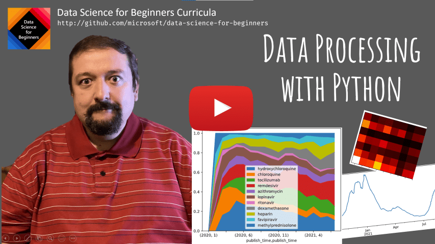
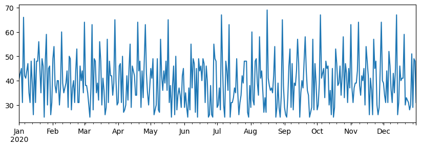
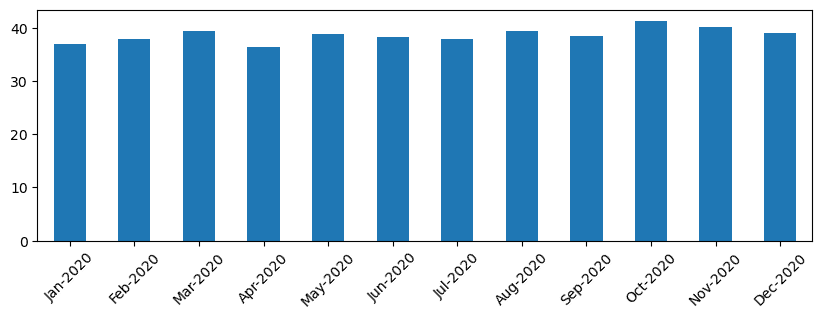
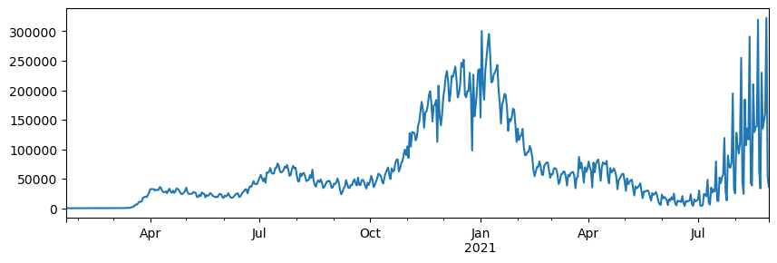
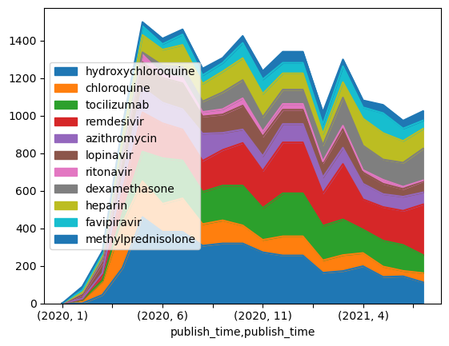

# Working with Data: Python and the Pandas Library

|  ](../../sketchnotes/07-WorkWithPython.png) |
| :-------------------------------------------------------------------------------------------------------: |
|                 Working With Python - _Sketchnote by [@nitya](https://twitter.com/nitya)_                 |

[](https://youtu.be/dZjWOGbsN4Y)

While databases offer very efficient ways to store data and query them using query languages, the most flexible way of data processing is writing your own program to manipulate data. In many cases, doing a database query would be a more effective way. However in some cases when more complex data processing is needed, it cannot be done easily using SQL. 
Data processing can be programmed in any programming language, but there are certain languages that are higher level with respect to working with data. Data scientists typically prefer one of the following languages:

* **[Python](https://www.python.org/)**, a general-purpose programming language, which is often considered one of the best options for beginners due to its simplicity. Python has a lot of additional libraries that can help you solve many practical problems, such as extracting your data from ZIP archive, or converting picture to grayscale. In addition to data science, Python is also often used for web development. 
* **[R](https://www.r-project.org/)** is a traditional toolbox developed with statistical data processing in mind. It also contains large repository of libraries (CRAN), making it a good choice for data processing. However, R is not a general-purpose programming language, and is rarely used outside of data science domain.
* **[Julia](https://julialang.org/)** is another language developed specifically for data science. It is intended to give better performance than Python, making it a great tool for scientific experimentation.

In this lesson, we will focus on using Python for simple data processing. We will assume basic familiarity with the language. If you want a deeper tour of Python, you can refer to one of the following resources:

* [Learn Python in a Fun Way with Turtle Graphics and Fractals](https://github.com/shwars/pycourse) - GitHub-based quick intro course into Python Programming
* [Take your First Steps with Python](https://docs.microsoft.com/en-us/learn/paths/python-first-steps/?WT.mc_id=academic-77958-bethanycheum) Learning Path on [Microsoft Learn](http://learn.microsoft.com/?WT.mc_id=academic-77958-bethanycheum)

Data can come in many forms. In this lesson, we will consider three forms of data - **tabular data**, **text** and **images**.

We will focus on a few examples of data processing, instead of giving you full overview of all related libraries. This would allow you to get the main idea of what's possible, and leave you with understanding on where to find solutions to your problems when you need them.

> **Most useful advice**. When you need to perform certain operation on data that you do not know how to do, try searching for it in the internet. [Stackoverflow](https://stackoverflow.com/) usually contains a lot of useful code sample in Python for many typical tasks. 


## [Pre-lecture quiz](https://purple-hill-04aebfb03.1.azurestaticapps.net/quiz/12)

## Tabular Data and Dataframes

You have already met tabular data when we talked about relational databases. When you have a lot of data, and it is contained in many different linked tables, it definitely makes sense to use SQL for working with it. However, there are many cases when we have a table of data, and we need to gain some **understanding** or **insights** about this data, such as the distribution, correlation between values, etc. In data science, there are a lot of cases when we need to perform some transformations of the original data, followed by visualization. Both those steps can be easily done using Python.

There are two most useful libraries in Python that can help you deal with tabular data:
* **[Pandas](https://pandas.pydata.org/)** allows you to manipulate so-called **Dataframes**, which are analogous to relational tables. You can have named columns, and perform different operations on row, columns and dataframes in general. 
* **[Numpy](https://numpy.org/)** is a library for working with **tensors**, i.e. multi-dimensional **arrays**. Array has values of the same underlying type, and it is simpler than dataframe, but it offers more mathematical operations, and creates less overhead.

There are also a couple of other libraries you should know about:
* **[Matplotlib](https://matplotlib.org/)** is a library used for data visualization and plotting graphs
* **[SciPy](https://www.scipy.org/)** is a library with some additional scientific functions. We have already come across this library when talking about probability and statistics

Here is a piece of code that you would typically use to import those libraries in the beginning of your Python program:
```python
import numpy as np
import pandas as pd
import matplotlib.pyplot as plt
from scipy import ... # you need to specify exact sub-packages that you need
``` 

Pandas is centered around a few basic concepts.

### Series 

**Series** is a sequence of values, similar to a list or numpy array. The main difference is that series also has an **index**, and when we operate on series (eg., add them), the index is taken into account. Index can be as simple as integer row number (it is the index used by default when creating a series from list or array), or it can have a complex structure, such as date interval.

> **Note**: There is some introductory Pandas code in the accompanying notebook [`notebook.ipynb`](notebook.ipynb). We only outline some the examples here, and you are definitely welcome to check out the full notebook.

Consider an example: we want to analyze sales of our ice-cream spot. Let's generate a series of sales numbers (number of items sold each day) for some time period:

```python
start_date = "Jan 1, 2020"
end_date = "Mar 31, 2020"
idx = pd.date_range(start_date,end_date)
print(f"Length of index is {len(idx)}")
items_sold = pd.Series(np.random.randint(25,50,size=len(idx)),index=idx)
items_sold.plot()
```


Now suppose that each week we are organizing a party for friends, and we take additional 10 packs of ice-cream for a party. We can create another series, indexed by week, to demonstrate that:
```python
additional_items = pd.Series(10,index=pd.date_range(start_date,end_date,freq="W"))
```
When we add two series together, we get total number:
```python
total_items = items_sold.add(additional_items,fill_value=0)
total_items.plot()
```


> **Note** that we are not using simple syntax `total_items+additional_items`. If we did, we would have received a lot of `NaN` (*Not a Number*) values in the resulting series. This is because there are missing values for some of the index point in the `additional_items` series, and adding `Nan` to anything results in `NaN`. Thus we need to specify `fill_value` parameter during addition.

With time series, we can also **resample** the series with different time intervals. For example, suppose we want to compute mean sales volume monthly. We can use the following code:
```python
monthly = total_items.resample("1M").mean()
ax = monthly.plot(kind='bar')
```


### DataFrame

A DataFrame is essentially a collection of series with the same index. We can combine several series together into a DataFrame:
```python
a = pd.Series(range(1,10))
b = pd.Series(["I","like","to","play","games","and","will","not","change"],index=range(0,9))
df = pd.DataFrame([a,b])
```
This will create a horizontal table like this:
|     | 0   | 1    | 2   | 3   | 4      | 5   | 6      | 7    | 8    |
| --- | --- | ---- | --- | --- | ------ | --- | ------ | ---- | ---- |
| 0   | 1   | 2    | 3   | 4   | 5      | 6   | 7      | 8    | 9    |
| 1   | I   | like | to  | use | Python | and | Pandas | very | much |

We can also use Series as columns, and specify column names using dictionary:
```python
df = pd.DataFrame({ 'A' : a, 'B' : b })
```
This will give us a table like this:

|     | A   | B      |
| --- | --- | ------ |
| 0   | 1   | I      |
| 1   | 2   | like   |
| 2   | 3   | to     |
| 3   | 4   | use    |
| 4   | 5   | Python |
| 5   | 6   | and    |
| 6   | 7   | Pandas |
| 7   | 8   | very   |
| 8   | 9   | much   |

**Note** that we can also get this table layout by transposing the previous table, eg. by writing 
```python
df = pd.DataFrame([a,b]).T..rename(columns={ 0 : 'A', 1 : 'B' })
```
Here `.T` means the operation of transposing the DataFrame, i.e. changing rows and columns, and `rename` operation allows us to rename columns to match the previous example.

Here are a few most important operations we can perform on DataFrames:

**Column selection**. We can select individual columns by writing `df['A']` - this operation returns a Series. We can also select a subset of columns into another DataFrame by writing `df[['B','A']]` - this return another DataFrame.

**Filtering** only certain rows by criteria. For example, to leave only rows with column `A` greater than 5, we can write `df[df['A']>5]`.

> **Note**: The way filtering works is the following. The expression `df['A']<5` returns a boolean series, which indicates whether expression is `True` or `False` for each element of the original series `df['A']`. When boolean series is used as an index, it returns subset of rows in the DataFrame. Thus it is not possible to use arbitrary Python boolean expression, for example, writing `df[df['A']>5 and df['A']<7]` would be wrong. Instead, you should use special `&` operation on boolean series, writing `df[(df['A']>5) & (df['A']<7)]` (*brackets are important here*).

**Creating new computable columns**. We can easily create new computable columns for our DataFrame by using intuitive expression like this:
```python
df['DivA'] = df['A']-df['A'].mean() 
``` 
This example calculates divergence of A from its mean value. What actually happens here is we are computing a series, and then assigning this series to the left-hand-side, creating another column. Thus, we cannot use any operations that are not compatible with series, for example, the code below is wrong:
```python
# Wrong code -> df['ADescr'] = "Low" if df['A'] < 5 else "Hi"
df['LenB'] = len(df['B']) # <- Wrong result
``` 
The latter example, while being syntactically correct, gives us wrong result, because it assigns the length of series `B` to all values in the column, and not the length of individual elements as we intended.

If we need to compute complex expressions like this, we can use `apply` function. The last example can be written as follows:
```python
df['LenB'] = df['B'].apply(lambda x : len(x))
# or 
df['LenB'] = df['B'].apply(len)
```

After operations above, we will end up with the following DataFrame:

|     | A   | B      | DivA | LenB |
| --- | --- | ------ | ---- | ---- |
| 0   | 1   | I      | -4.0 | 1    |
| 1   | 2   | like   | -3.0 | 4    |
| 2   | 3   | to     | -2.0 | 2    |
| 3   | 4   | use    | -1.0 | 3    |
| 4   | 5   | Python | 0.0  | 6    |
| 5   | 6   | and    | 1.0  | 3    |
| 6   | 7   | Pandas | 2.0  | 6    |
| 7   | 8   | very   | 3.0  | 4    |
| 8   | 9   | much   | 4.0  | 4    |

**Selecting rows based on numbers** can be done using `iloc` construct. For example, to select first 5 rows from the DataFrame:
```python
df.iloc[:5]
```

**Grouping** is often used to get a result similar to *pivot tables* in Excel. Suppose that we want to compute mean value of column `A` for each given number of `LenB`. Then we can group our DataFrame by `LenB`, and call `mean`:
```python
df.groupby(by='LenB').mean()
```
If we need to compute mean and the number of elements in the group, then we can use more complex `aggregate` function:
```python
df.groupby(by='LenB') \
 .aggregate({ 'DivA' : len, 'A' : lambda x: x.mean() }) \
 .rename(columns={ 'DivA' : 'Count', 'A' : 'Mean'})
```
This gives us the following table:

| LenB | Count | Mean     |
| ---- | ----- | -------- |
| 1    | 1     | 1.000000 |
| 2    | 1     | 3.000000 |
| 3    | 2     | 5.000000 |
| 4    | 3     | 6.333333 |
| 6    | 2     | 6.000000 |

### Getting Data

We have seen how easy it is to construct Series and DataFrames from Python objects. However, data usually comes in the form of a text file, or an Excel table. Luckily, Pandas offers us a simple way to load data from disk. For example, reading CSV file is as simple as this:
```python
df = pd.read_csv('file.csv')
```
We will see more examples of loading data, including fetching it from external web sites, in the "Challenge" section


### Printing and Plotting

A Data Scientist often has to explore the data, thus it is important to be able to visualize it. When DataFrame is big, many times we want just to make sure we are doing everything correctly by printing out the first few rows. This can be done by calling `df.head()`. If you are running it from Jupyter Notebook, it will print out the DataFrame in a nice tabular form.

We have also seen the usage of `plot` function to visualize some columns. While `plot` is very useful for many tasks, and supports many different graph types via `kind=` parameter, you can always use raw `matplotlib` library to plot something more complex. We will cover data visualization in detail in separate course lessons.

This overview covers most important concepts of Pandas, however, the library is very rich, and there is no limit to what you can do with it! Let's now apply this knowledge for solving specific problem.

## 🚀 Challenge 1: Analyzing COVID Spread

First problem we will focus on is modelling of epidemic spread of COVID-19. In order to do that, we will use the data on the number of infected individuals in different countries, provided by the [Center for Systems Science and Engineering](https://systems.jhu.edu/) (CSSE) at [Johns Hopkins University](https://jhu.edu/). Dataset is available in [this GitHub Repository](https://github.com/CSSEGISandData/COVID-19).

Since we want to demonstrate how to deal with data, we invite you to open [`notebook-covidspread.ipynb`](notebook-covidspread.ipynb) and read it from top to bottom. You can also execute cells, and do some challenges that we have left for you at the end.



> If you do not know how to run code in Jupyter Notebook, have a look at [this article](https://soshnikov.com/education/how-to-execute-notebooks-from-github/).

## Working with Unstructured Data

While data very often comes in tabular form, in some cases we need to deal with less structured data, for example, text or images. In this case, to apply data processing techniques we have seen above, we need to somehow **extract** structured data. Here are a few examples:

* Extracting keywords from text, and seeing how often those keywords appear
* Using neural networks to extract information about objects on the picture
* Getting information on emotions of people on video camera feed

## 🚀 Challenge 2: Analyzing COVID Papers

In this challenge, we will continue with the topic of COVID pandemic, and focus on processing scientific papers on the subject. There is [CORD-19 Dataset](https://www.kaggle.com/allen-institute-for-ai/CORD-19-research-challenge) with more than 7000 (at the time of writing) papers on COVID, available with metadata and abstracts (and for about half of them there is also full text provided).

A full example of analyzing this dataset using [Text Analytics for Health](https://docs.microsoft.com/azure/cognitive-services/text-analytics/how-tos/text-analytics-for-health/?WT.mc_id=academic-77958-bethanycheum) cognitive service is described [in this blog post](https://soshnikov.com/science/analyzing-medical-papers-with-azure-and-text-analytics-for-health/). We will discuss simplified version of this analysis.

> **NOTE**: We do not provide a copy of the dataset as part of this repository. You may first need to download the [`metadata.csv`](https://www.kaggle.com/allen-institute-for-ai/CORD-19-research-challenge?select=metadata.csv) file from [this dataset on Kaggle](https://www.kaggle.com/allen-institute-for-ai/CORD-19-research-challenge). Registration with Kaggle may be required. You may also download the dataset without registration [from here](https://ai2-semanticscholar-cord-19.s3-us-west-2.amazonaws.com/historical_releases.html), but it will include all full texts in addition to metadata file.

Open [`notebook-papers.ipynb`](notebook-papers.ipynb) and read it from top to bottom. You can also execute cells, and do some challenges that we have left for you at the end.



## Processing Image Data

Recently, very powerful AI models have been developed that allow us to understand images. There are many tasks that can be solved using pre-trained neural networks, or cloud services. Some examples include:

* **Image Classification**, which can help you categorize the image into one of the pre-defined classes. You can easily train your own image classifiers using services such as [Custom Vision](https://azure.microsoft.com/services/cognitive-services/custom-vision-service/?WT.mc_id=academic-77958-bethanycheum)
* **Object Detection** to detect different objects in the image. Services such as [computer vision](https://azure.microsoft.com/services/cognitive-services/computer-vision/?WT.mc_id=academic-77958-bethanycheum) can detect a number of common objects, and you can train [Custom Vision](https://azure.microsoft.com/services/cognitive-services/custom-vision-service/?WT.mc_id=academic-77958-bethanycheum) model to detect some specific objects of interest.
* **Face Detection**, including Age, Gender and Emotion detection. This can be done via [Face API](https://azure.microsoft.com/services/cognitive-services/face/?WT.mc_id=academic-77958-bethanycheum).

All those cloud services can be called using [Python SDKs](https://docs.microsoft.com/samples/azure-samples/cognitive-services-python-sdk-samples/cognitive-services-python-sdk-samples/?WT.mc_id=academic-77958-bethanycheum), and thus can be easily incorporated into your data exploration workflow. 

Here are some examples of exploring data from Image data sources:
* In the blog post [How to Learn Data Science without Coding](https://soshnikov.com/azure/how-to-learn-data-science-without-coding/) we explore Instagram photos, trying to understand what makes people give more likes to a photo. We first extract as much information from pictures as possible using [computer vision](https://azure.microsoft.com/services/cognitive-services/computer-vision/?WT.mc_id=academic-77958-bethanycheum), and then use [Azure Machine Learning AutoML](https://docs.microsoft.com/azure/machine-learning/concept-automated-ml/?WT.mc_id=academic-77958-bethanycheum) to build interpretable model.
* In [Facial Studies Workshop](https://github.com/CloudAdvocacy/FaceStudies) we use [Face API](https://azure.microsoft.com/services/cognitive-services/face/?WT.mc_id=academic-77958-bethanycheum) to extract emotions on people on photographs from events, in order to try to understand what makes people happy. 

## Conclusion

Whether you already have structured or unstructured data, using Python you can perform all steps related to data processing and understanding. It is probably the most flexible way of data processing, and that is the reason the majority of data scientists use Python as their primary tool. Learning Python in depth is probably a good idea if you are serious about your data science journey!


## [Post-lecture quiz](https://purple-hill-04aebfb03.1.azurestaticapps.net/quiz/13)

## Review & Self Study

**Books**
* [Wes McKinney. Python for Data Analysis: Data Wrangling with Pandas, NumPy, and IPython](https://www.amazon.com/gp/product/1491957662)

**Online Resources**
* Official [10 minutes to Pandas](https://pandas.pydata.org/pandas-docs/stable/user_guide/10min.html) tutorial
* [Documentation on Pandas Visualization](https://pandas.pydata.org/pandas-docs/stable/user_guide/visualization.html)

**Learning Python**
* [Learn Python in a Fun Way with Turtle Graphics and Fractals](https://github.com/shwars/pycourse)
* [Take your First Steps with Python](https://docs.microsoft.com/learn/paths/python-first-steps/?WT.mc_id=academic-77958-bethanycheum) Learning Path on [Microsoft Learn](http://learn.microsoft.com/?WT.mc_id=academic-77958-bethanycheum)

## Assignment

[Perform more detailed data study for the challenges above](assignment.md)

## Credits

This lesson has been authored with ♥️ by [Dmitry Soshnikov](http://soshnikov.com)
