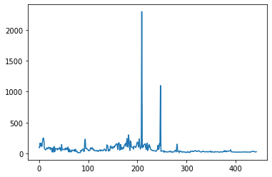
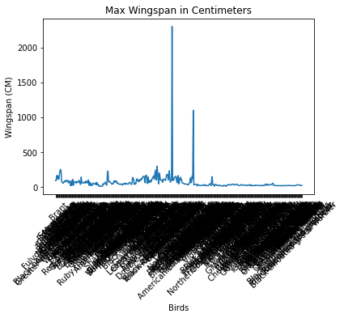
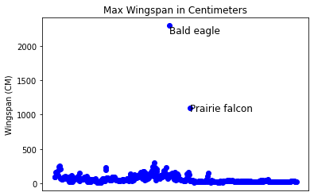
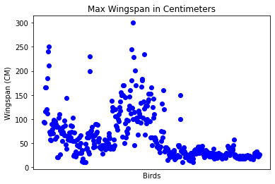
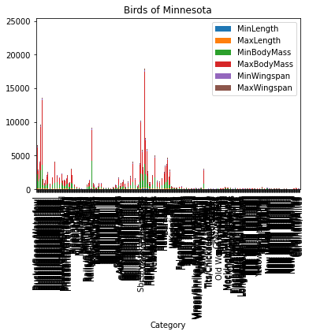
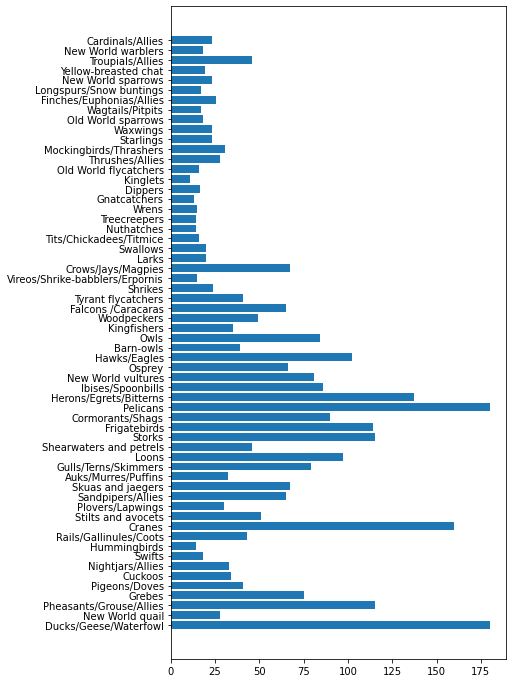
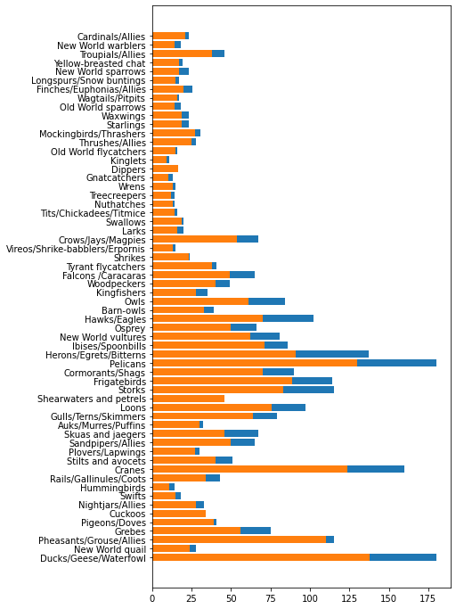

# Visualizing Quantities

| ](../../sketchnotes/09-Visualizing-Quantities.png)|
|:---:|
| Visualizing Quantities - _Sketchnote by [@nitya](https://twitter.com/nitya)_ |

In this lesson you will explore how to use one of the many available Python libraries to learn how to create interesting visualizations all around the concept of quantity. Using a cleaned dataset about the birds of Minnesota, you can learn many interesting facts about local wildlife. 
## [Pre-lecture quiz](https://purple-hill-04aebfb03.1.azurestaticapps.net/quiz/16)

## Observe wingspan with Matplotlib

An excellent library to create both simple and sophisticated plots and charts of various kinds is [Matplotlib](https://matplotlib.org/stable/index.html). In general terms, the process of plotting data using these libraries includes identifying the parts of your dataframe that you want to target, performing any transforms on that data necessary, assigning its x and y axis values, deciding what kind of plot to show, and then showing the plot. Matplotlib offers a large variety of visualizations, but for this lesson, let's focus on the ones most appropriate for visualizing quantity: line charts, scatterplots, and bar plots.

> ✅ Use the best chart to suit your data's structure and the story you want to tell. 
> - To analyze trends over time: line
> - To compare values: bar, column, pie, scatterplot
> - To show how parts relate to a whole: pie
> - To show distribution of data: scatterplot, bar
> - To show trends: line, column
> - To show relationships between values: line, scatterplot, bubble

If you have a dataset and need to discover how much of a given item is included, one of the first tasks you have at hand will be to inspect its values. 

✅ There are very good 'cheat sheets' available for Matplotlib [here](https://matplotlib.org/cheatsheets/cheatsheets.pdf).

## Build a line plot about bird wingspan values

Open the `notebook.ipynb` file at the root of this lesson folder and add a cell.

> Note: the data is stored in the root of this repo in the `/data` folder.

```python
import pandas as pd
import matplotlib.pyplot as plt
birds = pd.read_csv('../../data/birds.csv')
birds.head()
```
This data is a mix of text and numbers:


|      | Name                         | ScientificName         | Category              | Order        | Family   | Genus       | ConservationStatus | MinLength | MaxLength | MinBodyMass | MaxBodyMass | MinWingspan | MaxWingspan |
| ---: | :--------------------------- | :--------------------- | :-------------------- | :----------- | :------- | :---------- | :----------------- | --------: | --------: | ----------: | ----------: | ----------: | ----------: |
|    0 | Black-bellied whistling-duck | Dendrocygna autumnalis | Ducks/Geese/Waterfowl | Anseriformes | Anatidae | Dendrocygna | LC                 |        47 |        56 |         652 |        1020 |          76 |          94 |
|    1 | Fulvous whistling-duck       | Dendrocygna bicolor    | Ducks/Geese/Waterfowl | Anseriformes | Anatidae | Dendrocygna | LC                 |        45 |        53 |         712 |        1050 |          85 |          93 |
|    2 | Snow goose                   | Anser caerulescens     | Ducks/Geese/Waterfowl | Anseriformes | Anatidae | Anser       | LC                 |        64 |        79 |        2050 |        4050 |         135 |         165 |
|    3 | Ross's goose                 | Anser rossii           | Ducks/Geese/Waterfowl | Anseriformes | Anatidae | Anser       | LC                 |      57.3 |        64 |        1066 |        1567 |         113 |         116 |
|    4 | Greater white-fronted goose  | Anser albifrons        | Ducks/Geese/Waterfowl | Anseriformes | Anatidae | Anser       | LC                 |        64 |        81 |        1930 |        3310 |         130 |         165 |

Let's start by plotting some of the numeric data using a basic line plot. Suppose you wanted a view of the maximum wingspan for these interesting birds.

```python
wingspan = birds['MaxWingspan'] 
wingspan.plot()
```


What do you notice immediately? There seems to be at least one outlier - that's quite a wingspan! A 2300 centimeter wingspan equals 23 meters - are there Pterodactyls roaming Minnesota? Let's investigate.

While you could  do a quick sort in Excel to find those outliers, which are probably typos, continue the visualization process by working from within the plot.

Add labels to the x-axis to show what kind of birds are in question:

```
plt.title('Max Wingspan in Centimeters')
plt.ylabel('Wingspan (CM)')
plt.xlabel('Birds')
plt.xticks(rotation=45)
x = birds['Name'] 
y = birds['MaxWingspan']

plt.plot(x, y)

plt.show()
```


Even with the rotation of the labels set to 45 degrees, there are too many to read. Let's try a different strategy: label only those outliers and set the labels within the chart. You can use a scatter chart to make more room for the labeling:

```python
plt.title('Max Wingspan in Centimeters')
plt.ylabel('Wingspan (CM)')
plt.tick_params(axis='both',which='both',labelbottom=False,bottom=False)

for i in range(len(birds)):
    x = birds['Name'][i]
    y = birds['MaxWingspan'][i]
    plt.plot(x, y, 'bo')
    if birds['MaxWingspan'][i] > 500:
        plt.text(x, y * (1 - 0.05), birds['Name'][i], fontsize=12)
    
plt.show()
```
What's going on here? You used `tick_params` to hide the bottom labels and then created a loop over your birds dataset. Plotting the chart with small round blue dots by using `bo`, you checked for any bird with a maximum wingspan over 500 and displayed their label next to the dot if so. You offset the labels a little on the y axis (`y * (1 - 0.05)`) and used the bird name as a label.

What did you discover?


## Filter your data

Both the Bald Eagle and the Prairie Falcon, while probably very large birds, appear to be mislabeled, with an extra `0` added to their maximum wingspan. It's unlikely that you'll meet a Bald Eagle with a 25 meter wingspan, but if so, please let us know! Let's create a new dataframe without those two outliers:

```python
plt.title('Max Wingspan in Centimeters')
plt.ylabel('Wingspan (CM)')
plt.xlabel('Birds')
plt.tick_params(axis='both',which='both',labelbottom=False,bottom=False)
for i in range(len(birds)):
    x = birds['Name'][i]
    y = birds['MaxWingspan'][i]
    if birds['Name'][i] not in ['Bald eagle', 'Prairie falcon']:
        plt.plot(x, y, 'bo')
plt.show()
```

By filtering out outliers, your data is now more cohesive and understandable.



Now that we have a cleaner dataset at least in terms of wingspan, let's discover more about these birds.

While line and scatter plots can display information about data values and their distributions, we want to think about the values inherent in this dataset. You could create visualizations to answer the following questions about quantity:

> How many categories of birds are there, and what are their numbers?
> How many birds are extinct, endangered, rare, or common?
> How many are there of the various genus and orders in Linnaeus's terminology?
## Explore bar charts

Bar charts are practical when you need to show groupings of data. Let's explore the categories of birds that exist in this dataset to see which is the most common by number.

In the notebook file, create a basic bar chart

✅ Note, you can either filter out the two outlier birds we identified in the previous section, edit the typo in their wingspan, or leave them in for these exercises which do not depend on wingspan values.

If you want to create a bar chart, you can select the data you want to focus on. Bar charts can be created from raw data:

```python
birds.plot(x='Category',
        kind='bar',
        stacked=True,
        title='Birds of Minnesota')

```


This bar chart, however, is unreadable because there is too much non-grouped data. You need to select only the data that you want to plot, so let's look at the length of birds based on their category. 

Filter your data to include only the bird's category. 

✅ Notice that you use Pandas to manage the data, and then let Matplotlib do the charting.

Since there are many categories, you can display this chart vertically and tweak its height to account for all the data:

```python
category_count = birds.value_counts(birds['Category'].values, sort=True)
plt.rcParams['figure.figsize'] = [6, 12]
category_count.plot.barh()
```


This bar chart shows a good view of the number of birds in each category. In a blink of an eye, you see that the largest number of birds in this region are in the Ducks/Geese/Waterfowl category. Minnesota is the 'land of 10,000 lakes' so this isn't surprising!

✅ Try some other counts on this dataset. Does anything surprise you?

## Comparing data

You can try different comparisons of grouped data by creating new axes. Try a comparison of the MaxLength of a bird, based on its category:

```python
maxlength = birds['MaxLength']
plt.barh(y=birds['Category'], width=maxlength)
plt.rcParams['figure.figsize'] = [6, 12]
plt.show()
```


Nothing is surprising here: hummingbirds have the least MaxLength compared to Pelicans or Geese. It's good when data makes logical sense!

You can create more interesting visualizations of bar charts by superimposing data. Let's superimpose Minimum and Maximum Length on a given bird category:

```python
minLength = birds['MinLength']
maxLength = birds['MaxLength']
category = birds['Category']

plt.barh(category, maxLength)
plt.barh(category, minLength)

plt.show()
```
In this plot, you can see the range per bird category of the Minimum Length and Maximum length. You can safely say that, given this data, the bigger the bird, the larger its length range. Fascinating!



## 🚀 Challenge

This bird dataset offers a wealth of information about different types of birds within a particular ecosystem. Search around the internet and see if you can find other bird-oriented datasets. Practice building charts and graphs around these birds to discover facts you didn't realize.
## [Post-lecture quiz](https://purple-hill-04aebfb03.1.azurestaticapps.net/quiz/17)

## Review & Self Study

This first lesson has given you some information about how to use Matplotlib to visualize quantities. Do some research around other ways to work with datasets for visualization. [Plotly](https://github.com/plotly/plotly.py) is one that we won't cover in these lessons, so take a look at what it can offer.
## Assignment

[Lines, Scatters, and Bars](assignment.md)
