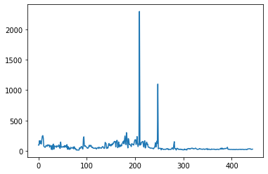
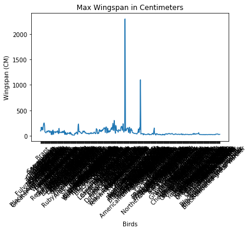
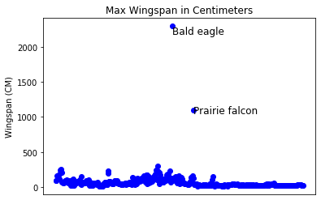
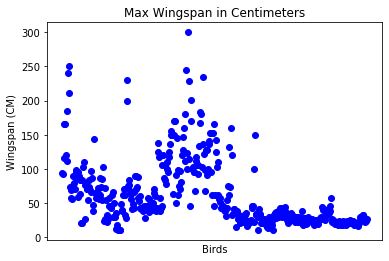
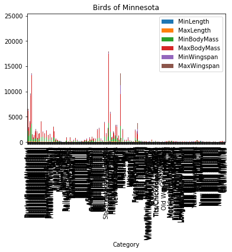
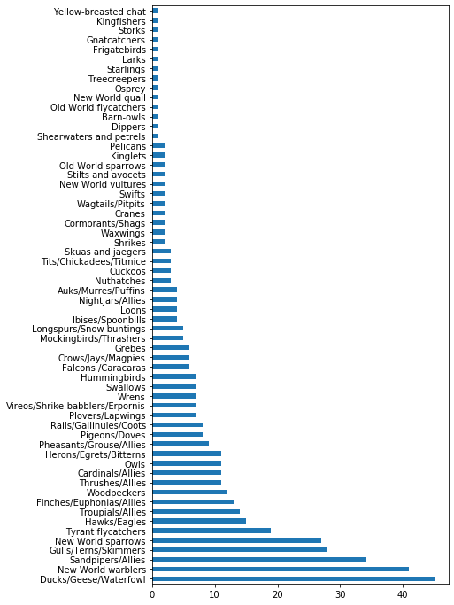
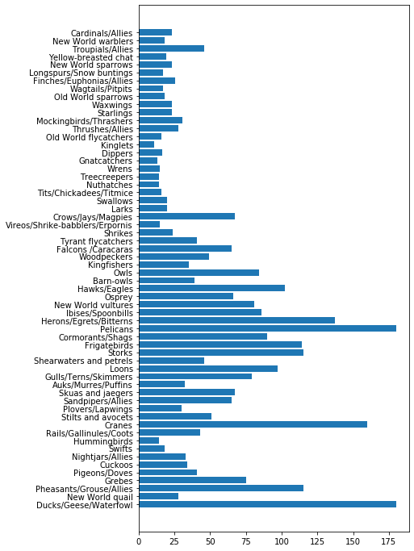
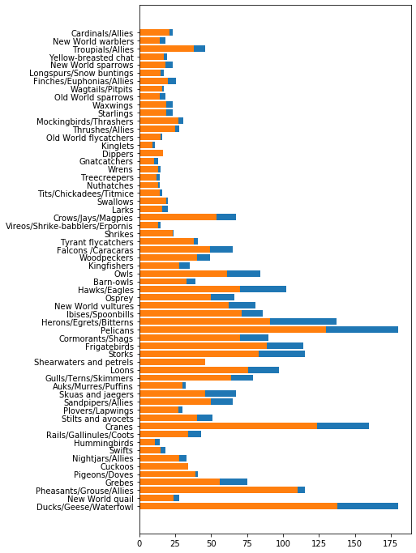

# Visualizando Quantidades

| ](../../../sketchnotes/09-Visualizing-Quantities.png)|
|:---:|
| Visualizando quantidades - _Sketchnote por [@nitya](https://twitter.com/nitya)_ |

Nesta aula você irá explorar como usar uma das muitas bibliotecas disponíveis no Python para aprender a criar visualizações interessantes relacionadas ao conceito de quantidade. Usando um dataset já limpo sobre aves de Minnesota, você pode aprender muitos fatos interessantes sobre a fauna selvagem local.
## [Quiz pré-aula](https://purple-hill-04aebfb03.1.azurestaticapps.net/quiz/16)

## Observando envergadura da asa com Matplotlib

Uma biblioteca excelente para criar tanto gráficos simples como sofisticados e de diversos tipos é o [Matplotlib](https://matplotlib.org/stable/index.html). Em geral, o processo de plotar dados com esta biblioteca inclui identificar as partes do seu dataframe que você quer focar, utilizando quaisquer transformações necessárias nestes dados, atribuindo parâmetros dos eixos x e y, decidindo qual tipo de gráfico usar, e então mostrando o gráfico. O Matplotlib oferece uma grande variedade de visualizações, mas, nesta aula, iremos focar nos mais apropriados para visualizar quantidade: gráfico de linha, gráfico de dispersão e gráfico de barra.

> ✅ Use o melhor gráfico para se adaptar a estrutura dos dados e a história que você quer contar.
> - Para analisar tendências temporais: linha
> - Para comparar valores: barra, coluna, pizza, dispersão
> - Para mostrar como as partes se relacionam com o todo: pizza
> - Para mostrar a distribuição dos dados: dispersão, barra
> - Para mostrar tendências: linha, coluna
> - Para mostrar relações entre valores: linha, dispersão, bolha

Se você tem um dataset e precisa descobrir quanto de um dado elemento está presente, uma das primeiras coisas que você precisará fazer é examinar seus valores.

✅ Existem dicas ('cheat sheets') ótimas disponíveis para o Matplotlib [aqui](https://matplotlib.org/cheatsheets/cheatsheets.pdf).

## Construindo um gráfico de linhas sobre os valores de envergadura de aves

Abra o arquivo `notebook.ipynb` na raiz da pasta desta aula e adicione uma célula.

> Nota: os dados estão armazenados na raiz deste repositório na pasta `/data`.

```python
import pandas as pd
import matplotlib.pyplot as plt
birds = pd.read_csv('../../data/birds.csv')
birds.head()
```

Estes dados são uma mistura de texto e números:


|      | Name                         | ScientificName         | Category              | Order        | Family   | Genus       | ConservationStatus | MinLength | MaxLength | MinBodyMass | MaxBodyMass | MinWingspan | MaxWingspan |
| ---: | :--------------------------- | :--------------------- | :-------------------- | :----------- | :------- | :---------- | :----------------- | --------: | --------: | ----------: | ----------: | ----------: | ----------: |
|    0 | Black-bellied whistling-duck | Dendrocygna autumnalis | Ducks/Geese/Waterfowl | Anseriformes | Anatidae | Dendrocygna | LC                 |        47 |        56 |         652 |        1020 |          76 |          94 |
|    1 | Fulvous whistling-duck       | Dendrocygna bicolor    | Ducks/Geese/Waterfowl | Anseriformes | Anatidae | Dendrocygna | LC                 |        45 |        53 |         712 |        1050 |          85 |          93 |
|    2 | Snow goose                   | Anser caerulescens     | Ducks/Geese/Waterfowl | Anseriformes | Anatidae | Anser       | LC                 |        64 |        79 |        2050 |        4050 |         135 |         165 |
|    3 | Ross's goose                 | Anser rossii           | Ducks/Geese/Waterfowl | Anseriformes | Anatidae | Anser       | LC                 |      57.3 |        64 |        1066 |        1567 |         113 |         116 |
|    4 | Greater white-fronted goose  | Anser albifrons        | Ducks/Geese/Waterfowl | Anseriformes | Anatidae | Anser       | LC                 |        64 |        81 |        1930 |        3310 |         130 |         165 |

Vamos começar plotando alguns dados numéricos com um simples gráfico de linhas. Suponha que você quer uma visualização da envergadura máxima (MaxWingspan) dessas aves interessantes.

```python
wingspan = birds['MaxWingspan'] 
wingspan.plot()
```


O que é possível perceber imediatamente? Aparentemente existe pelo menos um outlier - e que envergadura! Uma envergadura de 2300 centímetros equivale a 23 metros - existem pterodáctilos voando em Minnesota? Vamos investigar.

Você poderia fazer uma ordenação rápida no Excel para encontrar estes outliers, que provavelmente são erros de digitação. No entanto, vamos continuar o processo de visualização trabalhando no gráfico.

Adicione identificadores (labels) no eixo x para mostrar os nomes das aves que estão sendo analisadas:

```
plt.title('Max Wingspan in Centimeters')
plt.ylabel('Wingspan (CM)')
plt.xlabel('Birds')
plt.xticks(rotation=45)
x = birds['Name'] 
y = birds['MaxWingspan']

plt.plot(x, y)

plt.show()
```


Mesmo com a rotação das labels em 45 graus, existem muitas para ler. Vamos tentar outra estratégia: identificar os outliers e somente colocar as labels deles dentro do gráfico. Você pode usar um gráfico de dispersão para abrir mais espaço para labels (identificadores):

```python
plt.title('Max Wingspan in Centimeters')
plt.ylabel('Wingspan (CM)')
plt.tick_params(axis='both',which='both',labelbottom=False,bottom=False)

for i in range(len(birds)):
    x = birds['Name'][i]
    y = birds['MaxWingspan'][i]
    plt.plot(x, y, 'bo')
    if birds['MaxWingspan'][i] > 500:
        plt.text(x, y * (1 - 0.05), birds['Name'][i], fontsize=12)
    
plt.show()
```

O que aconteceu aqui? Você usou `tick_params` para esconder as labels do eixo x e então criou um loop sobre o dataset das aves. Depois, plotou o gráfico com pequenos círculos azuis usando `bo` e procurou por aves com envergadura maior que 500 e, em caso positivo, exibiu a label ao lado do círculo. Você ajustou as labels no eixo y (`y * (1 - 0.05)`) e usou o nome da ave como label.

O que você descobriu?



## Filtrando seus dados

Apesar de grandes, tanto a Bald Eagle (águia-de-cabeça-branca) como o Prairie Falcon (Falcão-da-pradaria) parecem ter valores errados, com um `0` a mais na envergadura máxima (MaxWingspan). É improvável que você encontre uma águia-de-cabeça-branca com envergadura de 25 metros, mas, se encontrar, por favor nos diga! Agora, vamos criar um dataframe sem estes dois outliers:

```python
plt.title('Max Wingspan in Centimeters')
plt.ylabel('Wingspan (CM)')
plt.xlabel('Birds')
plt.tick_params(axis='both',which='both',labelbottom=False,bottom=False)
for i in range(len(birds)):
    x = birds['Name'][i]
    y = birds['MaxWingspan'][i]
    if birds['Name'][i] not in ['Bald eagle', 'Prairie falcon']:
        plt.plot(x, y, 'bo')
plt.show()
```

Agora que estes outliers foram removidos, seus dados estão mais coesos e compreensíveis.



Agora que temos um dataset mais limpo ao menos em termos de envergadura, vamos aprender mais sobre estas aves.

Enquanto gráficos de linha e dispersão conseguem mostrar informações sobre valores e suas distribuições, nós queremos pensar sobre os valores inerentes a este dataset. Você poderia criar visualizações para responder as seguintes perguntas sobre quantidade:

> Quantas categorias de aves existem, e quais são seus valores?
> Quantas aves estão extintas, em risco de extinção, raras ou comuns?
> Quantos gêneros e ordens da taxonomia de Lineu (nome científico) existem no dataset?

## Explorando gráfico de barras

Gráfico de barras são úteis quando precisamos mostrar agrupamentos de dados. Vamos explorar as categorias de aves que existem neste dataset para observar qual é o mais comum em quantidade.

No arquivo notebook, crie um gráfico de barras simples.

✅ Note que você pode remover as duas aves outliers que foram identificados anteriormente, editar o erro de digitação na envergadura ou deixá-los nestes exercícios que não dependem dos valores da envergadura.

Ao criar um gráfico de barras, você pode selecionar os dados que quer focar. Gráficos de barras podem ser criados a partir de dados brutos:

```python
birds.plot(x='Category',
        kind='bar',
        stacked=True,
        title='Birds of Minnesota')

```



No entanto, este gráfico de barras é ilegível, porque existem muitos dados não agrupados. Você precisa selecionar somente os dados que quer plotar, então vamos olhar o comprimento das aves usando sua categoria como referência.

Filtre os dados para incluir somente a categoria da ave.

✅ Note que você usa o Pandas para lidar com os dados, e deixa a criação de gráficos para o Matplotlib.

Já que existem muitas categorias, você pode mostrar este gráfico verticalmente e ajustar sua altura para acomodar todos os dados:

```python
category_count = birds.value_counts(birds['Category'].values, sort=True)
plt.rcParams['figure.figsize'] = [6, 12]
category_count.plot.barh()
```


Este gráfico de barras mostra uma boa visão do número de aves em cada categoria. Em um piscar de olhos, você vê que a maior quantidade de aves nesta região pertence à categoria de Ducks/Geese/Waterfowl (patos/gansos/cisnes). Minnesota é 'a terra de 10.000 lagos', então isto não é surpreendente!

✅ Tente contabilizar outras quantidades deste dataset. Algo te surpreende?

## Comparando dados

Você pode tentar diferentes comparações de dados agrupados criando novos eixos. Tente comparar o comprimento máximo de uma ave, com base na sua categoria:

```python
maxlength = birds['MaxLength']
plt.barh(y=birds['Category'], width=maxlength)
plt.rcParams['figure.figsize'] = [6, 12]
plt.show()
```


Nada é surpreendente aqui: hummingbirds (beija-flores) têm o menor comprimento enquanto pelicans (pelicanos) e geese (gansos) têm os maiores valores. É muito bom quando os dados fazem sentido!

Você pode criar visualizações mais interessantes de gráficos de barras ao sobrepor dados. Vamos sobrepor o comprimento mínimo e máximo de uma dada categoria de ave:

```python
minLength = birds['MinLength']
maxLength = birds['MaxLength']
category = birds['Category']

plt.barh(category, maxLength)
plt.barh(category, minLength)

plt.show()
```

Neste gráfico, você pode ver o intervalo de comprimento mínimo e máximo por categoria de ave. Você pode seguramente dizer, a partir destes dados, que quanto maior a ave, maior o seu intervalo de comprimento. Fascinante!



## 🚀 Desafio

Este dataset de aves oferece uma riqueza de informações sobre os diferentes tipos de aves de um ecossistema particular. Tente achar na internet outros datasets com dados sobre aves. Pratique construir gráficos com eles e tente descobrir fatos que você ainda não havia percebido.

## [Quiz pós-aula](https://purple-hill-04aebfb03.1.azurestaticapps.net/quiz/17)

## Revisão e autoestudo

Esta primeira aula lhe deu informações sobre como usar o Matplotlib para visualizar quantidades. Procure por outras formas de trabalhar com dataset para visualização. [Plotly](https://github.com/plotly/plotly.py) é uma biblioteca que não será abordada nas aulas, então dê uma olhada no que ela pode oferecer.

## Tarefa

[Linhas, dispersão e barras](assignment.pt-br.md)
