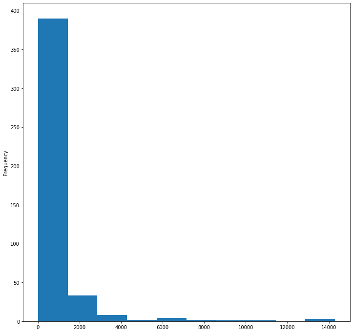
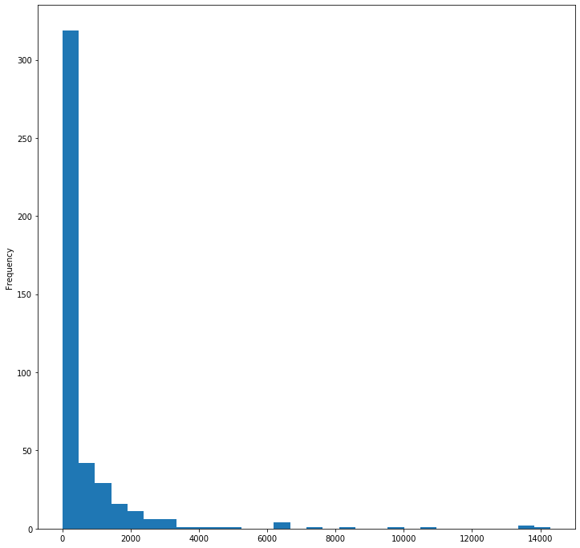
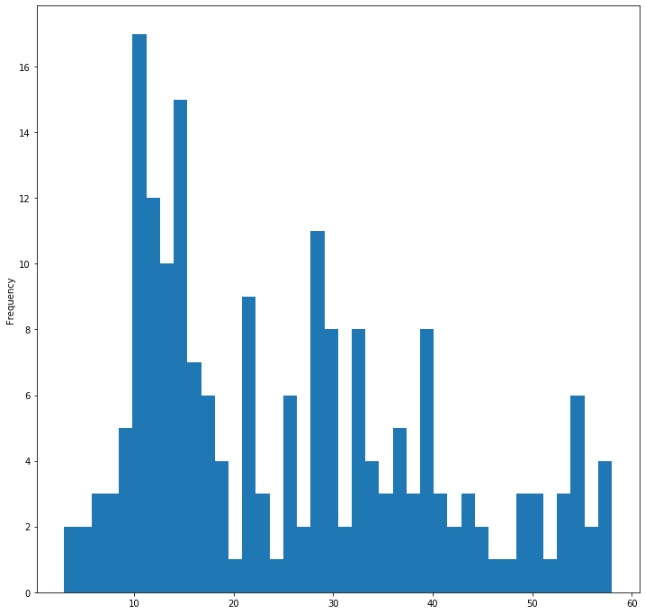
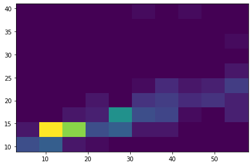
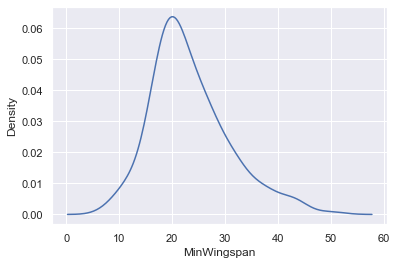
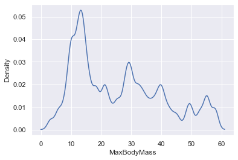
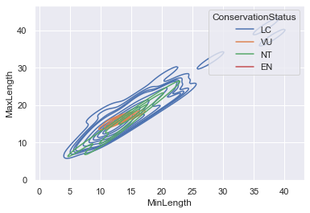

# Visualizing Distributions

In the previous lesson, you learned some interesting facts about a dataset about the birds of Minnesota. You found some erroneous data by visualizing outliers and looked at the differences between bird categories by their maximum length.
## Pre-Lecture Quiz

[Pre-lecture quiz]()
## Explore the birds dataset

Another way to dig into data is by looking at its distribution, or how the data is organized along an axis. Perhaps, for example, you'd like to learn about the general distribution, for this dataset, of maximum wingspan or maximum body mass for the birds of Minnesota. 

Let's discover some facts about the distributions of data in this dataset. In the _notebook.ipynb_ file at the root of this lesson folder, import Pandas, Matplotlib, and your data:

```python
import pandas as pd
import matplotlib.pyplot as plt
birds = pd.read_csv('../../data/birds.csv')
birds.head()
```

In general, you can quickly look at the way data is distributed by using a scatter plot as we did in the previous lesson:

```python
birds.plot(kind='scatter',x='MaxLength',y='Order',figsize=(12,8))

plt.title('Max Length per Order')
plt.ylabel('Order')
plt.xlabel('Max Length')

plt.show()
```
This gives an overview of the general distribution of body length per bird Order, but it is not the optimal way to display true distributions. That task is usually handled by creating a Histogram.
## Working with histograms

Matplotlib offers very good ways to visualize data distribution using Histograms. This type of chart is like a bar chart where the distribution can be seen via a rise and fall of the bars. To build a histogram, you need numeric data.To build a Histogram, you can plot a chart defining the kind as 'hist' for Histogram. This chart show the distribution of MaxBodyMass for the entire dataset's range of numeric data. By dividing the array of data it is given into smaller bins, it can display the distribution of the data's values:

```python
birds['MaxBodyMass'].plot(kind = 'hist', bins = 10, figsize = (12,12))
plt.show()
```


As you can see, most of the 400+ birds in this dataset fall in the range of under 2000 for their Max Body Mass. Gain more insight on the data by changing  the `bins` parameter to a higher number, something like 30:

```python
birds['MaxBodyMass'].plot(kind = 'hist', bins = 30, figsize = (12,12))
plt.show()
```


This chart shows the distribution in a bit more granular fashion. A chart less skewed to the left could be created by ensuring that you only select data within a given range:

Filter your data to get only those birds whose body mass is under 60, and show 40 `bins`:

```python
filteredBirds = birds[(birds['MaxBodyMass'] > 1) & (birds['MaxBodyMass'] < 60)]      
filteredBirds['MaxBodyMass'].plot(kind = 'hist',bins = 40,figsize = (12,12))
plt.show()     
```


✅ Try some other filters and data points. To see the full distribution of the data, remove the `['MaxBodyMass']` filter to show labeled distributions.

The histogram offers some nice color and labeling enhancements to try as well:

Create a 2D histogram to compare the relationship between two distributions. Let's compare `MaxBodyMass` vs. `MaxLength`. Matplotlib offers a built-in way to show convergence using brighter colors:

```python
x = filteredBirds['MaxBodyMass']
y = filteredBirds['MaxLength']

fig, ax = plt.subplots(tight_layout=True)
hist = ax.hist2d(x, y)
```
There appears to be an expected correlation between these two elements along an expected axis, with one particularly strong point of convergence:



Histograms work well by default for numeric data. What if you need to see distributions according to text data? 
## Explore the dataset for distributions using text data 

This dataset also includes good information about the bird category and its genus, species and family as well as its conservation status. Let's dig into this conservation information. What is the distribution of the birds according to their conservation status?

> ✅ In the dataset, several acronyms are used to describe conservation status. These acronyms come from the [IUCN Red List Categories](https://www.iucnredlist.org/), an organization that catalogue species status.
> 
> - CR: Critically Endangered
> - EN: Endangered
> - EX: Extinct
> - LC: Least Concern
> - NT: Near Threatened
> - VU: Vulnerable

These are text-based values so you will need to do a transform to create a histogram. Using the filteredBirds dataframe, display its conservation status alongside its Minimum Wingspan. What do you see? 

```python
x1 = filteredBirds.loc[filteredBirds.ConservationStatus=='EX', 'MinWingspan']
x2 = filteredBirds.loc[filteredBirds.ConservationStatus=='CR', 'MinWingspan']
x3 = filteredBirds.loc[filteredBirds.ConservationStatus=='EN', 'MinWingspan']
x4 = filteredBirds.loc[filteredBirds.ConservationStatus=='NT', 'MinWingspan']
x5 = filteredBirds.loc[filteredBirds.ConservationStatus=='VU', 'MinWingspan']
x6 = filteredBirds.loc[filteredBirds.ConservationStatus=='LC', 'MinWingspan']

kwargs = dict(alpha=0.5, bins=20)

plt.hist(x1, **kwargs, color='red', label='Extinct')
plt.hist(x2, **kwargs, color='orange', label='Critically Endangered')
plt.hist(x3, **kwargs, color='yellow', label='Endangered')
plt.hist(x4, **kwargs, color='green', label='Near Threatened')
plt.hist(x5, **kwargs, color='blue', label='Vulnerable')
plt.hist(x6, **kwargs, color='gray', label='Least Concern')

plt.gca().set(title='Conservation Status', ylabel='Max Body Mass')
plt.legend();
```


There doesn't seem to be a good correlation between minimum wingspan and conservation status. Test other elements of the dataset using this method. You can try different filters as well. Do you find any correlation?

## Density plots

You may have noticed that the histograms we have looked at so far are 'stepped' and do not flow smoothy in an arc. To show a smoother density chart, you can try a density plot.

To work with density plots, familiarize yourself with a new plotting library, [Seaborn](https://seaborn.pydata.org/generated/seaborn.kdeplot.html). 

Loading Seaborn, try a basic density plot:

```python
import seaborn as sns
import matplotlib.pyplot as plt
sns.kdeplot(filteredBirds['MinWingspan'])
plt.show()
```


You can see how the plot echoes the previous one for Minimum Wingspan data; it's just a bit smoother. According to Seaborn's documentation, "Relative to a histogram, KDE can produce a plot that is less cluttered and more interpretable, especially when drawing multiple distributions. But it has the potential to introduce distortions if the underlying distribution is bounded or not smooth. Like a histogram, the quality of the representation also depends on the selection of good smoothing parameters." [source](https://seaborn.pydata.org/generated/seaborn.kdeplot.html) In other words, outliers as always will make your charts behave badly.

If you wanted to revisit that jagged MaxBodyMass line in the second chart you built, you could smooth it out very well by recreating it using this method:

```python
sns.kdeplot(filteredBirds['MaxBodyMass'])
plt.show()
```


If you wanted a smooth, but not too smooth line, edit the `bw_adjust` parameter 

```python
sns.kdeplot(filteredBirds['MaxBodyMass'], bw_adjust=.2)
plt.show()
```


✅ Read about the parameters available for this type of plot and experiment!

This type of chart offers beautifully explanatory visualizations. With a few lines of code, for example, you can show the max body mass density per bird Order:

```python
sns.kdeplot(
   data=filteredBirds, x="MaxBodyMass", hue="Order",
   fill=True, common_norm=False, palette="crest",
   alpha=.5, linewidth=0,
)
```


You can also map the density of several variables in one chart. Text the MaxLength and MinLength of a bird compared to their conservation status:

```python
sns.kdeplot(data=filteredBirds, x="MinLength", y="MaxLength", hue="ConservationStatus")
```



Perhaps it's worth researching whether the cluster of 'Vulnerable' birds according to their lengths is meaningful or not.

## 🚀 Challenge


## Post-Lecture Quiz

[Post-lecture quiz]()

## Review & Self Study


## Assignment

[Assignment Title](assignment.md)
