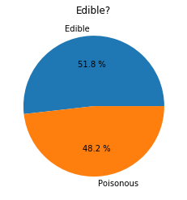
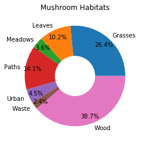

# Visualización de Proporciones

| ](../../../sketchnotes/11-Visualizing-Proportions.png)|
|:---:|
|Visualización de Proporciones - _Sketchnote by [@nitya](https://twitter.com/nitya)_ |

En esta lección, utilizarás un conjunto de datos diferente centrado en la naturaleza para visualizar proporciones, como por ejemplo cuántos tipos diferentes de hongos pueblan un determinado conjunto de datos sobre setas. Vamos a explorar estos fascinantes hongos utilizando un conjunto de datos procedente de Audubon que enumera detalles sobre 23 especies de hongos con branquias de las familias Agaricus y Lepiota. Experimentarás con sabrosas visualizaciones como:

- Gráficos de tarta 🥧
- Gráficos de donuts 🍩
- Gráficos de waffles 🧇

> 💡 Un proyecto muy interesante llamado [Charticulator](https://charticulator.com) de Microsoft Research ofrece una interfaz gratuita de arrastrar y soltar para las visualizaciones de datos. ¡En uno de sus tutoriales también utilizan este conjunto de datos de hongos! Así que puedes explorar los datos y aprender la biblioteca al mismo tiempo: [Tutorial de Charticulator](https://charticulator.com/tutorials/tutorial4.html).

## [Cuestionario previo](https://purple-hill-04aebfb03.1.azurestaticapps.net/quiz/20)

## Conoce tus hongos 🍄

Los hongos son muy interesantes. Vamos a importar un conjunto de datos para estudiarlos:

```python
import pandas as pd
import matplotlib.pyplot as plt
mushrooms = pd.read_csv('../../data/mushrooms.csv')
mushrooms.head()
```
Una tabla con grandes datos para su análisis se imprime:


| class     | cap-shape | cap-surface | cap-color | bruises | odor    | gill-attachment | gill-spacing | gill-size | gill-color | stalk-shape | stalk-root | stalk-surface-above-ring | stalk-surface-below-ring | stalk-color-above-ring | stalk-color-below-ring | veil-type | veil-color | ring-number | ring-type | spore-print-color | population | habitat |
| --------- | --------- | ----------- | --------- | ------- | ------- | --------------- | ------------ | --------- | ---------- | ----------- | ---------- | ------------------------ | ------------------------ | ---------------------- | ---------------------- | --------- | ---------- | ----------- | --------- | ----------------- | ---------- | ------- |
| Poisonous | Convex    | Smooth      | Brown     | Bruises | Pungent | Free            | Close        | Narrow    | Black      | Enlarging   | Equal      | Smooth                   | Smooth                   | White                  | White                  | Partial   | White      | One         | Pendant   | Black             | Scattered  | Urban   |
| Edible    | Convex    | Smooth      | Yellow    | Bruises | Almond  | Free            | Close        | Broad     | Black      | Enlarging   | Club       | Smooth                   | Smooth                   | White                  | White                  | Partial   | White      | One         | Pendant   | Brown             | Numerous   | Grasses |
| Edible    | Bell      | Smooth      | White     | Bruises | Anise   | Free            | Close        | Broad     | Brown      | Enlarging   | Club       | Smooth                   | Smooth                   | White                  | White                  | Partial   | White      | One         | Pendant   | Brown             | Numerous   | Meadows |
| Poisonous | Convex    | Scaly       | White     | Bruises | Pungent | Free            | Close        | Narrow    | Brown      | Enlarging   | Equal      | Smooth                   | Smooth                   | White                  | White                  | Partial   | White      | One         | Pendant   | Black             | Scattered  | Urban   |

Enseguida se nota que todos los datos son textuales. Tendrás que convertir estos datos para poder utilizarlos en un gráfico. La mayoría de los datos, de hecho, se representan como un objeto:

```python
print(mushrooms.select_dtypes(["object"]).columns)
```

La salida es:

```output
Index(['class', 'cap-shape', 'cap-surface', 'cap-color', 'bruises', 'odor',
       'gill-attachment', 'gill-spacing', 'gill-size', 'gill-color',
       'stalk-shape', 'stalk-root', 'stalk-surface-above-ring',
       'stalk-surface-below-ring', 'stalk-color-above-ring',
       'stalk-color-below-ring', 'veil-type', 'veil-color', 'ring-number',
       'ring-type', 'spore-print-color', 'population', 'habitat'],
      dtype='object')
```
Toma estos datos y convierte la columna "class" en una categoría:

```python
cols = mushrooms.select_dtypes(["object"]).columns
mushrooms[cols] = mushrooms[cols].astype('category')
```
Ahora, si imprimes los datos de las setas, puedes ver que se han agrupado en categorías según la clase poisonous/edible (venenosa/comestible):

|           | cap-shape | cap-surface | cap-color | bruises | odor | gill-attachment | gill-spacing | gill-size | gill-color | stalk-shape | ... | stalk-surface-below-ring | stalk-color-above-ring | stalk-color-below-ring | veil-type | veil-color | ring-number | ring-type | spore-print-color | population | habitat |
| --------- | --------- | ----------- | --------- | ------- | ---- | --------------- | ------------ | --------- | ---------- | ----------- | --- | ------------------------ | ---------------------- | ---------------------- | --------- | ---------- | ----------- | --------- | ----------------- | ---------- | ------- |
| class     |           |             |           |         |      |                 |              |           |            |             |     |                          |                        |                        |           |            |             |           |                   |            |         |
| Edible    | 4208      | 4208        | 4208      | 4208    | 4208 | 4208            | 4208         | 4208      | 4208       | 4208        | ... | 4208                     | 4208                   | 4208                   | 4208      | 4208       | 4208        | 4208      | 4208              | 4208       | 4208    |
| Poisonous | 3916      | 3916        | 3916      | 3916    | 3916 | 3916            | 3916         | 3916      | 3916       | 3916        | ... | 3916                     | 3916                   | 3916                   | 3916      | 3916       | 3916        | 3916      | 3916              | 3916       | 3916    |

Si sigues el orden presentado en esta tabla para crear tus etiquetas de categoría de clase, puedes construir un gráfico circular:

## ¡Pastel!

```python
labels=['Edible','Poisonous']
plt.pie(edibleclass['population'],labels=labels,autopct='%.1f %%')
plt.title('Edible?')
plt.show()
```
Voilá, un gráfico circular que muestra las proporciones de estos datos según estas dos clases de hongos. ¡Es bastante importante conseguir el orden de las etiquetas correcto, especialmente aquí, así que asegúrate de verificar el orden con el que se construye la matriz de etiquetas!



## ¡Donas!

Algo más interesante desde el punto de vista visual que el gráfico de pastel es el gráfico de donas, que es un gráfico circular con un agujero en el centro. Veamos nuestros datos con este método.

Observa los distintos hábitats donde crecen las setas:

```python
habitat=mushrooms.groupby(['habitat']).count()
habitat
```
Aquí, estás agrupando tus datos por hábitat. Hay 7 listados, así que úsalos como etiquetas para tu gráfico de donas:

```python
labels=['Grasses','Leaves','Meadows','Paths','Urban','Waste','Wood']

plt.pie(habitat['class'], labels=labels,
        autopct='%1.1f%%', pctdistance=0.85)
  
center_circle = plt.Circle((0, 0), 0.40, fc='white')
fig = plt.gcf()

fig.gca().add_artist(center_circle)
  
plt.title('Mushroom Habitats')
  
plt.show()
```



Este código dibuja un gráfico y un círculo central, luego añade ese círculo central en el gráfico. Edite el ancho del círculo central cambiando `0.40` por otro valor.

Los gráficos de donas pueden ser modificados de varias maneras para cambiar las etiquetas. Las etiquetas, en particular, pueden ser resaltadas para facilitar su lectura. Obtenga más información en los [docs](https://matplotlib.org/stable/gallery/pie_and_polar_charts/pie_and_donut_labels.html?highlight=donut).

Ahora que sabes cómo agrupar tus datos y mostrarlos como un pastel o una dona, puedes explorar otros tipos de gráficos. Prueba con un gráfico waffle, que es una forma diferente de explorar la cantidad.
## ¡Waffles!

Un gráfico de tipo "waffle" es una forma diferente de visualizar las cantidades como una matriz 2D de cuadrados. Intenta visualizar las diferentes cantidades de colores de los sombreros de los champiñones en este conjunto de datos. Para hacer esto, necesitas instalar una biblioteca de ayuda llamada [PyWaffle](https://pypi.org/project/pywaffle/) y usar Matplotlib:

```python
pip install pywaffle
```

Seleccione un segmento de sus datos para agrupar:

```python
capcolor=mushrooms.groupby(['cap-color']).count()
capcolor
```

Crea un gráfico de waffles creando etiquetas y luego agrupando los datos:

```python
import pandas as pd
import matplotlib.pyplot as plt
from pywaffle import Waffle
  
data ={'color': ['brown', 'buff', 'cinnamon', 'green', 'pink', 'purple', 'red', 'white', 'yellow'],
    'amount': capcolor['class']
     }
  
df = pd.DataFrame(data)
  
fig = plt.figure(
    FigureClass = Waffle,
    rows = 100,
    values = df.amount,
    labels = list(df.color),
    figsize = (30,30),
    colors=["brown", "tan", "maroon", "green", "pink", "purple", "red", "whitesmoke", "yellow"],
)
```

Utilizando un gráfico de waffles, se pueden ver claramente las proporciones de los colores de los sombreros de este conjunto de datos de hongos. Curiosamente, ¡hay muchas hongos con el sombrero verde!


✅ Pywaffle soporta iconos dentro de los gráficos que utilizan cualquier icono disponible en [Font Awesome](https://fontawesome.com/). Haz algunos experimentos para crear un gráfico waffle aún más interesante usando iconos en lugar de cuadrados.

En esta lección, aprendiste tres maneras de visualizar proporciones. En primer lugar, tienes que agrupar tus datos en categorías y luego decidir cuál es la mejor manera de mostrar los datos: pastel, dona o waffle. Todas son deliciosas y gratifican al usuario con una instantánea de un conjunto de datos.

## 🚀 Desafío

Intenta recrear estos sabrosos gráficos en [Charticulator](https://charticulator.com).
## [Cuestionario posterior a la clase](https://purple-hill-04aebfb03.1.azurestaticapps.net/quiz/21)

## Repaso y autoestudio

A veces no es obvio cuándo utilizar un gráfico de pastel, de dona o de waffle. Aquí hay algunos artículos para leer sobre este tema:

https://www.beautiful.ai/blog/battle-of-the-charts-pie-chart-vs-donut-chart

https://medium.com/@hypsypops/pie-chart-vs-donut-chart-showdown-in-the-ring-5d24fd86a9ce

https://www.mit.edu/~mbarker/formula1/f1help/11-ch-c6.htm

https://medium.datadriveninvestor.com/data-visualization-done-the-right-way-with-tableau-waffle-chart-fdf2a19be402

Investiga un poco para encontrar más información sobre esta decisión pegajosa.
## Asignación

[Pruébalo en Excel](assignment.es.md)