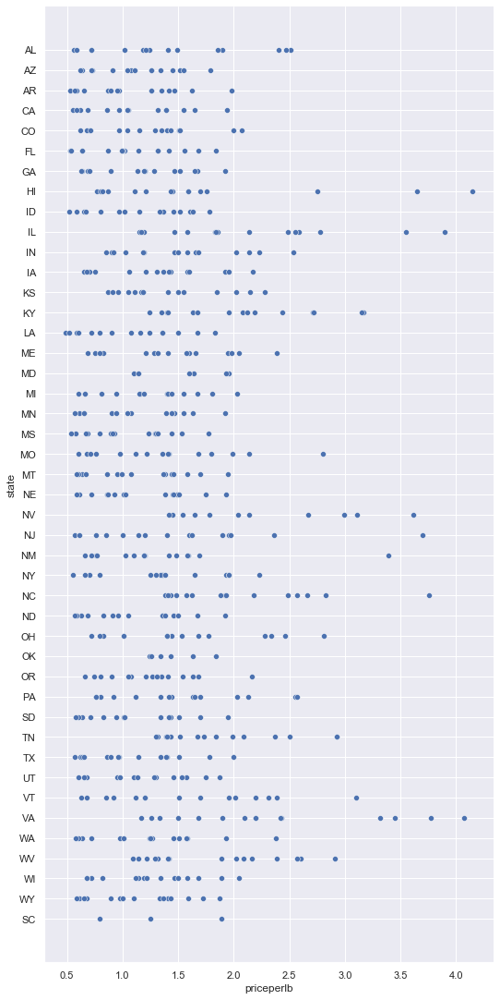
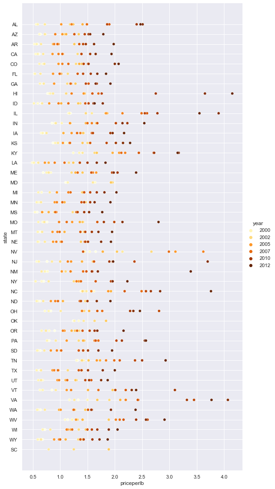
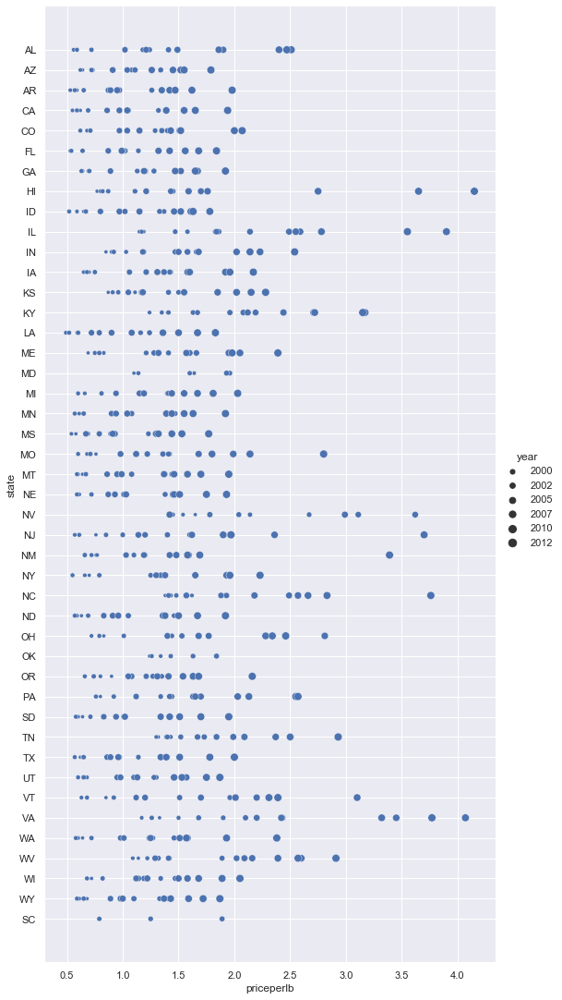
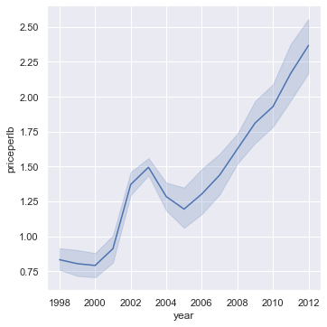
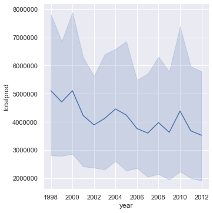
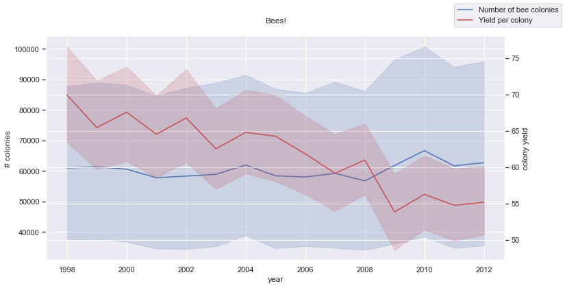

# Visualización de Relaciones: Todo sobre la miel 🍯

| ](../../../sketchnotes/12-Visualizing-Relationships.png)|
|:---:|
|Visualización de Relaciones - _Sketchnote by [@nitya](https://twitter.com/nitya)_ |

Siguiendo con el enfoque de la naturaleza de nuestra investigación, vamos a descubrir interesantes visualizaciones para mostrar las relaciones entre los distintos tipos de miel, según un conjunto de datos procedentes del [Departamento de Agricultura de Estados Unidos](https://www.nass.usda.gov/About_NASS/index.php). 

Este conjunto de datos, compuesto por unos 600 elementos, muestra la producción de miel en muchos estados de Estados Unidos. Así, por ejemplo, se puede ver el número de colonias, el rendimiento por colonia, la producción total, las existencias, el precio por libra y el valor de la miel producida en un determinado estado entre 1998 y 2012, con una fila por año para cada estado. 

Será interesante visualizar la relación entre la producción de un estado determinado por año y, por ejemplo, el precio de la miel en ese estado. También se podría visualizar la relación entre la producción de miel por colonia de los estados. Este intervalo de años abarca el devastador "CCD" o "Colony Collapse Disorder" que se observó por primera vez en 2006 (http://npic.orst.edu/envir/ccd.html), por lo que es un conjunto de datos conmovedor para estudiar. 🐝

## [Cuestionario previo](https://purple-hill-04aebfb03.1.azurestaticapps.net/quiz/22)

En esta lección, puedes utilizar Seaborn, que ya has utilizado anteriormente, como una buena librería para visualizar las relaciones entre las variables. Es especialmente interesante el uso de la función `relplot` de Seaborn, que permite realizar gráficos de dispersión y de líneas para visualizar rápidamente las '[relaciones estadísticas](https://seaborn.pydata.org/tutorial/relational.html?highlight=relationships)', que permiten al científico de datos comprender mejor cómo se relacionan las variables entre sí.

## Gráficos de dispersión

Utiliza un gráfico de dispersión para mostrar cómo ha evolucionado el precio de la miel, año tras año, por estado. Seaborn, utilizando `relplot`, agrupa convenientemente los datos de los estados y muestra puntos de datos tanto categóricos como numéricos. 

Empecemos por importar los datos y Seaborn:

```python
import pandas as pd
import matplotlib.pyplot as plt
import seaborn as sns
honey = pd.read_csv('../../data/honey.csv')
honey.head()
```
Observará que los datos de la miel tienen varias columnas interesantes, como el año y el precio por libra. Exploremos estos datos, agrupados por estados de Estados Unidos:

| state | numcol | yieldpercol | totalprod | stocks   | priceperlb | prodvalue | year |
| ----- | ------ | ----------- | --------- | -------- | ---------- | --------- | ---- |
| AL    | 16000  | 71          | 1136000   | 159000   | 0.72       | 818000    | 1998 |
| AZ    | 55000  | 60          | 3300000   | 1485000  | 0.64       | 2112000   | 1998 |
| AR    | 53000  | 65          | 3445000   | 1688000  | 0.59       | 2033000   | 1998 |
| CA    | 450000 | 83          | 37350000  | 12326000 | 0.62       | 23157000  | 1998 |
| CO    | 27000  | 72          | 1944000   | 1594000  | 0.7        | 1361000   | 1998 |


Crea un gráfico de dispersión básico para mostrar la relación entre el precio por libra de miel y su estado de origen en EE.UU. Haz que el eje `y` sea lo suficientemente alto como para mostrar todos los estados:

```python
sns.relplot(x="priceperlb", y="state", data=honey, height=15, aspect=.5);
```


Ahora, muestra los mismos datos con un esquema de color miel para exponer cómo evoluciona el precio a lo largo de los años. Puedes hacerlo añadiendo un parámetro 'hue' para visualizar el cambio, año tras año:

> ✅ Aprende más sobre las [paletas de colores que puedes usar en Seaborn](https://seaborn.pydata.org/tutorial/color_palettes.html) - ¡prueba una hermosa combinación de colores del arco iris!

```python
sns.relplot(x="priceperlb", y="state", hue="year", palette="YlOrBr", data=honey, height=15, aspect=.5);
```


Con este cambio de color, se puede ver que obviamente hay una fuerte progresión a lo largo de los años en cuanto al precio de la miel por libra. De hecho, si se observa un conjunto de muestras en los datos para comprobarlo (elige un estado determinado, Arizona por ejemplo) se puede ver un patrón de aumento de precios año tras año, con pocas excepciones:

| state | numcol | yieldpercol | totalprod | stocks  | priceperlb | prodvalue | year |
| ----- | ------ | ----------- | --------- | ------- | ---------- | --------- | ---- |
| AZ    | 55000  | 60          | 3300000   | 1485000 | 0.64       | 2112000   | 1998 |
| AZ    | 52000  | 62          | 3224000   | 1548000 | 0.62       | 1999000   | 1999 |
| AZ    | 40000  | 59          | 2360000   | 1322000 | 0.73       | 1723000   | 2000 |
| AZ    | 43000  | 59          | 2537000   | 1142000 | 0.72       | 1827000   | 2001 |
| AZ    | 38000  | 63          | 2394000   | 1197000 | 1.08       | 2586000   | 2002 |
| AZ    | 35000  | 72          | 2520000   | 983000  | 1.34       | 3377000   | 2003 |
| AZ    | 32000  | 55          | 1760000   | 774000  | 1.11       | 1954000   | 2004 |
| AZ    | 36000  | 50          | 1800000   | 720000  | 1.04       | 1872000   | 2005 |
| AZ    | 30000  | 65          | 1950000   | 839000  | 0.91       | 1775000   | 2006 |
| AZ    | 30000  | 64          | 1920000   | 902000  | 1.26       | 2419000   | 2007 |
| AZ    | 25000  | 64          | 1600000   | 336000  | 1.26       | 2016000   | 2008 |
| AZ    | 20000  | 52          | 1040000   | 562000  | 1.45       | 1508000   | 2009 |
| AZ    | 24000  | 77          | 1848000   | 665000  | 1.52       | 2809000   | 2010 |
| AZ    | 23000  | 53          | 1219000   | 427000  | 1.55       | 1889000   | 2011 |
| AZ    | 22000  | 46          | 1012000   | 253000  | 1.79       | 1811000   | 2012 |

Otra forma de visualizar esta progresión es utilizar el tamaño, en lugar del color. Para los usuarios daltónicos, ésta podría ser una mejor opción. Edita tu visualización para mostrar un aumento de precio por un aumento de la circunferencia del punto:

```python
sns.relplot(x="priceperlb", y="state", size="year", data=honey, height=15, aspect=.5);
```
Puedes ver que el tamaño de los puntos aumenta gradualmente.



¿Se trata de un simple caso de oferta y demanda? Debido a factores como el cambio climático y el colapso de las colonias, ¿hay menos miel disponible para la compra año tras año y, por tanto, el precio aumenta?

Para descubrir una correlación entre algunas de las variables de este conjunto de datos, exploremos algunos gráficos de líneas.

## Gráficos de líneas

Pregunta: ¿Existe un claro aumento del precio de la miel por libra año tras año? Lo más fácil es descubrirlo creando un gráfico de líneas:

```python
sns.relplot(x="year", y="priceperlb", kind="line", data=honey);
```
Answer: Yes, with some exceptions around the year 2003:



✅ Como Seaborn está agregando datos en torno a una línea, muestra "las múltiples mediciones en cada valor de x trazando la media y el intervalo de confianza del 95% en torno a la media". [Fuente](https://seaborn.pydata.org/tutorial/relational.html). Este comportamiento, que consume mucho tiempo, puede desactivarse añadiendo `ci=None`.

Pregunta: En 2003, ¿también podemos ver un pico en la oferta de miel? ¿Y si se observa la producción total año tras año?

```python
sns.relplot(x="year", y="totalprod", kind="line", data=honey);
```



Respuesta: La verdad es que no. Si se observa la producción total, parece haber aumentado en ese año concreto, aunque en general la cantidad de miel que se produce disminuye en esos años.

Pregunta: En ese caso, ¿qué pudo causar ese repunte del precio de la miel en torno a 2003? 

Para descubrirlo, puedes explorar una cuadrícula de facetas.

## Cuadrículas de facetas

Las cuadrículas de facetas toman una faceta de su conjunto de datos (en nuestro caso, puede elegir "año" para evitar que se produzcan demasiadas facetas). Seaborn puede entonces hacer un gráfico para cada una de esas facetas de sus coordenadas x e y elegidas para una comparación visual más fácil. ¿Destaca el año 2003 en este tipo de comparación?

Cree una cuadrícula de facetas continuando con el uso de `relplot` como recomienda [la documentación de Seaborn](https://seaborn.pydata.org/generated/seaborn.FacetGrid.html?highlight=facetgrid#seaborn.FacetGrid). 

```python
sns.relplot(
    data=honey, 
    x="yieldpercol", y="numcol",
    col="year", 
    col_wrap=3,
    kind="line"
```
En esta visualización, se puede comparar el rendimiento por colonia y el número de colonias año tras año, uno al lado del otro con un ajuste de 3 para las columnas:

[cuadrícula de facetas](../images/facet.png)

Para este conjunto de datos, no hay nada que destaque especialmente en cuanto al número de colonias y su rendimiento, año tras año y estado tras estado. ¿Hay alguna forma diferente de buscar una correlación entre estas dos variables?

## Gráficos de dos líneas

Prueba con un gráfico multilínea superponiendo dos gráficos de líneas uno encima del otro, utilizando el 'despine' de Seaborn para eliminar sus espinas superiores y derechas, y utilizando `ax.twinx` [derivado de Matplotlib](https://matplotlib.org/stable/api/_as_gen/matplotlib.axes.Axes.twinx.html). Twinx permite que un gráfico comparta el eje x y muestre dos ejes y. Así, mostrar el rendimiento por colonia y el número de colonias, superpuestos:

```python
fig, ax = plt.subplots(figsize=(12,6))
lineplot = sns.lineplot(x=honey['year'], y=honey['numcol'], data=honey, 
                        label = 'Number of bee colonies', legend=False)
sns.despine()
plt.ylabel('# colonies')
plt.title('Honey Production Year over Year');

ax2 = ax.twinx()
lineplot2 = sns.lineplot(x=honey['year'], y=honey['yieldpercol'], ax=ax2, color="r", 
                         label ='Yield per colony', legend=False) 
sns.despine(right=False)
plt.ylabel('colony yield')
ax.figure.legend();
```


Aunque no hay nada que salte a la vista en torno al año 2003, nos permite terminar esta lección con una nota un poco más alegre: aunque en general hay un número de colonias en descenso, el número de colonias se está estabilizando aunque su rendimiento por colonia esté disminuyendo.

¡Vamos, abejas, vamos!

🐝❤️
## 🚀 Desafío

En esta lección, has aprendido un poco más sobre otros usos de los gráficos de dispersión y las cuadrículas de líneas, incluyendo las cuadrículas de facetas. Desafíate a crear una cuadrícula de facetas utilizando un conjunto de datos diferente, tal vez uno que hayas utilizado antes de estas lecciones. Fíjate en el tiempo que se tarda en crearlas y en la necesidad de tener cuidado con el número de cuadrículas que necesitas dibujar utilizando estas técnicas.
## [Cuestionario posterior a la clase](https://purple-hill-04aebfb03.1.azurestaticapps.net/quiz/23)

## Repaso y autoestudio

Los gráficos de líneas pueden ser simples o bastante complejos. Lee un poco en la [documentación de Seaborn](https://seaborn.pydata.org/generated/seaborn.lineplot.html) sobre las diversas formas en que puedes construirlos. Intenta mejorar los gráficos de líneas que construiste en esta lección con otros métodos listados en la documentación.
## Asignación

[Sumérgete en la colmena](assignment.es.md)
