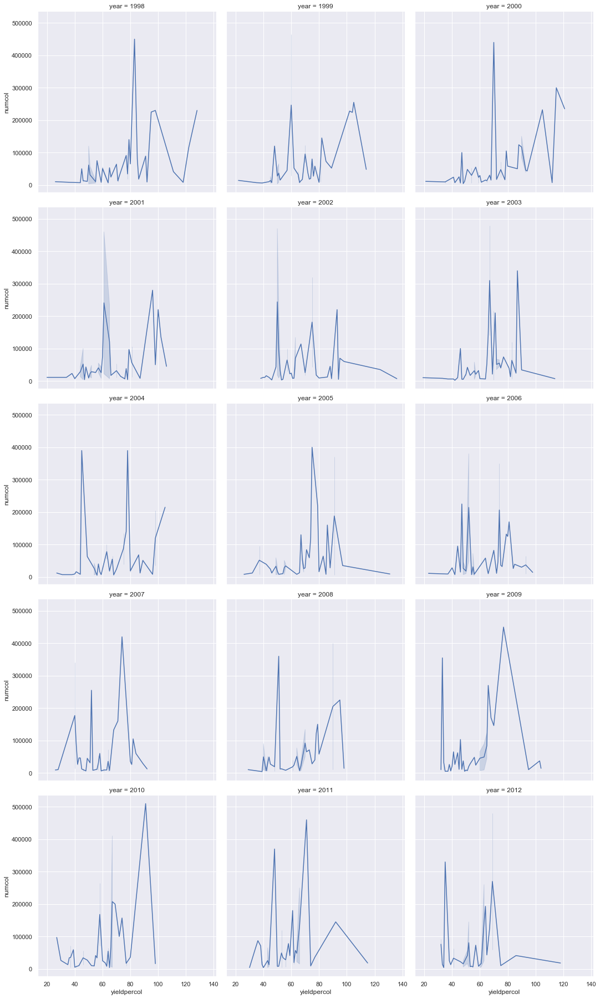

# 관계 시각화: 꿀의 모든 것 🍯

| ](../../../sketchnotes/12-Visualizing-Relationships.png)|
|:---:|
|관계 시각화 - _제작자 : [@nitya](https://twitter.com/nitya)_ |

계속해서 우리 연구의 본질에 초점을 맞춰 [미국 농무부](https://www.nass.usda.gov/About_NASS/index.php)에서 도출된 데이터 셋에 따라 다양한 꿀 유형 간의 관계를 보여주는 흥미로운 시각화를 발견해 보겠습니다.

약 600개 항목으로 구성된 이 데이터셋은 미국의 여러 주에서의 꿀 생산량을 보여줍니다. 예를 들어, 1998년부터 2012년까지 각 주에 대해 연간 한 행씩 군집의 수, 군집 당 수확량, 총 생산량, 재고, 파운드당 가격 및 특정 주에서 생산된 꿀의 가치를 볼 수 있습니다.

예를 들어 해당 주의 연간 생산량과 해당 주의 꿀 가격 간의 관계를 시각화하는 것은 흥미로울 것입니다. 또는 각 주의 군집 당 꿀 생산량 간의 관계를 시각화할 수 있습니다. 올해에는 2006년(http://npic.orst.edu/envir/ccd.html)에 처음 발견된 파괴적인 'CCD' 또는 '봉군붕괴증후군'을 다루는데, 이것은 연구하기에 가슴 아픈 데이터 셋입니다. 🐝

## [이전 강의 퀴즈](https://purple-hill-04aebfb03.1.azurestaticapps.net/quiz/22)

이 강의에서는 변수 간의 관계를 시각화하는 좋은 라이브러리로, 전에 사용했던 Seaborn을 사용할 수 있습니다. 특히 흥미로운 점은 산점도와 선 플롯이 '[통계적 관계](https://seaborn.pydata.org/tutorial/relational.html?highlight=relationships)'를 빠르게 시각화할 수 있도록 해주는 Seaborn의 'relplot' 기능입니다. 'replot'은 데이터 과학자가 변수들이 서로 어떻게 관련되어 있는지 더 잘 이해할 수 있도록 합니다. 

## 산점도

산점도를 사용하여 해마다 주별로 꿀 가격이 어떻게 변해왔는지 확인할 수 있습니다. Seaborn은 'replot'을 사용하여 상태 데이터를 편리하게 그룹화하고 범주형 데이터와 수치형 데이터 모두에 대한 데이터를 점으로 표시합니다.

먼저 데이터와 Seaborn을 가져오는 것으로 시작하겠습니다:

```python
import pandas as pd
import matplotlib.pyplot as plt
import seaborn as sns
honey = pd.read_csv('../../data/honey.csv')
honey.head()
```
꿀 데이터에는 연도 및 파운드 당 가격을 포함하여 몇가지 흥미로운 열들이 있습니다. 미국 주별로 분류된 이 데이터를 살펴보겠습니다:

| state | numcol | yieldpercol | totalprod | stocks   | priceperlb | prodvalue | year |
| ----- | ------ | ----------- | --------- | -------- | ---------- | --------- | ---- |
| AL    | 16000  | 71          | 1136000   | 159000   | 0.72       | 818000    | 1998 |
| AZ    | 55000  | 60          | 3300000   | 1485000  | 0.64       | 2112000   | 1998 |
| AR    | 53000  | 65          | 3445000   | 1688000  | 0.59       | 2033000   | 1998 |
| CA    | 450000 | 83          | 37350000  | 12326000 | 0.62       | 23157000  | 1998 |
| CO    | 27000  | 72          | 1944000   | 1594000  | 0.7        | 1361000   | 1998 |


꿀 1파운드 당 가격과 미국 원산지 간의 관계를 보여주는 기본 산점도를 생성합니다. 'y'축을 모든 상태를 표시할 수 있을 만큼 높게 만듭니다:

```python
sns.relplot(x="priceperlb", y="state", data=honey, height=15, aspect=.5);
```


이제 동일한 데이터를 꿀 색상 구성표로 표시하여 몇 년 동안 가격이 어떻게 변하는지 보여줍니다. 매년 변경 사항을 표시하기 위해 'hue' 매개 변수를 추가하여 이를 수행할 수 있습니다:

> ✅ [Seaborn에서 사용할 수 있는 색상 팔레트](https://seaborn.pydata.org/tutorial/color_palettes.html) 에 대해 자세히 알아보기 - 아름다운 무지개 색 구성표를 시도하세요!

```python
sns.relplot(x="priceperlb", y="state", hue="year", palette="YlOrBr", data=honey, height=15, aspect=.5);
```


이 색상 구성표 변경을 통해, 여러분은 파운드당 꿀의 가격 측면에서 몇 년 동안 분명히 강력한 발전이 있음을 알 수 있습니다. 실제로 검증할 데이터의 표본 셋(예: 아리조나 주를 선택)을 보면 몇 가지 예외를 제외하고 매년 가격이 상승하는 패턴을 볼 수 있습니다:

| state | numcol | yieldpercol | totalprod | stocks  | priceperlb | prodvalue | year |
| ----- | ------ | ----------- | --------- | ------- | ---------- | --------- | ---- |
| AZ    | 55000  | 60          | 3300000   | 1485000 | 0.64       | 2112000   | 1998 |
| AZ    | 52000  | 62          | 3224000   | 1548000 | 0.62       | 1999000   | 1999 |
| AZ    | 40000  | 59          | 2360000   | 1322000 | 0.73       | 1723000   | 2000 |
| AZ    | 43000  | 59          | 2537000   | 1142000 | 0.72       | 1827000   | 2001 |
| AZ    | 38000  | 63          | 2394000   | 1197000 | 1.08       | 2586000   | 2002 |
| AZ    | 35000  | 72          | 2520000   | 983000  | 1.34       | 3377000   | 2003 |
| AZ    | 32000  | 55          | 1760000   | 774000  | 1.11       | 1954000   | 2004 |
| AZ    | 36000  | 50          | 1800000   | 720000  | 1.04       | 1872000   | 2005 |
| AZ    | 30000  | 65          | 1950000   | 839000  | 0.91       | 1775000   | 2006 |
| AZ    | 30000  | 64          | 1920000   | 902000  | 1.26       | 2419000   | 2007 |
| AZ    | 25000  | 64          | 1600000   | 336000  | 1.26       | 2016000   | 2008 |
| AZ    | 20000  | 52          | 1040000   | 562000  | 1.45       | 1508000   | 2009 |
| AZ    | 24000  | 77          | 1848000   | 665000  | 1.52       | 2809000   | 2010 |
| AZ    | 23000  | 53          | 1219000   | 427000  | 1.55       | 1889000   | 2011 |
| AZ    | 22000  | 46          | 1012000   | 253000  | 1.79       | 1811000   | 2012 |


이 진행 상황을 시각화하는 또 다른 방법은 색상이 아닌 크기를 사용하는 것입니다. 색맹 사용자의 경우 이것이 더 나은 옵션일 수 있습니다. 점 둘레의 증가에 따른 가격 인상을 표시하도록 시각화를 편집합니다:

```python
sns.relplot(x="priceperlb", y="state", size="year", data=honey, height=15, aspect=.5);
```
점들의 크기가 점점 커지는 것을 볼 수 있습니다.


이것은 단순한 수요와 공급의 경우인가요? 기후 변화 및 봉군 붕괴와 같은 요인으로 인해, 매년 구매할 수 있는 꿀이 줄어들어 가격이 상승하나요?

이 데이터 셋의 일부 변수 간의 상관 관계를 발견하기 위해 몇 가지 꺾은선 그래프를 살펴보겠습니다.

## 꺾은선 그래프

질문: 매년 파운드 당 꿀값이 상승하고 있습니까? 여러분은 단일 꺾은선 그래프를 만들어 가장 쉽게 확인할 수 있습니다:

```python
sns.relplot(x="year", y="priceperlb", kind="line", data=honey);
```
답변: 네, 2003년 경의 일부 예외를 제외하고 그렇습니다:


✅ Seaborn은 한 선으로 데이터를 집계하기 때문에 "평균을 중심으로 95% 신뢰 구간과 평균을 표시하여 각 x 값에 대한 다중 측정"을 표시합니다. [출처](https://seaborn.pydata.org/tutorial/relational.html). 이 시간 소모적인 동작은 `ci=None`을 추가하여 비활성화할 수 있습니다.

질문: 2003년에도 꿀 공급이 급증하는 것을 볼 수 있습니까? 연간 총 생산량을 보면 어떨까요?

```python
sns.relplot(x="year", y="totalprod", kind="line", data=honey);
```


답변: 그렇지 않습니다. 총 생산량을 보면 그 해에 실제로 증가한 것으로 보이지만 일반적으로 이 기간 동안 생산되는 꿀의 양은 감소하고 있습니다.

질문: 그렇다면 2003년경 꿀 가격이 급등하게 된 원인은 무엇이었습니까? 

이를 발견하기 위해 facet grid를 탐색할 수 있습니다.

## Facet grids

Facet grid는 데이터셋의 한 면을 차지합니다(우리의 경우 너무 많은 면을 생산하지 않도록 '연도'를 선택할 수 있습니다). 그런 다음 Seaborn은 보다 쉬운 시각적 비교를 위해 선택한 x 좌표와 y 좌표의 각 면에 대한 플롯을 만들 수 있습니다. 2003년은 이런 유형의 비교에서 두드러집니까?

[Seaborn의 문서](https://seaborn.pydata.org/generated/seaborn.FacetGrid.html?highlight=facetgrid#seaborn.FacetGrid)에서 권장하는 대로 'relplot'을 계속 사용하여 facet grid를 만듭니다. 

```python
sns.relplot(
    data=honey, 
    x="yieldpercol", y="numcol",
    col="year", 
    col_wrap=3,
    kind="line"
```
이 시각화에서는 군집 당 수확량과 연간 군집 수를 3개로 감싸진 열로 나란히 비교할 수 있습니다:



이 데이터셋의 경우, 매년 주별로 군집 수와 수확량과 관련하여 특별히 눈에 띄는 것은 없습니다. 이 두 변수 사이의 상관 관계를 찾는 다른 방법이 있습니까?

## 이중 꺾은선 그래프 

Seaborn의 'despine'을 사용하여 상단 및 오른쪽 가시를 제거하고, `ax.twinx` [Matplotlib에서 파생된](https://matplotlib.org/stable/api/_as_gen/matplotlib.axes.Axes.twinx.html)을 사용하여 두 개의 꺾은 선 그래프를 서로 겹쳐서 여러 개의 꺾은 선 그래프를 시도합니다. Twinx를 사용하면 차트가 x축을 공유하고 두 개의 y축을 표시할 수 있습니다. 따라서 군집 당 수확량과 군집 수를 겹쳐서 표시합니다:

```python
fig, ax = plt.subplots(figsize=(12,6))
lineplot = sns.lineplot(x=honey['year'], y=honey['numcol'], data=honey, 
                        label = 'Number of bee colonies', legend=False)
sns.despine()
plt.ylabel('# colonies')
plt.title('Honey Production Year over Year');

ax2 = ax.twinx()
lineplot2 = sns.lineplot(x=honey['year'], y=honey['yieldpercol'], ax=ax2, color="r", 
                         label ='Yield per colony', legend=False) 
sns.despine(right=False)
plt.ylabel('colony yield')
ax.figure.legend();
```


2003년경에 눈에 띄는 것은 아무것도 없지만, 이것은 우리에게 이 강의을 조금 더 행복하게 마무리 할 수 있게 합니다. 전반적으로 군집의 수는 감소하는 반면, 군집당 수확량은 감소하고 있다고 해도 군집의 수는 안정되고 있습니다.

벌들아, 고고!

🐝❤️
## 🚀 도전

이번 강의에서는 facet grid를 비롯한 산점도 및 꺾은선 그래프의 다른 용도에 대해 조금 더 알아봤습니다. 다른 데이터 셋(이 교육 전에 사용했을 수도 있습니다.)을 사용하여 facet grid를 만드는 데 도전해보세요. 이러한 기술을 사용하여 그리드를 만드는 데 걸리는 시간과 그리드를 몇 개 그려야 하는지 주의할 필요가 있습니다.
## [이전 강의 퀴즈](https://purple-hill-04aebfb03.1.azurestaticapps.net/quiz/23)

## 복습 & 자기 주도 학습

꺾은선 그래프는 단순하거나 매우 복잡할 수 있습니다. [Seaborn 문서](https://seaborn.pydata.org/generated/seaborn.lineplot.html)에서 빌드할 수 있는 다양한 방법을 읽어 보세요. 문서에 나열된 다른 방법을 사용하여 이 강의에서 만든 꺾은선그래프를 향상시키세요.
## 과제

[벌집 속으로 뛰어들어라](assignment.md)
