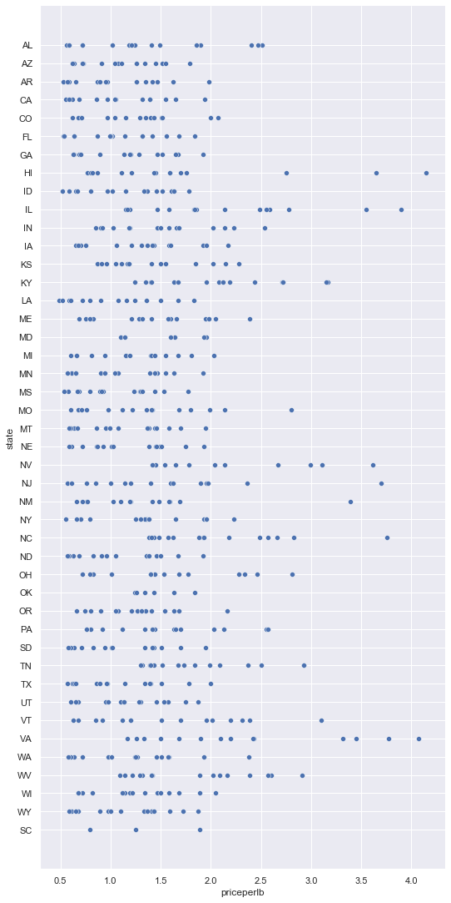
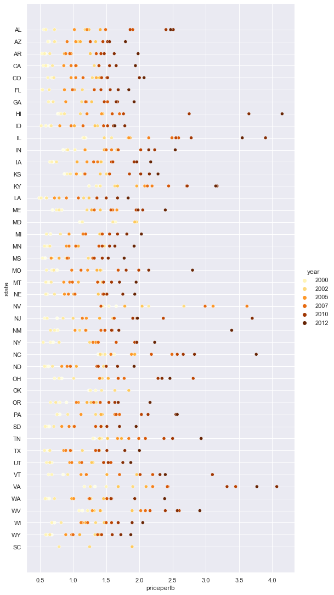
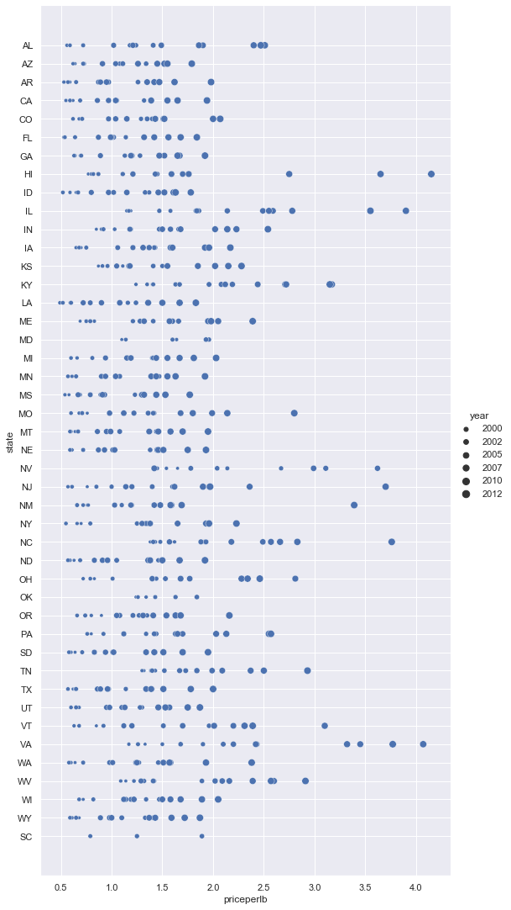

# Visualizing Relationships: All About Honey 🍯

Continuing with the nature focus of our research, let's discover interesting visualizations to show the relationships between various types of honey, according to a dataset derived from the [United States Department of Agriculture](https://www.nass.usda.gov/About_NASS/index.php). 

This dataset of about 600 items displays honey production in many U.S. states. So, for example, you can look at the number of colonies, yield per colony, total production, stocks, price per pound, and value of the honey produced in a given state from 1998-2012, with one row per year for each state. 

It will be interesting to visualize the relationship between a given state's production per year and, for example, the price of honey in that state. Alternately, you could visualize the relationship between states' honey yield per colony. This year span covers the devastating 'CCD' or 'Colony Collapse Disorder' first seen in 2006 (http://npic.orst.edu/envir/ccd.html), so it is a poignant dataset to study. 🐝

## Pre-Lecture Quiz

[Pre-lecture quiz]()

In this lesson, you can use Seaborn, which you use before, as a good library to visualize relationships between variables. Particularly interesting is the use of Seaborn's `relplot` function that allows scatter plots and line plots to quickly visualize '[statistical relationships](https://seaborn.pydata.org/tutorial/relational.html?highlight=relationships)', which allow the data scientist to better understand how variables relate to each other.
## Scatterplots

Use a scatterplot to show how the price of honey has evolved, year over year, per state. Seaborn, using `relplot`, conveniently groups the state data and displays data points for both categorical and numeric data. 

Let's start by importing the data and Seaborn:

```python
import pandas as pd
import matplotlib.pyplot as plt
import seaborn as sns
honey = pd.read_csv('../../data/honey.csv')
honey.head()
```
You notice that the honey data has several interesting columns, including year and price per pound. Let's explore this data, grouped by U.S. state:

| state | numcol | yieldpercol | totalprod | stocks   | priceperlb | prodvalue | year |
| ----- | ------ | ----------- | --------- | -------- | ---------- | --------- | ---- |
| AL    | 16000  | 71          | 1136000   | 159000   | 0.72       | 818000    | 1998 |
| AZ    | 55000  | 60          | 3300000   | 1485000  | 0.64       | 2112000   | 1998 |
| AR    | 53000  | 65          | 3445000   | 1688000  | 0.59       | 2033000   | 1998 |
| CA    | 450000 | 83          | 37350000  | 12326000 | 0.62       | 23157000  | 1998 |
| CO    | 27000  | 72          | 1944000   | 1594000  | 0.7        | 1361000   | 1998 |


Create a basic scatterplot to show the relationship between the price per pound of honey and its U.S. state of origin. Make the `y` axis tall enough to display all the states:

```python
sns.relplot(x="priceperlb", y="state", data=honey, height=15, aspect=.5);
```


Now, show the same data with a honey color scheme to show how the price evolves over the years. You can do this by adding a 'hue' parameter to show the change, year over year:

> ✅ Learn more about the [color palettes you can use in Seaborn](https://seaborn.pydata.org/tutorial/color_palettes.html) - try a beautiful rainbow color scheme!

```python
sns.relplot(x="priceperlb", y="state", hue="year", palette="YlOrBr", data=honey, height=15, aspect=.5);
```


With this color scheme change, you can see that there's obviously a strong progression over the years in terms of honey price per pound. Indeed, if you look at a sample set in the data to verify (pick a given state, Arizona for example) you can see a pattern of price increases year over year, with few exceptions:

| state | numcol | yieldpercol | totalprod | stocks  | priceperlb | prodvalue | year |
| ----- | ------ | ----------- | --------- | ------- | ---------- | --------- | ---- |
| AZ    | 55000  | 60          | 3300000   | 1485000 | 0.64       | 2112000   | 1998 |
| AZ    | 52000  | 62          | 3224000   | 1548000 | 0.62       | 1999000   | 1999 |
| AZ    | 40000  | 59          | 2360000   | 1322000 | 0.73       | 1723000   | 2000 |
| AZ    | 43000  | 59          | 2537000   | 1142000 | 0.72       | 1827000   | 2001 |
| AZ    | 38000  | 63          | 2394000   | 1197000 | 1.08       | 2586000   | 2002 |
| AZ    | 35000  | 72          | 2520000   | 983000  | 1.34       | 3377000   | 2003 |
| AZ    | 32000  | 55          | 1760000   | 774000  | 1.11       | 1954000   | 2004 |
| AZ    | 36000  | 50          | 1800000   | 720000  | 1.04       | 1872000   | 2005 |
| AZ    | 30000  | 65          | 1950000   | 839000  | 0.91       | 1775000   | 2006 |
| AZ    | 30000  | 64          | 1920000   | 902000  | 1.26       | 2419000   | 2007 |
| AZ    | 25000  | 64          | 1600000   | 336000  | 1.26       | 2016000   | 2008 |
| AZ    | 20000  | 52          | 1040000   | 562000  | 1.45       | 1508000   | 2009 |
| AZ    | 24000  | 77          | 1848000   | 665000  | 1.52       | 2809000   | 2010 |
| AZ    | 23000  | 53          | 1219000   | 427000  | 1.55       | 1889000   | 2011 |
| AZ    | 22000  | 46          | 1012000   | 253000  | 1.79       | 1811000   | 2012 |


Another way to visualize this progression is to use size, rather than color. For colorblind users, this might be a better option. Edit your visualization to show an increase of price by an increase in dot circumference:

```python
sns.relplot(x="priceperlb", y="state", size="year", data=honey, height=15, aspect=.5);
```
You can see the size of the dots gradually increasing.



Is this a simple case of supply and demand? Is there less honey available for purchase year over year, and thus the price increases?

To discover a correlation between price, number of colonies, and yield per colony, let's explore some line charts.


## Multi-line Plots


## 🚀 Challenge

## Post-Lecture Quiz

[Post-lecture quiz]()

## Review & Self Study


## Assignment

[Assignment Title](assignment.md)
