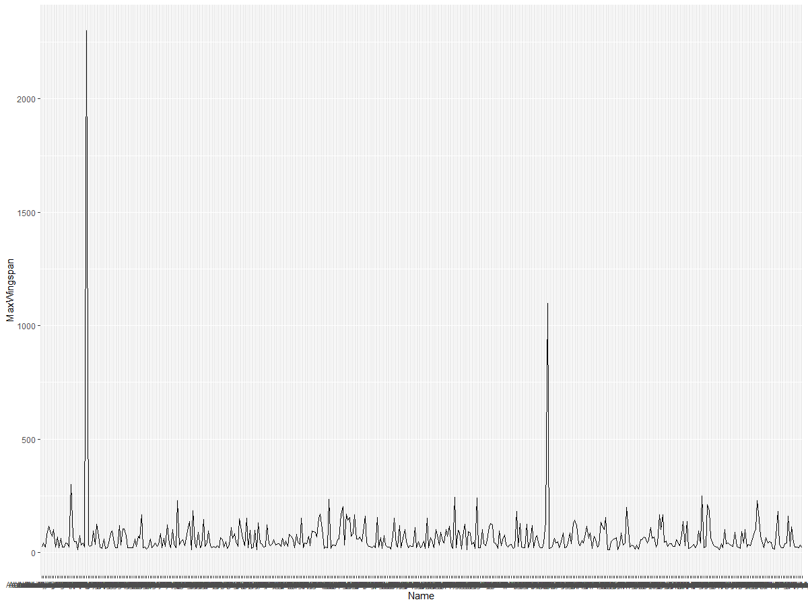
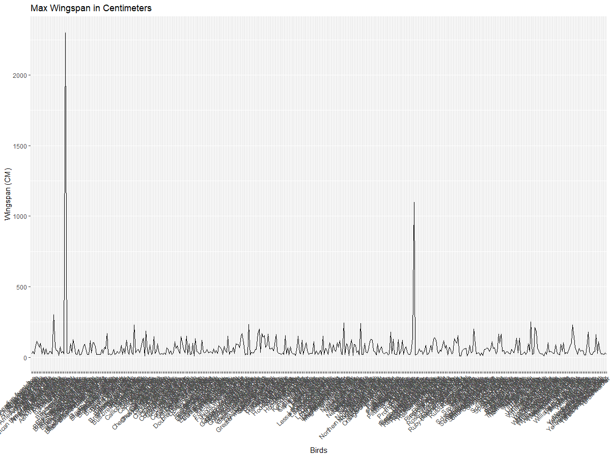
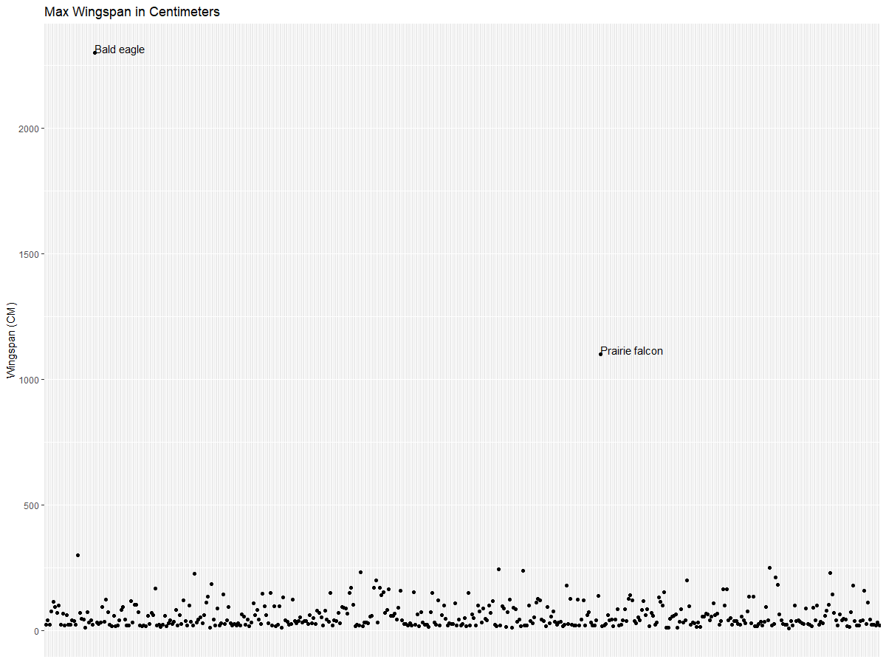
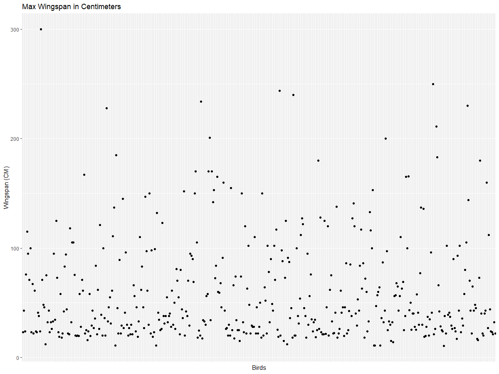
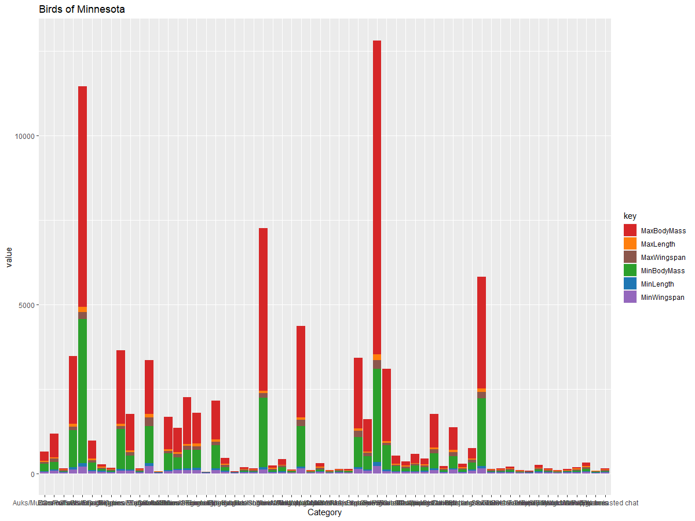
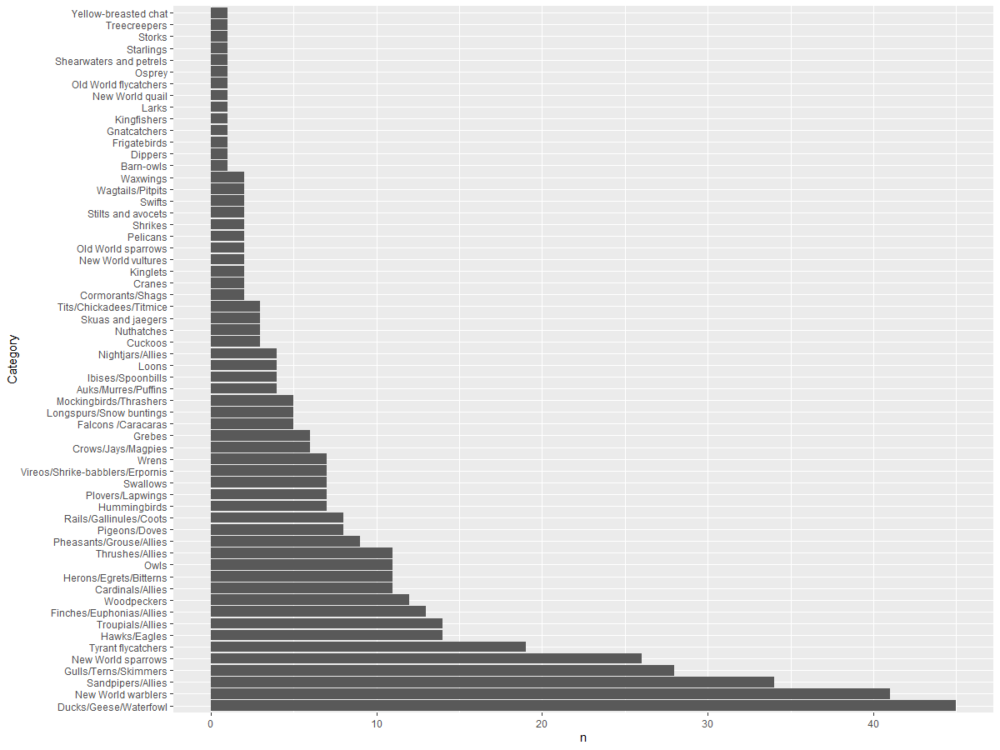
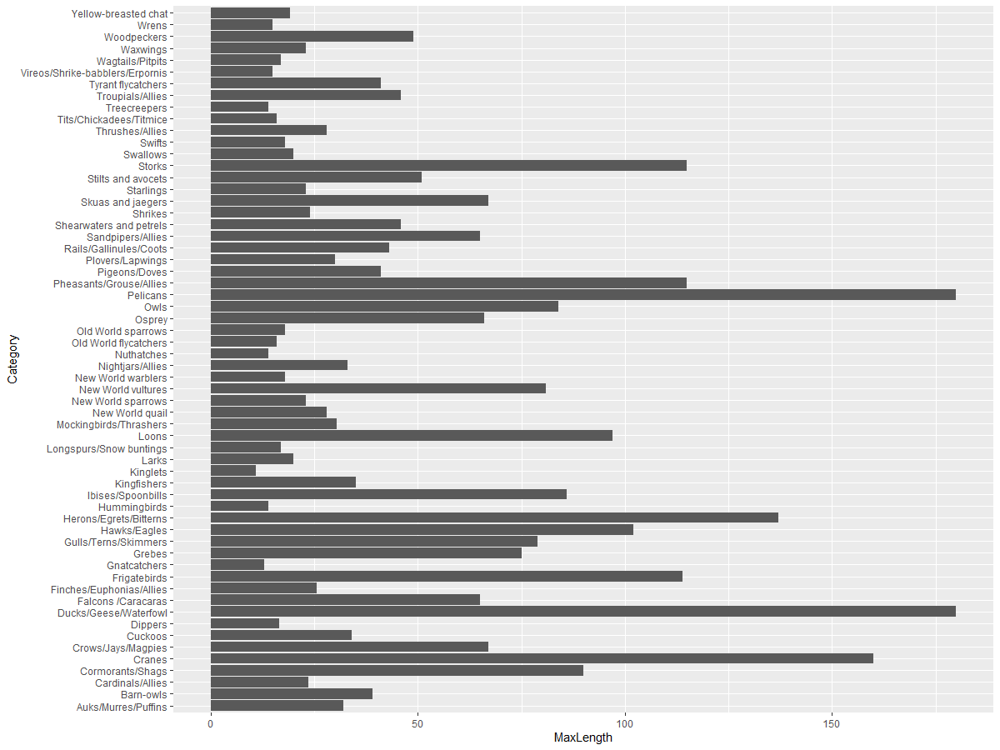
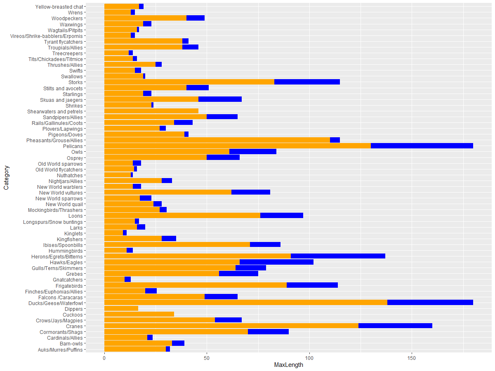

# Visualizing Quantities
| ](https://github.com/microsoft/Data-Science-For-Beginners/blob/main/sketchnotes/09-Visualizing-Quantities.png)|
|:---:|
| Visualizing Quantities - _Sketchnote by [@nitya](https://twitter.com/nitya)_ |

In this lesson you will explore how to use some of the many available R packages libraries to learn how to create interesting visualizations all around the concept of quantity. Using a cleaned dataset about the birds of Minnesota, you can learn many interesting facts about local wildlife. 
## [Pre-lecture quiz](https://purple-hill-04aebfb03.1.azurestaticapps.net/quiz/16)

## Observe wingspan with ggplot2
An excellent library to create both simple and sophisticated plots and charts of various kinds is [ggplot2](https://cran.r-project.org/web/packages/ggplot2/index.html). In general terms, the process of plotting data using these libraries includes identifying the parts of your dataframe that you want to target, performing any transforms on that data necessary, assigning its x and y axis values, deciding what kind of plot to show, and then showing the plot.

`ggplot2` is a system for declaratively creating graphics, based on The Grammar of Graphics. The [Grammar of Graphics](https://en.wikipedia.org/wiki/Ggplot2) is a general scheme for data visualization which breaks up graphs into semantic components such as scales and layers. In other words, the ease of creating plots and graphs for univariate or multivariate data with little code makes `ggplot2` the most popular package used for visualizations in R. The user tells `ggplot2` how to map the variables to aesthetics, the graphical primitives to use, and `ggplot2` takes care of the remaining.

> ✅ Plot = Data + Aesthetics + Geometry
> - Data refers to the dataset
> - Aesthetics indicate the variables to be studied (x and y variables)
> - Geometry refers to the type of plot (line plot, bar plot, etc.)

Choose the best geometry (type of plot) according to your data and the story you want to tell through the plot. 

> - To analyze trends: line, column
> - To compare values: bar, column, pie, scatterplot
> - To show how parts relate to a whole: pie
> - To show distribution of data: scatterplot, bar
> - To show relationships between values: line, scatterplot, bubble

✅ You can also checkout this descriptive [cheatsheet](https://nyu-cdsc.github.io/learningr/assets/data-visualization-2.1.pdf) for ggplot2.

## Build a line plot about bird wingspan values

Open the R console and import the dataset. 
> Note: The dataset is stored in the root of this repo in the `/data` folder.

Let's import the dataset and observe the head (top 5 rows) of the data.

```r
birds <- read.csv("../../data/birds.csv",fileEncoding="UTF-8-BOM")
head(birds)
```
The head of the data has a mix of text and numbers:

|      | Name                         | ScientificName         | Category              | Order        | Family   | Genus       | ConservationStatus | MinLength | MaxLength | MinBodyMass | MaxBodyMass | MinWingspan | MaxWingspan |
| ---: | :--------------------------- | :--------------------- | :-------------------- | :----------- | :------- | :---------- | :----------------- | --------: | --------: | ----------: | ----------: | ----------: | ----------: |
|    0 | Black-bellied whistling-duck | Dendrocygna autumnalis | Ducks/Geese/Waterfowl | Anseriformes | Anatidae | Dendrocygna | LC                 |        47 |        56 |         652 |        1020 |          76 |          94 |
|    1 | Fulvous whistling-duck       | Dendrocygna bicolor    | Ducks/Geese/Waterfowl | Anseriformes | Anatidae | Dendrocygna | LC                 |        45 |        53 |         712 |        1050 |          85 |          93 |
|    2 | Snow goose                   | Anser caerulescens     | Ducks/Geese/Waterfowl | Anseriformes | Anatidae | Anser       | LC                 |        64 |        79 |        2050 |        4050 |         135 |         165 |
|    3 | Ross's goose                 | Anser rossii           | Ducks/Geese/Waterfowl | Anseriformes | Anatidae | Anser       | LC                 |      57.3 |        64 |        1066 |        1567 |         113 |         116 |
|    4 | Greater white-fronted goose  | Anser albifrons        | Ducks/Geese/Waterfowl | Anseriformes | Anatidae | Anser       | LC                 |        64 |        81 |        1930 |        3310 |         130 |         165 |

Let's start by plotting some of the numeric data using a basic line plot. Suppose you wanted a view of the maximum wingspan for these interesting birds.

```r
install.packages("ggplot2")
library("ggplot2")
ggplot(data=birds, aes(x=Name, y=MaxWingspan,group=1)) +
  geom_line() 
```
Here, you install the `ggplot2` package and then import it into the workspace using the `library("ggplot2")` command. To plot any plot in ggplot, the `ggplot()` function is used and you specify the dataset, x and y variables as attributes. In this case, we use the `geom_line()` function since we aim to plot a line plot.



What do you notice immediately? There seems to be at least one outlier - that's quite a wingspan! A 2000+ centimeter wingspan equals more than 20 meters - are there Pterodactyls roaming Minnesota? Let's investigate.

While you could do a quick sort in Excel to find those outliers, which are probably typos, continue the visualization process by working from within the plot.

Add labels to the x-axis to show what kind of birds are in question:

```r
ggplot(data=birds, aes(x=Name, y=MaxWingspan,group=1)) +
  geom_line() +
  theme(axis.text.x = element_text(angle = 45, hjust=1))+
  xlab("Birds") +
  ylab("Wingspan (CM)") +
  ggtitle("Max Wingspan in Centimeters")
```
We specify the angle in the `theme` and specify the x and y axis labels in `xlab()` and `ylab()` respectively. The `ggtitle()` gives a name to the graph/plot.



Even with the rotation of the labels set to 45 degrees, there are too many to read. Let's try a different strategy: label only those outliers and set the labels within the chart. You can use a scatter chart to make more room for the labeling:

```r
ggplot(data=birds, aes(x=Name, y=MaxWingspan,group=1)) +
  geom_point() +
  geom_text(aes(label=ifelse(MaxWingspan>500,as.character(Name),'')),hjust=0,vjust=0) + 
  theme(axis.title.x=element_blank(), axis.text.x=element_blank(), axis.ticks.x=element_blank())
  ylab("Wingspan (CM)") +
  ggtitle("Max Wingspan in Centimeters") + 
```
What's going on here? You used the `geom_point()` function to plot scatter points. With this, you added labels for birds who had their `MaxWingspan > 500` and also hid the labels on the x axis to declutter the plot. 

What do you discover?



## Filter your data

Both the Bald Eagle and the Prairie Falcon, while probably very large birds, appear to be mislabeled, with an extra 0 added to their maximum wingspan. It's unlikely that you'll meet a Bald Eagle with a 25 meter wingspan, but if so, please let us know! Let's create a new dataframe without those two outliers:

```r
birds_filtered <- subset(birds, MaxWingspan < 500)

ggplot(data=birds_filtered, aes(x=Name, y=MaxWingspan,group=1)) +
  geom_point() +
  ylab("Wingspan (CM)") +
  xlab("Birds") +
  ggtitle("Max Wingspan in Centimeters") + 
  geom_text(aes(label=ifelse(MaxWingspan>500,as.character(Name),'')),hjust=0,vjust=0) +
  theme(axis.text.x=element_blank(), axis.ticks.x=element_blank())
```
We made a new dataframe `birds_filtered` and then plotted a scatter plot. By filtering out outliers, your data is now more cohesive and understandable.



Now that we have a cleaner dataset at least in terms of wingspan, let's discover more about these birds.

While line and scatter plots can display information about data values and their distributions, we want to think about the values inherent in this dataset. You could create visualizations to answer the following questions about quantity:

> How many categories of birds are there, and what are their numbers?
> How many birds are extinct, endangered, rare, or common?
> How many are there of the various genus and orders in Linnaeus's terminology?
## Explore bar charts

Bar charts are practical when you need to show groupings of data. Let's explore the categories of birds that exist in this dataset to see which is the most common by number.
Let's create a bar chart on filtered data.

```r
install.packages("dplyr")
install.packages("tidyverse")

library(lubridate)
library(scales)
library(dplyr)
library(ggplot2)
library(tidyverse)

birds_filtered %>% group_by(Category) %>%
  summarise(n=n(),
  MinLength = mean(MinLength),
  MaxLength = mean(MaxLength),
  MinBodyMass = mean(MinBodyMass),
  MaxBodyMass = mean(MaxBodyMass),
  MinWingspan=mean(MinWingspan),
  MaxWingspan=mean(MaxWingspan)) %>% 
  gather("key", "value", - c(Category, n)) %>%
  ggplot(aes(x = Category, y = value, group = key, fill = key)) +
  geom_bar(stat = "identity") +
  scale_fill_manual(values = c("#D62728", "#FF7F0E", "#8C564B","#2CA02C", "#1F77B4", "#9467BD")) +                   
  xlab("Category")+ggtitle("Birds of Minnesota")

```
In the following snippet, we install the [dplyr](https://www.rdocumentation.org/packages/dplyr/versions/0.7.8) and [lubridate](https://www.rdocumentation.org/packages/lubridate/versions/1.8.0) packages to help manipulate and group data in order to plot a stacked bar chart. First, you group the data by the `Category` of bird and then summarise the `MinLength`, `MaxLength`, `MinBodyMass`,`MaxdyMass`,`MinWingspan`,`MaxWingspan` columns. Then, plot the bar chart using `ggplot2` package and specify the colours for the different category and the labels. 



This bar chart, however, is unreadable because there is too much non-grouped data. You need to select only the data that you want to plot, so let's look at the length of birds based on their category.

Filter your data to include only the bird's category.

Since there are many categories, you can display this chart vertically and tweak its height to account for all the data:

```r
birds_count<-dplyr::count(birds_filtered, Category, sort = TRUE)
birds_count$Category <- factor(birds_count$Category, levels = birds_count$Category)
ggplot(birds_count,aes(Category,n))+geom_bar(stat="identity")+coord_flip()
```
You first count unique values in the `Category` column and then sort them into a new dataframe `birds_count`.This sorted data is then factored in the same level so that it is plotted in the sorted way. Using `ggplot2` you then plot the data in a bar chart. The `coord_flip()` plots horizontal bars. 



This bar chart shows a good view of the number of birds in each category. In a blink of an eye, you see that the largest number of birds in this region are in the Ducks/Geese/Waterfowl category. Minnesota is the 'land of 10,000 lakes' so this isn't surprising!

✅ Try some other counts on this dataset. Does anything surprise you?

## Comparing data

You can try different comparisons of grouped data by creating new axes. Try a comparison of the MaxLength of a bird, based on its category:

```r
birds_grouped <- birds_filtered %>%
  group_by(Category) %>%
  summarise(
  MaxLength = max(MaxLength, na.rm = T),
  MinLength = max(MinLength, na.rm = T)
           ) %>%
  arrange(Category)
  
ggplot(birds_grouped,aes(Category,MaxLength))+geom_bar(stat="identity")+coord_flip()
```
We group the `birds_filtered` data by `Category` and then plot a bar graph. 



Nothing is surprising here: hummingbirds have the least MaxLength compared to Pelicans or Geese. It's good when data makes logical sense!

You can create more interesting visualizations of bar charts by superimposing data. Let's superimpose Minimum and Maximum Length on a given bird category:

```r
ggplot(data=birds_grouped, aes(x=Category)) +
  geom_bar(aes(y=MaxLength), stat="identity", position ="identity",  fill='blue') +
  geom_bar(aes(y=MinLength), stat="identity", position="identity", fill='orange')+
  coord_flip()
```


## 🚀 Challenge

This bird dataset offers a wealth of information about different types of birds within a particular ecosystem. Search around the internet and see if you can find other bird-oriented datasets. Practice building charts and graphs around these birds to discover facts you didn't realize.
## [Post-lecture quiz](https://purple-hill-04aebfb03.1.azurestaticapps.net/quiz/17)

## Review & Self Study

This first lesson has given you some information about how to use `ggplot2`to visualize quantities. Do some research around other ways to work with datasets for visualization. Research and lookout for datasets that you could visualize using other packages like [Lattice](https://stat.ethz.ch/R-manual/R-devel/library/lattice/html/Lattice.html) and [Plotly](https://github.com/plotly/plotly.R#readme)

## Assignment
[Lines, Scatters, and Bars](assignment.md)
