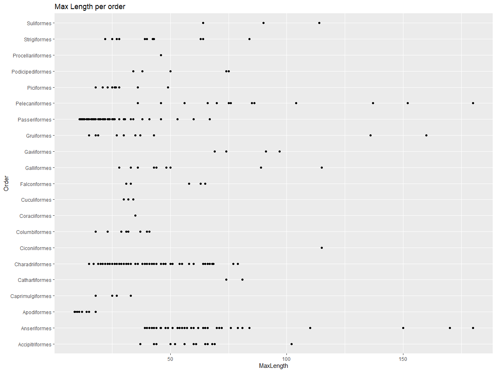
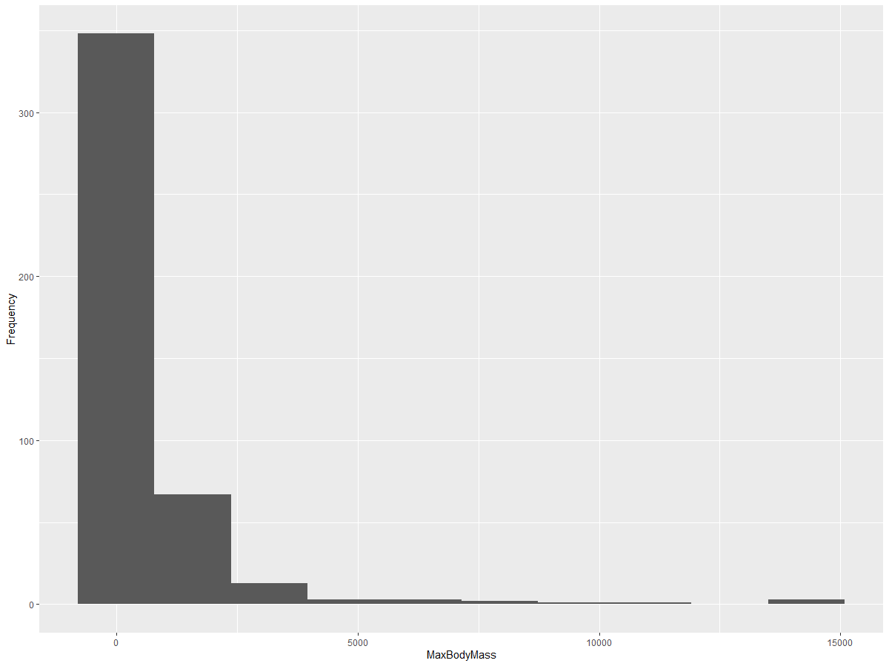
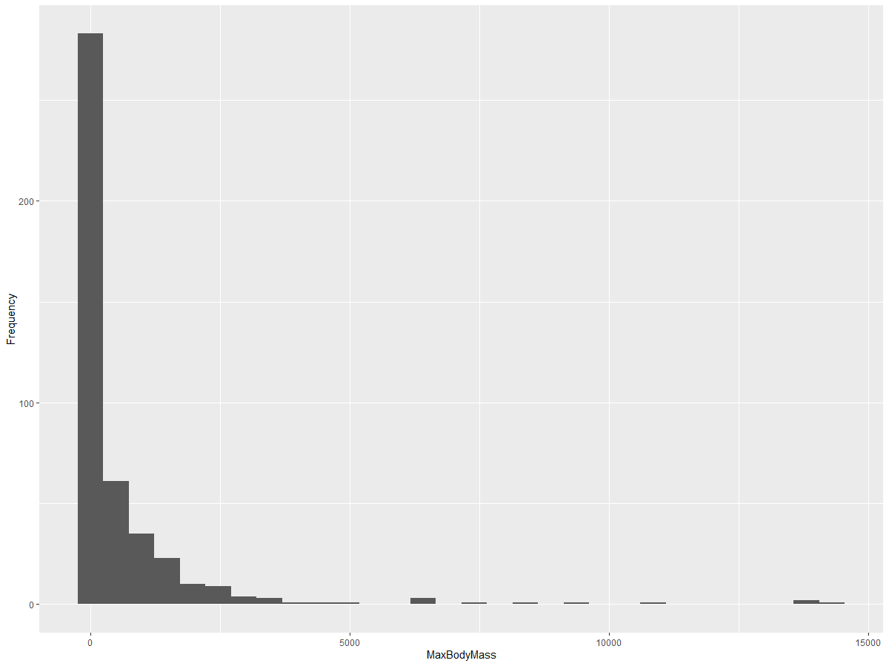
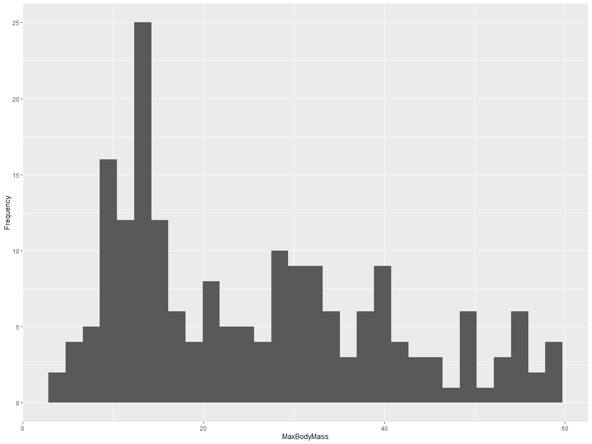
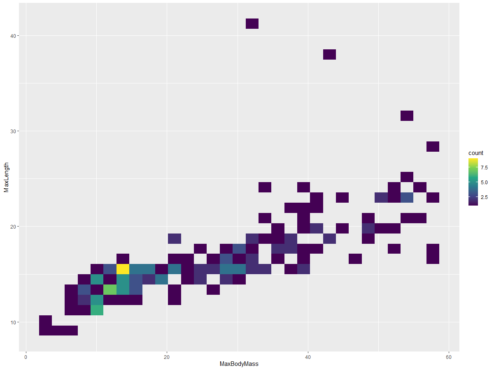
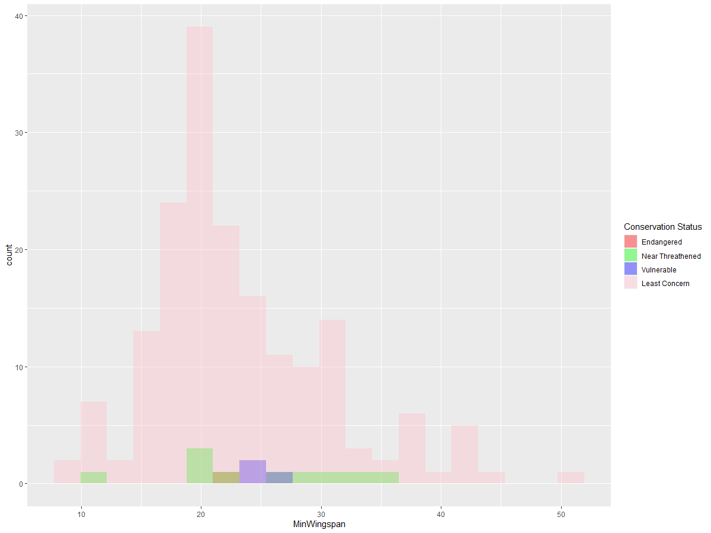
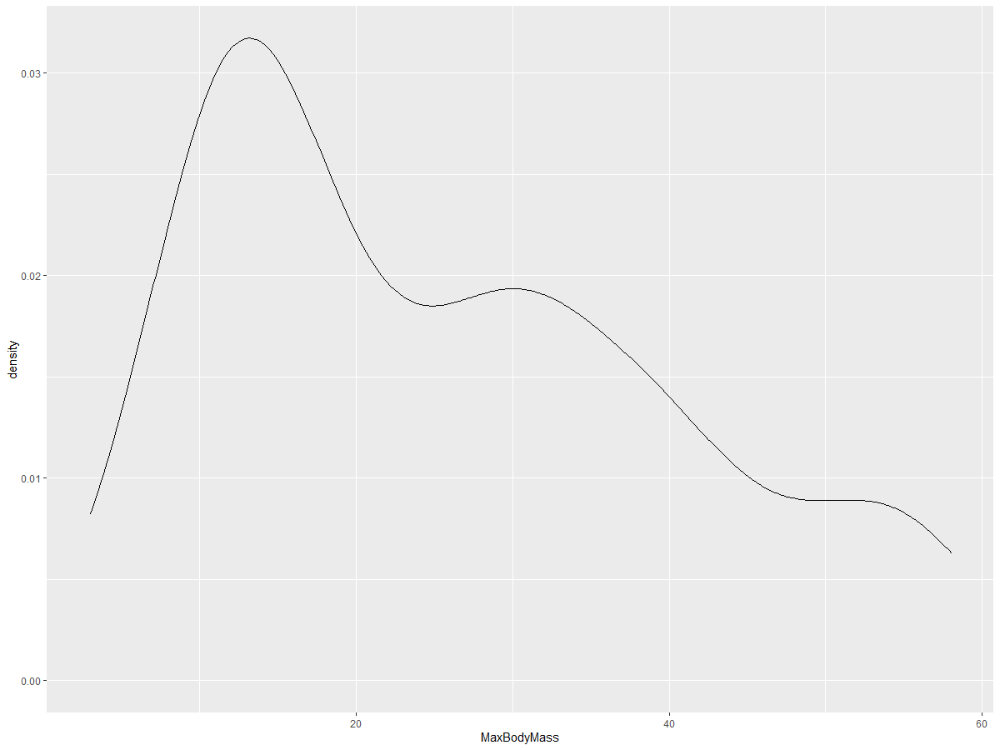
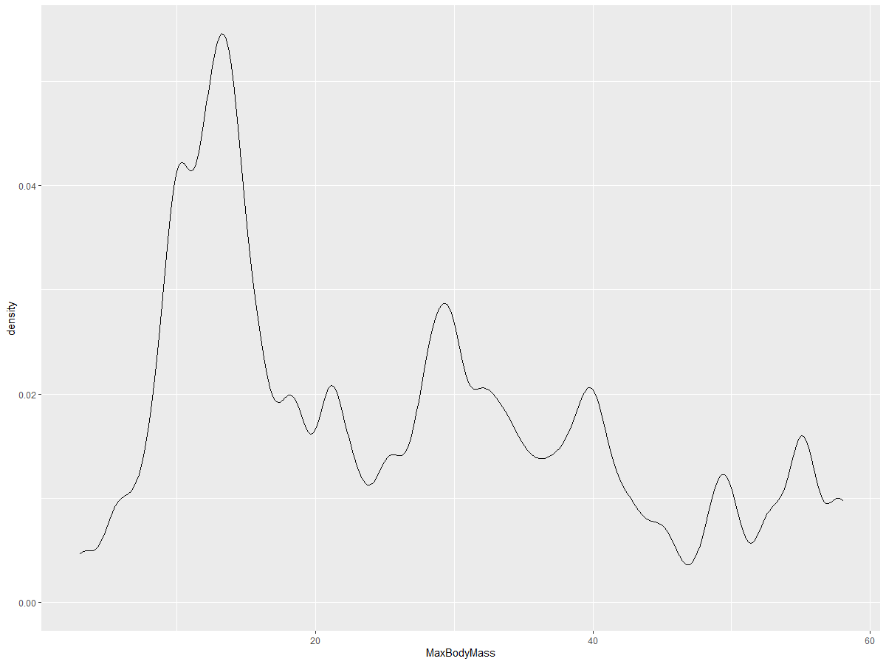
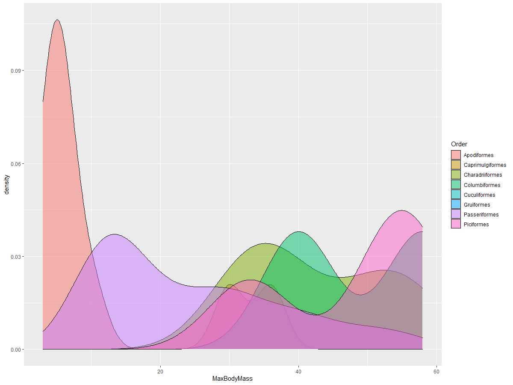

# Visualizing Distributions

| ](https://github.com/microsoft/Data-Science-For-Beginners/blob/main/sketchnotes/10-Visualizing-Distributions.png)|
|:---:|
| Visualizing Distributions - _Sketchnote by [@nitya](https://twitter.com/nitya)_ |

In the previous lesson, you learned some interesting facts about a dataset about the birds of Minnesota. You found some erroneous data by visualizing outliers and looked at the differences between bird categories by their maximum length.

## [Pre-lecture quiz](https://purple-hill-04aebfb03.1.azurestaticapps.net/quiz/18)
## Explore the birds dataset

Another way to dig into data is by looking at its distribution, or how the data is organized along an axis. Perhaps, for example, you'd like to learn about the general distribution, for this dataset, of the maximum wingspan or maximum body mass for the birds of Minnesota. 

Let's discover some facts about the distributions of data in this dataset. In your R console, import `ggplot2` and the database. Remove the outliers from the database just like in the previous topic.

```r
library(ggplot2)

birds <- read.csv("../../data/birds.csv",fileEncoding="UTF-8-BOM")

birds_filtered <- subset(birds, MaxWingspan < 500)
head(birds_filtered)
```
|      | Name                         | ScientificName         | Category              | Order        | Family   | Genus       | ConservationStatus | MinLength | MaxLength | MinBodyMass | MaxBodyMass | MinWingspan | MaxWingspan |
| ---: | :--------------------------- | :--------------------- | :-------------------- | :----------- | :------- | :---------- | :----------------- | --------: | --------: | ----------: | ----------: | ----------: | ----------: |
|    0 | Black-bellied whistling-duck | Dendrocygna autumnalis | Ducks/Geese/Waterfowl | Anseriformes | Anatidae | Dendrocygna | LC                 |        47 |        56 |         652 |        1020 |          76 |          94 |
|    1 | Fulvous whistling-duck       | Dendrocygna bicolor    | Ducks/Geese/Waterfowl | Anseriformes | Anatidae | Dendrocygna | LC                 |        45 |        53 |         712 |        1050 |          85 |          93 |
|    2 | Snow goose                   | Anser caerulescens     | Ducks/Geese/Waterfowl | Anseriformes | Anatidae | Anser       | LC                 |        64 |        79 |        2050 |        4050 |         135 |         165 |
|    3 | Ross's goose                 | Anser rossii           | Ducks/Geese/Waterfowl | Anseriformes | Anatidae | Anser       | LC                 |      57.3 |        64 |        1066 |        1567 |         113 |         116 |
|    4 | Greater white-fronted goose  | Anser albifrons        | Ducks/Geese/Waterfowl | Anseriformes | Anatidae | Anser       | LC                 |        64 |        81 |        1930 |        3310 |         130 |         165 |

In general, you can quickly look at the way data is distributed by using a scatter plot as we did in the previous lesson:

```r
ggplot(data=birds_filtered, aes(x=Order, y=MaxLength,group=1)) +
  geom_point() +
  ggtitle("Max Length per order") + coord_flip()
```


This gives an overview of the general distribution of body length per bird Order, but it is not the optimal way to display true distributions. That task is usually handled by creating a Histogram.
## Working with histograms

`ggplot2` offers very good ways to visualize data distribution using Histograms. This type of chart is like a bar chart where the distribution can be seen via a rise and fall of the bars. To build a histogram, you need numeric data. To build a Histogram, you can plot a chart defining the kind as 'hist' for Histogram. This chart shows the distribution of MaxBodyMass for the entire dataset's range of numeric data. By dividing the array of data it is given into smaller bins, it can display the distribution of the data's values:

```r
ggplot(data = birds_filtered, aes(x = MaxBodyMass)) + 
  geom_histogram(bins=10)+ylab('Frequency')
```


As you can see, most of the 400+ birds in this dataset fall in the range of under 2000 for their Max Body Mass. Gain more insight into the data by changing  the `bins` parameter to a higher number, something like 30:

```r
ggplot(data = birds_filtered, aes(x = MaxBodyMass)) + geom_histogram(bins=30)+ylab('Frequency')
```



This chart shows the distribution in a bit more granular fashion. A chart less skewed to the left could be created by ensuring that you only select data within a given range:

Filter your data to get only those birds whose body mass is under 60, and show 30 `bins`:

```r
birds_filtered_1 <- subset(birds_filtered, MaxBodyMass > 1 & MaxBodyMass < 60)
ggplot(data = birds_filtered_1, aes(x = MaxBodyMass)) + 
  geom_histogram(bins=30)+ylab('Frequency')
```



✅ Try some other filters and data points. To see the full distribution of the data, remove the `['MaxBodyMass']` filter to show labeled distributions.

The histogram offers some nice color and labeling enhancements to try as well:

Create a 2D histogram to compare the relationship between two distributions. Let's compare `MaxBodyMass` vs. `MaxLength`. `ggplot2` offers a built-in way to show convergence using brighter colors:

```r
ggplot(data=birds_filtered_1, aes(x=MaxBodyMass, y=MaxLength) ) +
  geom_bin2d() +scale_fill_continuous(type = "viridis")
```
There appears to be an expected correlation between these two elements along an expected axis, with one particularly strong point of convergence:



Histograms work well by default for numeric data. What if you need to see distributions according to text data? 
## Explore the dataset for distributions using text data 

This dataset also includes good information about the bird category and its genus, species, and family as well as its conservation status. Let's dig into this conservation information. What is the distribution of the birds according to their conservation status?

> ✅ In the dataset, several acronyms are used to describe conservation status. These acronyms come from the [IUCN Red List Categories](https://www.iucnredlist.org/), an organization that catalogs species' status.
> 
> - CR: Critically Endangered
> - EN: Endangered
> - EX: Extinct
> - LC: Least Concern
> - NT: Near Threatened
> - VU: Vulnerable

These are text-based values so you will need to do a transform to create a histogram. Using the filteredBirds dataframe, display its conservation status alongside its Minimum Wingspan. What do you see? 

```r
birds_filtered_1$ConservationStatus[birds_filtered_1$ConservationStatus == 'EX'] <- 'x1' 
birds_filtered_1$ConservationStatus[birds_filtered_1$ConservationStatus == 'CR'] <- 'x2'
birds_filtered_1$ConservationStatus[birds_filtered_1$ConservationStatus == 'EN'] <- 'x3'
birds_filtered_1$ConservationStatus[birds_filtered_1$ConservationStatus == 'NT'] <- 'x4'
birds_filtered_1$ConservationStatus[birds_filtered_1$ConservationStatus == 'VU'] <- 'x5'
birds_filtered_1$ConservationStatus[birds_filtered_1$ConservationStatus == 'LC'] <- 'x6'

ggplot(data=birds_filtered_1, aes(x = MinWingspan, fill = ConservationStatus)) +
  geom_histogram(position = "identity", alpha = 0.4, bins = 20) +
  scale_fill_manual(name="Conservation Status",values=c("red","green","blue","pink"),labels=c("Endangered","Near Threathened","Vulnerable","Least Concern"))
```



There doesn't seem to be a good correlation between minimum wingspan and conservation status. Test other elements of the dataset using this method. You can try different filters as well. Do you find any correlation?

## Density plots

You may have noticed that the histograms we have looked at so far are 'stepped' and do not flow smoothly in an arc. To show a smoother density chart, you can try a density plot.

Let's work with density plot's now!

```r
ggplot(data = birds_filtered_1, aes(x = MinWingspan)) + 
  geom_density()
```


You can see how the plot echoes the previous one for Minimum Wingspan data; it's just a bit smoother. If you wanted to revisit that jagged MaxBodyMass line in the second chart you built, you could smooth it out very well by recreating it using this method:

```r
ggplot(data = birds_filtered_1, aes(x = MaxBodyMass)) + 
  geom_density()
```


If you wanted a smooth, but not too smooth line, edit the `adjust` parameter: 

```r
ggplot(data = birds_filtered_1, aes(x = MaxBodyMass)) + 
  geom_density(adjust = 1/5)
```


✅ Read about the parameters available for this type of plot and experiment!

This type of chart offers beautifully explanatory visualizations. With a few lines of code, for example, you can show the max body mass density per bird Order:

```r
ggplot(data=birds_filtered_1,aes(x = MaxBodyMass, fill = Order)) +
  geom_density(alpha=0.5)
```


## 🚀 Challenge

Histograms are a more sophisticated type of chart than basic scatterplots, bar charts, or line charts. Go on a search on the internet to find good examples of the use of histograms. How are they used, what do they demonstrate, and in what fields or areas of inquiry do they tend to be used?

## [Post-lecture quiz](https://purple-hill-04aebfb03.1.azurestaticapps.net/quiz/19)

## Review & Self Study

In this lesson, you used `ggplot2` and started working to show more sophisticated charts. Do some research on `geom_density_2d()` a "continuous probability density curve in one or more dimensions". Read through [the documentation](https://ggplot2.tidyverse.org/reference/geom_density_2d.html) to understand how it works.

## Assignment

[Apply your skills](assignment.md)


