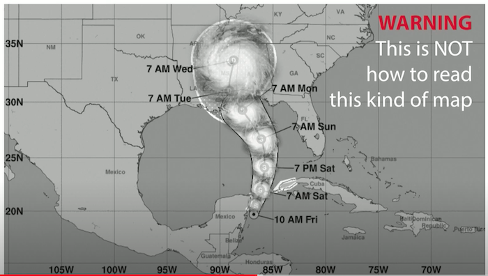
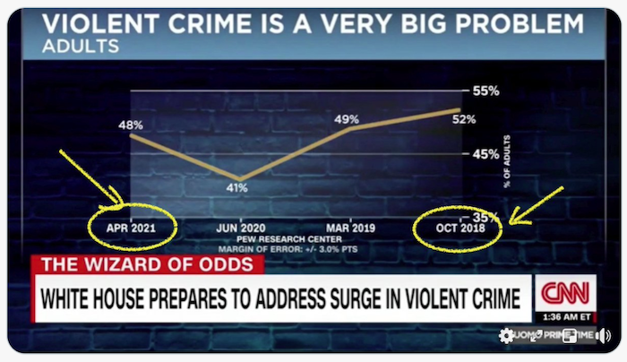
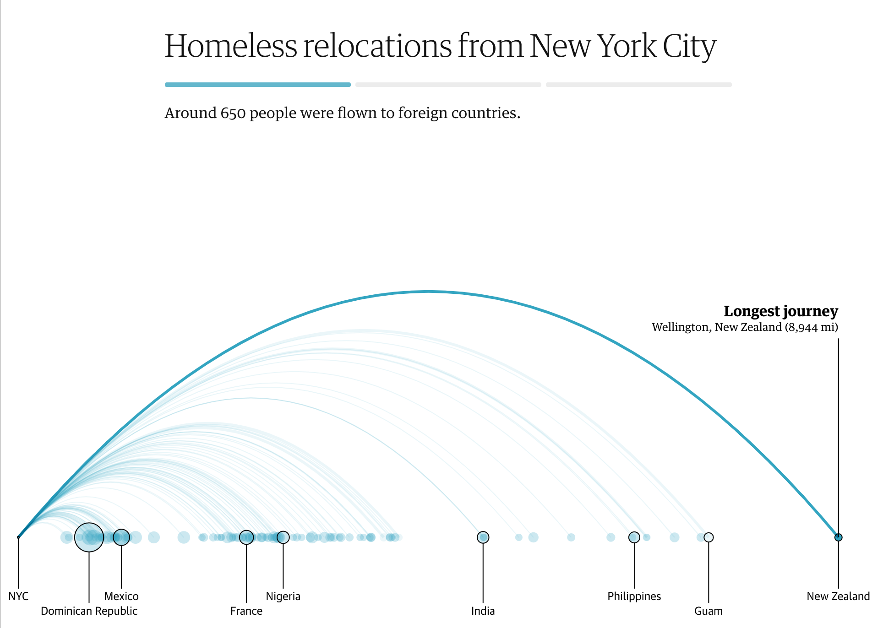

# Making Meaningful Visualizations

| ](../../../sketchnotes/13-MeaningfulViz.png)|
|:---:|
| Meaningful Visualizations - _Sketchnote by [@nitya](https://twitter.com/nitya)_ |

> "If you torture the data long enough, it will confess to anything" -- [Ronald Coase](https://en.wikiquote.org/wiki/Ronald_Coase)

One of the basic skills of a data scientist is the ability to create a meaningful data visualization that helps answer questions you might have. Prior to visualizing your data, you need to ensure that it has been cleaned and prepared, as you did in prior lessons. After that, you can start deciding how best to present the data.

In this lesson, you will review:

1. How to choose the right chart type
2. How to avoid deceptive charting
3. How to work with color
4. How to style your charts for readability
5. How to build animated or 3D charting solutions
6. How to build a creative visualization

## [Pre-Lecture Quiz](https://purple-hill-04aebfb03.1.azurestaticapps.net/quiz/24)

## Choose the right chart type

In previous lessons, you experimented with building all kinds of interesting data visualizations using Matplotlib and Seaborn for charting. In general, you can select the [right kind of chart](https://chartio.com/learn/charts/how-to-select-a-data-vizualization/) for the question you are asking using this table:

| You need to:               | You should use:                 |
| -------------------------- | ------------------------------- |
| Show data trends over time | Line                            |
| Compare categories         | Bar, Pie                        |
| Compare totals             | Pie, Stacked Bar                |
| Show relationships         | Scatter, Line, Facet, Dual Line |
| Show distributions         | Scatter, Histogram, Box         |
| Show proportions           | Pie, Donut, Waffle              |

> ✅ Depending on the makeup of your data, you might need to convert it from text to numeric to get a given chart to support it.

## Avoid deception

Even if a data scientist is careful to choose the right chart for the right data, there are plenty of ways that data can be displayed in a way to prove a point, often at the cost of undermining the data itself. There are many examples of deceptive charts and infographics!

[](https://www.youtube.com/watch?v=oX74Nge8Wkw "How charts lie")

> 🎥 Click the image above for a conference talk about deceptive charts

This chart reverses the X axis to show the opposite of the truth, based on date:



[This chart](https://media.firstcoastnews.com/assets/WTLV/images/170ae16f-4643-438f-b689-50d66ca6a8d8/170ae16f-4643-438f-b689-50d66ca6a8d8_1140x641.jpg) is even more deceptive, as the eye is drawn to the right to conclude that, over time, COVID cases have declined in the various counties. In fact, if you look closely at the dates, you find that they have been rearranged to give that deceptive downward trend.


This notorious example uses color AND a flipped Y axis to deceive: instead of concluding that gun deaths spiked after the passage of gun-friendly legislation, in fact the eye is fooled to think that the opposite is true:


This strange chart shows how proportion can be manipulated, to hilarious effect:


Comparing the incomparable is yet another shady trick. There is a [wonderful web site](https://tylervigen.com/spurious-correlations) all about 'spurious correlations' displaying 'facts' correlating things like the divorce rate in Maine and the consumption of margarine. A Reddit group also collects the [ugly uses](https://www.reddit.com/r/dataisugly/top/?t=all) of data.

It's important to understand how easily the eye can be fooled by deceptive charts. Even if the data scientist's intention is good, the choice of a bad type of chart, such as a pie chart showing too many categories, can be deceptive.

## Color

You saw in the 'Florida gun violence' chart above how color can provide an additional layer of meaning to charts, especially ones not designed using libraries such as ggplot2 and RColorBrewer which come with various vetted color libraries and palettes. If you are making a chart by hand, do a little study of [color theory](https://colormatters.com/color-and-design/basic-color-theory)

> ✅ Be aware, when designing charts, that accessibility is an important aspect of visualization. Some of your users might be color blind - does your chart display well for users with visual impairments?

Be careful when choosing colors for your chart, as color can convey meaning you might not intend. The 'pink ladies' in the 'height' chart above convey a distinctly 'feminine' ascribed meaning that adds to the bizarreness of the chart itself.

While [color meaning](https://colormatters.com/color-symbolism/the-meanings-of-colors) might be different in different parts of the world, and tend to change in meaning according to their shade. Generally speaking, color meanings include:

| Color  | Meaning             |
| ------ | ------------------- |
| red    | power               |
| blue   | trust, loyalty      |
| yellow | happiness, caution  |
| green  | ecology, luck, envy |
| purple | happiness           |
| orange | vibrance            |

If you are tasked with building a chart with custom colors, ensure that your charts are both accessible and the color you choose coincides with the meaning you are trying to convey.

## Styling your charts for readability

Charts are not meaningful if they are not readable! Take a moment to consider styling the width and height of your chart to scale well with your data. If one variable (such as all 50 states) need to be displayed, show them vertically on the Y axis if possible so as to avoid a horizontally-scrolling chart.

Label your axes, provide a legend if necessary, and offer tooltips for better comprehension of data.

If your data is textual and verbose on the X axis, you can angle the text for better readability. [plot3D](https://cran.r-project.org/web/packages/plot3D/index.html) offers 3d plotting, if you data supports it. Sophisticated data visualizations can be produced using it.


## Animation and 3D chart display

Some of the best data visualizations today are animated. Shirley Wu has amazing ones done with D3, such as '[film flowers](http://bl.ocks.org/sxywu/raw/d612c6c653fb8b4d7ff3d422be164a5d/)', where each flower is a visualization of a movie. Another example for the Guardian is 'bussed out', an interactive experience combining visualizations with Greensock and D3 plus a scrollytelling article format to show how NYC handles its homeless problem by bussing people out of the city.



> "Bussed Out: How America Moves its Homeless" from [the Guardian](https://www.theguardian.com/us-news/ng-interactive/2017/dec/20/bussed-out-america-moves-homeless-people-country-study). Visualizations by Nadieh Bremer & Shirley Wu

While this lesson is insufficient to go into depth to teach these powerful visualization libraries, try your hand at D3 in a Vue.js app using a library to display a visualization of the book "Dangerous Liaisons" as an animated social network.

> "Les Liaisons Dangereuses" is an epistolary novel, or a novel presented as a series of letters. Written in 1782 by Choderlos de Laclos, it tells the story of the vicious, morally-bankrupt social maneuvers of two dueling protagonists of the French aristocracy in the late 18th century, the Vicomte de Valmont and the Marquise de Merteuil. Both meet their demise in the end but not without inflicting a great deal of social damage. The novel unfolds as a series of letters written to various people in their circles, plotting for revenge or simply to make trouble. Create a visualization of these letters to discover the major kingpins of the narrative, visually.

You will complete a web app that will display an animated view of this social network. It uses a library that was built to create a [visual of a network](https://github.com/emiliorizzo/vue-d3-network) using Vue.js and D3. When the app is running, you can pull the nodes around on the screen to shuffle the data around.


## Project: Build a chart to show a network using D3.js

> This lesson folder includes a `solution` folder where you can find the completed project, for your reference.

1. Follow the instructions in the README.md file in the starter folder's root. Make sure you have NPM and Node.js running on your machine before installing your project's dependencies.

2. Open the `starter/src` folder. You'll discover an `assets` folder where you can find a .json file with all the letters from the novel, numbered, with a 'to' and 'from' annotation.

3. Complete the code in `components/Nodes.vue` to enable the visualization. Look for the method called `createLinks()` and add the following nested loop.

Loop through the .json object to capture the 'to' and 'from' data for the letters and build up the `links` object so that the visualization library can consume it:

```javascript
//loop through letters
      let f = 0;
      let t = 0;
      for (var i = 0; i < letters.length; i++) {
          for (var j = 0; j < characters.length; j++) {
              
            if (characters[j] == letters[i].from) {
              f = j;
            }
            if (characters[j] == letters[i].to) {
              t = j;
            }
        }
        this.links.push({ sid: f, tid: t });
      }
  ```

Run your app from the terminal (npm run serve) and enjoy the visualization!

## 🚀 Challenge

Take a tour of the internet to discover deceptive visualizations. How does the author fool the user, and is it intentional? Try correcting the visualizations to show how they should look.

## [Post-lecture quiz](https://purple-hill-04aebfb03.1.azurestaticapps.net/quiz/25)

## Review & Self Study

Here are some articles to read about deceptive data visualization:

https://gizmodo.com/how-to-lie-with-data-visualization-1563576606

http://ixd.prattsi.org/2017/12/visual-lies-usability-in-deceptive-data-visualizations/

Take a look at these interest visualizations for historical assets and artifacts:

https://handbook.pubpub.org/

Look through this article on how animation can enhance your visualizations:

https://medium.com/@EvanSinar/use-animation-to-supercharge-data-visualization-cd905a882ad4

## Assignment

[Build your own custom visualization](assignment.md)
