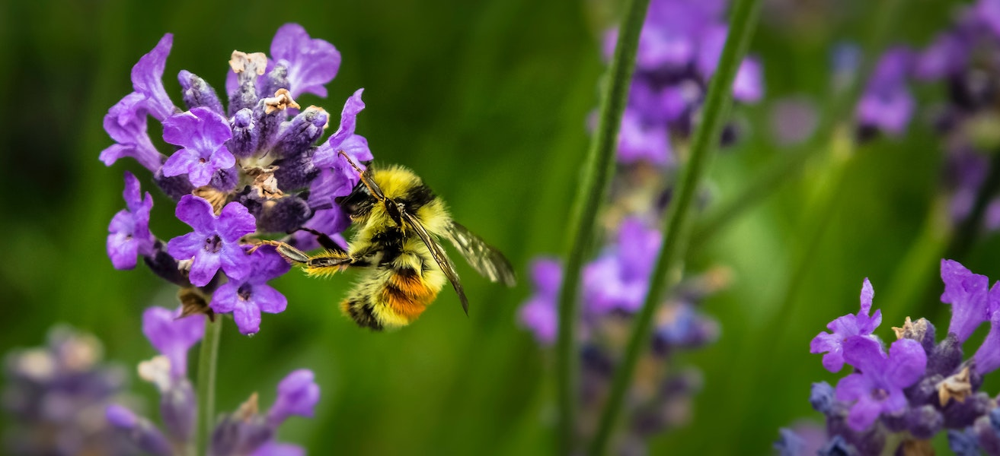

# 시각화

> Photo by <a href="https://unsplash.com/@jenna2980?utm_source=unsplash&utm_medium=referral&utm_content=creditCopyText">Jenna Lee</a> on <a href="https://unsplash.com/s/photos/bees-in-a-meadow?utm_source=unsplash&utm_medium=referral&utm_content=creditCopyText">Unsplash</a>
  

데이터 시각화는 데이터 과학자의 가장 중요한 작업 중 하나입니다. 이미지는 1000 단어의 가치가 있으며 시각화는 급증, 이상값, 그룹화, 경향 등과 같은 데이터의 모든 흥미로운 부분을 식별하는 데 도움이 되어 데이터가 전달하려는 이야기를 이해하는 데 도움이 됩니다.

이 다섯 개의 수업에서는 자연에서 얻은 데이터를 탐색하고, 다양한 기술을 사용하여 흥미롭고 아름다운 시각화를 만들어봅시다.
### 주제

1. [수량 시각화](../09-visualization-quantities/README.md)
2. [분포 시각화](../10-visualization-distributions/README.md)
3. [비율 시각화](../11-visualization-proportions/README.md)
4. [관계 시각화](../12-visualization-relationships/README.md)
5. [의미있는 시각화 만들기](../13-meaningful-visualizations/README.md)

### 크레딧

강의를 만드신 분: [Jen Looper](https://twitter.com/jenlooper)

🍯 미국 꿀 생산에 대한 데이터는 [Kaggle](https://www.kaggle.com/jessicali9530/honey-production)의 Jessica Li의 프로젝트에서 제공되는 것입니다. 이 [데이터](https://usda.library.cornell.edu/concern/publications/rn301137d)는 [미국 농무부](https://www.nass.usda.gov/About_NASS/index.php)에서 만들어졌습니다.

🍄 버섯에 대한 데이터 역시 [Kaggle](https://www.kaggle.com/hatterasdunton/mushroom-classification-updated-dataset)에서 제공되었고, Hatteras Dunton이 수정했습니다. 이 데이터 셋에는 Agaricus 및 Lepiota 과에 속하는 23종의 주름 버섯목에 해당하는 가상 샘플에 대한 설명이 포함되어 있습니다. 버섯에 대한 정보는 'The Audubon Society Field Guide to North American Mushrooms(1981)'에서 발췌했습니다. 이 데이터 셋은 1987년 UCI ML 27에 기증되었습니다.

🦆 Minnesota 새에 대한 데이터는 Hannah Collins가 [위키피디아](https://en.wikipedia.org/wiki/List_of_birds_of_Minnesota)에서 스크랩한 [Kaggle](https://www.kaggle.com/hannahcollins/minnesota-birds) 데이터 입니다.

모든 데이터 셋에는 [CC0: Creative Commons](https://creativecommons.org/publicdomain/zero/1.0/) 라이선스가 부여됩니다.

