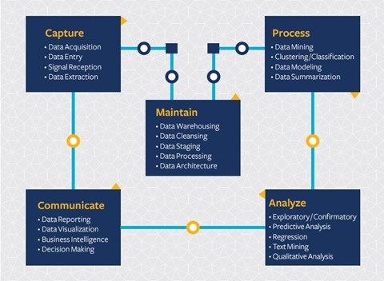

# Introduction to the Data Science Lifecycle

At this point you've probably come to the realization that that data science is a process. This process can be broken down into 5 stages, starting with capturing and ending with maintenance. 
This lesson focuses on 3 parts of the life cycle: capturing, processing and maintenance.

(source??)

## Capturing

The first stage of the lifecycle is very important as the next stages are dependent on it. It’s practically two stages combined into one: acquiring the data and defining the purpose and problems that need to be addressed. 
Defining the goals of the project will require deeper context into the problem or question. First, we need to identify and acquire those who need their problem solved. These may be stakeholders in a business or sponsors of the project who can help identify who or what will benefit from this project as well as what, and why they need it. A well-defined goal should be measurable and quantifiable to define an acceptable result. 

Questions a data scientist may ask:
-	Has this problem been approached before? What was discovered?
-	Is the purpose and goal understood by all involved?
-	Where is there ambiguity and how to reduce it?
-	What are the constraints?
-	What will the end result potentially look like?
-	How much resources (time, people, computational) are available?

Next is identifying, collecting, then finally exploring the data needed to achieve these defined goals. At this step of acquisition, data scientists must also evaluate the quantity and quality of the data. This requires some data exploration to confirm what has been acquired will support reaching the desired result.  

Questions a data scientist may ask about the data:
-	What data is already available to me?
-	Who owns this data?
-	What are the privacy concerns? 
-	Do I have enough to solve this problem?
-	Is the data of acceptable quality for this problem?
-	If I discover additional information through this data, should we consider changing or redefining the goals?

## Processing

The processing stage of the lifecycle focuses on discovering patterns in the data as well as modeling. Some techniques used to in the processing stage requires statistical methods to uncover the patterns. Typically, this would be a tedious task for a human to do with a large data set and will rely on computers to do the heavy lifting to speed up the process. This stage is also where data science and machine learning will intersect. As you learned in the first lesson, machine learning is the process of building models to understand the data. Models are a representation of the relationship between variables in the data that help predict outcomes.

Common techniques used in this stage are covered in the ML for Beginners curriculum.  Follow the links to learn more about them:

- Classification:  Organizing data into categories for more efficient use.
- Clustering: Grouping data into similar groups.
- Regression: Determine the relationships between variables to predict or forecast values 

## Maintaining

## Pre-Lecture Quiz

[Pre-lecture quiz]()

## 🚀 Challenge

## Post-Lecture Quiz

[Post-lecture quiz]()

## Review & Self Study

## Assignment

[Assignment Title](assignment.md)
