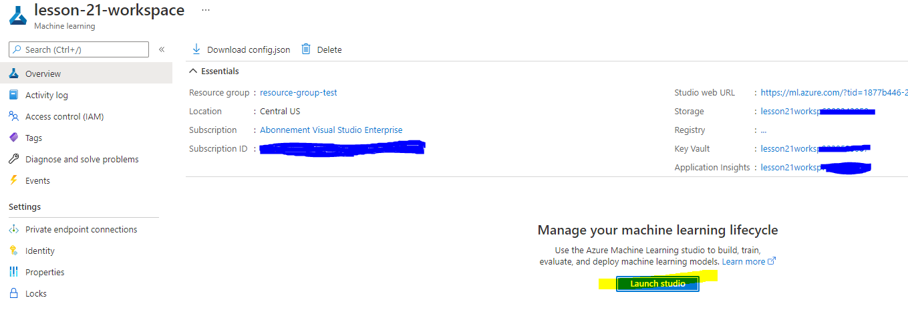
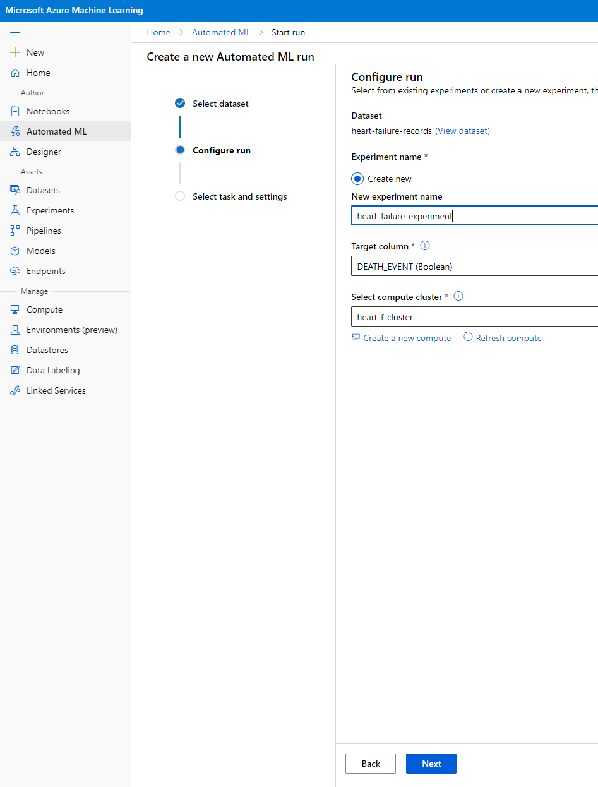

# 클라우드의 데이터 과학: "로우 코드(Low code)/노 코드(No code)" 방식

| ](../../../sketchnotes/18-DataScience-Cloud.png)|
|:---:|
| 클라우드의 데이터 과학: 로우 코드 - _[@nitya](https://twitter.com/nitya)_ 의 스케치노트 |

목차:

- [클라우드의 데이터 과학: "로우 코드/노 코드" 방식](#data-science-in-the-cloud-the-low-codeno-code-way)
  - [강의 전 퀴즈](#pre-lecture-quiz)
  - [1. 서론](#1-introduction)
    - [1.1 Azure Machine Learning이란?](#11-azure-machine-learning이란?)
    - [1.2 심부전 예측 프로젝트:](#12-the-the-the-heart-failure-prediction-project)
    - [1.3 심부전 데이터 셋:](#13-the-heart-failure-dataset)
  - [2. Azure ML Studio에서 모델의 로우 코드/노 코드 교육](#2-low-codeno-code-training-of-a-model-in-azure-ml-studio)
    - [2.1 Azure ML 워크스페이스 만들기](#21-create-an-azure-ml-workspace)
    - [2.2 컴퓨팅 리소스](#22-compute-resources)
      - [2.2.1 컴퓨팅 리소스에 적합한 옵션 선택](#221-choosing-the-right-options-for-your-compute-resources)
      - [2.2.2 컴퓨팅 클러스터 생성](#222-creating-a-compute-cluster)
    - [2.3 데이터 셋 불러오기](#23-loading-the-dataset)
    - [2.4 AutoML을 사용한 로우 코드/노 코드 교육](#24-low-codeno-code-training-with-automl)
  - [삼. 로우 코드/노 코드 모델 배포 및 엔드포인트 소비](#3-low-codeno-code-model-deployment-and-endpoint-consumption)
    - [3.1 모델 배포](#31-model-deployment)
    - [3.2 엔드포인트 소비](#32-endpoint-consumption)
  - [🚀챌린지](#-챌린지)
  - [강의후퀴즈](#강의후퀴즈)
  - [리뷰&자습](#리뷰--자습)
  - [과제](#과제)
  
## [강의전 퀴즈](https://red-water-0103e7a0f.azurestaticapps.net/quiz/34)
## 1. 소개
### 1.1 Azure 기계 학습(Machine Learning)이란 무엇입니까?

Azure 클라우드 플랫폼은 새로운 솔루션에 생명을 불어넣는 데 도움이 되도록 설계된 200개 이상의 제품 및 클라우드 서비스입니다.
데이터 사이언티스트는 데이터를 탐색하고 전처리하며 다양한 유형의 모델 학습 알고리즘을 시도하여 정확한 모델을 생성하는 데 많은 노력을 기울입니다. 이러한 작업은 시간이 많이 걸리고 종종 값비싼 컴퓨팅 하드웨어를 비효율적으로 사용합니다.

[Azure ML](https://docs.microsoft.com/azure/machine-learning/overview-what-is-azure-machine-learning?WT.mc_id=academic-40229-cxa&ocid=AID3041109)은 클라우드 기반 Azure에서 기계 학습 솔루션을 구축하고 운영하기 위한 플랫폼입니다. 여기에는 데이터 사이언티스트가 데이터를 준비하고, 모델을 훈련하고, 예측 서비스를 게시하고, 사용량을 모니터링하는 데 도움이 되는 다양한 기능이 포함되어 있습니다. 가장 중요한 것은 훈련 모델과 관련된 많은 시간 소모적인 작업을 자동화하여 효율성을 높이는 데 도움이 된다는 것입니다. 또한 효과적으로 확장되는 클라우드 기반 컴퓨팅 리소스를 사용하여 실제로 사용할 때만 비용을 발생시키면서 대량의 데이터를 처리할 수 있습니다.

Azure ML은 개발자와 데이터 사이언티스트가 기계 학습 워크플로에 필요한 모든 도구를 제공합니다. 여기에는 다음이 포함됩니다.

- **Azure Machine Learning Studio**: 모델 학습(training), 배포, 자동화, 추적 및 자산 관리를 위한 로우 코드 및 노 코드 옵션을 위한 Azure Machine Learning의 웹 포털입니다. 스튜디오는 원활한 경험을 위해 Azure Machine Learning SDK와 통합됩니다.
- **Jupyter Notebooks**: ML 모델을 빠르게 프로토타이핑하고 테스트합니다.
- **Azure Machine Learning Designer**: 모듈을 끌어다 놓아 실험을 빌드한 다음 로우 코드 환경에서 파이프라인을 배포할 수 있습니다.
- **AutoML(자동 머신 러닝 UI)** : 머신 러닝 모델 개발의 반복 작업을 자동화하여 모델 품질을 유지하면서 높은 확장성, 효율성 및 생산성을 갖춘 ML 모델을 구축할 수 있습니다.
- **Data Labelling**: 데이터에 자동으로 레이블을 지정하는 보조 ML 도구입니다.
- **Visual Studio Code용 기계 학습 확장**: ML 프로젝트 빌드 및 관리를 위한 모든 기능을 갖춘 개발 환경을 제공합니다.
- **기계 학습 CLI**: CLI 환경에서 Azure ML 리소스를 관리하기 위한 명령을 제공합니다.
- **PyTorch, TensorFlow, Scikit-learn 등과 같은 오픈 소스 프레임워크와의 통합**은 종단 간 기계 학습 프로세스를 교육, 배포 및 관리하기 위한 것입니다.
- **MLflow**: 기계 학습 실험의 수명 주기를 관리하기 위한 오픈 소스 라이브러리입니다. **MLFlow 추적**은 실험 환경에 관계없이 학습 실행 지표 및 모델 아티팩트를 기록하고 추적하는 MLflow의 구성 요소입니다.

### 1.2 심부전 예측 프로젝트:

프로젝트를 만들고 구축하는 것이 당신의 기술과 지식을 시험하는 가장 좋은 방법이라는 데는 의심의 여지가 없습니다. 이 단원에서는 Azure ML Studio에서 다음 스키마에 표시된 것처럼 로우 코드/노 코드 및 Azure ML SDK를 통해 심부전 발작을 예측하기 위한 데이터 과학 프로젝트를 빌드하는 두 가지 다른 방법을 탐색할 것입니다.


각 방법에는 장단점이 있습니다. 로우 코드/노 코드 방식은 코드에 대한 사전 지식 없이 GUI(그래픽 사용자 인터페이스)와 상호 작용하기 때문에 시작하기가 더 쉽습니다. 이 방법을 사용하면 프로젝트의 실행 가능성을 빠르게 테스트하고 POC(개념 증명)를 생성할 수 있습니다. 그러나 프로젝트가 성장하고 프로덕션 준비가 되어야 하기 때문에 GUI를 통해 리소스를 생성하는 것은 불가능합니다. 리소스 생성에서 모델 배포에 이르기까지 모든 것을 프로그래밍 방식으로 자동화해야 합니다. 이때 Azure ML SDK를 사용하는 방법을 아는 것이 중요합니다.

|                   | Low code/No code | Azure ML SDK              |
|-------------------|------------------|---------------------------|
| 코드 전문성 | 필요하지 않음    | 필요함                 |
| 개발 시간   | 빠르고 쉽다    | 코드 전문성에 따라 다름 |
| 생산 준비 완료  | No               | Yes                       |

### 1.3 심부전 데이터셋:

심혈관 질환(CVD)은 전 세계 사망 원인 1위이며 전 세계 사망의 31%를 차지합니다. 흡연, 건강에 해로운 식단 및 비만, 신체 활동 부족 및 유해한 알코올 사용과 같은 환경 및 행동 위험 요인을 추정 모델의 특성으로 사용할 수 있습니다. CVD 발병 확률을 추정할 수 있다는 것은 고위험군에 대한 공격을 예방하는 데 매우 유용할 수 있습니다.

Kaggle은 이 프로젝트에 사용할 [Heart Failure dataset](https://www.kaggle.com/andrewmvd/heart-failure-clinical-data)를 공개했습니다. 지금 데이터셋를 다운로드할 수 있습니다. 이것은 13개의 열(12개의 기능과 1개의 대상 변수)과 299개의 행이 있는 테이블 형식 데이터 셋입니다.

|    | 변수 이름             | 타입            | 설명                                               | 예시           |
|----|---------------------------|-----------------|-----------------------------------------------------------|-------------------|
| 1  | 나이                      | numerical       | 환자의 나이                                        | 25                |
| 2  | 빈혈증                   | boolean         | 적혈구 또는 헤모글로빈 감소                | 0 or 1            |
| 3  | 크레아티닌_포스포키나제(creatinine_phosphokinase)  | numerical       | 혈액 내 CPK 효소 수치                          | 542               |
| 4  | 당뇨병                  | boolean         | 환자에게 당뇨병이 있는 경우                               | 0 or 1            |
| 5  | 사출_분수(ejection_fraction)         | numerical       | 수축할 때마다 심장에서 나가는 혈액의 비율 | 45                |
| 6  | 고혈압       | boolean         | 환자에게 고혈압이 있는 경우                           | 0 or 1            |
| 7  | 혈소판                 | numerical       | 혈액 내 혈소판                                    | 149000            |
| 8  | 혈청 크레아티닌          | numerical       | 혈액 내 혈청 크레아티닌 수치                   | 0.5               |
| 9  | 혈청 나트륨              | numerical       | 혈액 내 혈청 나트륨 수치                        | jun               |
| 10 | 성별                       | boolean         | 여자 또는 남자                                              | 0 or 1            |
| 11 | 흡연                   | boolean         | 환자의 흡연 여부                                     | 0 or 1            |
| 12 | 시간                      | numerical       | 추적 기간 (days)                                   | 4                 |
|----|---------------------------|-----------------|-----------------------------------------------------------|-------------------|
| 21 | DEATH_EVENT [Target]      | boolean         | 추적관찰 기간 동안 환자가 사망한 경우           | 0 or 1            |

데이터 셋이 있으면 Azure에서 프로젝트를 시작할 수 있습니다.

## 2. Azure ML Studio에서 모델의 로우 코드/노 코드 학습(Training)
### 2.1 Azure ML 워크스페이스 만들기
Azure ML에서 모델을 학습시키려면 먼저 Azure ML 워크스페이스를 만들어야 합니다. 워크스페이스는 Azure Machine Learning의 최상위 리소스로, Azure Machine Learning을 사용할 때 만드는 모든 아티팩트를 작업할 수 있는 중앙 집중식 장소를 제공합니다. 작업 공간은 로그, 메트릭, 출력 및 스크립트의 스냅샷을 포함하여 모든 훈련 실행의 기록을 유지합니다. 이 정보를 사용하여 최상의 모델을 생성하는 훈련 실행을 결정합니다. [자세히 알아보기](https://docs.microsoft.com/azure/machine-learning/concept-workspace?WT.mc_id=academic-40229-cxa&ocid=AID3041109)

운영 체제와 호환되는 최신 브라우저를 사용하는 것이 좋습니다. 다음 브라우저가 지원됩니다.

- Microsoft Edge(새로운 Microsoft Edge, 최신 버전. Microsoft Edge 레거시 아님)
- Safari(최신 버전, Mac 전용)
- 크롬(최신 버전)
- 파이어폭스(최신 버전)

Azure Machine Learning을 사용하려면 Azure 구독에서 워크스페이스을 만듭니다. 그런 다음 이 작업 공간을 사용하여 머신 러닝 워크로드와 관련된 데이터, 컴퓨팅 리소스, 코드, 모델 및 기타 아티팩트를 관리할 수 있습니다.

> **_참고:_** 구독에 Azure Machine Learning 워크스페이스가 있는 한 Azure 구독에 데이터 저장에 대해 소액의 요금이 청구되므로 더 이상 사용하지 않을 때는 Azure Machine Learning 워크스페이스을 삭제하는 것이 좋습니다.

1. Azure 구독과 연결된 Microsoft 자격 증명을 사용하여 [Azure Portal](https://ms.portal.azure.com/)에 로그인합니다.
2. **＋리소스 생성**을 선택합니다.


   Machine Learning을 검색하고 Machine Learning 타일을 선택합니다.

   

   만들기 버튼을 클릭하세요

   

   다음과 같이 설정을 입력합니다.
   - 구독: Azure 구독
   - 리소스 그룹: 리소스 그룹 생성 또는 선택
   - 작업 공간 이름: 작업 공간의 고유한 이름을 입력합니다.
   - 지역: 가장 가까운 지리적 지역을 선택합니다.
   - 스토리지 계정: 워크스페이스에 대해 생성될 기본 새 스토리지 계정을 기록해 둡니다.
   - Key Vault: 워크스페이스에 대해 생성될 기본 새 Key Vault를 확인합니다.
   - 애플리케이션 인사이트: 작업 공간에 대해 생성될 기본 새 애플리케이션 인사이트 리소스를 확인합니다.
   - 컨테이너 레지스트리: 없음(컨테이너에 모델을 처음 배포할 때 자동으로 생성됨)

  

   - 만들기 + 리뷰 클릭 후 만들기 버튼 클릭
3. 작업 공간이 생성될 때까지 기다립니다(몇 분 정도 소요될 수 있음). 그런 다음 포털로 이동하십시오. Machine Learning Azure 서비스를 통해 찾을 수 있습니다.
4. 워크스페이스에 대한 개요 페이지에서 Azure Machine Learning Studio를 시작하고(또는 새 브라우저 탭을 열고 https://ml.azure.com으로 이동) Microsoft 계정을 사용하여 Azure Machine Learning Studio에 로그인합니다. 메시지가 표시되면 Azure 디렉터리 및 구독과 Azure Machine Learning 워크스페이스을 선택합니다.



5. Azure Machine Learning Studio에서 왼쪽 상단의 ☰ 아이콘을 토글하여 인터페이스의 다양한 페이지를 봅니다. 이 페이지를 사용하여 워크스페이스의 리소스를 관리할 수 있습니다.


Azure Portal을 사용하여 워크스페이스을 관리할 수 있지만 데이터 사이언티스트 및 Machine Learning 운영 엔지니어를 위해 Azure Machine Learning Studio는 워크스페이스 리소스를 관리하기 위한 보다 집중적인 사용자 인터페이스를 제공합니다.

### 2.2 컴퓨팅 리소스

컴퓨팅 리소스는 모델 교육 및 데이터 탐색 프로세스를 실행할 수 있는 클라우드 기반 리소스입니다. 생성할 수 있는 컴퓨팅 리소스에는 4가지 종류가 있습니다.

- **컴퓨팅 인스턴스**: 데이터 사이언티스트가 데이터 및 모델 작업에 사용할 수 있는 개발 워크스테이션. 여기에는 가상 머신(VM) 생성 및 노트북 인스턴스 시작이 포함됩니다. 그런 다음 노트북에서 컴퓨터 클러스터를 호출하여 모델을 훈련할 수 있습니다.
- **컴퓨팅 클러스터**: 실험 코드의 주문형 처리를 위한 확장 가능한 VM 클러스터. 모델을 훈련할 때 필요합니다. 컴퓨팅 클러스터는 특수 GPU 또는 CPU 리소스를 사용할 수도 있습니다.
- **추론 클러스터**: 훈련된 모델을 사용하는 예측 서비스의 배포 대상입니다.
- **연결된 컴퓨팅**: Virtual Machines 또는 Azure Databricks 클러스터와 같은 기존 Azure 컴퓨팅 리소스에 대한 링크입니다.


#### 2.2.1 컴퓨팅 리소스에 적합한 옵션 선택

컴퓨팅 리소스를 생성할 때 몇 가지 주요 요소를 고려해야 하며 이러한 선택은 중요한 결정이 될 수 있습니다.

**CPU 또는 GPU가 필요합니까?**

CPU(중앙 처리 장치)는 컴퓨터 프로그램으로 구성된 명령을 실행하는 전자 회로입니다. GPU(Graphics Processing Unit)는 그래픽 관련 코드를 매우 빠른 속도로 실행할 수 있는 특수 전자 회로입니다.

CPU와 GPU 아키텍처의 주요 차이점은 CPU가 광범위한 작업을 빠르게 처리하도록 설계되었지만(CPU 클럭 속도로 측정) 실행할 수 있는 작업의 동시성이 제한된다는 점입니다. GPU는 병렬 컴퓨팅을 위해 설계되었으므로 딥 러닝 작업에서 훨씬 더 좋습니다.

| CPU                                     | GPU                         |
|-----------------------------------------|-----------------------------|
| 적은 비용                          | 비싼 비용             |
| 낮은 레벨의 동시성             | 높은 레벨의 동시성 |
| 딥 러닝 모델 학습 속도가 느림 | 딥러닝에 최적화됨   |


**클러스터 크기**

클러스터가 클수록 비용이 더 많이 들지만 응답성이 향상됩니다. 따라서 시간은 있지만 자금이 충분하지 않다면 작은 클러스터부터 시작해야 합니다. 반대로 돈은 있지만 시간이 많지 않은 경우 더 큰 클러스터에서 시작해야 합니다.

**VM 크기**

시간과 예산 제약에 따라 RAM, 디스크, 코어 수 및 클럭 속도의 크기를 변경할 수 있습니다. 이러한 모든 매개변수를 늘리면 비용이 더 많이 들지만 결과적으로 더 나은 성능을 얻을 수 있습니다.

**전용 또는 낮은 우선 순위 인스턴스 ?**

낮은 우선 순위 인스턴스는 인터럽트 가능함을 의미합니다. 기본적으로 Microsoft Azure는 해당 리소스를 가져와 다른 작업에 할당하여 작업을 중단할 수 있습니다. 전용 인스턴스 또는 인터럽트 불가능은 사용자의 허가 없이 작업이 종료되지 않음을 의미합니다.
인터럽트 가능한 인스턴스가 전용 인스턴스보다 저렴하기 때문에 이것은 시간 대 비용의 또 다른 고려 사항입니다.

#### 2.2.2 컴퓨팅 클러스터 생성

앞서 만든 [Azure ML 워크스페이스](https://ml.azure.com/)에서 컴퓨팅으로 이동하면 방금 논의한 다양한 컴퓨팅 리소스(예: 컴퓨팅 인스턴스, 컴퓨팅 클러스터, 추론 클러스터 및 연결된 컴퓨팅)를 볼 수 있습니다. 이 프로젝트의 경우 모델 학습을 위한 컴퓨팅 클러스터가 필요합니다. Studio에서 "Compute" 메뉴를 클릭한 다음 "Compute 클러스터" 탭을 클릭하고 "+ New" 버튼을 클릭하여 컴퓨팅 클러스터를 생성합니다.


1. 옵션을 선택합니다: 전용 vs 낮은 우선 순위, CPU 또는 GPU, VM 크기 및 코어 번호(이 프로젝트의 기본 설정을 유지할 수 있음).
2. 다음 버튼을 클릭합니다.


3. 클러스터에 컴퓨팅 이름 지정
4. 최소/최대 노드 수, 축소 전 유휴 시간(초), SSH 액세스 옵션을 선택합니다. 최소 노드 수가 0이면 클러스터가 유휴 상태일 때 비용을 절약할 수 있습니다. 최대 노드 수가 많을수록 훈련이 더 짧아집니다. 권장되는 최대 노드 수는 3입니다.
5. "만들기" 버튼을 클릭합니다. 이 단계는 몇 분 정도 걸릴 수 있습니다.


정말 멋지네요! 이제 Compute 클러스터가 있으므로 Azure ML Studio에 데이터를 로드해야 합니다.

### 2.3 데이터 셋 로드

1. 앞서 생성한 [Azure ML 워크스페이스](https://ml.azure.com/)에서 왼쪽 메뉴의 "Datasets"를 클릭하고 "+ Create dataset" 버튼을 클릭하여 데이터셋을 생성합니다. "로컬 파일에서" 옵션을 선택하고 이전에 다운로드한 Kaggle 데이터셋을 선택합니다.
   


2. 데이터셋에 이름, 유형 및 설명을 지정합니다. 다음을 클릭합니다. 파일에서 데이터를 업로드합니다. 다음을 클릭합니다.


3. 스키마에서 빈혈, 당뇨병, 고혈압, 성별, 흡연 및 DEATH_EVENT 기능에 대해 데이터 유형을 bool로 변경합니다. 다음을 클릭하고 만들기를 클릭합니다.
   


정말 멋지네요! 이제 데이터 셋이 준비되고 컴퓨팅 클러스터가 생성되었으므로 모델 학습을 시작할 수 있습니다!

### 2.4 AutoML을 사용한 로우 코드/노 코드 학습

전통적인 기계 학습 모델 개발은 리소스 집약적이며 수십 개의 모델을 생성하고 비교하는 데 상당한 도메인 지식과 시간이 필요합니다.
AutoML(자동화된 기계 학습)은 기계 학습 모델 개발의 시간 소모적이고 반복적인 작업을 자동화하는 프로세스입니다. 이를 통해 데이터 사이언티스트, 분석가 및 개발자는 모델 품질을 유지하면서 높은 확장성, 효율성 및 생산성을 갖춘 ML 모델을 구축할 수 있습니다. 프로덕션 준비 ML 모델을 매우 쉽고 효율적으로 얻는 데 걸리는 시간을 줄입니다. [자세히 알아보기](https://docs.microsoft.com/azure/machine-learning/concept-automated-ml?WT.mc_id=academic-40229-cxa&ocid=AID3041109)

1. 앞서 생성한 [Azure ML 워크스페이스](https://ml.azure.com/)에서 왼쪽 메뉴의 "Automated ML"을 클릭하고 방금 업로드한 데이터 셋을 선택합니다. 다음을 클릭합니다.

   

2. 새 실험 이름, 대상 열(DEATH_EVENT) 및 생성한 컴퓨팅 클러스터를 입력합니다. 다음을 클릭합니다.
   
   

3. "분류"를 선택하고 마침을 클릭합니다. 이 단계는 컴퓨팅 클러스터 크기에 따라 30분에서 1시간 사이가 소요될 수 있습니다.
    
    

4. 실행이 완료되면 "Automated ML" 탭을 클릭하고 실행을 클릭한 다음 "Best model summary" 카드에서 알고리즘을 클릭합니다.
    
    

여기에서 AutoML이 생성한 최고의 모델에 대한 자세한 설명을 볼 수 있습니다. 모델 탭에서 생성된 다른 모드를 탐색할 수도 있습니다. 설명(미리보기 버튼)에서 모델을 탐색하는 데 몇 분 정도 걸립니다. 사용하려는 모델을 선택했다면(여기서는 autoML이 선택한 최상의 모델을 선택하겠습니다), 배포 방법을 살펴보겠습니다.

## 3. 로우코드/노코드 모델 배포 및 엔드포인트 소비
### 3.1 모델 배포

자동화된 기계 학습 인터페이스를 사용하면 몇 단계만 거치면 최상의 모델을 웹 서비스로 배포할 수 있습니다. 배포는 새로운 데이터를 기반으로 예측하고 잠재적인 기회 영역을 식별할 수 있도록 모델을 통합하는 것입니다. 이 프로젝트의 경우 웹 서비스에 배포한다는 것은 의료 애플리케이션이 모델을 사용하여 환자가 심장마비에 걸릴 위험을 실시간으로 예측할 수 있음을 의미합니다.

베스트 모델 설명에서 "배포" 버튼을 클릭합니다.
    


15. 이름, 설명, 컴퓨팅 유형(Azure Container Instance)을 지정하고 인증을 활성화하고 배포를 클릭합니다. 이 단계를 완료하는 데 약 20분이 소요될 수 있습니다. 배포 프로세스에는 모델 등록, 리소스 생성 및 웹 서비스용 구성을 포함한 여러 단계가 포함됩니다. 배포 상태 아래에 상태 메시지가 나타납니다. 주기적으로 새로 고침을 선택하여 배포 상태를 확인합니다. 상태가 "정상"일 때 배포되고 실행됩니다.


16. 배포가 완료되면 endpoint 탭을 클릭하고 방금 배포한 endpoint를 클릭합니다. 여기에서 엔드포인트에 대해 알아야 할 모든 세부 정보를 찾을 수 있습니다.


정말 멋지네요! 이제 모델이 배포되었으므로 endpoint 사용을 시작할 수 있습니다.

### 3.2 엔드포인트 소비

"소비" 탭을 클릭하십시오. 여기에서 소비 옵션에서 REST 엔드포인트와 python 스크립트를 찾을 수 있습니다. 잠시 시간을 내어 파이썬 코드를 읽으십시오.

이 스크립트는 로컬 시스템에서 직접 실행할 수 있으며 endpoint를 사용합니다.


잠시 시간을 내어 다음 두 줄의 코드를 확인하세요.

```python
url = 'http://98e3715f-xxxx-xxxx-xxxx-9ec22d57b796.centralus.azurecontainer.io/score'
api_key = '' # Replace this with the API key for the web service
```
'url' 변수는 소비 탭에 있는 REST endpoint이고 'api_key' 변수는 소비 탭에도 있는 기본 키입니다(인증을 활성화한 경우에만). 이것이 스크립트가 endpoint를 사용할 수 있는 방법입니다.

18. 스크립트를 실행하면 다음 출력이 표시되어야 합니다.
    ```python
    b'"{\\"result\\": [true]}"'
    ```
이것은 주어진 데이터에 대한 심부전의 예측이 사실임을 의미합니다. 스크립트에서 자동으로 생성된 데이터를 더 자세히 살펴보면 모든 것이 기본적으로 0이고 false이기 때문에 이것은 의미가 있습니다. 다음 입력 샘플을 사용하여 데이터를 변경할 수 있습니다.

```python
data = {
    "data":
    [
        {
            'age': "0",
            'anaemia': "false",
            'creatinine_phosphokinase': "0",
            'diabetes': "false",
            'ejection_fraction': "0",
            'high_blood_pressure': "false",
            'platelets': "0",
            'serum_creatinine': "0",
            'serum_sodium': "0",
            'sex': "false",
            'smoking': "false",
            'time': "0",
        },
        {
            'age': "60",
            'anaemia': "false",
            'creatinine_phosphokinase': "500",
            'diabetes': "false",
            'ejection_fraction': "38",
            'high_blood_pressure': "false",
            'platelets': "260000",
            'serum_creatinine': "1.40",
            'serum_sodium': "137",
            'sex': "false",
            'smoking': "false",
            'time': "130",
        },
    ],
}
```
스크립트는 다음을 반환해야 합니다.
    ```python
    b'"{\\"result\\": [true, false]}"'
    ```

축하합니다! 배포된 모델을 사용하고 Azure ML에서 학습시켰습니다!

> **_참고:_** 프로젝트가 끝나면 모든 리소스를 삭제하는 것을 잊지 마십시오.
## 🚀 도전

AutoML이 상위 모델에 대해 생성한 모델 설명 및 세부정보를 자세히 살펴보세요. 최고의 모델이 다른 모델보다 나은 이유를 이해하려고 노력하십시오. 어떤 알고리즘이 비교되었습니까? 이들의 차이점은 무엇인가요? 이 경우 왜 최고 성능이 더 나은가요?

## [강의 후 퀴즈](https://red-water-0103e7a0f.azurestaticapps.net/quiz/35)

## 복습 및 독학

이 강의에서는 클라우드에서 로우 코드/노 코드 방식으로 심부전 위험을 예측하기 위해 모델을 훈련, 배포 및 사용하는 방법을 배웠습니다. 아직 수행하지 않았다면 AutoML이 상위 모델에 대해 생성한 모델 설명을 더 자세히 살펴보고 최고의 모델이 다른 모델보다 더 나은 이유를 이해하려고 합니다.

로우 코드/노 코드 Auto ML 에 대해 더 알아보고 싶다면 이 [문서](https://docs.microsoft.com/azure/machine-learning/tutorial-first-experiment-automated-ml?WT.mc_id=academic-40229-cxa&ocid=AID3041109)를 읽어보세요.

## 과제

[Azure ML의 로우 코드/코드 없음 데이터 과학 프로젝트](./assignment.ko.md)
