# Low code/No code Data Science in the Cloud

Table of contents:

- [Low code/No code Data Science in the Cloud](#low-codeno-code-data-science-in-the-cloud)
  - [Pre-Lecture Quiz](#pre-lecture-quiz)
  - [1. Introduction](#1-introduction)
    - [1.1 What is Azure Machine Learning?](#11-what-is-azure-machine-learning)
    - [1.2 The Heart Failure Prediction Project](#12-the-heart-failure-prediction-project)
    - [1.3 The Heart Failure Dataset](#13-the-heart-failure-dataset)
  - [2. Low code/No code training of a model in Azure ML Studio](#2-low-codeno-code-training-of-a-model-in-azure-ml-studio)
    - [2.1 Create an Azure ML workspace](#21-create-an-azure-ml-workspace)
    - [2.2 Compute Resources](#22-compute-resources)
      - [2.2.1 Choosing the right options for your compute resources](#221-choosing-the-right-options-for-your-compute-resources)
      - [2.2.2 Creating a compute cluster](#222-creating-a-compute-cluster)
    - [2.3 Loading the Dataset](#23-loading-the-dataset)
    - [2.4 Low code/No Code training with AutoML](#24-low-codeno-code-training-with-automl)
  - [3. Low code/No Code model deployment and endpoint consumption](#3-low-codeno-code-model-deployment-and-endpoint-consumption)
    - [3.1 Model deployment](#31-model-deployment)
    - [3.2 Endpoint consumption](#32-endpoint-consumption)
  - [🚀 Challenge](#-challenge)
  - [Post-Lecture Quiz](#post-lecture-quiz)
  - [Review & Self Study](#review--self-study)
  - [Assignment](#assignment)
## Pre-Lecture Quiz

[Pre-lecture quiz]()
## 1. Introduction
### 1.1 What is Azure Machine Learning?
Data scientists expend a lot of effort exploring and pre-processing data, and trying various types of model-training algorithms to produce accurate models, which is time consuming, and often makes inefficient use of expensive compute hardware.

[Azure ML](https://docs.microsoft.com/EN-US/azure/machine-learning/overview-what-is-azure-machine-learning) is a cloud-based platform for building and operating machine learning solutions in Azure. It includes a wide range of features and capabilities that help data scientists prepare data, train models, publish predictive services, and monitor their usage. Most importantly, it helps data scientists increase their efficiency by automating many of the time-consuming tasks associated with training models; and it enables them to use cloud-based compute resources that scale effectively to handle large volumes of data while incurring costs only when actually used.

Azure ML provides all the tools developers and data scientists need for their machine learning workflows, including:

- **Azure Machine Learning Studio** is a web portal in Azure Machine Learning for low-code and no-code options for model training, deployment, automation, tracking and asset management. The studio integrates with the Azure Machine Learning SDK for a seamless experience.
- **Jupyter Notebooks** to quickly prototype and test ML models
- **Azure Machine Learning Designer** allows to drag-n-drop modules to build experiments and then deploy pipelines in a low-code environment.
- **Automated machine learning UI (AutoML)** automates iterative tasks of machine learning model development allowing to build ML models with high scale, efficiency, and productivity all while sustaining model quality.
- **Data labeling**: an assisted ML tool to automatically label data.
- **Machine learning extension for Visual Studio Code** provides a full-featured development environment for building and managing ML projects.
- **Machine learning CLI** provides commands for managing Azure ML resources from the command line.
- **Integration with open-source frameworks** such as PyTorch, TensorFlow, and scikit-learn and many more for training, deploying, and managing the end-to-end machine learning process.
- **MLflow** is an open-source library for managing the life cycle of your machine learning experiments. **MLFlow Tracking** is a component of MLflow that logs and tracks your training run metrics and model artifacts, no matter your experiment's environment.

### 1.2 The Heart Failure Prediction Project

What better way to learn than actually doing a project! In this lesson, we are going to explore two different ways of building a data science project for the prediction of heart failure attacks in Azure ML Studio, through Low code/No code and through the Azure ML SDK as shown in the following schema.

Both ways has its pro and cons. The Low code/No code way is easier to start with because it is mostly interacting with a GUI (Graphical User Interface) without knowledge of code required. This method is great at the beginning of a project to quickly test if a project is viable and to create POC (Proof Of Concept). However, once a project grows and things need to be production ready, it is not maintainable to create resources by hand through the GUI. We need to programmatically automate everything, from the creation of resources, to the deployment of a model. This is where knowing how to use the Azure ML SDK is critical.

|                   | Low code/No code | Azure ML SDK              |
|-------------------|------------------|---------------------------|
| Expertise in code | Not required     | Required                  |
| Time to develop   | Fast and easy    | Depends on code expertise |
| Production ready  | No               | Yes                       |

### 1.3 The Heart Failure Dataset

Cardiovascular diseases (CVDs) are the number 1 cause of death globally, accounting for 31% of all deaths worlwide. Environmental and behavioural risk factors such as tobacco use, unhealthy diet and obesity, physical inactivity and harmful use of alcohol could be used as features for estimation models. Being able to estimate the probability of developping a CVD could be of great to prevent attacks for high risk people.

Kaggle has made publically available a [Heart Failure dataset](https://www.kaggle.com/andrewmvd/heart-failure-clinical-data) that we are going to use for this project. You can download the dataset now. This is a tabular dataset with 13 columns (12 features and 1 target variable) and contains 299 rows. 

|    | Variable name             | Type            | Description                                               | Example           |
|----|---------------------------|-----------------|-----------------------------------------------------------|-------------------|
| 1  | age                       | numerical       | age of the patient                                        | 25                |
| 2  | anaemia                   | boolean         | Decrease of red blood cells or hemoglobin                 | 0 or 1            |
| 3  | creatinine_phosphokinase  | numerical       | Level of the CPK enzyme in the blood                      | 542               |
| 4  | diabetes                  | boolean         | If the patient has diabetes                               | university.degree |
| 5  | ejection_fraction         | numerical       | Percentage of blood leaving the heart at each contraction | 45                |
| 6  | high_blood_pressure       | boolean         | If the patient has hypertension                           | 0 or 1            |
| 7  | platelets                 | numerical       | Platelets in the blood                                    | 149000            |
| 8  | serum_creatinine          | numerical       | Level of serum creatinine in the blood                    | 0.5               |
| 9  | serum_sodium              | numerical       | Level of serum sodium in the blood                        | jun               |
| 10 | sex                       | boolean         | Woman or man                                              | 0 or 1            |
| 11 | smoking                   | boolean         | If the patient smokes                                     | 285               |
| 12 | time                      | numerical       | follow-up period (days)                                   | 4                 |
|----|---------------------------|-----------------|-----------------------------------------------------------|-------------------|
| 21 | DEATH_EVENT [Target]      | boolean         | if the patient deceased during the follow-up period       | 0 or 1            |

Once you have the dataset, we can start the project in Azure.

## 2. Low code/No code training of a model in Azure ML Studio
### 2.1 Create an Azure ML workspace
To train a model in Azure ML you first need to create an Azure ML workspace. The workspace is the top-level resource for Azure Machine Learning, providing a centralized place to work with all the artifacts you create when you use Azure Machine Learning. The workspace keeps a history of all training runs, including logs, metrics, output, and a snapshot of your scripts. You use this information to determine which training run produces the best model. [Learn more](https://docs.microsoft.com/en-us/azure/machine-learning/concept-workspace)

It is recommended to use the most up-to-date browser that's compatible with your operating system. The following browsers are supported:

- Microsoft Edge (The new Microsoft Edge, latest version. Not Microsoft Edge legacy)
- Safari (latest version, Mac only)
- Chrome (latest version)
- Firefox (latest version)

To use Azure Machine Learning, create a workspace in your Azure subscription. You can then use this workspace to manage data, compute resources, code, models, and other artifacts related to your machine learning workloads.

> **_NOTE:_** Your Azure subscription will be charged a small amount for data storage as long as the Azure Machine Learning workspace exists in your subscription, so we recommend you delete the Azure Machine Learning workspace when you are no longer using it.

1. Sign into the [Azure portal](https://ms.portal.azure.com/) using the Microsoft credentials associated with your Azure subscription.
2. Select **＋Create a resource**
   
   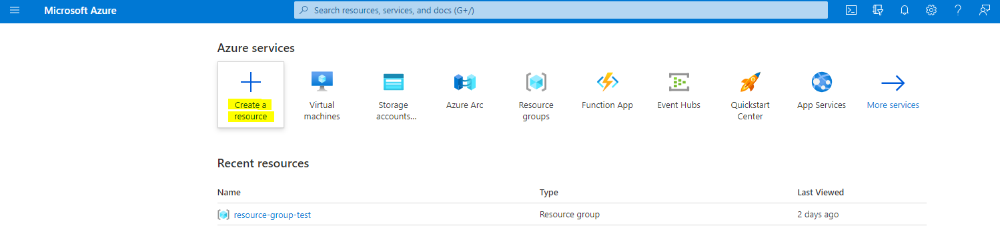

   Search for Machine Learning and select the Machine Learning tile

   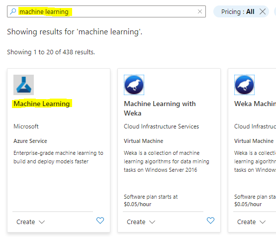

   Click the create button

   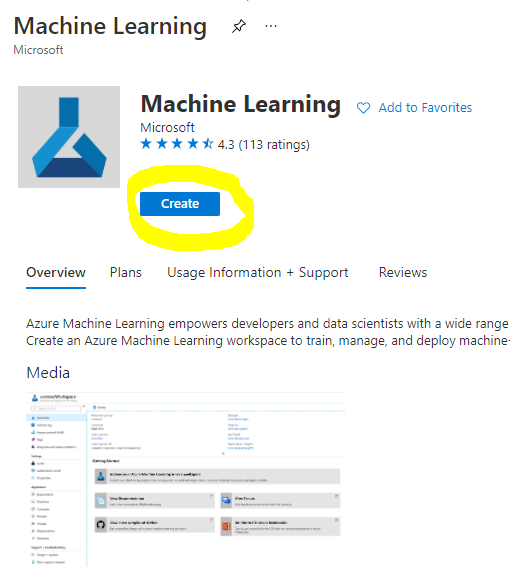

   Fill in the settings:
   - Subscription: Your Azure subscription
   - Resource group: Create or select a resource group
   - Workspace name: Enter a unique name for your workspace
   - Region: Select the geographical region closest to you
   - Storage account: Note the default new storage account that will be created for your workspace
   - Key vault: Note the default new key vault that will be created for your workspace
   - Application insights: Note the default new application insights resource that will be created for your workspace
   - Container registry: None (one will be created automatically the first time you deploy a model to a container)

    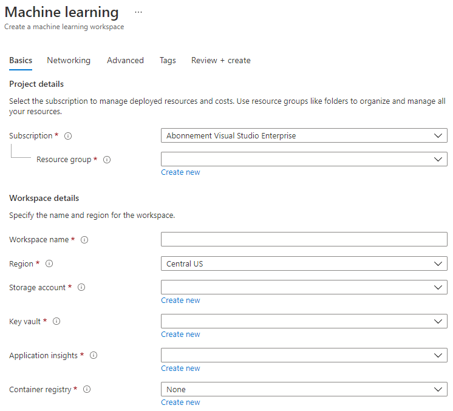

   - Click the create + review and then on the create button
3. Wait for your workspace to be created (it can take a few minutes). Then go to it in the portal. You can find it through the Machine Learning Azure service.
4. On the Overview page for your workspace, launch Azure Machine Learning studio (or open a new browser tab and navigate to https://ml.azure.com), and sign into Azure Machine Learning studio using your Microsoft account. If prompted, select your Azure directory and subscription, and your Azure Machine Learning workspace.
   

5. In Azure Machine Learning studio, toggle the ☰ icon at the top left to view the various pages in the interface. You can use these pages to manage the resources in your workspace.

You can manage your workspace using the Azure portal, but for data scientists and Machine Learning operations engineers, Azure Machine Learning studio provides a more focused user interface for managing workspace resources.

### 2.2 Compute Resources

Compute Resources are cloud-based resources on which you can run model training and data exploration processes. There are four kinds of compute resource you can create:

- **Compute Instances**: Development workstations that data scientists can use to work with data and models. This involves the creation of a Virtual Machine (VM) and launch a notebook instance. You can then train a model by calling a computer cluster from the notebook.
- **Compute Clusters**: Scalable clusters of VMs for on-demand processing of experiment code. You will need it when training a model. Compute clusters can also employ specialized GPU or CPU resources.
- **Inference Clusters**: Deployment targets for predictive services that use your trained models.
- **Attached Compute**: Links to existing Azure compute resources, such as Virtual Machines or Azure Databricks clusters.

#### 2.2.1 Choosing the right options for your compute resources

Some key factors are to consider when creating a compute resource and those choices can be critical decisions to make. 

**Do you need CPU or GPU ?**

A CPU (Central Processing Unit) is the electronic circuitry that executes instructions comprising a computer program. A GPU (Graphics Processing Unit) is specialized electronic circuit that can execute graphics-related code at a very high rate. 

The main difference between CPU and GPU architecture is that a CPU is designed to handle a wide-range of tasks quickly (as measured by CPU clock speed), but are limited in the concurrency of tasks that can be running. GPUs are designed for parallel computing and therfore are much better at deep learning tasks.

| CPU                                     | GPU                         |
|-----------------------------------------|-----------------------------|
| Less expensive                          | More expensive              |
| Lower level of concurrency              | Higher level of concurrency |
| Slower in training deep learning models | Optimal for deep learning   |

**Cluster Size**

Larger clusters are more expensive but will result in better responsiveness. Therefore, if you have time and not much money, you should start with a small cluster. Conversely, if you have money but not much time, you should start with a larger cluster.

**VM Size**

Depending on your time and budgetary constrains, you can vary the size of your RAM, disk, number of cores and higher clock speed. Increasing all those parameters will be ore expensive but will result in better performance.

**Dedicated or Low-Priority Instances ?**

A low-priority instance means that it is interruptible—essentially, Microsoft Azure can take those resources and assign them to another task, thus interrupting a job. A dedicated instance, or non-interruptible, means that the job will never be terminated without your permission.
This is another consideration of time vs money, since interruptible instances are less expensive than dedicated ones.

#### 2.2.2 Creating a compute cluster

In the [Azure ML workspace](https://ml.azure.com/) that we created earlier, go to compute and you will see the different compute resources we just discussed (i.e compute instances, compute clusters, inference clusters and attached compute). For this project, we are going to need a compute cluster for the model training. In the Studio, Click on the "Compute" menu, then the "Compute cluster" tab and click on the "+ New" button to create a compute cluster.

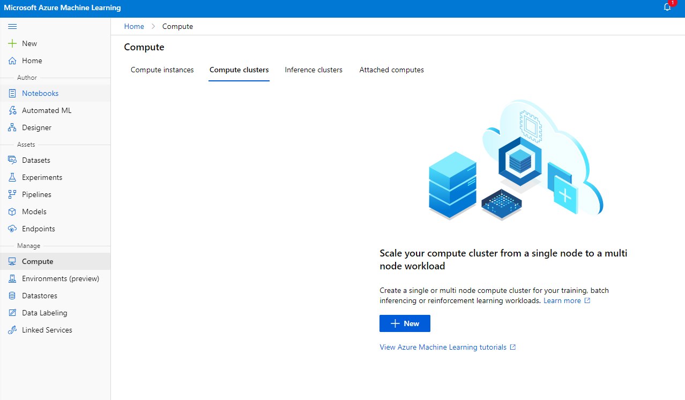

1. Choose your options: Dedicated vs Low priority, CPU or GPU, VM size and core number (you can keep the default settings for this project).
2. Click in the Next button.

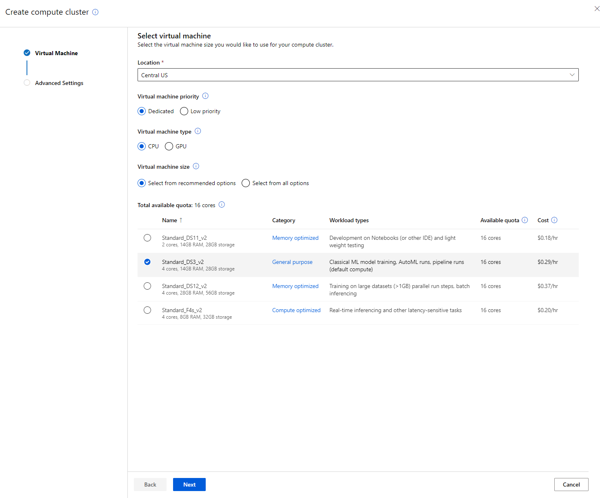

3. Give the cluster a compute name 
4. Choose your options: Min/Max number of nodes, Idle seconds before scale down, SSH access. Note that if the min number of nodes is 0, you will save money when the cluster is idle. Note that the higher the number of max node, the shorter the training the will be. The max number of nodes recommended is 3.  
5. Click on the "Create" button. This step may take a few minutes. 

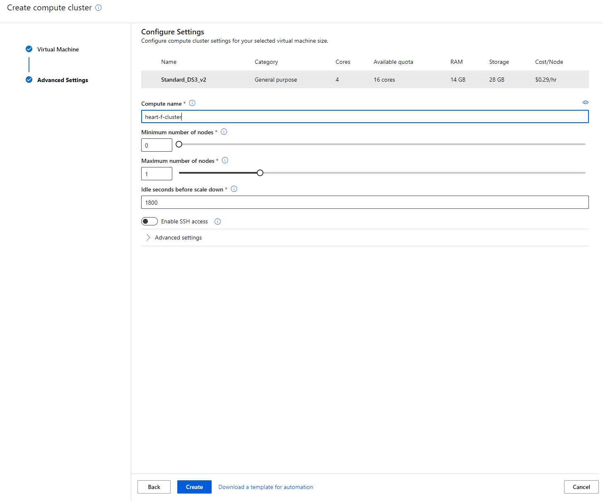

Awesome! Now that we have a Compute cluster, we need to load the data to Azure ML Studio. 

### 2.3 Loading the Dataset

1. In the [Azure ML workspace](https://ml.azure.com/) that we created earlier click on "Datasets" in the left menu and click on the "+ Create dataset" button to create a dataset. Choose the "From local files" option and select the Kaggle dataset we downloaded earlier.
   
   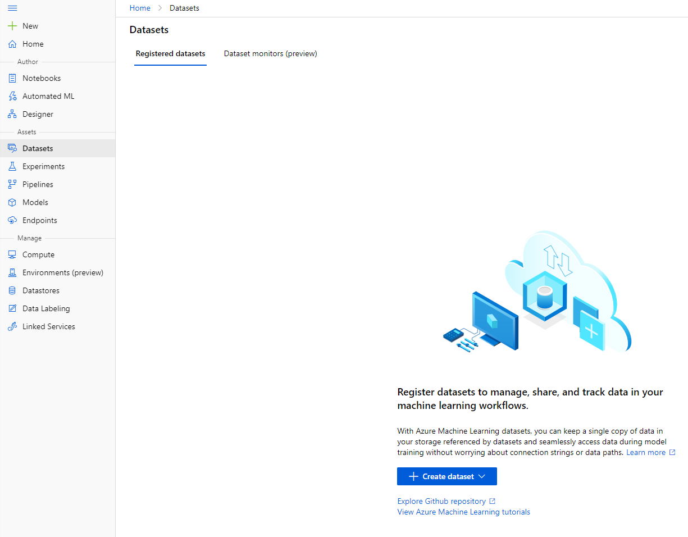

2. Give your dataset a name, a type and a description. Click Next. Upload the data from files. Click Next.
   
   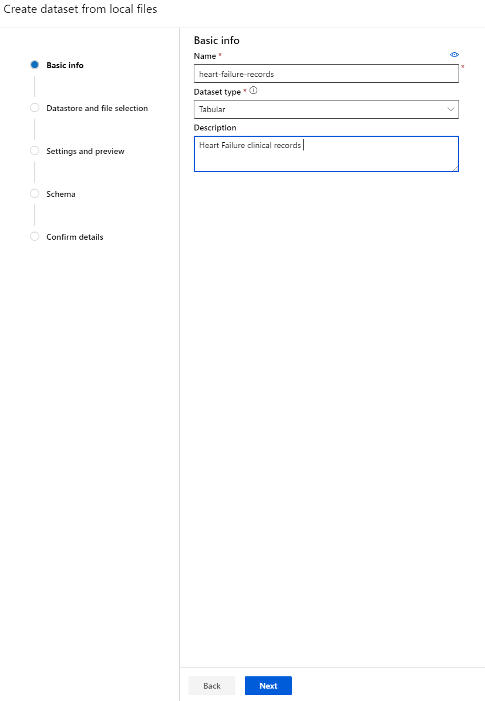

3. In the Schema, change the data type to Boolean for the following features: anaemia, diabetes, high blood pressure, sex, smoking, and DEATH_EVENT. Click Next and Click Create.
   
   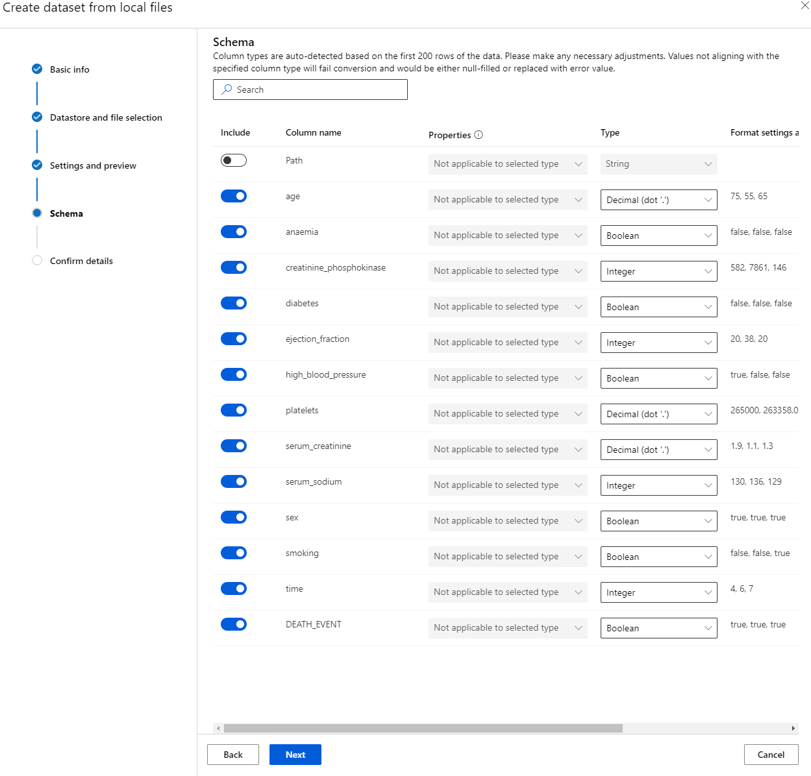

Great now that the dataset is in place and the compute cluster is created, we can start the training of the model!

### 2.4 Low code/No Code training with AutoML 

Traditional machine learning model development is resource-intensive, requiring significant domain knowledge and time to produce and compare dozens of models. 
Automated machine learning (AutoML), is the process of automating the time-consuming, iterative tasks of machine learning model development. It allows data scientists, analysts, and developers to build ML models with high scale, efficiency, and productivity all while sustaining model quality. It greatly accelerates the time it takes to get production-ready ML models with great ease and efficiency. [Learn more](https://docs.microsoft.com/en-us/azure/machine-learning/concept-automated-ml)

1. In the [Azure ML workspace](https://ml.azure.com/) that we created earlier click on "Automated ML" in the left menu and select the dataset you just uploaded. Click Next.

   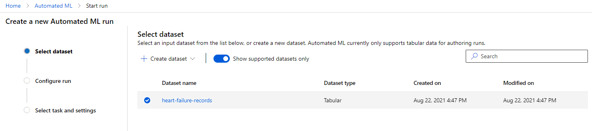

2.  Enter a new experiment name, the target column (DEATH_EVENT) and the compute cluster we created. Click Next.
   
   

3. Choose "Classification" and Click Finish. This step might take between 30 min to 1 hour depending on your compute cluster size.
    
    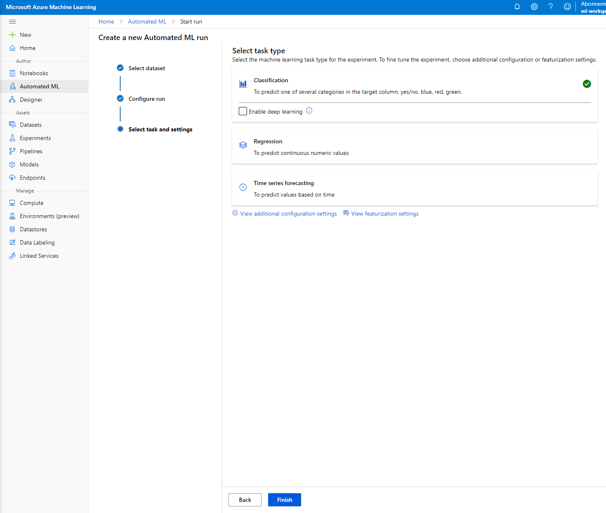

4. Once the run is complete, click on the "Automated ML" tab, click on your run, and click on the Algorithm in the "Best model summary" card.
    
    

Here you can see the detailed description of the best model that AutoML generated. You can also explore other modes generated in the Models tab. Take a few minutes to explore the models in the Explanations (preview button). Once you have chosen the model you want to use (here we will chose the best model selected by autoML), we will see how we can deploy it.

## 3. Low code/No Code model deployment and endpoint consumption
### 3.1 Model deployment
### 3.2 Endpoint consumption
## 🚀 Challenge

## Post-Lecture Quiz

[Post-lecture quiz]()

## Review & Self Study

## Assignment

[Assignment Title](assignment.md)

