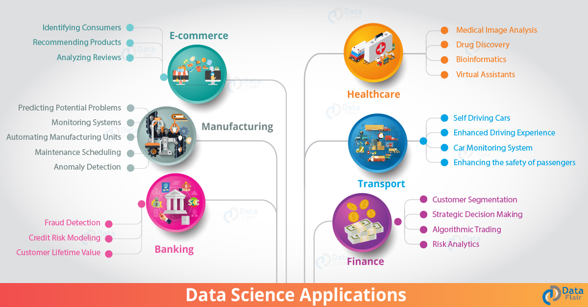

# Ciencia de Datos en el mundo real

|  ](../../../sketchnotes/20-DataScience-RealWorld.png) |
| :--------------------------------------------------------------------------------------------------------------: |
|               Ciencia de Datos en el mundo real - _Sketchnote por [@nitya](https://twitter.com/nitya)_               |

¡Estamos casi al final de esta aventura de aprendizaje!

Empezamos con las definiciones de ciencia de datos y ética, se exploraron diveras herramientas y técnicas para el análisis y visualización de datos, se revisó el ciclo de vida de los datos, y se buscó escalar y automatizar flujos de trabajo de ciencia de datos con servicios de cómputo en la nube. Por lo que te preguntarás: _"¿Cómo relaciono todo este aprendizaje con el mundo real?"_

En esta lección, exploraremos la aplicación de la ciencia de datos en el mundo real en la industria y profundizaremos en ejemplos específicos en la investigación, humanidades digitales y sustentabilidad. Analizaremos oportunidades de proyectos para estudiantes y concluiremos con recursos útiles que te ayuden en tu aventura de aprendizaje.
## Examen previo a la lección

[Examen previo a la lección](https://purple-hill-04aebfb03.1.azurestaticapps.net/quiz/38)
## Ciencia de Datos + Industria

Gracias a la democratización de la AI, los desarrolladores encuentran más fácil el diseñar e integrar tanto la toma de decisiones dirigidas por AI como el conocimiento práctico dirigido por datos en experiencias de usuario y desarrollar flujos de trabajo. Aquí algunos ejemplos de cómo la ciencia de datos es "aplicada" en aplicaciones del mundo real a través de la industria:

 * [Tendencias de la gripe de Google](https://www.wired.com/2015/10/can-learn-epic-failure-google-flu-trends/) se usó ciencia de datos para correlacionar términos de búsqueda con tendencias de la gripe. Mientras el enfoque tuvo fallos, este resaltó las posibilidades (y retos) de las predicciones de cuidados de la salud dirigidos por datos.

 * [Predicciones de enrutamiento de UPS](https://www.technologyreview.com/2018/11/21/139000/how-ups-uses-ai-to-outsmart-bad-weather/) - explica cómo UPS usa ciencia de datos y aprendizaje automático para predecir rutas óptimas para la entrega, tomando en cuenta condiciones climáticas, patrones de tráfico, fechas límite de entrega y más.

 * [Visualización de rutas de taxis en la ciudad de Nueva York](http://chriswhong.github.io/nyctaxi/) - se reunieron los datos usando [leyes de libertad de la información](https://chriswhong.com/open-data/foil_nyc_taxi/) lo cual ayudó a visualizar un día en la vida de los taxis de Nueva York, ayudando a entender como recorren la ajetreada ciudad, cuánto dinero ganan, y la duración de los viajes durante un período de 24 horas.

 * [Banco de trabajo de Ciencia de Datos de Uber](https://eng.uber.com/dsw/) - usa los datos (de ubicaciones de inicio y fin de ruta, duración del viaje, rutas preferidas, etc.) reunidos de millones de viajes *diarios* en uber para construir una herramienta de analítica de datos para ayudar con los precios, seguridad, detección de fraude y decisiones de navegación.

 * [Analítica de deportes](https://towardsdatascience.com/scope-of-analytics-in-sports-world-37ed09c39860) - se enfoca en _analítica predictiva_  (análisis de equipo y jugador) - piensa [Moneyball](https://datasciencedegree.wisconsin.edu/blog/moneyball-proves-importance-big-data-big-ideas/) - y gestión de admiradores) y _visualización de datos_ (tableros de equipo y admiradores, juegos, etc.) con aplicaciones como búsqueda de talento, apuestas deportivas y gestión de sedes/inventario.

* [Ciencia de Datos en el sector bancario](https://data-flair.training/blogs/data-science-in-banking/) - resalta el valor de la ciencia de datos en la industria financiera con aplicaciones que varían desde el modelado de riesgo y detección de fraudes, a segmentación de clientes, sistemas de predicción y recomendación en tiempo real. La analítica predictiva también dirige medidas críticas como [puntaje de crédito](https://dzone.com/articles/using-big-data-and-predictive-analytics-for-credit).

 * [Ciencia de Datos en el cuidado de la salud](https://data-flair.training/blogs/data-science-in-healthcare/) - resalta aplicaciones como imágenes médicas (por ejemplo, resonancias magnéticas, rayos X, tomografías computarizadas), genómicas (secuencia de ADN), desarrollo de fármacos (evaluación de riesgos, predicción de éxito), análisis predictivos (cuidado del paciente y logística de suministro), seguimiento y prevención de enfermedades, etcétera.

 Image Credit: [Estilos de datos: 6 sorprendentes aplicaciones de la Ciencia de Datos](https://data-flair.training/blogs/data-science-applications/)

La imagen muestra otros dominios y ejemplos para aplicar técnicas de ciencia de datos. ¿Quieres explorar otras aplicaciones? Revisa la sección [revisión y auto-estudio](#revisi%C3%B3n-y-auto-estudio) abajo.

## Ciencia de datos + Investigación

|  ](../../../sketchnotes/20-DataScience-Research.png) |
| :---------------------------------------------------------------------------------------------------------------: |
|              Ciencia de Datos e Investigación - _Sketchnote por [@nitya](https://twitter.com/nitya)_              |

Mientras las aplicaciones del mundo real suelen enfocarse en los casos de uso a escala en la industri, las aplicaciones y proyectos de _investigación_  son útiles desde dos prespectivas:

* _oportunidades de inovación_ - explora el prototipado rápido de conceptos avanzados y pruebas de experiencias de usuario para aplicaciones de próxima generación.
* _desafíos de despliegue_ - investiga daños potenciales o consecuencias involuntarias de las tecnologías de ciencia de datos el mundo real.

Para los estudiantes, estos proyectos de investigación pueden proveer tanto aprendizaje como oportunidades de colaboración que podrían mejorar tu entendimiento del tema, y ampliar tu conciencia y compromiso con gente o equipos relevantes en el área de interés. ¿Entonces, qué te parecen los proyectos de investigación y cómo pueden tener impacto?

Veamos un ejemplo - el [estudio de sombras de género del MIT](http://gendershades.org/overview.html) de Joy Buolamwini (MIT Media Labs) con  el[documento de investigación de firma](http://proceedings.mlr.press/v81/buolamwini18a/buolamwini18a.pdf) en co-autoría con Timnit Gebru (luego en Microsoft Research) se enfocó en: 

 * **Qué:** El objetivo del proyecto de investigación fue el _evaluar sesgos presentes en los algoritmos de análisis facial automatizado y conjuntos de datos_ basados en el género y tipo de piel.

 * **Porqué:** El análisis facial es usado en área como cumplimiento de la ley, seguridad aeroportuaria, sistemas de contratación y más - contextos donde las clasificaciones imprecisas (por ejemplo, debido a sesgos) pueden causar daños potenciales económicos y sociales a los individuos o grupos afectados. Entender (y eliminar o mitigar) sesgos es la clave para ser justos en práctica.

 * **Cómo:** Lso investigadores reconocieron que los puntos de referencia existentes usaron predominantemente sujetos de piel más clara, y curaron un nuevo conjunto de datos (más de 1000 imágenes) que estaban _más equilibradas_ por género y tipo de piel. El conjunto de datos se usó para evaluar la precisión de tres productos de clasificación de género (de Microsoft, IBM y Face++).

Los resultados mostraton que aunque la precisión de clasificación general era buena, había una notable diferencia en las tasas de error entre distintos subgrupos - con  la **mala clasificación de género** siendo más alta para mujeres o personas con tipos de piel más oscuros, indicativo de un sesgo.

**Resultados clave:** Hicieron evidente que la ciencia de datos necesita más _conjuntos de datos representativos_ (subgrupos equilibrados) y más _equipos incluyentes_ (distintos antecedentes) para reconocer y eliminar o mitigar esos sesgos antes en soluciones de AI. los esfuerzos de investigación como este también son instrumentales en muchas organizaciones definiendo principios y práticas para una _AI responsable_ para mejorar la justicia a través de los productos y procesos de AI.

**¿quieres aprender acerca de esfuerzos relevantes de investigación en Microsoft?**

* Revisa los [proyectos de investigación de Microsoft](https://www.microsoft.com/research/research-area/artificial-intelligence/?facet%5Btax%5D%5Bmsr-research-area%5D%5B%5D=13556&facet%5Btax%5D%5Bmsr-content-type%5D%5B%5D=msr-project) en Inteligencia Artificial.
* Explorar proyectos de estudiantes de la [escuela de verano de investigación en Ciencia de Datos de Microsoft](https://www.microsoft.com/en-us/research/academic-program/data-science-summer-school/).
* Revisa el proyecto [Fairlearn](https://fairlearn.org/) e iniciativas de [AI responsable](https://www.microsoft.com/en-us/ai/responsible-ai?activetab=pivot1%3aprimaryr6).

## Ciencia de Datos + Humanidades

|  ](../../../sketchnotes/20-DataScience-Humanities.png) |
| :---------------------------------------------------------------------------------------------------------------: |
|              Ciencia de Datos & Humanidades Digitales - _Sketchnote por [@nitya](https://twitter.com/nitya)_              |

Las Humanidades Digitales [han sido definidas](https://digitalhumanities.stanford.edu/about-dh-stanford) como "una coleción de prácticas y enfoques que combinan métodos computacionales con investigación humanística". Los [proyectos de Stanford](https://digitalhumanities.stanford.edu/projects) como _"reiniciando la historia"_ y _"pensamiento poético"_ ilustran el vículo entre [las Humanidades Digitales y Ciencia de Datos](https://digitalhumanities.stanford.edu/digital-humanities-and-data-science) - enfatizando técnicas como el análisis de red, visualización de la información, análisis espacial y de texto que nos ayudan a revisitar datos históricos y literarios para derivar en nuevos conocimientos y perspectivas.

*¿Quieres explorar y extender un proyecto en este espacio?*

Revisa ["Emily Dickinson y el medidor de estado de ánimo"](https://gist.github.com/jlooper/ce4d102efd057137bc000db796bfd671) - un gran ejemplo de [Jen Looper](https://twitter.com/jenlooper) que planteacomo podemos usar la ciencia de datos para revisitar poesía familiar y re-evaluar su significado y las contribuciones de su autor en nuevos contextos. Por ejemplo, _¿podemos predecir la estación en la cual fue creado un poema realizando un análisis en su tono o sentimiento_? y ¿qué nos dices esto acerca del estado mental del autor en ese período en particular?

Para responder a esa pregunta, seguiremos los pasos de nuestro ciclo de vida de ciencia de datos:
 * [`Adquisición de datos`](https://gist.github.com/jlooper/ce4d102efd057137bc000db796bfd671#acquiring-the-dataset) - para recolectar un conjunto de datos relevante para el análisis. Las opciones incluyen el uso de un API (por ejemplo, [Poetry DB API](https://poetrydb.org/index.html)) o realizar raspado de páginas web (por ejemplo, [Proyecto Gutenberg](https://www.gutenberg.org/files/12242/12242-h/12242-h.htm)) usando herramientas como [Scrapy](https://scrapy.org/).
 * [`Limpieza de datos`](https://gist.github.com/jlooper/ce4d102efd057137bc000db796bfd671#clean-the-data) - explica como se puede dar formato al texto, la sanitización y simplificación usando herramientas básicas como Visual Studio Code y Microsoft Excel.
 * [`Análisis de datos`](https://gist.github.com/jlooper/ce4d102efd057137bc000db796bfd671#working-with-the-data-in-a-notebook) - explica como podemos importar los conjuntos de trabajo en "Notebooks" para análisis usando paquetes de Python (como pandas, numpy y matplotlib) para organizar y visualizar los datos.
 * [`Análisis de sentimiento`](https://gist.github.com/jlooper/ce4d102efd057137bc000db796bfd671#sentiment-analysis-using-cognitive-services) - explica como podemos integrar servicios en la nube como Text Analytics, usando herramientas de low-code tools como [Power Automate](https://flow.microsoft.com/en-us/) para flujos de trabajo de procesamiento de datos automatizados.

Usando este flujo de trabajo, podemos explorar los impactos estacionales en el sentimiento de los poemas, y nos ayuda a formar nuestras propias perspectivas del autor. ¡Prueba esto tú mismo - luego extiende el notebook para preguntar otras cuestiones o visualizar los datos de nuevas formas!

> Puedes usar algunas de las herramientas en la [caja de herramientas de Humanidades Digitales](https://github.com/Digital-Humanities-Toolkit) para seguir estas vías de investigación.

## Ciencia de Datos + Sustentabilidad

|  ](../../../sketchnotes/20-DataScience-Sustainability.png) |
| :---------------------------------------------------------------------------------------------------------------: |
|              Ciencia de Datos y Sustentabilidad - _Sketchnote por [@nitya](https://twitter.com/nitya)_              |

La [agenda de 2030 para el desarrollo sostenible](https://sdgs.un.org/2030agenda) - adoptada por todos los miembros de las Naciones Unidas en 2015 - identifica 17 metas incluyendo  algunas que se enfocan en la **protección del planeta** de la degradación y el impacto del cambio climático. La iniciativa de [sustentabilidad de Microsoft](https://www.microsoft.com/en-us/sustainability) soporta estas metas explorando formas en las cuales las soluciones tecnológicas pueden soportar y construir futuros más sostenibles con un [enfoque en 4 metas](https://dev.to/azure/a-visual-guide-to-sustainable-software-engineering-53hh) - siendo negativas al carbono, positivas al agua, cero desperdicio y biodiversas para el 2030.

Abordar estos desafíos de forma escalable y oportuna requiere pensamiento a escala de la nuber y datos en gran escala. La iniciativa de [Computadora Planetaria](https://planetarycomputer.microsoft.com/) provee 4 componentes que ayudan a los científicos de datos y desarrolladores en este esfuerzo:

 * [Catálogo de datos](https://planetarycomputer.microsoft.com/catalog) - con petabytes de datos de los sistemas de la tierra (gratuitos y hospedados en Azure).
 * [API Planetaria](https://planetarycomputer.microsoft.com/docs/reference/stac/) - para ayudar a los usuarios a buscar datos relevantes a través del espacio y tiempo.
 * [Hub](https://planetarycomputer.microsoft.com/docs/overview/environment/) - entorno gestionado por científicos par el proceso de conjuntos de datos geoespaciales masivos.
 * [Aplicaciones](https://planetarycomputer.microsoft.com/applications) - exhibe casos de uso y herramientas para conocimientos prácticos sostenibles.

**El proyecto de Computadora Planetaria está actualmente en progreso (a Septiembre de 2021)** - así es como puedes iniciarte en la contribución a soluciones sostenibles usando ciencia de datos.

* [Solicita acceso](https://planetarycomputer.microsoft.com/account/request) para iniciar la exploración y conecta con compañeros.
* [Explora la documentación](https://planetarycomputer.microsoft.com/docs/overview/about) para entender los conjuntos de datos y APIs soportados.
* Explora aplicaciones como [Monitoreo del ecosistema](https://analytics-lab.org/ecosystemmonitoring/) en búsqueda de inspiración en ideas de aplicación.

Piensa en cómo puedes usar la visualización de datos para exponer o amplificar los conocimientos en áreas como el cambio climático y deforestación. O piensa en como pueden ser usados los conocimientos para crear nuevas experiencias de usuario para motivar cambios en comportamiento para una vida más sostenible.

## Ciencia de Datos + Estudiantes

Hemos hablado acerca de aplicaciones en el mundo real en la industria y la investigación y explorado ejemplos de aplicación de la ciencia de datos en las humanidades digitales y sostenibilidad. Entonces, ¿cómo puedes construir tus habilidades y compartir tu experienca como principiantes en la ciencia de datos?

Aquí tienes algunos ejemplos de proyectos de estudiantes de ciencia de datos para inspirarte.

* [Escuela de verano de ciencia de datos MSR](https://www.microsoft.com/en-us/research/academic-program/data-science-summer-school/#!projects) en [proyectos](https://github.com/msr-ds3) de Github explora temas como:
    - [Sesgo racial en el uso de la fuerza policial](https://www.microsoft.com/en-us/research/video/data-science-summer-school-2019-replicating-an-empirical-analysis-of-racial-differences-in-police-use-of-force/) | [Github](https://github.com/msr-ds3/stop-question-frisk)
    - [Fiabilidad del sistema de transporte Metro de la Ciudad de Nueva York](https://www.microsoft.com/en-us/research/video/data-science-summer-school-2018-exploring-the-reliability-of-the-nyc-subway-system/) | [Github](https://github.com/msr-ds3/nyctransit)
 * [Digitalización de la Cultura Material: explora las distribuciones socio-económicas en Sirkap](https://claremont.maps.arcgis.com/apps/Cascade/index.html?appid=bdf2aef0f45a4674ba41cd373fa23afc)- por [Ornella Altunyan](https://twitter.com/ornelladotcom) y el equipo en Claremont, usando [ArcGIS StoryMaps](https://storymaps.arcgis.com/).

## 🚀 Desafío

Busca artículos que recomienden proyectos de ciencia de datos que son amigables para principiantes - como [éstas 50 temas de área](https://www.upgrad.com/blog/data-science-project-ideas-topics-beginners/) o [estas 21 ideas de proyecto](https://www.intellspot.com/data-science-project-ideas) o [estos 16 proyectos con código fuente](https://data-flair.training/blogs/data-science-project-ideas/) que puedes deconstruir y remezclar. Y no olvides crear un blog acerca de tu viaje de aprendizaje y comparte tus conocimientos con todos nosotros.

## Examen posterior a la lección

[Examen posterior a la lección](https://purple-hill-04aebfb03.1.azurestaticapps.net/quiz/39)
## Revisión y auto-estudio

¿Quieres explorar más casos de uso? Aquí hay algunos artículos relevantes:
 * [17 aplicaciones de Ciencia de Datos y ejemplos](https://builtin.com/data-science/data-science-applications-examples) - Julio de 2021
 * [11 proyectos de Ciencia de Datos sorprendentes en el mundo real](https://myblindbird.com/data-science-applications-real-world/) - Mayo de 2021
 * [Ciencia de Datos en el mundo real](https://towardsdatascience.com/data-science-in-the-real-world/home) - colección de artículos
 * Ciencia de Datos en la [Educación](https://data-flair.training/blogs/data-science-in-education/), [Agricultura](https://data-flair.training/blogs/data-science-in-agriculture/), [Finanzas](https://data-flair.training/blogs/data-science-in-finance/), [Películas](https://data-flair.training/blogs/data-science-at-movies/) y más.
## Asignación

[Explora un conjunto de datos de la Computadora Planetaria](assignment.es.md)
