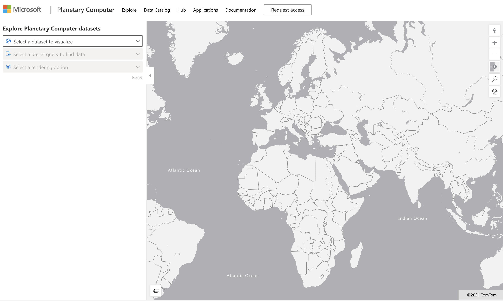

# Explora un conjunto de datos de la Computadora Planetaria

## Instrucciones

En esta lección, hablamos acerca de distintos dominios de aplicación de la ciencia de datos - profundizando en ejemplos relacionados a la investigación, sustentabilidad y humanidades digitales. En esta asignación, explorarás uno de estos ejemplos a mayor detalle, y aplicarás algunos de tus aprendizajes en visualización de datos y análisis para derivar en conocimientos acerca de datos de sustentabilidad.

El proyecto de [Computadora Planetaria](https://planetarycomputer.microsoft.com/) tiene conjuntos de datos y APIs que pueden ser accesadas con una cuenta - solicita acceso si quieres probar el paso adicional de esta asignación. El sitio también provee una característica de [Explorador](https://planetarycomputer.microsoft.com/explore) que puedes usar sin crear una cuenta.

`Pasos:`
La interfaz de exploración (mostrada en captura de pantalla abajo) te permite seleccionar un conjunto de datos (de las opciones proporcionadas), una consulta preestablecida (para filtrar los datos) y una opción de representación (para crear una visualización relevante). En esta asignación, tu tarea es:

 1. Lee la [documentación del explorador](https://planetarycomputer.microsoft.com/docs/overview/explorer/) - entiende las opciones.
 2. Explora el conjunto de datos del [catálogo](https://planetarycomputer.microsoft.com/catalog) - entiende el propósito de cada uno.
 3. Usa el explorador - elige un conjunto de datos de interés, selecciona una consulta relevante y una opción de representación.

`Tu tarea:`
Ahora estudia la visualización que es representada en el navegador y responde a lo siguiente:
 * ¿Qué _características_ tiene el conjunto de datos?
 * ¿Qué _conocimientos_ o resultados provee la visualización?
 * ¿Cuáles son las _implicaciones_ de esos conocimientos para las metas de sustentabilidad del proyecto?
 * ¿Cuáles son las _limitantes_ de la visualización (esto es, ¿qué conocimiento no obtienes?)?
 * Si pudieras obtener los datos en crudo, ¿qué _alternativas de visualización_ crearías y porqué?

`Puntos adicionales:`
Aplica para una cuenta - e inicia sesión cuando seas aceptado.
 * Usa la opción _Launch Hub_ para abrir el conjunto de datos en crudo en un Notebook.
* Explorar los datos de forma interactiva, e implementa las alternativas de visualización que tengas en mente.
* Ahora analiza tus visualizaciones personalizadas - ¿fuiste capaz de derivar los conocimientos que antes te faltaron?

## Rúbrica

Ejemplar | Adecuado | Necesita mejorar
--- | --- | -- |
Todas las cinco preguntas se respondieron. El estudiante identificó claramente como las visualizaciones actuales y alternativas podrían proveer conocimiento en objetivos de sustentabilidad o resultados. | El estudiante respondió al menos las 3 preguntas principales a gran detalle, mostrando que tuvo experiencia práctica con el Explorador. | El estudiante falló al responder múltiples preguntas, o dió detalles insuficientes - indicando que hizo un intento significativo para el proyecto. |