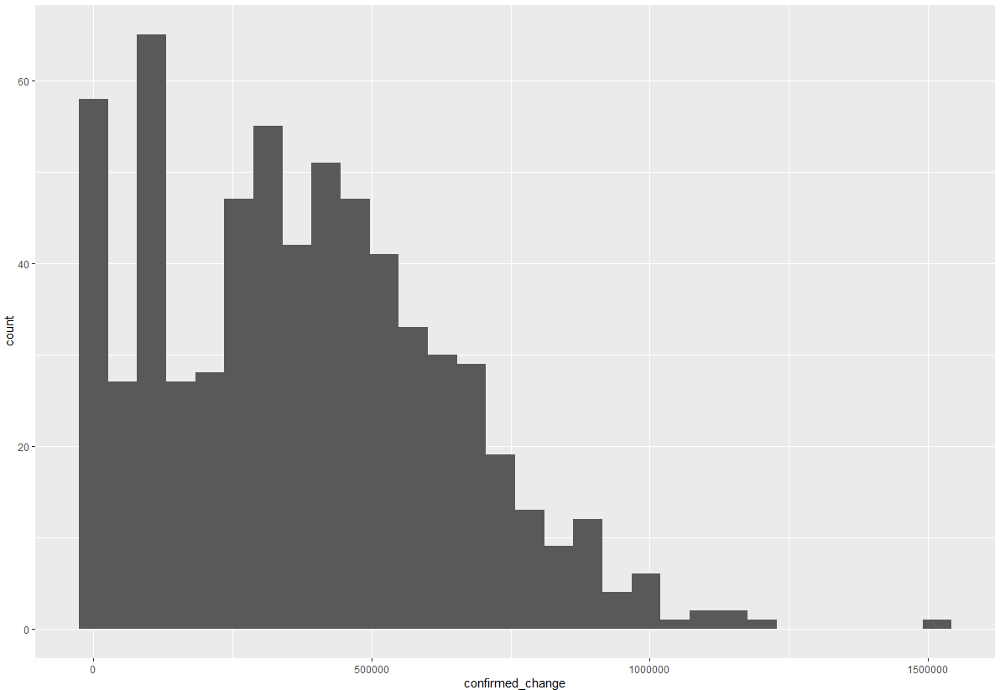
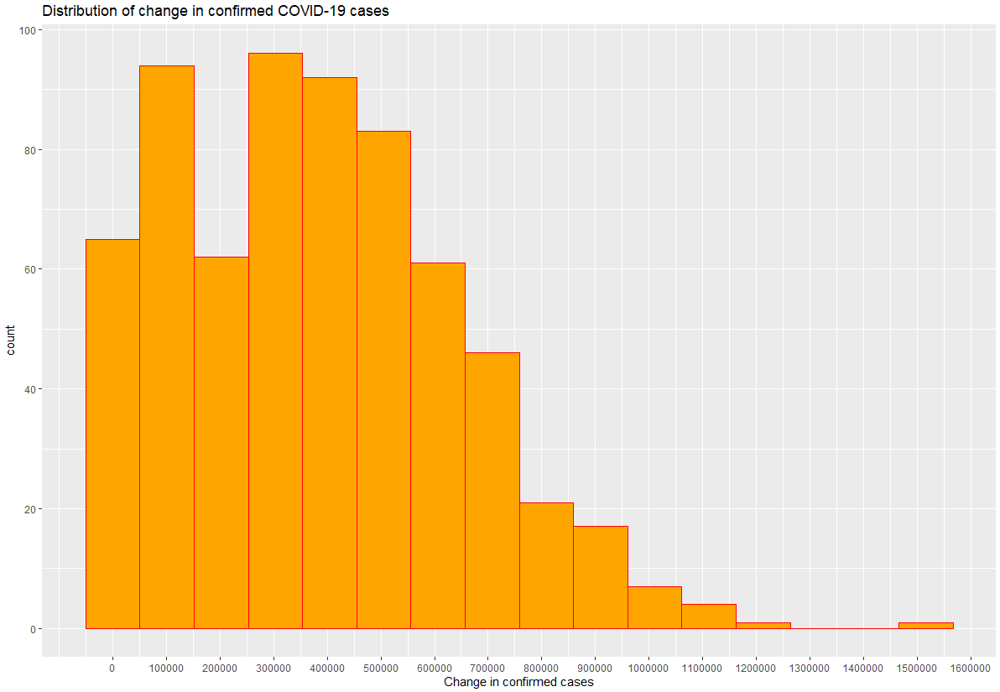
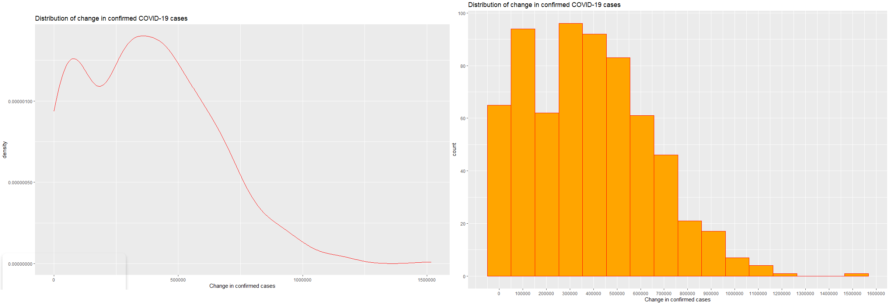
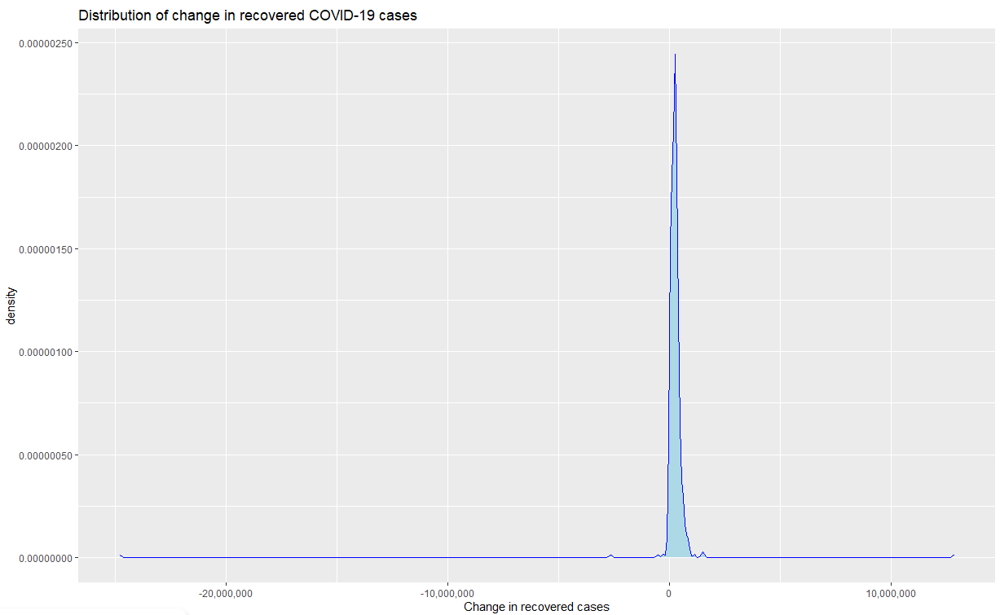
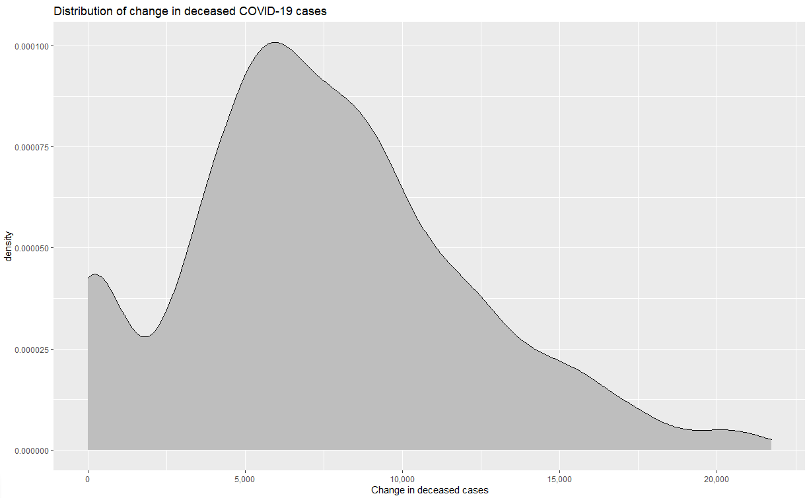

# Visualizing Distributions

<em> Sketchnote comes here </em>

In the previous lesson, you learned about visualizing quantities. This lesson will focus on distributions and their visualizations.

## [Pre-lecture quiz]() Yet to be linked

## Explore the COVID-19 dataset

We can now look at the distribution of this data along an axis. This would help us understand how a variable is distributed, thereby helping us in analysis.
Let's get started on this lesson by importing the dataset and then parsing the dates to the date-time format using the ```lubridate``` package.

```r
library(lubridate)
df_covid <- read.csv("../../data/covid.csv")
df_covid$updated<-as.Date(parse_date_time(df_covid$updated, c('ymd', 'ymd')))
```
## Working with histograms

Histograms gives a true image of the distribution of a variable. In our case, let us visualize the distribution of the "change in confirmed, recovered and deceased COVID-19 cases". Let us now load `ggplot2` and use the `geom_histogram()` function for making a histogram. 

```r
library("ggplot2")
ggplot(data=df_covid, aes(x=confirmed_change)) + 
  geom_histogram()
```
This produces an output like this


Let's make the histogram more presentable for easy interpretation. Using the `scales` package, we would alter the number of axes ticks/points. Along with this a change in the axes titles and addition of the plot title would help in easy interpretation.

```r
library("scales")
ggplot(data=df_covid, aes(x=confirmed_change)) + 
  geom_histogram( bins = 16,fill="orange",color="red") +
  scale_x_continuous(breaks=seq(0,2000000,100000)) +
  scale_y_continuous(breaks=seq(0,200,20)) +
  xlab("Change in confirmed cases") +
  ggtitle("Distribution of change in confirmed COVID-19 cases")
```
You have successfully added ticks on the x-axis ranging from 0 to 2000000 with a gap of 100000 between two consecutive ticks. Similarly added ticks on the y-axis ranging from 0 to 200 with a gap of 20 between two consecutive ticks. Along with this you have now given an appropriate x-axis label and chart title. The `bins` tells `ggplot2` how many bars or bins do we want in our histogram. In this chart, the number of bins are 16 but you can customize them to as many bins as you like. This plot shows us that the change of about 300000 was the most frequent for the confirmed COVID-19 cases


Similarly, try plotting the histograms for change in the number of recovered and deceased cases. 

## Density plots

Density plots are another charts that help analyse distributions for variables. However, unlike the box-structure of histograms, density plots have a smooth line structure. In other words, they can be thought of as smoothened histograms. Use the` geom_density()` function to make a density plot. 

```r
ggplot(data = df_covid, aes(x = confirmed_change)) + 
  geom_density(color = "red") +
  scale_y_continuous(labels = comma) +
  xlab("Change in confirmed cases") +
  ggtitle("Distribution of change in confirmed COVID-19 cases")
```


The density plot is clearly a smoothened form of the histogram. 
Let's also plot density plots for change in recovered and deceased cases. 




## 🚀 Challenge

Research about overlaying ggplots and try to make visualizations for multiple variables in one graph. This will help you look at the distribution of multiple variables in one chart.

## [Post-lecture quiz]() yet to be linked

## Review & Self Study
In this lesson we visualized distributions using Histograms and density plots. You can explore other types of graphs used for visualizing distributions (like box plot,etc.) and try drawing them using packages you like.

## Assignment

[Histogram and density plots]() yet to be linked

