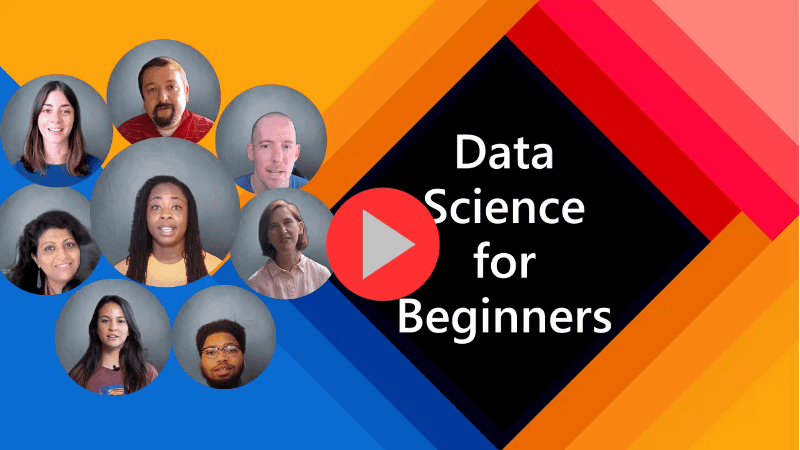

# Yeni Başlayanlar için Veri Bilimi - Bir Ders Programı

Microsoft'taki Azure Bulut Destekçileri 10 hafta, 20 derslik tamamı Veri Bilimi hakkında bir ders programı sunmaktan mutluluk duyar. Her ders; ders öncesi ve ders sonrası kısa sınavları, dersi tamamlamak için yazılı talimatlar, bir çözüm ve bir de ödev içermektedir. Proje bazlı eğitimbilimimiz yeni beceriler geliştirmede kanıtlanmış bir yol olan uygulama yaparak öğrenmenize izin verir.

**Yazarlarımıza en içten teşekkürler:** [Jasmine Greenaway](https://www.twitter.com/paladique), [Dmitry Soshnikov](http://soshnikov.com), [Nitya Narasimhan](https://twitter.com/nitya), [Jalen McGee](https://twitter.com/JalenMcG), [Jen Looper](https://twitter.com/jenlooper), [Maud Levy](https://twitter.com/maudstweets), [Tiffany Souterre](https://twitter.com/TiffanySouterre), [Christopher Harrison](https://www.twitter.com/geektrainer).

Aaryan Arora, [Aditya Garg](https://github.com/AdityaGarg00), [Alondra Sanchez](https://www.linkedin.com/in/alondra-sanchez-molina/), [Ankita Singh](https://www.linkedin.com/in/ankitasingh007), [Anupam Mishra](https://www.linkedin.com/in/anupam--mishra/), [Arpita Das](https://www.linkedin.com/in/arpitadas01/), ChhailBihari Dubey, [Dibri Nsofor](https://www.linkedin.com/in/dibrinsofor), [Dishita Bhasin](https://www.linkedin.com/in/dishita-bhasin-7065281bb), [Majd Safi](https://www.linkedin.com/in/majd-s/), [Max Blum](https://www.linkedin.com/in/max-blum-6036a1186/), [Miguel Correa](https://www.linkedin.com/in/miguelmque/), [Mohamma Iftekher (Iftu) Ebne Jalal](https://twitter.com/iftu119), [Nawrin Tabassum](https://www.linkedin.com/in/nawrin-tabassum), [Raymond Wangsa Putra](https://www.linkedin.com/in/raymond-wp/), [Rohit Yadav](https://www.linkedin.com/in/rty2423), Samridhi Sharma, [Sanya Sinha](https://www.linkedin.com/mwlite/in/sanya-sinha-13aab1200),
[Sheena Narula](https://www.linkedin.com/in/sheena-narua-n/), Tauqeer Ahmad, Yogendrasingh Pawar başta olmak üzere tüm **[Microsoft Öğrenci Elçilerimize](https://studentambassadors.microsoft.com/) yazarlarımıza, inceleyicilerimize ve içerik üreticilerimize 🙏 özel teşekkürler 🙏** 

| ](../sketchnotes/00-Title.png)|
|:---:|
| Data Science For Beginners - _Sketchnote by [@nitya](https://twitter.com/nitya)_ |

# Başlangıç

> **Öğretmenler**: bu ders programını nasıl kullanacağınızla alakalı bazı [öneriler](../for-teachers.md) ekledik. [Tartışma forumlarımıza](https://github.com/microsoft/Data-Science-For-Beginners/discussions) bırakacağınız geribildirimlerinizi görmeyi çok isteriz!

> **Öğrenciler**: bu ders programını kendi başınıza kullanabilmek için tüm repoyu fork edin ve kendi başınıza ders öncesi kısa sınavlarından başlayarak alıştırmaları tamamlamaya çalışın. Sonra dersi okuyun ve geri kalan etkinlikleri tamamlayın. Çözüm kodunu kopyalamaktansa derslerde öğrendiklerinizi kullanarak projeler yaratmaya çalışın. Çözüm kodları her projeye dayalı dersin /solution klasöründe bulunmaktadır. Başka bir fikir de arkadaşlarınızla bir çalışma grubu kurup içeriği birlikte takip etmeniz olabilir. Daha ileri öğrenim için [Microsoft Learn](https://docs.microsoft.com/en-us/users/jenlooper-2911/collections/qprpajyoy3x0g7?WT.mc_id=academic-77958-bethanycheum)'ü tavsiye ediyoruz.

## Ekiple Tanışın

**Gif by** [Mohit Jaisal](https://www.linkedin.com/in/mohitjaisal)

> 🎥 Projeyi oluşturan insanlar hakkında bir video için yukarıdaki resme tıklayın!

## Eğitimbilim

Bu ders programını oluştururken iki eğitimbilimsel ilkeyi benimsedik: proje bazlı olmasından ve sıklıkla kısa sınav içereceğinden emin olmak. Bu serinin sonunda öğrenciler veri hazırlama, veriyle çalışmanın farklı yolları, veri görselleştirme, veri analizi, veri biliminin gerçek hayattaki kullanım senaryoları gibi konular dahil olmak üzere veri biliminin temel prensiplerini öğrenmiş olacaklar.

Bunlara ek olarak ders öncesi yüzeysel bir kısa sınav ile öğrencinin bir konuyu öğrenme niyetini oluştururken ders sonunda ikinci bir kısa sınav ileri pekiştirmeyi sağlar. Bu ders programı esnek ve eğlenceli olması için tasarlandı ve parçalar halinde veya bütün olarak takip edilebilir. Projeler temel düzeyde başlamaktadır ve 10 haftalık süreç içerisinde gittikçe karmaşıklaşmaktadır.

> [İş Tüzüğü](../CODE_OF_CONDUCT.md), [Katkı Yapma](../CONTRIBUTING.md),  [Çeviri](../TRANSLATIONS.md) rehberlerimize bakmayı unutmayın. Yapıcı geridönüşlerinizi bekliyoruz!

## Her ders:

- İsteğe bağlı eskiz notu
- İsteğe bağlı ek video
- Ders öncesi ısınma kısa sınavı
- Yazılı ders
- Projeye dayalı dersler için projenin nasıl yapılacağına dair adım adım yönlendirmeler
- Bilgi kontrolleri
- Bir challenge
- Ek okuma
- Ödev
- Ve ders sonrası kısa sınavı içerir

> **Kısa sınavlar hakkında bir not**: Her biri üçer soruluk toplamda 40 kısa sınav [bu uygulamada](https://purple-hill-04aebfb03.1.azurestaticapps.net/) bulunmaktadır. Kısa sınavlara ders içerisinde bir bağlantıyla yer verilmiştir ancak kısa sınav uygulaması yerel olarak da çalıştırılabilir. `quiz-app` dosyasındaki talimatları takip edebilirsiniz. Kısa sınavlar yavaş yavaş çevrilmektedir.

## Dersler

| ](../sketchnotes/00-Roadmap.png)|
|:---:|
| Data Science For Beginners: Roadmap - _Sketchnote by [@nitya](https://twitter.com/nitya)_ |

| Ders Numarası | Konu | Ders Grubu | Öğrenme Hedefleri | Bağlantılı Ders | Yazar |
| :-----------: | :----------------------------------------: | :--------------------------------------------------: | :-----------------------------------------------------------------------------------------------------------------------------------------------------------------------: | :---------------------------------------------------------------------: | :----: |
| 01 | Veri Bilimini Tanımlamak | [Giriş](../1-Introduction/README.md) | Veri bilimi arkasındaki temel konseptleri ve yapay zeka, makine öğrenmesi ve büyük veriyle nasıl ilişkili olduğunu öğrenin. | [ders](../1-Introduction/01-defining-data-science/README.md) [video](https://youtu.be/beZ7Mb_oz9I) | [Dmitry](http://soshnikov.com) |
| 02 | Veri Bilimi Etikleri | [Giriş](../1-Introduction/README.md) | Veri Etik Konseptleri, Challengelar & Frameworkler. | [ders](../1-Introduction/02-ethics/README.md) | [Nitya](https://twitter.com/nitya) |
| 03 | Veriyi Tanımlamak | [Giriş](../1-Introduction/README.md) | Verinin nasıl sınıflandırıldığı ve verinin yaygın kaynakları. | [ders](../1-Introduction/03-defining-data/README.md) | [Jasmine](https://www.twitter.com/paladique) |
| 04 | İstatistik ve Olasılığa Giriş | [Giriş](../1-Introduction/README.md) | Veriyi anlamak için olasılık ve istatistiğin matematiksel teknikleri. | [ders](../1-Introduction/04-stats-and-probability/README.md) [video](https://youtu.be/Z5Zy85g4Yjw) | [Dmitry](http://soshnikov.com) |
| 05 | İlişkisel Veri ile Çalışmak | [Veri ile Çalışmak](../2-Working-With-Data/README.md) | İlişkisel veriye ve Yapısal Sorgulama Dili (SQL) ile ilikisel veriyi incelemenin ve analiz etmenin temellerine giriş. | [ders](../2-Working-With-Data/05-relational-databases/README.md) | [Christopher](https://www.twitter.com/geektrainer) | | |
| 06 | NoSQL Veri ile Çalışmak | [Veri ile Çalışmak](../2-Working-With-Data/README.md) | İlişkisel olmayan veriye, çeşitli türlerine ve belge veritabanlarını incelemenin ve analiz etmenin temellerine giriş. | [ders](../2-Working-With-Data/06-non-relational/README.md) | [Jasmine](https://twitter.com/paladique)|
| 07 | Python ile Çalışmak | [Veri ile Çalışmak](../2-Working-With-Data/README.md) | Pandas gibi kütüphanelerle Python'ı veri incelemeni için kullanmanın temelleri. Python programlama hakkında temel bilgiye sahip olunması tavsiye edilir. | [ders](../2-Working-With-Data/07-python/README.md) [video](https://youtu.be/dZjWOGbsN4Y) | [Dmitry](http://soshnikov.com) |
| 08 | Veri Hazırlama | [Veri ile Çalışmak](../2-Working-With-Data/README.md) | Kayıp, tutarsız ve eksik verinin zorluklarıyla baş etmek için temizleme ve dönüştürme veri teknikleri hakkında konular. | [ders](../2-Working-With-Data/08-data-preparation/README.md) | [Jasmine](https://www.twitter.com/paladique) |
| 09 | Nicelikleri Görselleştirme | [Veri Görselleştirme](../3-Data-Visualization/README.md) | Kuş verisini görselleştirmek için nasıl Matplotlib'in kullanılacağını öğrenin 🦆 | [ders](../3-Data-Visualization/09-visualization-quantities/README.md) | [Jen](https://twitter.com/jenlooper) |
| 10 | Verinin Dağılımlarını Görselleştirme | [Veri Görselleştirme](../3-Data-Visualization/README.md) | Bir aralıktaki gözlemleri ve eğilimleri görselleştirme. | [ders](../3-Data-Visualization/10-visualization-distributions/README.md) | [Jen](https://twitter.com/jenlooper) |
| 11 | Oranları Görselleştirme | [Veri Görselleştirme](../3-Data-Visualization/README.md) | Ayrık ve gruplu yüzdelikleri görselleştirme. | [ders](../3-Data-Visualization/11-visualization-proportions/README.md) | [Jen](https://twitter.com/jenlooper) |
| 12 | Bağıntıları Görselleştirme | [Veri Görselleştirme](../3-Data-Visualization/README.md) | veri setleri ve onların değişkenleri arasındaki bağlantıları ve korelasyonları görselleştirme. | [ders](../3-Data-Visualization/12-visualization-relationships/README.md) | [Jen](https://twitter.com/jenlooper) |
| 13 | Anlamlı Görselleştirmeler | [Veri Görselleştirme](../3-Data-Visualization/README.md) | Etkili problem çözme ve çıkarımlar için görselleştirmelerinizi etkili yapmak için teknikler ve yönlendirmeler. | [ders](../3-Data-Visualization/13-meaningful-visualizations/README.md) | [Jen](https://twitter.com/jenlooper) |
| 14 | Veri Bilimi Yaşam Döngüsüne Giriş | [Yaşam Döngüsü](../4-Data-Science-Lifecycle/README.md) | Veri bilimi yaşam döngüsüne ve onun ilk adımı veriyi elde etmeye ve çıkarmaya giriş. | [ders](../4-Data-Science-Lifecycle/14-Introduction/README.md) | [Jasmine](https://twitter.com/paladique) |
| 15 | Analiz Etme | [Yaşam Döngüsü](../4-Data-Science-Lifecycle/README.md) | Veri bilimi yaşam döngüsünün bu kısmı veriyi analiz etmek için tekniklere odaklanır. | [ders](../4-Data-Science-Lifecycle/15-analyzing/README.md) | [Jasmine](https://twitter.com/paladique) | | |
| 16 | İletişim | [Yaşam Döngüsü](../4-Data-Science-Lifecycle/README.md) | Veri bilimi yaşam döngüsünün bu kısmı karar vericilerin anlaması için daha kolay bir halde veriden elde edilen çıkarımları sunmaya odaklanır. | [ders](../4-Data-Science-Lifecycle/16-communication/README.md) | [Jalen](https://twitter.com/JalenMcG) | | |
| 17 | Cloudta Veri Bilimi | [Cloud Verisi](../5-Data-Science-In-Cloud/README.md) | Bu ders dizisi cloudta veri bilimini ve faydalarını tanıtır. | [ders](../5-Data-Science-In-Cloud/17-Introduction/README.md) | [Tiffany](https://twitter.com/TiffanySouterre) ve [Maud](https://twitter.com/maudstweets) |
| 18 | Cloudta Veri Bilimi| [Cloud Verisi](../5-Data-Science-In-Cloud/README.md) | Low Code araçlarını kullanan eğitim modelleri. |[ders](../5-Data-Science-In-Cloud/18-Low-Code/README.md) | [Tiffany](https://twitter.com/TiffanySouterre) ve [Maud](https://twitter.com/maudstweets) |
| 19 | Cloudta Veri Bilimi | [Cloud Verisi](../5-Data-Science-In-Cloud/README.md) | Azure Machine Learning Studio ile konuşlandırma modelleri. | [ders](../5-Data-Science-In-Cloud/19-Azure/README.md)| [Tiffany](https://twitter.com/TiffanySouterre) ve [Maud](https://twitter.com/maudstweets) |
| 20 | Gerçek Hayatta Veri Bilimi | [Gerçek Hayatta](../6-Data-Science-In-Wild/README.md) | Gerçek dünyadaki veri bilimi tabanlı projeler. | [ders](../6-Data-Science-In-Wild/20-Real-World-Examples/README.md) | [Nitya](https://twitter.com/nitya) |
## Çevrimdışı erişim

[Docsify](https://docsify.js.org/#/) kullanarak bu belgeyi çevrimdışı çalıştırabilirsiniz. Bu repoyu forklayın, yerel makinanıza [Docsify'ı yükleyin](https://docsify.js.org/#/quickstart). Sonra bu reponun kök klasöründe `docsify serve` komutunu çalıştırın. Web sayfası localhostunuzda 3000 portunda çalıştırılacak: `localhost:3000`.

> Not: not defterleri Docsify tarafından renderlanmayacak. Bu yüzden bir not defterini çalıştırmanız gerektiğinde bir Python kernel çalıştırarak VS Code'ta ayrıyeten yapmanız gerekli.
## PDF

Tüm derslerin PDF'lerini [burada](https://microsoft.github.io/Data-Science-For-Beginners/pdf/readme.pdf) bulabilirsiniz.

## Yardımınız Gerekli!

Ders programının çevirisine yardım etmek istiyorsanız lütfen [Çeviriler](TRANSLATIONS.md) rehberimize bir göz atın.

## Diğer Ders Programları

Ekibimiz başka ders programları da düzenlemektedir! Bir bakın:

- [Yeni Başlayanlar için Makine Öğrenmesi](https://aka.ms/ml-beginners)
- [Yeni Başlayanlar için Nesnelerin İnterneti](https://aka.ms/iot-beginners)
- [Yeni Başlayanlar için Web Geliştirme](https://aka.ms/webdev-beginners)
