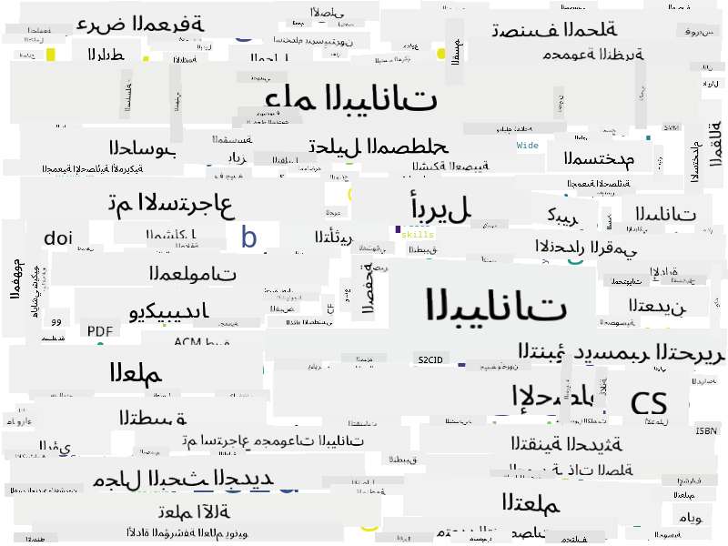

<!--
CO_OP_TRANSLATOR_METADATA:
{
  "original_hash": "2583a9894af7123b2fcae3376b14c035",
  "translation_date": "2025-08-27T08:58:46+00:00",
  "source_file": "1-Introduction/01-defining-data-science/README.md",
  "language_code": "ar"
}
-->
# تعريف علم البيانات

|  ](../../sketchnotes/01-Definitions.png) |
| :----------------------------------------------------------------------------------------------------: |
|              تعريف علم البيانات - _رسم توضيحي من [@nitya](https://twitter.com/nitya)_                   |

---

## [اختبار ما قبل المحاضرة](https://purple-hill-04aebfb03.1.azurestaticapps.net/quiz/0)

## ما هو البيانات؟
في حياتنا اليومية، نحن محاطون دائمًا بالبيانات. النص الذي تقرأه الآن هو بيانات. قائمة أرقام هواتف أصدقائك في هاتفك الذكي هي بيانات، وكذلك الوقت الحالي المعروض على ساعتك. كبشر، نحن نتعامل مع البيانات بشكل طبيعي من خلال عد النقود التي لدينا أو كتابة رسائل لأصدقائنا.

ومع ذلك، أصبحت البيانات أكثر أهمية مع ظهور الحواسيب. الدور الأساسي للحواسيب هو إجراء العمليات الحسابية، لكنها تحتاج إلى بيانات للعمل عليها. لذلك، نحن بحاجة إلى فهم كيفية تخزين ومعالجة الحواسيب للبيانات.

مع ظهور الإنترنت، زاد دور الحواسيب كأجهزة للتعامل مع البيانات. إذا فكرت في الأمر، نحن الآن نستخدم الحواسيب بشكل متزايد لمعالجة البيانات والتواصل بدلاً من العمليات الحسابية الفعلية. عندما نكتب بريدًا إلكترونيًا لصديق أو نبحث عن معلومات على الإنترنت - نحن في الأساس نقوم بإنشاء وتخزين ونقل ومعالجة البيانات.
> هل يمكنك تذكر آخر مرة استخدمت فيها الحاسوب فعليًا لإجراء عملية حسابية؟

## ما هو علم البيانات؟

في [ويكيبيديا](https://en.wikipedia.org/wiki/Data_science)، يُعرَّف **علم البيانات** بأنه *مجال علمي يستخدم الأساليب العلمية لاستخلاص المعرفة والرؤى من البيانات المنظمة وغير المنظمة، وتطبيق المعرفة والرؤى القابلة للتنفيذ من البيانات عبر مجموعة واسعة من المجالات التطبيقية*.

تُبرز هذه التعريف النقاط التالية المهمة حول علم البيانات:

* الهدف الرئيسي لعلم البيانات هو **استخلاص المعرفة** من البيانات، بمعنى آخر - **فهم** البيانات، واكتشاف العلاقات المخفية وبناء **نموذج**.
* يستخدم علم البيانات **الأساليب العلمية**، مثل الاحتمالات والإحصاء. في الواقع، عندما تم تقديم مصطلح *علم البيانات* لأول مرة، جادل البعض بأنه مجرد اسم جديد للإحصاء. ومع ذلك، أصبح من الواضح الآن أن المجال أوسع بكثير.
* يجب تطبيق المعرفة المستخلصة لإنتاج **رؤى قابلة للتنفيذ**، أي رؤى عملية يمكن تطبيقها على مواقف الأعمال الحقيقية.
* يجب أن نكون قادرين على التعامل مع البيانات **المنظمة** و**غير المنظمة**. سنعود لاحقًا في الدورة لمناقشة أنواع البيانات المختلفة.
* **مجال التطبيق** هو مفهوم مهم، وغالبًا ما يحتاج علماء البيانات إلى درجة معينة من الخبرة في مجال المشكلة، مثل: المالية، الطب، التسويق، إلخ.

> جانب آخر مهم في علم البيانات هو أنه يدرس كيفية جمع البيانات وتخزينها والعمل عليها باستخدام الحواسيب. بينما توفر الإحصائيات الأسس الرياضية، يطبق علم البيانات المفاهيم الرياضية لاستخلاص الرؤى من البيانات.

إحدى الطرق (المنسوبة إلى [جيم غراي](https://en.wikipedia.org/wiki/Jim_Gray_(computer_scientist))) للنظر إلى علم البيانات هي اعتباره نموذجًا منفصلًا للعلم:
* **تجريبي**، حيث نعتمد بشكل أساسي على الملاحظات ونتائج التجارب.
* **نظري**، حيث تنبثق المفاهيم الجديدة من المعرفة العلمية الحالية.
* **حسابي**، حيث نكتشف مبادئ جديدة بناءً على بعض التجارب الحسابية.
* **قائم على البيانات**، يعتمد على اكتشاف العلاقات والأنماط في البيانات.

## مجالات ذات صلة

نظرًا لأن البيانات موجودة في كل مكان، فإن علم البيانات نفسه مجال واسع يتداخل مع العديد من التخصصات الأخرى.

## أنواع البيانات

كما ذكرنا سابقًا، البيانات موجودة في كل مكان. نحن فقط بحاجة إلى التقاطها بالطريقة الصحيحة! من المفيد التمييز بين البيانات **المنظمة** و**غير المنظمة**. الأولى تمثل عادةً في شكل منظم جيدًا، غالبًا كجدول أو عدد من الجداول، بينما الثانية هي مجرد مجموعة من الملفات. أحيانًا يمكننا أيضًا الحديث عن البيانات **شبه المنظمة**، التي تحتوي على نوع من الهيكل الذي قد يختلف بشكل كبير.

| منظمة                                                                      | شبه منظمة                                                                                     | غير منظمة                              |
| -------------------------------------------------------------------------- | -------------------------------------------------------------------------------------------- | ------------------------------------- |
| قائمة بأسماء الأشخاص وأرقام هواتفهم                                       | صفحات ويكيبيديا مع روابط                                                                     | نص موسوعة بريتانيكا                  |
| درجة الحرارة في جميع غرف مبنى كل دقيقة خلال العشرين عامًا الماضية          | مجموعة من الأوراق العلمية بصيغة JSON تحتوي على المؤلفين، تاريخ النشر، والملخص               | ملفات مشتركة تحتوي على مستندات الشركة |
| بيانات العمر والجنس لجميع الأشخاص الذين يدخلون المبنى                     | صفحات الإنترنت                                                                               | فيديو خام من كاميرا مراقبة            |

## من أين تحصل على البيانات

هناك العديد من المصادر الممكنة للبيانات، ومن المستحيل سردها جميعًا! ومع ذلك، دعونا نذكر بعض الأماكن النموذجية التي يمكنك الحصول على البيانات منها:

* **منظمة**
  - **إنترنت الأشياء** (IoT)، بما في ذلك البيانات من أجهزة الاستشعار المختلفة، مثل مستشعرات الحرارة أو الضغط، يوفر الكثير من البيانات المفيدة. على سبيل المثال، إذا كان مبنى مكتبي مجهزًا بأجهزة استشعار IoT، يمكننا التحكم تلقائيًا في التدفئة والإضاءة لتقليل التكاليف.
  - **الاستطلاعات** التي نطلب من المستخدمين إكمالها بعد عملية شراء، أو بعد زيارة موقع ويب.
  - **تحليل السلوك** يمكن أن يساعدنا، على سبيل المثال، في فهم مدى تعمق المستخدم في الموقع، وما هو السبب النموذجي لمغادرة الموقع.
* **غير منظمة**
  - **النصوص** يمكن أن تكون مصدرًا غنيًا للرؤى، مثل **درجة الشعور العام**، أو استخراج الكلمات الرئيسية والمعاني الدلالية.
  - **الصور** أو **الفيديو**. يمكن استخدام فيديو من كاميرا مراقبة لتقدير حركة المرور على الطريق، وإبلاغ الناس بالاختناقات المرورية المحتملة.
  - **سجلات خوادم الويب** يمكن استخدامها لفهم الصفحات الأكثر زيارة على موقعنا، ومدة البقاء فيها.
* **شبه منظمة**
  - **رسوم الشبكات الاجتماعية** يمكن أن تكون مصادر رائعة للبيانات حول شخصيات المستخدمين والفعالية المحتملة في نشر المعلومات.
  - عندما يكون لدينا مجموعة من الصور من حفلة، يمكننا محاولة استخراج بيانات **ديناميكيات المجموعة** من خلال بناء رسم بياني للأشخاص الذين يلتقطون الصور مع بعضهم البعض.

من خلال معرفة المصادر المختلفة للبيانات، يمكنك التفكير في سيناريوهات مختلفة حيث يمكن تطبيق تقنيات علم البيانات لفهم الوضع بشكل أفضل وتحسين العمليات التجارية.

## ما الذي يمكنك فعله بالبيانات

في علم البيانات، نركز على الخطوات التالية في رحلة البيانات:

بالطبع، اعتمادًا على البيانات الفعلية، قد تكون بعض الخطوات مفقودة (مثل عندما تكون البيانات موجودة بالفعل في قاعدة البيانات، أو عندما لا نحتاج إلى تدريب نموذج)، أو قد تتكرر بعض الخطوات عدة مرات (مثل معالجة البيانات).

## الرقمنة والتحول الرقمي

في العقد الأخير، بدأت العديد من الشركات في فهم أهمية البيانات عند اتخاذ قرارات الأعمال. لتطبيق مبادئ علم البيانات على إدارة الأعمال، يجب أولاً جمع بعض البيانات، أي ترجمة العمليات التجارية إلى شكل رقمي. يُعرف هذا بـ **الرقمنة**. يمكن أن يؤدي تطبيق تقنيات علم البيانات على هذه البيانات لتوجيه القرارات إلى زيادات كبيرة في الإنتاجية (أو حتى تحول في الأعمال)، يُطلق عليه **التحول الرقمي**.

دعونا نأخذ مثالًا. لنفترض أن لدينا دورة علم بيانات (مثل هذه) نقدمها عبر الإنترنت للطلاب، ونريد استخدام علم البيانات لتحسينها. كيف يمكننا القيام بذلك؟

يمكننا البدء بسؤال "ما الذي يمكن رقمنته؟" أبسط طريقة ستكون قياس الوقت الذي يستغرقه كل طالب لإكمال كل وحدة، وقياس المعرفة المكتسبة من خلال إعطاء اختبار متعدد الخيارات في نهاية كل وحدة. من خلال حساب متوسط الوقت اللازم للإكمال عبر جميع الطلاب، يمكننا معرفة الوحدات التي تسبب أكبر صعوبة للطلاب والعمل على تبسيطها.
قد تجادل بأن هذه الطريقة ليست مثالية، لأن الوحدات يمكن أن تكون بأطوال مختلفة. ربما يكون من الأكثر إنصافًا تقسيم الوقت على طول الوحدة (بعدد الأحرف)، ومقارنة تلك القيم بدلاً من ذلك.
عندما نبدأ في تحليل نتائج اختبارات الاختيار المتعدد، يمكننا محاولة تحديد المفاهيم التي يجد الطلاب صعوبة في فهمها، واستخدام تلك المعلومات لتحسين المحتوى. للقيام بذلك، نحتاج إلى تصميم الاختبارات بطريقة تجعل كل سؤال يرتبط بمفهوم معين أو جزء من المعرفة.

إذا أردنا أن نكون أكثر تعقيدًا، يمكننا رسم الوقت المستغرق لكل وحدة دراسية مقابل الفئة العمرية للطلاب. قد نكتشف أن بعض الفئات العمرية تستغرق وقتًا طويلًا بشكل غير مناسب لإكمال الوحدة، أو أن الطلاب ينسحبون قبل إكمالها. يمكن أن يساعدنا هذا في تقديم توصيات عمرية للوحدة وتقليل عدم رضا الناس الناتج عن التوقعات الخاطئة.

## 🚀 التحدي

في هذا التحدي، سنحاول العثور على المفاهيم ذات الصلة بمجال علم البيانات من خلال النظر في النصوص. سنأخذ مقالة من ويكيبيديا عن علم البيانات، نقوم بتنزيل النص ومعالجته، ثم نبني سحابة كلمات مثل هذه:

قم بزيارة [`notebook.ipynb`](../../../../../../../../../1-Introduction/01-defining-data-science/notebook.ipynb ':ignore') لقراءة الكود. يمكنك أيضًا تشغيل الكود ومشاهدة كيفية تنفيذ جميع تحويلات البيانات في الوقت الفعلي.

> إذا كنت لا تعرف كيفية تشغيل الكود في Jupyter Notebook، ألقِ نظرة على [هذه المقالة](https://soshnikov.com/education/how-to-execute-notebooks-from-github/).

## [اختبار ما بعد المحاضرة](https://purple-hill-04aebfb03.1.azurestaticapps.net/quiz/1)

## المهام

* **المهمة 1**: قم بتعديل الكود أعلاه للعثور على المفاهيم ذات الصلة بمجالي **البيانات الضخمة** و **تعلم الآلة**  
* **المهمة 2**: [فكر في سيناريوهات علم البيانات](assignment.md)

## الشكر

تم تأليف هذا الدرس بكل ♥️ بواسطة [Dmitry Soshnikov](http://soshnikov.com)

---

**إخلاء المسؤولية**:  
تمت ترجمة هذا المستند باستخدام خدمة الترجمة الآلية [Co-op Translator](https://github.com/Azure/co-op-translator). بينما نسعى لتحقيق الدقة، يرجى العلم أن الترجمات الآلية قد تحتوي على أخطاء أو معلومات غير دقيقة. يجب اعتبار المستند الأصلي بلغته الأصلية هو المصدر الموثوق. للحصول على معلومات حساسة أو هامة، يُوصى بالاستعانة بترجمة بشرية احترافية. نحن غير مسؤولين عن أي سوء فهم أو تفسيرات خاطئة تنشأ عن استخدام هذه الترجمة.