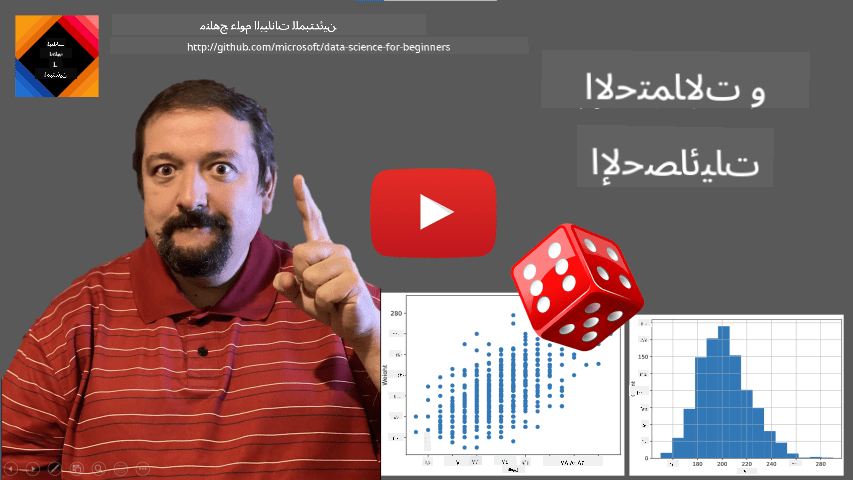
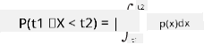
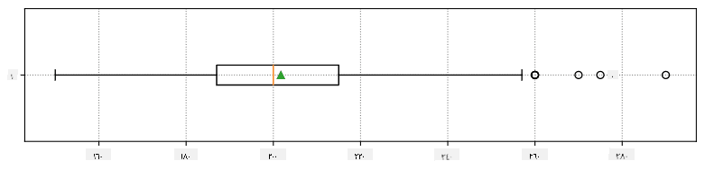
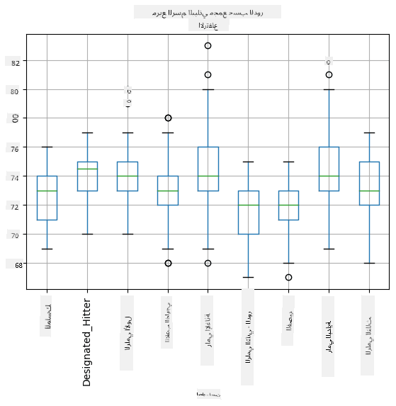
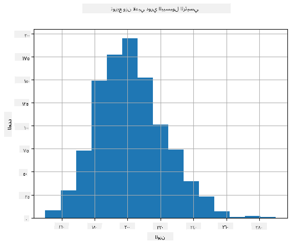
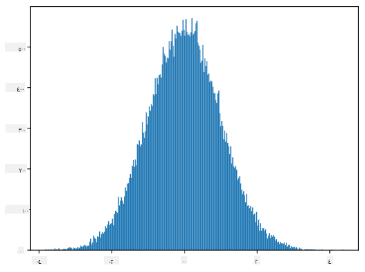
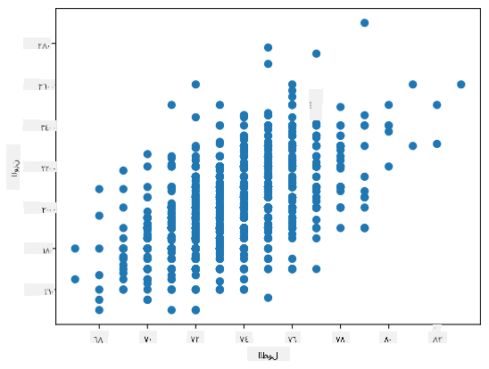

<!--
CO_OP_TRANSLATOR_METADATA:
{
  "original_hash": "8bbb3fa0d4ad61384a3b4b5f7560226f",
  "translation_date": "2025-09-04T15:50:14+00:00",
  "source_file": "1-Introduction/04-stats-and-probability/README.md",
  "language_code": "ar"
}
-->
# مقدمة مختصرة للإحصاء والاحتمالات

|](../../sketchnotes/04-Statistics-Probability.png)|
|:---:|
| الإحصاء والاحتمالات - _رسم توضيحي من [@nitya](https://twitter.com/nitya)_ |

نظرية الإحصاء والاحتمالات هما مجالان مترابطان في الرياضيات ولهما أهمية كبيرة في علم البيانات. يمكن العمل مع البيانات دون معرفة عميقة بالرياضيات، ولكن من الأفضل دائمًا معرفة بعض المفاهيم الأساسية. هنا سنقدم مقدمة قصيرة لمساعدتك على البدء.

[](https://youtu.be/Z5Zy85g4Yjw)

## [اختبار ما قبل المحاضرة](https://purple-hill-04aebfb03.1.azurestaticapps.net/quiz/6)

## الاحتمالات والمتغيرات العشوائية

**الاحتمال** هو رقم بين 0 و1 يعبر عن مدى احتمال حدوث **حدث** معين. يتم تعريفه على أنه عدد النتائج الإيجابية (التي تؤدي إلى الحدث) مقسومًا على إجمالي عدد النتائج، بشرط أن تكون جميع النتائج متساوية الاحتمال. على سبيل المثال، عند رمي النرد، فإن احتمال الحصول على رقم زوجي هو 3/6 = 0.5.

عند الحديث عن الأحداث، نستخدم **المتغيرات العشوائية**. على سبيل المثال، المتغير العشوائي الذي يمثل الرقم الناتج عند رمي النرد يأخذ القيم من 1 إلى 6. مجموعة الأرقام من 1 إلى 6 تُسمى **فضاء العينة**. يمكننا الحديث عن احتمال أن يأخذ المتغير العشوائي قيمة معينة، مثل P(X=3)=1/6.

المتغير العشوائي في المثال السابق يُسمى **متغيرًا منفصلًا**، لأنه يحتوي على فضاء عينة قابل للعد، أي أن هناك قيمًا منفصلة يمكن تعدادها. هناك حالات يكون فيها فضاء العينة عبارة عن نطاق من الأعداد الحقيقية، أو مجموعة الأعداد الحقيقية بأكملها. تُسمى هذه المتغيرات **متصلة**. مثال جيد على ذلك هو وقت وصول الحافلة.

## توزيع الاحتمالات

في حالة المتغيرات العشوائية المنفصلة، من السهل وصف احتمال كل حدث باستخدام دالة P(X). لكل قيمة *s* من فضاء العينة *S*، تعطي الدالة رقمًا بين 0 و1، بحيث يكون مجموع جميع قيم P(X=s) لجميع الأحداث يساوي 1.

أشهر توزيع منفصل هو **التوزيع المنتظم**، حيث يكون هناك فضاء عينة يحتوي على N عنصرًا، مع احتمال متساوٍ 1/N لكل منها.

من الصعب وصف توزيع الاحتمالات لمتغير متصل، حيث تكون القيم مأخوذة من نطاق معين [a,b]، أو مجموعة الأعداد الحقيقية ℝ. فكر في حالة وقت وصول الحافلة. في الواقع، بالنسبة لكل وقت وصول محدد *t*، فإن احتمال وصول الحافلة في ذلك الوقت بالضبط هو 0!

> الآن تعرف أن الأحداث ذات الاحتمال 0 تحدث، وغالبًا ما تحدث! على الأقل في كل مرة تصل فيها الحافلة!

يمكننا فقط الحديث عن احتمال وقوع المتغير في نطاق معين من القيم، مثل P(t<sub>1</sub>≤X<t<sub>2</sub>). في هذه الحالة، يتم وصف توزيع الاحتمالات بواسطة **دالة كثافة الاحتمال** p(x)، بحيث:



النظير المتصل للتوزيع المنتظم يُسمى **التوزيع المنتظم المتصل**، والذي يتم تعريفه على نطاق محدود. احتمال وقوع القيمة X في نطاق طوله l يتناسب مع l، ويصل إلى 1.

توزيع آخر مهم هو **التوزيع الطبيعي**، والذي سنتحدث عنه بمزيد من التفصيل أدناه.

## المتوسط، التباين والانحراف المعياري

افترض أننا أخذنا سلسلة من n عينات لمتغير عشوائي X: x<sub>1</sub>, x<sub>2</sub>, ..., x<sub>n</sub>. يمكننا تعريف **المتوسط** (أو **المتوسط الحسابي**) للسلسلة بالطريقة التقليدية كالتالي: (x<sub>1</sub>+x<sub>2</sub>+...+x<sub>n</sub>)/n. مع زيادة حجم العينة (أي أخذ الحد عندما n→∞)، نحصل على المتوسط (ويُسمى أيضًا **التوقع**) للتوزيع. نرمز للتوقع بـ **E**(x).

> يمكن إثبات أنه لأي توزيع منفصل بقيم {x<sub>1</sub>, x<sub>2</sub>, ..., x<sub>N</sub>} واحتمالات مقابلة p<sub>1</sub>, p<sub>2</sub>, ..., p<sub>N</sub>، فإن التوقع يساوي E(X)=x<sub>1</sub>p<sub>1</sub>+x<sub>2</sub>p<sub>2</sub>+...+x<sub>N</sub>p<sub>N</sub>.

لحساب مدى تشتت القيم، يمكننا حساب التباين σ<sup>2</sup> = ∑(x<sub>i</sub> - μ)<sup>2</sup>/n، حيث μ هو متوسط السلسلة. القيمة σ تُسمى **الانحراف المعياري**، وσ<sup>2</sup> تُسمى **التباين**.

## النمط، الوسيط والرباعيات

في بعض الأحيان، لا يمثل المتوسط القيمة "النموذجية" للبيانات بشكل كافٍ. على سبيل المثال، عندما تكون هناك بعض القيم المتطرفة التي تكون خارج النطاق تمامًا، فإنها قد تؤثر على المتوسط. مؤشر جيد آخر هو **الوسيط**، وهو القيمة التي تكون نصف النقاط أقل منها والنصف الآخر أعلى منها.

لفهم توزيع البيانات، من المفيد الحديث عن **الرباعيات**:

* الربعية الأولى، أو Q1، هي القيمة التي تقع 25% من البيانات أسفلها.
* الربعية الثالثة، أو Q3، هي القيمة التي تقع 75% من البيانات أسفلها.

يمكننا تمثيل العلاقة بين الوسيط والرباعيات بيانيًا في مخطط يُسمى **الصندوق**:


هنا نحسب أيضًا **النطاق بين الرباعيات** IQR=Q3-Q1، وما يُسمى **القيم المتطرفة** - وهي القيم التي تقع خارج الحدود [Q1-1.5*IQR,Q3+1.5*IQR].

بالنسبة للتوزيع المحدود الذي يحتوي على عدد صغير من القيم الممكنة، فإن القيمة "النموذجية" الجيدة هي الأكثر تكرارًا، والتي تُسمى **النمط**. غالبًا ما يُطبق النمط على البيانات الفئوية، مثل الألوان. فكر في حالة وجود مجموعتين من الأشخاص - بعضهم يفضل اللون الأحمر بشدة، والآخرون يفضلون الأزرق. إذا قمنا بترميز الألوان بأرقام، فإن المتوسط للقيمة المفضلة سيكون في نطاق البرتقالي-الأخضر، وهو ما لا يعكس التفضيل الفعلي لأي من المجموعتين. ومع ذلك، سيكون النمط إما أحد اللونين، أو كلاهما إذا كان عدد الأشخاص الذين يفضلونهما متساويًا (في هذه الحالة نسمي العينة **متعددة الأنماط**).

## البيانات الواقعية

عند تحليل البيانات من الحياة الواقعية، غالبًا ما لا تكون متغيرات عشوائية بالمعنى الدقيق، بمعنى أننا لا نجري تجارب بنتائج غير معروفة. على سبيل المثال، فكر في فريق من لاعبي البيسبول وبيانات أجسامهم، مثل الطول، الوزن، والعمر. هذه الأرقام ليست عشوائية تمامًا، ولكن يمكننا تطبيق نفس المفاهيم الرياضية. على سبيل المثال، يمكن اعتبار سلسلة أوزان الأشخاص سلسلة من القيم المأخوذة من متغير عشوائي. أدناه سلسلة أوزان لاعبي بيسبول حقيقيين من [دوري البيسبول الرئيسي](http://mlb.mlb.com/index.jsp)، مأخوذة من [هذا المصدر](http://wiki.stat.ucla.edu/socr/index.php/SOCR_Data_MLB_HeightsWeights) (لراحتك، تم عرض أول 20 قيمة فقط):

```
[180.0, 215.0, 210.0, 210.0, 188.0, 176.0, 209.0, 200.0, 231.0, 180.0, 188.0, 180.0, 185.0, 160.0, 180.0, 185.0, 197.0, 189.0, 185.0, 219.0]
```

> **ملاحظة**: لرؤية مثال على العمل مع هذه البيانات، ألقِ نظرة على [دفتر الملاحظات المرافق](notebook.ipynb). هناك أيضًا عدد من التحديات في هذا الدرس، ويمكنك إكمالها بإضافة بعض الأكواد إلى ذلك الدفتر. إذا لم تكن متأكدًا من كيفية العمل مع البيانات، فلا تقلق - سنعود إلى العمل مع البيانات باستخدام Python لاحقًا. إذا كنت لا تعرف كيفية تشغيل الأكواد في Jupyter Notebook، ألقِ نظرة على [هذا المقال](https://soshnikov.com/education/how-to-execute-notebooks-from-github/).

هنا مخطط الصندوق الذي يوضح المتوسط، الوسيط، والرباعيات لبياناتنا:



نظرًا لأن بياناتنا تحتوي على معلومات حول **أدوار** اللاعبين المختلفة، يمكننا أيضًا إنشاء مخطط الصندوق حسب الدور - مما يسمح لنا بفهم كيفية اختلاف قيم المعايير عبر الأدوار. هذه المرة سننظر في الطول:



يشير هذا المخطط إلى أن متوسط طول لاعبي القاعدة الأولى أعلى من متوسط طول لاعبي القاعدة الثانية. لاحقًا في هذا الدرس، سنتعلم كيفية اختبار هذه الفرضية بشكل أكثر رسمية، وكيفية إثبات أن بياناتنا ذات دلالة إحصائية.

> عند العمل مع البيانات الواقعية، نفترض أن جميع النقاط هي عينات مأخوذة من توزيع احتمالي معين. هذا الافتراض يسمح لنا بتطبيق تقنيات التعلم الآلي وبناء نماذج تنبؤية فعالة.

لرؤية توزيع بياناتنا، يمكننا رسم مخطط يُسمى **الهيستوجرام**. يمثل المحور X عدد الفواصل الزمنية المختلفة للوزن (ما يُسمى **الصناديق**)، ويمثل المحور العمودي عدد مرات وقوع العينة داخل كل فاصل.



من هذا الهيستوجرام، يمكنك أن ترى أن جميع القيم تتمركز حول متوسط وزن معين، وكلما ابتعدنا عن هذا الوزن، قل عدد الأوزان التي تقع في هذا النطاق. أي أن احتمال أن يكون وزن لاعب البيسبول مختلفًا جدًا عن الوزن المتوسط منخفض جدًا. يوضح التباين مدى احتمال اختلاف الأوزان عن المتوسط.

> إذا أخذنا أوزان أشخاص آخرين، ليسوا من دوري البيسبول، فمن المحتمل أن يكون التوزيع مختلفًا. ومع ذلك، فإن شكل التوزيع سيكون نفسه، ولكن المتوسط والتباين سيتغيران. لذا، إذا قمنا بتدريب نموذجنا على لاعبي البيسبول، فمن المحتمل أن يعطي نتائج خاطئة عند تطبيقه على طلاب جامعة، لأن التوزيع الأساسي مختلف.

## التوزيع الطبيعي

التوزيع الذي رأيناه أعلاه للأوزان شائع جدًا، والعديد من القياسات من العالم الواقعي تتبع نفس النوع من التوزيع، ولكن بمتوسط وتباين مختلفين. يُسمى هذا التوزيع **التوزيع الطبيعي**، وله دور مهم جدًا في الإحصاء.

استخدام التوزيع الطبيعي هو الطريقة الصحيحة لتوليد أوزان عشوائية للاعبي البيسبول المحتملين. بمجرد أن نعرف متوسط الوزن `mean` والانحراف المعياري `std`، يمكننا توليد 1000 عينة وزن بالطريقة التالية:
```python
samples = np.random.normal(mean,std,1000)
```

إذا قمنا برسم الهيستوجرام للعينات المولدة، سنرى صورة مشابهة جدًا لما هو موضح أعلاه. وإذا زدنا عدد العينات وعدد الصناديق، يمكننا توليد صورة للتوزيع الطبيعي أقرب إلى المثالية:



*توزيع طبيعي بمتوسط=0 وانحراف معياري=1*

## فترات الثقة

عند الحديث عن أوزان لاعبي البيسبول، نفترض أن هناك **متغير عشوائي W** يمثل التوزيع الاحتمالي المثالي لأوزان جميع لاعبي البيسبول (ما يُسمى **المجتمع**). سلسلتنا من الأوزان تمثل عينة فرعية من جميع لاعبي البيسبول، والتي نسميها **العينة**. السؤال المثير للاهتمام هو: هل يمكننا معرفة معلمات توزيع W، أي متوسط وتباين المجتمع؟

الإجابة الأسهل ستكون حساب المتوسط والتباين لعينة البيانات الخاصة بنا. ومع ذلك، قد يحدث أن العينة العشوائية الخاصة بنا لا تمثل المجتمع بشكل دقيق. لذلك، من المنطقي الحديث عن **فترات الثقة**.
> **فترة الثقة** هي تقدير المتوسط الحقيقي للمجتمع بناءً على العينة التي لدينا، والتي تكون دقيقة ضمن احتمال معين (أو **مستوى الثقة**).
نفترض أن لدينا عينة X<sub>1</sub>, ..., X<sub>n</sub> من التوزيع الخاص بنا. في كل مرة نسحب عينة من التوزيع، نحصل على قيمة متوسط مختلفة μ. لذلك يمكن اعتبار μ متغيرًا عشوائيًا. **فترة الثقة** بمستوى ثقة p هي زوج من القيم (L<sub>p</sub>,R<sub>p</sub>) بحيث **P**(L<sub>p</sub>≤μ≤R<sub>p</sub>) = p، أي أن احتمال وقوع قيمة المتوسط المقاسة داخل الفترة يساوي p.

يتجاوز هذا المقدمة القصيرة مناقشة كيفية حساب تلك الفترات بالتفصيل. يمكن العثور على المزيد من التفاصيل [على ويكيبيديا](https://en.wikipedia.org/wiki/Confidence_interval). باختصار، نحدد توزيع متوسط العينة المحسوب بالنسبة إلى المتوسط الحقيقي للسكان، والذي يُطلق عليه **توزيع الطالب**.

> **معلومة مثيرة للاهتمام**: تم تسمية توزيع الطالب نسبةً إلى عالم الرياضيات ويليام سيلي جوسيت، الذي نشر ورقته تحت اسم مستعار "Student". كان يعمل في مصنع جينيس للبيرة، ووفقًا لإحدى الروايات، لم يرغب صاحب العمل في أن يعرف الجمهور العام أنهم يستخدمون الاختبارات الإحصائية لتحديد جودة المواد الخام.

إذا أردنا تقدير المتوسط μ للسكان بمستوى ثقة p، نحتاج إلى أخذ *(1-p)/2-th percentile* من توزيع الطالب A، والذي يمكن أخذه إما من الجداول أو حسابه باستخدام بعض الوظائف المدمجة في برامج الإحصاء (مثل Python، R، إلخ). ثم تُعطى الفترة لـ μ بواسطة X±A*D/√n، حيث X هو المتوسط المحصل عليه للعينة، وD هو الانحراف المعياري.

> **ملاحظة**: نتجنب أيضًا مناقشة مفهوم مهم وهو [درجات الحرية](https://en.wikipedia.org/wiki/Degrees_of_freedom_(statistics))، والذي له أهمية فيما يتعلق بتوزيع الطالب. يمكنك الرجوع إلى كتب أكثر شمولًا في الإحصاء لفهم هذا المفهوم بشكل أعمق.

مثال على حساب فترة الثقة للأوزان والطول موجود في [دفاتر الملاحظات المرفقة](notebook.ipynb).

| p | متوسط الوزن |
|-----|-----------|
| 0.85 | 201.73±0.94 |
| 0.90 | 201.73±1.08 |
| 0.95 | 201.73±1.28 |

لاحظ أنه كلما زادت احتمالية الثقة، زادت عرض فترة الثقة.

## اختبار الفرضيات

في مجموعة بيانات لاعبي البيسبول، هناك أدوار مختلفة للاعبين يمكن تلخيصها أدناه (انظر إلى [دفتر الملاحظات المرفق](notebook.ipynb) لمعرفة كيفية حساب هذا الجدول):

| الدور | الطول | الوزن | العدد |
|------|--------|--------|-------|
| الماسك | 72.723684 | 204.328947 | 76 |
| الضارب المعين | 74.222222 | 220.888889 | 18 |
| القاعدة الأولى | 74.000000 | 213.109091 | 55 |
| اللاعب الخارجي | 73.010309 | 199.113402 | 194 |
| الرامي الاحتياطي | 74.374603 | 203.517460 | 315 |
| القاعدة الثانية | 71.362069 | 184.344828 | 58 |
| اللاعب القصير | 71.903846 | 182.923077 | 52 |
| الرامي الأساسي | 74.719457 | 205.163636 | 221 |
| القاعدة الثالثة | 73.044444 | 200.955556 | 45 |

يمكننا ملاحظة أن متوسط أطوال لاعبي القاعدة الأولى أعلى من لاعبي القاعدة الثانية. لذلك قد نميل إلى استنتاج أن **لاعبي القاعدة الأولى أطول من لاعبي القاعدة الثانية**.

> يُطلق على هذا البيان **فرضية**، لأننا لا نعرف ما إذا كانت الحقيقة صحيحة بالفعل أم لا.

ومع ذلك، ليس من الواضح دائمًا ما إذا كان يمكننا التوصل إلى هذا الاستنتاج. من المناقشة أعلاه نعلم أن لكل متوسط فترة ثقة مرتبطة، وبالتالي قد يكون هذا الفرق مجرد خطأ إحصائي. نحتاج إلى طريقة أكثر رسمية لاختبار فرضيتنا.

دعونا نحسب فترات الثقة بشكل منفصل لأطوال لاعبي القاعدة الأولى والثانية:

| الثقة | لاعبو القاعدة الأولى | لاعبو القاعدة الثانية |
|------------|---------------|----------------|
| 0.85 | 73.62..74.38 | 71.04..71.69 |
| 0.90 | 73.56..74.44 | 70.99..71.73 |
| 0.95 | 73.47..74.53 | 70.92..71.81 |

يمكننا أن نرى أنه تحت أي مستوى ثقة لا تتداخل الفترات. وهذا يثبت فرضيتنا أن لاعبي القاعدة الأولى أطول من لاعبي القاعدة الثانية.

بشكل أكثر رسمية، المشكلة التي نحلها هي معرفة ما إذا كانت **توزيعات احتمالية اثنين هي نفسها**، أو على الأقل لها نفس المعلمات. اعتمادًا على التوزيع، نحتاج إلى استخدام اختبارات مختلفة لذلك. إذا كنا نعلم أن توزيعاتنا طبيعية، يمكننا تطبيق **[اختبار الطالب t](https://en.wikipedia.org/wiki/Student%27s_t-test)**.

في اختبار الطالب t، نحسب ما يُسمى **t-value**، الذي يشير إلى الفرق بين المتوسطات مع الأخذ في الاعتبار التباين. يتم إثبات أن t-value يتبع **توزيع الطالب**، مما يسمح لنا بالحصول على قيمة العتبة لمستوى الثقة **p** (يمكن حساب ذلك أو العثور عليه في الجداول العددية). ثم نقارن t-value بهذه العتبة لقبول أو رفض الفرضية.

في Python، يمكننا استخدام حزمة **SciPy**، التي تتضمن وظيفة `ttest_ind` (بالإضافة إلى العديد من الوظائف الإحصائية المفيدة الأخرى!). تقوم هذه الوظيفة بحساب t-value لنا، وأيضًا تقوم بالبحث العكسي لقيمة الثقة p، بحيث يمكننا فقط النظر إلى الثقة لاستخلاص الاستنتاج.

على سبيل المثال، مقارنة أطوال لاعبي القاعدة الأولى والثانية تعطينا النتائج التالية:
```python
from scipy.stats import ttest_ind

tval, pval = ttest_ind(df.loc[df['Role']=='First_Baseman',['Height']], df.loc[df['Role']=='Designated_Hitter',['Height']],equal_var=False)
print(f"T-value = {tval[0]:.2f}\nP-value: {pval[0]}")
```
```
T-value = 7.65
P-value: 9.137321189738925e-12
```
في حالتنا، قيمة p منخفضة جدًا، مما يعني أن هناك دليل قوي يدعم أن لاعبي القاعدة الأولى أطول.

هناك أيضًا أنواع أخرى من الفرضيات التي قد نرغب في اختبارها، على سبيل المثال:
* إثبات أن عينة معينة تتبع توزيعًا معينًا. في حالتنا افترضنا أن الأطوال موزعة طبيعيًا، ولكن ذلك يحتاج إلى تحقق إحصائي رسمي.
* إثبات أن متوسط قيمة العينة يتوافق مع قيمة محددة مسبقًا.
* مقارنة متوسطات عدد من العينات (مثل الفرق في مستويات السعادة بين الفئات العمرية المختلفة).

## قانون الأعداد الكبيرة ونظرية الحد المركزي

أحد الأسباب التي تجعل التوزيع الطبيعي مهمًا هو ما يُعرف بـ **نظرية الحد المركزي**. نفترض أن لدينا عينة كبيرة من قيم مستقلة N X<sub>1</sub>, ..., X<sub>N</sub>، مأخوذة من أي توزيع بمتوسط μ وتباين σ<sup>2</sup>. ثم، عندما تكون N كبيرة بما فيه الكفاية (بعبارة أخرى، عندما N→∞)، فإن المتوسط Σ<sub>i</sub>X<sub>i</sub> سيكون موزعًا طبيعيًا، بمتوسط μ وتباين σ<sup>2</sup>/N.

> طريقة أخرى لتفسير نظرية الحد المركزي هي القول إنه بغض النظر عن التوزيع، عندما تحسب متوسط مجموع أي قيم متغير عشوائي، ينتهي بك الأمر بتوزيع طبيعي.

من نظرية الحد المركزي يتبع أيضًا أنه، عندما N→∞، يصبح احتمال أن يكون متوسط العينة مساويًا لـ μ يساوي 1. وهذا يُعرف بـ **قانون الأعداد الكبيرة**.

## التغاير والارتباط

أحد الأشياء التي يقوم بها علم البيانات هو إيجاد العلاقات بين البيانات. نقول إن سلسلتين **تتوافقان** عندما تظهران سلوكًا مشابهًا في نفس الوقت، أي ترتفعان/تنخفضان معًا، أو ترتفع واحدة عندما تنخفض الأخرى والعكس صحيح. بعبارة أخرى، يبدو أن هناك علاقة بين السلسلتين.

> الارتباط لا يشير بالضرورة إلى علاقة سببية بين سلسلتين؛ أحيانًا يمكن أن تعتمد كلا المتغيرين على سبب خارجي، أو يمكن أن يكون مجرد صدفة أن السلسلتين تتوافقان. ومع ذلك، فإن الارتباط الرياضي القوي هو مؤشر جيد على أن المتغيرين مرتبطان بطريقة ما.

رياضيًا، المفهوم الرئيسي الذي يظهر العلاقة بين متغيرين عشوائيين هو **التغاير**، الذي يُحسب كالتالي: Cov(X,Y) = **E**\[(X-**E**(X))(Y-**E**(Y))\]. نحسب انحراف كلا المتغيرين عن قيم المتوسط الخاصة بهما، ثم نأخذ حاصل ضرب تلك الانحرافات. إذا انحرف كلا المتغيرين معًا، سيكون حاصل الضرب دائمًا قيمة موجبة، مما يضيف إلى تغاير إيجابي. إذا انحرف كلا المتغيرين بشكل غير متزامن (أي ينخفض أحدهما عن المتوسط عندما يرتفع الآخر فوق المتوسط)، سنحصل دائمًا على أرقام سلبية، مما يضيف إلى تغاير سلبي. إذا لم تكن الانحرافات معتمدة، ستضيف إلى ما يقرب من الصفر.

القيمة المطلقة للتغاير لا تخبرنا كثيرًا عن مدى قوة الارتباط، لأنها تعتمد على حجم القيم الفعلية. لتطبيعها، يمكننا تقسيم التغاير على الانحراف المعياري لكلا المتغيرين للحصول على **الارتباط**. الشيء الجيد هو أن الارتباط دائمًا في النطاق [-1,1]، حيث يشير 1 إلى ارتباط إيجابي قوي بين القيم، و-1 إلى ارتباط سلبي قوي، و0 إلى عدم وجود ارتباط على الإطلاق (المتغيرات مستقلة).

**مثال**: يمكننا حساب الارتباط بين الأوزان والأطوال للاعبي البيسبول من مجموعة البيانات المذكورة أعلاه:
```python
print(np.corrcoef(weights,heights))
```
كنتيجة، نحصل على **مصفوفة الارتباط** مثل هذه:
```
array([[1.        , 0.52959196],
       [0.52959196, 1.        ]])
```

> يمكن حساب مصفوفة الارتباط C لأي عدد من السلاسل المدخلة S<sub>1</sub>, ..., S<sub>n</sub>. قيمة C<sub>ij</sub> هي الارتباط بين S<sub>i</sub> وS<sub>j</sub>، والعناصر القطرية دائمًا 1 (وهو أيضًا الارتباط الذاتي لـ S<sub>i</sub>).

في حالتنا، تشير القيمة 0.53 إلى وجود بعض الارتباط بين وزن وطول الشخص. يمكننا أيضًا إنشاء مخطط مبعثر لقيمة مقابل الأخرى لرؤية العلاقة بصريًا:



> يمكن العثور على المزيد من أمثلة الارتباط والتغاير في [دفتر الملاحظات المرفق](notebook.ipynb).

## الخاتمة

في هذا القسم، تعلمنا:

* الخصائص الإحصائية الأساسية للبيانات، مثل المتوسط، التباين، النمط والرباعيات
* توزيعات مختلفة للمتغيرات العشوائية، بما في ذلك التوزيع الطبيعي
* كيفية إيجاد الارتباط بين الخصائص المختلفة
* كيفية استخدام الأدوات الرياضية والإحصائية لإثبات بعض الفرضيات
* كيفية حساب فترات الثقة للمتغير العشوائي بناءً على عينة البيانات

بينما هذه ليست قائمة شاملة للمواضيع الموجودة ضمن الاحتمالات والإحصاء، يجب أن تكون كافية لتمنحك بداية جيدة في هذه الدورة.

## 🚀 التحدي

استخدم الكود الموجود في دفتر الملاحظات لاختبار فرضيات أخرى مثل:
1. لاعبو القاعدة الأولى أكبر سنًا من لاعبي القاعدة الثانية
2. لاعبو القاعدة الأولى أطول من لاعبي القاعدة الثالثة
3. اللاعبون القصيرون أطول من لاعبي القاعدة الثانية

## [اختبار ما بعد المحاضرة](https://ff-quizzes.netlify.app/en/ds/)

## المراجعة والدراسة الذاتية

الاحتمالات والإحصاء موضوع واسع يستحق دورة خاصة به. إذا كنت مهتمًا بالتعمق في النظرية، قد ترغب في متابعة قراءة بعض الكتب التالية:

1. [كارلوس فرنانديز-جراندا](https://cims.nyu.edu/~cfgranda/) من جامعة نيويورك لديه ملاحظات محاضرة رائعة [الاحتمالات والإحصاء لعلم البيانات](https://cims.nyu.edu/~cfgranda/pages/stuff/probability_stats_for_DS.pdf) (متاحة عبر الإنترنت)
1. [بيتر وأندرو بروس. الإحصاء العملي لعلماء البيانات.](https://www.oreilly.com/library/view/practical-statistics-for/9781491952955/) [[كود العينة في R](https://github.com/andrewgbruce/statistics-for-data-scientists)]. 
1. [جيمس دي ميلر. الإحصاء لعلم البيانات](https://www.packtpub.com/product/statistics-for-data-science/9781788290678) [[كود العينة في R](https://github.com/PacktPublishing/Statistics-for-Data-Science)]

## الواجب

[دراسة صغيرة عن مرض السكري](assignment.md)

## الشكر

تم تأليف هذا الدرس بحب ♥️ بواسطة [ديمتري سوشنيكوف](http://soshnikov.com)

---

**إخلاء المسؤولية**:  
تمت ترجمة هذا المستند باستخدام خدمة الترجمة الآلية [Co-op Translator](https://github.com/Azure/co-op-translator). بينما نسعى لتحقيق الدقة، يرجى العلم أن الترجمات الآلية قد تحتوي على أخطاء أو عدم دقة. يجب اعتبار المستند الأصلي بلغته الأصلية هو المصدر الموثوق. للحصول على معلومات حساسة أو هامة، يُوصى بالاستعانة بترجمة بشرية احترافية. نحن غير مسؤولين عن أي سوء فهم أو تفسيرات خاطئة تنشأ عن استخدام هذه الترجمة.