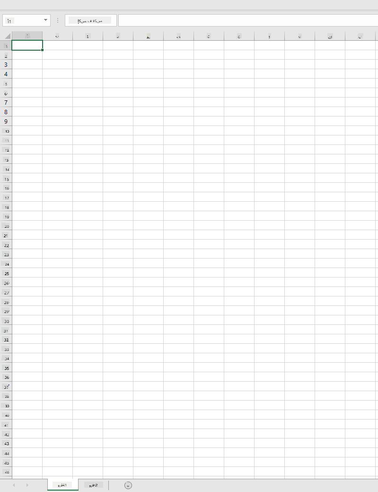
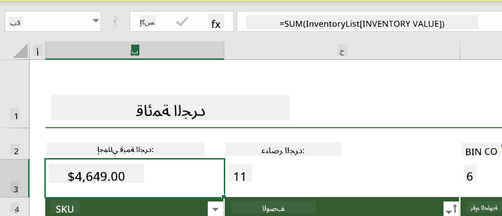
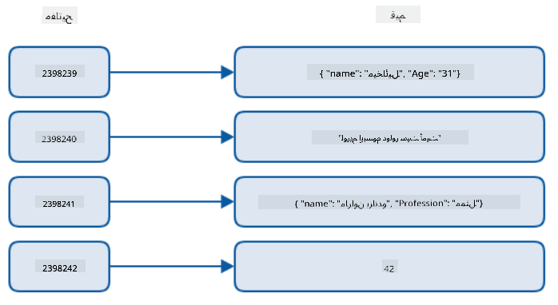
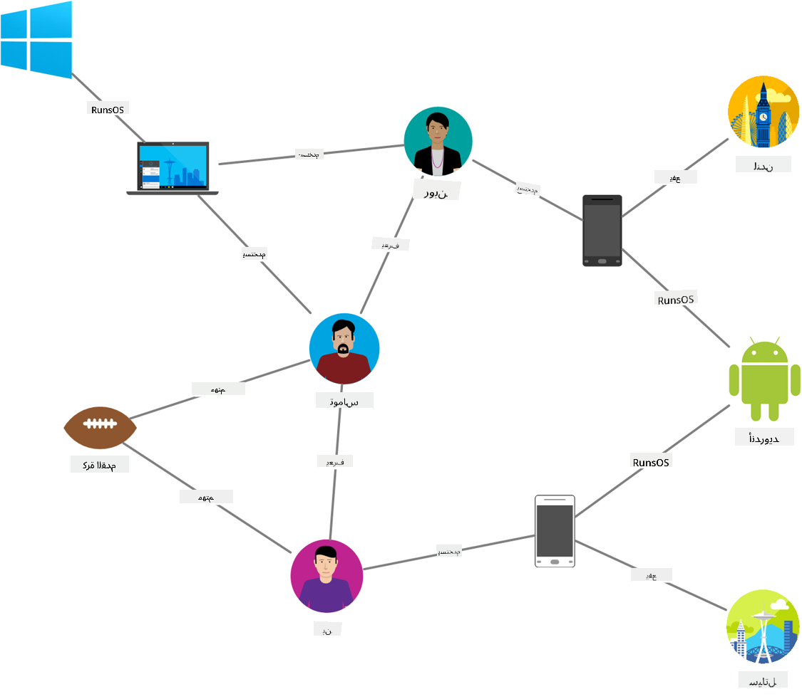
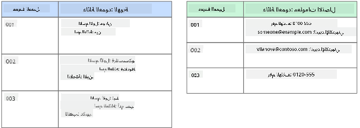
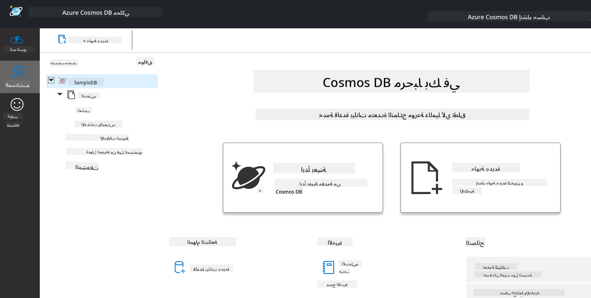
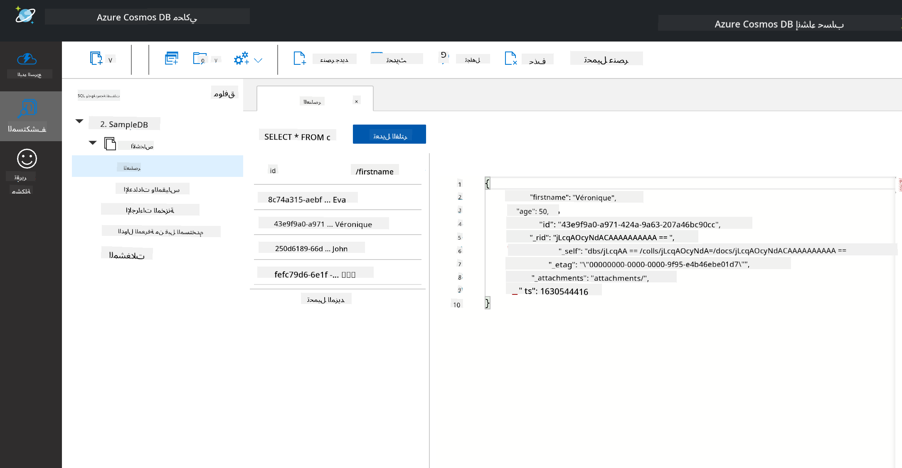
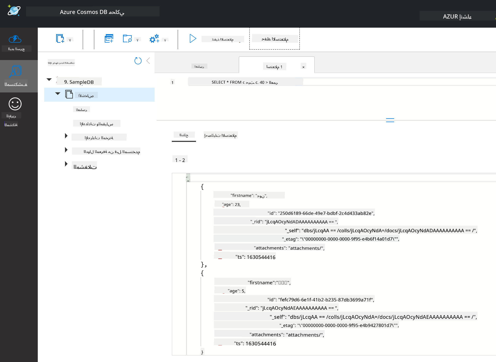

<!--
CO_OP_TRANSLATOR_METADATA:
{
  "original_hash": "32ddfef8121650f2ca2f3416fd283c37",
  "translation_date": "2025-08-27T08:38:22+00:00",
  "source_file": "2-Working-With-Data/06-non-relational/README.md",
  "language_code": "ar"
}
-->
# العمل مع البيانات: البيانات غير العلائقية

| ](../../sketchnotes/06-NoSQL.png)|
|:---:|
|العمل مع بيانات NoSQL - _رسم توضيحي من [@nitya](https://twitter.com/nitya)_ |

## [اختبار ما قبل المحاضرة](https://purple-hill-04aebfb03.1.azurestaticapps.net/quiz/10)

البيانات ليست مقتصرة على قواعد البيانات العلائقية. تركز هذه الدرس على البيانات غير العلائقية وستغطي أساسيات الجداول الإلكترونية وNoSQL.

## الجداول الإلكترونية

الجداول الإلكترونية وسيلة شائعة لتخزين واستكشاف البيانات لأنها تتطلب إعدادًا أقل للبدء. في هذا الدرس، ستتعلم المكونات الأساسية للجدول الإلكتروني، بالإضافة إلى الصيغ والدوال. سيتم توضيح الأمثلة باستخدام Microsoft Excel، ولكن معظم الأجزاء والمواضيع سيكون لها أسماء وخطوات مشابهة بالمقارنة مع برامج الجداول الإلكترونية الأخرى.



الجدول الإلكتروني هو ملف وسيكون متاحًا في نظام ملفات الكمبيوتر أو الجهاز أو نظام ملفات قائم على السحابة. قد يكون البرنامج نفسه قائمًا على المتصفح أو تطبيقًا يجب تثبيته على الكمبيوتر أو تنزيله كتطبيق. في Excel، تُعرف هذه الملفات أيضًا باسم **دفاتر العمل**، وسيتم استخدام هذا المصطلح لبقية هذا الدرس.

يحتوي دفتر العمل على ورقة عمل واحدة أو أكثر، حيث يتم تصنيف كل ورقة عمل بعلامات تبويب. داخل ورقة العمل توجد مستطيلات تُسمى **الخلايا**، والتي تحتوي على البيانات الفعلية. الخلية هي تقاطع صف وعمود، حيث يتم تصنيف الأعمدة بأحرف أبجدية والصفوف بأرقام. قد تحتوي بعض الجداول الإلكترونية على رؤوس في الصفوف القليلة الأولى لوصف البيانات في الخلية.

مع هذه العناصر الأساسية لدفتر عمل Excel، سنستخدم مثالًا من [قوالب Microsoft](https://templates.office.com/) يركز على الجرد لاستعراض بعض الأجزاء الإضافية من الجدول الإلكتروني.

### إدارة الجرد

ملف الجدول الإلكتروني المسمى "InventoryExample" هو جدول منسق للعناصر داخل الجرد يحتوي على ثلاث أوراق عمل، حيث تم تصنيف علامات التبويب بـ "قائمة الجرد"، "قائمة اختيار الجرد"، و"بحث الصناديق". الصف الرابع من ورقة العمل "قائمة الجرد" هو الرأس، الذي يصف قيمة كل خلية في عمود الرأس.


هناك حالات تعتمد فيها خلية على قيم خلايا أخرى لتوليد قيمتها. يحتفظ جدول "قائمة الجرد" بتتبع تكلفة كل عنصر في الجرد، ولكن ماذا لو احتجنا إلى معرفة قيمة كل شيء في الجرد؟ [**الصيغ**](https://support.microsoft.com/en-us/office/overview-of-formulas-34519a4e-1e8d-4f4b-84d4-d642c4f63263) تقوم بإجراء عمليات على بيانات الخلايا وتُستخدم لحساب تكلفة الجرد في هذا المثال. استخدم هذا الجدول صيغة في عمود "قيمة الجرد" لحساب قيمة كل عنصر بضرب الكمية تحت رأس QTY وتكاليفها بالخلايا تحت رأس COST. النقر المزدوج أو تمييز خلية سيظهر الصيغة. ستلاحظ أن الصيغ تبدأ بعلامة يساوي، متبوعة بالحساب أو العملية.



يمكننا استخدام صيغة أخرى لإضافة جميع قيم "قيمة الجرد" معًا للحصول على قيمتها الإجمالية. يمكن حساب ذلك بإضافة كل خلية لتوليد المجموع، ولكن ذلك قد يكون مهمة شاقة. يحتوي Excel على [**الدوال**](https://support.microsoft.com/en-us/office/sum-function-043e1c7d-7726-4e80-8f32-07b23e057f89)، أو الصيغ المعرفة مسبقًا لإجراء الحسابات على قيم الخلايا. تتطلب الدوال معطيات، وهي القيم المطلوبة لإجراء هذه الحسابات. عندما تتطلب الدوال أكثر من معطى واحد، يجب أن يتم إدراجها بترتيب معين وإلا قد لا تحسب الدالة القيمة الصحيحة. يستخدم هذا المثال دالة SUM، ويستخدم قيم "قيمة الجرد" كمعطى لإضافة المجموع المدرج تحت الصف 3، العمود B (ويُشار إليه أيضًا بـ B3).

## NoSQL

NoSQL هو مصطلح شامل للطرق المختلفة لتخزين البيانات غير العلائقية ويمكن تفسيره على أنه "غير SQL"، "غير علائقي" أو "ليس فقط SQL". يمكن تصنيف هذه الأنواع من أنظمة قواعد البيانات إلى 4 أنواع.


> المصدر من [مدونة Michał Białecki](https://www.michalbialecki.com/2018/03/18/azure-cosmos-db-key-value-database-cloud/)

[قواعد بيانات المفتاح-القيمة](https://docs.microsoft.com/en-us/azure/architecture/data-guide/big-data/non-relational-data#keyvalue-data-stores) تقترن بمفاتيح فريدة، وهي معرف فريد مرتبط بقيمة. يتم تخزين هذه الأزواج باستخدام [جدول تجزئة](https://www.hackerearth.com/practice/data-structures/hash-tables/basics-of-hash-tables/tutorial/) مع دالة تجزئة مناسبة.


> المصدر من [Microsoft](https://docs.microsoft.com/en-us/azure/cosmos-db/graph/graph-introduction#graph-database-by-example)

[قواعد بيانات الرسم البياني](https://docs.microsoft.com/en-us/azure/architecture/data-guide/big-data/non-relational-data#graph-data-stores) تصف العلاقات في البيانات ويتم تمثيلها كمجموعة من العقد والحواف. تمثل العقدة كيانًا، شيئًا موجودًا في العالم الحقيقي مثل طالب أو كشف حساب بنكي. تمثل الحواف العلاقة بين كيانين. تحتوي كل عقدة وحافة على خصائص توفر معلومات إضافية عن كل منهما.



[مخازن البيانات العمودية](https://docs.microsoft.com/en-us/azure/architecture/data-guide/big-data/non-relational-data#columnar-data-stores) تنظم البيانات في أعمدة وصفوف مثل بنية البيانات العلائقية ولكن يتم تقسيم كل عمود إلى مجموعات تُسمى عائلة الأعمدة، حيث تكون جميع البيانات تحت عمود واحد مرتبطة ويمكن استرجاعها وتغييرها كوحدة واحدة.

### مخازن بيانات المستندات مع Azure Cosmos DB

[مخازن بيانات المستندات](https://docs.microsoft.com/en-us/azure/architecture/data-guide/big-data/non-relational-data#document-data-stores) تبني على مفهوم مخزن بيانات المفتاح-القيمة وتتكون من سلسلة من الحقول والكائنات. ستستكشف هذه القسم قواعد بيانات المستندات باستخدام محاكي Cosmos DB.

قاعدة بيانات Cosmos DB تناسب تعريف "ليس فقط SQL"، حيث تعتمد قاعدة بيانات المستندات في Cosmos DB على SQL لاستعلام البيانات. يغطي [الدرس السابق](../05-relational-databases/README.md) أساسيات اللغة، وسنتمكن من تطبيق بعض الاستعلامات نفسها على قاعدة بيانات المستندات هنا. سنستخدم محاكي Cosmos DB، الذي يسمح لنا بإنشاء واستكشاف قاعدة بيانات مستندات محليًا على الكمبيوتر. اقرأ المزيد عن المحاكي [هنا](https://docs.microsoft.com/en-us/azure/cosmos-db/local-emulator?tabs=ssl-netstd21).

المستند هو مجموعة من الحقول وقيم الكائنات، حيث تصف الحقول ما تمثله قيمة الكائن. أدناه مثال على مستند.

```json
{
    "firstname": "Eva",
    "age": 44,
    "id": "8c74a315-aebf-4a16-bb38-2430a9896ce5",
    "_rid": "bHwDAPQz8s0BAAAAAAAAAA==",
    "_self": "dbs/bHwDAA==/colls/bHwDAPQz8s0=/docs/bHwDAPQz8s0BAAAAAAAAAA==/",
    "_etag": "\"00000000-0000-0000-9f95-010a691e01d7\"",
    "_attachments": "attachments/",
    "_ts": 1630544034
}
```

الحقول ذات الأهمية في هذا المستند هي: `firstname`، `id`، و`age`. الحقول الأخرى التي تحتوي على الشرطات السفلية تم إنشاؤها بواسطة Cosmos DB.

#### استكشاف البيانات باستخدام محاكي Cosmos DB

يمكنك تنزيل وتثبيت المحاكي [لنظام Windows هنا](https://aka.ms/cosmosdb-emulator). راجع هذه [الوثائق](https://docs.microsoft.com/en-us/azure/cosmos-db/local-emulator?tabs=ssl-netstd21#run-on-linux-macos) للحصول على خيارات حول كيفية تشغيل المحاكي لنظامي macOS وLinux.

يفتح المحاكي نافذة متصفح، حيث تتيح لك واجهة Explorer استكشاف المستندات.



إذا كنت تتابع، انقر على "Start with Sample" لإنشاء قاعدة بيانات نموذجية تُسمى SampleDB. إذا قمت بتوسيع SampleDB بالنقر على السهم، ستجد حاوية تُسمى `Persons`. تحتوي الحاوية على مجموعة من العناصر، وهي المستندات داخل الحاوية. يمكنك استكشاف المستندات الأربعة الفردية تحت `Items`.



#### استعلام بيانات المستندات باستخدام محاكي Cosmos DB

يمكننا أيضًا استعلام البيانات النموذجية بالنقر على زر استعلام SQL جديد (الزر الثاني من اليسار).

`SELECT * FROM c` يعيد جميع المستندات في الحاوية. لنضف شرط where ونبحث عن كل من هم أصغر من 40 عامًا.

`SELECT * FROM c where c.age < 40`



يعيد الاستعلام مستندين، لاحظ أن قيمة العمر لكل مستند أقل من 40.

#### JSON والمستندات

إذا كنت على دراية بـ JavaScript Object Notation (JSON)، ستلاحظ أن المستندات تبدو مشابهة لـ JSON. يوجد ملف `PersonsData.json` في هذا الدليل يحتوي على المزيد من البيانات التي يمكنك تحميلها إلى حاوية Persons في المحاكي عبر زر `Upload Item`.

في معظم الحالات، يمكن نقل البيانات التي تُرجعها واجهات برمجة التطبيقات (APIs) بتنسيق JSON مباشرةً وتخزينها في قواعد بيانات المستندات. أدناه مستند آخر، يمثل تغريدات من حساب Microsoft على تويتر تم استرجاعها باستخدام واجهة برمجة تطبيقات تويتر، ثم إدخالها في Cosmos DB.

```json
{
    "created_at": "2021-08-31T19:03:01.000Z",
    "id": "1432780985872142341",
    "text": "Blank slate. Like this tweet if you’ve ever painted in Microsoft Paint before. https://t.co/cFeEs8eOPK",
    "_rid": "dhAmAIUsA4oHAAAAAAAAAA==",
    "_self": "dbs/dhAmAA==/colls/dhAmAIUsA4o=/docs/dhAmAIUsA4oHAAAAAAAAAA==/",
    "_etag": "\"00000000-0000-0000-9f84-a0958ad901d7\"",
    "_attachments": "attachments/",
    "_ts": 1630537000
```

الحقول ذات الأهمية في هذا المستند هي: `created_at`، `id`، و`text`.

## 🚀 التحدي

يوجد ملف `TwitterData.json` يمكنك تحميله إلى قاعدة بيانات SampleDB. يُوصى بإضافته إلى حاوية منفصلة. يمكن القيام بذلك عن طريق:

1. النقر على زر الحاوية الجديدة في الزاوية العلوية اليمنى.
2. اختيار قاعدة البيانات الحالية (SampleDB) وإنشاء معرف للحاوية.
3. تعيين مفتاح التقسيم إلى `/id`.
4. النقر على OK (يمكنك تجاهل بقية المعلومات في هذه الواجهة لأن هذه مجموعة بيانات صغيرة تعمل محليًا على جهازك).
5. افتح الحاوية الجديدة وقم بتحميل ملف بيانات تويتر باستخدام زر `Upload Item`.

حاول تشغيل بعض استعلامات SELECT للعثور على المستندات التي تحتوي على Microsoft في حقل النص. تلميح: حاول استخدام [كلمة LIKE](https://docs.microsoft.com/en-us/azure/cosmos-db/sql/sql-query-keywords#using-like-with-the--wildcard-character).

## [اختبار ما بعد المحاضرة](https://purple-hill-04aebfb03.1.azurestaticapps.net/quiz/11)

## المراجعة والدراسة الذاتية

- هناك بعض التنسيقات والميزات الإضافية المضافة إلى هذا الجدول الإلكتروني التي لا يغطيها هذا الدرس. لدى Microsoft [مكتبة كبيرة من الوثائق والفيديوهات](https://support.microsoft.com/excel) حول Excel إذا كنت مهتمًا بتعلم المزيد.

- توضح هذه الوثائق المعمارية خصائص الأنواع المختلفة من البيانات غير العلائقية: [البيانات غير العلائقية وNoSQL](https://docs.microsoft.com/en-us/azure/architecture/data-guide/big-data/non-relational-data).

- Cosmos DB هو قاعدة بيانات غير علائقية قائمة على السحابة يمكنها أيضًا تخزين الأنواع المختلفة من NoSQL المذكورة في هذا الدرس. تعرف على المزيد حول هذه الأنواع في [وحدة تعلم Cosmos DB من Microsoft](https://docs.microsoft.com/en-us/learn/paths/work-with-nosql-data-in-azure-cosmos-db/).

## الواجب

[أرباح الصودا](assignment.md)

---

**إخلاء المسؤولية**:  
تم ترجمة هذا المستند باستخدام خدمة الترجمة بالذكاء الاصطناعي [Co-op Translator](https://github.com/Azure/co-op-translator). بينما نسعى لتحقيق الدقة، يرجى العلم أن الترجمات الآلية قد تحتوي على أخطاء أو معلومات غير دقيقة. يجب اعتبار المستند الأصلي بلغته الأصلية هو المصدر الموثوق. للحصول على معلومات حاسمة، يُوصى بالاستعانة بترجمة بشرية احترافية. نحن غير مسؤولين عن أي سوء فهم أو تفسيرات خاطئة ناتجة عن استخدام هذه الترجمة.