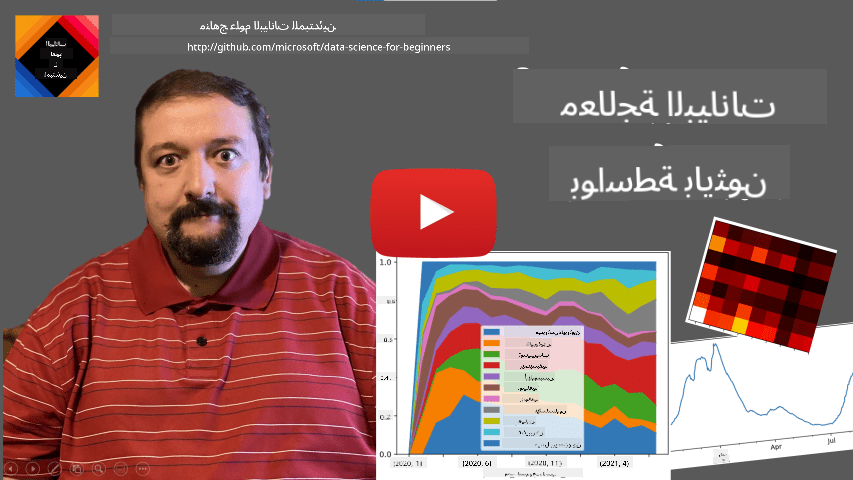
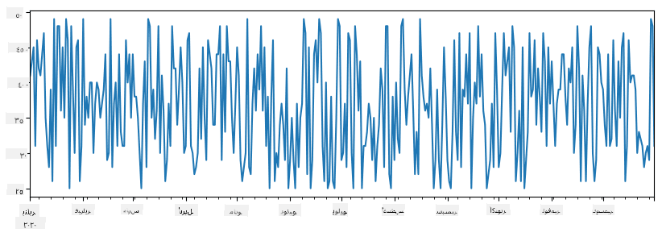
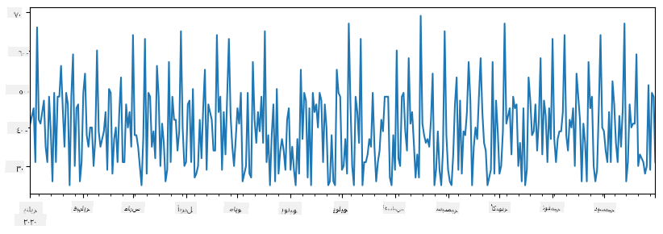
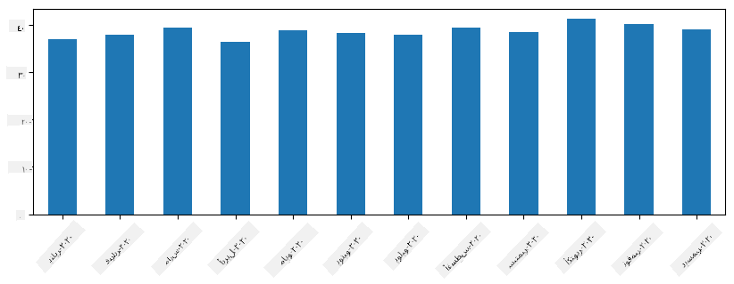
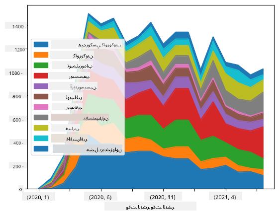

<!--
CO_OP_TRANSLATOR_METADATA:
{
  "original_hash": "7bfec050f4717dcc2dfd028aca9d21f3",
  "translation_date": "2025-09-06T15:23:39+00:00",
  "source_file": "2-Working-With-Data/07-python/README.md",
  "language_code": "ar"
}
-->
# العمل مع البيانات: بايثون ومكتبة Pandas

|  ](../../sketchnotes/07-WorkWithPython.png) |
| :-------------------------------------------------------------------------------------------------------: |
|                 العمل مع بايثون - _رسم توضيحي بواسطة [@nitya](https://twitter.com/nitya)_                 |

[](https://youtu.be/dZjWOGbsN4Y)

بينما توفر قواعد البيانات طرقًا فعالة جدًا لتخزين البيانات واستعلامها باستخدام لغات الاستعلام، فإن الطريقة الأكثر مرونة لمعالجة البيانات هي كتابة برنامج خاص بك لمعالجتها. في كثير من الحالات، يكون إجراء استعلام قاعدة بيانات أكثر فعالية. ومع ذلك، في بعض الحالات التي تتطلب معالجة بيانات أكثر تعقيدًا، لا يمكن القيام بذلك بسهولة باستخدام SQL.  
يمكن برمجة معالجة البيانات بأي لغة برمجة، ولكن هناك لغات معينة تعتبر عالية المستوى فيما يتعلق بالعمل مع البيانات. يفضل علماء البيانات عادةً إحدى اللغات التالية:

* **[Python](https://www.python.org/)**، وهي لغة برمجة متعددة الأغراض، وغالبًا ما تعتبر واحدة من أفضل الخيارات للمبتدئين بسبب بساطتها. تحتوي بايثون على العديد من المكتبات الإضافية التي يمكن أن تساعدك في حل العديد من المشكلات العملية، مثل استخراج البيانات من أرشيف ZIP، أو تحويل الصور إلى درجات الرمادي. بالإضافة إلى علم البيانات، تُستخدم بايثون أيضًا بشكل شائع في تطوير الويب.  
* **[R](https://www.r-project.org/)** هي أداة تقليدية تم تطويرها مع معالجة البيانات الإحصائية في الاعتبار. تحتوي أيضًا على مستودع كبير من المكتبات (CRAN)، مما يجعلها خيارًا جيدًا لمعالجة البيانات. ومع ذلك، فإن R ليست لغة برمجة متعددة الأغراض، ونادرًا ما تُستخدم خارج نطاق علم البيانات.  
* **[Julia](https://julialang.org/)** هي لغة أخرى تم تطويرها خصيصًا لعلم البيانات. تهدف إلى تقديم أداء أفضل من بايثون، مما يجعلها أداة رائعة للتجارب العلمية.

في هذه الدرس، سنركز على استخدام بايثون لمعالجة البيانات البسيطة. سنفترض معرفة أساسية باللغة. إذا كنت ترغب في جولة أعمق في بايثون، يمكنك الرجوع إلى أحد الموارد التالية:

* [تعلم بايثون بطريقة ممتعة باستخدام الرسومات الفركتالية](https://github.com/shwars/pycourse) - دورة مقدمة سريعة على GitHub لبرمجة بايثون  
* [ابدأ خطواتك الأولى مع بايثون](https://docs.microsoft.com/en-us/learn/paths/python-first-steps/?WT.mc_id=academic-77958-bethanycheum) مسار تعليمي على [Microsoft Learn](http://learn.microsoft.com/?WT.mc_id=academic-77958-bethanycheum)

يمكن أن تأتي البيانات بأشكال عديدة. في هذا الدرس، سننظر في ثلاثة أشكال من البيانات - **البيانات الجدولية**، **النصوص** و **الصور**.

سنركز على بعض أمثلة معالجة البيانات، بدلاً من إعطائك نظرة عامة كاملة على جميع المكتبات ذات الصلة. سيسمح لك ذلك بفهم الفكرة الرئيسية لما هو ممكن، ويترك لك فهمًا حول كيفية العثور على حلول لمشاكلك عندما تحتاج إليها.

> **النصيحة الأكثر فائدة**. عندما تحتاج إلى تنفيذ عملية معينة على البيانات ولا تعرف كيفية القيام بها، حاول البحث عنها على الإنترنت. [Stackoverflow](https://stackoverflow.com/) يحتوي عادةً على الكثير من عينات الكود المفيدة في بايثون للعديد من المهام النموذجية.

## [اختبار ما قبل المحاضرة](https://ff-quizzes.netlify.app/en/ds/quiz/12)

## البيانات الجدولية وإطارات البيانات

لقد تعرفت بالفعل على البيانات الجدولية عندما تحدثنا عن قواعد البيانات العلائقية. عندما يكون لديك الكثير من البيانات، وهي موجودة في العديد من الجداول المرتبطة المختلفة، فمن المنطقي بالتأكيد استخدام SQL للعمل معها. ومع ذلك، هناك العديد من الحالات التي لدينا فيها جدول بيانات، ونحتاج إلى الحصول على بعض **الفهم** أو **الرؤى** حول هذه البيانات، مثل التوزيع، العلاقة بين القيم، إلخ. في علم البيانات، هناك العديد من الحالات التي نحتاج فيها إلى إجراء بعض التحويلات على البيانات الأصلية، متبوعة بالتصور. يمكن تنفيذ كلا الخطوتين بسهولة باستخدام بايثون.

هناك مكتبتان الأكثر فائدة في بايثون يمكن أن تساعدك في التعامل مع البيانات الجدولية:
* **[Pandas](https://pandas.pydata.org/)** تتيح لك التعامل مع ما يسمى بـ **إطارات البيانات**، وهي مشابهة للجداول العلائقية. يمكنك الحصول على أعمدة مسماة، وتنفيذ عمليات مختلفة على الصفوف، الأعمدة، وإطارات البيانات بشكل عام.  
* **[Numpy](https://numpy.org/)** هي مكتبة للعمل مع **المصفوفات** متعددة الأبعاد. المصفوفة تحتوي على قيم من نفس النوع الأساسي، وهي أبسط من إطار البيانات، لكنها تقدم المزيد من العمليات الرياضية، وتخلق أقل عبء.

هناك أيضًا بعض المكتبات الأخرى التي يجب أن تعرف عنها:
* **[Matplotlib](https://matplotlib.org/)** هي مكتبة تُستخدم لتصور البيانات ورسم الرسوم البيانية  
* **[SciPy](https://www.scipy.org/)** هي مكتبة تحتوي على بعض الوظائف العلمية الإضافية. لقد واجهنا بالفعل هذه المكتبة عند الحديث عن الاحتمالات والإحصائيات  

إليك قطعة من الكود التي ستستخدمها عادةً لاستيراد هذه المكتبات في بداية برنامج بايثون:
```python
import numpy as np
import pandas as pd
import matplotlib.pyplot as plt
from scipy import ... # you need to specify exact sub-packages that you need
``` 

Pandas تركز على بعض المفاهيم الأساسية.

### السلاسل 

**السلاسل** هي تسلسل من القيم، مشابهة للقائمة أو مصفوفة numpy. الفرق الرئيسي هو أن السلاسل تحتوي أيضًا على **فهرس**، وعندما نعمل على السلاسل (مثل الجمع)، يتم أخذ الفهرس في الاعتبار. يمكن أن يكون الفهرس بسيطًا مثل رقم الصف الصحيح (وهو الفهرس المستخدم افتراضيًا عند إنشاء سلسلة من قائمة أو مصفوفة)، أو يمكن أن يكون له هيكل معقد، مثل فترة تاريخية.

> **ملاحظة**: هناك بعض الكود التمهيدي لـ Pandas في الدفتر المرفق [`notebook.ipynb`](notebook.ipynb). نحن فقط نوضح بعض الأمثلة هنا، وأنت مرحب بك بالتأكيد للتحقق من الدفتر الكامل.

فكر في مثال: نريد تحليل مبيعات متجر الآيس كريم الخاص بنا. لنقم بإنشاء سلسلة من أرقام المبيعات (عدد العناصر المباعة كل يوم) لفترة زمنية معينة:

```python
start_date = "Jan 1, 2020"
end_date = "Mar 31, 2020"
idx = pd.date_range(start_date,end_date)
print(f"Length of index is {len(idx)}")
items_sold = pd.Series(np.random.randint(25,50,size=len(idx)),index=idx)
items_sold.plot()
```


الآن افترض أننا ننظم حفلة للأصدقاء كل أسبوع، ونأخذ 10 عبوات إضافية من الآيس كريم للحفلة. يمكننا إنشاء سلسلة أخرى، مفهرسة حسب الأسبوع، لتوضيح ذلك:
```python
additional_items = pd.Series(10,index=pd.date_range(start_date,end_date,freq="W"))
```
عندما نجمع السلسلتين معًا، نحصل على العدد الإجمالي:
```python
total_items = items_sold.add(additional_items,fill_value=0)
total_items.plot()
```


> **ملاحظة** أننا لا نستخدم الصيغة البسيطة `total_items+additional_items`. إذا فعلنا ذلك، فسنحصل على الكثير من القيم `NaN` (*ليس رقمًا*) في السلسلة الناتجة. هذا لأن هناك قيم مفقودة لبعض نقاط الفهرس في سلسلة `additional_items`، وإضافة `NaN` إلى أي شيء يؤدي إلى `NaN`. لذلك نحتاج إلى تحديد معلمة `fill_value` أثناء الجمع.

مع السلاسل الزمنية، يمكننا أيضًا **إعادة أخذ العينات** للسلسلة بفواصل زمنية مختلفة. على سبيل المثال، افترض أننا نريد حساب متوسط حجم المبيعات شهريًا. يمكننا استخدام الكود التالي:
```python
monthly = total_items.resample("1M").mean()
ax = monthly.plot(kind='bar')
```


### إطار البيانات

إطار البيانات هو في الأساس مجموعة من السلاسل بنفس الفهرس. يمكننا دمج عدة سلاسل معًا في إطار بيانات:
```python
a = pd.Series(range(1,10))
b = pd.Series(["I","like","to","play","games","and","will","not","change"],index=range(0,9))
df = pd.DataFrame([a,b])
```
هذا سيُنشئ جدولًا أفقيًا مثل هذا:
|     | 0   | 1    | 2   | 3   | 4      | 5   | 6      | 7    | 8    |
| --- | --- | ---- | --- | --- | ------ | --- | ------ | ---- | ---- |
| 0   | 1   | 2    | 3   | 4   | 5      | 6   | 7      | 8    | 9    |
| 1   | I   | like | to  | use | Python | and | Pandas | very | much |

يمكننا أيضًا استخدام السلاسل كأعمدة، وتحديد أسماء الأعمدة باستخدام القاموس:
```python
df = pd.DataFrame({ 'A' : a, 'B' : b })
```
هذا سيعطينا جدولًا مثل هذا:

|     | A   | B      |
| --- | --- | ------ |
| 0   | 1   | I      |
| 1   | 2   | like   |
| 2   | 3   | to     |
| 3   | 4   | use    |
| 4   | 5   | Python |
| 5   | 6   | and    |
| 6   | 7   | Pandas |
| 7   | 8   | very   |
| 8   | 9   | much   |

**ملاحظة** أنه يمكننا أيضًا الحصول على هذا التخطيط للجدول عن طريق تبديل الجدول السابق، على سبيل المثال بكتابة 
```python
df = pd.DataFrame([a,b]).T..rename(columns={ 0 : 'A', 1 : 'B' })
```
هنا `.T` تعني عملية تبديل إطار البيانات، أي تغيير الصفوف والأعمدة، وعملية `rename` تسمح لنا بإعادة تسمية الأعمدة لتتناسب مع المثال السابق.

إليك بعض العمليات الأكثر أهمية التي يمكننا تنفيذها على إطارات البيانات:

**اختيار الأعمدة**. يمكننا اختيار أعمدة فردية بكتابة `df['A']` - هذه العملية تُرجع سلسلة. يمكننا أيضًا اختيار مجموعة فرعية من الأعمدة في إطار بيانات آخر بكتابة `df[['B','A']]` - هذا يُرجع إطار بيانات آخر.

**تصفية** الصفوف بناءً على معايير معينة. على سبيل المثال، لترك الصفوف فقط التي تحتوي على العمود `A` أكبر من 5، يمكننا كتابة `df[df['A']>5]`.

> **ملاحظة**: الطريقة التي تعمل بها التصفية هي كالتالي. التعبير `df['A']<5` يُرجع سلسلة من القيم المنطقية، والتي تشير إلى ما إذا كان التعبير `True` أو `False` لكل عنصر من عناصر السلسلة الأصلية `df['A']`. عندما تُستخدم السلسلة المنطقية كفهرس، فإنها تُرجع مجموعة فرعية من الصفوف في إطار البيانات. لذلك، لا يمكن استخدام تعبير منطقي عشوائي في بايثون، على سبيل المثال، كتابة `df[df['A']>5 and df['A']<7]` سيكون خطأ. بدلاً من ذلك، يجب استخدام عملية خاصة `&` على السلاسل المنطقية، بكتابة `df[(df['A']>5) & (df['A']<7)]` (*الأقواس مهمة هنا*).

**إنشاء أعمدة جديدة قابلة للحساب**. يمكننا بسهولة إنشاء أعمدة جديدة قابلة للحساب لإطار البيانات الخاص بنا باستخدام تعبير بديهي مثل هذا:
```python
df['DivA'] = df['A']-df['A'].mean() 
``` 
هذا المثال يحسب انحراف A عن قيمته المتوسطة. ما يحدث فعليًا هنا هو أننا نحسب سلسلة، ثم نُعين هذه السلسلة إلى الجانب الأيسر، مما يُنشئ عمودًا جديدًا. لذلك، لا يمكننا استخدام أي عمليات غير متوافقة مع السلاسل، على سبيل المثال، الكود أدناه خطأ:
```python
# Wrong code -> df['ADescr'] = "Low" if df['A'] < 5 else "Hi"
df['LenB'] = len(df['B']) # <- Wrong result
``` 
المثال الأخير، رغم أنه صحيح نحويًا، يُعطينا نتيجة خاطئة، لأنه يُعين طول السلسلة `B` لجميع القيم في العمود، وليس طول العناصر الفردية كما قصدنا.

إذا كنا بحاجة إلى حساب تعبيرات معقدة مثل هذه، يمكننا استخدام وظيفة `apply`. يمكن كتابة المثال الأخير كما يلي:
```python
df['LenB'] = df['B'].apply(lambda x : len(x))
# or 
df['LenB'] = df['B'].apply(len)
```

بعد العمليات أعلاه، سننتهي بإطار البيانات التالي:

|     | A   | B      | DivA | LenB |
| --- | --- | ------ | ---- | ---- |
| 0   | 1   | I      | -4.0 | 1    |
| 1   | 2   | like   | -3.0 | 4    |
| 2   | 3   | to     | -2.0 | 2    |
| 3   | 4   | use    | -1.0 | 3    |
| 4   | 5   | Python | 0.0  | 6    |
| 5   | 6   | and    | 1.0  | 3    |
| 6   | 7   | Pandas | 2.0  | 6    |
| 7   | 8   | very   | 3.0  | 4    |
| 8   | 9   | much   | 4.0  | 4    |

**اختيار الصفوف بناءً على الأرقام** يمكن القيام به باستخدام بناء `iloc`. على سبيل المثال، لاختيار أول 5 صفوف من إطار البيانات:
```python
df.iloc[:5]
```

**التجميع** يُستخدم غالبًا للحصول على نتيجة مشابهة لـ *جداول المحورية* في Excel. افترض أننا نريد حساب القيمة المتوسطة للعمود `A` لكل رقم معين من `LenB`. يمكننا تجميع إطار البيانات الخاص بنا بواسطة `LenB`، واستدعاء `mean`:
```python
df.groupby(by='LenB')[['A','DivA']].mean()
```
إذا كنا بحاجة إلى حساب المتوسط وعدد العناصر في المجموعة، يمكننا استخدام وظيفة `aggregate` الأكثر تعقيدًا:
```python
df.groupby(by='LenB') \
 .aggregate({ 'DivA' : len, 'A' : lambda x: x.mean() }) \
 .rename(columns={ 'DivA' : 'Count', 'A' : 'Mean'})
```
هذا يُعطينا الجدول التالي:

| LenB | Count | Mean     |
| ---- | ----- | -------- |
| 1    | 1     | 1.000000 |
| 2    | 1     | 3.000000 |
| 3    | 2     | 5.000000 |
| 4    | 3     | 6.333333 |
| 6    | 2     | 6.000000 |

### الحصول على البيانات
لقد رأينا مدى سهولة إنشاء Series و DataFrames من كائنات Python. ومع ذلك، غالبًا ما تأتي البيانات في شكل ملف نصي أو جدول Excel. لحسن الحظ، يوفر لنا Pandas طريقة بسيطة لتحميل البيانات من القرص. على سبيل المثال، قراءة ملف CSV بسيطة جدًا كما يلي:  
```python
df = pd.read_csv('file.csv')
```  
سنرى المزيد من الأمثلة لتحميل البيانات، بما في ذلك جلبها من مواقع ويب خارجية، في قسم "التحدي".

### الطباعة والرسم البياني

غالبًا ما يحتاج عالم البيانات إلى استكشاف البيانات، لذا من المهم أن يكون قادرًا على تصورها. عندما يكون DataFrame كبيرًا، نرغب في كثير من الأحيان فقط في التأكد من أننا نقوم بكل شيء بشكل صحيح عن طريق طباعة الصفوف القليلة الأولى. يمكن القيام بذلك عن طريق استدعاء `df.head()`. إذا كنت تقوم بتشغيله من Jupyter Notebook، فسيتم طباعة DataFrame في شكل جدولي جميل.

لقد رأينا أيضًا استخدام وظيفة `plot` لتصور بعض الأعمدة. بينما تعتبر `plot` مفيدة جدًا للعديد من المهام وتدعم أنواعًا مختلفة من الرسوم البيانية عبر معلمة `kind=`, يمكنك دائمًا استخدام مكتبة `matplotlib` الخام لرسم شيء أكثر تعقيدًا. سنغطي تصور البيانات بالتفصيل في دروس منفصلة ضمن الدورة.

يغطي هذا العرض المفاهيم الأكثر أهمية في Pandas، ومع ذلك، فإن المكتبة غنية جدًا، ولا يوجد حد لما يمكنك القيام به بها! دعونا الآن نطبق هذه المعرفة لحل مشكلة محددة.

## 🚀 التحدي 1: تحليل انتشار COVID

المشكلة الأولى التي سنركز عليها هي نمذجة انتشار وباء COVID-19. للقيام بذلك، سنستخدم البيانات المتعلقة بعدد الأفراد المصابين في مختلف البلدان، والتي يوفرها [مركز علوم وهندسة الأنظمة](https://systems.jhu.edu/) (CSSE) في [جامعة جونز هوبكنز](https://jhu.edu/). تتوفر مجموعة البيانات في [هذا المستودع على GitHub](https://github.com/CSSEGISandData/COVID-19).

نظرًا لأننا نريد توضيح كيفية التعامل مع البيانات، ندعوك لفتح [`notebook-covidspread.ipynb`](notebook-covidspread.ipynb) وقراءته من البداية إلى النهاية. يمكنك أيضًا تنفيذ الخلايا، والقيام ببعض التحديات التي تركناها لك في النهاية.


> إذا كنت لا تعرف كيفية تشغيل الكود في Jupyter Notebook، ألقِ نظرة على [هذه المقالة](https://soshnikov.com/education/how-to-execute-notebooks-from-github/).

## العمل مع البيانات غير المنظمة

بينما تأتي البيانات غالبًا في شكل جدولي، في بعض الحالات نحتاج إلى التعامل مع بيانات أقل تنظيمًا، مثل النصوص أو الصور. في هذه الحالة، لتطبيق تقنيات معالجة البيانات التي رأيناها أعلاه، نحتاج بطريقة ما إلى **استخراج** البيانات المنظمة. إليك بعض الأمثلة:

* استخراج الكلمات الرئيسية من النص، ومعرفة مدى تكرار ظهور هذه الكلمات.
* استخدام الشبكات العصبية لاستخراج معلومات حول الكائنات الموجودة في الصورة.
* الحصول على معلومات حول مشاعر الأشخاص من تغذية كاميرا الفيديو.

## 🚀 التحدي 2: تحليل أوراق COVID

في هذا التحدي، سنواصل موضوع جائحة COVID، ونركز على معالجة الأوراق العلمية حول الموضوع. هناك [مجموعة بيانات CORD-19](https://www.kaggle.com/allen-institute-for-ai/CORD-19-research-challenge) تحتوي على أكثر من 7000 (في وقت الكتابة) ورقة حول COVID، متوفرة مع البيانات الوصفية والملخصات (ولحوالي نصفها يتوفر النص الكامل أيضًا).

تم وصف مثال كامل لتحليل هذه المجموعة باستخدام خدمة [Text Analytics for Health](https://docs.microsoft.com/azure/cognitive-services/text-analytics/how-tos/text-analytics-for-health/?WT.mc_id=academic-77958-bethanycheum) في [هذه المقالة](https://soshnikov.com/science/analyzing-medical-papers-with-azure-and-text-analytics-for-health/). سنناقش نسخة مبسطة من هذا التحليل.

> **NOTE**: لا نقدم نسخة من مجموعة البيانات كجزء من هذا المستودع. قد تحتاج أولاً إلى تنزيل ملف [`metadata.csv`](https://www.kaggle.com/allen-institute-for-ai/CORD-19-research-challenge?select=metadata.csv) من [هذه المجموعة على Kaggle](https://www.kaggle.com/allen-institute-for-ai/CORD-19-research-challenge). قد يكون التسجيل في Kaggle مطلوبًا. يمكنك أيضًا تنزيل المجموعة بدون تسجيل [من هنا](https://ai2-semanticscholar-cord-19.s3-us-west-2.amazonaws.com/historical_releases.html)، لكنها ستتضمن جميع النصوص الكاملة بالإضافة إلى ملف البيانات الوصفية.

افتح [`notebook-papers.ipynb`](notebook-papers.ipynb) وقراءته من البداية إلى النهاية. يمكنك أيضًا تنفيذ الخلايا، والقيام ببعض التحديات التي تركناها لك في النهاية.



## معالجة بيانات الصور

مؤخرًا، تم تطوير نماذج ذكاء اصطناعي قوية جدًا تسمح لنا بفهم الصور. هناك العديد من المهام التي يمكن حلها باستخدام الشبكات العصبية المدربة مسبقًا أو خدمات السحابة. بعض الأمثلة تشمل:

* **تصنيف الصور**، والذي يمكن أن يساعدك في تصنيف الصورة إلى واحدة من الفئات المحددة مسبقًا. يمكنك بسهولة تدريب مصنفات الصور الخاصة بك باستخدام خدمات مثل [Custom Vision](https://azure.microsoft.com/services/cognitive-services/custom-vision-service/?WT.mc_id=academic-77958-bethanycheum).
* **اكتشاف الكائنات** لتحديد الكائنات المختلفة في الصورة. يمكن لخدمات مثل [computer vision](https://azure.microsoft.com/services/cognitive-services/computer-vision/?WT.mc_id=academic-77958-bethanycheum) اكتشاف عدد من الكائنات الشائعة، ويمكنك تدريب نموذج [Custom Vision](https://azure.microsoft.com/services/cognitive-services/custom-vision-service/?WT.mc_id=academic-77958-bethanycheum) لتحديد بعض الكائنات المحددة ذات الاهتمام.
* **اكتشاف الوجه**، بما في ذلك العمر والجنس واكتشاف المشاعر. يمكن القيام بذلك عبر [Face API](https://azure.microsoft.com/services/cognitive-services/face/?WT.mc_id=academic-77958-bethanycheum).

يمكن استدعاء جميع هذه الخدمات السحابية باستخدام [Python SDKs](https://docs.microsoft.com/samples/azure-samples/cognitive-services-python-sdk-samples/cognitive-services-python-sdk-samples/?WT.mc_id=academic-77958-bethanycheum)، وبالتالي يمكن دمجها بسهولة في سير عمل استكشاف البيانات الخاص بك.

إليك بعض الأمثلة لاستكشاف البيانات من مصادر بيانات الصور:
* في المقالة [كيف تتعلم علم البيانات بدون برمجة](https://soshnikov.com/azure/how-to-learn-data-science-without-coding/) نستكشف صور Instagram، محاولين فهم ما يجعل الناس يعطون المزيد من الإعجابات للصورة. أولاً نستخرج أكبر قدر ممكن من المعلومات من الصور باستخدام [computer vision](https://azure.microsoft.com/services/cognitive-services/computer-vision/?WT.mc_id=academic-77958-bethanycheum)، ثم نستخدم [Azure Machine Learning AutoML](https://docs.microsoft.com/azure/machine-learning/concept-automated-ml/?WT.mc_id=academic-77958-bethanycheum) لبناء نموذج قابل للتفسير.
* في [ورشة عمل دراسات الوجه](https://github.com/CloudAdvocacy/FaceStudies) نستخدم [Face API](https://azure.microsoft.com/services/cognitive-services/face/?WT.mc_id=academic-77958-bethanycheum) لاستخراج المشاعر من الأشخاص في الصور من الأحداث، لمحاولة فهم ما يجعل الناس سعداء.

## الخاتمة

سواء كانت لديك بيانات منظمة أو غير منظمة، باستخدام Python يمكنك تنفيذ جميع الخطوات المتعلقة بمعالجة البيانات وفهمها. إنها على الأرجح الطريقة الأكثر مرونة لمعالجة البيانات، ولهذا السبب يستخدم غالبية علماء البيانات Python كأداة رئيسية لهم. تعلم Python بعمق فكرة جيدة إذا كنت جادًا بشأن رحلتك في علم البيانات!

## [اختبار ما بعد المحاضرة](https://ff-quizzes.netlify.app/en/ds/quiz/13)

## المراجعة والدراسة الذاتية

**كتب**
* [Wes McKinney. Python for Data Analysis: Data Wrangling with Pandas, NumPy, and IPython](https://www.amazon.com/gp/product/1491957662)

**موارد عبر الإنترنت**
* الدليل الرسمي [10 دقائق مع Pandas](https://pandas.pydata.org/pandas-docs/stable/user_guide/10min.html)
* [التوثيق حول تصور Pandas](https://pandas.pydata.org/pandas-docs/stable/user_guide/visualization.html)

**تعلم Python**
* [تعلم Python بطريقة ممتعة باستخدام Turtle Graphics و Fractals](https://github.com/shwars/pycourse)
* [ابدأ خطواتك الأولى مع Python](https://docs.microsoft.com/learn/paths/python-first-steps/?WT.mc_id=academic-77958-bethanycheum) مسار التعلم على [Microsoft Learn](http://learn.microsoft.com/?WT.mc_id=academic-77958-bethanycheum)

## الواجب

[قم بإجراء دراسة بيانات أكثر تفصيلًا للتحديات أعلاه](assignment.md)

## الشكر

تم تأليف هذا الدرس بحب ♥️ بواسطة [Dmitry Soshnikov](http://soshnikov.com)

---

**إخلاء المسؤولية**:  
تم ترجمة هذا المستند باستخدام خدمة الترجمة بالذكاء الاصطناعي [Co-op Translator](https://github.com/Azure/co-op-translator). بينما نسعى لتحقيق الدقة، يرجى العلم أن الترجمات الآلية قد تحتوي على أخطاء أو عدم دقة. يجب اعتبار المستند الأصلي بلغته الأصلية المصدر الرسمي. للحصول على معلومات حاسمة، يُوصى بالاستعانة بترجمة بشرية احترافية. نحن غير مسؤولين عن أي سوء فهم أو تفسيرات خاطئة تنشأ عن استخدام هذه الترجمة.