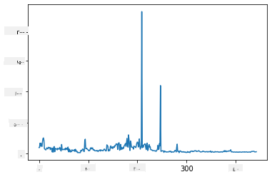
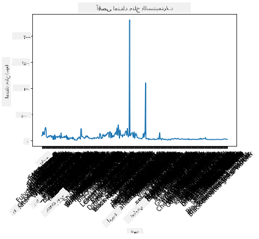
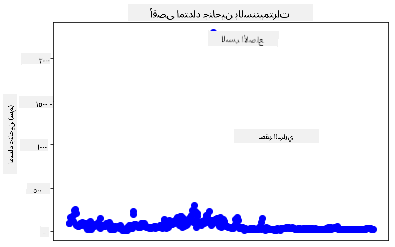
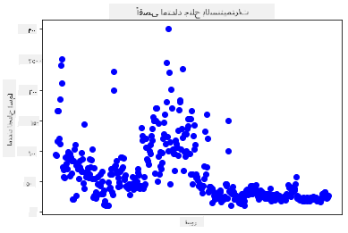
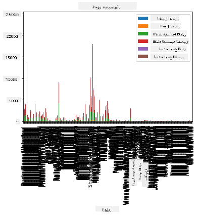
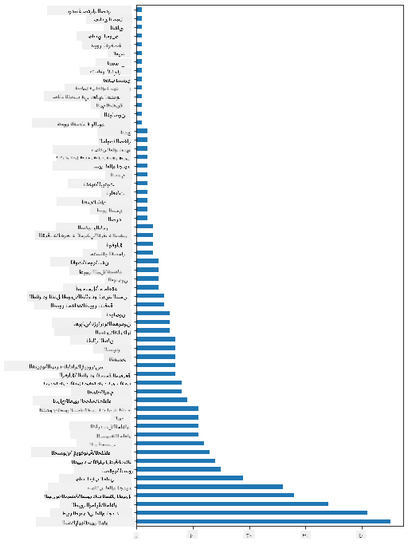
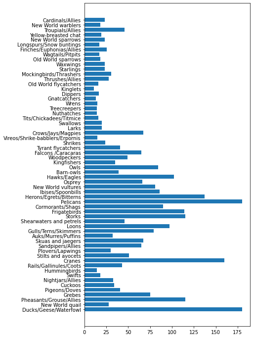
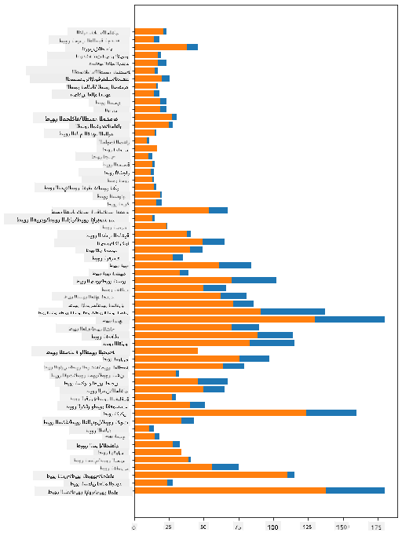

<!--
CO_OP_TRANSLATOR_METADATA:
{
  "original_hash": "43c402d9d90ae6da55d004519ada5033",
  "translation_date": "2025-08-27T10:42:36+00:00",
  "source_file": "3-Data-Visualization/09-visualization-quantities/README.md",
  "language_code": "ar"
}
-->
# تصور الكميات

| ](../../sketchnotes/09-Visualizing-Quantities.png)|
|:---:|
| تصور الكميات - _رسم توضيحي من [@nitya](https://twitter.com/nitya)_ |

في هذا الدرس، ستتعلم كيفية استخدام واحدة من مكتبات بايثون المتاحة لإنشاء تصورات مثيرة للاهتمام حول مفهوم الكمية. باستخدام مجموعة بيانات نظيفة عن الطيور في ولاية مينيسوتا، يمكنك اكتشاف العديد من الحقائق المثيرة حول الحياة البرية المحلية.

## [اختبار قبل المحاضرة](https://purple-hill-04aebfb03.1.azurestaticapps.net/quiz/16)

## مراقبة امتداد الأجنحة باستخدام مكتبة Matplotlib

تُعد مكتبة [Matplotlib](https://matplotlib.org/stable/index.html) أداة ممتازة لإنشاء مخططات ورسوم بيانية بسيطة أو معقدة من أنواع مختلفة. بشكل عام، تتضمن عملية رسم البيانات باستخدام هذه المكتبات تحديد أجزاء إطار البيانات التي تريد استهدافها، وإجراء أي تحويلات ضرورية على تلك البيانات، وتعيين قيم المحور السيني والصادي، وتحديد نوع الرسم البياني الذي تريد عرضه، ثم عرض الرسم. تقدم Matplotlib مجموعة كبيرة من التصورات، ولكن في هذا الدرس، سنركز على الأنواع الأكثر ملاءمة لتصور الكميات: الرسوم الخطية، الرسوم النقطية، والمخططات الشريطية.

> ✅ استخدم أفضل رسم بياني يناسب بنية بياناتك والقصة التي تريد سردها.  
> - لتحليل الاتجاهات عبر الزمن: الرسم الخطي  
> - لمقارنة القيم: الشريط، العمود، الدائرة، الرسم النقطي  
> - لإظهار كيفية ارتباط الأجزاء بالكل: الدائرة  
> - لإظهار توزيع البيانات: الرسم النقطي، الشريط  
> - لإظهار الاتجاهات: الخط، العمود  
> - لإظهار العلاقات بين القيم: الخط، الرسم النقطي، الفقاعة  

إذا كانت لديك مجموعة بيانات وتحتاج إلى معرفة كمية عنصر معين، فإن أول مهمة لديك هي فحص قيمه.

✅ هناك أوراق غش ممتازة متاحة لـ Matplotlib [هنا](https://matplotlib.org/cheatsheets/cheatsheets.pdf).

## إنشاء رسم خطي لقيم امتداد أجنحة الطيور

افتح ملف `notebook.ipynb` الموجود في جذر مجلد هذا الدرس وأضف خلية.

> ملاحظة: البيانات مخزنة في جذر هذا المستودع في مجلد `/data`.

```python
import pandas as pd
import matplotlib.pyplot as plt
birds = pd.read_csv('../../data/birds.csv')
birds.head()
```  
هذه البيانات مزيج من النصوص والأرقام:

|      | الاسم                         | الاسم العلمي           | الفئة                  | الرتبة        | العائلة   | الجنس       | حالة الحفظ         | الطول الأدنى | الطول الأقصى | الكتلة الأدنى | الكتلة الأقصى | امتداد الجناح الأدنى | امتداد الجناح الأقصى |
| ---: | :--------------------------- | :--------------------- | :-------------------- | :----------- | :------- | :---------- | :----------------- | --------: | --------: | ----------: | ----------: | ----------: | ----------: |
|    0 | بطة الصفير ذات البطن الأسود  | Dendrocygna autumnalis | البط/الإوز/طيور الماء | Anseriformes | Anatidae | Dendrocygna | LC                 |        47 |        56 |         652 |        1020 |          76 |          94 |
|    1 | بطة الصفير ذات اللون البني   | Dendrocygna bicolor    | البط/الإوز/طيور الماء | Anseriformes | Anatidae | Dendrocygna | LC                 |        45 |        53 |         712 |        1050 |          85 |          93 |
|    2 | إوزة الثلج                   | Anser caerulescens     | البط/الإوز/طيور الماء | Anseriformes | Anatidae | Anser       | LC                 |        64 |        79 |        2050 |        4050 |         135 |         165 |
|    3 | إوزة روس                     | Anser rossii           | البط/الإوز/طيور الماء | Anseriformes | Anatidae | Anser       | LC                 |      57.3 |        64 |        1066 |        1567 |         113 |         116 |
|    4 | الإوزة البيضاء الأمامية الكبرى| Anser albifrons        | البط/الإوز/طيور الماء | Anseriformes | Anatidae | Anser       | LC                 |        64 |        81 |        1930 |        3310 |         130 |         165 |

لنبدأ برسم بعض البيانات الرقمية باستخدام رسم خطي بسيط. لنفترض أنك تريد عرض امتداد الجناح الأقصى لهذه الطيور المثيرة.

```python
wingspan = birds['MaxWingspan'] 
wingspan.plot()
```  


ما الذي تلاحظه على الفور؟ يبدو أن هناك على الأقل قيمة شاذة واحدة - هذا امتداد جناح هائل! امتداد جناح يبلغ 2300 سنتيمتر يساوي 23 مترًا - هل هناك تيروصورات تتجول في مينيسوتا؟ دعنا نتحقق.

بينما يمكنك إجراء فرز سريع في Excel للعثور على هذه القيم الشاذة، والتي ربما تكون أخطاء مطبعية، استمر في عملية التصور من داخل الرسم.

أضف تسميات إلى المحور السيني لإظهار أنواع الطيور المعنية:

```
plt.title('Max Wingspan in Centimeters')
plt.ylabel('Wingspan (CM)')
plt.xlabel('Birds')
plt.xticks(rotation=45)
x = birds['Name'] 
y = birds['MaxWingspan']

plt.plot(x, y)

plt.show()
```  


حتى مع تدوير التسميات إلى 45 درجة، هناك الكثير منها لقراءتها. دعنا نحاول استراتيجية مختلفة: قم بتسمية القيم الشاذة فقط وضع التسميات داخل الرسم. يمكنك استخدام رسم نقطي لإفساح المجال للتسميات:

```python
plt.title('Max Wingspan in Centimeters')
plt.ylabel('Wingspan (CM)')
plt.tick_params(axis='both',which='both',labelbottom=False,bottom=False)

for i in range(len(birds)):
    x = birds['Name'][i]
    y = birds['MaxWingspan'][i]
    plt.plot(x, y, 'bo')
    if birds['MaxWingspan'][i] > 500:
        plt.text(x, y * (1 - 0.05), birds['Name'][i], fontsize=12)
    
plt.show()
```  
ما الذي يحدث هنا؟ استخدمت `tick_params` لإخفاء التسميات السفلية ثم أنشأت حلقة على مجموعة بيانات الطيور الخاصة بك. برسم الرسم باستخدام نقاط زرقاء صغيرة باستخدام `bo`، قمت بفحص أي طائر لديه امتداد جناح أقصى يزيد عن 500 وعرضت تسميته بجانب النقطة إذا كان كذلك. قمت بإزاحة التسميات قليلاً على المحور الصادي (`y * (1 - 0.05)`) واستخدمت اسم الطائر كتسمية.

ماذا اكتشفت؟



## تصفية البيانات

يبدو أن كل من النسر الأصلع والصقر السهلي، رغم أنهما طيور كبيرة على الأرجح، قد تم تصنيفهما بشكل خاطئ، مع إضافة `0` إضافي إلى امتداد جناحهما الأقصى. من غير المحتمل أن تقابل نسرًا أصلعًا بامتداد جناح يبلغ 25 مترًا، ولكن إذا حدث ذلك، يرجى إبلاغنا! دعنا ننشئ إطار بيانات جديدًا بدون هذين القيمتين الشاذتين:

```python
plt.title('Max Wingspan in Centimeters')
plt.ylabel('Wingspan (CM)')
plt.xlabel('Birds')
plt.tick_params(axis='both',which='both',labelbottom=False,bottom=False)
for i in range(len(birds)):
    x = birds['Name'][i]
    y = birds['MaxWingspan'][i]
    if birds['Name'][i] not in ['Bald eagle', 'Prairie falcon']:
        plt.plot(x, y, 'bo')
plt.show()
```  

من خلال تصفية القيم الشاذة، أصبحت بياناتك الآن أكثر تماسكًا وقابلة للفهم.



الآن بعد أن أصبح لدينا مجموعة بيانات أنظف على الأقل من حيث امتداد الأجنحة، دعنا نكتشف المزيد عن هذه الطيور.

بينما يمكن للرسوم الخطية والنقطية عرض معلومات حول قيم البيانات وتوزيعها، نريد التفكير في القيم المتأصلة في هذه المجموعة. يمكنك إنشاء تصورات للإجابة على الأسئلة التالية حول الكمية:

> كم عدد فئات الطيور الموجودة، وما هي أعدادها؟  
> كم عدد الطيور المنقرضة، المهددة، النادرة، أو الشائعة؟  
> كم عدد الأنواع المختلفة من الجنس والرتب وفقًا لمصطلحات لينيوس؟  

## استكشاف المخططات الشريطية

تُعد المخططات الشريطية عملية عندما تحتاج إلى عرض تجميعات البيانات. دعنا نستكشف فئات الطيور الموجودة في هذه المجموعة لمعرفة أيها الأكثر شيوعًا من حيث العدد.

في ملف الـ notebook، أنشئ مخططًا شريطيًا بسيطًا.

✅ ملاحظة، يمكنك إما تصفية الطيور الشاذة التي حددناها في القسم السابق، أو تعديل الخطأ المطبعي في امتداد جناحها، أو تركها لهذه التمارين التي لا تعتمد على قيم امتداد الجناح.

إذا كنت تريد إنشاء مخطط شريطي، يمكنك اختيار البيانات التي تريد التركيز عليها. يمكن إنشاء المخططات الشريطية من البيانات الخام:

```python
birds.plot(x='Category',
        kind='bar',
        stacked=True,
        title='Birds of Minnesota')

```  


ومع ذلك، هذا المخطط الشريطي غير قابل للقراءة لأنه يحتوي على الكثير من البيانات غير المجمعة. تحتاج إلى اختيار البيانات التي تريد رسمها فقط، لذا دعنا ننظر إلى طول الطيور بناءً على فئتها.

قم بتصفية بياناتك لتشمل فقط فئة الطيور.

✅ لاحظ أنك تستخدم Pandas لإدارة البيانات، ثم تترك Matplotlib لإنشاء الرسم.

نظرًا لوجود العديد من الفئات، يمكنك عرض هذا المخطط عموديًا وضبط ارتفاعه لاستيعاب جميع البيانات:

```python
category_count = birds.value_counts(birds['Category'].values, sort=True)
plt.rcParams['figure.figsize'] = [6, 12]
category_count.plot.barh()
```  


يوضح هذا المخطط الشريطي عرضًا جيدًا لعدد الطيور في كل فئة. في لمحة، ترى أن أكبر عدد من الطيور في هذه المنطقة ينتمي إلى فئة البط/الإوز/طيور الماء. مينيسوتا هي "أرض 10,000 بحيرة"، لذا فهذا ليس مفاجئًا!

✅ جرب بعض العدادات الأخرى على هذه المجموعة. هل هناك شيء يفاجئك؟

## مقارنة البيانات

يمكنك تجربة مقارنات مختلفة للبيانات المجمعة عن طريق إنشاء محاور جديدة. جرب مقارنة الطول الأقصى للطائر بناءً على فئته:

```python
maxlength = birds['MaxLength']
plt.barh(y=birds['Category'], width=maxlength)
plt.rcParams['figure.figsize'] = [6, 12]
plt.show()
```  


لا شيء مفاجئ هنا: الطيور الطنانة لديها أقل طول أقصى مقارنة بالبجع أو الإوز. من الجيد عندما تكون البيانات منطقية!

يمكنك إنشاء تصورات أكثر إثارة للاهتمام للمخططات الشريطية عن طريق تراكب البيانات. دعنا نُظهر الطول الأدنى والأقصى لفئة معينة من الطيور:

```python
minLength = birds['MinLength']
maxLength = birds['MaxLength']
category = birds['Category']

plt.barh(category, maxLength)
plt.barh(category, minLength)

plt.show()
```  
في هذا الرسم، يمكنك رؤية النطاق لكل فئة طيور من الطول الأدنى والطول الأقصى. يمكنك القول بثقة أنه، بناءً على هذه البيانات، كلما كان الطائر أكبر، كان نطاق طوله أكبر. رائع!



## 🚀 تحدٍ

تقدم مجموعة بيانات الطيور هذه ثروة من المعلومات حول أنواع الطيور المختلفة داخل نظام بيئي معين. ابحث عبر الإنترنت لترى ما إذا كان بإمكانك العثور على مجموعات بيانات أخرى متعلقة بالطيور. تدرب على إنشاء الرسوم البيانية والمخططات حول هذه الطيور لاكتشاف حقائق لم تكن تعرفها.

## [اختبار بعد المحاضرة](https://purple-hill-04aebfb03.1.azurestaticapps.net/quiz/17)

## المراجعة والدراسة الذاتية

قدمت لك هذه الدرس الأول بعض المعلومات حول كيفية استخدام Matplotlib لتصور الكميات. قم ببعض البحث حول طرق أخرى للعمل مع مجموعات البيانات للتصور. [Plotly](https://github.com/plotly/plotly.py) هي واحدة لن نغطيها في هذه الدروس، لذا ألقِ نظرة على ما يمكن أن تقدمه.

## الواجب

[الخطوط، النقاط، والأشرطة](assignment.md)

---

**إخلاء المسؤولية**:  
تم ترجمة هذا المستند باستخدام خدمة الترجمة بالذكاء الاصطناعي [Co-op Translator](https://github.com/Azure/co-op-translator). بينما نسعى لتحقيق الدقة، يرجى العلم أن الترجمات الآلية قد تحتوي على أخطاء أو معلومات غير دقيقة. يجب اعتبار المستند الأصلي بلغته الأصلية هو المصدر الموثوق. للحصول على معلومات حاسمة، يُوصى بالاستعانة بترجمة بشرية احترافية. نحن غير مسؤولين عن أي سوء فهم أو تفسيرات خاطئة ناتجة عن استخدام هذه الترجمة.