<!--
CO_OP_TRANSLATOR_METADATA:
{
  "original_hash": "87faccac113d772551486a67a607153e",
  "translation_date": "2025-08-27T10:13:02+00:00",
  "source_file": "3-Data-Visualization/10-visualization-distributions/README.md",
  "language_code": "ar"
}
-->
# تصور التوزيعات

|](../../sketchnotes/10-Visualizing-Distributions.png)|
|:---:|
| تصور التوزيعات - _رسم توضيحي من [@nitya](https://twitter.com/nitya)_ |

في الدرس السابق، تعلمت بعض الحقائق المثيرة للاهتمام حول مجموعة بيانات عن الطيور في ولاية مينيسوتا. اكتشفت بعض البيانات الخاطئة من خلال تصور القيم الشاذة ونظرت في الفروقات بين فئات الطيور بناءً على أطوالها القصوى.

## [اختبار ما قبل المحاضرة](https://purple-hill-04aebfb03.1.azurestaticapps.net/quiz/18)
## استكشاف مجموعة بيانات الطيور

طريقة أخرى للتعمق في البيانات هي النظر إلى توزيعها، أو كيفية تنظيم البيانات على محور معين. ربما، على سبيل المثال، ترغب في معرفة التوزيع العام في هذه المجموعة من البيانات لأقصى امتداد جناح أو أقصى كتلة جسم للطيور في مينيسوتا.

دعنا نكتشف بعض الحقائق حول توزيعات البيانات في هذه المجموعة. في ملف _notebook.ipynb_ الموجود في جذر مجلد هذا الدرس، قم باستيراد Pandas وMatplotlib وبياناتك:

```python
import pandas as pd
import matplotlib.pyplot as plt
birds = pd.read_csv('../../data/birds.csv')
birds.head()
```

|      | الاسم                         | الاسم العلمي           | الفئة                 | الرتبة       | العائلة  | الجنس       | حالة الحفظ         | الطول الأدنى | الطول الأقصى | الكتلة الأدنى | الكتلة القصوى | امتداد الجناح الأدنى | امتداد الجناح الأقصى |
| ---: | :--------------------------- | :--------------------- | :-------------------- | :----------- | :------- | :---------- | :----------------- | --------: | --------: | ----------: | ----------: | ----------: | ----------: |
|    0 | بطة الصفير ذات البطن الأسود  | Dendrocygna autumnalis | البط/الإوز/طيور الماء | Anseriformes | Anatidae | Dendrocygna | LC                 |        47 |        56 |         652 |        1020 |          76 |          94 |
|    1 | بطة الصفير البنية             | Dendrocygna bicolor    | البط/الإوز/طيور الماء | Anseriformes | Anatidae | Dendrocygna | LC                 |        45 |        53 |         712 |        1050 |          85 |          93 |
|    2 | إوزة الثلج                   | Anser caerulescens     | البط/الإوز/طيور الماء | Anseriformes | Anatidae | Anser       | LC                 |        64 |        79 |        2050 |        4050 |         135 |         165 |
|    3 | إوزة روس                     | Anser rossii           | البط/الإوز/طيور الماء | Anseriformes | Anatidae | Anser       | LC                 |      57.3 |        64 |        1066 |        1567 |         113 |         116 |
|    4 | الإوزة البيضاء الكبيرة       | Anser albifrons        | البط/الإوز/طيور الماء | Anseriformes | Anatidae | Anser       | LC                 |        64 |        81 |        1930 |        3310 |         130 |         165 |

بشكل عام، يمكنك النظر بسرعة إلى كيفية توزيع البيانات باستخدام مخطط الانتشار كما فعلنا في الدرس السابق:

```python
birds.plot(kind='scatter',x='MaxLength',y='Order',figsize=(12,8))

plt.title('Max Length per Order')
plt.ylabel('Order')
plt.xlabel('Max Length')

plt.show()
```
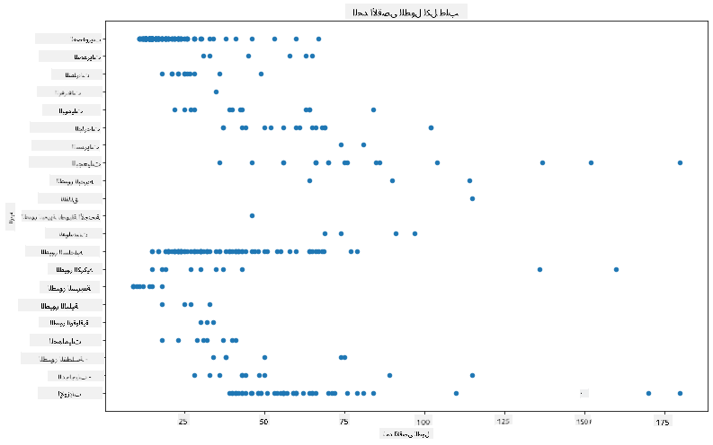

هذا يعطي لمحة عامة عن التوزيع العام لطول الجسم لكل رتبة من الطيور، ولكنه ليس الطريقة المثلى لعرض التوزيعات الحقيقية. عادةً ما يتم التعامل مع هذه المهمة من خلال إنشاء مخطط هيستوجرام.

## العمل مع الهيستوجرامات

يوفر Matplotlib طرقًا ممتازة لتصور توزيع البيانات باستخدام الهيستوجرامات. يشبه هذا النوع من الرسوم البيانية المخطط الشريطي حيث يمكن رؤية التوزيع من خلال ارتفاع وانخفاض الأشرطة. لإنشاء هيستوجرام، تحتاج إلى بيانات رقمية. لإنشاء هيستوجرام، يمكنك رسم مخطط مع تحديد النوع كـ 'hist' للهيستوجرام. يعرض هذا المخطط توزيع MaxBodyMass لنطاق البيانات الرقمي للمجموعة بأكملها. من خلال تقسيم مصفوفة البيانات إلى صناديق أصغر، يمكنه عرض توزيع قيم البيانات:

```python
birds['MaxBodyMass'].plot(kind = 'hist', bins = 10, figsize = (12,12))
plt.show()
```
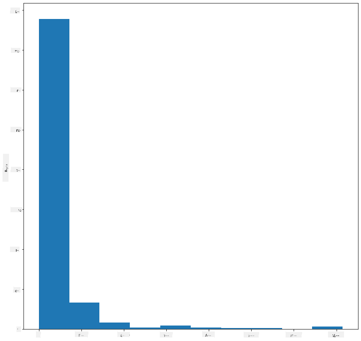

كما ترى، تقع معظم الطيور البالغ عددها 400+ في هذه المجموعة ضمن نطاق أقل من 2000 لأقصى كتلة جسم. احصل على مزيد من الفهم للبيانات عن طريق تغيير معلمة `bins` إلى رقم أعلى، مثل 30:

```python
birds['MaxBodyMass'].plot(kind = 'hist', bins = 30, figsize = (12,12))
plt.show()
```
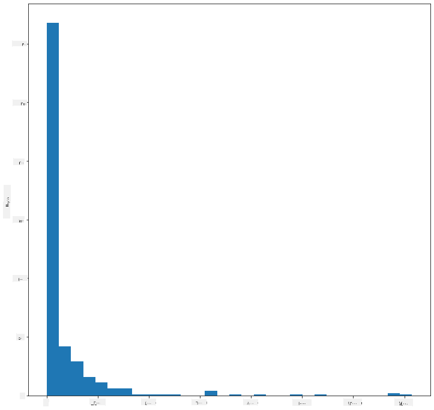

يعرض هذا المخطط التوزيع بطريقة أكثر تفصيلًا. يمكن إنشاء مخطط أقل انحيازًا إلى اليسار عن طريق التأكد من اختيار البيانات فقط ضمن نطاق معين:

قم بتصفية بياناتك للحصول على الطيور التي تقل كتلة أجسامها عن 60، وأظهر 40 `bins`:

```python
filteredBirds = birds[(birds['MaxBodyMass'] > 1) & (birds['MaxBodyMass'] < 60)]      
filteredBirds['MaxBodyMass'].plot(kind = 'hist',bins = 40,figsize = (12,12))
plt.show()     
```
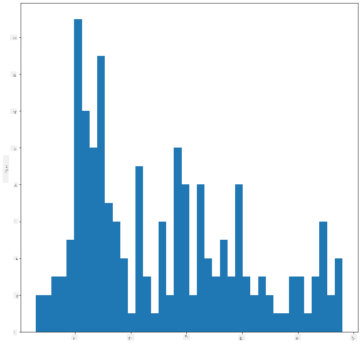

✅ جرب بعض الفلاتر ونقاط البيانات الأخرى. لرؤية التوزيع الكامل للبيانات، قم بإزالة الفلتر `['MaxBodyMass']` لعرض التوزيعات المسماة.

يوفر الهيستوجرام أيضًا تحسينات جميلة للألوان والتسمية لتجربتها:

قم بإنشاء هيستوجرام ثنائي الأبعاد لمقارنة العلاقة بين توزيعين. دعنا نقارن `MaxBodyMass` مقابل `MaxLength`. يوفر Matplotlib طريقة مدمجة لإظهار التقارب باستخدام ألوان أكثر إشراقًا:

```python
x = filteredBirds['MaxBodyMass']
y = filteredBirds['MaxLength']

fig, ax = plt.subplots(tight_layout=True)
hist = ax.hist2d(x, y)
```
يبدو أن هناك ارتباطًا متوقعًا بين هذين العنصرين على محور متوقع، مع نقطة تقارب قوية واحدة:

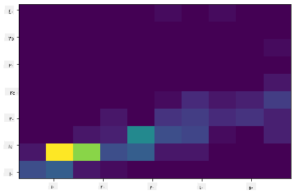

تعمل الهيستوجرامات بشكل جيد افتراضيًا مع البيانات الرقمية. ماذا لو كنت بحاجة إلى رؤية التوزيعات وفقًا للبيانات النصية؟

## استكشاف التوزيعات باستخدام البيانات النصية

تتضمن هذه المجموعة أيضًا معلومات جيدة حول فئة الطيور وجنسها ونوعها وعائلتها بالإضافة إلى حالة الحفظ الخاصة بها. دعنا نتعمق في معلومات الحفظ هذه. ما هو توزيع الطيور وفقًا لحالة الحفظ الخاصة بها؟

> ✅ في مجموعة البيانات، يتم استخدام العديد من الاختصارات لوصف حالة الحفظ. تأتي هذه الاختصارات من [فئات القائمة الحمراء للـ IUCN](https://www.iucnredlist.org/)، وهي منظمة تصنف حالة الأنواع.
> 
> - CR: مهددة بالانقراض بشكل حرج
> - EN: مهددة بالانقراض
> - EX: منقرضة
> - LC: أقل قلق
> - NT: قريبة من التهديد
> - VU: معرضة للخطر

هذه قيم نصية، لذا ستحتاج إلى إجراء تحويل لإنشاء هيستوجرام. باستخدام إطار البيانات filteredBirds، اعرض حالة الحفظ الخاصة بها جنبًا إلى جنب مع امتداد الجناح الأدنى. ماذا ترى؟

```python
x1 = filteredBirds.loc[filteredBirds.ConservationStatus=='EX', 'MinWingspan']
x2 = filteredBirds.loc[filteredBirds.ConservationStatus=='CR', 'MinWingspan']
x3 = filteredBirds.loc[filteredBirds.ConservationStatus=='EN', 'MinWingspan']
x4 = filteredBirds.loc[filteredBirds.ConservationStatus=='NT', 'MinWingspan']
x5 = filteredBirds.loc[filteredBirds.ConservationStatus=='VU', 'MinWingspan']
x6 = filteredBirds.loc[filteredBirds.ConservationStatus=='LC', 'MinWingspan']

kwargs = dict(alpha=0.5, bins=20)

plt.hist(x1, **kwargs, color='red', label='Extinct')
plt.hist(x2, **kwargs, color='orange', label='Critically Endangered')
plt.hist(x3, **kwargs, color='yellow', label='Endangered')
plt.hist(x4, **kwargs, color='green', label='Near Threatened')
plt.hist(x5, **kwargs, color='blue', label='Vulnerable')
plt.hist(x6, **kwargs, color='gray', label='Least Concern')

plt.gca().set(title='Conservation Status', ylabel='Min Wingspan')
plt.legend();
```

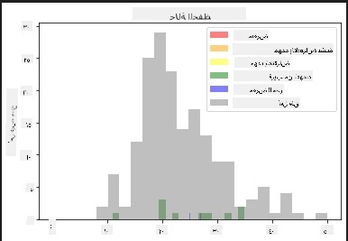

لا يبدو أن هناك ارتباطًا جيدًا بين امتداد الجناح الأدنى وحالة الحفظ. اختبر عناصر أخرى من مجموعة البيانات باستخدام هذه الطريقة. يمكنك تجربة فلاتر مختلفة أيضًا. هل تجد أي ارتباط؟

## مخططات الكثافة

قد تكون لاحظت أن الهيستوجرامات التي نظرنا إليها حتى الآن "متدرجة" ولا تتدفق بسلاسة في قوس. لعرض مخطط كثافة أكثر سلاسة، يمكنك تجربة مخطط الكثافة.

للتعامل مع مخططات الكثافة، تعرف على مكتبة رسم جديدة، [Seaborn](https://seaborn.pydata.org/generated/seaborn.kdeplot.html).

قم بتحميل Seaborn، وجرب مخطط كثافة أساسي:

```python
import seaborn as sns
import matplotlib.pyplot as plt
sns.kdeplot(filteredBirds['MinWingspan'])
plt.show()
```
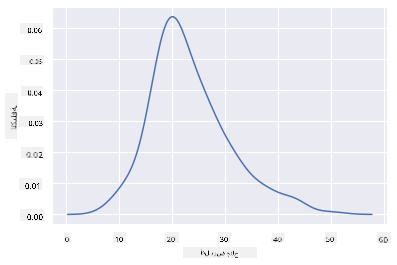

يمكنك أن ترى كيف يعكس المخطط السابق بيانات امتداد الجناح الأدنى؛ إنه فقط أكثر سلاسة. وفقًا لوثائق Seaborn، "بالمقارنة مع الهيستوجرام، يمكن أن ينتج KDE مخططًا أقل ازدحامًا وأكثر قابلية للتفسير، خاصة عند رسم توزيعات متعددة. ولكن لديه القدرة على إدخال تشوهات إذا كان التوزيع الأساسي محدودًا أو غير سلس. مثل الهيستوجرام، تعتمد جودة التمثيل أيضًا على اختيار معلمات التنعيم الجيدة." [المصدر](https://seaborn.pydata.org/generated/seaborn.kdeplot.html) بمعنى آخر، كما هو الحال دائمًا، ستجعل القيم الشاذة مخططاتك تتصرف بشكل سيئ.

إذا كنت تريد إعادة النظر في خط MaxBodyMass المتعرج في المخطط الثاني الذي أنشأته، يمكنك تنعيمه بشكل جيد جدًا عن طريق إعادة إنشائه باستخدام هذه الطريقة:

```python
sns.kdeplot(filteredBirds['MaxBodyMass'])
plt.show()
```
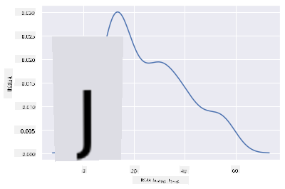

إذا كنت تريد خطًا سلسًا، ولكن ليس سلسًا جدًا، قم بتحرير معلمة `bw_adjust`:

```python
sns.kdeplot(filteredBirds['MaxBodyMass'], bw_adjust=.2)
plt.show()
```
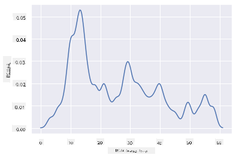

✅ اقرأ عن المعلمات المتاحة لهذا النوع من المخططات وجربها!

يوفر هذا النوع من المخططات تصورات تفسيرية جميلة. مع بضع أسطر من التعليمات البرمجية، على سبيل المثال، يمكنك عرض كثافة الكتلة الجسمية القصوى لكل رتبة من الطيور:

```python
sns.kdeplot(
   data=filteredBirds, x="MaxBodyMass", hue="Order",
   fill=True, common_norm=False, palette="crest",
   alpha=.5, linewidth=0,
)
```

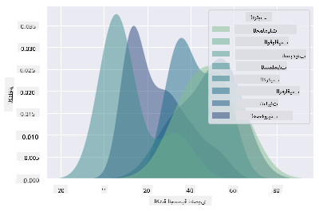

يمكنك أيضًا رسم كثافة عدة متغيرات في مخطط واحد. قارن بين الطول الأقصى والطول الأدنى للطيور بناءً على حالة الحفظ الخاصة بها:

```python
sns.kdeplot(data=filteredBirds, x="MinLength", y="MaxLength", hue="ConservationStatus")
```

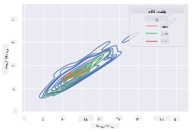

ربما يستحق البحث فيما إذا كان تجمع الطيور "المعرضة للخطر" بناءً على أطوالها ذو دلالة أم لا.

## 🚀 تحدٍ

الهيستوجرامات هي نوع أكثر تطورًا من الرسوم البيانية مقارنة بمخططات الانتشار الأساسية أو المخططات الشريطية أو المخططات الخطية. قم بالبحث على الإنترنت للعثور على أمثلة جيدة لاستخدام الهيستوجرامات. كيف يتم استخدامها، ماذا توضح، وفي أي مجالات أو مجالات استقصاء يتم استخدامها عادةً؟

## [اختبار ما بعد المحاضرة](https://purple-hill-04aebfb03.1.azurestaticapps.net/quiz/19)

## المراجعة والدراسة الذاتية

في هذا الدرس، استخدمت Matplotlib وبدأت العمل مع Seaborn لإنشاء رسوم بيانية أكثر تطورًا. قم ببعض البحث حول `kdeplot` في Seaborn، وهو "منحنى كثافة احتمالية مستمرة في بعد واحد أو أكثر". اقرأ [الوثائق](https://seaborn.pydata.org/generated/seaborn.kdeplot.html) لفهم كيفية عمله.

## الواجب

[طبق مهاراتك](assignment.md)

---

**إخلاء المسؤولية**:  
تمت ترجمة هذا المستند باستخدام خدمة الترجمة الآلية [Co-op Translator](https://github.com/Azure/co-op-translator). بينما نسعى لتحقيق الدقة، يرجى العلم أن الترجمات الآلية قد تحتوي على أخطاء أو معلومات غير دقيقة. يجب اعتبار المستند الأصلي بلغته الأصلية هو المصدر الموثوق. للحصول على معلومات حساسة أو هامة، يُوصى بالاستعانة بترجمة بشرية احترافية. نحن غير مسؤولين عن أي سوء فهم أو تفسيرات خاطئة تنشأ عن استخدام هذه الترجمة.