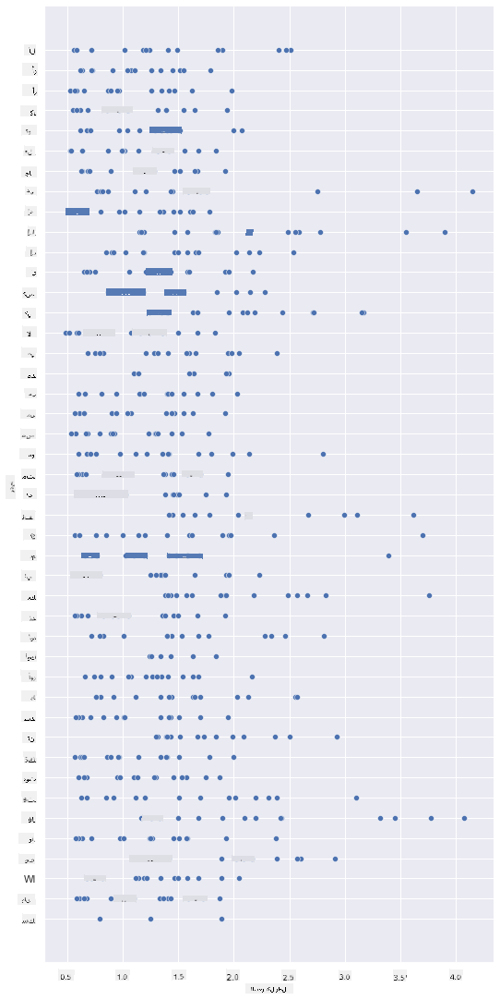
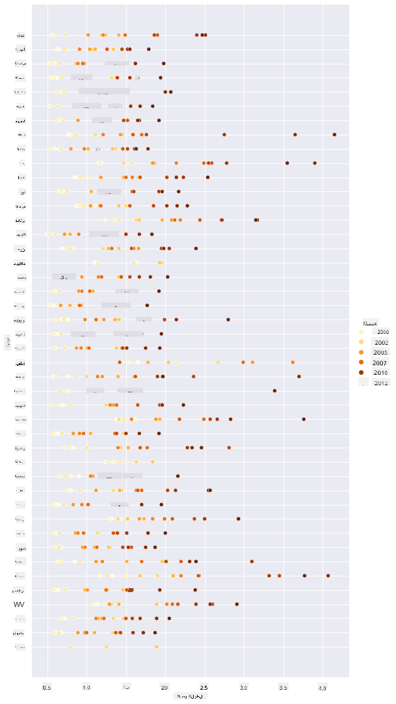
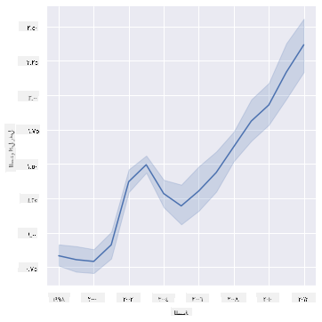
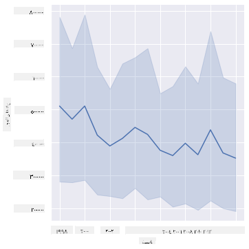
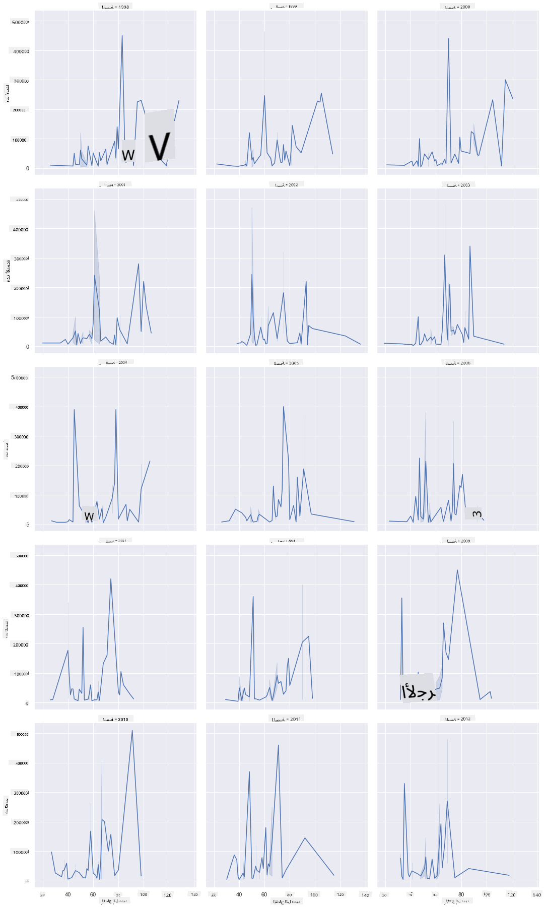
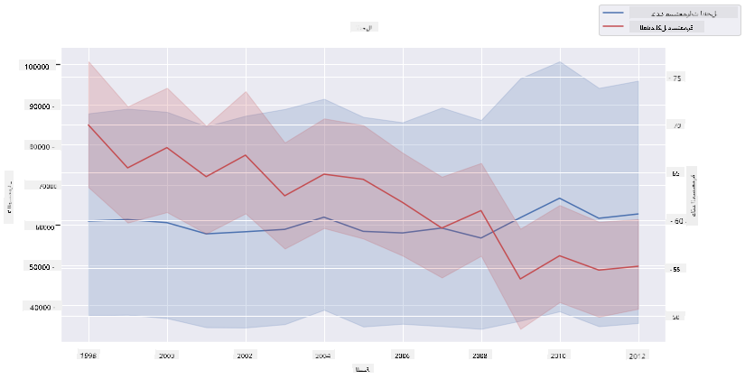

<!--
CO_OP_TRANSLATOR_METADATA:
{
  "original_hash": "cad419b574d5c35eaa417e9abfdcb0c8",
  "translation_date": "2025-08-27T10:17:20+00:00",
  "source_file": "3-Data-Visualization/12-visualization-relationships/README.md",
  "language_code": "ar"
}
-->
# تصور العلاقات: كل شيء عن العسل 🍯

|](../../sketchnotes/12-Visualizing-Relationships.png)|
|:---:|
|تصور العلاقات - _رسم توضيحي من [@nitya](https://twitter.com/nitya)_ |

استمرارًا في التركيز على الطبيعة في بحثنا، دعونا نستكشف تصورات مثيرة للاهتمام لعرض العلاقات بين أنواع العسل المختلفة، استنادًا إلى مجموعة بيانات مستمدة من [وزارة الزراعة الأمريكية](https://www.nass.usda.gov/About_NASS/index.php).

تتضمن هذه المجموعة حوالي 600 عنصر تعرض إنتاج العسل في العديد من الولايات الأمريكية. على سبيل المثال، يمكنك الاطلاع على عدد المستعمرات، الإنتاجية لكل مستعمرة، إجمالي الإنتاج، المخزون، السعر لكل رطل، وقيمة العسل المنتج في ولاية معينة من عام 1998 إلى 2012، مع صف واحد لكل سنة لكل ولاية.

سيكون من المثير تصور العلاقة بين إنتاج ولاية معينة في السنة، على سبيل المثال، وسعر العسل في تلك الولاية. بدلاً من ذلك، يمكنك تصور العلاقة بين إنتاجية العسل لكل مستعمرة في الولايات المختلفة. تغطي هذه الفترة الزمنية ظهور ظاهرة انهيار المستعمرات (CCD) التي شوهدت لأول مرة في عام 2006 (http://npic.orst.edu/envir/ccd.html)، مما يجعلها مجموعة بيانات مؤثرة للدراسة. 🐝

## [اختبار ما قبل المحاضرة](https://purple-hill-04aebfb03.1.azurestaticapps.net/quiz/22)

في هذا الدرس، يمكنك استخدام مكتبة Seaborn، التي استخدمتها من قبل، كأداة رائعة لتصور العلاقات بين المتغيرات. من المثير للاهتمام بشكل خاص استخدام وظيفة `relplot` في Seaborn التي تتيح إنشاء مخططات نقطية وخطية بسرعة لتصور '[العلاقات الإحصائية](https://seaborn.pydata.org/tutorial/relational.html?highlight=relationships)'، مما يساعد عالم البيانات على فهم كيفية ارتباط المتغيرات ببعضها البعض.

## المخططات النقطية

استخدم مخططًا نقطيًا لعرض كيفية تطور سعر العسل عامًا بعد عام لكل ولاية. تسهل Seaborn باستخدام `relplot` تجميع بيانات الولايات وعرض النقاط للبيانات الفئوية والرقمية.

لنبدأ باستيراد البيانات ومكتبة Seaborn:

```python
import pandas as pd
import matplotlib.pyplot as plt
import seaborn as sns
honey = pd.read_csv('../../data/honey.csv')
honey.head()
```
ستلاحظ أن بيانات العسل تحتوي على عدة أعمدة مثيرة للاهتمام، بما في ذلك السنة والسعر لكل رطل. دعونا نستكشف هذه البيانات، مجمعة حسب الولايات الأمريكية:

| الولاية | عدد المستعمرات | الإنتاجية لكل مستعمرة | إجمالي الإنتاج | المخزون | السعر لكل رطل | قيمة الإنتاج | السنة |
|---------|----------------|-----------------------|----------------|---------|---------------|--------------|-------|
| AL      | 16000          | 71                   | 1136000        | 159000  | 0.72          | 818000       | 1998  |
| AZ      | 55000          | 60                   | 3300000        | 1485000 | 0.64          | 2112000      | 1998  |
| AR      | 53000          | 65                   | 3445000        | 1688000 | 0.59          | 2033000      | 1998  |
| CA      | 450000         | 83                   | 37350000       | 12326000| 0.62          | 23157000     | 1998  |
| CO      | 27000          | 72                   | 1944000        | 1594000 | 0.7           | 1361000      | 1998  |

قم بإنشاء مخطط نقطي أساسي لعرض العلاقة بين السعر لكل رطل من العسل وولاية المنشأ. اجعل المحور `y` طويلًا بما يكفي لعرض جميع الولايات:

```python
sns.relplot(x="priceperlb", y="state", data=honey, height=15, aspect=.5);
```


الآن، اعرض نفس البيانات باستخدام نظام ألوان مستوحى من العسل لإظهار كيفية تطور السعر على مر السنين. يمكنك القيام بذلك عن طريق إضافة معلمة 'hue' لإظهار التغيير عامًا بعد عام:

> ✅ تعرف على المزيد حول [لوحات الألوان التي يمكنك استخدامها في Seaborn](https://seaborn.pydata.org/tutorial/color_palettes.html) - جرب نظام ألوان قوس قزح الجميل!

```python
sns.relplot(x="priceperlb", y="state", hue="year", palette="YlOrBr", data=honey, height=15, aspect=.5);
```


مع هذا التغيير في نظام الألوان، يمكنك أن ترى بوضوح أن هناك تقدمًا قويًا على مر السنين فيما يتعلق بسعر العسل لكل رطل. في الواقع، إذا نظرت إلى مجموعة بيانات عينة للتحقق (اختر ولاية معينة، مثل أريزونا)، يمكنك رؤية نمط لزيادة الأسعار عامًا بعد عام، مع بعض الاستثناءات:

| الولاية | عدد المستعمرات | الإنتاجية لكل مستعمرة | إجمالي الإنتاج | المخزون | السعر لكل رطل | قيمة الإنتاج | السنة |
|---------|----------------|-----------------------|----------------|---------|---------------|--------------|-------|
| AZ      | 55000          | 60                   | 3300000        | 1485000 | 0.64          | 2112000      | 1998  |
| AZ      | 52000          | 62                   | 3224000        | 1548000 | 0.62          | 1999000      | 1999  |
| AZ      | 40000          | 59                   | 2360000        | 1322000 | 0.73          | 1723000      | 2000  |
| AZ      | 43000          | 59                   | 2537000        | 1142000 | 0.72          | 1827000      | 2001  |
| AZ      | 38000          | 63                   | 2394000        | 1197000 | 1.08          | 2586000      | 2002  |
| AZ      | 35000          | 72                   | 2520000        | 983000  | 1.34          | 3377000      | 2003  |
| AZ      | 32000          | 55                   | 1760000        | 774000  | 1.11          | 1954000      | 2004  |
| AZ      | 36000          | 50                   | 1800000        | 720000  | 1.04          | 1872000      | 2005  |
| AZ      | 30000          | 65                   | 1950000        | 839000  | 0.91          | 1775000      | 2006  |
| AZ      | 30000          | 64                   | 1920000        | 902000  | 1.26          | 2419000      | 2007  |
| AZ      | 25000          | 64                   | 1600000        | 336000  | 1.26          | 2016000      | 2008  |
| AZ      | 20000          | 52                   | 1040000        | 562000  | 1.45          | 1508000      | 2009  |
| AZ      | 24000          | 77                   | 1848000        | 665000  | 1.52          | 2809000      | 2010  |
| AZ      | 23000          | 53                   | 1219000        | 427000  | 1.55          | 1889000      | 2011  |
| AZ      | 22000          | 46                   | 1012000        | 253000  | 1.79          | 1811000      | 2012  |

طريقة أخرى لتصور هذا التقدم هي استخدام الحجم بدلاً من اللون. بالنسبة للمستخدمين الذين يعانون من عمى الألوان، قد تكون هذه الطريقة أفضل. قم بتعديل التصور لإظهار زيادة السعر من خلال زيادة محيط النقاط:

```python
sns.relplot(x="priceperlb", y="state", size="year", data=honey, height=15, aspect=.5);
```
يمكنك رؤية حجم النقاط يزداد تدريجيًا.


هل هذا مجرد حالة بسيطة من العرض والطلب؟ بسبب عوامل مثل تغير المناخ وانهيار المستعمرات، هل هناك كمية أقل من العسل المتاحة للشراء عامًا بعد عام، وبالتالي ترتفع الأسعار؟

لاكتشاف العلاقة بين بعض المتغيرات في هذه المجموعة، دعونا نستكشف بعض المخططات الخطية.

## المخططات الخطية

سؤال: هل هناك ارتفاع واضح في سعر العسل لكل رطل عامًا بعد عام؟ يمكنك اكتشاف ذلك بسهولة عن طريق إنشاء مخطط خطي واحد:

```python
sns.relplot(x="year", y="priceperlb", kind="line", data=honey);
```
الإجابة: نعم، مع بعض الاستثناءات حول عام 2003:



✅ لأن Seaborn يقوم بتجميع البيانات حول خط واحد، فإنه يعرض "القياسات المتعددة عند كل قيمة x عن طريق رسم المتوسط وفاصل الثقة بنسبة 95% حول المتوسط". [المصدر](https://seaborn.pydata.org/tutorial/relational.html). يمكن تعطيل هذا السلوك الذي يستغرق وقتًا بإضافة `ci=None`.

سؤال: حسنًا، في عام 2003، هل يمكننا أيضًا رؤية زيادة في إمدادات العسل؟ ماذا لو نظرت إلى إجمالي الإنتاج عامًا بعد عام؟

```python
sns.relplot(x="year", y="totalprod", kind="line", data=honey);
```



الإجابة: ليس حقًا. إذا نظرت إلى إجمالي الإنتاج، يبدو أنه زاد في تلك السنة المحددة، على الرغم من أن كمية العسل المنتجة بشكل عام كانت في انخفاض خلال هذه السنوات.

سؤال: في هذه الحالة، ما الذي يمكن أن يكون قد تسبب في ارتفاع سعر العسل حول عام 2003؟

لاكتشاف ذلك، يمكنك استكشاف شبكة الأوجه.

## شبكات الأوجه

تأخذ شبكات الأوجه جانبًا واحدًا من مجموعة البيانات الخاصة بك (في حالتنا، يمكنك اختيار 'السنة' لتجنب إنتاج عدد كبير جدًا من الأوجه). يمكن لـ Seaborn بعد ذلك إنشاء مخطط لكل من هذه الأوجه للإحداثيات x وy التي اخترتها للمقارنة بسهولة أكبر. هل يبرز عام 2003 في هذا النوع من المقارنة؟

قم بإنشاء شبكة أوجه باستخدام `relplot` كما هو موصى به في [وثائق Seaborn](https://seaborn.pydata.org/generated/seaborn.FacetGrid.html?highlight=facetgrid#seaborn.FacetGrid).

```python
sns.relplot(
    data=honey, 
    x="yieldpercol", y="numcol",
    col="year", 
    col_wrap=3,
    kind="line"
```
في هذا التصور، يمكنك مقارنة الإنتاجية لكل مستعمرة وعدد المستعمرات عامًا بعد عام، جنبًا إلى جنب مع التفاف مضبوط على 3 للأعمدة:



بالنسبة لهذه المجموعة من البيانات، لا يبدو أن هناك شيء مميز فيما يتعلق بعدد المستعمرات وإنتاجيتها، عامًا بعد عام وولاية بعد ولاية. هل هناك طريقة مختلفة للبحث عن علاقة بين هذين المتغيرين؟

## مخططات الخطوط المزدوجة

جرب مخططًا متعدد الخطوط عن طريق تراكب مخططين خطيين فوق بعضهما البعض، باستخدام وظيفة 'despine' في Seaborn لإزالة الحواف العلوية واليمنى، واستخدام `ax.twinx` [المستمدة من Matplotlib](https://matplotlib.org/stable/api/_as_gen/matplotlib.axes.Axes.twinx.html). تتيح Twinx للمخطط مشاركة المحور x وعرض محورين y. لذا، اعرض الإنتاجية لكل مستعمرة وعدد المستعمرات، متراكبين:

```python
fig, ax = plt.subplots(figsize=(12,6))
lineplot = sns.lineplot(x=honey['year'], y=honey['numcol'], data=honey, 
                        label = 'Number of bee colonies', legend=False)
sns.despine()
plt.ylabel('# colonies')
plt.title('Honey Production Year over Year');

ax2 = ax.twinx()
lineplot2 = sns.lineplot(x=honey['year'], y=honey['yieldpercol'], ax=ax2, color="r", 
                         label ='Yield per colony', legend=False) 
sns.despine(right=False)
plt.ylabel('colony yield')
ax.figure.legend();
```


بينما لا يظهر شيء واضح حول عام 2003، فإنه يسمح لنا بإنهاء هذا الدرس بملاحظة أكثر تفاؤلاً: على الرغم من الانخفاض العام في عدد المستعمرات، فإن عدد المستعمرات يستقر حتى لو كانت إنتاجيتها لكل مستعمرة تتناقص.

هيا، أيها النحل، استمروا! 🐝❤️

## 🚀 تحدٍ

في هذا الدرس، تعلمت المزيد عن استخدامات المخططات النقطية وشبكات الخطوط، بما في ذلك شبكات الأوجه. تحدَّ نفسك لإنشاء شبكة أوجه باستخدام مجموعة بيانات مختلفة، ربما واحدة استخدمتها في الدروس السابقة. لاحظ الوقت الذي تستغرقه لإنشائها ومدى حاجتك إلى الحذر بشأن عدد الأوجه التي تحتاج إلى رسمها باستخدام هذه التقنيات.

## [اختبار ما بعد المحاضرة](https://purple-hill-04aebfb03.1.azurestaticapps.net/quiz/23)

## المراجعة والدراسة الذاتية

يمكن أن تكون المخططات الخطية بسيطة أو معقدة للغاية. قم ببعض القراءة في [وثائق Seaborn](https://seaborn.pydata.org/generated/seaborn.lineplot.html) حول الطرق المختلفة التي يمكنك من خلالها بناؤها. حاول تحسين المخططات الخطية التي أنشأتها في هذا الدرس باستخدام طرق أخرى مذكورة في الوثائق.

## الواجب

[اغمر نفسك في خلية النحل](assignment.md)

---

**إخلاء المسؤولية**:  
تمت ترجمة هذا المستند باستخدام خدمة الترجمة الآلية [Co-op Translator](https://github.com/Azure/co-op-translator). بينما نسعى لتحقيق الدقة، يرجى العلم أن الترجمات الآلية قد تحتوي على أخطاء أو معلومات غير دقيقة. يجب اعتبار المستند الأصلي بلغته الأصلية هو المصدر الموثوق. للحصول على معلومات حساسة أو هامة، يُوصى بالاستعانة بترجمة بشرية احترافية. نحن غير مسؤولين عن أي سوء فهم أو تفسيرات خاطئة تنشأ عن استخدام هذه الترجمة.