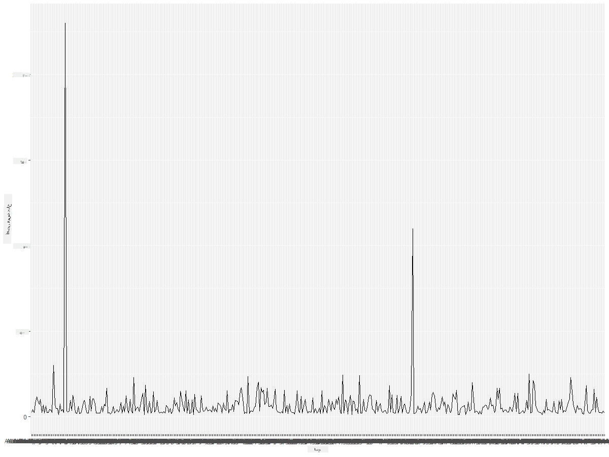
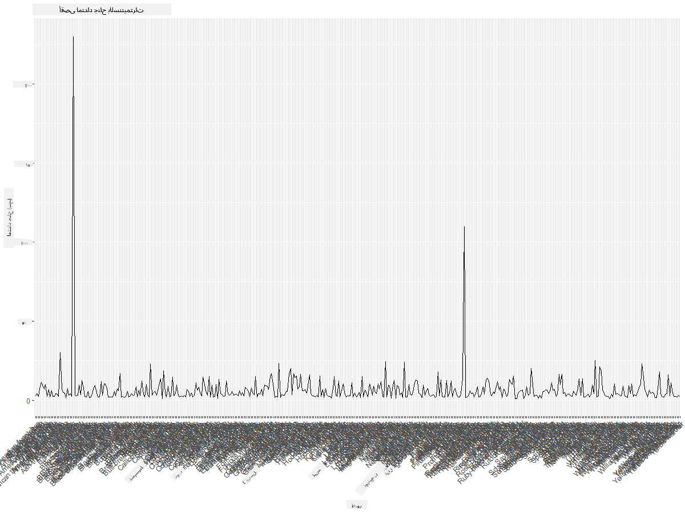
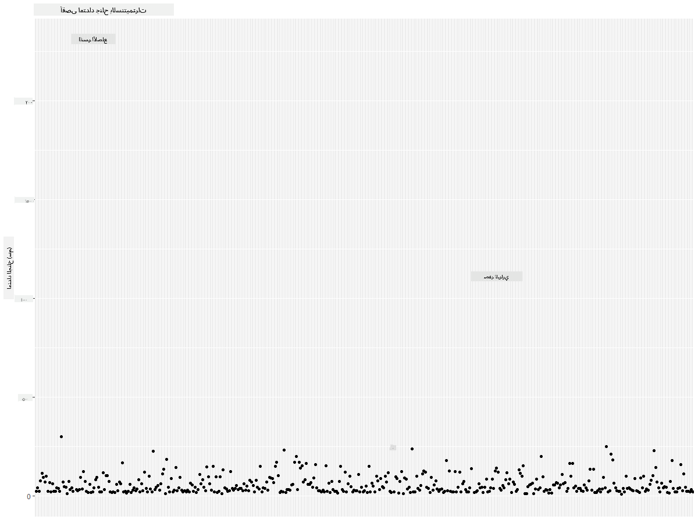
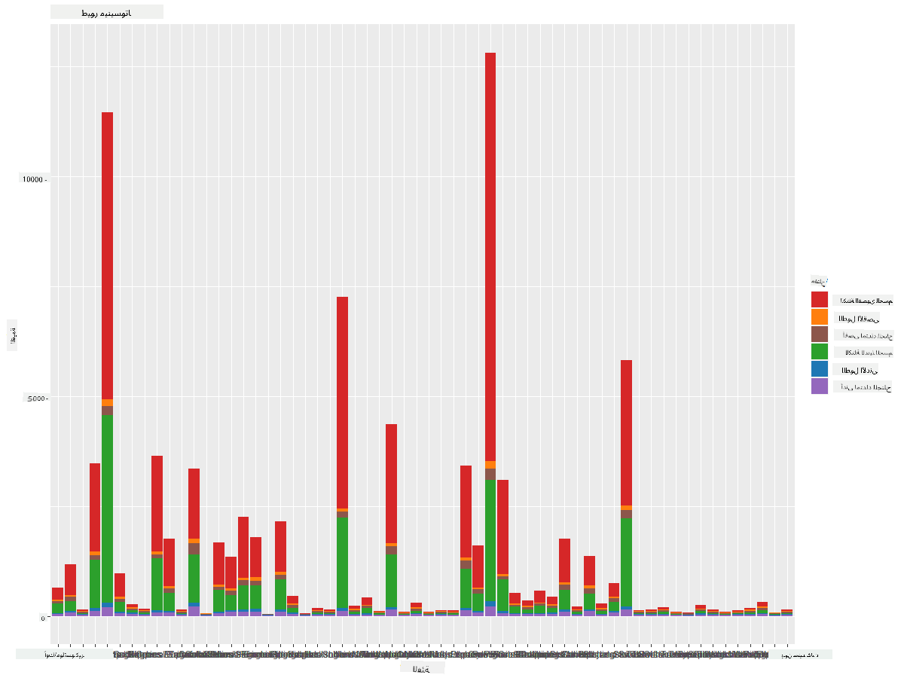
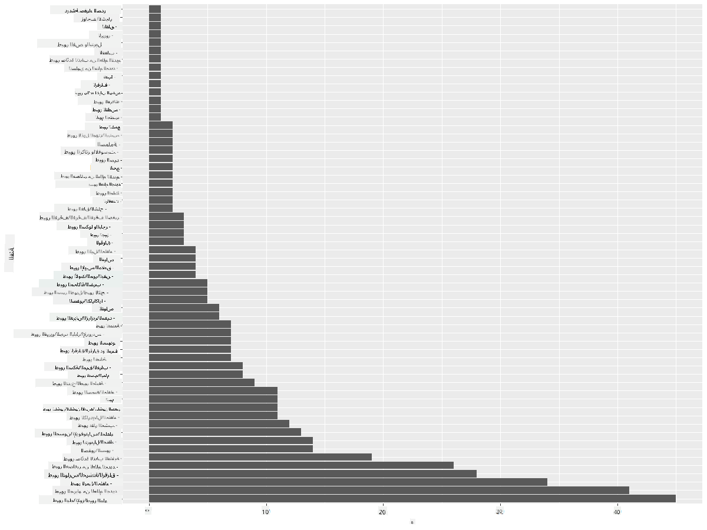
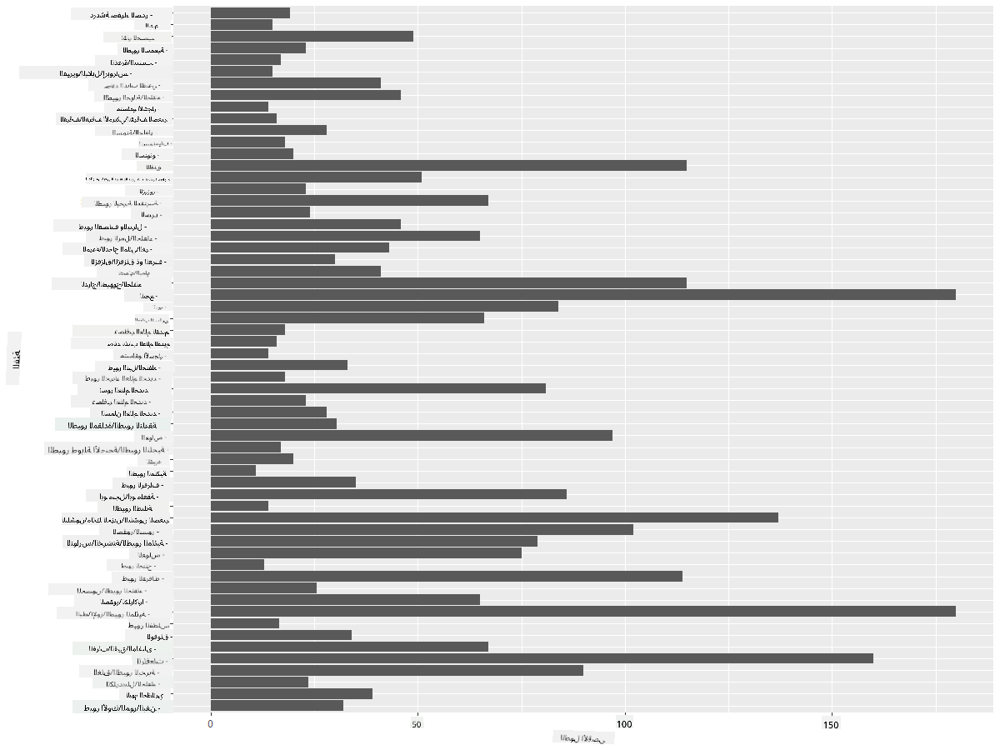
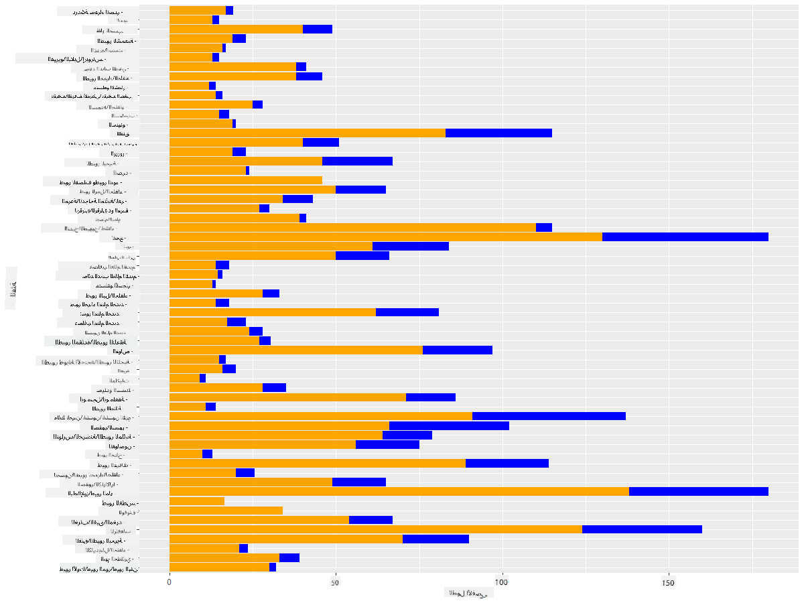

<!--
CO_OP_TRANSLATOR_METADATA:
{
  "original_hash": "22acf28f518a4769ea14fa42f4734b9f",
  "translation_date": "2025-08-27T10:30:08+00:00",
  "source_file": "3-Data-Visualization/R/09-visualization-quantities/README.md",
  "language_code": "ar"
}
-->
# تصور الكميات
| ](https://github.com/microsoft/Data-Science-For-Beginners/blob/main/sketchnotes/09-Visualizing-Quantities.png)|
|:---:|
| تصور الكميات - _رسم توضيحي بواسطة [@nitya](https://twitter.com/nitya)_ |

في هذه الدرس، ستتعلم كيفية استخدام بعض مكتبات حزم R المتوفرة لإنشاء تصورات مثيرة للاهتمام حول مفهوم الكمية. باستخدام مجموعة بيانات نظيفة عن الطيور في مينيسوتا، يمكنك اكتشاف العديد من الحقائق المثيرة حول الحياة البرية المحلية.  
## [اختبار ما قبل المحاضرة](https://purple-hill-04aebfb03.1.azurestaticapps.net/quiz/16)

## مراقبة عرض الجناح باستخدام ggplot2
مكتبة ممتازة لإنشاء مخططات ورسوم بيانية بسيطة ومتقدمة من أنواع مختلفة هي [ggplot2](https://cran.r-project.org/web/packages/ggplot2/index.html). بشكل عام، تتضمن عملية رسم البيانات باستخدام هذه المكتبات تحديد أجزاء إطار البيانات التي تريد استهدافها، إجراء أي تحويلات ضرورية على تلك البيانات، تعيين قيم المحورين x و y، تحديد نوع الرسم البياني الذي تريد عرضه، ثم عرض الرسم البياني.

`ggplot2` هو نظام لإنشاء الرسوم البيانية بشكل تصريحي، يعتمد على قواعد الرسوم البيانية. [قواعد الرسوم البيانية](https://en.wikipedia.org/wiki/Ggplot2) هي مخطط عام لتصور البيانات يقسم الرسوم البيانية إلى مكونات دلالية مثل المقاييس والطبقات. بمعنى آخر، سهولة إنشاء الرسوم البيانية للبيانات أحادية المتغير أو متعددة المتغيرات باستخدام القليل من الكود يجعل `ggplot2` الحزمة الأكثر شعبية المستخدمة للتصورات في R. يقوم المستخدم بإخبار `ggplot2` بكيفية تعيين المتغيرات للجماليات، العناصر الرسومية التي سيتم استخدامها، ويتولى `ggplot2` الباقي.

> ✅ الرسم البياني = البيانات + الجماليات + الهندسة
> - البيانات تشير إلى مجموعة البيانات
> - الجماليات تشير إلى المتغيرات التي سيتم دراستها (متغيرات x و y)
> - الهندسة تشير إلى نوع الرسم البياني (رسم خطي، رسم بياني عمودي، إلخ)

اختر أفضل هندسة (نوع الرسم البياني) وفقًا لبياناتك والقصة التي تريد سردها من خلال الرسم البياني.

> - لتحليل الاتجاهات: خطي، عمودي
> - لمقارنة القيم: عمودي، دائري، مخطط مبعثر
> - لإظهار كيفية ارتباط الأجزاء بالكل: دائري
> - لإظهار توزيع البيانات: مخطط مبعثر، عمودي
> - لإظهار العلاقات بين القيم: خطي، مخطط مبعثر، فقاعي

✅ يمكنك أيضًا الاطلاع على هذا [الدليل الوصفي](https://nyu-cdsc.github.io/learningr/assets/data-visualization-2.1.pdf) لـ ggplot2.

## إنشاء مخطط خطي لقيم عرض جناح الطيور

افتح وحدة التحكم R واستورد مجموعة البيانات.  
> ملاحظة: يتم تخزين مجموعة البيانات في جذر هذا المستودع في مجلد `/data`.

لنقم باستيراد مجموعة البيانات ومراقبة الرأس (أعلى 5 صفوف) من البيانات.

```r
birds <- read.csv("../../data/birds.csv",fileEncoding="UTF-8-BOM")
head(birds)
```
الرأس يحتوي على مزيج من النصوص والأرقام:

|      | الاسم                         | الاسم العلمي           | الفئة                 | الرتبة        | العائلة   | الجنس       | حالة الحفظ         | الطول الأدنى | الطول الأقصى | الكتلة الأدنى | الكتلة الأقصى | عرض الجناح الأدنى | عرض الجناح الأقصى |
| ---: | :--------------------------- | :--------------------- | :-------------------- | :----------- | :------- | :---------- | :----------------- | --------: | --------: | ----------: | ----------: | ----------: | ----------: |
|    0 | بطة الصفير ذات البطن الأسود  | Dendrocygna autumnalis | البط/الإوز/طيور الماء | Anseriformes | Anatidae | Dendrocygna | LC                 |        47 |        56 |         652 |        1020 |          76 |          94 |
|    1 | بطة الصفير ذات اللون البني   | Dendrocygna bicolor    | البط/الإوز/طيور الماء | Anseriformes | Anatidae | Dendrocygna | LC                 |        45 |        53 |         712 |        1050 |          85 |          93 |
|    2 | إوزة الثلج                   | Anser caerulescens     | البط/الإوز/طيور الماء | Anseriformes | Anatidae | Anser       | LC                 |        64 |        79 |        2050 |        4050 |         135 |         165 |
|    3 | إوزة روس                     | Anser rossii           | البط/الإوز/طيور الماء | Anseriformes | Anatidae | Anser       | LC                 |      57.3 |        64 |        1066 |        1567 |         113 |         116 |
|    4 | الإوزة البيضاء الكبيرة       | Anser albifrons        | البط/الإوز/طيور الماء | Anseriformes | Anatidae | Anser       | LC                 |        64 |        81 |        1930 |        3310 |         130 |         165 |

لنبدأ برسم بعض البيانات الرقمية باستخدام مخطط خطي أساسي. لنفترض أنك تريد عرض عرض الجناح الأقصى لهذه الطيور المثيرة.

```r
install.packages("ggplot2")
library("ggplot2")
ggplot(data=birds, aes(x=Name, y=MaxWingspan,group=1)) +
  geom_line() 
```
هنا، تقوم بتثبيت حزمة `ggplot2` ثم استيرادها إلى مساحة العمل باستخدام الأمر `library("ggplot2")`. لرسم أي مخطط في ggplot، يتم استخدام وظيفة `ggplot()` وتحديد مجموعة البيانات، متغيرات x و y كسمات. في هذه الحالة، نستخدم وظيفة `geom_line()` لأننا نهدف إلى رسم مخطط خطي.



ما الذي تلاحظه فورًا؟ يبدو أن هناك على الأقل نقطة شاذة واحدة - هذا عرض جناح كبير جدًا! عرض جناح يزيد عن 2000 سنتيمتر يساوي أكثر من 20 مترًا - هل هناك تيروداكتيلات تتجول في مينيسوتا؟ دعونا نحقق في الأمر.

بينما يمكنك إجراء فرز سريع في Excel للعثور على تلك النقاط الشاذة، والتي ربما تكون أخطاء مطبعية، استمر في عملية التصور من داخل الرسم البياني.

أضف تسميات إلى المحور x لإظهار نوع الطيور المعنية:

```r
ggplot(data=birds, aes(x=Name, y=MaxWingspan,group=1)) +
  geom_line() +
  theme(axis.text.x = element_text(angle = 45, hjust=1))+
  xlab("Birds") +
  ylab("Wingspan (CM)") +
  ggtitle("Max Wingspan in Centimeters")
```
نحدد الزاوية في `theme` ونحدد تسميات المحورين x و y في `xlab()` و `ylab()` على التوالي. يعطي `ggtitle()` اسمًا للرسم البياني/المخطط.



حتى مع تدوير التسميات إلى 45 درجة، هناك الكثير منها لقراءتها. دعونا نحاول استراتيجية مختلفة: قم بتسمية النقاط الشاذة فقط وضع التسميات داخل الرسم البياني. يمكنك استخدام مخطط مبعثر لتوفير مساحة أكبر للتسمية:

```r
ggplot(data=birds, aes(x=Name, y=MaxWingspan,group=1)) +
  geom_point() +
  geom_text(aes(label=ifelse(MaxWingspan>500,as.character(Name),'')),hjust=0,vjust=0) + 
  theme(axis.title.x=element_blank(), axis.text.x=element_blank(), axis.ticks.x=element_blank())
  ylab("Wingspan (CM)") +
  ggtitle("Max Wingspan in Centimeters") + 
```
ما الذي يحدث هنا؟ استخدمت وظيفة `geom_point()` لرسم نقاط مبعثرة. مع هذا، أضفت تسميات للطيور التي لديها `MaxWingspan > 500` وأخفيت أيضًا التسميات على المحور x لتقليل الفوضى في الرسم البياني.

ماذا تكتشف؟



## تصفية البيانات الخاصة بك

يبدو أن كل من النسر الأصلع والصقر البراري، رغم أنهما ربما طيور كبيرة جدًا، قد تم تصنيفهما بشكل خاطئ، مع إضافة صفر إضافي إلى عرض جناحهما الأقصى. من غير المحتمل أن تقابل نسرًا أصلعًا بعرض جناح يبلغ 25 مترًا، ولكن إذا حدث ذلك، يرجى إخبارنا! لنقم بإنشاء إطار بيانات جديد بدون هذين الشاذين:

```r
birds_filtered <- subset(birds, MaxWingspan < 500)

ggplot(data=birds_filtered, aes(x=Name, y=MaxWingspan,group=1)) +
  geom_point() +
  ylab("Wingspan (CM)") +
  xlab("Birds") +
  ggtitle("Max Wingspan in Centimeters") + 
  geom_text(aes(label=ifelse(MaxWingspan>500,as.character(Name),'')),hjust=0,vjust=0) +
  theme(axis.text.x=element_blank(), axis.ticks.x=element_blank())
```
قمنا بإنشاء إطار بيانات جديد `birds_filtered` ثم رسمنا مخططًا مبعثرًا. من خلال تصفية النقاط الشاذة، أصبحت بياناتك الآن أكثر تماسكًا وفهمًا.


الآن بعد أن أصبح لدينا مجموعة بيانات أنظف على الأقل من حيث عرض الجناح، دعونا نكتشف المزيد عن هذه الطيور.

بينما يمكن للمخططات الخطية والمبعثرة عرض معلومات حول قيم البيانات وتوزيعها، نريد التفكير في القيم المتأصلة في هذه المجموعة البيانات. يمكنك إنشاء تصورات للإجابة على الأسئلة التالية حول الكمية:

> كم عدد فئات الطيور الموجودة، وما هي أعدادها؟
> كم عدد الطيور المنقرضة، المهددة بالانقراض، النادرة، أو الشائعة؟
> كم عدد الطيور من مختلف الأجناس والرتب في مصطلحات لينيوس؟
## استكشاف المخططات العمودية

المخططات العمودية عملية عندما تحتاج إلى عرض تجميعات البيانات. دعونا نستكشف فئات الطيور الموجودة في هذه المجموعة البيانات لنرى أيها الأكثر شيوعًا من حيث العدد.  
لنقم بإنشاء مخطط عمودي على البيانات المصفاة.

```r
install.packages("dplyr")
install.packages("tidyverse")

library(lubridate)
library(scales)
library(dplyr)
library(ggplot2)
library(tidyverse)

birds_filtered %>% group_by(Category) %>%
  summarise(n=n(),
  MinLength = mean(MinLength),
  MaxLength = mean(MaxLength),
  MinBodyMass = mean(MinBodyMass),
  MaxBodyMass = mean(MaxBodyMass),
  MinWingspan=mean(MinWingspan),
  MaxWingspan=mean(MaxWingspan)) %>% 
  gather("key", "value", - c(Category, n)) %>%
  ggplot(aes(x = Category, y = value, group = key, fill = key)) +
  geom_bar(stat = "identity") +
  scale_fill_manual(values = c("#D62728", "#FF7F0E", "#8C564B","#2CA02C", "#1F77B4", "#9467BD")) +                   
  xlab("Category")+ggtitle("Birds of Minnesota")

```
في المقتطف التالي، نقوم بتثبيت حزم [dplyr](https://www.rdocumentation.org/packages/dplyr/versions/0.7.8) و[lubridate](https://www.rdocumentation.org/packages/lubridate/versions/1.8.0) للمساعدة في معالجة وتجميع البيانات من أجل رسم مخطط عمودي مكدس. أولاً، نقوم بتجميع البيانات حسب `Category` الطيور ثم تلخيص الأعمدة `MinLength`, `MaxLength`, `MinBodyMass`,`MaxBodyMass`,`MinWingspan`,`MaxWingspan`. ثم، نرسم المخطط العمودي باستخدام حزمة `ggplot2` ونحدد الألوان للفئات المختلفة والتسميات.



ومع ذلك، هذا المخطط العمودي غير قابل للقراءة لأنه يحتوي على الكثير من البيانات غير المجمعة. تحتاج إلى اختيار البيانات التي تريد رسمها فقط، لذا دعونا ننظر إلى طول الطيور بناءً على فئتها.

قم بتصفية بياناتك لتشمل فقط فئة الطيور.

نظرًا لوجود العديد من الفئات، يمكنك عرض هذا المخطط عموديًا وتعديل ارتفاعه لاستيعاب جميع البيانات:

```r
birds_count<-dplyr::count(birds_filtered, Category, sort = TRUE)
birds_count$Category <- factor(birds_count$Category, levels = birds_count$Category)
ggplot(birds_count,aes(Category,n))+geom_bar(stat="identity")+coord_flip()
```
أولاً، تقوم بعد القيم الفريدة في عمود `Category` ثم ترتيبها في إطار بيانات جديد `birds_count`. يتم ترتيب هذه البيانات المصفاة بنفس المستوى بحيث يتم رسمها بطريقة مرتبة. باستخدام `ggplot2`، تقوم بعد ذلك برسم البيانات في مخطط عمودي. يقوم `coord_flip()` برسم الأعمدة أفقيًا.



يوفر هذا المخطط العمودي عرضًا جيدًا لعدد الطيور في كل فئة. في لمحة، ترى أن أكبر عدد من الطيور في هذه المنطقة ينتمي إلى فئة البط/الإوز/طيور الماء. مينيسوتا هي "أرض 10,000 بحيرة"، لذا هذا ليس مفاجئًا!

✅ جرب بعض العدود الأخرى على هذه المجموعة البيانات. هل هناك شيء يفاجئك؟

## مقارنة البيانات

يمكنك تجربة مقارنات مختلفة للبيانات المجمعة عن طريق إنشاء محاور جديدة. جرب مقارنة الطول الأقصى للطائر بناءً على فئته:

```r
birds_grouped <- birds_filtered %>%
  group_by(Category) %>%
  summarise(
  MaxLength = max(MaxLength, na.rm = T),
  MinLength = max(MinLength, na.rm = T)
           ) %>%
  arrange(Category)
  
ggplot(birds_grouped,aes(Category,MaxLength))+geom_bar(stat="identity")+coord_flip()
```
نقوم بتجميع بيانات `birds_filtered` حسب `Category` ثم رسم مخطط عمودي.



لا شيء مفاجئ هنا: الطيور الطنانة لديها أقل طول أقصى مقارنة بالبجع أو الإوز. من الجيد عندما تكون البيانات منطقية!

يمكنك إنشاء تصورات أكثر إثارة للاهتمام للمخططات العمودية عن طريق تراكب البيانات. دعونا نراكب الطول الأدنى والأقصى على فئة الطيور المعطاة:

```r
ggplot(data=birds_grouped, aes(x=Category)) +
  geom_bar(aes(y=MaxLength), stat="identity", position ="identity",  fill='blue') +
  geom_bar(aes(y=MinLength), stat="identity", position="identity", fill='orange')+
  coord_flip()
```


## 🚀 تحدي

تقدم مجموعة بيانات الطيور هذه ثروة من المعلومات حول أنواع الطيور المختلفة داخل نظام بيئي معين. ابحث عبر الإنترنت لترى ما إذا كان يمكنك العثور على مجموعات بيانات أخرى متعلقة بالطيور. قم بممارسة إنشاء المخططات والرسوم البيانية حول هذه الطيور لاكتشاف حقائق لم تكن تعرفها.

## [اختبار ما بعد المحاضرة](https://purple-hill-04aebfb03.1.azurestaticapps.net/quiz/17)

## المراجعة والدراسة الذاتية

أعطتك هذه الدرس الأول بعض المعلومات حول كيفية استخدام `ggplot2` لتصور الكميات. قم ببعض البحث حول طرق أخرى للعمل مع مجموعات البيانات للتصور. ابحث عن مجموعات بيانات يمكنك تصورها باستخدام حزم أخرى مثل [Lattice](https://stat.ethz.ch/R-manual/R-devel/library/lattice/html/Lattice.html) و[Plotly](https://github.com/plotly/plotly.R#readme).

## الواجب
[الخطوط، النقاط المبعثرة، والأعمدة](assignment.md)

---

**إخلاء المسؤولية**:  
تم ترجمة هذا المستند باستخدام خدمة الترجمة الآلية [Co-op Translator](https://github.com/Azure/co-op-translator). بينما نسعى لتحقيق الدقة، يرجى العلم أن الترجمات الآلية قد تحتوي على أخطاء أو معلومات غير دقيقة. يجب اعتبار المستند الأصلي بلغته الأصلية هو المصدر الموثوق. للحصول على معلومات حساسة أو هامة، يُوصى بالاستعانة بترجمة بشرية احترافية. نحن غير مسؤولين عن أي سوء فهم أو تفسيرات خاطئة ناتجة عن استخدام هذه الترجمة.