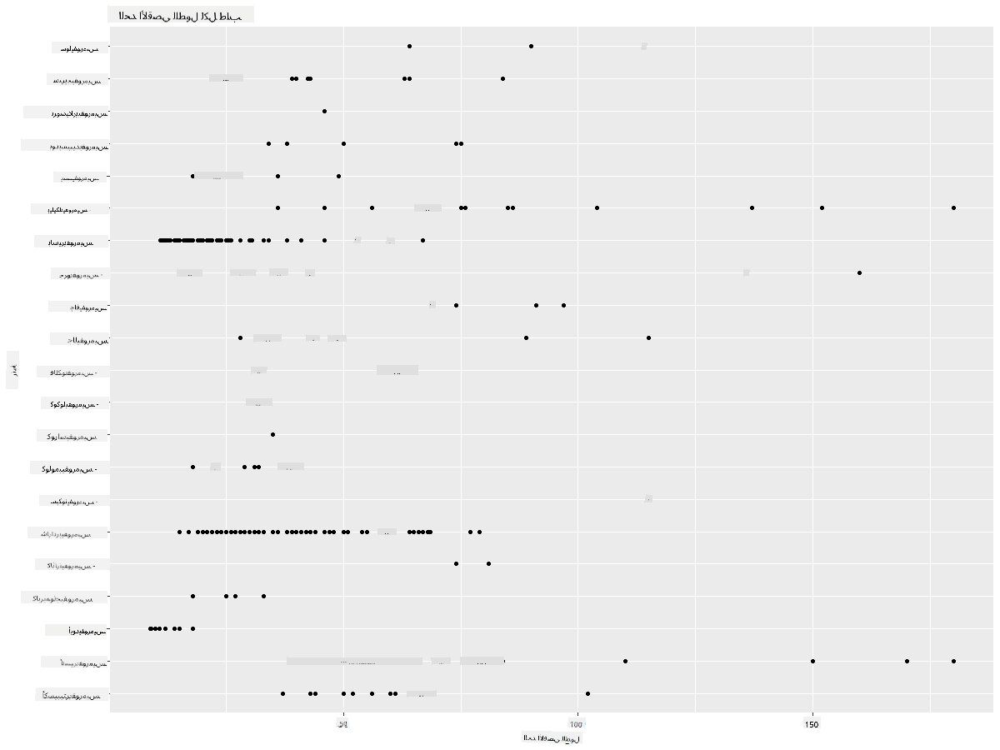
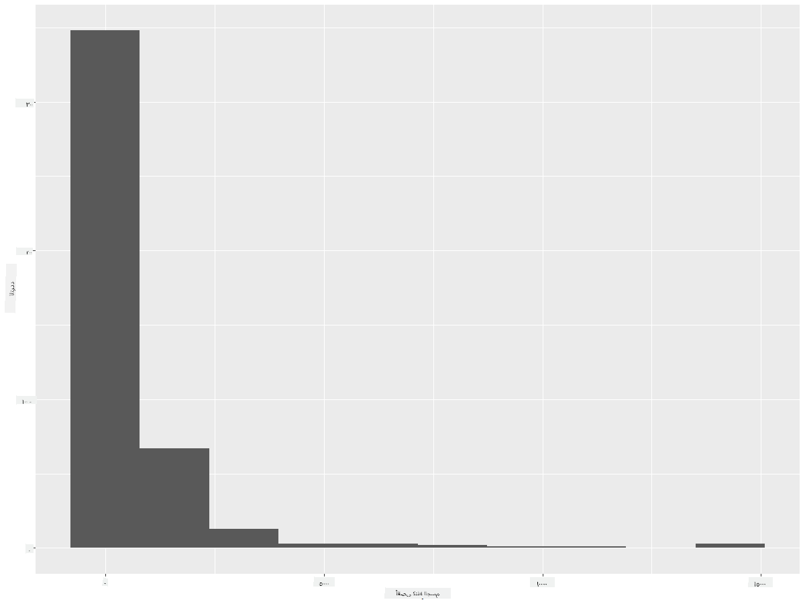
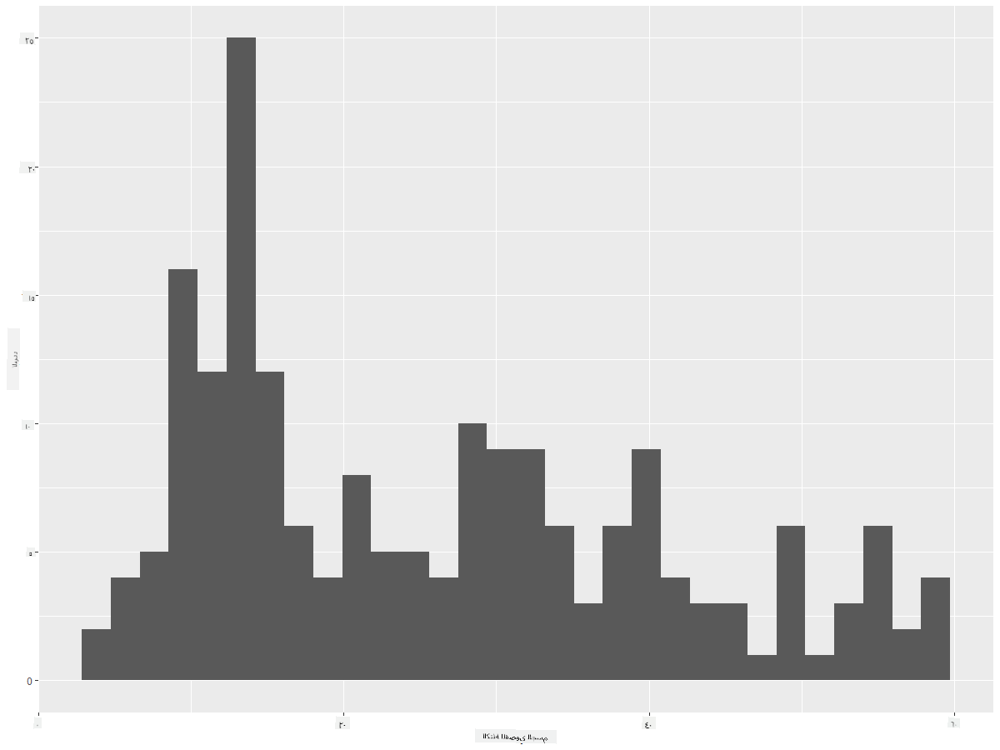
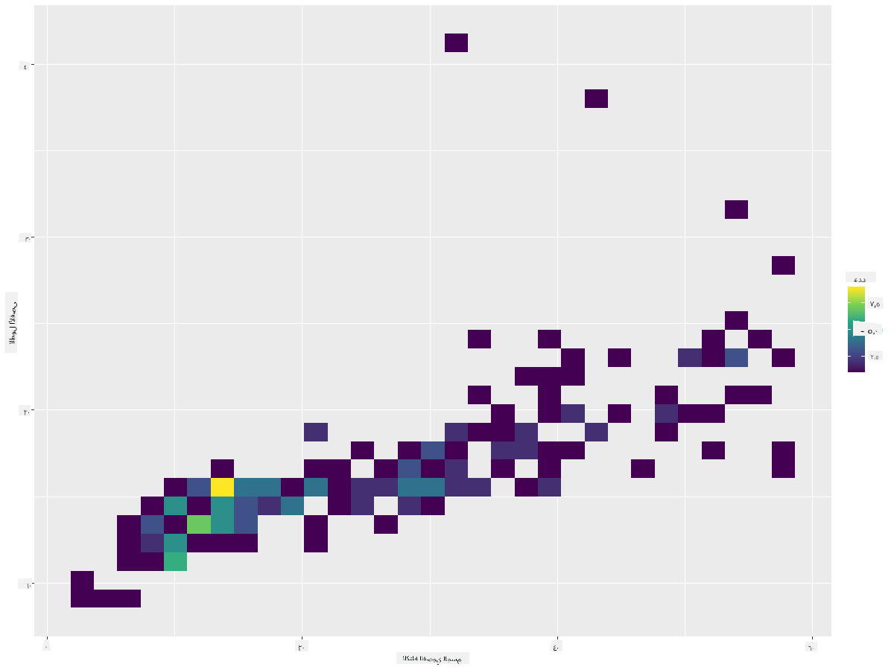
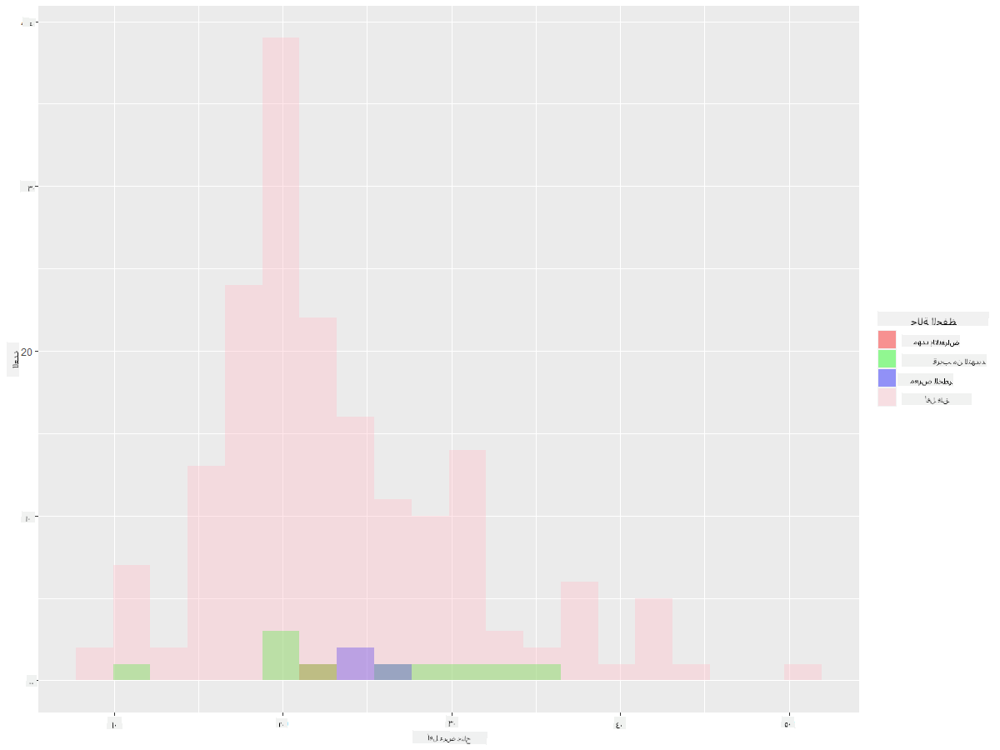
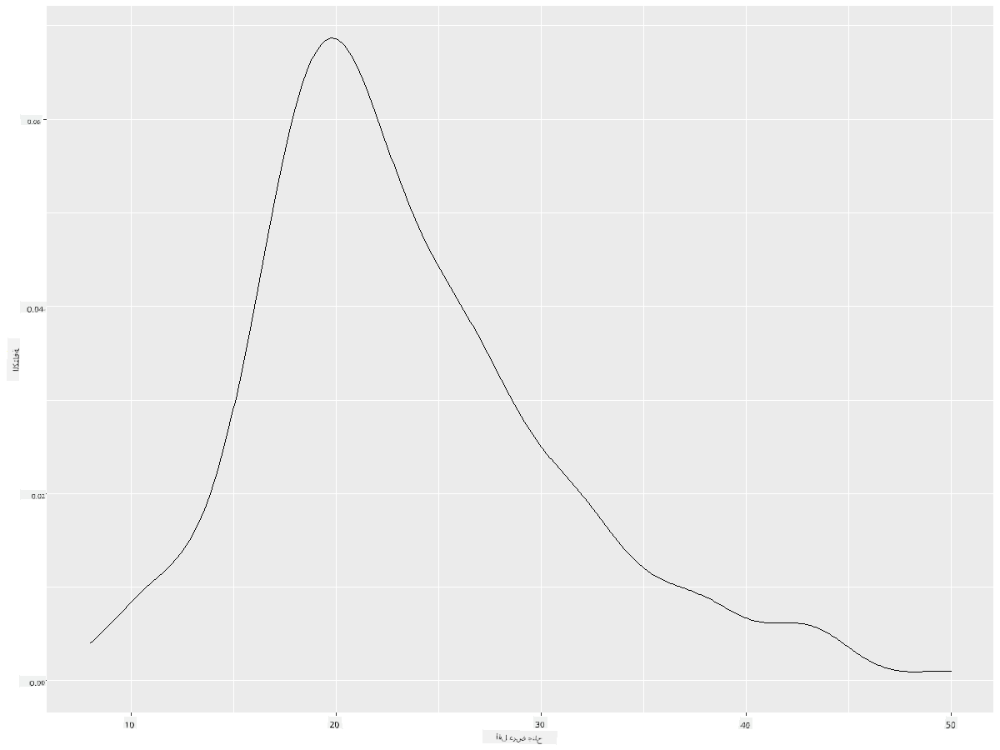
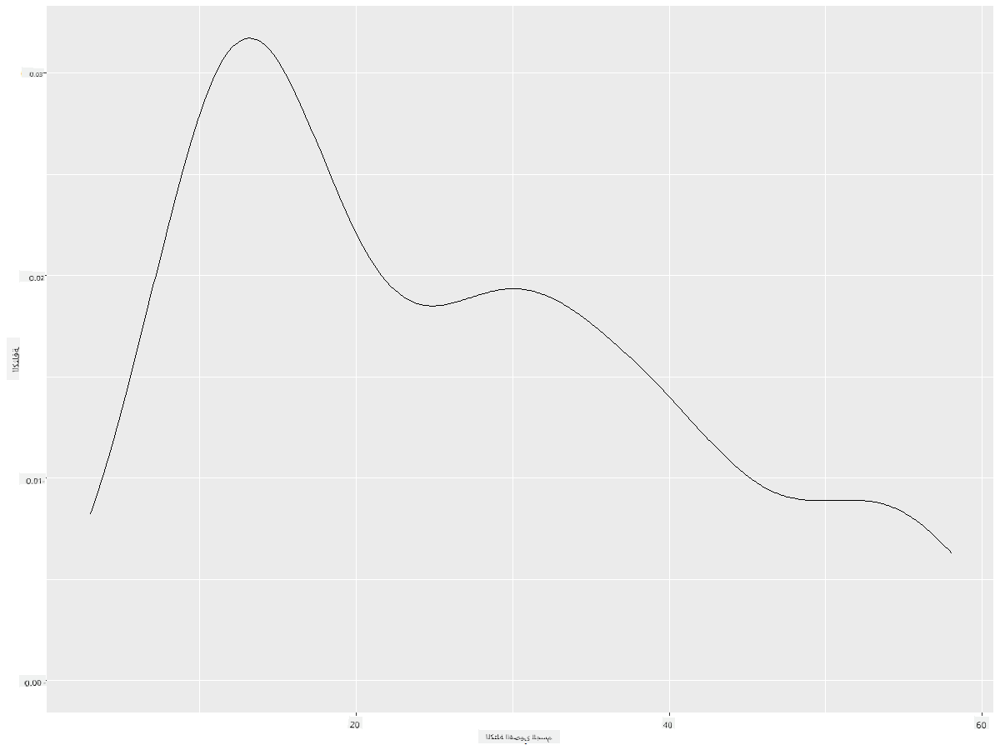
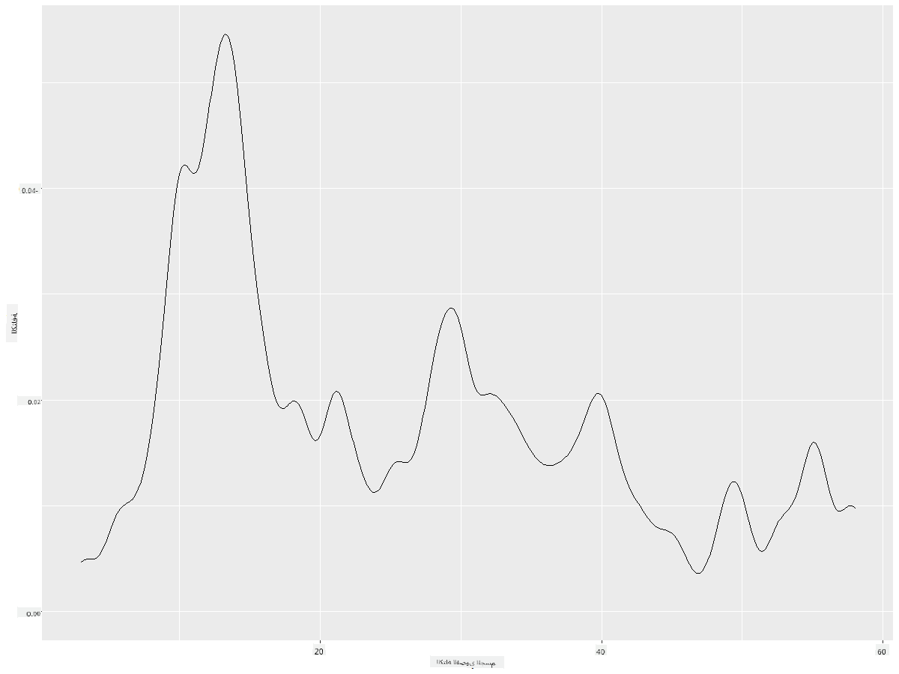
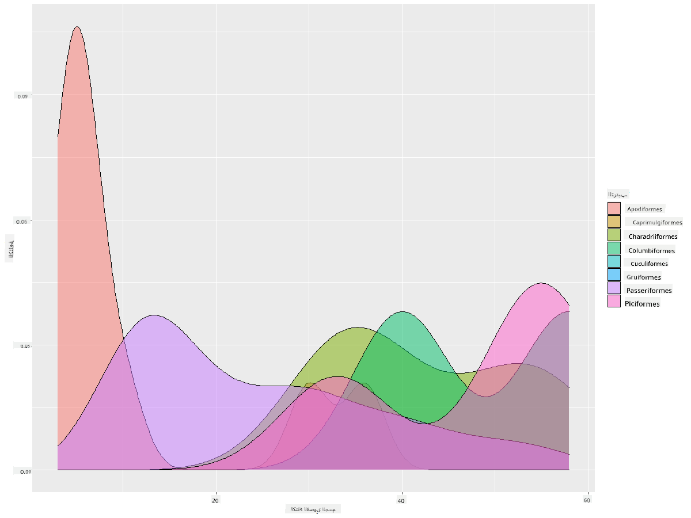

<!--
CO_OP_TRANSLATOR_METADATA:
{
  "original_hash": "ea67c0c40808fd723594de6896c37ccf",
  "translation_date": "2025-08-27T10:22:08+00:00",
  "source_file": "3-Data-Visualization/R/10-visualization-distributions/README.md",
  "language_code": "ar"
}
-->
# تصور التوزيعات

|](https://github.com/microsoft/Data-Science-For-Beginners/blob/main/sketchnotes/10-Visualizing-Distributions.png)|
|:---:|
| تصور التوزيعات - _رسم توضيحي من [@nitya](https://twitter.com/nitya)_ |

في الدرس السابق، تعلمت بعض الحقائق المثيرة حول مجموعة بيانات عن طيور مينيسوتا. اكتشفت بعض البيانات الخاطئة من خلال تصور القيم الشاذة ونظرت في الفروقات بين فئات الطيور بناءً على أطوالها القصوى.

## [اختبار قبل المحاضرة](https://purple-hill-04aebfb03.1.azurestaticapps.net/quiz/18)
## استكشاف مجموعة بيانات الطيور

طريقة أخرى للتعمق في البيانات هي النظر إلى توزيعها، أو كيفية تنظيم البيانات على محور معين. ربما، على سبيل المثال، ترغب في معرفة التوزيع العام، في هذه المجموعة من البيانات، لأقصى امتداد جناح أو أقصى كتلة جسم لطيور مينيسوتا.

دعنا نكتشف بعض الحقائق حول توزيعات البيانات في هذه المجموعة. في وحدة التحكم الخاصة بـ R، قم باستيراد `ggplot2` وقاعدة البيانات. قم بإزالة القيم الشاذة من قاعدة البيانات كما فعلت في الموضوع السابق.

```r
library(ggplot2)

birds <- read.csv("../../data/birds.csv",fileEncoding="UTF-8-BOM")

birds_filtered <- subset(birds, MaxWingspan < 500)
head(birds_filtered)
```
|      | الاسم                         | الاسم العلمي           | الفئة                 | الرتبة       | العائلة  | الجنس       | حالة الحفظ         | الطول الأدنى | الطول الأقصى | الكتلة الأدنى | الكتلة القصوى | امتداد الجناح الأدنى | امتداد الجناح الأقصى |
| ---: | :--------------------------- | :--------------------- | :-------------------- | :----------- | :------- | :---------- | :----------------- | --------: | --------: | ----------: | ----------: | ----------: | ----------: |
|    0 | بطة الصفير ذات البطن الأسود  | Dendrocygna autumnalis | البط/الإوز/طيور الماء | Anseriformes | Anatidae | Dendrocygna | LC                 |        47 |        56 |         652 |        1020 |          76 |          94 |
|    1 | بطة الصفير البنية            | Dendrocygna bicolor    | البط/الإوز/طيور الماء | Anseriformes | Anatidae | Dendrocygna | LC                 |        45 |        53 |         712 |        1050 |          85 |          93 |
|    2 | إوزة الثلج                   | Anser caerulescens     | البط/الإوز/طيور الماء | Anseriformes | Anatidae | Anser       | LC                 |        64 |        79 |        2050 |        4050 |         135 |         165 |
|    3 | إوزة روس                     | Anser rossii           | البط/الإوز/طيور الماء | Anseriformes | Anatidae | Anser       | LC                 |      57.3 |        64 |        1066 |        1567 |         113 |         116 |
|    4 | الإوزة البيضاء الأمامية الكبرى | Anser albifrons        | البط/الإوز/طيور الماء | Anseriformes | Anatidae | Anser       | LC                 |        64 |        81 |        1930 |        3310 |         130 |         165 |

بشكل عام، يمكنك بسرعة النظر إلى كيفية توزيع البيانات باستخدام مخطط الانتشار كما فعلنا في الدرس السابق:

```r
ggplot(data=birds_filtered, aes(x=Order, y=MaxLength,group=1)) +
  geom_point() +
  ggtitle("Max Length per order") + coord_flip()
```


يوفر هذا نظرة عامة على التوزيع العام لطول الجسم لكل رتبة من الطيور، ولكنه ليس الطريقة المثلى لعرض التوزيعات الحقيقية. عادةً ما يتم التعامل مع هذه المهمة من خلال إنشاء مخطط هيستوجرام.

## العمل مع الهيستوجرام

يوفر `ggplot2` طرقًا ممتازة لتصور توزيع البيانات باستخدام الهيستوجرام. هذا النوع من الرسوم البيانية يشبه الرسم البياني العمودي حيث يمكن رؤية التوزيع من خلال ارتفاع وانخفاض الأعمدة. لإنشاء هيستوجرام، تحتاج إلى بيانات رقمية. لإنشاء هيستوجرام، يمكنك رسم مخطط بتحديد النوع كـ 'hist' للهيستوجرام. يعرض هذا المخطط توزيع MaxBodyMass لنطاق البيانات الرقمية في المجموعة بأكملها. من خلال تقسيم مجموعة البيانات إلى صناديق أصغر، يمكنه عرض توزيع قيم البيانات:

```r
ggplot(data = birds_filtered, aes(x = MaxBodyMass)) + 
  geom_histogram(bins=10)+ylab('Frequency')
```


كما ترى، فإن معظم الطيور البالغ عددها 400+ في هذه المجموعة تقع في نطاق أقل من 2000 بالنسبة لأقصى كتلة جسم. احصل على مزيد من الفهم للبيانات عن طريق تغيير معلمة `bins` إلى رقم أعلى، مثل 30:

```r
ggplot(data = birds_filtered, aes(x = MaxBodyMass)) + geom_histogram(bins=30)+ylab('Frequency')
```


يعرض هذا المخطط التوزيع بطريقة أكثر تفصيلًا. يمكن إنشاء مخطط أقل انحرافًا إلى اليسار عن طريق التأكد من اختيار البيانات فقط ضمن نطاق معين:

قم بتصفية بياناتك للحصول فقط على الطيور التي تقل كتلة أجسامها عن 60، وأظهر 30 `bins`:

```r
birds_filtered_1 <- subset(birds_filtered, MaxBodyMass > 1 & MaxBodyMass < 60)
ggplot(data = birds_filtered_1, aes(x = MaxBodyMass)) + 
  geom_histogram(bins=30)+ylab('Frequency')
```



✅ جرب بعض الفلاتر ونقاط البيانات الأخرى. لرؤية التوزيع الكامل للبيانات، قم بإزالة الفلتر `['MaxBodyMass']` لعرض التوزيعات المسماة.

يوفر الهيستوجرام أيضًا تحسينات لطيفة في الألوان والتسمية لتجربتها:

قم بإنشاء هيستوجرام ثنائي الأبعاد لمقارنة العلاقة بين توزيعين. دعنا نقارن `MaxBodyMass` مقابل `MaxLength`. يوفر `ggplot2` طريقة مدمجة لإظهار التقارب باستخدام ألوان أكثر إشراقًا:

```r
ggplot(data=birds_filtered_1, aes(x=MaxBodyMass, y=MaxLength) ) +
  geom_bin2d() +scale_fill_continuous(type = "viridis")
```
يبدو أن هناك علاقة متوقعة بين هذين العنصرين على محور متوقع، مع نقطة تقارب قوية بشكل خاص:



تعمل الهيستوجرامات بشكل جيد افتراضيًا مع البيانات الرقمية. ماذا لو كنت بحاجة إلى رؤية التوزيعات وفقًا للبيانات النصية؟

## استكشاف مجموعة البيانات للتوزيعات باستخدام البيانات النصية

تتضمن هذه المجموعة أيضًا معلومات جيدة حول فئة الطيور وجنسها ونوعها وعائلتها بالإضافة إلى حالة الحفظ الخاصة بها. دعنا نتعمق في هذه المعلومات المتعلقة بالحفظ. ما هو توزيع الطيور وفقًا لحالة الحفظ الخاصة بها؟

> ✅ في مجموعة البيانات، يتم استخدام العديد من الاختصارات لوصف حالة الحفظ. تأتي هذه الاختصارات من [فئات القائمة الحمراء للاتحاد الدولي لحفظ الطبيعة](https://www.iucnredlist.org/)، وهي منظمة تصنف حالة الأنواع.
> 
> - CR: مهددة بالانقراض بشدة
> - EN: مهددة بالانقراض
> - EX: منقرضة
> - LC: أقل قلق
> - NT: قريبة من التهديد
> - VU: معرضة للخطر

هذه قيم نصية، لذا ستحتاج إلى إجراء تحويل لإنشاء هيستوجرام. باستخدام إطار البيانات filteredBirds، اعرض حالة الحفظ الخاصة به إلى جانب امتداد الجناح الأدنى. ماذا ترى؟

```r
birds_filtered_1$ConservationStatus[birds_filtered_1$ConservationStatus == 'EX'] <- 'x1' 
birds_filtered_1$ConservationStatus[birds_filtered_1$ConservationStatus == 'CR'] <- 'x2'
birds_filtered_1$ConservationStatus[birds_filtered_1$ConservationStatus == 'EN'] <- 'x3'
birds_filtered_1$ConservationStatus[birds_filtered_1$ConservationStatus == 'NT'] <- 'x4'
birds_filtered_1$ConservationStatus[birds_filtered_1$ConservationStatus == 'VU'] <- 'x5'
birds_filtered_1$ConservationStatus[birds_filtered_1$ConservationStatus == 'LC'] <- 'x6'

ggplot(data=birds_filtered_1, aes(x = MinWingspan, fill = ConservationStatus)) +
  geom_histogram(position = "identity", alpha = 0.4, bins = 20) +
  scale_fill_manual(name="Conservation Status",values=c("red","green","blue","pink"),labels=c("Endangered","Near Threathened","Vulnerable","Least Concern"))
```



لا يبدو أن هناك علاقة جيدة بين امتداد الجناح الأدنى وحالة الحفظ. اختبر عناصر أخرى من مجموعة البيانات باستخدام هذه الطريقة. يمكنك تجربة فلاتر مختلفة أيضًا. هل تجد أي علاقة؟

## مخططات الكثافة

قد تكون لاحظت أن الهيستوجرامات التي نظرنا إليها حتى الآن "متدرجة" ولا تتدفق بسلاسة في قوس. لإظهار مخطط كثافة أكثر سلاسة، يمكنك تجربة مخطط الكثافة.

دعنا نعمل الآن مع مخططات الكثافة!

```r
ggplot(data = birds_filtered_1, aes(x = MinWingspan)) + 
  geom_density()
```


يمكنك أن ترى كيف يعكس المخطط السابق بيانات امتداد الجناح الأدنى؛ إنه فقط أكثر سلاسة. إذا كنت ترغب في إعادة النظر في خط MaxBodyMass المتعرج في المخطط الثاني الذي أنشأته، يمكنك تنعيمه بشكل جيد جدًا عن طريق إعادة إنشائه باستخدام هذه الطريقة:

```r
ggplot(data = birds_filtered_1, aes(x = MaxBodyMass)) + 
  geom_density()
```


إذا كنت تريد خطًا ناعمًا، ولكن ليس ناعمًا جدًا، قم بتحرير معلمة `adjust`:

```r
ggplot(data = birds_filtered_1, aes(x = MaxBodyMass)) + 
  geom_density(adjust = 1/5)
```


✅ اقرأ عن المعلمات المتاحة لهذا النوع من المخططات وجربها!

يوفر هذا النوع من الرسوم البيانية تصورات تفسيرية جميلة. مع بضع أسطر من التعليمات البرمجية، على سبيل المثال، يمكنك عرض كثافة كتلة الجسم القصوى لكل رتبة من الطيور:

```r
ggplot(data=birds_filtered_1,aes(x = MaxBodyMass, fill = Order)) +
  geom_density(alpha=0.5)
```


## 🚀 تحدٍ

الهيستوجرامات هي نوع أكثر تطورًا من الرسوم البيانية مقارنة بمخططات الانتشار الأساسية أو الرسوم البيانية العمودية أو الرسوم البيانية الخطية. قم بالبحث على الإنترنت للعثور على أمثلة جيدة لاستخدام الهيستوجرامات. كيف يتم استخدامها، ماذا توضح، وفي أي مجالات أو مجالات استفسار يتم استخدامها عادةً؟

## [اختبار بعد المحاضرة](https://purple-hill-04aebfb03.1.azurestaticapps.net/quiz/19)

## المراجعة والدراسة الذاتية

في هذا الدرس، استخدمت `ggplot2` وبدأت العمل على عرض رسوم بيانية أكثر تطورًا. قم ببعض البحث حول `geom_density_2d()` وهو "منحنى كثافة احتمالية مستمرة في بعد واحد أو أكثر". اقرأ [التوثيق](https://ggplot2.tidyverse.org/reference/geom_density_2d.html) لفهم كيفية عمله.

## الواجب

[طبق مهاراتك](assignment.md)

---

**إخلاء المسؤولية**:  
تمت ترجمة هذا المستند باستخدام خدمة الترجمة الآلية [Co-op Translator](https://github.com/Azure/co-op-translator). بينما نسعى لتحقيق الدقة، يرجى العلم أن الترجمات الآلية قد تحتوي على أخطاء أو معلومات غير دقيقة. يجب اعتبار المستند الأصلي بلغته الأصلية هو المصدر الموثوق. للحصول على معلومات حساسة أو هامة، يُوصى بالاستعانة بترجمة بشرية احترافية. نحن غير مسؤولين عن أي سوء فهم أو تفسيرات خاطئة تنشأ عن استخدام هذه الترجمة.