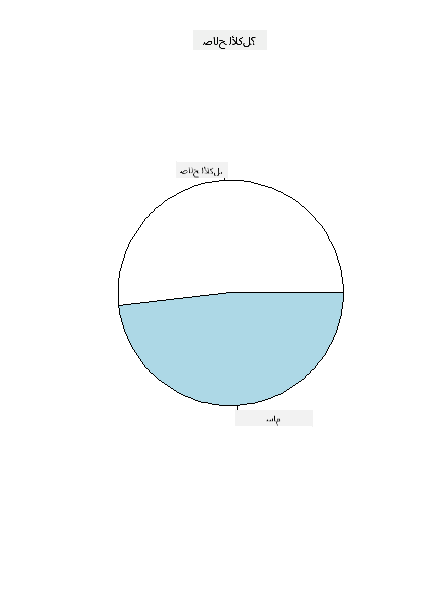
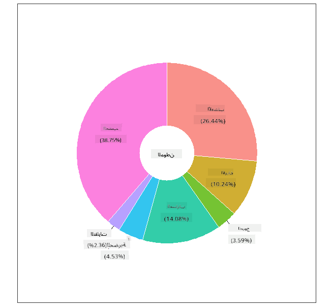
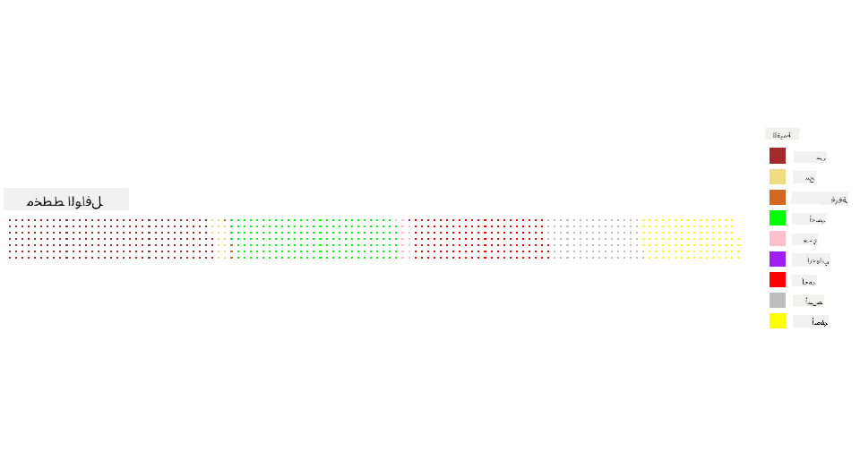

<!--
CO_OP_TRANSLATOR_METADATA:
{
  "original_hash": "47028abaaafa2bcb1079702d20569066",
  "translation_date": "2025-08-27T10:38:35+00:00",
  "source_file": "3-Data-Visualization/R/11-visualization-proportions/README.md",
  "language_code": "ar"
}
-->
# تصور النسب

| ](../../../sketchnotes/11-Visualizing-Proportions.png)|
|:---:|
|تصور النسب - _رسم توضيحي بواسطة [@nitya](https://twitter.com/nitya)_ |

في هذه الدرس، ستستخدم مجموعة بيانات تركز على الطبيعة لتصور النسب، مثل عدد الأنواع المختلفة من الفطريات التي تظهر في مجموعة بيانات عن الفطر. دعونا نستكشف هذه الفطريات المثيرة باستخدام مجموعة بيانات مأخوذة من Audubon تحتوي على تفاصيل حول 23 نوعًا من الفطر ذو الخياشيم في عائلتي Agaricus وLepiota. ستجرب تصورات شهية مثل:

- مخططات دائرية 🥧
- مخططات دونات 🍩
- مخططات وافل 🧇

> 💡 مشروع مثير للاهتمام يسمى [Charticulator](https://charticulator.com) من Microsoft Research يقدم واجهة مجانية تعتمد على السحب والإفلات لتصور البيانات. في أحد دروسهم التعليمية، يستخدمون أيضًا مجموعة بيانات الفطر هذه! لذا يمكنك استكشاف البيانات وتعلم المكتبة في نفس الوقت: [درس Charticulator](https://charticulator.com/tutorials/tutorial4.html).

## [اختبار ما قبل المحاضرة](https://purple-hill-04aebfb03.1.azurestaticapps.net/quiz/20)

## تعرف على الفطر الخاص بك 🍄

الفطر مثير جدًا للاهتمام. دعونا نستورد مجموعة بيانات لدراسته:

```r
mushrooms = read.csv('../../data/mushrooms.csv')
head(mushrooms)
```
يتم طباعة جدول يحتوي على بيانات رائعة للتحليل:


| الفئة     | شكل القبعة | سطح القبعة | لون القبعة | كدمات | الرائحة    | ارتباط الخياشيم | تباعد الخياشيم | حجم الخياشيم | لون الخياشيم | شكل الساق | جذر الساق | سطح الساق فوق الحلقة | سطح الساق تحت الحلقة | لون الساق فوق الحلقة | لون الساق تحت الحلقة | نوع الحجاب | لون الحجاب | عدد الحلقات | نوع الحلقة | لون طباعة الأبواغ | السكان | الموطن |
| --------- | --------- | ----------- | --------- | ------- | ------- | --------------- | ------------ | --------- | ---------- | ----------- | ---------- | ------------------------ | ------------------------ | ---------------------- | ---------------------- | --------- | ---------- | ----------- | --------- | ----------------- | ---------- | ------- |
| سام | محدب    | أملس      | بني     | كدمات | نفاذ | حر            | قريب        | ضيق    | أسود      | متسع   | متساوي      | أملس                   | أملس                   | أبيض                  | أبيض                  | جزئي   | أبيض      | واحد         | معلق   | أسود             | متناثر  | حضري   |
| صالح للأكل    | محدب    | أملس      | أصفر    | كدمات | لوزي  | حر            | قريب        | واسع     | أسود      | متسع   | مضرب       | أملس                   | أملس                   | أبيض                  | أبيض                  | جزئي   | أبيض      | واحد         | معلق   | بني             | كثير   | أعشاب |
| صالح للأكل    | جرس      | أملس      | أبيض     | كدمات | يانسون   | حر            | قريب        | واسع     | بني      | متسع   | مضرب       | أملس                   | أملس                   | أبيض                  | أبيض                  | جزئي   | أبيض      | واحد         | معلق   | بني             | كثير   | مروج |
| سام | محدب    | قشري       | أبيض     | كدمات | نفاذ | حر            | قريب        | ضيق    | بني      | متسع   | متساوي      | أملس                   | أملس                   | أبيض                  | أبيض                  | جزئي   | أبيض      | واحد         | معلق   | أسود             | متناثر  | حضري 
| صالح للأكل | محدب       |أملس       | أخضر     | بدون كدمات| لا شيء   |حر            | مزدحم       | واسع     | أسود      | مدبب   | متساوي      |  أملس | أملس                    | أبيض                 | أبيض                  | جزئي    | أبيض     | واحد         | زائل | بني             | وفير | أعشاب
|صالح للأكل  |  محدب      | قشري   | أصفر         | كدمات  | لوزي  | حر | قريب  |   واسع   |   بني  | متسع   |   مضرب                      | أملس                  | أملس    | أبيض                 |  أبيض                | جزئي      | أبيض    |  واحد  |  معلق | أسود   | كثير | أعشاب
      
على الفور، تلاحظ أن جميع البيانات نصية. ستحتاج إلى تحويل هذه البيانات لتتمكن من استخدامها في مخطط. في الواقع، معظم البيانات ممثلة ككائن:

```r
names(mushrooms)
```

الناتج هو:

```output
[1] "class"                    "cap.shape"               
 [3] "cap.surface"              "cap.color"               
 [5] "bruises"                  "odor"                    
 [7] "gill.attachment"          "gill.spacing"            
 [9] "gill.size"                "gill.color"              
[11] "stalk.shape"              "stalk.root"              
[13] "stalk.surface.above.ring" "stalk.surface.below.ring"
[15] "stalk.color.above.ring"   "stalk.color.below.ring"  
[17] "veil.type"                "veil.color"              
[19] "ring.number"              "ring.type"               
[21] "spore.print.color"        "population"              
[23] "habitat"            
```
خذ هذه البيانات وحوّل العمود 'الفئة' إلى فئة:

```r
library(dplyr)
grouped=mushrooms %>%
  group_by(class) %>%
  summarise(count=n())
```


الآن، إذا قمت بطباعة بيانات الفطر، يمكنك رؤية أنها تم تجميعها في فئات وفقًا لفئة السام/الصالح للأكل:
```r
View(grouped)
```


| الفئة | العدد |
| --------- | --------- |
| صالح للأكل | 4208 |
| سام| 3916 |


إذا اتبعت الترتيب المقدم في هذا الجدول لإنشاء تسميات فئة الفئة، يمكنك إنشاء مخطط دائري.

## دائري!

```r
pie(grouped$count,grouped$class, main="Edible?")
```
ها هو، مخطط دائري يظهر نسب هذه البيانات وفقًا لهاتين الفئتين من الفطر. من المهم جدًا الحصول على ترتيب التسميات بشكل صحيح، خاصة هنا، لذا تأكد من التحقق من الترتيب الذي يتم بناء مصفوفة التسميات به!



## دونات!

مخطط دائري أكثر إثارة بصريًا هو مخطط دونات، وهو مخطط دائري مع ثقب في المنتصف. دعونا نلقي نظرة على بياناتنا باستخدام هذه الطريقة.

ألقِ نظرة على الموائل المختلفة حيث ينمو الفطر:

```r
library(dplyr)
habitat=mushrooms %>%
  group_by(habitat) %>%
  summarise(count=n())
View(habitat)
```
الناتج هو:
| الموطن| العدد |
| --------- | --------- |
| أعشاب    | 2148 |
| أوراق| 832 |
| مروج    | 292 |
| مسارات| 1144 |
| حضري    | 368 |
| نفايات| 192 |
| خشب| 3148 |


هنا، تقوم بتجميع بياناتك حسب الموطن. هناك 7 موائل مدرجة، لذا استخدمها كتسميات لمخطط الدونات الخاص بك:

```r
library(ggplot2)
library(webr)
PieDonut(habitat, aes(habitat, count=count))
```



يستخدم هذا الكود المكتبتين - ggplot2 وwebr. باستخدام وظيفة PieDonut من مكتبة webr، يمكننا إنشاء مخطط دونات بسهولة!

يمكن أيضًا إنشاء مخططات دونات في R باستخدام مكتبة ggplot2 فقط. يمكنك معرفة المزيد عنها [هنا](https://www.r-graph-gallery.com/128-ring-or-donut-plot.html) وتجربتها بنفسك.

الآن بعد أن تعرفت على كيفية تجميع بياناتك ثم عرضها كمخطط دائري أو دونات، يمكنك استكشاف أنواع أخرى من المخططات. جرب مخطط وافل، وهو مجرد طريقة مختلفة لاستكشاف الكمية.
## وافل!

مخطط من نوع 'وافل' هو طريقة مختلفة لتصور الكميات كمصفوفة ثنائية الأبعاد من المربعات. جرب تصور الكميات المختلفة لألوان قبعات الفطر في هذه المجموعة البيانات. للقيام بذلك، تحتاج إلى تثبيت مكتبة مساعدة تسمى [waffle](https://cran.r-project.org/web/packages/waffle/waffle.pdf) واستخدامها لإنشاء تصورك:

```r
install.packages("waffle", repos = "https://cinc.rud.is")
```

اختر جزءًا من بياناتك لتجميعه:

```r
library(dplyr)
cap_color=mushrooms %>%
  group_by(cap.color) %>%
  summarise(count=n())
View(cap_color)
```

قم بإنشاء مخطط وافل عن طريق إنشاء تسميات ثم تجميع بياناتك:

```r
library(waffle)
names(cap_color$count) = paste0(cap_color$cap.color)
waffle((cap_color$count/10), rows = 7, title = "Waffle Chart")+scale_fill_manual(values=c("brown", "#F0DC82", "#D2691E", "green", 
                                                                                     "pink", "purple", "red", "grey", 
                                                                                     "yellow","white"))
```

باستخدام مخطط وافل، يمكنك رؤية نسب ألوان قبعات الفطر في هذه المجموعة البيانات بوضوح. من المثير للاهتمام أن هناك العديد من الفطر ذو القبعات الخضراء!



في هذه الدرس، تعلمت ثلاث طرق لتصور النسب. أولاً، تحتاج إلى تجميع بياناتك في فئات ثم تقرر الطريقة الأفضل لعرض البيانات - دائري، دونات، أو وافل. جميعها لذيذة وتمنح المستخدم لمحة فورية عن مجموعة البيانات.

## 🚀 تحدي

حاول إعادة إنشاء هذه المخططات الشهية في [Charticulator](https://charticulator.com).
## [اختبار ما بعد المحاضرة](https://purple-hill-04aebfb03.1.azurestaticapps.net/quiz/21)

## المراجعة والدراسة الذاتية

في بعض الأحيان، ليس من الواضح متى يجب استخدام مخطط دائري، دونات، أو وافل. إليك بعض المقالات لقراءتها حول هذا الموضوع:

https://www.beautiful.ai/blog/battle-of-the-charts-pie-chart-vs-donut-chart

https://medium.com/@hypsypops/pie-chart-vs-donut-chart-showdown-in-the-ring-5d24fd86a9ce

https://www.mit.edu/~mbarker/formula1/f1help/11-ch-c6.htm

https://medium.datadriveninvestor.com/data-visualization-done-the-right-way-with-tableau-waffle-chart-fdf2a19be402

قم ببعض البحث للعثور على المزيد من المعلومات حول هذا القرار الصعب.
## المهمة

[جربها في Excel](assignment.md)

---

**إخلاء المسؤولية**:  
تمت ترجمة هذا المستند باستخدام خدمة الترجمة الآلية [Co-op Translator](https://github.com/Azure/co-op-translator). بينما نسعى لتحقيق الدقة، يرجى العلم أن الترجمات الآلية قد تحتوي على أخطاء أو معلومات غير دقيقة. يجب اعتبار المستند الأصلي بلغته الأصلية هو المصدر الموثوق. للحصول على معلومات حساسة أو هامة، يُوصى بالاستعانة بترجمة بشرية احترافية. نحن غير مسؤولين عن أي سوء فهم أو تفسيرات خاطئة تنشأ عن استخدام هذه الترجمة.