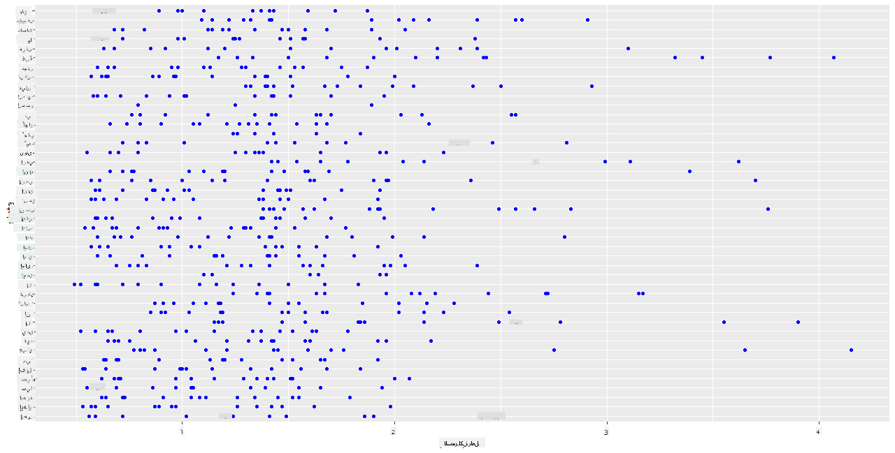
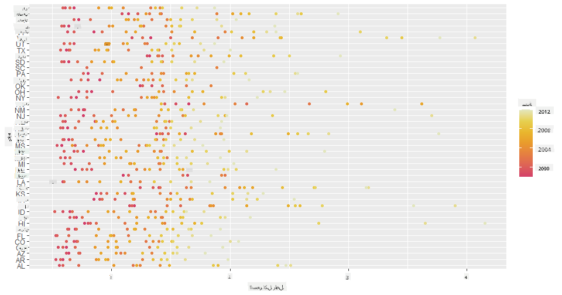
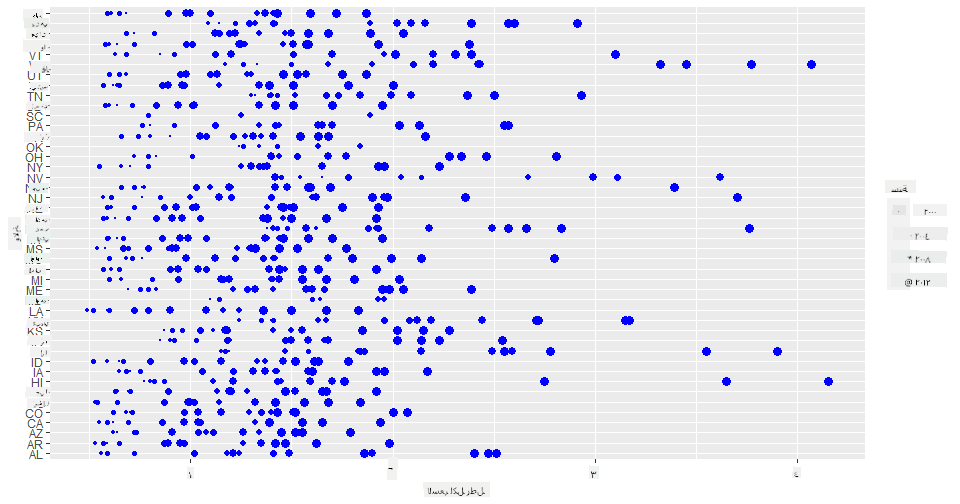
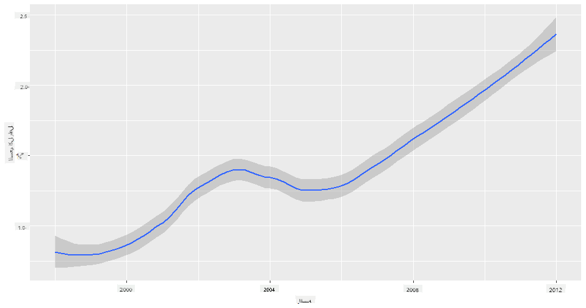
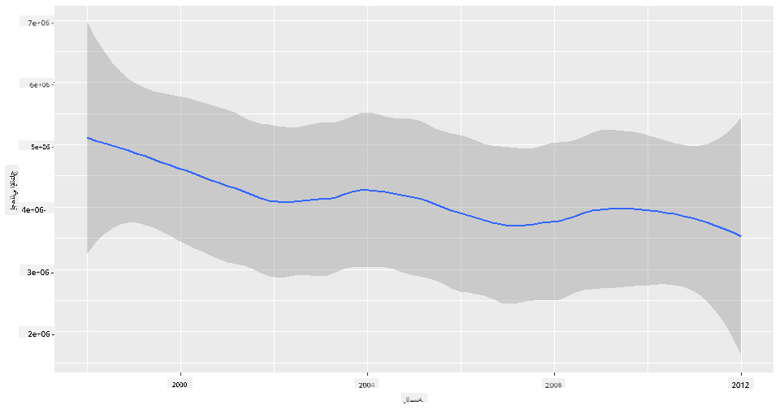
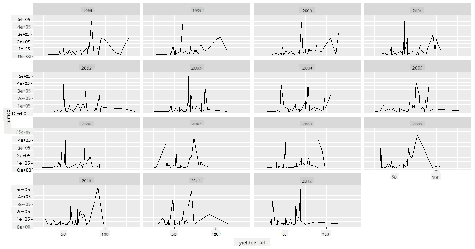
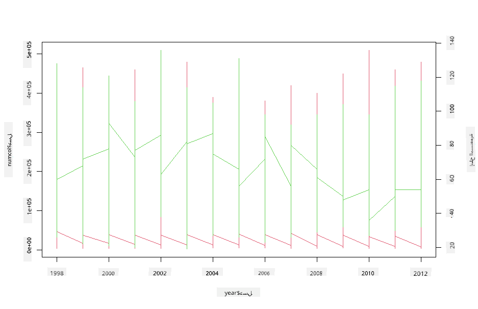

<!--
CO_OP_TRANSLATOR_METADATA:
{
  "original_hash": "a33c5d4b4156a2b41788d8720b6f724c",
  "translation_date": "2025-08-27T10:25:30+00:00",
  "source_file": "3-Data-Visualization/R/12-visualization-relationships/README.md",
  "language_code": "ar"
}
-->
# تصور العلاقات: كل شيء عن العسل 🍯

| ](../../../sketchnotes/12-Visualizing-Relationships.png)|
|:---:|
|تصور العلاقات - _رسم توضيحي بواسطة [@nitya](https://twitter.com/nitya)_ |

استمرارًا في التركيز على الطبيعة في بحثنا، دعونا نستكشف تصورات مثيرة للاهتمام لعرض العلاقات بين أنواع العسل المختلفة، وفقًا لمجموعة بيانات مستمدة من [وزارة الزراعة الأمريكية](https://www.nass.usda.gov/About_NASS/index.php).

تتضمن هذه المجموعة حوالي 600 عنصر تعرض إنتاج العسل في العديد من الولايات الأمريكية. على سبيل المثال، يمكنك الاطلاع على عدد المستعمرات، الإنتاج لكل مستعمرة، الإنتاج الإجمالي، المخزون، السعر لكل رطل، وقيمة العسل المنتج في ولاية معينة من عام 1998 إلى 2012، مع صف واحد لكل سنة لكل ولاية.

سيكون من المثير تصور العلاقة بين إنتاج ولاية معينة سنويًا وبين، على سبيل المثال، سعر العسل في تلك الولاية. أو بدلاً من ذلك، يمكنك تصور العلاقة بين إنتاج العسل لكل مستعمرة في الولايات المختلفة. تغطي هذه الفترة الزمنية ظهور اضطراب انهيار المستعمرات (CCD) لأول مرة في عام 2006 (http://npic.orst.edu/envir/ccd.html)، مما يجعلها مجموعة بيانات مؤثرة للدراسة. 🐝

## [اختبار ما قبل المحاضرة](https://purple-hill-04aebfb03.1.azurestaticapps.net/quiz/22)

في هذه الدرس، يمكنك استخدام ggplot2، الذي استخدمته من قبل، كمكتبة جيدة لتصور العلاقات بين المتغيرات. من الأمور المثيرة للاهتمام استخدام دالة `geom_point` و `qplot` في ggplot2 التي تسمح بإنشاء مخططات التبعثر والخطوط بسرعة لتصور '[العلاقات الإحصائية](https://ggplot2.tidyverse.org/)'، مما يساعد عالم البيانات على فهم كيفية ارتباط المتغيرات ببعضها البعض.

## مخططات التبعثر

استخدم مخطط التبعثر لعرض كيفية تطور سعر العسل عامًا بعد عام لكل ولاية. ggplot2، باستخدام `ggplot` و `geom_point`، يقوم بتجميع بيانات الولايات وعرض نقاط البيانات لكل من البيانات الفئوية والرقمية بسهولة.

لنبدأ باستيراد البيانات وSeaborn:

```r
honey=read.csv('../../data/honey.csv')
head(honey)
```
تلاحظ أن بيانات العسل تحتوي على عدة أعمدة مثيرة للاهتمام، بما في ذلك السنة والسعر لكل رطل. دعونا نستكشف هذه البيانات، مجمعة حسب الولايات الأمريكية:

| الولاية | عدد المستعمرات | الإنتاج لكل مستعمرة | الإنتاج الإجمالي | المخزون | السعر لكل رطل | قيمة الإنتاج | السنة |
| -------- | -------------- | -------------------- | ----------------- | ------- | ------------- | ------------ | ----- |
| AL       | 16000          | 71                  | 1136000           | 159000  | 0.72          | 818000       | 1998  |
| AZ       | 55000          | 60                  | 3300000           | 1485000 | 0.64          | 2112000      | 1998  |
| AR       | 53000          | 65                  | 3445000           | 1688000 | 0.59          | 2033000      | 1998  |
| CA       | 450000         | 83                  | 37350000          | 12326000| 0.62          | 23157000     | 1998  |
| CO       | 27000          | 72                  | 1944000           | 1594000 | 0.7           | 1361000      | 1998  |
| FL       | 230000         | 98                  | 22540000          | 4508000 | 0.64          | 14426000     | 1998  |

قم بإنشاء مخطط تبعثر أساسي لعرض العلاقة بين السعر لكل رطل من العسل وولاية المنشأ. اجعل محور `y` طويلًا بما يكفي لعرض جميع الولايات:

```r
library(ggplot2)
ggplot(honey, aes(x = priceperlb, y = state)) +
  geom_point(colour = "blue")
```


الآن، اعرض نفس البيانات باستخدام نظام ألوان العسل لإظهار كيفية تطور السعر على مر السنين. يمكنك القيام بذلك عن طريق إضافة معامل 'scale_color_gradientn' لإظهار التغيير عامًا بعد عام:

> ✅ تعرف على المزيد حول [scale_color_gradientn](https://www.rdocumentation.org/packages/ggplot2/versions/0.9.1/topics/scale_colour_gradientn) - جرب نظام ألوان قوس قزح الجميل!

```r
ggplot(honey, aes(x = priceperlb, y = state, color=year)) +
  geom_point()+scale_color_gradientn(colours = colorspace::heat_hcl(7))
```


مع هذا التغيير في نظام الألوان، يمكنك أن ترى بوضوح تقدمًا قويًا على مر السنين فيما يتعلق بسعر العسل لكل رطل. بالفعل، إذا نظرت إلى مجموعة بيانات عينة للتحقق (اختر ولاية معينة، مثل أريزونا)، يمكنك رؤية نمط زيادة الأسعار عامًا بعد عام، مع بعض الاستثناءات:

| الولاية | عدد المستعمرات | الإنتاج لكل مستعمرة | الإنتاج الإجمالي | المخزون | السعر لكل رطل | قيمة الإنتاج | السنة |
| -------- | -------------- | -------------------- | ----------------- | ------- | ------------- | ------------ | ----- |
| AZ       | 55000          | 60                  | 3300000           | 1485000 | 0.64          | 2112000      | 1998  |
| AZ       | 52000          | 62                  | 3224000           | 1548000 | 0.62          | 1999000      | 1999  |
| AZ       | 40000          | 59                  | 2360000           | 1322000 | 0.73          | 1723000      | 2000  |
| AZ       | 43000          | 59                  | 2537000           | 1142000 | 0.72          | 1827000      | 2001  |
| AZ       | 38000          | 63                  | 2394000           | 1197000 | 1.08          | 2586000      | 2002  |
| AZ       | 35000          | 72                  | 2520000           | 983000  | 1.34          | 3377000      | 2003  |
| AZ       | 32000          | 55                  | 1760000           | 774000  | 1.11          | 1954000      | 2004  |
| AZ       | 36000          | 50                  | 1800000           | 720000  | 1.04          | 1872000      | 2005  |
| AZ       | 30000          | 65                  | 1950000           | 839000  | 0.91          | 1775000      | 2006  |
| AZ       | 30000          | 64                  | 1920000           | 902000  | 1.26          | 2419000      | 2007  |
| AZ       | 25000          | 64                  | 1600000           | 336000  | 1.26          | 2016000      | 2008  |
| AZ       | 20000          | 52                  | 1040000           | 562000  | 1.45          | 1508000      | 2009  |
| AZ       | 24000          | 77                  | 1848000           | 665000  | 1.52          | 2809000      | 2010  |
| AZ       | 23000          | 53                  | 1219000           | 427000  | 1.55          | 1889000      | 2011  |
| AZ       | 22000          | 46                  | 1012000           | 253000  | 1.79          | 1811000      | 2012  |

طريقة أخرى لتصور هذا التقدم هي استخدام الحجم بدلاً من اللون. بالنسبة للمستخدمين الذين يعانون من عمى الألوان، قد يكون هذا خيارًا أفضل. قم بتعديل التصور لإظهار زيادة السعر من خلال زيادة محيط النقاط:

```r
ggplot(honey, aes(x = priceperlb, y = state)) +
  geom_point(aes(size = year),colour = "blue") +
  scale_size_continuous(range = c(0.25, 3))
```
يمكنك رؤية حجم النقاط يزداد تدريجيًا.



هل هذا مجرد حالة بسيطة من العرض والطلب؟ بسبب عوامل مثل تغير المناخ وانهيار المستعمرات، هل هناك كمية أقل من العسل المتاحة للشراء عامًا بعد عام، وبالتالي يرتفع السعر؟

لاكتشاف علاقة بين بعض المتغيرات في هذه المجموعة من البيانات، دعونا نستكشف بعض المخططات الخطية.

## المخططات الخطية

السؤال: هل هناك ارتفاع واضح في سعر العسل لكل رطل عامًا بعد عام؟ يمكنك اكتشاف ذلك بسهولة عن طريق إنشاء مخطط خطي واحد:

```r
qplot(honey$year,honey$priceperlb, geom='smooth', span =0.5, xlab = "year",ylab = "priceperlb")
```
الإجابة: نعم، مع بعض الاستثناءات حول عام 2003:



السؤال: حسنًا، في عام 2003 هل يمكننا أيضًا رؤية زيادة في كمية العسل المتوفرة؟ ماذا لو نظرت إلى الإنتاج الإجمالي عامًا بعد عام؟

```python
qplot(honey$year,honey$totalprod, geom='smooth', span =0.5, xlab = "year",ylab = "totalprod")
```



الإجابة: ليس حقًا. إذا نظرت إلى الإنتاج الإجمالي، يبدو أنه قد زاد في ذلك العام بالذات، على الرغم من أن كمية العسل المنتجة عمومًا كانت في انخفاض خلال هذه السنوات.

السؤال: في هذه الحالة، ما الذي يمكن أن يكون قد تسبب في ارتفاع سعر العسل حول عام 2003؟

لاكتشاف ذلك، يمكنك استكشاف شبكة الأوجه.

## شبكات الأوجه

تأخذ شبكات الأوجه جانبًا واحدًا من مجموعة البيانات (في حالتنا، يمكنك اختيار 'السنة' لتجنب إنتاج عدد كبير جدًا من الأوجه). يمكن لـ Seaborn بعد ذلك إنشاء مخطط لكل من هذه الأوجه للإحداثيات x و y التي اخترتها للمقارنة بسهولة. هل يبرز عام 2003 في هذا النوع من المقارنة؟

قم بإنشاء شبكة أوجه باستخدام `facet_wrap` كما هو موصى به في [وثائق ggplot2](https://ggplot2.tidyverse.org/reference/facet_wrap.html).

```r
ggplot(honey, aes(x=yieldpercol, y = numcol,group = 1)) + 
  geom_line() + facet_wrap(vars(year))
```
في هذا التصور، يمكنك مقارنة الإنتاج لكل مستعمرة وعدد المستعمرات عامًا بعد عام جنبًا إلى جنب مع التفاف مضبوط على 3 للأعمدة:



بالنسبة لهذه المجموعة من البيانات، لا يبرز أي شيء بشكل خاص فيما يتعلق بعدد المستعمرات وإنتاجها، عامًا بعد عام وولاية بعد ولاية. هل هناك طريقة مختلفة للنظر في إيجاد علاقة بين هذين المتغيرين؟

## مخططات الخطوط المزدوجة

جرب مخططًا متعدد الخطوط عن طريق وضع مخططين خطيين فوق بعضهما البعض، باستخدام دالتي `par` و `plot` في R. سنقوم برسم السنة على المحور x وعرض محورين y. لذا، عرض الإنتاج لكل مستعمرة وعدد المستعمرات، متراكبين:

```r
par(mar = c(5, 4, 4, 4) + 0.3)              
plot(honey$year, honey$numcol, pch = 16, col = 2,type="l")              
par(new = TRUE)                             
plot(honey$year, honey$yieldpercol, pch = 17, col = 3,              
     axes = FALSE, xlab = "", ylab = "",type="l")
axis(side = 4, at = pretty(range(y2)))      
mtext("colony yield", side = 4, line = 3)   
```


بينما لا يبرز شيء للعين حول عام 2003، فإنه يسمح لنا بإنهاء هذا الدرس بملاحظة أكثر سعادة: على الرغم من وجود انخفاض عام في عدد المستعمرات، فإن عدد المستعمرات يستقر حتى لو كان إنتاجها لكل مستعمرة يتناقص.

هيا، أيها النحل، هيا!

🐝❤️
## 🚀 التحدي

في هذا الدرس، تعلمت المزيد عن استخدامات مخططات التبعثر وشبكات الخطوط، بما في ذلك شبكات الأوجه. تحدى نفسك لإنشاء شبكة أوجه باستخدام مجموعة بيانات مختلفة، ربما واحدة استخدمتها قبل هذه الدروس. لاحظ الوقت الذي تستغرقه لإنشائها وكيف تحتاج إلى أن تكون حذرًا بشأن عدد الشبكات التي تحتاج إلى رسمها باستخدام هذه التقنيات.
## [اختبار ما بعد المحاضرة](https://purple-hill-04aebfb03.1.azurestaticapps.net/quiz/23)

## المراجعة والدراسة الذاتية

يمكن أن تكون المخططات الخطية بسيطة أو معقدة للغاية. قم ببعض القراءة في [وثائق ggplot2](https://ggplot2.tidyverse.org/reference/geom_path.html#:~:text=geom_line()%20connects%20them%20in,which%20cases%20are%20connected%20together) حول الطرق المختلفة التي يمكنك من خلالها بناؤها. حاول تحسين المخططات الخطية التي أنشأتها في هذا الدرس باستخدام طرق أخرى مدرجة في الوثائق.
## الواجب

[استكشف خلية النحل](assignment.md)

---

**إخلاء المسؤولية**:  
تمت ترجمة هذا المستند باستخدام خدمة الترجمة الآلية [Co-op Translator](https://github.com/Azure/co-op-translator). بينما نسعى لتحقيق الدقة، يرجى العلم أن الترجمات الآلية قد تحتوي على أخطاء أو معلومات غير دقيقة. يجب اعتبار المستند الأصلي بلغته الأصلية هو المصدر الموثوق. للحصول على معلومات حساسة أو هامة، يُوصى بالاستعانة بترجمة بشرية احترافية. نحن غير مسؤولين عن أي سوء فهم أو تفسيرات خاطئة تنشأ عن استخدام هذه الترجمة.