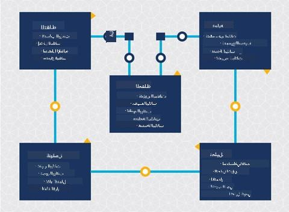
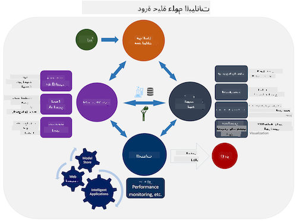
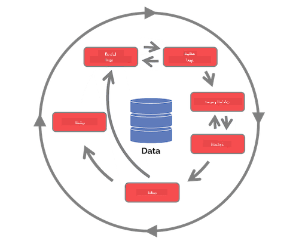

<!--
CO_OP_TRANSLATOR_METADATA:
{
  "original_hash": "07e12a25d20b8f191e3cb651c27fdb2b",
  "translation_date": "2025-09-06T20:20:21+00:00",
  "source_file": "4-Data-Science-Lifecycle/14-Introduction/README.md",
  "language_code": "ar"
}
-->
# مقدمة في دورة حياة علم البيانات

| ](../../sketchnotes/14-DataScience-Lifecycle.png)|
|:---:|
| مقدمة في دورة حياة علم البيانات - _رسم توضيحي بواسطة [@nitya](https://twitter.com/nitya)_ |

## [اختبار ما قبل المحاضرة](https://ff-quizzes.netlify.app/en/ds/quiz/26)

في هذه المرحلة، ربما أدركت أن علم البيانات هو عملية. يمكن تقسيم هذه العملية إلى خمس مراحل:

- الالتقاط
- المعالجة
- التحليل
- التواصل
- الصيانة

تركز هذه الدرس على ثلاثة أجزاء من دورة الحياة: الالتقاط، المعالجة، والصيانة.

> صورة بواسطة [Berkeley School of Information](https://ischoolonline.berkeley.edu/data-science/what-is-data-science/)

## الالتقاط

المرحلة الأولى من دورة الحياة مهمة جدًا لأن المراحل التالية تعتمد عليها. عمليًا، هي مرحلتان مدمجتان في واحدة: الحصول على البيانات وتحديد الغرض والمشاكل التي تحتاج إلى معالجة.  
تحديد أهداف المشروع يتطلب فهمًا أعمق للمشكلة أو السؤال. أولاً، نحتاج إلى تحديد وجمع الأشخاص الذين يحتاجون إلى حل مشكلتهم. قد يكون هؤلاء أصحاب المصلحة في الأعمال التجارية أو رعاة المشروع، الذين يمكنهم المساعدة في تحديد من أو ما سيستفيد من هذا المشروع وكذلك ما ولماذا يحتاجونه. يجب أن يكون الهدف المحدد جيدًا قابلاً للقياس والكمي لتحديد نتيجة مقبولة.

أسئلة قد يطرحها عالم البيانات:
- هل تم تناول هذه المشكلة من قبل؟ ماذا تم اكتشافه؟
- هل الغرض والهدف مفهوم من قبل جميع الأطراف المعنية؟
- هل هناك غموض وكيف يمكن تقليله؟
- ما هي القيود؟
- كيف يمكن أن يبدو الناتج النهائي؟
- ما هي الموارد (الوقت، الأشخاص، الحوسبة) المتاحة؟

بعد ذلك، يتم تحديد البيانات المطلوبة، جمعها، وأخيرًا استكشافها لتحقيق هذه الأهداف المحددة. في هذه الخطوة من الحصول على البيانات، يجب على علماء البيانات أيضًا تقييم كمية وجودة البيانات. يتطلب ذلك بعض استكشاف البيانات للتأكد من أن ما تم جمعه سيدعم الوصول إلى النتيجة المرجوة.

أسئلة قد يطرحها عالم البيانات حول البيانات:
- ما هي البيانات المتوفرة لدي بالفعل؟
- من يملك هذه البيانات؟
- ما هي مخاوف الخصوصية؟
- هل لدي ما يكفي لحل هذه المشكلة؟
- هل جودة البيانات مقبولة لهذه المشكلة؟
- إذا اكتشفت معلومات إضافية من خلال هذه البيانات، هل يجب أن نأخذ في الاعتبار تغيير أو إعادة تعريف الأهداف؟

## المعالجة

تركز مرحلة المعالجة في دورة الحياة على اكتشاف الأنماط في البيانات وكذلك النمذجة. تتطلب بعض التقنيات المستخدمة في مرحلة المعالجة طرقًا إحصائية للكشف عن الأنماط. عادةً، ستكون هذه مهمة شاقة للإنسان عند التعامل مع مجموعة بيانات كبيرة، لذا يتم الاعتماد على الحواسيب لتسريع العملية. هذه المرحلة هي أيضًا حيث يتقاطع علم البيانات مع التعلم الآلي. كما تعلمت في الدرس الأول، التعلم الآلي هو عملية بناء نماذج لفهم البيانات. النماذج هي تمثيل للعلاقة بين المتغيرات في البيانات التي تساعد في التنبؤ بالنتائج.

التقنيات الشائعة المستخدمة في هذه المرحلة مغطاة في منهج التعلم الآلي للمبتدئين. تابع الروابط لمعرفة المزيد عنها:

- [التصنيف](https://github.com/microsoft/ML-For-Beginners/tree/main/4-Classification): تنظيم البيانات في فئات لاستخدام أكثر كفاءة.
- [التجميع](https://github.com/microsoft/ML-For-Beginners/tree/main/5-Clustering): تجميع البيانات في مجموعات متشابهة.
- [الانحدار](https://github.com/microsoft/ML-For-Beginners/tree/main/2-Regression): تحديد العلاقات بين المتغيرات للتنبؤ أو التوقع بالقيم.

## الصيانة

في الرسم البياني لدورة الحياة، قد تكون لاحظت أن الصيانة تقع بين الالتقاط والمعالجة. الصيانة هي عملية مستمرة لإدارة البيانات وتخزينها وتأمينها طوال عملية المشروع ويجب أخذها في الاعتبار طوال مدة المشروع.

### تخزين البيانات

يمكن أن تؤثر اعتبارات كيفية وأين يتم تخزين البيانات على تكلفة تخزينها وكذلك على أداء سرعة الوصول إلى البيانات. قرارات مثل هذه من غير المحتمل أن يتخذها عالم البيانات بمفرده، ولكن قد يجد نفسه يتخذ خيارات حول كيفية العمل مع البيانات بناءً على كيفية تخزينها.

إليك بعض جوانب أنظمة تخزين البيانات الحديثة التي يمكن أن تؤثر على هذه الخيارات:

**في الموقع مقابل خارج الموقع مقابل السحابة العامة أو الخاصة**

يشير "في الموقع" إلى استضافة وإدارة البيانات على معداتك الخاصة، مثل امتلاك خادم مع محركات أقراص صلبة تخزن البيانات، بينما يعتمد "خارج الموقع" على معدات لا تملكها، مثل مركز بيانات. السحابة العامة هي خيار شائع لتخزين البيانات التي لا تتطلب معرفة بكيفية أو مكان تخزين البيانات بالضبط، حيث تشير "العامة" إلى بنية تحتية موحدة مشتركة بين جميع مستخدمي السحابة. بعض المؤسسات لديها سياسات أمان صارمة تتطلب أن يكون لديها وصول كامل إلى المعدات التي يتم استضافة البيانات عليها وستعتمد على سحابة خاصة تقدم خدماتها السحابية الخاصة. ستتعلم المزيد عن البيانات في السحابة في [الدروس القادمة](https://github.com/microsoft/Data-Science-For-Beginners/tree/main/5-Data-Science-In-Cloud).

**البيانات الباردة مقابل البيانات الساخنة**

عند تدريب نماذجك، قد تحتاج إلى المزيد من بيانات التدريب. إذا كنت راضيًا عن نموذجك، ستصل المزيد من البيانات ليخدم النموذج غرضه. في أي حال، ستزداد تكلفة تخزين البيانات والوصول إليها مع تراكم المزيد منها. فصل البيانات التي نادرًا ما يتم استخدامها، والمعروفة باسم البيانات الباردة، عن البيانات التي يتم الوصول إليها بشكل متكرر، والمعروفة باسم البيانات الساخنة، يمكن أن يكون خيارًا أرخص لتخزين البيانات من خلال خدمات الأجهزة أو البرمجيات. إذا كانت البيانات الباردة بحاجة إلى الوصول إليها، فقد يستغرق الأمر وقتًا أطول قليلاً لاستردادها مقارنة بالبيانات الساخنة.

### إدارة البيانات

أثناء العمل مع البيانات، قد تكتشف أن بعض البيانات تحتاج إلى تنظيف باستخدام بعض التقنيات التي تمت تغطيتها في الدرس الذي يركز على [إعداد البيانات](https://github.com/microsoft/Data-Science-For-Beginners/tree/main/2-Working-With-Data/08-data-preparation) لبناء نماذج دقيقة. عندما تصل بيانات جديدة، ستحتاج إلى تطبيقات مشابهة للحفاظ على الاتساق في الجودة. بعض المشاريع ستتضمن استخدام أداة آلية للتنظيف، التجميع، والضغط قبل نقل البيانات إلى موقعها النهائي. Azure Data Factory هو مثال على واحدة من هذه الأدوات.

### تأمين البيانات

أحد الأهداف الرئيسية لتأمين البيانات هو ضمان أن أولئك الذين يعملون عليها يتحكمون في ما يتم جمعه وفي أي سياق يتم استخدامه. الحفاظ على أمان البيانات يتضمن تقييد الوصول إلى أولئك الذين يحتاجون إليها فقط، الالتزام بالقوانين واللوائح المحلية، وكذلك الحفاظ على المعايير الأخلاقية، كما هو مغطى في [درس الأخلاقيات](https://github.com/microsoft/Data-Science-For-Beginners/tree/main/1-Introduction/02-ethics).

إليك بعض الأشياء التي قد يقوم بها الفريق مع مراعاة الأمان:
- التأكد من أن جميع البيانات مشفرة
- تقديم معلومات للعملاء حول كيفية استخدام بياناتهم
- إزالة الوصول إلى البيانات من أولئك الذين غادروا المشروع
- السماح فقط لأعضاء معينين في المشروع بتعديل البيانات

## 🚀 التحدي

هناك العديد من الإصدارات لدورة حياة علم البيانات، حيث قد تحتوي كل خطوة على أسماء مختلفة وعدد مراحل مختلف ولكنها ستتضمن نفس العمليات المذكورة في هذا الدرس.

استكشف [دورة حياة عملية فريق علم البيانات](https://docs.microsoft.com/en-us/azure/architecture/data-science-process/lifecycle) و[المعيار الصناعي لعملية التنقيب عن البيانات](https://www.datascience-pm.com/crisp-dm-2/). قم بتسمية 3 أوجه تشابه واختلاف بين الاثنين.

|عملية فريق علم البيانات (TDSP)|المعيار الصناعي لعملية التنقيب عن البيانات (CRISP-DM)|
|--|--|
| |  |
| صورة بواسطة [Microsoft](https://docs.microsoft.comazure/architecture/data-science-process/lifecycle) | صورة بواسطة [Data Science Process Alliance](https://www.datascience-pm.com/crisp-dm-2/) |

## [اختبار ما بعد المحاضرة](https://ff-quizzes.netlify.app/en/ds/quiz/27)

## المراجعة والدراسة الذاتية

تطبيق دورة حياة علم البيانات يتضمن أدوارًا ومهامًا متعددة، حيث قد يركز البعض على أجزاء معينة من كل مرحلة. توفر عملية فريق علم البيانات بعض الموارد التي تشرح أنواع الأدوار والمهام التي قد يقوم بها شخص ما في المشروع.

* [أدوار ومهام عملية فريق علم البيانات](https://docs.microsoft.com/en-us/azure/architecture/data-science-process/roles-tasks)
* [تنفيذ مهام علم البيانات: الاستكشاف، النمذجة، والنشر](https://docs.microsoft.com/en-us/azure/architecture/data-science-process/execute-data-science-tasks)

## الواجب

[تقييم مجموعة بيانات](assignment.md)

---

**إخلاء المسؤولية**:  
تمت ترجمة هذا المستند باستخدام خدمة الترجمة الآلية [Co-op Translator](https://github.com/Azure/co-op-translator). بينما نسعى لتحقيق الدقة، يرجى العلم أن الترجمات الآلية قد تحتوي على أخطاء أو معلومات غير دقيقة. يجب اعتبار المستند الأصلي بلغته الأصلية هو المصدر الموثوق. للحصول على معلومات حساسة أو هامة، يُوصى بالاستعانة بترجمة بشرية احترافية. نحن غير مسؤولين عن أي سوء فهم أو تفسيرات خاطئة تنشأ عن استخدام هذه الترجمة.