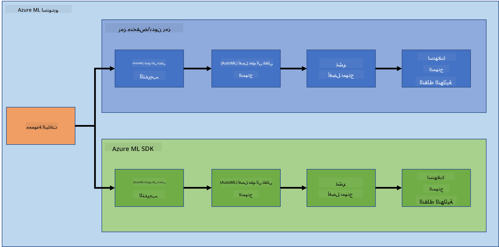
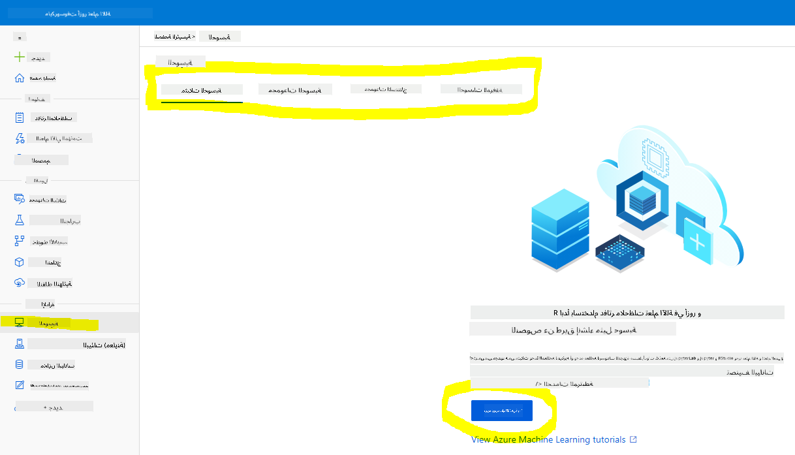
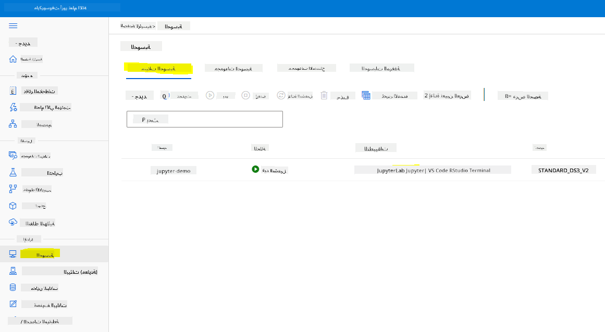
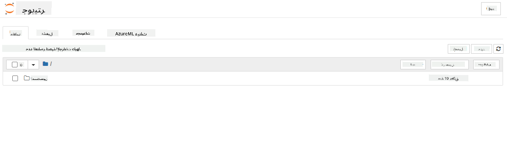

<!--
CO_OP_TRANSLATOR_METADATA:
{
  "original_hash": "73dead89dc2ddda4d6ec0232814a191e",
  "translation_date": "2025-08-27T09:40:51+00:00",
  "source_file": "5-Data-Science-In-Cloud/19-Azure/README.md",
  "language_code": "ar"
}
-->
# علم البيانات في السحابة: طريقة "Azure ML SDK"

| ](../../sketchnotes/19-DataScience-Cloud.png)|
|:---:|
| علم البيانات في السحابة: Azure ML SDK - _رسم توضيحي بواسطة [@nitya](https://twitter.com/nitya)_ |

جدول المحتويات:

- [علم البيانات في السحابة: طريقة "Azure ML SDK"](../../../../5-Data-Science-In-Cloud/19-Azure)
  - [اختبار ما قبل المحاضرة](../../../../5-Data-Science-In-Cloud/19-Azure)
  - [1. المقدمة](../../../../5-Data-Science-In-Cloud/19-Azure)
    - [1.1 ما هو Azure ML SDK؟](../../../../5-Data-Science-In-Cloud/19-Azure)
    - [1.2 مقدمة عن مشروع التنبؤ بفشل القلب ومجموعة البيانات](../../../../5-Data-Science-In-Cloud/19-Azure)
  - [2. تدريب نموذج باستخدام Azure ML SDK](../../../../5-Data-Science-In-Cloud/19-Azure)
    - [2.1 إنشاء مساحة عمل Azure ML](../../../../5-Data-Science-In-Cloud/19-Azure)
    - [2.2 إنشاء وحدة حسابية](../../../../5-Data-Science-In-Cloud/19-Azure)
    - [2.3 تحميل مجموعة البيانات](../../../../5-Data-Science-In-Cloud/19-Azure)
    - [2.4 إنشاء دفاتر ملاحظات](../../../../5-Data-Science-In-Cloud/19-Azure)
    - [2.5 تدريب نموذج](../../../../5-Data-Science-In-Cloud/19-Azure)
      - [2.5.1 إعداد مساحة العمل، التجربة، مجموعة الحوسبة ومجموعة البيانات](../../../../5-Data-Science-In-Cloud/19-Azure)
      - [2.5.2 إعداد وتدريب AutoML](../../../../5-Data-Science-In-Cloud/19-Azure)
  - [3. نشر النموذج واستهلاك نقطة النهاية باستخدام Azure ML SDK](../../../../5-Data-Science-In-Cloud/19-Azure)
    - [3.1 حفظ أفضل نموذج](../../../../5-Data-Science-In-Cloud/19-Azure)
    - [3.2 نشر النموذج](../../../../5-Data-Science-In-Cloud/19-Azure)
    - [3.3 استهلاك نقطة النهاية](../../../../5-Data-Science-In-Cloud/19-Azure)
  - [🚀 التحدي](../../../../5-Data-Science-In-Cloud/19-Azure)
  - [اختبار ما بعد المحاضرة](../../../../5-Data-Science-In-Cloud/19-Azure)
  - [المراجعة والدراسة الذاتية](../../../../5-Data-Science-In-Cloud/19-Azure)
  - [التكليف](../../../../5-Data-Science-In-Cloud/19-Azure)

## [اختبار ما قبل المحاضرة](https://purple-hill-04aebfb03.1.azurestaticapps.net/quiz/36)

## 1. المقدمة

### 1.1 ما هو Azure ML SDK؟

يستخدم علماء البيانات ومطورو الذكاء الاصطناعي Azure Machine Learning SDK لبناء وتشغيل سير عمل التعلم الآلي باستخدام خدمة Azure Machine Learning. يمكنك التفاعل مع الخدمة في أي بيئة Python، بما في ذلك Jupyter Notebooks، Visual Studio Code، أو بيئة تطوير Python المفضلة لديك.

تشمل المجالات الرئيسية لـ SDK:

- استكشاف وإعداد وإدارة دورة حياة مجموعات البيانات المستخدمة في تجارب التعلم الآلي.
- إدارة موارد السحابة لمراقبة وتسجيل وتنظيم تجارب التعلم الآلي.
- تدريب النماذج محليًا أو باستخدام موارد السحابة، بما في ذلك تدريب النماذج باستخدام وحدات معالجة الرسومات.
- استخدام التعلم الآلي التلقائي، الذي يقبل معلمات التكوين وبيانات التدريب. يقوم تلقائيًا بتكرار الخوارزميات وإعدادات المعلمات للعثور على أفضل نموذج للتنبؤات.
- نشر خدمات ويب لتحويل النماذج المدربة إلى خدمات RESTful يمكن استهلاكها في أي تطبيق.

[تعرف على المزيد حول Azure Machine Learning SDK](https://docs.microsoft.com/python/api/overview/azure/ml?WT.mc_id=academic-77958-bethanycheum&ocid=AID3041109)

في [الدرس السابق](../18-Low-Code/README.md)، رأينا كيفية تدريب ونشر واستهلاك نموذج بطريقة منخفضة الكود/بدون كود. استخدمنا مجموعة بيانات فشل القلب لإنشاء نموذج التنبؤ بفشل القلب. في هذا الدرس، سنقوم بنفس الشيء ولكن باستخدام Azure Machine Learning SDK.



### 1.2 مقدمة عن مشروع التنبؤ بفشل القلب ومجموعة البيانات

راجع [هنا](../18-Low-Code/README.md) مقدمة عن مشروع التنبؤ بفشل القلب ومجموعة البيانات.

## 2. تدريب نموذج باستخدام Azure ML SDK
### 2.1 إنشاء مساحة عمل Azure ML

للتبسيط، سنعمل على دفتر ملاحظات Jupyter. هذا يعني أنك لديك بالفعل مساحة عمل ووحدة حسابية. إذا كنت تمتلك مساحة عمل بالفعل، يمكنك الانتقال مباشرة إلى القسم 2.3 إنشاء دفتر ملاحظات.

إذا لم يكن لديك، يرجى اتباع التعليمات في القسم **2.1 إنشاء مساحة عمل Azure ML** في [الدرس السابق](../18-Low-Code/README.md) لإنشاء مساحة عمل.

### 2.2 إنشاء وحدة حسابية

في [مساحة عمل Azure ML](https://ml.azure.com/) التي أنشأناها سابقًا، انتقل إلى قائمة الحوسبة وسترى الموارد الحسابية المختلفة المتاحة.



لنقم بإنشاء وحدة حسابية لتوفير دفتر ملاحظات Jupyter. 
1. انقر على زر + جديد. 
2. قم بتسمية الوحدة الحسابية.
3. اختر الخيارات: CPU أو GPU، حجم الجهاز وعدد النوى.
4. انقر على زر إنشاء.

تهانينا، لقد أنشأت وحدة حسابية! سنستخدم هذه الوحدة الحسابية لإنشاء دفتر ملاحظات في القسم [إنشاء دفاتر ملاحظات](../../../../5-Data-Science-In-Cloud/19-Azure).

### 2.3 تحميل مجموعة البيانات
راجع [الدرس السابق](../18-Low-Code/README.md) في القسم **2.3 تحميل مجموعة البيانات** إذا لم تقم بتحميل مجموعة البيانات بعد.

### 2.4 إنشاء دفاتر ملاحظات

> **_ملاحظة:_** للخطوة التالية، يمكنك إما إنشاء دفتر ملاحظات جديد من البداية، أو يمكنك تحميل [دفتر الملاحظات الذي أنشأناه](notebook.ipynb) في استوديو Azure ML الخاص بك. لتحميله، ببساطة انقر على قائمة "دفتر الملاحظات" وقم بتحميله.

دفاتر الملاحظات جزء مهم جدًا من عملية علم البيانات. يمكن استخدامها لإجراء تحليل البيانات الاستكشافي (EDA)، الاتصال بمجموعات الحوسبة لتدريب نموذج، أو الاتصال بمجموعات الاستنتاج لنشر نقطة نهاية.

لإنشاء دفتر ملاحظات، نحتاج إلى عقدة حسابية تخدم مثيل دفتر ملاحظات Jupyter. ارجع إلى [مساحة عمل Azure ML](https://ml.azure.com/) وانقر على وحدات الحساب. في قائمة الوحدات الحسابية، يجب أن ترى [الوحدة الحسابية التي أنشأناها سابقًا](../../../../5-Data-Science-In-Cloud/19-Azure). 

1. في قسم التطبيقات، انقر على خيار Jupyter. 
2. ضع علامة في مربع "نعم، أفهم" وانقر على زر متابعة.

3. يجب أن يفتح علامة تبويب جديدة في المتصفح مع مثيل دفتر ملاحظات Jupyter الخاص بك كما يلي. انقر على زر "جديد" لإنشاء دفتر ملاحظات.



الآن بعد أن أصبح لدينا دفتر ملاحظات، يمكننا البدء في تدريب النموذج باستخدام Azure ML SDK.

### 2.5 تدريب نموذج

أولاً، إذا كان لديك أي شك، راجع [وثائق Azure ML SDK](https://docs.microsoft.com/python/api/overview/azure/ml?WT.mc_id=academic-77958-bethanycheum&ocid=AID3041109). تحتوي على جميع المعلومات اللازمة لفهم الوحدات التي سنراها في هذا الدرس.

#### 2.5.1 إعداد مساحة العمل، التجربة، مجموعة الحوسبة ومجموعة البيانات

تحتاج إلى تحميل `workspace` من ملف التكوين باستخدام الكود التالي:

```python
from azureml.core import Workspace
ws = Workspace.from_config()
```

هذا يعيد كائنًا من نوع `Workspace` يمثل مساحة العمل. ثم تحتاج إلى إنشاء `experiment` باستخدام الكود التالي:

```python
from azureml.core import Experiment
experiment_name = 'aml-experiment'
experiment = Experiment(ws, experiment_name)
```
للحصول على تجربة أو إنشائها من مساحة العمل، تطلب التجربة باستخدام اسم التجربة. يجب أن يكون اسم التجربة بين 3-36 حرفًا، يبدأ بحرف أو رقم، ويمكن أن يحتوي فقط على أحرف، أرقام، شرطات سفلية، وشرطات. إذا لم يتم العثور على التجربة في مساحة العمل، يتم إنشاء تجربة جديدة.

الآن تحتاج إلى إنشاء مجموعة حوسبة للتدريب باستخدام الكود التالي. لاحظ أن هذه الخطوة قد تستغرق بضع دقائق. 

```python
from azureml.core.compute import AmlCompute

aml_name = "heart-f-cluster"
try:
    aml_compute = AmlCompute(ws, aml_name)
    print('Found existing AML compute context.')
except:
    print('Creating new AML compute context.')
    aml_config = AmlCompute.provisioning_configuration(vm_size = "Standard_D2_v2", min_nodes=1, max_nodes=3)
    aml_compute = AmlCompute.create(ws, name = aml_name, provisioning_configuration = aml_config)
    aml_compute.wait_for_completion(show_output = True)

cts = ws.compute_targets
compute_target = cts[aml_name]
```

يمكنك الحصول على مجموعة البيانات من مساحة العمل باستخدام اسم مجموعة البيانات بالطريقة التالية:

```python
dataset = ws.datasets['heart-failure-records']
df = dataset.to_pandas_dataframe()
df.describe()
```
#### 2.5.2 إعداد وتدريب AutoML

لإعداد تكوين AutoML، استخدم [فئة AutoMLConfig](https://docs.microsoft.com/python/api/azureml-train-automl-client/azureml.train.automl.automlconfig(class)?WT.mc_id=academic-77958-bethanycheum&ocid=AID3041109).

كما هو موضح في الوثائق، هناك العديد من المعلمات التي يمكنك اللعب بها. لهذا المشروع، سنستخدم المعلمات التالية:

- `experiment_timeout_minutes`: الحد الأقصى للوقت (بالدقائق) الذي يُسمح للتجربة بالعمل قبل أن يتم إيقافها تلقائيًا ويتم توفير النتائج تلقائيًا.
- `max_concurrent_iterations`: الحد الأقصى لعدد التكرارات التدريبية المتزامنة المسموح بها للتجربة.
- `primary_metric`: المقياس الأساسي المستخدم لتحديد حالة التجربة.
- `compute_target`: هدف الحوسبة الخاص بـ Azure Machine Learning لتشغيل تجربة التعلم الآلي التلقائي.
- `task`: نوع المهمة التي سيتم تشغيلها. يمكن أن تكون القيم 'classification'، 'regression'، أو 'forecasting' اعتمادًا على نوع مشكلة التعلم الآلي التلقائي التي سيتم حلها.
- `training_data`: بيانات التدريب التي سيتم استخدامها داخل التجربة. يجب أن تحتوي على ميزات التدريب وعمود التسمية (اختياريًا عمود أوزان العينات).
- `label_column_name`: اسم عمود التسمية.
- `path`: المسار الكامل إلى مجلد مشروع Azure Machine Learning.
- `enable_early_stopping`: ما إذا كان سيتم تمكين الإنهاء المبكر إذا لم تتحسن النتيجة على المدى القصير.
- `featurization`: مؤشر على ما إذا كان يجب تنفيذ خطوة التمييز تلقائيًا أم لا، أو ما إذا كان يجب استخدام التمييز المخصص.
- `debug_log`: ملف السجل لكتابة معلومات التصحيح.

```python
from azureml.train.automl import AutoMLConfig

project_folder = './aml-project'

automl_settings = {
    "experiment_timeout_minutes": 20,
    "max_concurrent_iterations": 3,
    "primary_metric" : 'AUC_weighted'
}

automl_config = AutoMLConfig(compute_target=compute_target,
                             task = "classification",
                             training_data=dataset,
                             label_column_name="DEATH_EVENT",
                             path = project_folder,  
                             enable_early_stopping= True,
                             featurization= 'auto',
                             debug_log = "automl_errors.log",
                             **automl_settings
                            )
```
الآن بعد أن قمت بإعداد التكوين، يمكنك تدريب النموذج باستخدام الكود التالي. قد تستغرق هذه الخطوة ما يصل إلى ساعة حسب حجم المجموعة.

```python
remote_run = experiment.submit(automl_config)
```
يمكنك تشغيل أداة RunDetails لعرض التجارب المختلفة.
```python
from azureml.widgets import RunDetails
RunDetails(remote_run).show()
```
## 3. نشر النموذج واستهلاك نقطة النهاية باستخدام Azure ML SDK

### 3.1 حفظ أفضل نموذج

`remote_run` هو كائن من نوع [AutoMLRun](https://docs.microsoft.com/python/api/azureml-train-automl-client/azureml.train.automl.run.automlrun?WT.mc_id=academic-77958-bethanycheum&ocid=AID3041109). يحتوي هذا الكائن على طريقة `get_output()` التي تعيد أفضل تشغيل والنموذج المناسب المقابل.

```python
best_run, fitted_model = remote_run.get_output()
```
يمكنك رؤية المعلمات المستخدمة لأفضل نموذج فقط بطباعة fitted_model ورؤية خصائص أفضل نموذج باستخدام طريقة [get_properties()](https://docs.microsoft.com/python/api/azureml-core/azureml.core.run(class)?view=azure-ml-py#azureml_core_Run_get_properties?WT.mc_id=academic-77958-bethanycheum&ocid=AID3041109).

```python
best_run.get_properties()
```

الآن قم بتسجيل النموذج باستخدام طريقة [register_model](https://docs.microsoft.com/python/api/azureml-train-automl-client/azureml.train.automl.run.automlrun?view=azure-ml-py#register-model-model-name-none--description-none--tags-none--iteration-none--metric-none-?WT.mc_id=academic-77958-bethanycheum&ocid=AID3041109).
```python
model_name = best_run.properties['model_name']
script_file_name = 'inference/score.py'
best_run.download_file('outputs/scoring_file_v_1_0_0.py', 'inference/score.py')
description = "aml heart failure project sdk"
model = best_run.register_model(model_name = model_name,
                                model_path = './outputs/',
                                description = description,
                                tags = None)
```
### 3.2 نشر النموذج

بمجرد حفظ أفضل نموذج، يمكننا نشره باستخدام فئة [InferenceConfig](https://docs.microsoft.com/python/api/azureml-core/azureml.core.model.inferenceconfig?view=azure-ml-py?ocid=AID3041109). يمثل InferenceConfig إعدادات التكوين لبيئة مخصصة تُستخدم للنشر. تمثل فئة [AciWebservice](https://docs.microsoft.com/python/api/azureml-core/azureml.core.webservice.aciwebservice?view=azure-ml-py) نموذج التعلم الآلي المنشور كنقطة نهاية خدمة ويب على Azure Container Instances. يتم إنشاء خدمة ويب منشورة من نموذج، نص برمجي، والملفات المرتبطة. تكون خدمة الويب الناتجة نقطة نهاية HTTP متوازنة التحميل مع واجهة برمجة تطبيقات REST. يمكنك إرسال البيانات إلى هذه الواجهة البرمجية واستلام التنبؤ الذي تم إرجاعه بواسطة النموذج.

يتم نشر النموذج باستخدام طريقة [deploy](https://docs.microsoft.com/python/api/azureml-core/azureml.core.model(class)?view=azure-ml-py#deploy-workspace--name--models--inference-config-none--deployment-config-none--deployment-target-none--overwrite-false--show-output-false-?WT.mc_id=academic-77958-bethanycheum&ocid=AID3041109).

```python
from azureml.core.model import InferenceConfig, Model
from azureml.core.webservice import AciWebservice

inference_config = InferenceConfig(entry_script=script_file_name, environment=best_run.get_environment())

aciconfig = AciWebservice.deploy_configuration(cpu_cores = 1,
                                               memory_gb = 1,
                                               tags = {'type': "automl-heart-failure-prediction"},
                                               description = 'Sample service for AutoML Heart Failure Prediction')

aci_service_name = 'automl-hf-sdk'
aci_service = Model.deploy(ws, aci_service_name, [model], inference_config, aciconfig)
aci_service.wait_for_deployment(True)
print(aci_service.state)
```
يجب أن تستغرق هذه الخطوة بضع دقائق.

### 3.3 استهلاك نقطة النهاية

يمكنك استهلاك نقطة النهاية الخاصة بك عن طريق إنشاء إدخال عينة:

```python
data = {
    "data":
    [
        {
            'age': "60",
            'anaemia': "false",
            'creatinine_phosphokinase': "500",
            'diabetes': "false",
            'ejection_fraction': "38",
            'high_blood_pressure': "false",
            'platelets': "260000",
            'serum_creatinine': "1.40",
            'serum_sodium': "137",
            'sex': "false",
            'smoking': "false",
            'time': "130",
        },
    ],
}

test_sample = str.encode(json.dumps(data))
```
ثم يمكنك إرسال هذا الإدخال إلى النموذج الخاص بك للحصول على التنبؤ:
```python
response = aci_service.run(input_data=test_sample)
response
```  
يجب أن تكون النتيجة `'{"result": [false]}'`. هذا يعني أن إدخال المريض الذي أرسلناه إلى نقطة النهاية قد أنتج التنبؤ `false`، مما يعني أن هذا الشخص غير مرجح أن يصاب بنوبة قلبية.

تهانينا! لقد قمت باستخدام النموذج الذي تم نشره وتدريبه على Azure ML باستخدام Azure ML SDK!

> **_ملاحظة:_** بمجرد الانتهاء من المشروع، لا تنسَ حذف جميع الموارد.

## 🚀 التحدي  

هناك العديد من الأشياء الأخرى التي يمكنك القيام بها باستخدام SDK، للأسف، لا يمكننا استعراضها جميعًا في هذا الدرس. ولكن الخبر السار هو أن تعلم كيفية تصفح وثائق SDK يمكن أن يأخذك بعيدًا بمفردك. ألقِ نظرة على وثائق Azure ML SDK وابحث عن الفئة `Pipeline` التي تتيح لك إنشاء خطوط معالجة. الخطوط هي مجموعة من الخطوات التي يمكن تنفيذها كعملية سير عمل.

**تلميح:** انتقل إلى [وثائق SDK](https://docs.microsoft.com/python/api/overview/azure/ml/?view=azure-ml-py?WT.mc_id=academic-77958-bethanycheum&ocid=AID3041109) واكتب كلمات مفتاحية في شريط البحث مثل "Pipeline". يجب أن تجد الفئة `azureml.pipeline.core.Pipeline` في نتائج البحث.

## [اختبار ما بعد المحاضرة](https://purple-hill-04aebfb03.1.azurestaticapps.net/quiz/37)

## المراجعة والدراسة الذاتية  

في هذا الدرس، تعلمت كيفية تدريب ونشر واستهلاك نموذج للتنبؤ بمخاطر فشل القلب باستخدام Azure ML SDK في السحابة. تحقق من [هذه الوثائق](https://docs.microsoft.com/python/api/overview/azure/ml/?view=azure-ml-py?WT.mc_id=academic-77958-bethanycheum&ocid=AID3041109) للحصول على مزيد من المعلومات حول Azure ML SDK. حاول إنشاء نموذجك الخاص باستخدام Azure ML SDK.

## الواجب  

[مشروع علم البيانات باستخدام Azure ML SDK](assignment.md)  

---

**إخلاء المسؤولية**:  
تم ترجمة هذا المستند باستخدام خدمة الترجمة بالذكاء الاصطناعي [Co-op Translator](https://github.com/Azure/co-op-translator). بينما نسعى لتحقيق الدقة، يرجى العلم أن الترجمات الآلية قد تحتوي على أخطاء أو معلومات غير دقيقة. يجب اعتبار المستند الأصلي بلغته الأصلية هو المصدر الموثوق. للحصول على معلومات حساسة، يُوصى بالاستعانة بترجمة بشرية احترافية. نحن غير مسؤولين عن أي سوء فهم أو تفسيرات خاطئة ناتجة عن استخدام هذه الترجمة.