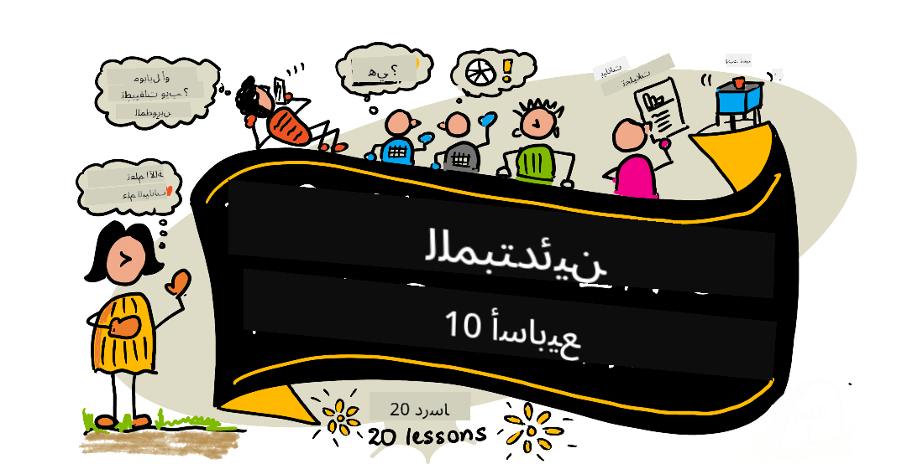

<!--
CO_OP_TRANSLATOR_METADATA:
{
  "original_hash": "dd9a1deb4da680b2cf11ba2e9f5a0a6e",
  "translation_date": "2025-09-29T21:30:17+00:00",
  "source_file": "README.md",
  "language_code": "ar"
}
-->
# علم البيانات للمبتدئين - منهج دراسي

يسر فريق Azure Cloud Advocates في Microsoft أن يقدم منهجًا دراسيًا لمدة 10 أسابيع يتضمن 20 درسًا حول علم البيانات. يحتوي كل درس على اختبارات قبل وبعد الدرس، تعليمات مكتوبة لإكمال الدرس، الحل، وتكليف. تعتمد طريقة التدريس لدينا على المشاريع، مما يتيح لك التعلم أثناء البناء، وهي طريقة مثبتة لجعل المهارات الجديدة "تترسخ".

**شكر جزيل لمؤلفينا:** [Jasmine Greenaway](https://www.twitter.com/paladique)، [Dmitry Soshnikov](http://soshnikov.com)، [Nitya Narasimhan](https://twitter.com/nitya)، [Jalen McGee](https://twitter.com/JalenMcG)، [Jen Looper](https://twitter.com/jenlooper)، [Maud Levy](https://twitter.com/maudstweets)، [Tiffany Souterre](https://twitter.com/TiffanySouterre)، [Christopher Harrison](https://www.twitter.com/geektrainer).

**🙏 شكر خاص 🙏 لمؤلفينا ومراجعي المحتوى من [سفراء الطلاب في Microsoft](https://studentambassadors.microsoft.com/)،** بما في ذلك Aaryan Arora، [Aditya Garg](https://github.com/AdityaGarg00)، [Alondra Sanchez](https://www.linkedin.com/in/alondra-sanchez-molina/)، [Ankita Singh](https://www.linkedin.com/in/ankitasingh007)، [Anupam Mishra](https://www.linkedin.com/in/anupam--mishra/)، [Arpita Das](https://www.linkedin.com/in/arpitadas01/)، ChhailBihari Dubey، [Dibri Nsofor](https://www.linkedin.com/in/dibrinsofor)، [Dishita Bhasin](https://www.linkedin.com/in/dishita-bhasin-7065281bb)، [Majd Safi](https://www.linkedin.com/in/majd-s/)، [Max Blum](https://www.linkedin.com/in/max-blum-6036a1186/)، [Miguel Correa](https://www.linkedin.com/in/miguelmque/)، [Mohamma Iftekher (Iftu) Ebne Jalal](https://twitter.com/iftu119)، [Nawrin Tabassum](https://www.linkedin.com/in/nawrin-tabassum)، [Raymond Wangsa Putra](https://www.linkedin.com/in/raymond-wp/)، [Rohit Yadav](https://www.linkedin.com/in/rty2423)، Samridhi Sharma، [Sanya Sinha](https://www.linkedin.com/mwlite/in/sanya-sinha-13aab1200)، [Sheena Narula](https://www.linkedin.com/in/sheena-narua-n/)، [Tauqeer Ahmad](https://www.linkedin.com/in/tauqeerahmad5201/)، Yogendrasingh Pawar، [Vidushi Gupta](https://www.linkedin.com/in/vidushi-gupta07/)، [Jasleen Sondhi](https://www.linkedin.com/in/jasleen-sondhi/)

||
|:---:|
| علم البيانات للمبتدئين - _رسم توضيحي بواسطة [@nitya](https://twitter.com/nitya)_ |

### 🌐 دعم متعدد اللغات

#### مدعوم عبر GitHub Action (تلقائي ودائم التحديث)

[الفرنسية](../fr/README.md) | [الإسبانية](../es/README.md) | [الألمانية](../de/README.md) | [الروسية](../ru/README.md) | [العربية](./README.md) | [الفارسية](../fa/README.md) | [الأردية](../ur/README.md) | [الصينية (المبسطة)](../zh/README.md) | [الصينية (التقليدية، ماكاو)](../mo/README.md) | [الصينية (التقليدية، هونغ كونغ)](../hk/README.md) | [الصينية (التقليدية، تايوان)](../tw/README.md) | [اليابانية](../ja/README.md) | [الكورية](../ko/README.md) | [الهندية](../hi/README.md) | [البنغالية](../bn/README.md) | [الماراثية](../mr/README.md) | [النيبالية](../ne/README.md) | [البنجابية (غورموخي)](../pa/README.md) | [البرتغالية (البرتغال)](../pt/README.md) | [البرتغالية (البرازيل)](../br/README.md) | [الإيطالية](../it/README.md) | [البولندية](../pl/README.md) | [التركية](../tr/README.md) | [اليونانية](../el/README.md) | [التايلاندية](../th/README.md) | [السويدية](../sv/README.md) | [الدانماركية](../da/README.md) | [النرويجية](../no/README.md) | [الفنلندية](../fi/README.md) | [الهولندية](../nl/README.md) | [العبرية](../he/README.md) | [الفيتنامية](../vi/README.md) | [الإندونيسية](../id/README.md) | [الماليزية](../ms/README.md) | [التاغالوغية (الفلبينية)](../tl/README.md) | [السواحيلية](../sw/README.md) | [الهنغارية](../hu/README.md) | [التشيكية](../cs/README.md) | [السلوفاكية](../sk/README.md) | [الرومانية](../ro/README.md) | [البلغارية](../bg/README.md) | [الصربية (السيريلية)](../sr/README.md) | [الكرواتية](../hr/README.md) | [السلوفينية](../sl/README.md) | [الأوكرانية](../uk/README.md) | [البورمية (ميانمار)](../my/README.md)

**إذا كنت ترغب في دعم لغات إضافية، يمكنك الاطلاع على القائمة [هنا](https://github.com/Azure/co-op-translator/blob/main/getting_started/supported-languages.md)**

#### انضم إلى مجتمعنا 

لدينا سلسلة تعلم مع الذكاء الاصطناعي مستمرة، تعرف على المزيد وانضم إلينا في [سلسلة تعلم مع الذكاء الاصطناعي](https://aka.ms/learnwithai/discord) من 18 إلى 30 سبتمبر، 2025. ستحصل على نصائح وحيل لاستخدام GitHub Copilot في علم البيانات.

# هل أنت طالب؟

ابدأ باستخدام الموارد التالية:

- [صفحة مركز الطلاب](https://docs.microsoft.com/en-gb/learn/student-hub?WT.mc_id=academic-77958-bethanycheum) في هذه الصفحة، ستجد موارد للمبتدئين، حزم الطلاب وحتى طرق للحصول على قسيمة شهادة مجانية. هذه صفحة يجب أن تضيفها إلى إشاراتك المرجعية وتراجعها من وقت لآخر حيث نقوم بتغيير المحتوى شهريًا على الأقل.
- [سفراء الطلاب في Microsoft](https://studentambassadors.microsoft.com?WT.mc_id=academic-77958-bethanycheum) انضم إلى مجتمع عالمي من سفراء الطلاب، قد تكون هذه فرصتك للدخول إلى Microsoft.

# البدء

> **المعلمون**: لقد قمنا [بتضمين بعض الاقتراحات](for-teachers.md) حول كيفية استخدام هذا المنهج الدراسي. نود سماع ملاحظاتكم [في منتدى المناقشة الخاص بنا](https://github.com/microsoft/Data-Science-For-Beginners/discussions)!

> **[الطلاب](https://aka.ms/student-page)**: لاستخدام هذا المنهج الدراسي بمفردك، قم بعمل نسخة من المستودع بالكامل وأكمل التمارين بنفسك، بدءًا من اختبار ما قبل المحاضرة. ثم اقرأ المحاضرة وأكمل بقية الأنشطة. حاول إنشاء المشاريع من خلال فهم الدروس بدلاً من نسخ كود الحل؛ ومع ذلك، يتوفر هذا الكود في مجلدات الحلول في كل درس قائم على المشروع. فكرة أخرى هي تشكيل مجموعة دراسية مع الأصدقاء ومراجعة المحتوى معًا. لمزيد من الدراسة، نوصي بـ [Microsoft Learn](https://docs.microsoft.com/en-us/users/jenlooper-2911/collections/qprpajyoy3x0g7?WT.mc_id=academic-77958-bethanycheum).

## تعرف على الفريق

**الرسوم المتحركة بواسطة** [Mohit Jaisal](https://www.linkedin.com/in/mohitjaisal)

> 🎥 انقر على الصورة أعلاه لمشاهدة فيديو عن المشروع والأشخاص الذين قاموا بإنشائه!

## طريقة التدريس

لقد اخترنا مبدأين تعليميين أثناء بناء هذا المنهج الدراسي: التأكد من أنه قائم على المشاريع وأنه يتضمن اختبارات متكررة. بحلول نهاية هذه السلسلة، سيتعلم الطلاب المبادئ الأساسية لعلم البيانات، بما في ذلك المفاهيم الأخلاقية، إعداد البيانات، طرق مختلفة للعمل مع البيانات، تصور البيانات، تحليل البيانات، حالات استخدام علم البيانات في العالم الحقيقي، والمزيد.

بالإضافة إلى ذلك، فإن الاختبار منخفض المخاطر قبل الفصل يوجه نية الطالب نحو تعلم موضوع معين، بينما يضمن الاختبار الثاني بعد الفصل المزيد من الاحتفاظ بالمعلومات. تم تصميم هذا المنهج ليكون مرنًا وممتعًا ويمكن أخذه بالكامل أو جزئيًا. تبدأ المشاريع صغيرة وتصبح أكثر تعقيدًا بحلول نهاية دورة الـ 10 أسابيع.

> تجدون [مدونة قواعد السلوك](CODE_OF_CONDUCT.md)، [المساهمة](CONTRIBUTING.md)، [إرشادات الترجمة](TRANSLATIONS.md). نرحب بملاحظاتكم البناءة!

## كل درس يتضمن:

- رسم توضيحي اختياري
- فيديو إضافي اختياري
- اختبار تمهيدي قبل الدرس
- درس مكتوب
- بالنسبة للدروس القائمة على المشاريع، إرشادات خطوة بخطوة حول كيفية بناء المشروع
- فحوصات المعرفة
- تحدي
- قراءة إضافية
- تكليف
- [اختبار بعد الدرس](https://ff-quizzes.netlify.app/en/)

> **ملاحظة حول الاختبارات**: جميع الاختبارات موجودة في مجلد Quiz-App، بإجمالي 40 اختبارًا يحتوي كل منها على ثلاثة أسئلة. يتم الربط بها من داخل الدروس، ولكن يمكن تشغيل تطبيق الاختبار محليًا أو نشره على Azure؛ اتبع التعليمات في مجلد `quiz-app`. يتم ترجمتها تدريجيًا.

## الدروس
||
|:---:|
| علم البيانات للمبتدئين: خارطة الطريق - _رسم توضيحي بواسطة [@nitya](https://twitter.com/nitya)_ |

| رقم الدرس | الموضوع | مجموعة الدروس | أهداف التعلم | الدرس المرتبط | المؤلف |
| :-----------: | :----------------------------------------: | :--------------------------------------------------: | :-----------------------------------------------------------------------------------------------------------------------------------------------------------------------: | :---------------------------------------------------------------------: | :----: |
| 01 | تعريف علم البيانات | [المقدمة](1-Introduction/README.md) | تعلم المفاهيم الأساسية لعلم البيانات وكيف يرتبط بالذكاء الاصطناعي، التعلم الآلي، والبيانات الضخمة. | [الدرس](1-Introduction/01-defining-data-science/README.md) [الفيديو](https://youtu.be/beZ7Mb_oz9I) | [Dmitry](http://soshnikov.com) |
| 02 | أخلاقيات علم البيانات | [المقدمة](1-Introduction/README.md) | مفاهيم أخلاقيات البيانات، التحديات، والأطر. | [الدرس](1-Introduction/02-ethics/README.md) | [Nitya](https://twitter.com/nitya) |
| 03 | تعريف البيانات | [المقدمة](1-Introduction/README.md) | كيفية تصنيف البيانات ومصادرها الشائعة. | [الدرس](1-Introduction/03-defining-data/README.md) | [Jasmine](https://www.twitter.com/paladique) |
| 04 | مقدمة في الإحصاء والاحتمالات | [المقدمة](1-Introduction/README.md) | التقنيات الرياضية للإحصاء والاحتمالات لفهم البيانات. | [الدرس](1-Introduction/04-stats-and-probability/README.md) [الفيديو](https://youtu.be/Z5Zy85g4Yjw) | [Dmitry](http://soshnikov.com) |
| 05 | العمل مع البيانات العلائقية | [العمل مع البيانات](2-Working-With-Data/README.md) | مقدمة عن البيانات العلائقية وأساسيات استكشاف وتحليل البيانات العلائقية باستخدام لغة الاستعلام الهيكلية، المعروفة بـ SQL (تُنطق "سي-كويل"). | [الدرس](2-Working-With-Data/05-relational-databases/README.md) | [Christopher](https://www.twitter.com/geektrainer) | | |
| 06 | العمل مع بيانات NoSQL | [العمل مع البيانات](2-Working-With-Data/README.md) | مقدمة عن البيانات غير العلائقية، أنواعها المختلفة، وأساسيات استكشاف وتحليل قواعد بيانات الوثائق. | [الدرس](2-Working-With-Data/06-non-relational/README.md) | [Jasmine](https://twitter.com/paladique)|
| 07 | العمل مع بايثون | [العمل مع البيانات](2-Working-With-Data/README.md) | أساسيات استخدام بايثون لاستكشاف البيانات باستخدام مكتبات مثل Pandas. يُفضل وجود فهم أساسي لبرمجة بايثون. | [الدرس](2-Working-With-Data/07-python/README.md) [الفيديو](https://youtu.be/dZjWOGbsN4Y) | [Dmitry](http://soshnikov.com) |
| 08 | إعداد البيانات | [العمل مع البيانات](2-Working-With-Data/README.md) | مواضيع حول تقنيات تنظيف وتحويل البيانات للتعامل مع تحديات البيانات المفقودة أو غير الدقيقة أو غير المكتملة. | [الدرس](2-Working-With-Data/08-data-preparation/README.md) | [Jasmine](https://www.twitter.com/paladique) |
| 09 | تصور الكميات | [تصور البيانات](3-Data-Visualization/README.md) | تعلم كيفية استخدام Matplotlib لتصور بيانات الطيور 🦆 | [الدرس](3-Data-Visualization/09-visualization-quantities/README.md) | [Jen](https://twitter.com/jenlooper) |
| 10 | تصور توزيع البيانات | [تصور البيانات](3-Data-Visualization/README.md) | تصور الملاحظات والاتجاهات ضمن فترة زمنية. | [الدرس](3-Data-Visualization/10-visualization-distributions/README.md) | [Jen](https://twitter.com/jenlooper) |
| 11 | تصور النسب | [تصور البيانات](3-Data-Visualization/README.md) | تصور النسب المئوية المنفصلة والمجمعة. | [الدرس](3-Data-Visualization/11-visualization-proportions/README.md) | [Jen](https://twitter.com/jenlooper) |
| 12 | تصور العلاقات | [تصور البيانات](3-Data-Visualization/README.md) | تصور الروابط والارتباطات بين مجموعات البيانات ومتغيراتها. | [الدرس](3-Data-Visualization/12-visualization-relationships/README.md) | [Jen](https://twitter.com/jenlooper) |
| 13 | تصورات ذات معنى | [تصور البيانات](3-Data-Visualization/README.md) | تقنيات وإرشادات لجعل تصوراتك ذات قيمة لحل المشكلات بشكل فعال واستخلاص الأفكار. | [الدرس](3-Data-Visualization/13-meaningful-visualizations/README.md) | [Jen](https://twitter.com/jenlooper) |
| 14 | مقدمة في دورة حياة علم البيانات | [دورة الحياة](4-Data-Science-Lifecycle/README.md) | مقدمة في دورة حياة علم البيانات وخطوتها الأولى في جمع واستخراج البيانات. | [الدرس](4-Data-Science-Lifecycle/14-Introduction/README.md) | [Jasmine](https://twitter.com/paladique) |
| 15 | التحليل | [دورة الحياة](4-Data-Science-Lifecycle/README.md) | تركز هذه المرحلة من دورة حياة علم البيانات على تقنيات تحليل البيانات. | [الدرس](4-Data-Science-Lifecycle/15-analyzing/README.md) | [Jasmine](https://twitter.com/paladique) | | |
| 16 | التواصل | [دورة الحياة](4-Data-Science-Lifecycle/README.md) | تركز هذه المرحلة من دورة حياة علم البيانات على تقديم الأفكار المستخلصة من البيانات بطريقة تسهل على صناع القرار فهمها. | [الدرس](4-Data-Science-Lifecycle/16-communication/README.md) | [Jalen](https://twitter.com/JalenMcG) | | |
| 17 | علم البيانات في السحابة | [بيانات السحابة](5-Data-Science-In-Cloud/README.md) | تقدم هذه السلسلة من الدروس علم البيانات في السحابة وفوائده. | [الدرس](5-Data-Science-In-Cloud/17-Introduction/README.md) | [Tiffany](https://twitter.com/TiffanySouterre) و [Maud](https://twitter.com/maudstweets) |
| 18 | علم البيانات في السحابة | [بيانات السحابة](5-Data-Science-In-Cloud/README.md) | تدريب النماذج باستخدام أدوات منخفضة الكود. |[الدرس](5-Data-Science-In-Cloud/18-Low-Code/README.md) | [Tiffany](https://twitter.com/TiffanySouterre) و [Maud](https://twitter.com/maudstweets) |
| 19 | علم البيانات في السحابة | [بيانات السحابة](5-Data-Science-In-Cloud/README.md) | نشر النماذج باستخدام Azure Machine Learning Studio. | [الدرس](5-Data-Science-In-Cloud/19-Azure/README.md)| [Tiffany](https://twitter.com/TiffanySouterre) و [Maud](https://twitter.com/maudstweets) |
| 20 | علم البيانات في العالم الحقيقي | [في العالم الحقيقي](6-Data-Science-In-Wild/README.md) | مشاريع تعتمد على علم البيانات في العالم الحقيقي. | [الدرس](6-Data-Science-In-Wild/20-Real-World-Examples/README.md) | [Nitya](https://twitter.com/nitya) |

## GitHub Codespaces

اتبع هذه الخطوات لفتح هذا المثال في Codespace:
1. انقر على القائمة المنسدلة "Code" واختر خيار "Open with Codespaces".
2. اختر + New codespace في أسفل اللوحة.
لمزيد من المعلومات، تحقق من [وثائق GitHub](https://docs.github.com/en/codespaces/developing-in-codespaces/creating-a-codespace-for-a-repository#creating-a-codespace).

## VSCode Remote - Containers
اتبع هذه الخطوات لفتح هذا المستودع في حاوية باستخدام جهازك المحلي وVSCode باستخدام امتداد VS Code Remote - Containers:

1. إذا كانت هذه هي المرة الأولى التي تستخدم فيها حاوية تطوير، يرجى التأكد من أن نظامك يلبي المتطلبات الأساسية (مثل تثبيت Docker) في [وثائق البدء](https://code.visualstudio.com/docs/devcontainers/containers#_getting-started).

لاستخدام هذا المستودع، يمكنك فتحه إما في وحدة تخزين Docker معزولة:

**ملاحظة**: في الخلفية، سيتم استخدام أمر Remote-Containers: **Clone Repository in Container Volume...** لاستنساخ الكود المصدر في وحدة تخزين Docker بدلاً من نظام الملفات المحلي. [الوحدات التخزينية](https://docs.docker.com/storage/volumes/) هي الآلية المفضلة للحفاظ على بيانات الحاوية.

أو فتح نسخة مستنسخة أو محملة محليًا من المستودع:

- استنسخ هذا المستودع إلى نظام الملفات المحلي لديك.
- اضغط على F1 واختر الأمر **Remote-Containers: Open Folder in Container...**.
- اختر النسخة المستنسخة من هذا المجلد، انتظر حتى تبدأ الحاوية، وجرب الأمور.

## الوصول دون اتصال

يمكنك تشغيل هذا التوثيق دون اتصال باستخدام [Docsify](https://docsify.js.org/#/). قم بعمل Fork لهذا المستودع، [ثبت Docsify](https://docsify.js.org/#/quickstart) على جهازك المحلي، ثم في المجلد الجذري لهذا المستودع، اكتب `docsify serve`. سيتم تشغيل الموقع على المنفذ 3000 على جهازك المحلي: `localhost:3000`.

> ملاحظة، لن يتم عرض دفاتر الملاحظات عبر Docsify، لذا عندما تحتاج إلى تشغيل دفتر ملاحظات، قم بذلك بشكل منفصل في VS Code باستخدام نواة Python.

## مناهج أخرى

فريقنا ينتج مناهج أخرى! تحقق من:

- [Edge AI للمبتدئين](https://aka.ms/edgeai-for-beginners)
- [وكلاء الذكاء الاصطناعي للمبتدئين](https://aka.ms/ai-agents-beginners)
- [الذكاء الاصطناعي التوليدي للمبتدئين](https://aka.ms/genai-beginners)
- [الذكاء الاصطناعي التوليدي للمبتدئين .NET](https://github.com/microsoft/Generative-AI-for-beginners-dotnet)
- [الذكاء الاصطناعي التوليدي باستخدام JavaScript](https://github.com/microsoft/generative-ai-with-javascript)
- [الذكاء الاصطناعي التوليدي باستخدام Java](https://aka.ms/genaijava)
- [الذكاء الاصطناعي للمبتدئين](https://aka.ms/ai-beginners)
- [علم البيانات للمبتدئين](https://aka.ms/datascience-beginners)
- [Bash للمبتدئين](https://github.com/microsoft/bash-for-beginners)
- [التعلم الآلي للمبتدئين](https://aka.ms/ml-beginners)
- [الأمن السيبراني للمبتدئين](https://github.com/microsoft/Security-101) 
- [تطوير الويب للمبتدئين](https://aka.ms/webdev-beginners)
- [إنترنت الأشياء للمبتدئين](https://aka.ms/iot-beginners)
- [التعلم الآلي للمبتدئين](https://aka.ms/ml-beginners)
- [تطوير XR للمبتدئين](https://aka.ms/xr-dev-for-beginners)
- [إتقان GitHub Copilot للبرمجة المزدوجة بالذكاء الاصطناعي](https://aka.ms/GitHubCopilotAI)
- [تطوير XR للمبتدئين](https://github.com/microsoft/xr-development-for-beginners)
- [إتقان GitHub Copilot لمطوري C#/.NET](https://github.com/microsoft/mastering-github-copilot-for-dotnet-csharp-developers)
- [اختر مغامرتك الخاصة مع Copilot](https://github.com/microsoft/CopilotAdventures)

---

**إخلاء المسؤولية**:  
تم ترجمة هذا المستند باستخدام خدمة الترجمة بالذكاء الاصطناعي [Co-op Translator](https://github.com/Azure/co-op-translator). بينما نسعى لتحقيق الدقة، يرجى العلم أن الترجمات الآلية قد تحتوي على أخطاء أو عدم دقة. يجب اعتبار المستند الأصلي بلغته الأصلية المصدر الرسمي. للحصول على معلومات حاسمة، يُوصى بالترجمة البشرية الاحترافية. نحن غير مسؤولين عن أي سوء فهم أو تفسيرات خاطئة ناتجة عن استخدام هذه الترجمة.