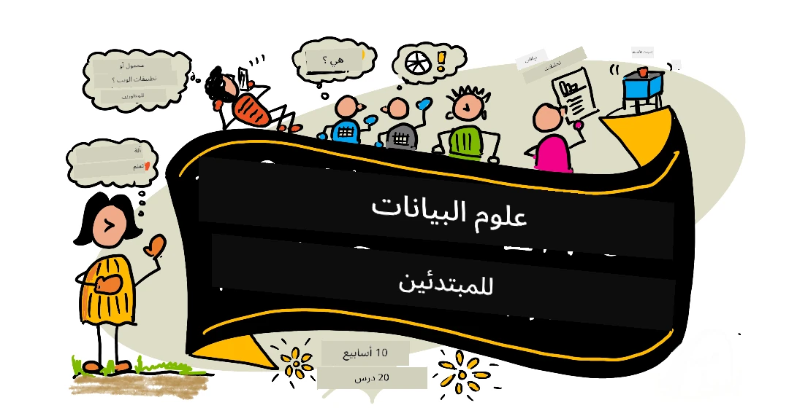
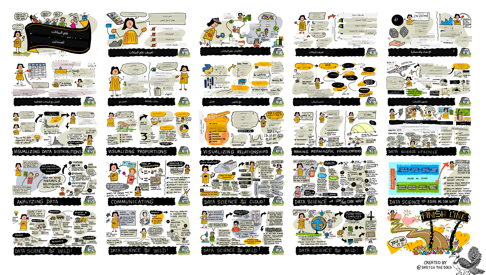

# علم البيانات للمبتدئين - المنهج الدراسي

[](https://github.com/codespaces/new?hide_repo_select=true&ref=main&repo=344191198)

[](https://github.com/microsoft/Data-Science-For-Beginners/blob/master/LICENSE)
[](https://GitHub.com/microsoft/Data-Science-For-Beginners/graphs/contributors/)
[](https://GitHub.com/microsoft/Data-Science-For-Beginners/issues/)
[](https://GitHub.com/microsoft/Data-Science-For-Beginners/pulls/)
[](http://makeapullrequest.com)

[](https://GitHub.com/microsoft/Data-Science-For-Beginners/watchers/)
[](https://GitHub.com/microsoft/Data-Science-For-Beginners/network/)
[](https://GitHub.com/microsoft/Data-Science-For-Beginners/stargazers/)


[](https://discord.gg/nTYy5BXMWG)

[](https://aka.ms/foundry/forum)

يسعد دعاة السحابة في مايكروسوفت أن يقدموا منهجًا دراسيًا مكونًا من 10 أسابيع و 20 درسًا حول علم البيانات. يتضمن كل درس اختبارات قبل الدرس وبعده، تعليمات مكتوبة لإتمام الدرس، حلًا، ومهمة. تسمح منهجيتنا التعليمية القائمة على المشاريع بأن تتعلم أثناء البناء، وهي طريقة مثبتة لجعل المهارات الجديدة „تثبت“.

**شكر كبير لمؤلفينا:** [Jasmine Greenaway](https://www.twitter.com/paladique), [Dmitry Soshnikov](http://soshnikov.com), [Nitya Narasimhan](https://twitter.com/nitya), [Jalen McGee](https://twitter.com/JalenMcG), [Jen Looper](https://twitter.com/jenlooper), [Maud Levy](https://twitter.com/maudstweets), [Tiffany Souterre](https://twitter.com/TiffanySouterre), [Christopher Harrison](https://www.twitter.com/geektrainer).

**🙏 شكر خاص 🙏 لمؤلفينا، مراجعي المحتوى، والمساهمين من [سفراء طلاب مايكروسوفت](https://studentambassadors.microsoft.com/)،** وبخاصة أريان أرورا، [أديتيا جارغ](https://github.com/AdityaGarg00)، [ألوندره سانشيز](https://www.linkedin.com/in/alondra-sanchez-molina/)، [أنكيتا سينغ](https://www.linkedin.com/in/ankitasingh007)، [أنوبام ميشرا](https://www.linkedin.com/in/anupam--mishra/)، [أربيتا داس](https://www.linkedin.com/in/arpitadas01/)، تشايلبيهاري دوباي، [ديبري نسوفور](https://www.linkedin.com/in/dibrinsofor)، [ديشيتا باسين](https://www.linkedin.com/in/dishita-bhasin-7065281bb)، [مجد صافي](https://www.linkedin.com/in/majd-s/)، [ماكس بلوم](https://www.linkedin.com/in/max-blum-6036a1186/)، [ميغيل كوريا](https://www.linkedin.com/in/miguelmque/)، [محمد افتخر (إفتو) إبن جلال](https://twitter.com/iftu119)، [نوين طبسم](https://www.linkedin.com/in/nawrin-tabassum)، [رايموند وانغسا بوترا](https://www.linkedin.com/in/raymond-wp/)، [روهيت ياداف](https://www.linkedin.com/in/rty2423)، سامريده شارما، [سانيا سينها](https://www.linkedin.com/mwlite/in/sanya-sinha-13aab1200),
[شينا نارولا](https://www.linkedin.com/in/sheena-narua-n/)، [توقير أحمد](https://www.linkedin.com/in/tauqeerahmad5201/)، يوجيندرا سينغ باور، [فيدوشي غوبتا](https://www.linkedin.com/in/vidushi-gupta07/)، [جاسلين سوندي](https://www.linkedin.com/in/jasleen-sondhi/)

||
|:---:|
| علم البيانات للمبتدئين - _رسم تخطيطي بواسطة [@nitya](https://twitter.com/nitya)_ |

### 🌐 دعم متعدد اللغات

#### مدعوم عبر GitHub Action (آلي ومحدث دائمًا)

<!-- CO-OP TRANSLATOR LANGUAGES TABLE START -->
[Arabic](./README.md) | [Bengali](../bn/README.md) | [Bulgarian](../bg/README.md) | [Burmese (Myanmar)](../my/README.md) | [Chinese (Simplified)](../zh-CN/README.md) | [Chinese (Traditional, Hong Kong)](../zh-HK/README.md) | [Chinese (Traditional, Macau)](../zh-MO/README.md) | [Chinese (Traditional, Taiwan)](../zh-TW/README.md) | [Croatian](../hr/README.md) | [Czech](../cs/README.md) | [Danish](../da/README.md) | [Dutch](../nl/README.md) | [Estonian](../et/README.md) | [Finnish](../fi/README.md) | [French](../fr/README.md) | [German](../de/README.md) | [Greek](../el/README.md) | [Hebrew](../he/README.md) | [Hindi](../hi/README.md) | [Hungarian](../hu/README.md) | [Indonesian](../id/README.md) | [Italian](../it/README.md) | [Japanese](../ja/README.md) | [Kannada](../kn/README.md) | [Khmer](../km/README.md) | [Korean](../ko/README.md) | [Lithuanian](../lt/README.md) | [Malay](../ms/README.md) | [Malayalam](../ml/README.md) | [Marathi](../mr/README.md) | [Nepali](../ne/README.md) | [Nigerian Pidgin](../pcm/README.md) | [Norwegian](../no/README.md) | [Persian (Farsi)](../fa/README.md) | [Polish](../pl/README.md) | [Portuguese (Brazil)](../pt-BR/README.md) | [Portuguese (Portugal)](../pt-PT/README.md) | [Punjabi (Gurmukhi)](../pa/README.md) | [Romanian](../ro/README.md) | [Russian](../ru/README.md) | [Serbian (Cyrillic)](../sr/README.md) | [Slovak](../sk/README.md) | [Slovenian](../sl/README.md) | [Spanish](../es/README.md) | [Swahili](../sw/README.md) | [Swedish](../sv/README.md) | [Tagalog (Filipino)](../tl/README.md) | [Tamil](../ta/README.md) | [Telugu](../te/README.md) | [Thai](../th/README.md) | [Turkish](../tr/README.md) | [Ukrainian](../uk/README.md) | [Urdu](../ur/README.md) | [Vietnamese](../vi/README.md)

> **تفضل الاستنساخ محليًا؟**
>
> يتضمن هذا المستودع أكثر من 50 ترجمة للغات مما يزيد بشكل كبير من حجم التنزيل. لاستنساخ بدون الترجمات، استخدم sparse checkout:
>
> **Bash / macOS / Linux:**
> ```bash
> git clone --filter=blob:none --sparse https://github.com/microsoft/Data-Science-For-Beginners.git
> cd Data-Science-For-Beginners
> git sparse-checkout set --no-cone '/*' '!translations' '!translated_images'
> ```
>
> **CMD (Windows):**
> ```cmd
> git clone --filter=blob:none --sparse https://github.com/microsoft/Data-Science-For-Beginners.git
> cd Data-Science-For-Beginners
> git sparse-checkout set --no-cone "/*" "!translations" "!translated_images"
> ```
>
> هذا يمنحك كل ما تحتاجه لإكمال الدورة بسرعة تنزيل أكبر.
<!-- CO-OP TRANSLATOR LANGUAGES TABLE END -->

**إذا كنت ترغب في دعم لغات ترجمة إضافية، فهي مدرجة [هنا](https://github.com/Azure/co-op-translator/blob/main/getting_started/supported-languages.md)**

#### انضم إلى مجتمعنا
[](https://discord.gg/nTYy5BXMWG)

لدينا سلسلة تعلم مع الذكاء الاصطناعي مستمرة على ديسكورد، تعرف على المزيد وانضم إلينا في [سلسلة التعلم مع الذكاء الاصطناعي](https://aka.ms/learnwithai/discord) من 18 - 30 سبتمبر 2025. ستحصل على نصائح وحيل لاستخدام GitHub Copilot في علم البيانات.


# هل أنت طالب؟

ابدأ باستخدام الموارد التالية:

- [صفحة مركز الطلاب](https://docs.microsoft.com/en-gb/learn/student-hub?WT.mc_id=academic-77958-bethanycheum) في هذه الصفحة ستجد موارد للمبتدئين، حزم الطلاب وطرق للحصول على قسيمة شهادة مجانية. هذه صفحة يجب عليك وضعها في المفضلة ومراجعتها من وقت لآخر حيث نقوم بتحديث المحتوى على الأقل شهريًا.
- [سفراء طلاب مايكروسوفت](https://studentambassadors.microsoft.com?WT.mc_id=academic-77958-bethanycheum) انضم إلى مجتمع عالمي من سفراء الطلاب، وقد تكون هذه طريقك إلى مايكروسوفت.

# البداية

## 📚 التوثيق

- **[دليل التثبيت](INSTALLATION.md)** - تعليمات الإعداد خطوة بخطوة للمبتدئين
- **[دليل الاستخدام](USAGE.md)** - أمثلة وسير العمل الشائعة
- **[استكشاف الأخطاء وإصلاحها](TROUBLESHOOTING.md)** - حلول للمشاكل الشائعة
- **[دليل المساهمة](CONTRIBUTING.md)** - كيفية المساهمة في هذا المشروع
- **[للمعلمين](for-teachers.md)** - إرشادات التدريس وموارد الفصول الدراسية

## 👨‍🎓 للطلاب
> **المبتدئون تمامًا**: جديد في علم البيانات؟ ابدأ بأمثلتنا [الصديقة للمبتدئين](examples/README.md)! هذه الأمثلة البسيطة والمشروحة جيدًا ستساعدك على فهم الأساسيات قبل الغوص في المنهج الكامل.
> **[الطلاب](https://aka.ms/student-page)**: لاستخدام هذا المنهج بنفسك، قم بتفرع المستودع بأكمله وأكمل التدريبات بنفسك، بدءًا من اختبار قبل المحاضرة. ثم اقرأ المحاضرة وأكمل بقية الأنشطة. حاول إنشاء المشاريع بفهم الدروس بدلاً من نسخ رمز الحل؛ مع ذلك، الرمز متاح في مجلدات /solutions في كل درس يركز على المشروع. فكرة أخرى هي تشكيل مجموعة دراسة مع الأصدقاء ومشاركة المحتوى معًا. للدراسة الإضافية، نوصي بـ [Microsoft Learn](https://docs.microsoft.com/en-us/users/jenlooper-2911/collections/qprpajyoy3x0g7?WT.mc_id=academic-77958-bethanycheum).

**البدء السريع:**
1. راجع [دليل التثبيت](INSTALLATION.md) لإعداد بيئتك
2. اطلع على [دليل الاستخدام](USAGE.md) لتعلم كيفية العمل مع المنهج الدراسي
3. ابدأ بالدرس 1 واستمر بشكل تسلسلي
4. انضم إلى [مجتمعنا على ديسكورد](https://aka.ms/ds4beginners/discord) للدعم

## 👩‍🏫 للمعلمين
> **المعلمون**: لقد قمنا [بإضافة بعض الاقتراحات](for-teachers.md) حول كيفية استخدام هذا المنهج الدراسي. نود الحصول على ملاحظاتكم [في منتدى النقاش الخاص بنا](https://github.com/microsoft/Data-Science-For-Beginners/discussions)!

## تعرّف على الفريق

[](https://youtu.be/8mzavjQSMM4 "فيديو ترويجي")

**صُنع الجيف بواسطة** [Mohit Jaisal](https://www.linkedin.com/in/mohitjaisal)

> 🎥 انقر على الصورة أعلاه لمشاهدة فيديو عن المشروع والأشخاص الذين أنشأوه!

## المنهجية التعليمية

لقد اخترنا مبدئين تعليميين أثناء بناء هذا المنهج: التأكد من أنه قائم على المشاريع، واحتوائه على اختبارات متكررة. بنهاية هذه السلسلة، سيكون الطلاب قد تعلموا المبادئ الأساسية لعلم البيانات، بما في ذلك المفاهيم الأخلاقية، إعداد البيانات، طرق مختلفة للعمل مع البيانات، تصور البيانات، تحليل البيانات، حالات استخدام علم البيانات في العالم الحقيقي، وأكثر.

بالإضافة إلى ذلك، يحدد اختبار بسيط قبل الحصة نية الطالب نحو تعلم موضوع معين، بينما يضمن اختبار ثانٍ بعد الحصة المزيد من الاحتفاظ بالمعلومات. تم تصميم هذا المنهج ليكون مرنًا وممتعًا، ويمكن أخذه بالكامل أو جزئيًا. تبدأ المشاريع صغيرة وتزداد تعقيدًا تدريجيًا بنهاية دورة العشرة أسابيع.

> اعثر على [مدونة السلوك](CODE_OF_CONDUCT.md)، وإرشادات [المساهمة](CONTRIBUTING.md)، و[الترجمة](TRANSLATIONS.md). نرحب بتعليقاتكم البناءة!

## تتضمن كل درس:

- مذكرة رسم تخطيطي اختيارية
- فيديو تكميلي اختياري
- اختبار تمهيدي قبل الدرس
- درس مكتوب
- للدروس القائمة على المشاريع، إرشادات خطوة بخطوة لبناء المشروع
- اختبارات معرفة
- تحدي
- قراءة إضافية
- واجب
- [اختبار بعد الدرس](https://ff-quizzes.netlify.app/en/)

> **ملاحظة حول الاختبارات**: جميع الاختبارات موجودة في مجلد Quiz-App، بإجمالي 40 اختبارًا، كل منها يحتوي على ثلاثة أسئلة. مترابطة من داخل الدروس، لكن تطبيق الاختبارات يمكن تشغيله محليًا أو نشره على Azure؛ اتبع التعليمات في مجلد `quiz-app`. وهي تُترجم تدريجيًا.

## 🎓 أمثلة مناسبة للمبتدئين

**جديد في علم البيانات؟** لقد أنشأنا دليل [أمثلة خاص](examples/README.md) مع كود بسيط ومُعلَّق جيدًا لمساعدتك على البدء:

- 🌟 **مرحبًا بالعالم** - برنامجك الأول في علم البيانات
- 📂 **تحميل البيانات** - تعلم كيفية قراءة واستكشاف مجموعات البيانات
- 📊 **تحليل بسيط** - حساب الإحصائيات واكتشاف الأنماط
- 📈 **تصور أساسي** - إنشاء المخططات والرسوم البيانية
- 🔬 **مشروع واقعي** - سير عمل كامل من البداية إلى النهاية

كل مثال يتضمن تعليقات مفصلة تشرح كل خطوة، مما يجعله مثاليًا للمبتدئين تمامًا!

👉 **[ابدأ بالأمثلة](examples/README.md)** 👈

## الدروس


||
|:---:|
| علم البيانات للمبتدئين: خارطة الطريق - _مذكرة تخطيطية بواسطة [@nitya](https://twitter.com/nitya)_ |


| رقم الدرس | الموضوع | مجموعة الدروس | أهداف التعلم | درس مرتبط | المؤلف |
| :-------: | :--------------------------------------------: | :--------------------------------------------: | :----------------------------------------------------------------------------------------------------------------------------------------------------------------------------------------------------------------------------------------: | :--------------------------------------------------------: | :----: |
| 01 | تعريف علم البيانات | [مقدمة](1-Introduction/README.md) | تعلّم المفاهيم الأساسية خلف علم البيانات وكيف يرتبط بالذكاء الاصطناعي، التعلم الآلي، والبيانات الكبيرة. | [درس](1-Introduction/01-defining-data-science/README.md) [فيديو](https://youtu.be/beZ7Mb_oz9I) | [Dmitry](http://soshnikov.com) |
| 02 | أخلاقيات علم البيانات | [مقدمة](1-Introduction/README.md) | مفاهيم أخلاقيات البيانات، التحديات والأُطر. | [درس](1-Introduction/02-ethics/README.md) | [Nitya](https://twitter.com/nitya) |
| 03 | تعريف البيانات | [مقدمة](1-Introduction/README.md) | كيفية تصنيف البيانات ومصادرها الشائعة. | [درس](1-Introduction/03-defining-data/README.md) | [Jasmine](https://www.twitter.com/paladique) |
| 04 | مقدمة في الإحصاء والاحتمالات | [مقدمة](1-Introduction/README.md) | التقنيات الرياضية للاحتمالات والإحصاء لفهم البيانات. | [درس](1-Introduction/04-stats-and-probability/README.md) [فيديو](https://youtu.be/Z5Zy85g4Yjw) | [Dmitry](http://soshnikov.com) |
| 05 | العمل مع البيانات العلائقية | [العمل مع البيانات](2-Working-With-Data/README.md) | مقدمة عن البيانات العلائقية والأساسيات لاستكشاف وتحليل البيانات العلائقية باستخدام لغة الاستعلام البنيوية، المعروفة أيضًا باسم SQL (تنطق "سي-كول"). | [درس](2-Working-With-Data/05-relational-databases/README.md) | [Christopher](https://www.twitter.com/geektrainer) | | |
| 06 | العمل مع بيانات NoSQL | [العمل مع البيانات](2-Working-With-Data/README.md) | مقدمة عن البيانات غير العلائقية وأنواعها المختلفة والأساسيات لاستكشاف وتحليل قواعد بيانات الوثائق. | [درس](2-Working-With-Data/06-non-relational/README.md) | [Jasmine](https://twitter.com/paladique)|
| 07 | العمل مع بايثون | [العمل مع البيانات](2-Working-With-Data/README.md) | أساسيات استخدام بايثون لاستكشاف البيانات بمكتبات مثل Pandas. يُستحسن وجود فهم أساسي لبرمجة بايثون. | [درس](2-Working-With-Data/07-python/README.md) [فيديو](https://youtu.be/dZjWOGbsN4Y) | [Dmitry](http://soshnikov.com) |
| 08 | إعداد البيانات | [العمل مع البيانات](2-Working-With-Data/README.md) | موضوعات عن تقنيات تنظيف وتحويل البيانات لمعالجة تحديات البيانات المفقودة أو غير الدقيقة أو غير المكتملة. | [درس](2-Working-With-Data/08-data-preparation/README.md) | [Jasmine](https://www.twitter.com/paladique) |
| 09 | تصور الكميات | [تصور البيانات](3-Data-Visualization/README.md) | تعلم كيفية استخدام Matplotlib لتصور بيانات الطيور 🦆 | [درس](3-Data-Visualization/09-visualization-quantities/README.md) | [Jen](https://twitter.com/jenlooper) |
| 10 | تصور توزيعات البيانات | [تصور البيانات](3-Data-Visualization/README.md) | تصور الملاحظات والاتجاهات ضمن فترة زمنية. | [درس](3-Data-Visualization/10-visualization-distributions/README.md) | [Jen](https://twitter.com/jenlooper) |
| 11 | تصور النسب | [تصور البيانات](3-Data-Visualization/README.md) | تصور النسب المئوية المنفصلة والمجمعة. | [درس](3-Data-Visualization/11-visualization-proportions/README.md) | [Jen](https://twitter.com/jenlooper) |
| 12 | تصور العلاقات | [تصور البيانات](3-Data-Visualization/README.md) | تصور الروابط والارتباطات بين مجموعات البيانات ومتغيراتها. | [درس](3-Data-Visualization/12-visualization-relationships/README.md) | [Jen](https://twitter.com/jenlooper) |
| 13 | التصويرات ذات المعنى | [تصور البيانات](3-Data-Visualization/README.md) | تقنيات وإرشادات لجعل تصوراتك ذات قيمة لحل المشكلات بفعالية واستخلاص الرؤى. | [درس](3-Data-Visualization/13-meaningful-visualizations/README.md) | [Jen](https://twitter.com/jenlooper) |
| 14 | مقدمة في دورة حياة علم البيانات | [دورة الحياة](4-Data-Science-Lifecycle/README.md) | مقدمة في دورة حياة علم البيانات وخطوتها الأولى وهي الحصول على البيانات واستخلاصها. | [درس](4-Data-Science-Lifecycle/14-Introduction/README.md) | [Jasmine](https://twitter.com/paladique) |
| 15 | التحليل | [دورة الحياة](4-Data-Science-Lifecycle/README.md) | تركز هذه المرحلة من دورة حياة علم البيانات على تقنيات تحليل البيانات. | [درس](4-Data-Science-Lifecycle/15-analyzing/README.md) | [Jasmine](https://twitter.com/paladique) | | |
| 16 | التواصل | [دورة الحياة](4-Data-Science-Lifecycle/README.md) | تركز هذه المرحلة من دورة حياة علم البيانات على تقديم الرؤى من البيانات بطريقة تسهل على صانعي القرار فهمها. | [درس](4-Data-Science-Lifecycle/16-communication/README.md) | [Jalen](https://twitter.com/JalenMcG) | | |
| 17 | علم البيانات في السحابة | [بيانات السحابة](5-Data-Science-In-Cloud/README.md) | سلسلة الدروس هذه تقدم علم البيانات في السحابة وفوائده. | [درس](5-Data-Science-In-Cloud/17-Introduction/README.md) | [Tiffany](https://twitter.com/TiffanySouterre) و [Maud](https://twitter.com/maudstweets) |
| 18 | علم البيانات في السحابة | [بيانات السحابة](5-Data-Science-In-Cloud/README.md) | تدريب النماذج باستخدام أدوات منخفضة الكود. |[درس](5-Data-Science-In-Cloud/18-Low-Code/README.md) | [Tiffany](https://twitter.com/TiffanySouterre) و [Maud](https://twitter.com/maudstweets) |
| 19 | علم البيانات في السحابة | [بيانات السحابة](5-Data-Science-In-Cloud/README.md) | نشر النماذج باستخدام Azure Machine Learning Studio. | [درس](5-Data-Science-In-Cloud/19-Azure/README.md)| [Tiffany](https://twitter.com/TiffanySouterre) و [Maud](https://twitter.com/maudstweets) |
| 20 | علم البيانات في العالم الحقيقي | [في البرية](6-Data-Science-In-Wild/README.md) | مشاريع علم البيانات المدفوعة في العالم الحقيقي. | [درس](6-Data-Science-In-Wild/20-Real-World-Examples/README.md) | [Nitya](https://twitter.com/nitya) |

## حالات استخدام GitHub Codespaces

اتبع الخطوات التالية لفتح هذا النموذج في Codespace:
1. انقر على قائمة Code المنسدلة واختر خيار Open with Codespaces.
2. اختر + New codespace في أسفل اللوحة.
لمزيد من المعلومات، راجع [توثيق GitHub](https://docs.github.com/en/codespaces/developing-in-codespaces/creating-a-codespace-for-a-repository#creating-a-codespace).

## VSCode Remote - Containers
اتبع الخطوات التالية لفتح هذا المستودع في حاوية باستخدام جهازك المحلي و VSCode عن طريق امتداد VS Code Remote - Containers:

1. إذا كانت هذه هي المرة الأولى التي تستخدم فيها حاوية تطوير، يرجى التأكد من أن نظامك يستوفي المتطلبات المسبقة (مثل وجود Docker مثبت) في [توثيق البدء](https://code.visualstudio.com/docs/devcontainers/containers#_getting-started).

لاستخدام هذا المستودع، يمكنك إما فتح المستودع في حجم Docker معزول:

**ملاحظة**: تحت الغطاء، سيستخدم هذا الأمر Remote-Containers: **Clone Repository in Container Volume...** لاستنساخ الكود المصدري في حجم Docker بدلاً من نظام الملفات المحلي. [الأحجام](https://docs.docker.com/storage/volumes/) هي الآلية المفضلة للاحتفاظ ببيانات الحاوية.

أو فتح نسخة من المستودع تم استنساخها أو تنزيلها محليًا:

- استنسخ هذا المستودع إلى نظام ملفاتك المحلي.
- اضغط F1 واختر أمر **Remote-Containers: Open Folder in Container...**.
- اختر النسخة المستنسخة من هذا المجلد، انتظر حتى تبدأ الحاوية، وجرب الأشياء.

## الوصول دون اتصال

يمكنك تشغيل هذه الوثائق دون اتصال باستخدام [Docsify](https://docsify.js.org/#/). قم بعمل فورك لهذا المستودع، [ثبت Docsify](https://docsify.js.org/#/quickstart) على جهازك المحلي، ثم في المجلد الجذر لهذا المستودع، اكتب `docsify serve`. سيتم تقديم الموقع على المنفذ 3000 في المضيف المحلي الخاص بك: `localhost:3000`.

> ملاحظة، لن يتم عرض دفاتر الملاحظات عبر Docsify، لذا عندما تحتاج لتشغيل دفتر ملاحظات، قم بذلك بشكل منفصل في VS Code باستخدام نواة Python.

## مناهج دراسية أخرى

يقوم فريقنا بإنتاج مناهج دراسية أخرى! تحقق من:

<!-- CO-OP TRANSLATOR OTHER COURSES START -->
### LangChain
[](https://aka.ms/langchain4j-for-beginners)
[](https://aka.ms/langchainjs-for-beginners?WT.mc_id=m365-94501-dwahlin)
[](https://github.com/microsoft/langchain-for-beginners?WT.mc_id=m365-94501-dwahlin)
---

### أزور / إيدج / MCP / الوكلاء
[](https://github.com/microsoft/AZD-for-beginners?WT.mc_id=academic-105485-koreyst)
[](https://github.com/microsoft/edgeai-for-beginners?WT.mc_id=academic-105485-koreyst)
[](https://github.com/microsoft/mcp-for-beginners?WT.mc_id=academic-105485-koreyst)
[](https://github.com/microsoft/ai-agents-for-beginners?WT.mc_id=academic-105485-koreyst)

---
 
### سلسلة الذكاء الاصطناعي التوليدي
[](https://github.com/microsoft/generative-ai-for-beginners?WT.mc_id=academic-105485-koreyst)
[-9333EA?style=for-the-badge&labelColor=E5E7EB&color=9333EA)](https://github.com/microsoft/Generative-AI-for-beginners-dotnet?WT.mc_id=academic-105485-koreyst)
[-C084FC?style=for-the-badge&labelColor=E5E7EB&color=C084FC)](https://github.com/microsoft/generative-ai-for-beginners-java?WT.mc_id=academic-105485-koreyst)
[-E879F9?style=for-the-badge&labelColor=E5E7EB&color=E879F9)](https://github.com/microsoft/generative-ai-with-javascript?WT.mc_id=academic-105485-koreyst)

---
 
### التعلم الأساسي
[](https://aka.ms/ml-beginners?WT.mc_id=academic-105485-koreyst)
[](https://aka.ms/datascience-beginners?WT.mc_id=academic-105485-koreyst)
[](https://aka.ms/ai-beginners?WT.mc_id=academic-105485-koreyst)
[](https://github.com/microsoft/Security-101?WT.mc_id=academic-96948-sayoung)
[](https://aka.ms/webdev-beginners?WT.mc_id=academic-105485-koreyst)
[](https://aka.ms/iot-beginners?WT.mc_id=academic-105485-koreyst)
[](https://github.com/microsoft/xr-development-for-beginners?WT.mc_id=academic-105485-koreyst)

---
 
### سلسلة الكوبيلوت
[](https://aka.ms/GitHubCopilotAI?WT.mc_id=academic-105485-koreyst)
[](https://github.com/microsoft/mastering-github-copilot-for-dotnet-csharp-developers?WT.mc_id=academic-105485-koreyst)
[](https://github.com/microsoft/CopilotAdventures?WT.mc_id=academic-105485-koreyst)
<!-- CO-OP TRANSLATOR OTHER COURSES END -->

## الحصول على المساعدة

**هل تواجه مشاكل؟** تحقق من [دليل استكشاف الأخطاء وإصلاحها](TROUBLESHOOTING.md) للحلول للمشاكل الشائعة.

إذا علقت أو كان لديك أي أسئلة حول بناء تطبيقات الذكاء الاصطناعي. انضم إلى المتعلمين والمطورين ذوي الخبرة في مناقشات حول MCP. إنها مجتمع داعم حيث يُرحب بالأسئلة ويُشارك المعرفة بحرية.

[](https://discord.gg/nTYy5BXMWG)

إذا كان لديك ملاحظات عن المنتج أو أخطاء أثناء البناء، قم بزيارة:

[](https://aka.ms/foundry/forum)

---

<!-- CO-OP TRANSLATOR DISCLAIMER START -->
**تنويه**:  
تمت ترجمة هذا المستند باستخدام خدمة الترجمة الآلية [Co-op Translator](https://github.com/Azure/co-op-translator). بينما نسعى للدقة، يرجى العلم أن الترجمات الآلية قد تحتوي على أخطاء أو عدم دقة. يجب اعتبار النسخة الأصلية من المستند بلغته الأصلية المصدر الموثوق. للمعلومات الحيوية، يُنصح بالاعتماد على الترجمة البشرية المهنية. نحن غير مسؤولين عن أي سوء فهم أو تفسير ناتج عن استخدام هذه الترجمة.
<!-- CO-OP TRANSLATOR DISCLAIMER END -->