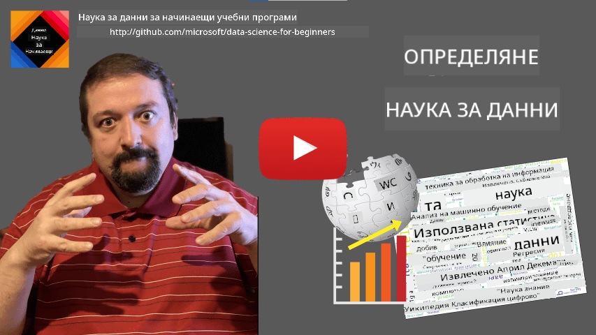

<!--
CO_OP_TRANSLATOR_METADATA:
{
  "original_hash": "2583a9894af7123b2fcae3376b14c035",
  "translation_date": "2025-08-26T15:23:39+00:00",
  "source_file": "1-Introduction/01-defining-data-science/README.md",
  "language_code": "bg"
}
-->
# Определение на науката за данни

|  ](../../sketchnotes/01-Definitions.png) |
| :------------------------------------------------------------------------------------------------: |
|              Определение на науката за данни - _Скица от [@nitya](https://twitter.com/nitya)_       |

---

## [Тест преди лекцията](https://purple-hill-04aebfb03.1.azurestaticapps.net/quiz/0)

## Какво е данни?
В ежедневието си сме постоянно заобиколени от данни. Текстът, който четете в момента, е данни. Списъкът с телефонни номера на вашите приятели в смартфона ви също е данни, както и текущото време, показано на часовника ви. Като хора, ние естествено работим с данни, като броим парите си или пишем писма на приятелите си.

С появата на компютрите обаче данните станаха много по-важни. Основната роля на компютрите е да извършват изчисления, но те се нуждаят от данни, за да работят. Затова е необходимо да разберем как компютрите съхраняват и обработват данни.

С появата на интернет ролята на компютрите като устройства за обработка на данни се увеличи. Ако се замислите, сега използваме компютрите все повече за обработка и комуникация на данни, отколкото за реални изчисления. Когато пишем имейл на приятел или търсим информация в интернет, ние всъщност създаваме, съхраняваме, предаваме и манипулираме данни.
> Можете ли да си спомните последния път, когато сте използвали компютър за реално изчисление?

## Какво е наука за данни?

Според [Уикипедия](https://en.wikipedia.org/wiki/Data_science), **науката за данни** се определя като *научна област, която използва научни методи за извличане на знания и прозрения от структурирани и неструктурирани данни и прилага тези знания и практически прозрения в широк спектър от приложения*.

Това определение подчертава следните важни аспекти на науката за данни:

* Основната цел на науката за данни е да **извлича знания** от данни, с други думи - да **разбира** данните, да намира скрити връзки и да изгражда **модели**.
* Науката за данни използва **научни методи**, като вероятност и статистика. Всъщност, когато терминът *наука за данни* за първи път беше въведен, някои хора твърдяха, че това е просто ново модерно име за статистика. Днес е ясно, че областта е много по-широка.
* Получените знания трябва да се прилагат за създаване на **практически прозрения**, т.е. практически насоки, които могат да се приложат в реални бизнес ситуации.
* Трябва да можем да работим както със **структурирани**, така и с **неструктурирани** данни. Ще се върнем към обсъждането на различните видове данни по-късно в курса.
* **Областта на приложение** е важен аспект, и учените по данни често се нуждаят от известна степен на експертиза в конкретната проблемна област, например: финанси, медицина, маркетинг и др.

> Друг важен аспект на науката за данни е, че тя изучава как данните могат да бъдат събирани, съхранявани и обработвани с помощта на компютри. Докато статистиката ни предоставя математическите основи, науката за данни прилага математическите концепции, за да извлече прозрения от данните.

Един от начините (приписван на [Джим Грей](https://en.wikipedia.org/wiki/Jim_Gray_(computer_scientist))) да разглеждаме науката за данни е като отделна парадигма на науката:
* **Емпирична**, при която разчитаме основно на наблюдения и резултати от експерименти
* **Теоретична**, където нови концепции възникват от съществуващи научни знания
* **Изчислителна**, където откриваме нови принципи въз основа на изчислителни експерименти
* **Данни-водена**, базирана на откриване на връзки и модели в данните  

## Други свързани области

Тъй като данните са навсякъде, науката за данни също е широка област, която докосва много други дисциплини.

## Видове данни

Както вече споменахме, данните са навсякъде. Просто трябва да ги уловим по правилния начин! Полезно е да разграничим **структурирани** и **неструктурирани** данни. Първите обикновено са представени в добре структурирана форма, често като таблица или множество таблици, докато вторите са просто колекция от файлове. Понякога можем да говорим и за **полуструктурирани** данни, които имат някаква структура, но тя може да варира значително.

| Структурирани                                                              | Полуструктурирани                                                                            | Неструктурирани                        |
| -------------------------------------------------------------------------- | ------------------------------------------------------------------------------------------- | -------------------------------------- |
| Списък на хора с техните телефонни номера                                  | Страници в Уикипедия с връзки                                                               | Текст на Енциклопедия Британика       |
| Температура във всички стаи на сграда всяка минута за последните 20 години | Колекция от научни статии във формат JSON с автори, дата на публикуване и резюме            | Споделено хранилище с корпоративни документи |
| Данни за възраст и пол на всички хора, влизащи в сградата                  | Интернет страници                                                                           | Суров видео поток от камера за наблюдение |

## Откъде да се сдобием с данни

Има много възможни източници на данни и е невъзможно да изброим всички! Въпреки това, нека споменем някои от типичните места, откъдето можете да получите данни:

* **Структурирани**
  - **Интернет на нещата** (IoT), включително данни от различни сензори, като сензори за температура или налягане, предоставя много полезни данни. Например, ако офис сграда е оборудвана със сензори IoT, можем автоматично да контролираме отоплението и осветлението, за да минимизираме разходите.
  - **Анкети**, които молим потребителите да попълнят след покупка или след посещение на уебсайт.
  - **Анализ на поведението** може, например, да ни помогне да разберем колко дълбоко потребителят навлиза в сайта и каква е типичната причина за напускане на сайта.
* **Неструктурирани**
  - **Текстове** могат да бъдат богат източник на прозрения, като например обща **оценка на настроението** или извличане на ключови думи и семантично значение.
  - **Изображения** или **видео**. Видео от камера за наблюдение може да се използва за оценка на трафика на пътя и информиране на хората за потенциални задръствания.
  - **Логове на уеб сървъри** могат да се използват, за да разберем кои страници на нашия сайт се посещават най-често и за колко време.
* **Полуструктурирани**
  - **Графи на социални мрежи** могат да бъдат отличен източник на данни за личностите на потребителите и потенциалната ефективност при разпространение на информация.
  - Когато имаме куп снимки от парти, можем да се опитаме да извлечем данни за **груповата динамика**, като изградим граф на хората, които се снимат заедно.

Като познавате различните възможни източници на данни, можете да се опитате да мислите за различни сценарии, в които техниките на науката за данни могат да се приложат, за да разберете по-добре ситуацията и да подобрите бизнес процесите.

## Какво можете да правите с данни

В науката за данни се фокусираме върху следните стъпки от пътя на данните:

Разбира се, в зависимост от конкретните данни, някои стъпки може да липсват (например, когато вече имаме данните в база данни или когато не се нуждаем от обучение на модел), или някои стъпки може да се повтарят няколко пъти (като обработката на данни).

## Дигитализация и дигитална трансформация

През последното десетилетие много бизнеси започнаха да разбират важността на данните при вземането на бизнес решения. За да приложим принципите на науката за данни към управлението на бизнес, първо трябва да съберем някакви данни, т.е. да преведем бизнес процесите в дигитална форма. Това е известно като **дигитализация**. Прилагането на техники на науката за данни към тези данни, за да се ръководят решенията, може да доведе до значителни увеличения на производителността (или дори до промяна на бизнес модела), наречено **дигитална трансформация**.

Нека разгледаме пример. Да предположим, че имаме курс по наука за данни (като този), който предлагаме онлайн на студенти, и искаме да използваме науката за данни, за да го подобрим. Как можем да го направим?

Можем да започнем, като се запитаме "Какво може да се дигитализира?" Най-простият начин би бил да измерим времето, което всеки студент отделя за завършване на всеки модул, и да измерим придобитите знания, като дадем тест с множество отговори в края на всеки модул. Като изчислим средното време за завършване за всички студенти, можем да разберем кои модули причиняват най-големи затруднения и да работим върху тяхното опростяване.
Може да се твърди, че този подход не е идеален, защото модулите могат да бъдат с различна дължина. Вероятно е по-справедливо да се раздели времето на дължината на модула (в брой символи) и да се сравнят тези стойности вместо това.
Когато започнем да анализираме резултатите от тестове с избор между няколко отговора, можем да се опитаме да определим кои концепции затрудняват учениците и да използваме тази информация, за да подобрим съдържанието. За да направим това, трябва да проектираме тестовете така, че всеки въпрос да се свързва с определена концепция или част от знания.

Ако искаме да усложним анализа, можем да начертаем времето, необходимо за завършване на всеки модул, спрямо възрастовата категория на учениците. Може да открием, че за някои възрастови категории е необходимо прекалено много време за завършване на модула или че учениците се отказват преди да го завършат. Това може да ни помогне да предоставим възрастови препоръки за модула и да минимизираме недоволството на хората от неправилни очаквания.

## 🚀 Предизвикателство

В това предизвикателство ще се опитаме да намерим концепции, свързани с областта на науката за данни, като разгледаме текстове. Ще вземем статия от Wikipedia за науката за данни, ще изтеглим и обработим текста, а след това ще създадем облак от думи като този:

Посетете [`notebook.ipynb`](../../../../../../../../../1-Introduction/01-defining-data-science/notebook.ipynb ':ignore'), за да разгледате кода. Можете също така да изпълните кода и да видите как той извършва всички трансформации на данни в реално време.

> Ако не знаете как да изпълнявате код в Jupyter Notebook, разгледайте [тази статия](https://soshnikov.com/education/how-to-execute-notebooks-from-github/).

## [Тест след лекцията](https://purple-hill-04aebfb03.1.azurestaticapps.net/quiz/1)

## Задачи

* **Задача 1**: Модифицирайте горния код, за да откриете свързани концепции за областите **Големи данни** и **Машинно обучение**.
* **Задача 2**: [Помислете за сценарии в науката за данни](assignment.md)

## Благодарности

Този урок е създаден с ♥️ от [Дмитрий Сошников](http://soshnikov.com)

---

**Отказ от отговорност**:  
Този документ е преведен с помощта на AI услуга за превод [Co-op Translator](https://github.com/Azure/co-op-translator). Въпреки че се стремим към точност, моля, имайте предвид, че автоматизираните преводи може да съдържат грешки или неточности. Оригиналният документ на неговия роден език трябва да се счита за авторитетен източник. За критична информация се препоръчва професионален човешки превод. Ние не носим отговорност за недоразумения или погрешни интерпретации, произтичащи от използването на този превод.