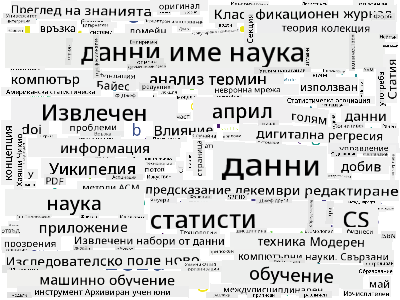

<!--
CO_OP_TRANSLATOR_METADATA:
{
  "original_hash": "8141e7195841682914be03ef930fe43d",
  "translation_date": "2025-09-03T20:30:00+00:00",
  "source_file": "1-Introduction/01-defining-data-science/README.md",
  "language_code": "bg"
}
-->
## Видове данни

Както вече споменахме, данните са навсякъде. Просто трябва да ги уловим по правилния начин! Полезно е да разграничим **структурирани** и **неструктурирани** данни. Първите обикновено са представени в добре организирана форма, често като таблица или множество таблици, докато вторите са просто колекция от файлове. Понякога можем да говорим и за **полуструктурирани** данни, които имат някаква структура, но тя може да варира значително.

| Структурирани                                                               | Полуструктурирани                                                                             | Неструктурирани                          |
| ---------------------------------------------------------------------------- | -------------------------------------------------------------------------------------------- | --------------------------------------- |
| Списък с хора и техните телефонни номера                                     | Страници в Wikipedia с връзки                                                                | Текстът на Енциклопедия Британика       |
| Температура във всички стаи на сграда всяка минута за последните 20 години   | Колекция от научни статии във формат JSON с автори, дата на публикуване и резюме             | Споделени файлове с корпоративни документи |
| Данни за възраст и пол на всички хора, влизащи в сградата                    | Интернет страници                                                                            | Суров видео поток от камера за наблюдение |

## Откъде да вземем данни

Има много възможни източници на данни, и би било невъзможно да изброим всички! Но нека споменем някои от типичните места, откъдето можете да получите данни:

* **Структурирани**
  - **Интернет на нещата** (IoT), включително данни от различни сензори, като температурни или сензори за налягане, предоставя много полезни данни. Например, ако офис сграда е оборудвана с IoT сензори, можем автоматично да контролираме отоплението и осветлението, за да минимизираме разходите.
  - **Анкети**, които молим потребителите да попълнят след покупка или след посещение на уебсайт.
  - **Анализ на поведението** може, например, да ни помогне да разберем колко дълбоко потребителят навлиза в сайта и каква е типичната причина за напускане на сайта.
* **Неструктурирани**
  - **Текстове** могат да бъдат богат източник на информация, като например обща **оценка на настроението** или извличане на ключови думи и семантично значение.
  - **Изображения** или **видео**. Видео от камера за наблюдение може да се използва за оценка на трафика на пътя и за информиране на хората за потенциални задръствания.
  - **Логове** на уеб сървъри могат да се използват за разбиране кои страници на нашия сайт се посещават най-често и за колко време.
* **Полуструктурирани**
  - **Графи на социални мрежи** могат да бъдат отличен източник на данни за личностите на потребителите и потенциалната ефективност при разпространение на информация.
  - Когато имаме куп снимки от парти, можем да се опитаме да извлечем данни за **груповата динамика**, като изградим граф на хората, които се снимат заедно.

Като познавате различните възможни източници на данни, можете да се опитате да мислите за различни сценарии, в които техниките на науката за данни могат да бъдат приложени, за да разберете ситуацията по-добре и да подобрите бизнес процесите.

## Какво можете да правите с данни

В науката за данни се фокусираме върху следните стъпки от пътя на данните:

Разбира се, в зависимост от конкретните данни, някои стъпки може да липсват (например, когато вече имаме данните в база данни или когато не се нуждаем от обучение на модел), или някои стъпки може да се повторят няколко пъти (като обработката на данни).

## Дигитализация и дигитална трансформация

През последното десетилетие много бизнеси започнаха да разбират важността на данните при вземането на бизнес решения. За да приложим принципите на науката за данни към управлението на бизнес, първо трябва да съберем някакви данни, т.е. да преведем бизнес процесите в цифрова форма. Това е известно като **дигитализация**. Прилагането на техники на науката за данни към тези данни за насочване на решения може да доведе до значителни увеличения на производителността (или дори до промяна на бизнес модела), наречено **дигитална трансформация**.

Нека разгледаме пример. Да предположим, че имаме курс по наука за данни (като този), който предлагаме онлайн на студенти, и искаме да използваме науката за данни, за да го подобрим. Как можем да го направим?

Можем да започнем с въпроса "Какво може да бъде дигитализирано?" Най-простият начин би бил да измерим времето, което всеки студент отделя за завършване на всеки модул, и да измерим придобитите знания, като дадем тест с множествен избор в края на всеки модул. Като изчислим средното време за завършване за всички студенти, можем да разберем кои модули причиняват най-големи затруднения и да работим върху тяхното опростяване.
Може да се твърди, че този подход не е идеален, защото модулите могат да бъдат с различна дължина. Вероятно е по-справедливо да се раздели времето на дължината на модула (в брой символи) и да се сравнят тези стойности вместо това.
Когато започнем да анализираме резултатите от тестове с избор на отговор, можем да се опитаме да определим кои концепции затрудняват учениците и да използваме тази информация, за да подобрим съдържанието. За да направим това, трябва да проектираме тестовете така, че всеки въпрос да се свързва с определена концепция или част от знания.

Ако искаме да задълбочим анализа, можем да начертаем времето, необходимо за завършване на всеки модул, спрямо възрастовата категория на учениците. Може да открием, че за някои възрастови категории е необходимо прекалено дълго време за завършване на модула или че учениците се отказват преди да го завършат. Това може да ни помогне да предоставим възрастови препоръки за модула и да минимизираме недоволството на хората от неправилни очаквания.

## 🚀 Предизвикателство

В това предизвикателство ще се опитаме да намерим концепции, свързани с областта на науката за данни, като разгледаме текстове. Ще вземем статия от Wikipedia за науката за данни, ще изтеглим и обработим текста, а след това ще създадем облак от думи като този:

Посетете [`notebook.ipynb`](../../../../../../../../../1-Introduction/01-defining-data-science/notebook.ipynb ':ignore'), за да разгледате кода. Можете също така да изпълните кода и да видите как той извършва всички трансформации на данни в реално време.

> Ако не знаете как да изпълнявате код в Jupyter Notebook, разгледайте [тази статия](https://soshnikov.com/education/how-to-execute-notebooks-from-github/).

## [Тест след лекцията](https://ff-quizzes.netlify.app/en/ds/)

## Задачи

* **Задача 1**: Модифицирайте горния код, за да откриете свързани концепции за областите **Големи данни** и **Машинно обучение**.
* **Задача 2**: [Помислете за сценарии в науката за данни](assignment.md)

## Благодарности

Този урок е създаден с ♥️ от [Дмитрий Сошников](http://soshnikov.com)

---

**Отказ от отговорност**:  
Този документ е преведен с помощта на AI услуга за превод [Co-op Translator](https://github.com/Azure/co-op-translator). Въпреки че се стремим към точност, моля, имайте предвид, че автоматизираните преводи може да съдържат грешки или неточности. Оригиналният документ на неговия роден език трябва да се счита за авторитетен източник. За критична информация се препоръчва професионален човешки превод. Ние не носим отговорност за недоразумения или погрешни интерпретации, произтичащи от използването на този превод.