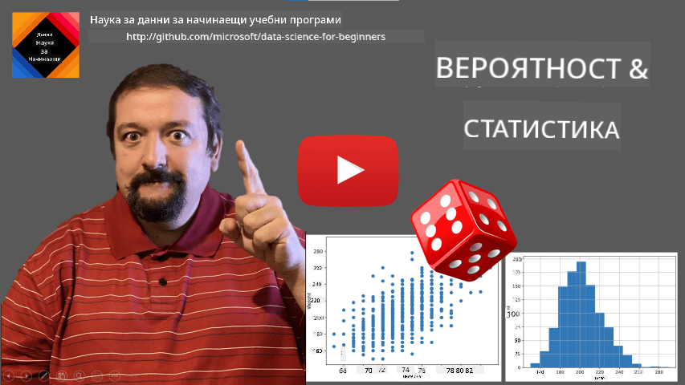
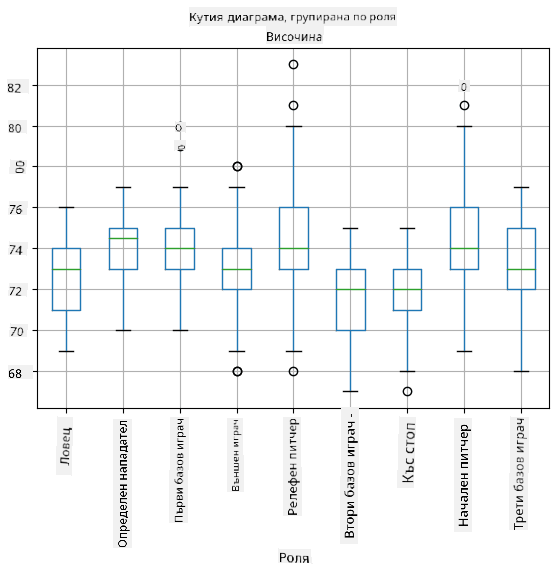
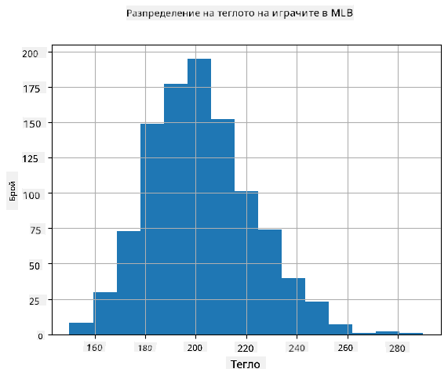
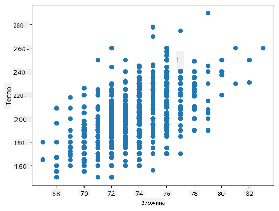

<!--
CO_OP_TRANSLATOR_METADATA:
{
  "original_hash": "b706a07cfa87ba091cbb91e0aa775600",
  "translation_date": "2025-08-26T15:40:30+00:00",
  "source_file": "1-Introduction/04-stats-and-probability/README.md",
  "language_code": "bg"
}
-->
# Кратко въведение в статистиката и теорията на вероятностите

| ](../../sketchnotes/04-Statistics-Probability.png)|
|:---:|
| Статистика и вероятности - _Скетч от [@nitya](https://twitter.com/nitya)_ |

Статистиката и теорията на вероятностите са две силно свързани области на математиката, които са изключително важни за науката за данни. Възможно е да се работи с данни без задълбочени математически познания, но все пак е полезно да се знаят поне основните концепции. Тук ще представим кратко въведение, което ще ви помогне да започнете.

[](https://youtu.be/Z5Zy85g4Yjw)

## [Тест преди лекцията](https://purple-hill-04aebfb03.1.azurestaticapps.net/quiz/6)

## Вероятност и случайни променливи

**Вероятността** е число между 0 и 1, което изразява колко вероятно е дадено **събитие**. Тя се дефинира като броя на положителните изходи (които водят до събитието), разделен на общия брой изходи, при условие че всички изходи са еднакво вероятни. Например, когато хвърлим зар, вероятността да получим четно число е 3/6 = 0.5.

Когато говорим за събития, използваме **случайни променливи**. Например, случайната променлива, която представлява числото, получено при хвърляне на зар, би имала стойности от 1 до 6. Множеството от числа от 1 до 6 се нарича **пространство на извадките**. Можем да говорим за вероятността случайната променлива да приеме определена стойност, например P(X=3)=1/6.

Случайната променлива в предишния пример се нарича **дискретна**, защото има преброимо пространство на извадките, т.е. има отделни стойности, които могат да бъдат изброени. Има случаи, когато пространството на извадките е диапазон от реални числа или целият набор от реални числа. Такива променливи се наричат **непрекъснати**. Добър пример е времето на пристигане на автобус.

## Разпределение на вероятността

В случая на дискретни случайни променливи е лесно да се опише вероятността на всяко събитие чрез функция P(X). За всяка стойност *s* от пространството на извадките *S* тя ще даде число от 0 до 1, така че сумата от всички стойности на P(X=s) за всички събития да бъде 1.

Най-известното дискретно разпределение е **равномерното разпределение**, при което има пространство на извадките с N елемента, с равна вероятност 1/N за всеки от тях.

По-трудно е да се опише разпределението на вероятността на непрекъсната променлива, със стойности, взети от някакъв интервал [a,b] или целия набор от реални числа ℝ. Помислете за случая с времето на пристигане на автобус. Всъщност, за всяко точно време на пристигане *t*, вероятността автобусът да пристигне точно в този момент е 0!

> Сега знаете, че събития с вероятност 0 се случват, и то много често! Поне всеки път, когато автобусът пристигне!

Можем да говорим само за вероятността променливата да попадне в даден интервал от стойности, напр. P(t<sub>1</sub>≤X<t<sub>2</sub>). В този случай разпределението на вероятността се описва чрез **функция на плътността на вероятността** p(x), така че


  
Непрекъснатият аналог на равномерното разпределение се нарича **непрекъснато равномерно**, което е дефинирано върху краен интервал. Вероятността стойността X да попадне в интервал с дължина l е пропорционална на l и достига до 1.

Друго важно разпределение е **нормалното разпределение**, за което ще говорим по-подробно по-долу.

## Средна стойност, дисперсия и стандартно отклонение

Да предположим, че вземаме последователност от n извадки на случайна променлива X: x<sub>1</sub>, x<sub>2</sub>, ..., x<sub>n</sub>. Можем да дефинираме **средната стойност** (или **аритметичното средно**) на последователността по традиционния начин като (x<sub>1</sub>+x<sub>2</sub>+x<sub>n</sub>)/n. С увеличаване на размера на извадката (т.е. вземане на границата при n→∞), ще получим средната стойност (наричана също **очакване**) на разпределението. Ще обозначим очакването с **E**(x).

> Може да се демонстрира, че за всяко дискретно разпределение със стойности {x<sub>1</sub>, x<sub>2</sub>, ..., x<sub>N</sub>} и съответни вероятности p<sub>1</sub>, p<sub>2</sub>, ..., p<sub>N</sub>, очакването ще бъде равно на E(X)=x<sub>1</sub>p<sub>1</sub>+x<sub>2</sub>p<sub>2</sub>+...+x<sub>N</sub>p<sub>N</sub>.

За да определим колко далеч са разпръснати стойностите, можем да изчислим дисперсията σ<sup>2</sup> = ∑(x<sub>i</sub> - μ)<sup>2</sup>/n, където μ е средната стойност на последователността. Стойността σ се нарича **стандартно отклонение**, а σ<sup>2</sup> се нарича **дисперсия**.

## Мода, медиана и квартилни стойности

Понякога средната стойност не представлява адекватно "типичната" стойност за данните. Например, когато има няколко крайни стойности, които са напълно извън обхвата, те могат да повлияят на средната стойност. Друго добро показание е **медианата**, стойност, такава че половината от точките на данните са по-ниски от нея, а другата половина - по-високи.

За да ни помогне да разберем разпределението на данните, е полезно да говорим за **квартилни стойности**:

* Първи квартил, или Q1, е стойност, такава че 25% от данните са под нея
* Трети квартил, или Q3, е стойност, такава че 75% от данните са под нея

Графично можем да представим връзката между медианата и квартилите в диаграма, наречена **кутия диаграма**:


Тук също изчисляваме **междуквартилен обхват** IQR=Q3-Q1 и така наречените **отклонения** - стойности, които лежат извън границите [Q1-1.5*IQR,Q3+1.5*IQR].

За крайно разпределение, което съдържа малък брой възможни стойности, добра "типична" стойност е тази, която се появява най-често, наречена **мода**. Тя често се прилага към категорийни данни, като цветове. Например, ако имаме две групи хора - едни, които силно предпочитат червено, и други, които предпочитат синьо. Ако кодираме цветовете с числа, средната стойност за предпочитан цвят би била някъде в оранжево-зеления спектър, което не показва действителното предпочитание на нито една от групите. Въпреки това, модата би била или един от цветовете, или и двата, ако броят на хората, гласуващи за тях, е равен (в този случай наричаме извадката **мултимодална**).

## Данни от реалния свят

Когато анализираме данни от реалния свят, те често не са случайни променливи в смисъл, че не провеждаме експерименти с неизвестен резултат. Например, разгледайте екип от бейзболни играчи и техните телесни данни, като височина, тегло и възраст. Тези числа не са точно случайни, но все пак можем да приложим същите математически концепции. Например, последователност от теглата на хората може да се счита за последователност от стойности, взети от някаква случайна променлива. Ето последователността от теглата на действителни бейзболни играчи от [Major League Baseball](http://mlb.mlb.com/index.jsp), взета от [този набор от данни](http://wiki.stat.ucla.edu/socr/index.php/SOCR_Data_MLB_HeightsWeights) (за ваше удобство са показани само първите 20 стойности):

```
[180.0, 215.0, 210.0, 210.0, 188.0, 176.0, 209.0, 200.0, 231.0, 180.0, 188.0, 180.0, 185.0, 160.0, 180.0, 185.0, 197.0, 189.0, 185.0, 219.0]
```

> **Note**: За да видите пример за работа с този набор от данни, разгледайте [съпътстващия тетрадка](notebook.ipynb). Има и редица предизвикателства в този урок, които можете да завършите, като добавите малко код към тази тетрадка. Ако не сте сигурни как да работите с данни, не се притеснявайте - ще се върнем към работата с данни с Python на по-късен етап. Ако не знаете как да изпълнявате код в Jupyter Notebook, разгледайте [тази статия](https://soshnikov.com/education/how-to-execute-notebooks-from-github/).

Ето кутия диаграма, показваща средна стойност, медиана и квартилни стойности за нашите данни:


Тъй като нашите данни съдържат информация за различни **ролите** на играчите, можем също да направим кутия диаграма по роли - това ще ни позволи да получим представа как стойностите на параметрите се различават между ролите. Този път ще разгледаме височината:



Тази диаграма предполага, че средно височината на първите бейзмени е по-голяма от височината на вторите бейзмени. По-късно в този урок ще научим как можем да тестваме тази хипотеза по-формално и как да демонстрираме, че нашите данни са статистически значими, за да покажем това.

> Когато работим с данни от реалния свят, приемаме, че всички точки от данни са извадки, взети от някакво разпределение на вероятността. Това предположение ни позволява да прилагаме техники за машинно обучение и да изграждаме работещи предсказателни модели.

За да видим какво е разпределението на нашите данни, можем да начертаем графика, наречена **хистограма**. Оста X ще съдържа броя на различните интервали за тегло (т.нар. **коши**), а вертикалната ос ще показва броя на случаите, когато нашата случайна променлива попада в даден интервал.



От тази хистограма можете да видите, че всички стойности са съсредоточени около определено средно тегло, и колкото по-далеч от това тегло отиваме, толкова по-малко тегла с тази стойност се срещат. Т.е., много малко вероятно е теглото на бейзболен играч да бъде много различно от средното тегло. Дисперсията на теглата показва степента, до която теглата вероятно се различават от средното.

> Ако вземем теглата на други хора, които не са от бейзболната лига, разпределението вероятно ще бъде различно. Въпреки това, формата на разпределението ще бъде същата, но средната стойност и дисперсията ще се променят. Така че, ако обучим нашия модел върху бейзболни играчи, той вероятно ще даде грешни резултати, когато се приложи към студенти от университет, защото основното разпределение е различно.

## Нормално разпределение

Разпределението на теглата, което видяхме по-горе, е много типично, и много измервания от реалния свят следват същия тип разпределение, но с различна средна стойност и дисперсия. Това разпределение се нарича **нормално разпределение**, и то играе много важна роля в статистиката.

Използването на нормално разпределение е правилният начин за генериране на случайни тегла на потенциални бейзболни играчи. След като знаем средното тегло `mean` и стандартното отклонение `std`, можем да генерираме 1000 извадки за тегло по следния начин:
```python
samples = np.random.normal(mean,std,1000)
``` 

Ако начертаем хистограмата на генерираните извадки, ще видим картина, много подобна на показаната по-горе. И ако увеличим броя на извадките и броя на кошите, можем да генерираме картина на нормално разпределение, която е по-близка до идеалната:


*Нормално разпределение със средна стойност=0 и стандартно отклонение=1*

## Интервали на доверие

Когато говорим за теглата на бейзболни играчи, приемаме, че има определена **случайна променлива W**, която съответства на идеалното разпределение на вероятността за теглата на всички бейзболни играчи (т.нар. **популация**). Нашата последователност от тегла съответства на подмножество от всички бейзболни играчи, което наричаме **извадка**. Интересен въпрос е, можем ли да знаем параметрите на разпределението на W, т.е. средната стойност и дисперсията на популацията?

Най-лесният отговор би бил да изчислим средната стойност и дисперсията на нашата извадка. Въпреки това, може да се случи така, че нашата случайна извадка да не представлява точно цялата популация. Затова има смисъл да говорим за **интервал на доверие**.
> **Интервал на доверие** е оценката на истинската средна стойност на популацията, базирана на нашата извадка, която е точна с определена вероятност (или **ниво на доверие**).
Представете си, че имаме извадка X<sub>1</sub>, ..., X<sub>n</sub> от нашето разпределение. Всеки път, когато теглим извадка от разпределението, ще получим различна средна стойност μ. Следователно, μ може да се разглежда като случайна променлива. **Доверителен интервал** с доверие p е двойка стойности (L<sub>p</sub>,R<sub>p</sub>), така че **P**(L<sub>p</sub>≤μ≤R<sub>p</sub>) = p, т.е. вероятността измерената средна стойност да попадне в интервала е равна на p.

Детайлното обяснение как се изчисляват тези доверителни интервали излиза извън рамките на нашето кратко въведение. Повече информация може да се намери [в Уикипедия](https://en.wikipedia.org/wiki/Confidence_interval). Накратко, дефинираме разпределението на изчислената средна стойност на извадката спрямо истинската средна стойност на популацията, което се нарича **разпределение на Стюдънт**.

> **Интересен факт**: Разпределението на Стюдънт е наречено така в чест на математика Уилям Сийли Госет, който публикувал своята работа под псевдонима "Стюдънт". Той работел в пивоварната Гинес и, според една от версиите, работодателят му не искал широката публика да знае, че използват статистически тестове за определяне на качеството на суровините.

Ако искаме да оценим средната стойност μ на нашата популация с доверие p, трябва да вземем *(1-p)/2-ти персентил* от разпределението на Стюдънт A, което може да бъде взето от таблици или изчислено с помощта на вградени функции в статистически софтуер (например Python, R и др.). Тогава интервалът за μ ще бъде даден от X±A*D/√n, където X е получената средна стойност на извадката, а D е стандартното отклонение.

> **Забележка**: Пропускаме и обсъждането на важната концепция за [степени на свобода](https://en.wikipedia.org/wiki/Degrees_of_freedom_(statistics)), която е важна във връзка с разпределението на Стюдънт. Можете да се обърнете към по-подробни книги по статистика, за да разберете тази концепция по-добре.

Пример за изчисляване на доверителен интервал за тегло и височина е даден в [придружаващите тетрадки](notebook.ipynb).

| p    | Средно тегло |
|------|--------------|
| 0.85 | 201.73±0.94  |
| 0.90 | 201.73±1.08  |
| 0.95 | 201.73±1.28  |

Забележете, че колкото по-висока е вероятността за доверие, толкова по-широк е доверителният интервал.

## Тестване на хипотези

В нашия набор от данни за бейзболни играчи има различни роли на играчите, които могат да бъдат обобщени по следния начин (вижте [придружаващата тетрадка](notebook.ipynb), за да видите как може да се изчисли тази таблица):

| Роля               | Височина   | Тегло      | Брой  |
|--------------------|------------|------------|-------|
| Catcher            | 72.723684  | 204.328947 | 76    |
| Designated_Hitter  | 74.222222  | 220.888889 | 18    |
| First_Baseman      | 74.000000  | 213.109091 | 55    |
| Outfielder         | 73.010309  | 199.113402 | 194   |
| Relief_Pitcher     | 74.374603  | 203.517460 | 315   |
| Second_Baseman     | 71.362069  | 184.344828 | 58    |
| Shortstop          | 71.903846  | 182.923077 | 52    |
| Starting_Pitcher   | 74.719457  | 205.163636 | 221   |
| Third_Baseman      | 73.044444  | 200.955556 | 45    |

Можем да забележим, че средната височина на първите базови играчи е по-голяма от тази на вторите базови играчи. Следователно, може да се изкушим да заключим, че **първите базови играчи са по-високи от вторите базови играчи**.

> Това твърдение се нарича **хипотеза**, защото не знаем дали фактът е действително верен или не.

Въпреки това, не винаги е очевидно дали можем да направим това заключение. От горната дискусия знаем, че всяка средна стойност има свързан доверителен интервал и следователно тази разлика може да бъде просто статистическа грешка. Нуждаем се от по-формален начин за тестване на нашата хипотеза.

Нека изчислим доверителните интервали поотделно за височините на първите и вторите базови играчи:

| Доверие | Първи базови играчи | Втори базови играчи |
|---------|----------------------|---------------------|
| 0.85    | 73.62..74.38        | 71.04..71.69        |
| 0.90    | 73.56..74.44        | 70.99..71.73        |
| 0.95    | 73.47..74.53        | 70.92..71.81        |

Виждаме, че при нито едно доверие интервалите не се припокриват. Това доказва нашата хипотеза, че първите базови играчи са по-високи от вторите базови играчи.

По-формално, проблемът, който решаваме, е да проверим дали **две вероятностни разпределения са еднакви**, или поне имат еднакви параметри. В зависимост от разпределението, трябва да използваме различни тестове за това. Ако знаем, че нашите разпределения са нормални, можем да приложим **[t-тест на Стюдънт](https://en.wikipedia.org/wiki/Student%27s_t-test)**.

В t-теста на Стюдънт изчисляваме така наречената **t-стойност**, която показва разликата между средните стойности, като взема предвид вариацията. Демонстрирано е, че t-стойността следва **разпределението на Стюдънт**, което ни позволява да получим прагова стойност за дадено ниво на доверие **p** (това може да бъде изчислено или намерено в числови таблици). След това сравняваме t-стойността с този праг, за да одобрим или отхвърлим хипотезата.

В Python можем да използваме пакета **SciPy**, който включва функцията `ttest_ind` (в допълнение към много други полезни статистически функции!). Тя изчислява t-стойността за нас и също така извършва обратното търсене на p-стойността, така че можем просто да погледнем доверието, за да направим заключение.

Например, нашето сравнение между височините на първите и вторите базови играчи ни дава следните резултати: 
```python
from scipy.stats import ttest_ind

tval, pval = ttest_ind(df.loc[df['Role']=='First_Baseman',['Height']], df.loc[df['Role']=='Designated_Hitter',['Height']],equal_var=False)
print(f"T-value = {tval[0]:.2f}\nP-value: {pval[0]}")
```
```
T-value = 7.65
P-value: 9.137321189738925e-12
```
В нашия случай p-стойността е много ниска, което означава, че има силни доказателства в подкрепа на това, че първите базови играчи са по-високи.

Съществуват и други видове хипотези, които може да искаме да тестваме, например:
* Да докажем, че дадена извадка следва определено разпределение. В нашия случай сме предположили, че височините са нормално разпределени, но това изисква формална статистическа проверка.
* Да докажем, че средната стойност на извадка съответства на предварително зададена стойност.
* Да сравним средните стойности на няколко извадки (например каква е разликата в нивата на щастие между различни възрастови групи).

## Закон за големите числа и централна гранична теорема

Една от причините, поради които нормалното разпределение е толкова важно, е така наречената **централна гранична теорема**. Да предположим, че имаме голяма извадка от независими N стойности X<sub>1</sub>, ..., X<sub>N</sub>, взети от произволно разпределение със средна стойност μ и вариация σ<sup>2</sup>. Тогава, за достатъчно голямо N (с други думи, когато N→∞), средната стойност Σ<sub>i</sub>X<sub>i</sub> ще бъде нормално разпределена със средна стойност μ и вариация σ<sup>2</sup>/N.

> Друг начин за интерпретиране на централната гранична теорема е да се каже, че независимо от разпределението, когато изчислявате средната стойност на сума от произволни стойности на случайни променливи, получавате нормално разпределение.

От централната гранична теорема също следва, че когато N→∞, вероятността средната стойност на извадката да бъде равна на μ става 1. Това е известно като **закон за големите числа**.

## Ковариация и корелация

Една от задачите на науката за данни е да открива връзки между данни. Казваме, че две последователности **корелират**, когато показват подобно поведение по едно и също време, т.е. или се увеличават/намаляват едновременно, или едната се увеличава, когато другата намалява, и обратно. С други думи, изглежда, че има някаква връзка между двете последователности.

> Корелацията не означава непременно причинно-следствена връзка между две последователности; понякога и двете променливи могат да зависят от някаква външна причина, или може да е чиста случайност, че двете последователности корелират. Въпреки това, силната математическа корелация е добър индикатор, че двете променливи са по някакъв начин свързани.

Математически, основната концепция, която показва връзката между две случайни променливи, е **ковариацията**, която се изчислява така: Cov(X,Y) = **E**\[(X-**E**(X))(Y-**E**(Y))\]. Изчисляваме отклонението на двете променливи от техните средни стойности и след това произведението на тези отклонения. Ако и двете променливи се отклоняват заедно, произведението винаги ще бъде положителна стойност, която ще се сумира до положителна ковариация. Ако и двете променливи се отклоняват несинхронно (т.е. едната пада под средното, когато другата се издига над средното), винаги ще получаваме отрицателни числа, които ще се сумират до отрицателна ковариация. Ако отклоненията не са зависими, те ще се сумират до приблизително нула.

Абсолютната стойност на ковариацията не ни казва много за това колко голяма е корелацията, защото зависи от мащаба на действителните стойности. За да я нормализираме, можем да разделим ковариацията на стандартното отклонение на двете променливи, за да получим **корелация**. Добрата новина е, че корелацията винаги е в диапазона [-1,1], където 1 показва силна положителна корелация между стойностите, -1 - силна отрицателна корелация, а 0 - липса на корелация (променливите са независими).

**Пример**: Можем да изчислим корелацията между теглото и височината на бейзболни играчи от споменатия по-горе набор от данни:
```python
print(np.corrcoef(weights,heights))
```
В резултат получаваме **матрица на корелация**, подобна на тази:
```
array([[1.        , 0.52959196],
       [0.52959196, 1.        ]])
```

> Матрицата на корелация C може да бъде изчислена за всякакъв брой входни последователности S<sub>1</sub>, ..., S<sub>n</sub>. Стойността на C<sub>ij</sub> е корелацията между S<sub>i</sub> и S<sub>j</sub>, а диагоналните елементи винаги са 1 (което е и самокорелация на S<sub>i</sub>).

В нашия случай стойността 0.53 показва, че има известна корелация между теглото и височината на човек. Можем също така да направим разсейващ график на една стойност спрямо другата, за да видим връзката визуално:



> Повече примери за корелация и ковариация могат да бъдат намерени в [придружаващата тетрадка](notebook.ipynb).

## Заключение

В този раздел научихме:

* основни статистически свойства на данните, като средна стойност, вариация, мода и квартил
* различни разпределения на случайни променливи, включително нормално разпределение
* как да намерим корелация между различни свойства
* как да използваме математически и статистически методи, за да докажем хипотези
* как да изчислим доверителни интервали за случайна променлива, базирайки се на извадка от данни

Въпреки че това определено не е изчерпателен списък на темите в областта на вероятностите и статистиката, той би трябвало да е достатъчен, за да ви даде добър старт в този курс.

## 🚀 Предизвикателство

Използвайте примерния код в тетрадката, за да тествате следните хипотези:
1. Първите базови играчи са по-възрастни от вторите базови играчи.
2. Първите базови играчи са по-високи от третите базови играчи.
3. Шортстопите са по-високи от вторите базови играчи.

## [Тест след лекцията](https://purple-hill-04aebfb03.1.azurestaticapps.net/quiz/7)

## Преглед и самостоятелно обучение

Вероятностите и статистиката са толкова обширна тема, че заслужават свой собствен курс. Ако искате да задълбаете в теорията, може да продължите с четенето на някои от следните книги:

1. [Карлос Фернандес-Гранда](https://cims.nyu.edu/~cfgranda/) от Нюйоркския университет има страхотни лекционни бележки [Вероятности и статистика за наука за данни](https://cims.nyu.edu/~cfgranda/pages/stuff/probability_stats_for_DS.pdf) (достъпни онлайн).
2. [Питър и Андрю Брус. Практическа статистика за специалисти по данни.](https://www.oreilly.com/library/view/practical-statistics-for/9781491952955/) [[примерен код на R](https://github.com/andrewgbruce/statistics-for-data-scientists)].
3. [Джеймс Д. Милър. Статистика за наука за данни](https://www.packtpub.com/product/statistics-for-data-science/9781788290678) [[примерен код на R](https://github.com/PacktPublishing/Statistics-for-Data-Science)].

## Задача

[Малко изследване за диабет](assignment.md)

## Благодарности

Този урок е създаден с ♥️ от [Дмитрий Сошников](http://soshnikov.com)

---

**Отказ от отговорност**:  
Този документ е преведен с помощта на AI услуга за превод [Co-op Translator](https://github.com/Azure/co-op-translator). Въпреки че се стремим към точност, моля, имайте предвид, че автоматичните преводи може да съдържат грешки или неточности. Оригиналният документ на неговия изходен език трябва да се счита за авторитетен източник. За критична информация се препоръчва професионален превод от човек. Ние не носим отговорност за каквито и да е недоразумения или погрешни интерпретации, произтичащи от използването на този превод.