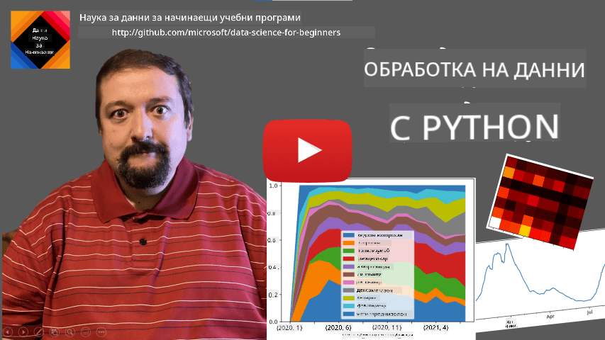
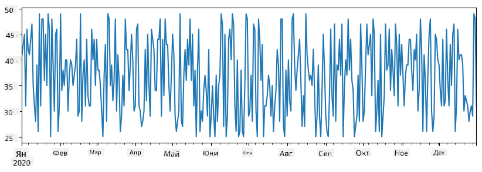
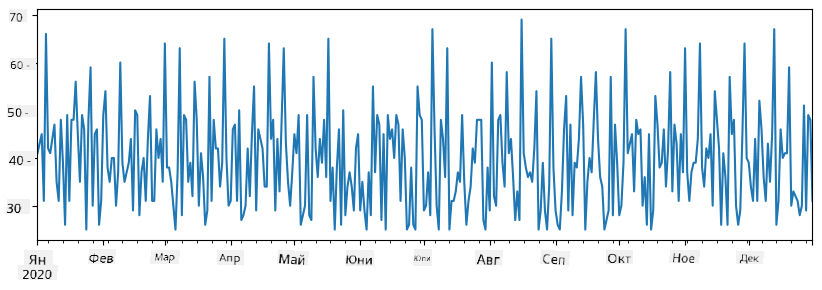
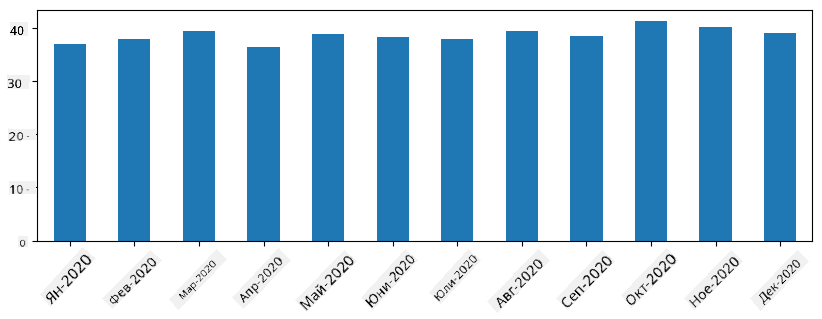
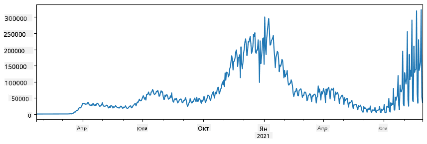
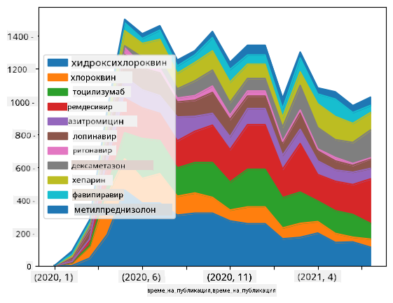

<!--
CO_OP_TRANSLATOR_METADATA:
{
  "original_hash": "7bfec050f4717dcc2dfd028aca9d21f3",
  "translation_date": "2025-09-06T15:59:51+00:00",
  "source_file": "2-Working-With-Data/07-python/README.md",
  "language_code": "bg"
}
-->
# Работа с данни: Python и библиотеката Pandas

|  ](../../sketchnotes/07-WorkWithPython.png) |
| :---------------------------------------------------------------------------------------------------: |
|                 Работа с Python - _Скетч от [@nitya](https://twitter.com/nitya)_                     |

[](https://youtu.be/dZjWOGbsN4Y)

Докато базите данни предлагат много ефективни начини за съхранение на данни и тяхното извличане чрез език за заявки, най-гъвкавият начин за обработка на данни е да напишете собствена програма за манипулиране на данните. В много случаи използването на заявка към база данни би било по-ефективно. Въпреки това, в някои случаи, когато е необходима по-сложна обработка на данни, това не може лесно да се направи с SQL. 
Обработката на данни може да бъде програмирана на всеки език за програмиране, но има определени езици, които са по-високо ниво, когато става въпрос за работа с данни. Специалистите по данни обикновено предпочитат един от следните езици:

* **[Python](https://www.python.org/)**, универсален език за програмиране, който често се счита за един от най-добрите варианти за начинаещи поради своята простота. Python има много допълнителни библиотеки, които могат да ви помогнат да решите много практически проблеми, като например извличане на данни от ZIP архив или конвертиране на изображение в сиво. Освен за обработка на данни, Python често се използва и за уеб разработка. 
* **[R](https://www.r-project.org/)** е традиционен инструмент, разработен с цел статистическа обработка на данни. Той също така съдържа голямо хранилище от библиотеки (CRAN), което го прави добър избор за обработка на данни. Въпреки това, R не е универсален език за програмиране и рядко се използва извън домейна на обработката на данни.
* **[Julia](https://julialang.org/)** е друг език, разработен специално за обработка на данни. Той е предназначен да предостави по-добра производителност от Python, което го прави отличен инструмент за научни експерименти.

В този урок ще се фокусираме върху използването на Python за проста обработка на данни. Ще предположим основно познаване на езика. Ако искате по-задълбочен курс по Python, можете да се обърнете към някой от следните ресурси:

* [Научете Python по забавен начин с графики на костенурки и фрактали](https://github.com/shwars/pycourse) - Бърз въведение в програмирането с Python, базиран на GitHub
* [Направете първите си стъпки с Python](https://docs.microsoft.com/en-us/learn/paths/python-first-steps/?WT.mc_id=academic-77958-bethanycheum) Път за обучение на [Microsoft Learn](http://learn.microsoft.com/?WT.mc_id=academic-77958-bethanycheum)

Данните могат да бъдат в много форми. В този урок ще разгледаме три форми на данни - **таблични данни**, **текст** и **изображения**.

Ще се фокусираме върху няколко примера за обработка на данни, вместо да ви предоставим пълен преглед на всички свързани библиотеки. Това ще ви позволи да получите основната идея за възможностите и да разберете къде да намерите решения на вашите проблеми, когато имате нужда.

> **Най-полезен съвет**. Когато трябва да извършите определена операция върху данни, която не знаете как да направите, опитайте да я потърсите в интернет. [Stackoverflow](https://stackoverflow.com/) обикновено съдържа много полезни примери за код на Python за много типични задачи.


## [Тест преди лекцията](https://ff-quizzes.netlify.app/en/ds/quiz/12)

## Таблични данни и Dataframes

Вече сте се срещали с таблични данни, когато говорихме за релационни бази данни. Когато имате много данни, и те са съдържани в много различни свързани таблици, определено има смисъл да използвате SQL за работа с тях. Въпреки това, има много случаи, когато имаме таблица с данни и трябва да получим някакво **разбиране** или **информация** за тези данни, като например разпределение, корелация между стойности и т.н. В обработката на данни има много случаи, когато трябва да извършим някои трансформации на оригиналните данни, последвани от визуализация. И двете стъпки могат лесно да се направят с Python.

Има две най-полезни библиотеки в Python, които могат да ви помогнат да работите с таблични данни:
* **[Pandas](https://pandas.pydata.org/)** ви позволява да манипулирате така наречените **Dataframes**, които са аналогични на релационни таблици. Можете да имате именувани колони и да извършвате различни операции върху редове, колони и Dataframes като цяло. 
* **[Numpy](https://numpy.org/)** е библиотека за работа с **тензори**, т.е. многомерни **масиви**. Масивът има стойности от един и същ основен тип и е по-прост от Dataframe, но предлага повече математически операции и създава по-малко натоварване.

Има и няколко други библиотеки, които трябва да знаете:
* **[Matplotlib](https://matplotlib.org/)** е библиотека, използвана за визуализация на данни и чертане на графики
* **[SciPy](https://www.scipy.org/)** е библиотека с някои допълнителни научни функции. Вече сме се срещали с тази библиотека, когато говорихме за вероятности и статистика

Ето парче код, което обикновено бихте използвали, за да импортирате тези библиотеки в началото на вашата Python програма:
```python
import numpy as np
import pandas as pd
import matplotlib.pyplot as plt
from scipy import ... # you need to specify exact sub-packages that you need
``` 

Pandas се основава на няколко основни концепции.

### Series 

**Series** е последователност от стойности, подобна на списък или numpy масив. Основната разлика е, че Series също има **индекс**, и когато работим със Series (например, ги събираме), индексът се взема предвид. Индексът може да бъде толкова прост, колкото цяло число за номер на ред (това е индексът, използван по подразбиране при създаване на Series от списък или масив), или може да има сложна структура, като например интервал от дати.

> **Забележка**: В придружаващия notebook [`notebook.ipynb`](notebook.ipynb) има въведение в кода на Pandas. Тук само очертаваме някои примери, но определено можете да разгледате пълния notebook.

Да разгледаме пример: искаме да анализираме продажбите на нашия магазин за сладолед. Нека генерираме серия от числа за продажби (брой продадени артикули всеки ден) за определен период от време:

```python
start_date = "Jan 1, 2020"
end_date = "Mar 31, 2020"
idx = pd.date_range(start_date,end_date)
print(f"Length of index is {len(idx)}")
items_sold = pd.Series(np.random.randint(25,50,size=len(idx)),index=idx)
items_sold.plot()
```


Сега да предположим, че всяка седмица организираме парти за приятели и вземаме допълнителни 10 опаковки сладолед за партито. Можем да създадем друга серия, индексирана по седмици, за да демонстрираме това:
```python
additional_items = pd.Series(10,index=pd.date_range(start_date,end_date,freq="W"))
```
Когато съберем двете серии, получаваме общия брой:
```python
total_items = items_sold.add(additional_items,fill_value=0)
total_items.plot()
```


> **Забележка**: Не използваме простия синтаксис `total_items+additional_items`. Ако го направим, ще получим много стойности `NaN` (*Not a Number*) в резултатната серия. Това е така, защото липсват стойности за някои точки от индекса в серията `additional_items`, и добавянето на `NaN` към нещо води до `NaN`. Затова трябва да зададем параметъра `fill_value` по време на събирането.

С времеви серии можем също да **преизчислим** серията с различни времеви интервали. Например, ако искаме да изчислим средния обем на продажбите месечно, можем да използваме следния код:
```python
monthly = total_items.resample("1M").mean()
ax = monthly.plot(kind='bar')
```


### DataFrame

DataFrame е по същество колекция от серии със същия индекс. Можем да комбинираме няколко серии в DataFrame:
```python
a = pd.Series(range(1,10))
b = pd.Series(["I","like","to","play","games","and","will","not","change"],index=range(0,9))
df = pd.DataFrame([a,b])
```
Това ще създаде хоризонтална таблица като тази:
|     | 0   | 1    | 2   | 3   | 4      | 5   | 6      | 7    | 8    |
| --- | --- | ---- | --- | --- | ------ | --- | ------ | ---- | ---- |
| 0   | 1   | 2    | 3   | 4   | 5      | 6   | 7      | 8    | 9    |
| 1   | I   | like | to  | use | Python | and | Pandas | very | much |

Можем също да използваме Series като колони и да зададем имена на колони чрез речник:
```python
df = pd.DataFrame({ 'A' : a, 'B' : b })
```
Това ще ни даде таблица като тази:

|     | A   | B      |
| --- | --- | ------ |
| 0   | 1   | I      |
| 1   | 2   | like   |
| 2   | 3   | to     |
| 3   | 4   | use    |
| 4   | 5   | Python |
| 5   | 6   | and    |
| 6   | 7   | Pandas |
| 7   | 8   | very   |
| 8   | 9   | much   |

**Забележка**: Можем също да получим този изглед на таблицата, като транспонираме предишната таблица, например, като напишем 
```python
df = pd.DataFrame([a,b]).T..rename(columns={ 0 : 'A', 1 : 'B' })
```
Тук `.T` означава операцията на транспониране на DataFrame, т.е. размяна на редове и колони, а операцията `rename` ни позволява да преименуваме колоните, за да съответстват на предишния пример.

Ето някои от най-важните операции, които можем да извършим върху DataFrames:

**Избор на колони**. Можем да изберем отделни колони, като напишем `df['A']` - тази операция връща Series. Можем също да изберем подмножество от колони в друг DataFrame, като напишем `df[['B','A']]` - това връща друг DataFrame.

**Филтриране** само на определени редове по критерии. Например, за да оставим само редовете, където колоната `A` е по-голяма от 5, можем да напишем `df[df['A']>5]`.

> **Забележка**: Начинът, по който работи филтрирането, е следният. Изразът `df['A']<5` връща булева серия, която показва дали изразът е `True` или `False` за всеки елемент от оригиналната серия `df['A']`. Когато булевата серия се използва като индекс, тя връща подмножество от редове в DataFrame. Следователно не е възможно да се използва произволен булев израз на Python, например, написването на `df[df['A']>5 and df['A']<7]` би било грешно. Вместо това трябва да използвате специалната операция `&` върху булеви серии, като напишете `df[(df['A']>5) & (df['A']<7)]` (*скобите са важни тук*).

**Създаване на нови изчисляеми колони**. Можем лесно да създадем нови изчисляеми колони за нашия DataFrame, като използваме интуитивен израз като този:
```python
df['DivA'] = df['A']-df['A'].mean() 
``` 
Този пример изчислява отклонението на A от неговата средна стойност. Това, което всъщност се случва тук, е, че изчисляваме серия и след това я присвояваме на лявата страна, създавайки друга колона. Следователно, не можем да използваме никакви операции, които не са съвместими със серии, например, следният код е грешен:
```python
# Wrong code -> df['ADescr'] = "Low" if df['A'] < 5 else "Hi"
df['LenB'] = len(df['B']) # <- Wrong result
``` 
Последният пример, макар и синтактично правилен, ни дава грешен резултат, защото присвоява дължината на серията `B` на всички стойности в колоната, а не дължината на отделните елементи, както сме възнамерявали.

Ако трябва да изчислим сложни изрази като този, можем да използваме функцията `apply`. Последният пример може да бъде написан по следния начин:
```python
df['LenB'] = df['B'].apply(lambda x : len(x))
# or 
df['LenB'] = df['B'].apply(len)
```

След горните операции ще получим следния DataFrame:

|     | A   | B      | DivA | LenB |
| --- | --- | ------ | ---- | ---- |
| 0   | 1   | I      | -4.0 | 1    |
| 1   | 2   | like   | -3.0 | 4    |
| 2   | 3   | to     | -2.0 | 2    |
| 3   | 4   | use    | -1.0 | 3    |
| 4   | 5   | Python | 0.0  | 6    |
| 5   | 6   | and    | 1.0  | 3    |
| 6   | 7   | Pandas | 2.0  | 6    |
| 7   | 8   | very   | 3.0  | 4    |
| 8   | 9   | much   | 4.0  | 4    |

**Избор на редове по номера** може да се направи с конструкцията `iloc`. Например, за да изберем първите 5 реда от DataFrame:
```python
df.iloc[:5]
```

**Групиране** често се използва за получаване на резултат, подобен на *сводни таблици* в Excel. Да предположим, че искаме да изчислим средната стойност на колоната `A` за всяка дадена стойност на `LenB`. Тогава можем да групираме нашия DataFrame по `LenB` и да извикаме `mean`:
```python
df.groupby(by='LenB')[['A','DivA']].mean()
```
Ако трябва да изчислим средната стойност и броя на елементите в групата, тогава можем да използваме по-сложната функция `aggregate`:
```python
df.groupby(by='LenB') \
 .aggregate({ 'DivA' : len, 'A' : lambda x: x.mean() }) \
 .rename(columns={ 'DivA' : 'Count', 'A' : 'Mean'})
```
Това ни дава следната таблица:

| LenB | Count | Mean     |
| ---- | ----- | -------- |
| 1    | 1     | 1.000000 |
| 2    | 1     | 3.000000 |
| 3    | 2     | 5.000000 |
| 4    | 3     | 6.333333 |
| 6    | 2     | 6.000000 |

### Получаване на данни
Вече видяхме колко лесно е да създаваме Series и DataFrames от Python обекти. Въпреки това, данните обикновено идват под формата на текстов файл или Excel таблица. За щастие, Pandas ни предлага лесен начин за зареждане на данни от диска. Например, четенето на CSV файл е толкова просто, колкото това:
```python
df = pd.read_csv('file.csv')
```
Ще видим още примери за зареждане на данни, включително извличането им от външни уебсайтове, в секцията "Предизвикателство".

### Печатане и визуализация

Един Data Scientist често трябва да изследва данните, затова е важно да може да ги визуализира. Когато DataFrame е голям, често искаме просто да се уверим, че правим всичко правилно, като отпечатаме първите няколко реда. Това може да се направи чрез извикване на `df.head()`. Ако го изпълнявате от Jupyter Notebook, той ще отпечата DataFrame в хубава таблична форма.

Вече видяхме използването на функцията `plot` за визуализация на някои колони. Докато `plot` е много полезен за много задачи и поддържа различни типове графики чрез параметъра `kind=`, винаги можете да използвате библиотеката `matplotlib`, за да създадете нещо по-сложно. Ще разгледаме визуализацията на данни подробно в отделни уроци от курса.

Този преглед обхваща най-важните концепции на Pandas, но библиотеката е много богата и няма ограничения за това, което можете да направите с нея! Нека сега приложим тези знания за решаване на конкретен проблем.

## 🚀 Предизвикателство 1: Анализ на разпространението на COVID

Първият проблем, върху който ще се фокусираме, е моделирането на епидемичното разпространение на COVID-19. За да направим това, ще използваме данни за броя на заразените лица в различни страни, предоставени от [Center for Systems Science and Engineering](https://systems.jhu.edu/) (CSSE) към [Johns Hopkins University](https://jhu.edu/). Данните са достъпни в [този GitHub репозиторий](https://github.com/CSSEGISandData/COVID-19).

Тъй като искаме да демонстрираме как да работим с данни, ви каним да отворите [`notebook-covidspread.ipynb`](notebook-covidspread.ipynb) и да го прочетете от началото до края. Можете също така да изпълните клетките и да решите някои предизвикателства, които сме оставили за вас в края.



> Ако не знаете как да изпълнявате код в Jupyter Notebook, разгледайте [тази статия](https://soshnikov.com/education/how-to-execute-notebooks-from-github/).

## Работа с неструктурирани данни

Докато данните много често идват в таблична форма, в някои случаи трябва да работим с по-малко структурирани данни, например текст или изображения. В този случай, за да приложим техниките за обработка на данни, които видяхме по-горе, трябва по някакъв начин да **извлечем** структурирани данни. Ето няколко примера:

* Извличане на ключови думи от текст и анализ на честотата на появата им
* Използване на невронни мрежи за извличане на информация за обекти на изображението
* Получаване на информация за емоциите на хората от видео поток

## 🚀 Предизвикателство 2: Анализ на COVID научни статии

В това предизвикателство ще продължим с темата за пандемията COVID и ще се фокусираме върху обработката на научни статии по темата. Съществува [CORD-19 Dataset](https://www.kaggle.com/allen-institute-for-ai/CORD-19-research-challenge) с повече от 7000 (към момента на писане) статии за COVID, достъпни с метаданни и резюмета (а за около половината от тях има и пълни текстове).

Пълен пример за анализ на този набор от данни с помощта на [Text Analytics for Health](https://docs.microsoft.com/azure/cognitive-services/text-analytics/how-tos/text-analytics-for-health/?WT.mc_id=academic-77958-bethanycheum) когнитивна услуга е описан [в този блог пост](https://soshnikov.com/science/analyzing-medical-papers-with-azure-and-text-analytics-for-health/). Ще обсъдим опростена версия на този анализ.

> **NOTE**: Не предоставяме копие на набора от данни като част от този репозиторий. Може първо да се наложи да изтеглите файла [`metadata.csv`](https://www.kaggle.com/allen-institute-for-ai/CORD-19-research-challenge?select=metadata.csv) от [този набор от данни в Kaggle](https://www.kaggle.com/allen-institute-for-ai/CORD-19-research-challenge). Може да се изисква регистрация в Kaggle. Можете също така да изтеглите набора от данни без регистрация [оттук](https://ai2-semanticscholar-cord-19.s3-us-west-2.amazonaws.com/historical_releases.html), но той ще включва всички пълни текстове в допълнение към файла с метаданни.

Отворете [`notebook-papers.ipynb`](notebook-papers.ipynb) и го прочетете от началото до края. Можете също така да изпълните клетките и да решите някои предизвикателства, които сме оставили за вас в края.



## Обработка на данни от изображения

Напоследък са разработени много мощни AI модели, които ни позволяват да разбираме изображения. Съществуват много задачи, които могат да бъдат решени с помощта на предварително обучени невронни мрежи или облачни услуги. Някои примери включват:

* **Класификация на изображения**, която може да ви помогне да категоризирате изображението в една от предварително дефинираните категории. Можете лесно да обучите свои собствени класификатори на изображения, използвайки услуги като [Custom Vision](https://azure.microsoft.com/services/cognitive-services/custom-vision-service/?WT.mc_id=academic-77958-bethanycheum)
* **Откриване на обекти**, за да откриете различни обекти на изображението. Услуги като [computer vision](https://azure.microsoft.com/services/cognitive-services/computer-vision/?WT.mc_id=academic-77958-bethanycheum) могат да откриват редица често срещани обекти, а можете да обучите модел [Custom Vision](https://azure.microsoft.com/services/cognitive-services/custom-vision-service/?WT.mc_id=academic-77958-bethanycheum), за да откривате специфични обекти от интерес.
* **Откриване на лица**, включително възраст, пол и емоции. Това може да се направи чрез [Face API](https://azure.microsoft.com/services/cognitive-services/face/?WT.mc_id=academic-77958-bethanycheum).

Всички тези облачни услуги могат да бъдат извикани с помощта на [Python SDKs](https://docs.microsoft.com/samples/azure-samples/cognitive-services-python-sdk-samples/cognitive-services-python-sdk-samples/?WT.mc_id=academic-77958-bethanycheum) и следователно могат лесно да бъдат включени във вашия работен процес за изследване на данни.

Ето някои примери за изследване на данни от източници на изображения:
* В блог поста [Как да учим Data Science без програмиране](https://soshnikov.com/azure/how-to-learn-data-science-without-coding/) изследваме снимки от Instagram, опитвайки се да разберем какво кара хората да харесват повече дадена снимка. Първо извличаме колкото се може повече информация от снимките, използвайки [computer vision](https://azure.microsoft.com/services/cognitive-services/computer-vision/?WT.mc_id=academic-77958-bethanycheum), а след това използваме [Azure Machine Learning AutoML](https://docs.microsoft.com/azure/machine-learning/concept-automated-ml/?WT.mc_id=academic-77958-bethanycheum), за да изградим интерпретируем модел.
* В [Facial Studies Workshop](https://github.com/CloudAdvocacy/FaceStudies) използваме [Face API](https://azure.microsoft.com/services/cognitive-services/face/?WT.mc_id=academic-77958-bethanycheum), за да извлечем емоции на хората от снимки на събития, с цел да разберем какво прави хората щастливи.

## Заключение

Независимо дали вече имате структурирани или неструктурирани данни, с помощта на Python можете да изпълните всички стъпки, свързани с обработката и разбирането на данни. Това вероятно е най-гъвкавият начин за обработка на данни и затова мнозинството от специалистите по данни използват Python като основен инструмент. Да изучите Python в дълбочина вероятно е добра идея, ако сте сериозни за вашето пътуване в света на Data Science!

## [Тест след лекцията](https://ff-quizzes.netlify.app/en/ds/quiz/13)

## Преглед и самостоятелно обучение

**Книги**
* [Wes McKinney. Python for Data Analysis: Data Wrangling with Pandas, NumPy, and IPython](https://www.amazon.com/gp/product/1491957662)

**Онлайн ресурси**
* Официален [10 minutes to Pandas](https://pandas.pydata.org/pandas-docs/stable/user_guide/10min.html) урок
* [Документация за визуализация с Pandas](https://pandas.pydata.org/pandas-docs/stable/user_guide/visualization.html)

**Изучаване на Python**
* [Научете Python по забавен начин с Turtle Graphics и фрактали](https://github.com/shwars/pycourse)
* [Направете първите си стъпки с Python](https://docs.microsoft.com/learn/paths/python-first-steps/?WT.mc_id=academic-77958-bethanycheum) учебен път на [Microsoft Learn](http://learn.microsoft.com/?WT.mc_id=academic-77958-bethanycheum)

## Задание

[Извършете по-подробно изследване на данните за горните предизвикателства](assignment.md)

## Кредити

Този урок е създаден с ♥️ от [Dmitry Soshnikov](http://soshnikov.com)

---

**Отказ от отговорност**:  
Този документ е преведен с помощта на AI услуга за превод [Co-op Translator](https://github.com/Azure/co-op-translator). Въпреки че се стремим към точност, моля, имайте предвид, че автоматичните преводи може да съдържат грешки или неточности. Оригиналният документ на неговия изходен език трябва да се счита за авторитетен източник. За критична информация се препоръчва професионален превод от човек. Ние не носим отговорност за каквито и да е недоразумения или погрешни интерпретации, произтичащи от използването на този превод.