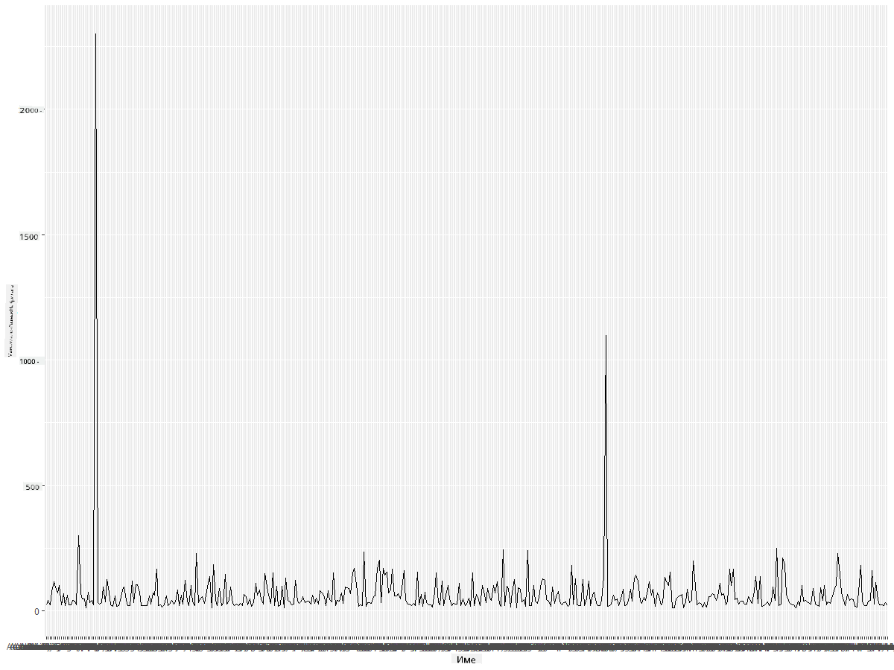
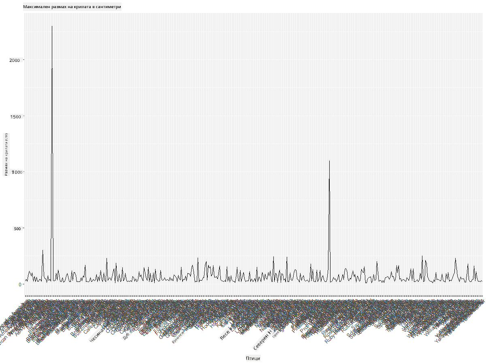
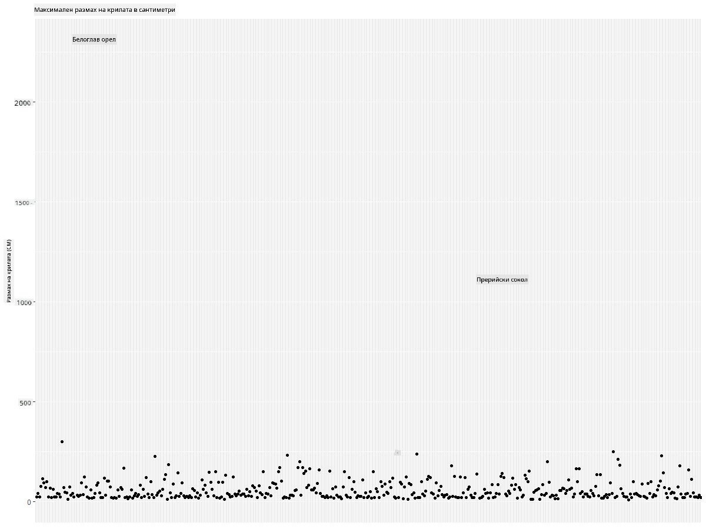
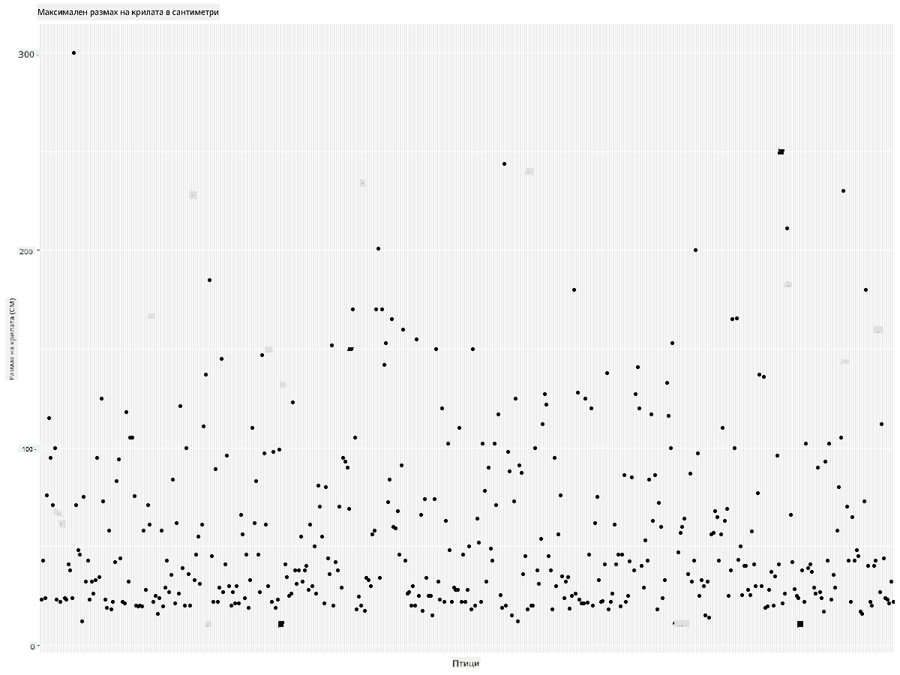
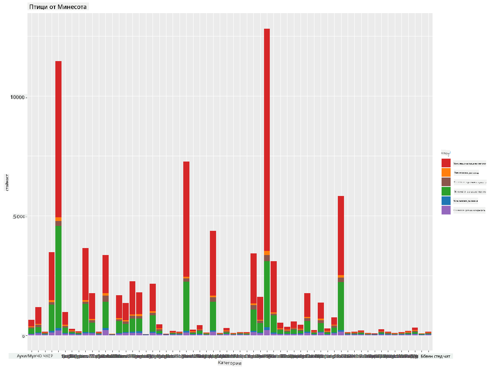
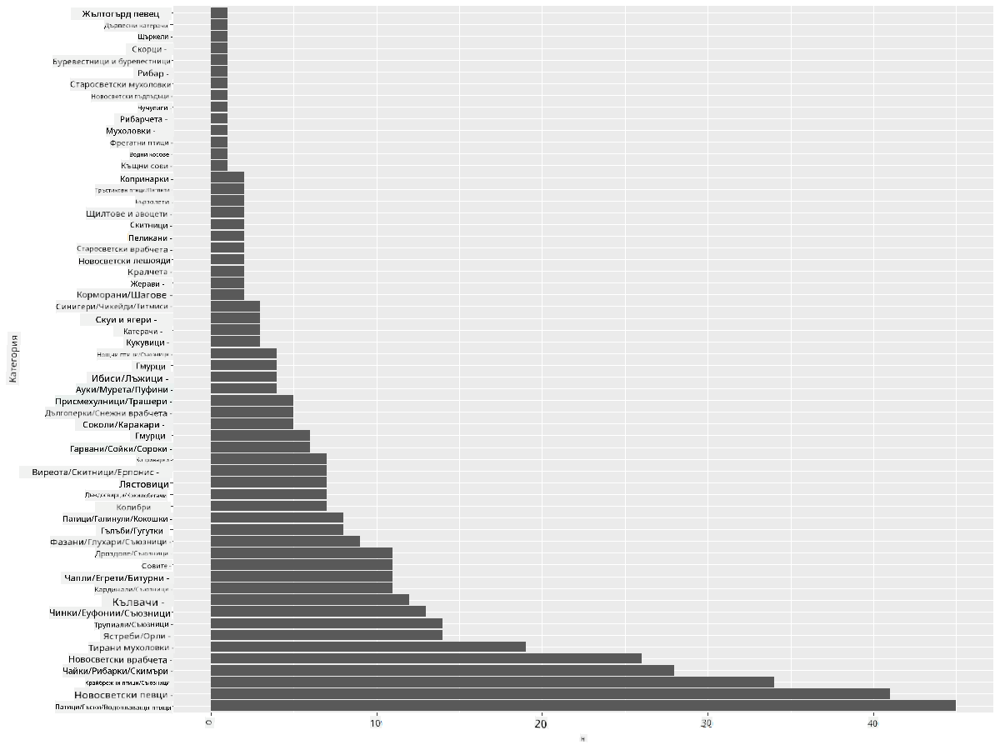
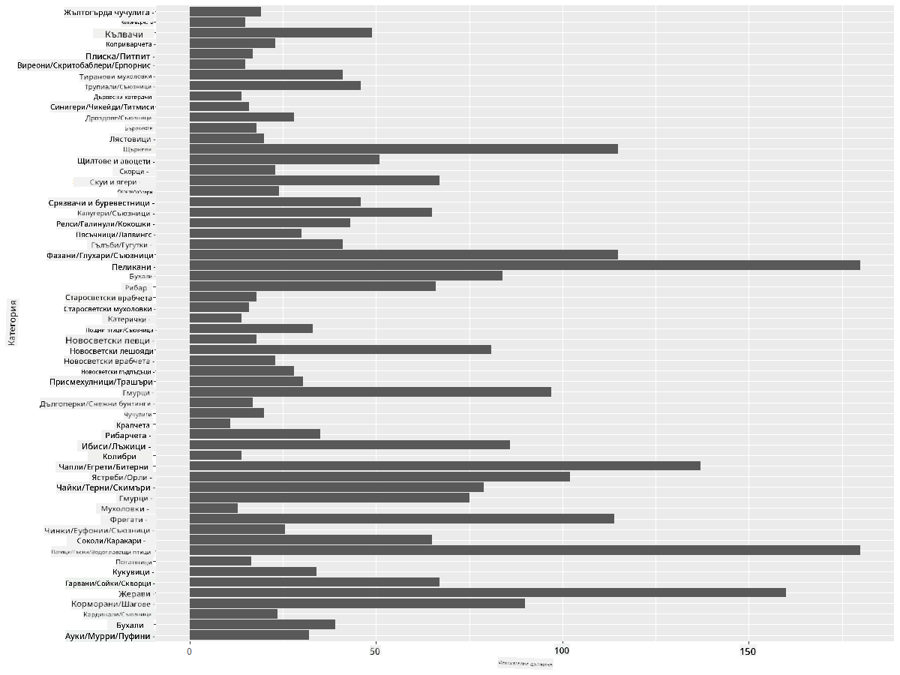
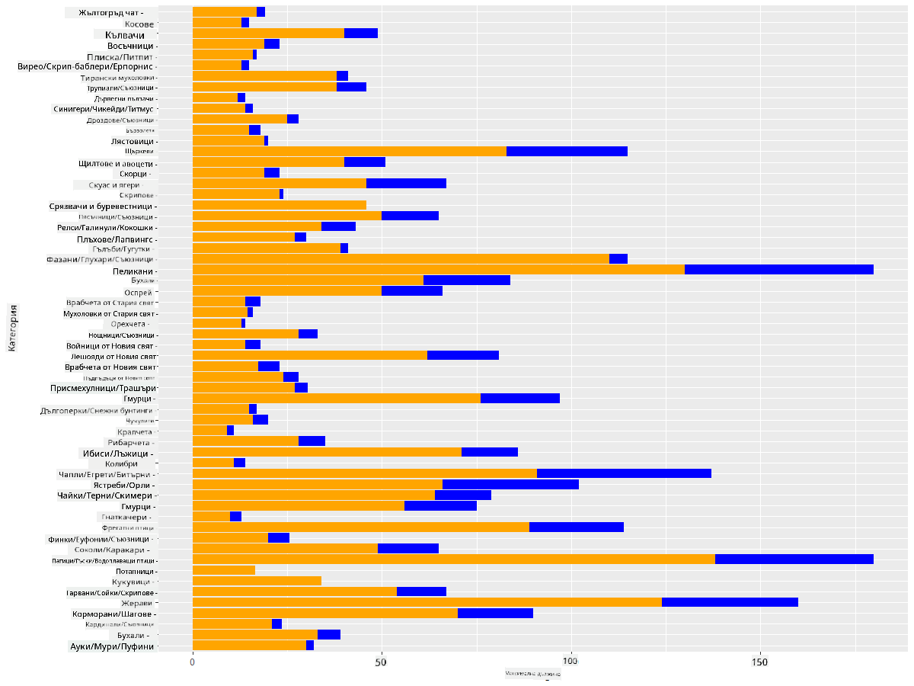

<!--
CO_OP_TRANSLATOR_METADATA:
{
  "original_hash": "22acf28f518a4769ea14fa42f4734b9f",
  "translation_date": "2025-08-26T17:12:23+00:00",
  "source_file": "3-Data-Visualization/R/09-visualization-quantities/README.md",
  "language_code": "bg"
}
-->
# Визуализиране на количества
| ](https://github.com/microsoft/Data-Science-For-Beginners/blob/main/sketchnotes/09-Visualizing-Quantities.png)|
|:---:|
| Визуализиране на количества - _Скетч от [@nitya](https://twitter.com/nitya)_ |

В този урок ще разгледате как да използвате някои от многото налични библиотеки на R, за да създавате интересни визуализации, свързани с концепцията за количество. Използвайки почистен набор от данни за птиците в Минесота, можете да научите много интересни факти за местната дива природа.  
## [Тест преди лекцията](https://purple-hill-04aebfb03.1.azurestaticapps.net/quiz/16)

## Наблюдавайте размах на крилата с ggplot2
Отлична библиотека за създаване както на прости, така и на сложни графики и диаграми от различен вид е [ggplot2](https://cran.r-project.org/web/packages/ggplot2/index.html). В общи линии, процесът на визуализиране на данни с тези библиотеки включва идентифициране на частите от вашия датафрейм, които искате да използвате, извършване на необходимите трансформации на данните, задаване на стойностите за x и y осите, избор на типа графика и след това визуализиране на графиката.

`ggplot2` е система за декларативно създаване на графики, базирана на Граматиката на графиките. [Граматиката на графиките](https://en.wikipedia.org/wiki/Ggplot2) е обща схема за визуализация на данни, която разделя графиките на семантични компоненти като скали и слоеве. С други думи, лекотата на създаване на графики за едномерни или многомерни данни с малко код прави `ggplot2` най-популярния пакет за визуализации в R. Потребителят указва на `ggplot2` как да свърже променливите с естетиката, какви графични примитиви да използва, а `ggplot2` се грижи за останалото.

> ✅ Графика = Данни + Естетика + Геометрия  
> - Данни се отнася до набора от данни  
> - Естетика указва променливите за изследване (x и y променливи)  
> - Геометрия се отнася до типа графика (линейна графика, стълбовидна диаграма и т.н.)

Изберете най-подходящата геометрия (тип графика) според вашите данни и историята, която искате да разкажете чрез графиката.

> - За анализ на тенденции: линейна, колонна  
> - За сравнение на стойности: стълбовидна, колонна, кръгова, точкова диаграма  
> - За показване на части от цялото: кръгова  
> - За показване на разпределение на данни: точкова, стълбовидна  
> - За показване на връзки между стойности: линейна, точкова, балонна  

✅ Можете също да разгледате този описателен [cheatsheet](https://nyu-cdsc.github.io/learningr/assets/data-visualization-2.1.pdf) за ggplot2.

## Създайте линейна графика за стойностите на размаха на крилата на птиците

Отворете R конзолата и импортирайте набора от данни.  
> Забележка: Наборът от данни се намира в основната директория на това хранилище в папката `/data`.

Нека импортираме набора от данни и разгледаме първите 5 реда от данните.

```r
birds <- read.csv("../../data/birds.csv",fileEncoding="UTF-8-BOM")
head(birds)
```  
Първите редове от данните съдържат смес от текст и числа:

|      | Име                          | Научно име             | Категория             | Разред       | Семейство | Род         | Статус на опазване | Мин. дължина | Макс. дължина | Мин. тегло | Макс. тегло | Мин. размах | Макс. размах |
| ---: | :--------------------------- | :--------------------- | :-------------------- | :----------- | :------- | :---------- | :----------------- | --------: | --------: | ----------: | ----------: | ----------: | ----------: |
|    0 | Чернокоремна свиреща патица  | Dendrocygna autumnalis | Патици/Гъски/Водоплаващи | Anseriformes | Anatidae | Dendrocygna | LC                 |        47 |        56 |         652 |        1020 |          76 |          94 |
|    1 | Ръждива свиреща патица       | Dendrocygna bicolor    | Патици/Гъски/Водоплаващи | Anseriformes | Anatidae | Dendrocygna | LC                 |        45 |        53 |         712 |        1050 |          85 |          93 |
|    2 | Снежна гъска                 | Anser caerulescens     | Патици/Гъски/Водоплаващи | Anseriformes | Anatidae | Anser       | LC                 |        64 |        79 |        2050 |        4050 |         135 |         165 |
|    3 | Гъска на Рос                 | Anser rossii           | Патици/Гъски/Водоплаващи | Anseriformes | Anatidae | Anser       | LC                 |      57.3 |        64 |        1066 |        1567 |         113 |         116 |
|    4 | Голямобяла чела гъска        | Anser albifrons        | Патици/Гъски/Водоплаващи | Anseriformes | Anatidae | Anser       | LC                 |        64 |        81 |        1930 |        3310 |         130 |         165 |

Нека започнем с визуализиране на някои от числовите данни, използвайки основна линейна графика. Да предположим, че искате да видите максималния размах на крилата на тези интересни птици.

```r
install.packages("ggplot2")
library("ggplot2")
ggplot(data=birds, aes(x=Name, y=MaxWingspan,group=1)) +
  geom_line() 
```  
Тук инсталирате пакета `ggplot2` и след това го импортирате в работната среда с командата `library("ggplot2")`. За да създадете графика в ggplot, използвате функцията `ggplot()` и задавате набора от данни, x и y променливите като атрибути. В този случай използваме функцията `geom_line()`, тъй като целим да създадем линейна графика.



Какво забелязвате веднага? Изглежда, че има поне един аутлайър – това е доста голям размах на крилата! Размах от над 2000 сантиметра е повече от 20 метра – дали в Минесота се разхождат птеродактили? Нека разследваме.

Докато можете бързо да сортирате в Excel, за да намерите тези аутлайъри, които вероятно са грешки, продължете процеса на визуализация, работейки директно от графиката.

Добавете етикети към x-оста, за да покажете какви видове птици са включени:

```r
ggplot(data=birds, aes(x=Name, y=MaxWingspan,group=1)) +
  geom_line() +
  theme(axis.text.x = element_text(angle = 45, hjust=1))+
  xlab("Birds") +
  ylab("Wingspan (CM)") +
  ggtitle("Max Wingspan in Centimeters")
```  
Задаваме ъгъла в `theme` и задаваме етикетите на x и y осите с `xlab()` и `ylab()` съответно. `ggtitle()` дава име на графиката.



Дори с ротацията на етикетите, зададена на 45 градуса, те са твърде много, за да се четат. Нека опитаме различна стратегия: да етикетираме само аутлайърите и да поставим етикетите вътре в графиката. Можете да използвате точкова диаграма, за да освободите повече място за етикетиране:

```r
ggplot(data=birds, aes(x=Name, y=MaxWingspan,group=1)) +
  geom_point() +
  geom_text(aes(label=ifelse(MaxWingspan>500,as.character(Name),'')),hjust=0,vjust=0) + 
  theme(axis.title.x=element_blank(), axis.text.x=element_blank(), axis.ticks.x=element_blank())
  ylab("Wingspan (CM)") +
  ggtitle("Max Wingspan in Centimeters") + 
```  
Какво се случва тук? Използвахте функцията `geom_point()`, за да начертаете точкови диаграми. С това добавихте етикети за птиците, чиито `MaxWingspan > 500`, и също така скрихте етикетите на x-оста, за да намалите претрупаността на графиката.

Какво откривате?



## Филтрирайте данните си

И Белоглавият орел, и Прерийният сокол, макар вероятно да са много големи птици, изглежда са неправилно етикетирани, с добавена допълнителна нула към максималния им размах на крилата. Малко вероятно е да срещнете Белоглав орел с размах на крилата от 25 метра, но ако го направите, моля, уведомете ни! Нека създадем нов датафрейм без тези два аутлайъра:

```r
birds_filtered <- subset(birds, MaxWingspan < 500)

ggplot(data=birds_filtered, aes(x=Name, y=MaxWingspan,group=1)) +
  geom_point() +
  ylab("Wingspan (CM)") +
  xlab("Birds") +
  ggtitle("Max Wingspan in Centimeters") + 
  geom_text(aes(label=ifelse(MaxWingspan>500,as.character(Name),'')),hjust=0,vjust=0) +
  theme(axis.text.x=element_blank(), axis.ticks.x=element_blank())
```  
Създадохме нов датафрейм `birds_filtered` и след това начертахме точкова диаграма. Чрез филтриране на аутлайърите, данните ви сега са по-цялостни и разбираеми.



Сега, когато имаме по-чист набор от данни поне по отношение на размаха на крилата, нека открием повече за тези птици.

Докато линейните и точковите диаграми могат да показват информация за стойностите на данните и техните разпределения, искаме да помислим за стойностите, присъщи на този набор от данни. Можете да създадете визуализации, за да отговорите на следните въпроси за количествата:

> Колко категории птици има и какви са техните бройки?  
> Колко птици са изчезнали, застрашени, редки или често срещани?  
> Колко са различните родове и разреди според терминологията на Линей?  
## Изследвайте стълбовидни диаграми

Стълбовидните диаграми са практични, когато трябва да покажете групиране на данни. Нека изследваме категориите птици, които съществуват в този набор от данни, за да видим коя е най-често срещаната по брой.  
Нека създадем стълбовидна диаграма за филтрираните данни.

```r
install.packages("dplyr")
install.packages("tidyverse")

library(lubridate)
library(scales)
library(dplyr)
library(ggplot2)
library(tidyverse)

birds_filtered %>% group_by(Category) %>%
  summarise(n=n(),
  MinLength = mean(MinLength),
  MaxLength = mean(MaxLength),
  MinBodyMass = mean(MinBodyMass),
  MaxBodyMass = mean(MaxBodyMass),
  MinWingspan=mean(MinWingspan),
  MaxWingspan=mean(MaxWingspan)) %>% 
  gather("key", "value", - c(Category, n)) %>%
  ggplot(aes(x = Category, y = value, group = key, fill = key)) +
  geom_bar(stat = "identity") +
  scale_fill_manual(values = c("#D62728", "#FF7F0E", "#8C564B","#2CA02C", "#1F77B4", "#9467BD")) +                   
  xlab("Category")+ggtitle("Birds of Minnesota")

```  
В следващия кодов фрагмент инсталираме пакетите [dplyr](https://www.rdocumentation.org/packages/dplyr/versions/0.7.8) и [lubridate](https://www.rdocumentation.org/packages/lubridate/versions/1.8.0), за да помогнем при манипулирането и групирането на данни с цел начертаване на стълбовидна диаграма. Първо, групирате данните по `Category` на птиците и след това обобщавате колоните `MinLength`, `MaxLength`, `MinBodyMass`, `MaxBodyMass`, `MinWingspan`, `MaxWingspan`. След това начертавате стълбовидната диаграма, използвайки пакета `ggplot2`, и задавате цветовете за различните категории и етикетите.



Тази стълбовидна диаграма обаче е нечетлива, защото има твърде много негрупирани данни. Трябва да изберете само данните, които искате да визуализирате, така че нека разгледаме дължината на птиците въз основа на тяхната категория.

Филтрирайте данните си, за да включите само категорията на птиците.

Тъй като има много категории, можете да покажете тази диаграма вертикално и да коригирате височината ѝ, за да обхванете всички данни:

```r
birds_count<-dplyr::count(birds_filtered, Category, sort = TRUE)
birds_count$Category <- factor(birds_count$Category, levels = birds_count$Category)
ggplot(birds_count,aes(Category,n))+geom_bar(stat="identity")+coord_flip()
```  
Първо преброявате уникалните стойности в колоната `Category` и след това ги сортирате в нов датафрейм `birds_count`. Тези сортирани данни след това се подреждат на същото ниво, за да бъдат начертани в сортиран вид. Използвайки `ggplot2`, след това начертавате данните в стълбовидна диаграма. `coord_flip()` начертава хоризонтални стълбове.



Тази стълбовидна диаграма показва добър изглед на броя на птиците във всяка категория. С един поглед виждате, че най-големият брой птици в този регион са в категорията Патици/Гъски/Водоплаващи. Минесота е "земята на 10 000 езера", така че това не е изненадващо!

✅ Опитайте други преброявания върху този набор от данни. Нещо изненадва ли ви?

## Сравняване на данни

Можете да опитате различни сравнения на групирани данни, като създадете нови оси. Опитайте сравнение на MaxLength на птица, базирано на нейната категория:

```r
birds_grouped <- birds_filtered %>%
  group_by(Category) %>%
  summarise(
  MaxLength = max(MaxLength, na.rm = T),
  MinLength = max(MinLength, na.rm = T)
           ) %>%
  arrange(Category)
  
ggplot(birds_grouped,aes(Category,MaxLength))+geom_bar(stat="identity")+coord_flip()
```  
Групираме данните `birds_filtered` по `Category` и след това начертаваме стълбовидна диаграма.



Тук няма нищо изненадващо: колибритата имат най-малка максимална дължина в сравнение с пеликаните или гъските. Добре е, когато данните имат логически смисъл!

Можете да създадете по-интересни визуализации на стълбовидни диаграми, като наслагвате данни. Нека наслагаме минималната и максималната дължина върху дадена категория птици:

```r
ggplot(data=birds_grouped, aes(x=Category)) +
  geom_bar(aes(y=MaxLength), stat="identity", position ="identity",  fill='blue') +
  geom_bar(aes(y=MinLength), stat="identity", position="identity", fill='orange')+
  coord_flip()
```  


## 🚀 Предизвикателство

Този набор от данни за птици предлага богатство от информация за различни видове птици в определена екосистема. Потърсете в интернет и вижте дали можете да намерите други набори от данни, свързани с птици. Практикувайте създаването на диаграми и графики за тези птици, за да откриете факти, които не сте осъзнавали.  
## [Тест след лекцията](https://purple-hill-04aebfb03.1.azurestaticapps.net/quiz/17)

## Преглед и самостоятелно обучение

Този първи урок ви даде информация за това как да използвате `ggplot2` за визуализиране на количества. Направете проучване за други начини за работа с набори от данни за визуализация. Потърсете и разгледайте набори от данни, които бихте могли да визуализирате, използвайки други пакети като [Lattice](https://stat.ethz.ch/R-manual/R-devel/library/lattice/html/Lattice.html) и [Plotly](https://github.com/plotly/plotly.R#readme).

## Задача  
[Линии, точки и стълбове](assignment.md)

---

**Отказ от отговорност**:  
Този документ е преведен с помощта на AI услуга за превод [Co-op Translator](https://github.com/Azure/co-op-translator). Въпреки че се стремим към точност, моля, имайте предвид, че автоматизираните преводи може да съдържат грешки или неточности. Оригиналният документ на неговия роден език трябва да се счита за авторитетен източник. За критична информация се препоръчва професионален човешки превод. Ние не носим отговорност за недоразумения или погрешни интерпретации, произтичащи от използването на този превод.