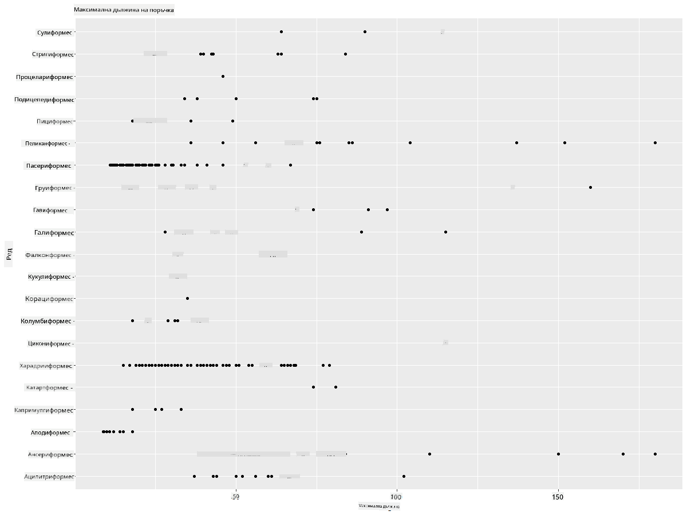
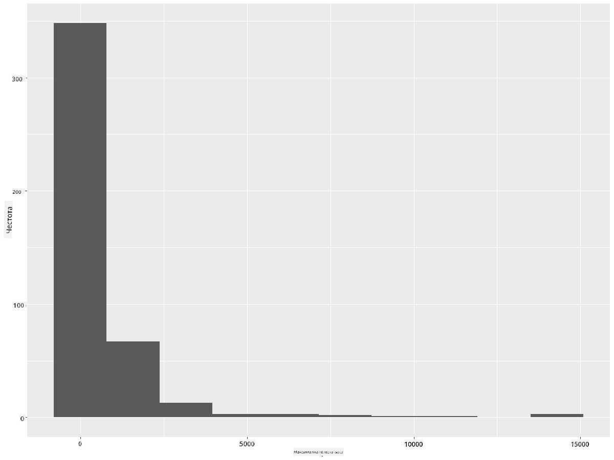
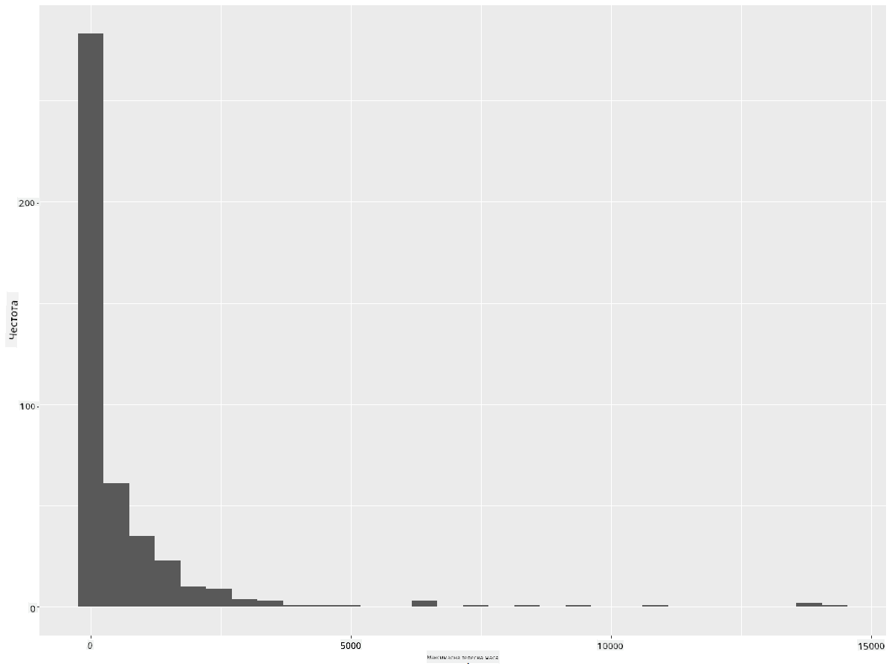
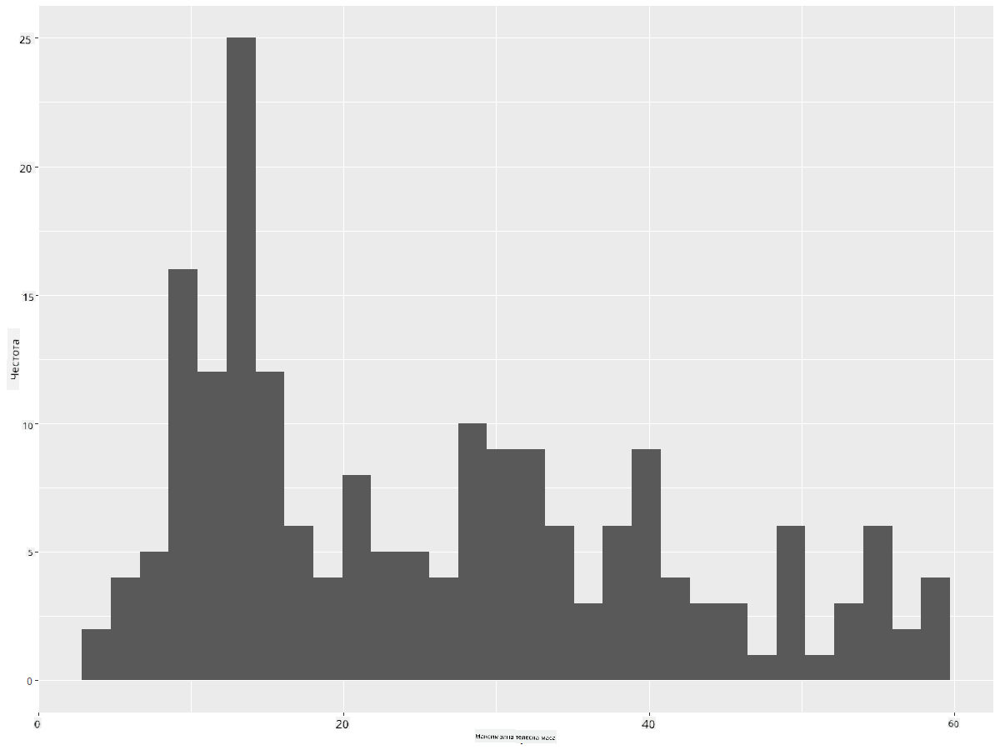
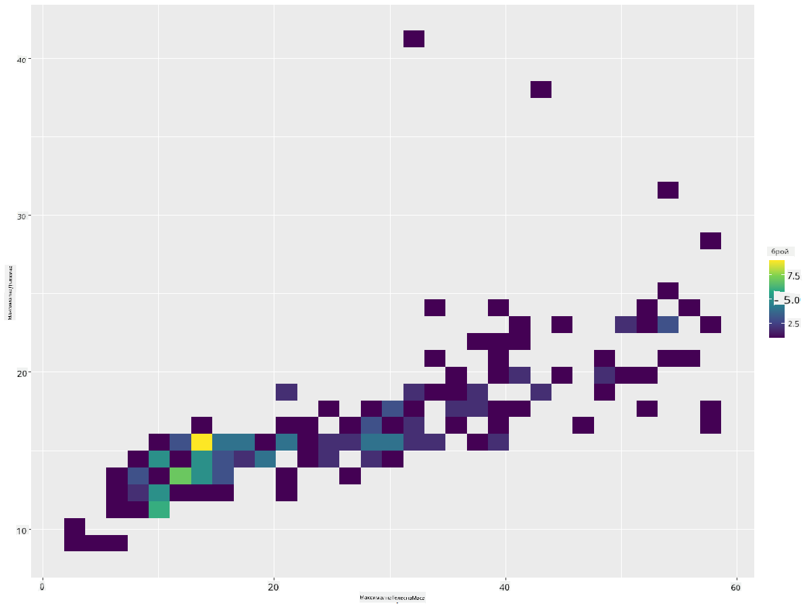
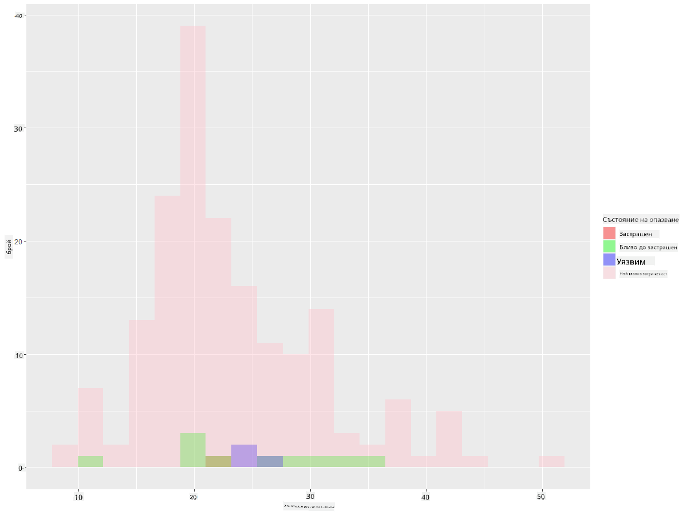
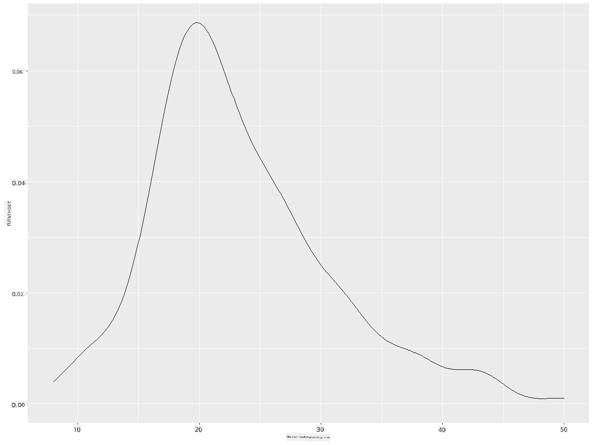
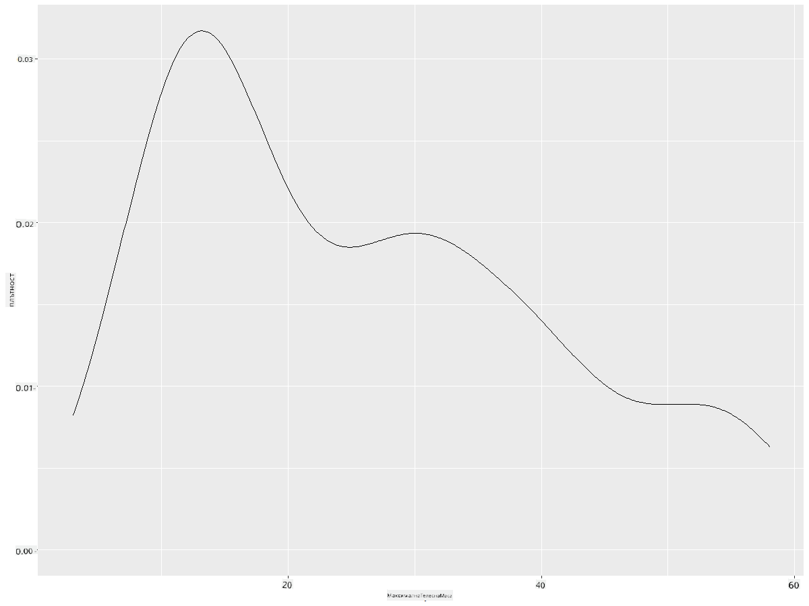
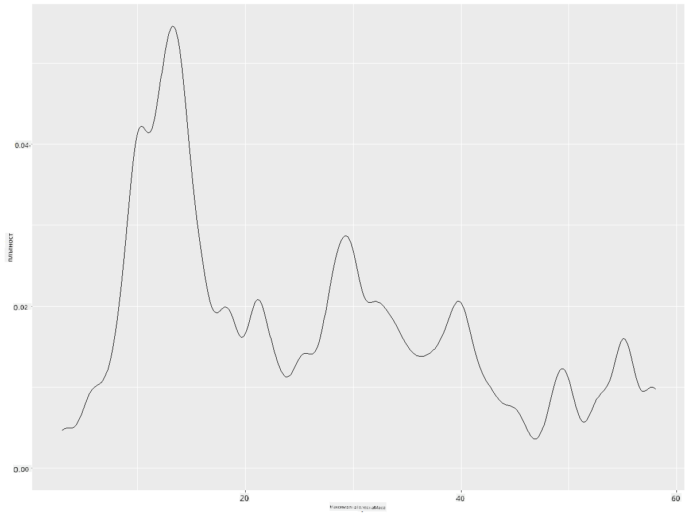
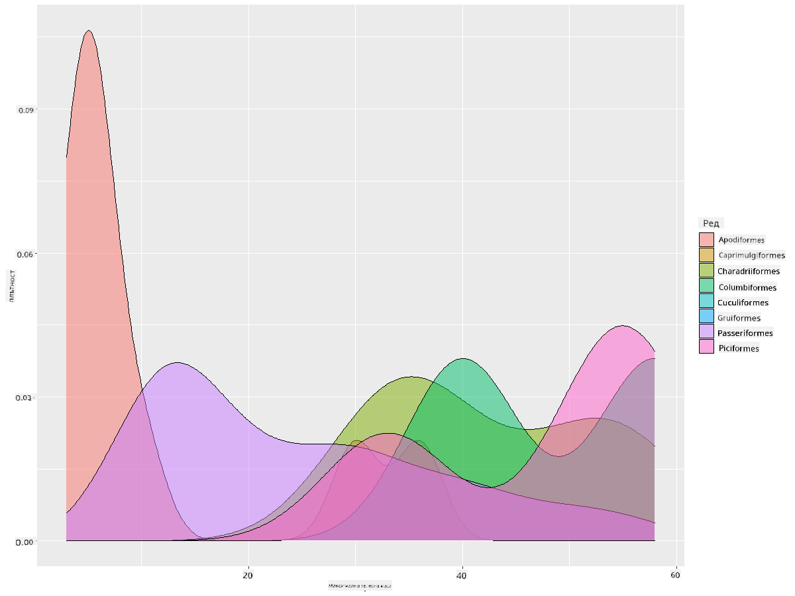

<!--
CO_OP_TRANSLATOR_METADATA:
{
  "original_hash": "ea67c0c40808fd723594de6896c37ccf",
  "translation_date": "2025-08-26T17:01:26+00:00",
  "source_file": "3-Data-Visualization/R/10-visualization-distributions/README.md",
  "language_code": "bg"
}
-->
# Визуализиране на разпределения

| ](https://github.com/microsoft/Data-Science-For-Beginners/blob/main/sketchnotes/10-Visualizing-Distributions.png)|
|:---:|
| Визуализиране на разпределения - _Скетч от [@nitya](https://twitter.com/nitya)_ |

В предишния урок научихте някои интересни факти за набора от данни за птиците в Минесота. Открихте грешни данни, като визуализирахте отклоненията, и разгледахте разликите между категориите птици според тяхната максимална дължина.

## [Тест преди лекцията](https://purple-hill-04aebfb03.1.azurestaticapps.net/quiz/18)
## Изследване на набора от данни за птиците

Друг начин за анализиране на данни е като се разгледа тяхното разпределение, или как данните са организирани по дадена ос. Например, може би искате да научите за общото разпределение в този набор от данни на максималния размах на крилата или максималната телесна маса на птиците в Минесота.

Нека открием някои факти за разпределенията на данните в този набор. В конзолата на R импортирайте `ggplot2` и базата данни. Премахнете отклоненията от базата данни, както направихте в предишната тема.

```r
library(ggplot2)

birds <- read.csv("../../data/birds.csv",fileEncoding="UTF-8-BOM")

birds_filtered <- subset(birds, MaxWingspan < 500)
head(birds_filtered)
```
|      | Име                          | Научно име             | Категория             | Разред       | Семейство | Род         | Статус на опазване | МинДължина | МаксДължина | МинТелеснаМаса | МаксТелеснаМаса | МинРазмахКрила | МаксРазмахКрила |
| ---: | :--------------------------- | :--------------------- | :-------------------- | :----------- | :------- | :---------- | :----------------- | --------: | --------: | ----------: | ----------: | ----------: | ----------: |
|    0 | Черно-коремна свиреща патица | Dendrocygna autumnalis | Патици/Гъски/Водоплаващи | Anseriformes | Anatidae | Dendrocygna | LC                 |        47 |        56 |         652 |        1020 |          76 |          94 |
|    1 | Ръждива свиреща патица       | Dendrocygna bicolor    | Патици/Гъски/Водоплаващи | Anseriformes | Anatidae | Dendrocygna | LC                 |        45 |        53 |         712 |        1050 |          85 |          93 |
|    2 | Снежна гъска                 | Anser caerulescens     | Патици/Гъски/Водоплаващи | Anseriformes | Anatidae | Anser       | LC                 |        64 |        79 |        2050 |        4050 |         135 |         165 |
|    3 | Гъска на Рос                 | Anser rossii           | Патици/Гъски/Водоплаващи | Anseriformes | Anatidae | Anser       | LC                 |      57.3 |        64 |        1066 |        1567 |         113 |         116 |
|    4 | Голямо бяло-чело гъска       | Anser albifrons        | Патици/Гъски/Водоплаващи | Anseriformes | Anatidae | Anser       | LC                 |        64 |        81 |        1930 |        3310 |         130 |         165 |

Обикновено можете бързо да разгледате начина, по който данните са разпределени, като използвате диаграма с точки, както направихме в предишния урок:

```r
ggplot(data=birds_filtered, aes(x=Order, y=MaxLength,group=1)) +
  geom_point() +
  ggtitle("Max Length per order") + coord_flip()
```


Това дава общ преглед на разпределението на дължината на тялото по разред на птиците, но не е най-добрият начин за показване на истински разпределения. Тази задача обикновено се изпълнява чрез създаване на хистограма.
## Работа с хистограми

`ggplot2` предлага много добри начини за визуализиране на разпределението на данни чрез хистограми. Този тип диаграма е подобен на диаграма с барове, където разпределението може да се види чрез покачването и спадането на баровете. За да създадете хистограма, ви трябват числови данни. За да създадете хистограма, можете да начертаете диаграма, като зададете типа като 'hist' за хистограма. Тази диаграма показва разпределението на MaxBodyMass за целия набор от числови данни. Като разделя масива от данни на по-малки групи, тя може да покаже разпределението на стойностите на данните:

```r
ggplot(data = birds_filtered, aes(x = MaxBodyMass)) + 
  geom_histogram(bins=10)+ylab('Frequency')
```


Както виждате, повечето от 400+ птици в този набор от данни попадат в диапазона под 2000 за тяхната максимална телесна маса. Получете повече информация за данните, като промените параметъра `bins` на по-голямо число, например 30:

```r
ggplot(data = birds_filtered, aes(x = MaxBodyMass)) + geom_histogram(bins=30)+ylab('Frequency')
```



Тази диаграма показва разпределението по малко по-гранулиран начин. Диаграма, която е по-малко изкривена наляво, може да бъде създадена, като се уверите, че избирате само данни в даден диапазон:

Филтрирайте данните си, за да получите само тези птици, чиято телесна маса е под 60, и покажете 30 `bins`:

```r
birds_filtered_1 <- subset(birds_filtered, MaxBodyMass > 1 & MaxBodyMass < 60)
ggplot(data = birds_filtered_1, aes(x = MaxBodyMass)) + 
  geom_histogram(bins=30)+ylab('Frequency')
```



✅ Опитайте някои други филтри и точки от данни. За да видите пълното разпределение на данните, премахнете филтъра `['MaxBodyMass']`, за да покажете етикетирани разпределения.

Хистограмата предлага някои приятни цветови и етикетиращи подобрения, които също можете да опитате:

Създайте 2D хистограма, за да сравните връзката между две разпределения. Нека сравним `MaxBodyMass` срещу `MaxLength`. `ggplot2` предлага вграден начин за показване на сближаване чрез по-ярки цветове:

```r
ggplot(data=birds_filtered_1, aes(x=MaxBodyMass, y=MaxLength) ) +
  geom_bin2d() +scale_fill_continuous(type = "viridis")
```
Изглежда, че има очаквана корелация между тези два елемента по очаквана ос, с една особено силна точка на сближаване:



Хистограмите работят добре по подразбиране за числови данни. Ами ако трябва да видите разпределения според текстови данни? 
## Изследване на набора от данни за разпределения с текстови данни 

Този набор от данни включва също добра информация за категорията на птиците и техния род, вид и семейство, както и за техния статус на опазване. Нека разгледаме тази информация за опазване. Какво е разпределението на птиците според техния статус на опазване?

> ✅ В набора от данни се използват няколко съкращения за описание на статуса на опазване. Тези съкращения идват от [Категориите на Червения списък на IUCN](https://www.iucnredlist.org/), организация, която каталогизира статуса на видовете.
> 
> - CR: Критично застрашен
> - EN: Застрашен
> - EX: Изчезнал
> - LC: Най-малка загриженост
> - NT: Близо до застрашен
> - VU: Уязвим

Това са текстови стойности, така че ще трябва да направите трансформация, за да създадете хистограма. Използвайки dataframe-а filteredBirds, покажете неговия статус на опазване заедно с минималния размах на крилата. Какво виждате? 

```r
birds_filtered_1$ConservationStatus[birds_filtered_1$ConservationStatus == 'EX'] <- 'x1' 
birds_filtered_1$ConservationStatus[birds_filtered_1$ConservationStatus == 'CR'] <- 'x2'
birds_filtered_1$ConservationStatus[birds_filtered_1$ConservationStatus == 'EN'] <- 'x3'
birds_filtered_1$ConservationStatus[birds_filtered_1$ConservationStatus == 'NT'] <- 'x4'
birds_filtered_1$ConservationStatus[birds_filtered_1$ConservationStatus == 'VU'] <- 'x5'
birds_filtered_1$ConservationStatus[birds_filtered_1$ConservationStatus == 'LC'] <- 'x6'

ggplot(data=birds_filtered_1, aes(x = MinWingspan, fill = ConservationStatus)) +
  geom_histogram(position = "identity", alpha = 0.4, bins = 20) +
  scale_fill_manual(name="Conservation Status",values=c("red","green","blue","pink"),labels=c("Endangered","Near Threathened","Vulnerable","Least Concern"))
```



Не изглежда да има добра корелация между минималния размах на крилата и статуса на опазване. Тествайте други елементи от набора от данни, използвайки този метод. Можете да опитате различни филтри. Откривате ли някаква корелация?

## Плотове на плътност

Може би сте забелязали, че хистограмите, които разгледахме досега, са "стъпаловидни" и не се движат плавно в дъга. За да покажете по-гладка диаграма на плътността, можете да опитате плот на плътност.

Нека сега работим с плотове на плътност!

```r
ggplot(data = birds_filtered_1, aes(x = MinWingspan)) + 
  geom_density()
```


Можете да видите как плотът отразява предишния за данните за минималния размах на крилата; той е просто малко по-гладък. Ако искате да преразгледате тази назъбена линия на MaxBodyMass във втората диаграма, която създадохте, можете да я изгладите много добре, като я пресъздадете, използвайки този метод:

```r
ggplot(data = birds_filtered_1, aes(x = MaxBodyMass)) + 
  geom_density()
```


Ако искате гладка, но не прекалено гладка линия, редактирайте параметъра `adjust`: 

```r
ggplot(data = birds_filtered_1, aes(x = MaxBodyMass)) + 
  geom_density(adjust = 1/5)
```


✅ Прочетете за наличните параметри за този тип плот и експериментирайте!

Този тип диаграма предлага красиво обяснителни визуализации. С няколко реда код, например, можете да покажете плътността на максималната телесна маса по разред на птиците:

```r
ggplot(data=birds_filtered_1,aes(x = MaxBodyMass, fill = Order)) +
  geom_density(alpha=0.5)
```


## 🚀 Предизвикателство

Хистограмите са по-сложен тип диаграма от основните диаграми с точки, барове или линии. Потърсете в интернет добри примери за използването на хистограми. Как се използват, какво демонстрират и в какви области или сфери на изследване обикновено се използват?

## [Тест след лекцията](https://purple-hill-04aebfb03.1.azurestaticapps.net/quiz/19)

## Преглед и самостоятелно обучение

В този урок използвахте `ggplot2` и започнахте да създавате по-сложни диаграми. Направете проучване за `geom_density_2d()` - "непрекъсната крива на плътност на вероятността в едно или повече измерения". Прочетете [документацията](https://ggplot2.tidyverse.org/reference/geom_density_2d.html), за да разберете как работи.

## Задание

[Приложете уменията си](assignment.md)

---

**Отказ от отговорност**:  
Този документ е преведен с помощта на AI услуга за превод [Co-op Translator](https://github.com/Azure/co-op-translator). Въпреки че се стремим към точност, моля, имайте предвид, че автоматизираните преводи може да съдържат грешки или неточности. Оригиналният документ на неговия роден език трябва да се счита за авторитетен източник. За критична информация се препоръчва професионален човешки превод. Ние не носим отговорност за недоразумения или погрешни интерпретации, произтичащи от използването на този превод.