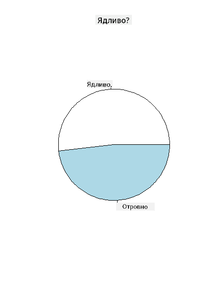
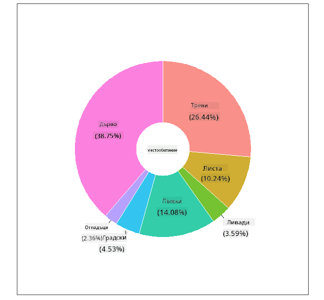
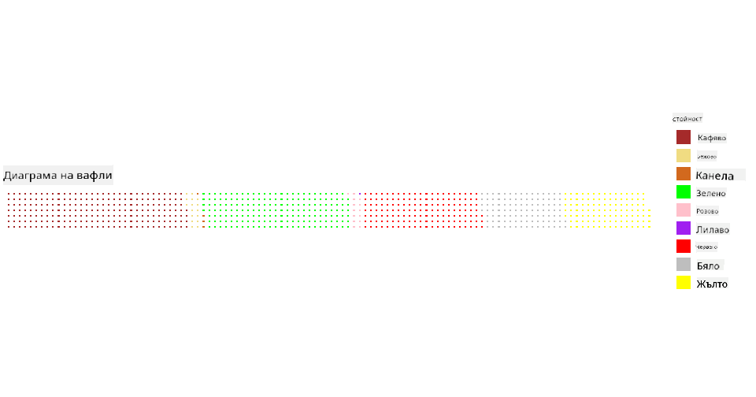

<!--
CO_OP_TRANSLATOR_METADATA:
{
  "original_hash": "47028abaaafa2bcb1079702d20569066",
  "translation_date": "2025-08-26T17:21:36+00:00",
  "source_file": "3-Data-Visualization/R/11-visualization-proportions/README.md",
  "language_code": "bg"
}
-->
# Визуализиране на пропорции

|](../../../sketchnotes/11-Visualizing-Proportions.png)|
|:---:|
|Визуализиране на пропорции - _Скица от [@nitya](https://twitter.com/nitya)_|

В този урок ще използвате различен набор от данни, свързан с природата, за да визуализирате пропорции, като например колко различни видове гъби се съдържат в даден набор от данни за гъби. Нека изследваме тези очарователни гъби, използвайки набор от данни, предоставен от Audubon, който съдържа информация за 23 вида ламелни гъби от семействата Agaricus и Lepiota. Ще експериментирате с апетитни визуализации като:

- Кръгови диаграми 🥧
- Пръстеновидни диаграми 🍩
- Вафлени диаграми 🧇

> 💡 Един много интересен проект, наречен [Charticulator](https://charticulator.com) от Microsoft Research, предлага безплатен интерфейс за визуализация на данни чрез плъзгане и пускане. В един от техните уроци също се използва този набор от данни за гъби! Така че можете да изследвате данните и да научите библиотеката едновременно: [Урок за Charticulator](https://charticulator.com/tutorials/tutorial4.html).

## [Тест преди лекцията](https://purple-hill-04aebfb03.1.azurestaticapps.net/quiz/20)

## Запознайте се с вашите гъби 🍄

Гъбите са много интересни. Нека импортираме набор от данни, за да ги изучим:

```r
mushrooms = read.csv('../../data/mushrooms.csv')
head(mushrooms)
```
Таблица се отпечатва с чудесни данни за анализ:


| class     | cap-shape | cap-surface | cap-color | bruises | odor    | gill-attachment | gill-spacing | gill-size | gill-color | stalk-shape | stalk-root | stalk-surface-above-ring | stalk-surface-below-ring | stalk-color-above-ring | stalk-color-below-ring | veil-type | veil-color | ring-number | ring-type | spore-print-color | population | habitat |
| --------- | --------- | ----------- | --------- | ------- | ------- | --------------- | ------------ | --------- | ---------- | ----------- | ---------- | ------------------------ | ------------------------ | ---------------------- | ---------------------- | --------- | ---------- | ----------- | --------- | ----------------- | ---------- | ------- |
| Poisonous | Convex    | Smooth      | Brown     | Bruises | Pungent | Free            | Close        | Narrow    | Black      | Enlarging   | Equal      | Smooth                   | Smooth                   | White                  | White                  | Partial   | White      | One         | Pendant   | Black             | Scattered  | Urban   |
| Edible    | Convex    | Smooth      | Yellow    | Bruises | Almond  | Free            | Close        | Broad     | Black      | Enlarging   | Club       | Smooth                   | Smooth                   | White                  | White                  | Partial   | White      | One         | Pendant   | Brown             | Numerous   | Grasses |
| Edible    | Bell      | Smooth      | White     | Bruises | Anise   | Free            | Close        | Broad     | Brown      | Enlarging   | Club       | Smooth                   | Smooth                   | White                  | White                  | Partial   | White      | One         | Pendant   | Brown             | Numerous   | Meadows |
| Poisonous | Convex    | Scaly       | White     | Bruises | Pungent | Free            | Close        | Narrow    | Brown      | Enlarging   | Equal      | Smooth                   | Smooth                   | White                  | White                  | Partial   | White      | One         | Pendant   | Black             | Scattered  | Urban 
| Edible | Convex       |Smooth       | Green     | No Bruises| None   |Free            | Crowded       | Broad     | Black      | Tapering   | Equal      |  Smooth | Smooth                    | White                 | White                  | Partial    | White     | One         | Evanescent | Brown             | Abundant | Grasses
|Edible  |  Convex      | Scaly   | Yellow         | Bruises  | Almond  | Free | Close  |   Broad   |   Brown  | Enlarging   |   Club                      | Smooth                  | Smooth    | White                 |  White                | Partial      | White    |  One  |  Pendant | Black   | Numerous | Grasses
      
Веднага забелязвате, че всички данни са текстови. Ще трябва да конвертирате тези данни, за да можете да ги използвате в диаграма. Повечето от данните всъщност са представени като обект:

```r
names(mushrooms)
```

Резултатът е:

```output
[1] "class"                    "cap.shape"               
 [3] "cap.surface"              "cap.color"               
 [5] "bruises"                  "odor"                    
 [7] "gill.attachment"          "gill.spacing"            
 [9] "gill.size"                "gill.color"              
[11] "stalk.shape"              "stalk.root"              
[13] "stalk.surface.above.ring" "stalk.surface.below.ring"
[15] "stalk.color.above.ring"   "stalk.color.below.ring"  
[17] "veil.type"                "veil.color"              
[19] "ring.number"              "ring.type"               
[21] "spore.print.color"        "population"              
[23] "habitat"            
```
Вземете тези данни и конвертирайте колоната 'class' в категория:

```r
library(dplyr)
grouped=mushrooms %>%
  group_by(class) %>%
  summarise(count=n())
```


Сега, ако отпечатате данните за гъбите, ще видите, че те са групирани в категории според класа ядливи/отровни:
```r
View(grouped)
```


| class | count |
| --------- | --------- |
| Edible | 4208 |
| Poisonous| 3916 |


Ако следвате реда, представен в тази таблица, за да създадете етикетите за категорията 'class', можете да изградите кръгова диаграма.

## Кръг!

```r
pie(grouped$count,grouped$class, main="Edible?")
```
Voilà, кръгова диаграма, показваща пропорциите на тези данни според двата класа гъби. Много е важно да се уверите, че редът на етикетите е правилен, особено тук, така че проверете реда, с който е изградена масивът от етикети!



## Пръстени!

Малко по-визуално интересна кръгова диаграма е пръстеновидната диаграма, която е кръгова диаграма с дупка в средата. Нека разгледаме нашите данни, използвайки този метод.

Разгледайте различните местообитания, където растат гъбите:

```r
library(dplyr)
habitat=mushrooms %>%
  group_by(habitat) %>%
  summarise(count=n())
View(habitat)
```
Резултатът е:
| habitat| count |
| --------- | --------- |
| Grasses    | 2148 |
| Leaves| 832 |
| Meadows    | 292 |
| Paths| 1144 |
| Urban    | 368 |
| Waste| 192 |
| Wood| 3148 |


Тук групирате данните си по местообитание. Има 7 изброени, така че използвайте тях като етикети за вашата пръстеновидна диаграма:

```r
library(ggplot2)
library(webr)
PieDonut(habitat, aes(habitat, count=count))
```



Този код използва две библиотеки - ggplot2 и webr. Използвайки функцията PieDonut от библиотеката webr, можем лесно да създадем пръстеновидна диаграма!

Пръстеновидни диаграми в R могат да се създават и само с библиотеката ggplot2. Можете да научите повече за това [тук](https://www.r-graph-gallery.com/128-ring-or-donut-plot.html) и да го изпробвате сами.

Сега, когато знаете как да групирате данните си и след това да ги показвате като кръгова или пръстеновидна диаграма, можете да изследвате и други видове диаграми. Опитайте вафлена диаграма, която е просто различен начин за изследване на количествата.
## Вафли!

Диаграма тип 'вафла' е различен начин за визуализиране на количества като 2D масив от квадрати. Опитайте да визуализирате различните количества цветове на шапките на гъбите в този набор от данни. За да направите това, трябва да инсталирате помощна библиотека, наречена [waffle](https://cran.r-project.org/web/packages/waffle/waffle.pdf), и да я използвате, за да генерирате вашата визуализация:

```r
install.packages("waffle", repos = "https://cinc.rud.is")
```

Изберете сегмент от вашите данни за групиране:

```r
library(dplyr)
cap_color=mushrooms %>%
  group_by(cap.color) %>%
  summarise(count=n())
View(cap_color)
```

Създайте вафлена диаграма, като създадете етикети и след това групирате данните си:

```r
library(waffle)
names(cap_color$count) = paste0(cap_color$cap.color)
waffle((cap_color$count/10), rows = 7, title = "Waffle Chart")+scale_fill_manual(values=c("brown", "#F0DC82", "#D2691E", "green", 
                                                                                     "pink", "purple", "red", "grey", 
                                                                                     "yellow","white"))
```

С помощта на вафлена диаграма можете ясно да видите пропорциите на цветовете на шапките в този набор от данни за гъби. Интересно е, че има много гъби със зелени шапки!



В този урок научихте три начина за визуализиране на пропорции. Първо, трябва да групирате данните си в категории и след това да решите кой е най-добрият начин за показване на данните - кръгова, пръстеновидна или вафлена диаграма. Всички са вкусни и предоставят на потребителя моментална снимка на набора от данни.

## 🚀 Предизвикателство

Опитайте да пресъздадете тези вкусни диаграми в [Charticulator](https://charticulator.com).
## [Тест след лекцията](https://purple-hill-04aebfb03.1.azurestaticapps.net/quiz/21)

## Преглед и самостоятелно обучение

Понякога не е очевидно кога да използвате кръгова, пръстеновидна или вафлена диаграма. Ето няколко статии, които да прочетете по тази тема:

https://www.beautiful.ai/blog/battle-of-the-charts-pie-chart-vs-donut-chart

https://medium.com/@hypsypops/pie-chart-vs-donut-chart-showdown-in-the-ring-5d24fd86a9ce

https://www.mit.edu/~mbarker/formula1/f1help/11-ch-c6.htm

https://medium.datadriveninvestor.com/data-visualization-done-the-right-way-with-tableau-waffle-chart-fdf2a19be402

Направете проучване, за да намерите повече информация за това трудно решение.
## Задача

[Опитайте го в Excel](assignment.md)

---

**Отказ от отговорност**:  
Този документ е преведен с помощта на AI услуга за превод [Co-op Translator](https://github.com/Azure/co-op-translator). Въпреки че се стремим към точност, моля, имайте предвид, че автоматизираните преводи може да съдържат грешки или неточности. Оригиналният документ на неговия роден език трябва да се счита за авторитетен източник. За критична информация се препоръчва професионален човешки превод. Ние не носим отговорност за каквито и да било недоразумения или погрешни интерпретации, произтичащи от използването на този превод.