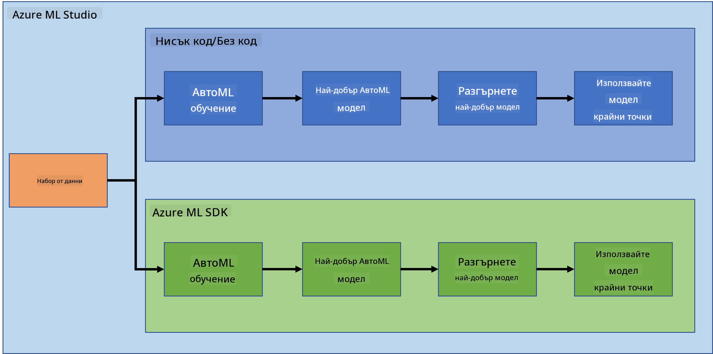
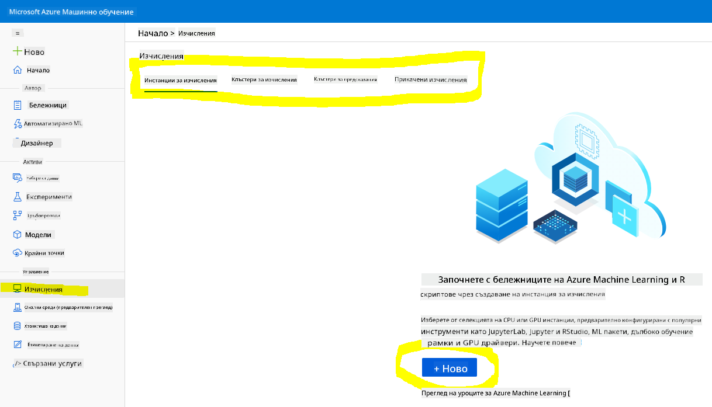
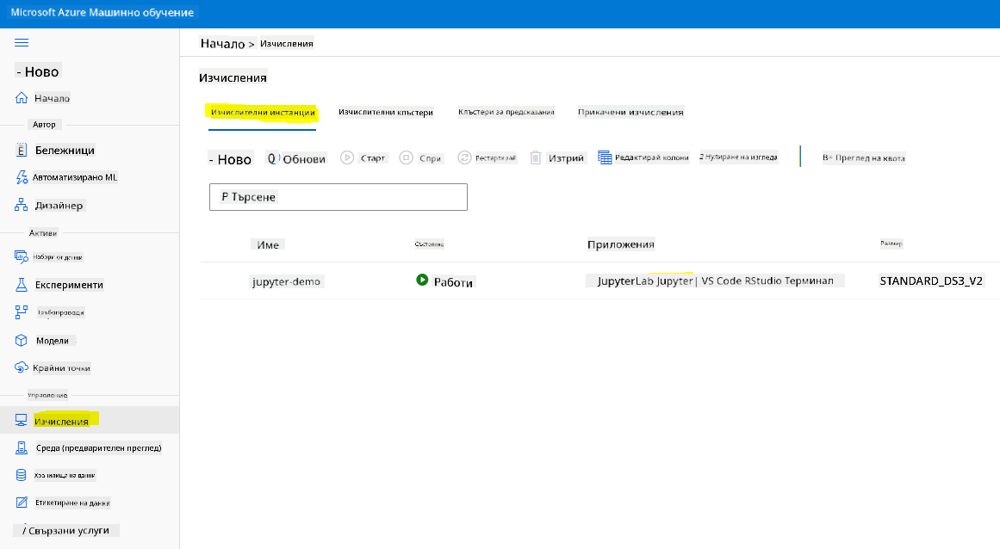
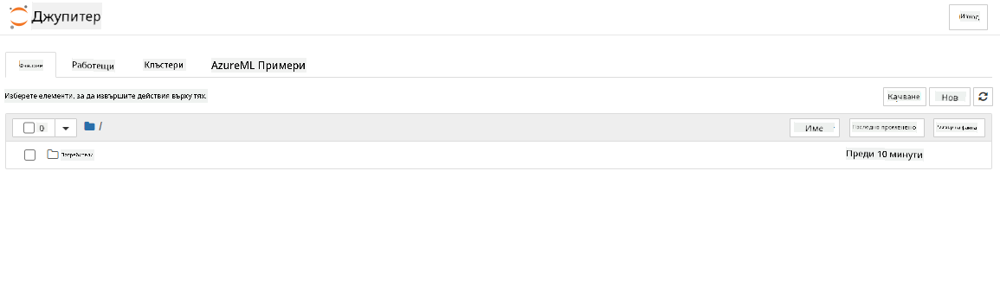

<!--
CO_OP_TRANSLATOR_METADATA:
{
  "original_hash": "73dead89dc2ddda4d6ec0232814a191e",
  "translation_date": "2025-08-26T16:16:08+00:00",
  "source_file": "5-Data-Science-In-Cloud/19-Azure/README.md",
  "language_code": "bg"
}
-->
# Наука за данни в облака: Пътят на "Azure ML SDK"

| ](../../sketchnotes/19-DataScience-Cloud.png)|
|:---:|
| Наука за данни в облака: Azure ML SDK - _Скетч от [@nitya](https://twitter.com/nitya)_ |

Съдържание:

- [Наука за данни в облака: Пътят на "Azure ML SDK"](../../../../5-Data-Science-In-Cloud/19-Azure)
  - [Тест преди лекцията](../../../../5-Data-Science-In-Cloud/19-Azure)
  - [1. Въведение](../../../../5-Data-Science-In-Cloud/19-Azure)
    - [1.1 Какво е Azure ML SDK?](../../../../5-Data-Science-In-Cloud/19-Azure)
    - [1.2 Проект за предсказване на сърдечна недостатъчност и въведение в набора от данни](../../../../5-Data-Science-In-Cloud/19-Azure)
  - [2. Обучение на модел с Azure ML SDK](../../../../5-Data-Science-In-Cloud/19-Azure)
    - [2.1 Създаване на работно пространство в Azure ML](../../../../5-Data-Science-In-Cloud/19-Azure)
    - [2.2 Създаване на изчислителен екземпляр](../../../../5-Data-Science-In-Cloud/19-Azure)
    - [2.3 Зареждане на набора от данни](../../../../5-Data-Science-In-Cloud/19-Azure)
    - [2.4 Създаване на тетрадки](../../../../5-Data-Science-In-Cloud/19-Azure)
    - [2.5 Обучение на модел](../../../../5-Data-Science-In-Cloud/19-Azure)
      - [2.5.1 Настройка на работно пространство, експеримент, изчислителен клъстер и набор от данни](../../../../5-Data-Science-In-Cloud/19-Azure)
      - [2.5.2 Конфигурация и обучение с AutoML](../../../../5-Data-Science-In-Cloud/19-Azure)
  - [3. Разгръщане на модел и използване на крайна точка с Azure ML SDK](../../../../5-Data-Science-In-Cloud/19-Azure)
    - [3.1 Запазване на най-добрия модел](../../../../5-Data-Science-In-Cloud/19-Azure)
    - [3.2 Разгръщане на модел](../../../../5-Data-Science-In-Cloud/19-Azure)
    - [3.3 Използване на крайна точка](../../../../5-Data-Science-In-Cloud/19-Azure)
  - [🚀 Предизвикателство](../../../../5-Data-Science-In-Cloud/19-Azure)
  - [Тест след лекцията](../../../../5-Data-Science-In-Cloud/19-Azure)
  - [Преглед и самостоятелно обучение](../../../../5-Data-Science-In-Cloud/19-Azure)
  - [Задача](../../../../5-Data-Science-In-Cloud/19-Azure)

## [Тест преди лекцията](https://purple-hill-04aebfb03.1.azurestaticapps.net/quiz/36)

## 1. Въведение

### 1.1 Какво е Azure ML SDK?

Специалистите по данни и разработчиците на AI използват Azure Machine Learning SDK, за да създават и изпълняват работни потоци за машинно обучение с услугата Azure Machine Learning. Можете да взаимодействате с услугата във всяка Python среда, включително Jupyter Notebooks, Visual Studio Code или вашия любим Python IDE.

Основни области на SDK включват:

- Изследване, подготовка и управление на жизнения цикъл на наборите от данни, използвани в експериментите за машинно обучение.
- Управление на облачни ресурси за мониторинг, логване и организиране на експериментите за машинно обучение.
- Обучение на модели локално или с използване на облачни ресурси, включително ускорено обучение на модели с GPU.
- Използване на автоматизирано машинно обучение, което приема конфигурационни параметри и тренировъчни данни. То автоматично преминава през алгоритми и настройки на хиперпараметри, за да намери най-добрия модел за предсказания.
- Разгръщане на уеб услуги за преобразуване на обучените модели в RESTful услуги, които могат да бъдат използвани във всяко приложение.

[Научете повече за Azure Machine Learning SDK](https://docs.microsoft.com/python/api/overview/azure/ml?WT.mc_id=academic-77958-bethanycheum&ocid=AID3041109)

В [предишния урок](../18-Low-Code/README.md) разгледахме как да обучим, разположим и използваме модел по начин с малко или без код. Използвахме набора от данни за сърдечна недостатъчност, за да създадем модел за предсказване на сърдечна недостатъчност. В този урок ще направим същото, но с използване на Azure Machine Learning SDK.



### 1.2 Проект за предсказване на сърдечна недостатъчност и въведение в набора от данни

Вижте [тук](../18-Low-Code/README.md) въведението в проекта за предсказване на сърдечна недостатъчност и набора от данни.

## 2. Обучение на модел с Azure ML SDK
### 2.1 Създаване на работно пространство в Azure ML

За удобство ще работим в jupyter notebook. Това предполага, че вече имате работно пространство и изчислителен екземпляр. Ако вече имате работно пространство, можете директно да преминете към секция 2.3 Създаване на тетрадка.

Ако не, моля, следвайте инструкциите в секция **2.1 Създаване на работно пространство в Azure ML** в [предишния урок](../18-Low-Code/README.md), за да създадете работно пространство.

### 2.2 Създаване на изчислителен екземпляр

В [работното пространство на Azure ML](https://ml.azure.com/), което създадохме по-рано, отидете в менюто Compute и ще видите различните налични изчислителни ресурси.



Нека създадем изчислителен екземпляр, за да осигурим jupyter notebook. 
1. Кликнете върху бутона + New. 
2. Дайте име на вашия изчислителен екземпляр.
3. Изберете вашите опции: CPU или GPU, размер на VM и брой ядра.
4. Кликнете върху бутона Create.

Поздравления, току-що създадохте изчислителен екземпляр! Ще използваме този изчислителен екземпляр, за да създадем тетрадка в секцията [Създаване на тетрадки](../../../../5-Data-Science-In-Cloud/19-Azure).

### 2.3 Зареждане на набора от данни
Вижте [предишния урок](../18-Low-Code/README.md) в секция **2.3 Зареждане на набора от данни**, ако все още не сте качили набора от данни.

### 2.4 Създаване на тетрадки

> **_ЗАБЕЛЕЖКА:_** За следващата стъпка можете или да създадете нова тетрадка от нулата, или да качите [тетрадката, която създадохме](notebook.ipynb) във вашето Azure ML Studio. За да я качите, просто кликнете върху менюто "Notebook" и качете тетрадката.

Тетрадките са наистина важна част от процеса на наука за данни. Те могат да се използват за провеждане на изследователски анализ на данни (EDA), извикване към изчислителен клъстер за обучение на модел, извикване към клъстер за предсказания за разгръщане на крайна точка.

За да създадете тетрадка, ни е необходим изчислителен възел, който обслужва инстанцията на jupyter notebook. Върнете се в [работното пространство на Azure ML](https://ml.azure.com/) и кликнете върху Compute instances. В списъка с изчислителни екземпляри трябва да видите [изчислителния екземпляр, който създадохме по-рано](../../../../5-Data-Science-In-Cloud/19-Azure). 

1. В секцията Applications кликнете върху опцията Jupyter. 
2. Отметнете полето "Yes, I understand" и кликнете върху бутона Continue.

3. Това трябва да отвори нов раздел в браузъра с вашата инстанция на jupyter notebook, както следва. Кликнете върху бутона "New", за да създадете тетрадка.



Сега, когато имаме тетрадка, можем да започнем обучението на модела с Azure ML SDK.

### 2.5 Обучение на модел

Първо, ако имате съмнения, вижте [документацията за Azure ML SDK](https://docs.microsoft.com/python/api/overview/azure/ml?WT.mc_id=academic-77958-bethanycheum&ocid=AID3041109). Тя съдържа цялата необходима информация за разбиране на модулите, които ще разгледаме в този урок.

#### 2.5.1 Настройка на работно пространство, експеримент, изчислителен клъстер и набор от данни

Трябва да заредите `workspace` от конфигурационния файл, използвайки следния код:

```python
from azureml.core import Workspace
ws = Workspace.from_config()
```

Това връща обект от тип `Workspace`, който представлява работното пространство. След това трябва да създадете `experiment`, използвайки следния код:

```python
from azureml.core import Experiment
experiment_name = 'aml-experiment'
experiment = Experiment(ws, experiment_name)
```
За да получите или създадете експеримент от работно пространство, трябва да заявите експеримента, използвайки името на експеримента. Името на експеримента трябва да бъде между 3-36 символа, да започва с буква или цифра и да съдържа само букви, цифри, подчертавания и тирета. Ако експериментът не бъде намерен в работното пространство, се създава нов експеримент.

Сега трябва да създадете изчислителен клъстер за обучението, използвайки следния код. Имайте предвид, че тази стъпка може да отнеме няколко минути. 

```python
from azureml.core.compute import AmlCompute

aml_name = "heart-f-cluster"
try:
    aml_compute = AmlCompute(ws, aml_name)
    print('Found existing AML compute context.')
except:
    print('Creating new AML compute context.')
    aml_config = AmlCompute.provisioning_configuration(vm_size = "Standard_D2_v2", min_nodes=1, max_nodes=3)
    aml_compute = AmlCompute.create(ws, name = aml_name, provisioning_configuration = aml_config)
    aml_compute.wait_for_completion(show_output = True)

cts = ws.compute_targets
compute_target = cts[aml_name]
```

Можете да получите набора от данни от работното пространство, използвайки името на набора от данни по следния начин:

```python
dataset = ws.datasets['heart-failure-records']
df = dataset.to_pandas_dataframe()
df.describe()
```
#### 2.5.2 Конфигурация и обучение с AutoML

За да зададете конфигурацията на AutoML, използвайте [класа AutoMLConfig](https://docs.microsoft.com/python/api/azureml-train-automl-client/azureml.train.automl.automlconfig(class)?WT.mc_id=academic-77958-bethanycheum&ocid=AID3041109).

Както е описано в документацията, има много параметри, с които можете да експериментирате. За този проект ще използваме следните параметри:

- `experiment_timeout_minutes`: Максималното време (в минути), което експериментът може да работи, преди да бъде автоматично спрян и резултатите да бъдат автоматично предоставени.
- `max_concurrent_iterations`: Максималният брой едновременни итерации на обучение, позволени за експеримента.
- `primary_metric`: Основният метрик, използван за определяне на състоянието на експеримента.
- `compute_target`: Целта за изчисление в Azure Machine Learning, на която да се изпълни експериментът за автоматизирано машинно обучение.
- `task`: Типът задача, която да се изпълни. Стойностите могат да бъдат 'classification', 'regression' или 'forecasting' в зависимост от типа проблем за автоматизирано машинно обучение.
- `training_data`: Тренировъчните данни, които ще се използват в експеримента. Те трябва да съдържат както тренировъчни характеристики, така и колона с етикети (опционално колона с тегла на пробите).
- `label_column_name`: Името на колоната с етикети.
- `path`: Пълният път до папката на проекта в Azure Machine Learning.
- `enable_early_stopping`: Дали да се активира ранно прекратяване, ако резултатът не се подобрява в краткосрочен план.
- `featurization`: Индикатор дали стъпката за извличане на характеристики трябва да се извърши автоматично или не, или дали трябва да се използва персонализирано извличане на характеристики.
- `debug_log`: Файлът за логване на информация за отстраняване на грешки.

```python
from azureml.train.automl import AutoMLConfig

project_folder = './aml-project'

automl_settings = {
    "experiment_timeout_minutes": 20,
    "max_concurrent_iterations": 3,
    "primary_metric" : 'AUC_weighted'
}

automl_config = AutoMLConfig(compute_target=compute_target,
                             task = "classification",
                             training_data=dataset,
                             label_column_name="DEATH_EVENT",
                             path = project_folder,  
                             enable_early_stopping= True,
                             featurization= 'auto',
                             debug_log = "automl_errors.log",
                             **automl_settings
                            )
```
Сега, когато конфигурацията е зададена, можете да обучите модела, използвайки следния код. Тази стъпка може да отнеме до час, в зависимост от размера на вашия клъстер.

```python
remote_run = experiment.submit(automl_config)
```
Можете да изпълните RunDetails widget, за да покажете различните експерименти.
```python
from azureml.widgets import RunDetails
RunDetails(remote_run).show()
```
## 3. Разгръщане на модел и използване на крайна точка с Azure ML SDK

### 3.1 Запазване на най-добрия модел

`remote_run` е обект от тип [AutoMLRun](https://docs.microsoft.com/python/api/azureml-train-automl-client/azureml.train.automl.run.automlrun?WT.mc_id=academic-77958-bethanycheum&ocid=AID3041109). Този обект съдържа метода `get_output()`, който връща най-доброто изпълнение и съответния обучен модел.

```python
best_run, fitted_model = remote_run.get_output()
```
Можете да видите параметрите, използвани за най-добрия модел, като просто отпечатате fitted_model и да видите свойствата на най-добрия модел, използвайки метода [get_properties()](https://docs.microsoft.com/python/api/azureml-core/azureml.core.run(class)?view=azure-ml-py#azureml_core_Run_get_properties?WT.mc_id=academic-77958-bethanycheum&ocid=AID3041109).

```python
best_run.get_properties()
```

Сега регистрирайте модела с метода [register_model](https://docs.microsoft.com/python/api/azureml-train-automl-client/azureml.train.automl.run.automlrun?view=azure-ml-py#register-model-model-name-none--description-none--tags-none--iteration-none--metric-none-?WT.mc_id=academic-77958-bethanycheum&ocid=AID3041109).
```python
model_name = best_run.properties['model_name']
script_file_name = 'inference/score.py'
best_run.download_file('outputs/scoring_file_v_1_0_0.py', 'inference/score.py')
description = "aml heart failure project sdk"
model = best_run.register_model(model_name = model_name,
                                model_path = './outputs/',
                                description = description,
                                tags = None)
```
### 3.2 Разгръщане на модел

След като най-добрият модел е запазен, можем да го разположим с класа [InferenceConfig](https://docs.microsoft.com/python/api/azureml-core/azureml.core.model.inferenceconfig?view=azure-ml-py?ocid=AID3041109). InferenceConfig представлява конфигурационните настройки за персонализирана среда, използвана за разгръщане. Класът [AciWebservice](https://docs.microsoft.com/python/api/azureml-core/azureml.core.webservice.aciwebservice?view=azure-ml-py) представлява модел за машинно обучение, разположен като крайна точка на уеб услуга в Azure Container Instances. Разположената услуга се създава от модел, скрипт и свързани файлове. Получената уеб услуга е балансирана HTTP крайна точка с REST API. Можете да изпращате данни към този API и да получавате предсказания, върнати от модела.

Моделът се разполага, използвайки метода [deploy](https://docs.microsoft.com/python/api/azureml-core/azureml.core.model(class)?view=azure-ml-py#deploy-workspace--name--models--inference-config-none--deployment-config-none--deployment-target-none--overwrite-false--show-output-false-?WT.mc_id=academic-77958-bethanycheum&ocid=AID3041109).

```python
from azureml.core.model import InferenceConfig, Model
from azureml.core.webservice import AciWebservice

inference_config = InferenceConfig(entry_script=script_file_name, environment=best_run.get_environment())

aciconfig = AciWebservice.deploy_configuration(cpu_cores = 1,
                                               memory_gb = 1,
                                               tags = {'type': "automl-heart-failure-prediction"},
                                               description = 'Sample service for AutoML Heart Failure Prediction')

aci_service_name = 'automl-hf-sdk'
aci_service = Model.deploy(ws, aci_service_name, [model], inference_config, aciconfig)
aci_service.wait_for_deployment(True)
print(aci_service.state)
```
Тази стъпка трябва да отнеме няколко минути.

### 3.3 Използване на крайна точка

Можете да използвате вашата крайна точка, като създадете примерен вход:

```python
data = {
    "data":
    [
        {
            'age': "60",
            'anaemia': "false",
            'creatinine_phosphokinase': "500",
            'diabetes': "false",
            'ejection_fraction': "38",
            'high_blood_pressure': "false",
            'platelets': "260000",
            'serum_creatinine': "1.40",
            'serum_sodium': "137",
            'sex': "false",
            'smoking': "false",
            'time': "130",
        },
    ],
}

test_sample = str.encode(json.dumps(data))
```
След това можете да изпратите този вход към вашия модел за предсказание:
```python
response = aci_service.run(input_data=test_sample)
response
```
Това трябва да изведе `'{"result": [false]}'`. Това означава, че въведените данни за пациента, които изпратихме към крайната точка, генерираха предсказание `false`, което означава, че този човек вероятно няма да получи инфаркт.

Поздравления! Току-що използвахте модела, разположен и обучен в Azure ML с Azure ML SDK!


> **_NOTE:_** След като приключите с проекта, не забравяйте да изтриете всички ресурси.

## 🚀 Предизвикателство

Има много други неща, които можете да направите чрез SDK, за съжаление, не можем да ги разгледаме всички в този урок. Но добрата новина е, че научаването как да се ориентирате в документацията на SDK може да ви помогне много. Разгледайте документацията на Azure ML SDK и намерете класа `Pipeline`, който ви позволява да създавате конвейери. Конвейерът е колекция от стъпки, които могат да бъдат изпълнени като работен процес.

**ПОДСКАЗКА:** Отидете на [документацията на SDK](https://docs.microsoft.com/python/api/overview/azure/ml/?view=azure-ml-py?WT.mc_id=academic-77958-bethanycheum&ocid=AID3041109) и въведете ключови думи в полето за търсене, като "Pipeline". Трябва да видите класа `azureml.pipeline.core.Pipeline` в резултатите от търсенето.

## [Тест след лекцията](https://purple-hill-04aebfb03.1.azurestaticapps.net/quiz/37)

## Преглед и самостоятелно обучение

В този урок научихте как да обучите, разположите и използвате модел за предсказване на риска от сърдечна недостатъчност с Azure ML SDK в облака. Разгледайте тази [документация](https://docs.microsoft.com/python/api/overview/azure/ml/?view=azure-ml-py?WT.mc_id=academic-77958-bethanycheum&ocid=AID3041109) за допълнителна информация относно Azure ML SDK. Опитайте да създадете свой собствен модел с Azure ML SDK. 

## Задача

[Проект по наука за данни с Azure ML SDK](assignment.md)

---

**Отказ от отговорност**:  
Този документ е преведен с помощта на AI услуга за превод [Co-op Translator](https://github.com/Azure/co-op-translator). Въпреки че се стремим към точност, моля, имайте предвид, че автоматизираните преводи може да съдържат грешки или неточности. Оригиналният документ на неговия роден език трябва да се счита за авторитетен източник. За критична информация се препоръчва професионален човешки превод. Ние не носим отговорност за недоразумения или погрешни интерпретации, произтичащи от използването на този превод.