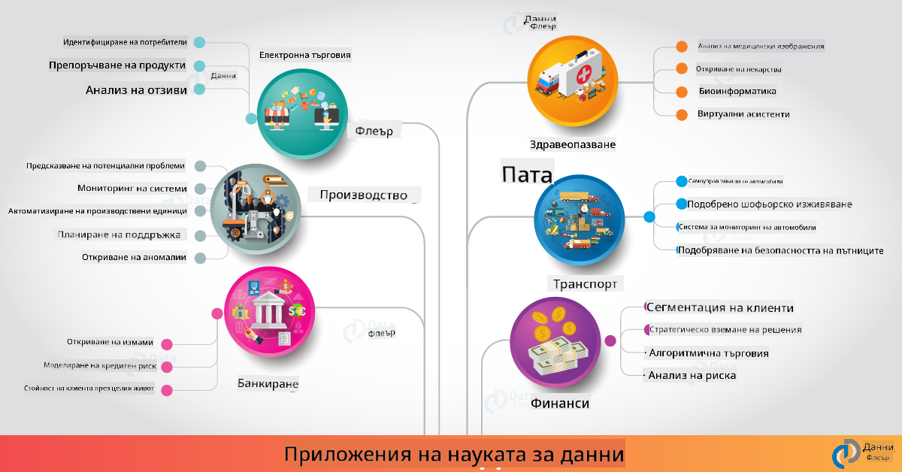

<!--
CO_OP_TRANSLATOR_METADATA:
{
  "original_hash": "0f67a4139454816631526779a456b734",
  "translation_date": "2025-09-06T18:44:27+00:00",
  "source_file": "6-Data-Science-In-Wild/20-Real-World-Examples/README.md",
  "language_code": "bg"
}
-->
# Наука за данни в реалния свят

|  ](../../sketchnotes/20-DataScience-RealWorld.png) |
| :--------------------------------------------------------------------------------------------------------------: |
|               Наука за данни в реалния свят - _Скетч от [@nitya](https://twitter.com/nitya)_               |

Почти сме в края на това учебно пътешествие!

Започнахме с дефиниции за науката за данни и етика, разгледахме различни инструменти и техники за анализ и визуализация на данни, прегледахме жизнения цикъл на науката за данни и разгледахме мащабирането и автоматизацията на работните процеси с облачни услуги. Вероятно се питате: _"Как точно да приложа всичко това в реални контексти?"_

В този урок ще разгледаме приложенията на науката за данни в различни индустрии и ще се потопим в конкретни примери в областите на изследванията, дигиталните хуманитарни науки и устойчивостта. Ще разгледаме възможности за студентски проекти и ще завършим с полезни ресурси, които да ви помогнат да продължите своето обучение!

## Предварителен тест

## [Предварителен тест](https://ff-quizzes.netlify.app/en/ds/quiz/38)

## Наука за данни + Индустрия

Благодарение на демократизацията на AI, разработчиците вече намират за по-лесно да проектират и интегрират решения, базирани на AI, и да извличат прозрения от данни в потребителски преживявания и работни процеси. Ето няколко примера за това как науката за данни се "прилага" в реални приложения в индустрията:

 * [Google Flu Trends](https://www.wired.com/2015/10/can-learn-epic-failure-google-flu-trends/) използва науката за данни, за да свърже търсения с тенденции за грип. Въпреки че подходът имаше недостатъци, той повиши осведомеността за възможностите (и предизвикателствата) на прогнозите в здравеопазването, базирани на данни.

 * [UPS Routing Predictions](https://www.technologyreview.com/2018/11/21/139000/how-ups-uses-ai-to-outsmart-bad-weather/) - обяснява как UPS използва науката за данни и машинното обучение, за да предскаже оптимални маршрути за доставка, като взема предвид метеорологични условия, трафик, крайни срокове за доставка и други.

 * [NYC Taxicab Route Visualization](http://chriswhong.github.io/nyctaxi/) - данни, събрани чрез [Закони за свобода на информацията](https://chriswhong.com/open-data/foil_nyc_taxi/), помогнаха за визуализиране на един ден от живота на такситата в Ню Йорк, като ни показаха как те се движат из града, колко печелят и колко време отнемат пътуванията им за 24-часов период.

 * [Uber Data Science Workbench](https://eng.uber.com/dsw/) - използва данни (за местоположения на качване и слизане, продължителност на пътуванията, предпочитани маршрути и др.), събрани от милиони ежедневни пътувания с Uber, за да създаде инструмент за анализ на данни, който помага при ценообразуване, безопасност, откриване на измами и навигационни решения.

 * [Анализ в спорта](https://towardsdatascience.com/scope-of-analytics-in-sports-world-37ed09c39860) - фокусира се върху _предсказателен анализ_ (анализ на отбори и играчи - като [Moneyball](https://datasciencedegree.wisconsin.edu/blog/moneyball-proves-importance-big-data-big-ideas/) - и управление на фенове) и _визуализация на данни_ (табла за отбори и фенове, игри и др.) с приложения като подбор на таланти, спортни залагания и управление на инвентар/места.

 * [Наука за данни в банковия сектор](https://data-flair.training/blogs/data-science-in-banking/) - подчертава стойността на науката за данни във финансовата индустрия с приложения, вариращи от моделиране на рискове и откриване на измами до сегментация на клиенти, прогнози в реално време и препоръчващи системи. Предсказателният анализ също така движи критични мерки като [кредитни рейтинги](https://dzone.com/articles/using-big-data-and-predictive-analytics-for-credit).

 * [Наука за данни в здравеопазването](https://data-flair.training/blogs/data-science-in-healthcare/) - подчертава приложения като медицинско изображение (напр. MRI, рентген, CT-сканиране), геномика (секвениране на ДНК), разработка на лекарства (оценка на риска, прогноза за успех), предсказателен анализ (грижа за пациенти и логистика на доставки), проследяване и предотвратяване на заболявания и др.

 Кредит за изображението: [Data Flair: 6 Amazing Data Science Applications ](https://data-flair.training/blogs/data-science-applications/)

Фигурата показва други области и примери за прилагане на техники за наука за данни. Искате ли да разгледате други приложения? Вижте секцията [Преглед и самостоятелно обучение](../../../../6-Data-Science-In-Wild/20-Real-World-Examples) по-долу.

## Наука за данни + Изследвания

|  ](../../sketchnotes/20-DataScience-Research.png) |
| :---------------------------------------------------------------------------------------------------------------: |
|              Наука за данни и изследвания - _Скетч от [@nitya](https://twitter.com/nitya)_              |

Докато приложенията в реалния свят често се фокусират върху индустриални случаи в мащаб, _изследователските_ приложения и проекти могат да бъдат полезни от две перспективи:

* _възможности за иновации_ - изследване на бързото прототипиране на напреднали концепции и тестване на потребителски преживявания за приложения от следващо поколение.
* _предизвикателства при внедряване_ - изследване на потенциални вреди или непредвидени последици от технологиите за наука за данни в реални контексти.

За студентите тези изследователски проекти могат да предоставят както възможности за учене, така и за сътрудничество, които да подобрят разбирането на темата и да разширят осведомеността и ангажираността с подходящи хора или екипи, работещи в области от интерес. Как изглеждат изследователските проекти и как могат да имат въздействие?

Нека разгледаме един пример - [MIT Gender Shades Study](http://gendershades.org/overview.html) от Джой Буоламвини (MIT Media Labs) с [подписана изследователска статия](http://proceedings.mlr.press/v81/buolamwini18a/buolamwini18a.pdf), съавторство с Тимнит Гебру (тогава в Microsoft Research), която се фокусира върху:

 * **Какво:** Целта на изследователския проект беше _оценка на пристрастията в автоматизираните алгоритми за анализ на лица и набори от данни_ въз основа на пол и тип кожа.
 * **Защо:** Анализът на лица се използва в области като правоприлагане, сигурност на летища, системи за наемане и други - контексти, в които неточни класификации (напр. поради пристрастия) могат да причинят потенциални икономически и социални вреди на засегнатите лица или групи. Разбирането (и премахването или смекчаването) на пристрастията е ключово за справедливостта при използване.
 * **Как:** Изследователите разпознаха, че съществуващите бенчмаркове използват предимно субекти със светла кожа и създадоха нов набор от данни (1000+ изображения), който беше _по-балансиран_ по пол и тип кожа. Наборът от данни беше използван за оценка на точността на три продукта за класификация на пол (от Microsoft, IBM и Face++).

Резултатите показаха, че въпреки че общата точност на класификацията беше добра, имаше забележима разлика в процентите на грешки между различните подгрупи - с **грешно определяне на пола**, което беше по-високо за жени или лица с по-тъмна кожа, което е показателно за пристрастия.

**Основни резултати:** Повишена осведоменост, че науката за данни се нуждае от повече _представителни набори от данни_ (балансирани подгрупи) и повече _инклузивни екипи_ (разнообразни среди), за да разпознават и премахват или смекчават такива пристрастия по-рано в AI решенията. Изследователски усилия като това също са инструментални за много организации при дефинирането на принципи и практики за _отговорен AI_, за да се подобри справедливостта в техните AI продукти и процеси.

**Искате ли да научите за съответните изследователски усилия в Microsoft?**

* Разгледайте [Microsoft Research Projects](https://www.microsoft.com/research/research-area/artificial-intelligence/?facet%5Btax%5D%5Bmsr-research-area%5D%5B%5D=13556&facet%5Btax%5D%5Bmsr-content-type%5D%5B%5D=msr-project) в областта на изкуствения интелект.
* Изследвайте студентски проекти от [Microsoft Research Data Science Summer School](https://www.microsoft.com/en-us/research/academic-program/data-science-summer-school/).
* Разгледайте проекта [Fairlearn](https://fairlearn.org/) и инициативите за [Отговорен AI](https://www.microsoft.com/en-us/ai/responsible-ai?activetab=pivot1%3aprimaryr6).

## Наука за данни + Хуманитарни науки

|  ](../../sketchnotes/20-DataScience-Humanities.png) |
| :---------------------------------------------------------------------------------------------------------------: |
|              Наука за данни и дигитални хуманитарни науки - _Скетч от [@nitya](https://twitter.com/nitya)_              |

Дигиталните хуманитарни науки [са дефинирани](https://digitalhumanities.stanford.edu/about-dh-stanford) като "сбор от практики и подходи, които комбинират компютърни методи с хуманитарни изследвания". [Проекти на Станфорд](https://digitalhumanities.stanford.edu/projects) като _"рестартиране на историята"_ и _"поетично мислене"_ илюстрират връзката между [Дигитални хуманитарни науки и Наука за данни](https://digitalhumanities.stanford.edu/digital-humanities-and-data-science) - подчертавайки техники като анализ на мрежи, визуализация на информация, пространствен и текстов анализ, които могат да ни помогнат да преосмислим исторически и литературни набори от данни, за да извлечем нови прозрения и перспективи.

*Искате ли да изследвате и разширите проект в тази област?*

Разгледайте ["Емили Дикинсън и метърът на настроението"](https://gist.github.com/jlooper/ce4d102efd057137bc000db796bfd671) - страхотен пример от [Джен Лупър](https://twitter.com/jenlooper), който пита как можем да използваме науката за данни, за да преосмислим познатата поезия и да преоценим нейното значение и приноса на автора в нови контексти. Например, _можем ли да предскажем сезона, в който е написано стихотворение, като анализираме неговия тон или настроение_ - и какво ни казва това за състоянието на ума на автора през съответния период?

За да отговорим на този въпрос, следваме стъпките на жизнения цикъл на науката за данни:
 * [`Събиране на данни`](https://gist.github.com/jlooper/ce4d102efd057137bc000db796bfd671#acquiring-the-dataset) - за събиране на подходящ набор от данни за анализ. Опциите включват използване на API (напр. [Poetry DB API](https://poetrydb.org/index.html)) или извличане на уеб страници (напр. [Project Gutenberg](https://www.gutenberg.org/files/12242/12242-h/12242-h.htm)) с инструменти като [Scrapy](https://scrapy.org/).
 * [`Почистване на данни`](https://gist.github.com/jlooper/ce4d102efd057137bc000db796bfd671#clean-the-data) - обяснява как текстът може да бъде форматиран, пречистен и опростен с основни инструменти като Visual Studio Code и Microsoft Excel.
 * [`Анализ на данни`](https://gist.github.com/jlooper/ce4d102efd057137bc000db796bfd671#working-with-the-data-in-a-notebook) - обяснява как можем да импортираме набора от данни в "Тетрадки" за анализ, използвайки Python пакети (като pandas, numpy и matplotlib), за да организираме и визуализираме данните.
 * [`Анализ на настроението`](https://gist.github.com/jlooper/ce4d102efd057137bc000db796bfd671#sentiment-analysis-using-cognitive-services) - обяснява как можем да интегрираме облачни услуги като Text Analytics, използвайки инструменти с нисък код като [Power Automate](https://flow.microsoft.com/en-us/) за автоматизирани работни процеси за обработка на данни.

С помощта на този работен процес можем да изследваме сезонните влияния върху настроението на стихотворенията и да ни помогнем да изградим свои собствени перспективи за автора. Опитайте сами - след това разширете тетрадката, за да зададете други въпроси или да визуализирате данните по нови начини!

> Можете да използвате някои от инструментите в [Digital Humanities toolkit](https://github.com/Digital-Humanities-Toolkit), за да преследвате тези направления на изследване.

## Наука за данни + Устойчивост

|  ](../../sketchnotes/20-DataScience-Sustainability.png) |
| :---------------------------------------------------------------------------------------------------------------: |
|              Наука за данни и устойчивост - _Скетч от [@nitya](https://twitter.com/nitya)_              |

[Програмата за устойчиво развитие до 2030 г.](https://sdgs.un.org/2030agenda) - приета от всички членове на ООН през 2015 г. - идентифицира 17 цели, включително такива, които се фокусират върху **защита на планетата** от деградация и въздействието на климатичните промени. Инициативата [Microsoft Sustainability](https://www.microsoft.com/en-us/sustainability) подкрепя тези цели, като изследва начини, по които технологичните решения могат да подкрепят и изградят по-устойчиво бъдеще с [фокус върху 4 цели](https://dev.to/azure/a-visual-guide-to-sustainable-software-engineering-53hh) - да бъдат въглеродно отрицателни, водно положителни, с нулеви отпадъци и биоразнообразни до 2030 г.

Справянето с тези предизвикателства в мащабен и своевременен начин изисква мислене в облачен мащаб - и големи обеми данни. Инициативата [Planetary Computer](https://planetarycomputer.microsoft.com/) предоставя 4 компонента, които да помогнат на учените и разработчиците в това усилие:

 * [Каталог на данни](https://planetarycomputer.microsoft.com/catalog) - с петабайти данни за земните системи (безплатни и хоствани в Azure).
 * [Planetary API](https://planetarycomputer.microsoft.com/docs/reference/stac/) - за да помогне на потребителите да търсят подходящи данни в пространството и времето.
 * [Hub](https://planetarycomputer.microsoft.com/docs
**Проектът Planetary Computer в момента е в предварителен преглед (към септември 2021)** - ето как можете да започнете да допринасяте за устойчиви решения чрез използване на науката за данни.

* [Заявете достъп](https://planetarycomputer.microsoft.com/account/request), за да започнете изследване и да се свържете с други хора.
* [Разгледайте документацията](https://planetarycomputer.microsoft.com/docs/overview/about), за да разберете поддържаните набори от данни и API.
* Разгледайте приложения като [Мониторинг на екосистеми](https://analytics-lab.org/ecosystemmonitoring/) за вдъхновение относно идеи за приложения.

Помислете как можете да използвате визуализация на данни, за да разкриете или подчертаете важни прозрения в области като климатични промени и обезлесяване. Или помислете как тези прозрения могат да бъдат използвани за създаване на нови потребителски преживявания, които мотивират промени в поведението за по-устойчив начин на живот.

## Наука за данни + Студенти

Говорихме за приложения в реалния свят в индустрията и научните изследвания и разгледахме примери за приложения на науката за данни в дигиталните хуманитарни науки и устойчивостта. Как можете да развиете своите умения и да споделите своя опит като начинаещи в науката за данни?

Ето някои примери за студентски проекти в областта на науката за данни, които да ви вдъхновят.

 * [Лятно училище по наука за данни на MSR](https://www.microsoft.com/en-us/research/academic-program/data-science-summer-school/#!projects) с GitHub [проекти](https://github.com/msr-ds3), които изследват теми като:
    - [Расови предразсъдъци при използването на сила от полицията](https://www.microsoft.com/en-us/research/video/data-science-summer-school-2019-replicating-an-empirical-analysis-of-racial-differences-in-police-use-of-force/) | [Github](https://github.com/msr-ds3/stop-question-frisk)
    - [Надеждност на метрото в Ню Йорк](https://www.microsoft.com/en-us/research/video/data-science-summer-school-2018-exploring-the-reliability-of-the-nyc-subway-system/) | [Github](https://github.com/msr-ds3/nyctransit)
 * [Дигитализация на материалната култура: Изследване на социално-икономическите разпределения в Сиркап](https://claremont.maps.arcgis.com/apps/Cascade/index.html?appid=bdf2aef0f45a4674ba41cd373fa23afc) - от [Орнела Алтунян](https://twitter.com/ornelladotcom) и екипът й в Клермонт, използвайки [ArcGIS StoryMaps](https://storymaps.arcgis.com/).

## 🚀 Предизвикателство

Търсете статии, които препоръчват проекти в областта на науката за данни, подходящи за начинаещи - като [тези 50 теми](https://www.upgrad.com/blog/data-science-project-ideas-topics-beginners/) или [тези 21 идеи за проекти](https://www.intellspot.com/data-science-project-ideas) или [тези 16 проекта с изходен код](https://data-flair.training/blogs/data-science-project-ideas/), които можете да анализирате и адаптирате. И не забравяйте да пишете блогове за вашите учебни пътувания и да споделяте своите прозрения с всички нас.

## Тест след лекцията

## [Тест след лекцията](https://ff-quizzes.netlify.app/en/ds/quiz/39)

## Преглед и самостоятелно обучение

Искате ли да разгледате още примери за приложения? Ето няколко подходящи статии:
 * [17 приложения и примери за наука за данни](https://builtin.com/data-science/data-science-applications-examples) - юли 2021
 * [11 впечатляващи приложения на науката за данни в реалния свят](https://myblindbird.com/data-science-applications-real-world/) - май 2021
 * [Наука за данни в реалния свят](https://towardsdatascience.com/data-science-in-the-real-world/home) - колекция от статии
 * [12 приложения на науката за данни в реалния свят с примери](https://www.scaler.com/blog/data-science-applications/) - май 2024
 * Наука за данни в: [Образование](https://data-flair.training/blogs/data-science-in-education/), [Селско стопанство](https://data-flair.training/blogs/data-science-in-agriculture/), [Финанси](https://data-flair.training/blogs/data-science-in-finance/), [Филми](https://data-flair.training/blogs/data-science-at-movies/), [Здравеопазване](https://onlinedegrees.sandiego.edu/data-science-health-care/) и други.

## Задание

[Разгледайте набор от данни на Planetary Computer](assignment.md)

---

**Отказ от отговорност**:  
Този документ е преведен с помощта на AI услуга за превод [Co-op Translator](https://github.com/Azure/co-op-translator). Въпреки че се стремим към точност, моля, имайте предвид, че автоматичните преводи може да съдържат грешки или неточности. Оригиналният документ на неговия изходен език трябва да се счита за авторитетен източник. За критична информация се препоръчва професионален превод от човек. Ние не носим отговорност за каквито и да е недоразумения или погрешни интерпретации, произтичащи от използването на този превод.