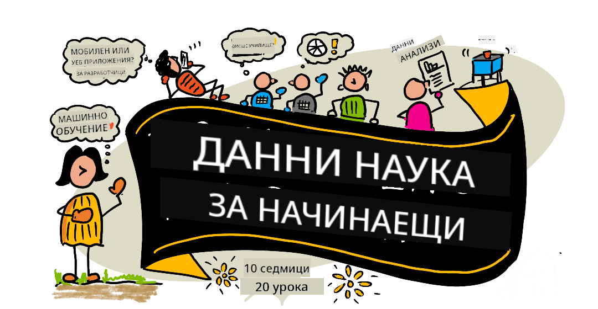

<!--
CO_OP_TRANSLATOR_METADATA:
{
  "original_hash": "dd9a1deb4da680b2cf11ba2e9f5a0a6e",
  "translation_date": "2025-09-29T22:09:31+00:00",
  "source_file": "README.md",
  "language_code": "bg"
}
-->
# Наука за данни за начинаещи - Учебна програма

Екипът на Azure Cloud Advocates в Microsoft с удоволствие предлага 10-седмична учебна програма с 20 урока, посветена на науката за данни. Всеки урок включва тестове преди и след урока, писмени инструкции за изпълнение на задачите, решения и задания. Нашият подход, базиран на проекти, ви позволява да учите, докато създавате, което е доказан начин за усвояване на нови умения.

**Сърдечни благодарности на нашите автори:** [Jasmine Greenaway](https://www.twitter.com/paladique), [Dmitry Soshnikov](http://soshnikov.com), [Nitya Narasimhan](https://twitter.com/nitya), [Jalen McGee](https://twitter.com/JalenMcG), [Jen Looper](https://twitter.com/jenlooper), [Maud Levy](https://twitter.com/maudstweets), [Tiffany Souterre](https://twitter.com/TiffanySouterre), [Christopher Harrison](https://www.twitter.com/geektrainer).

**🙏 Специални благодарности 🙏 на нашите [Microsoft Student Ambassador](https://studentambassadors.microsoft.com/) автори, рецензенти и сътрудници на съдържание,** включително Aaryan Arora, [Aditya Garg](https://github.com/AdityaGarg00), [Alondra Sanchez](https://www.linkedin.com/in/alondra-sanchez-molina/), [Ankita Singh](https://www.linkedin.com/in/ankitasingh007), [Anupam Mishra](https://www.linkedin.com/in/anupam--mishra/), [Arpita Das](https://www.linkedin.com/in/arpitadas01/), ChhailBihari Dubey, [Dibri Nsofor](https://www.linkedin.com/in/dibrinsofor), [Dishita Bhasin](https://www.linkedin.com/in/dishita-bhasin-7065281bb), [Majd Safi](https://www.linkedin.com/in/majd-s/), [Max Blum](https://www.linkedin.com/in/max-blum-6036a1186/), [Miguel Correa](https://www.linkedin.com/in/miguelmque/), [Mohamma Iftekher (Iftu) Ebne Jalal](https://twitter.com/iftu119), [Nawrin Tabassum](https://www.linkedin.com/in/nawrin-tabassum), [Raymond Wangsa Putra](https://www.linkedin.com/in/raymond-wp/), [Rohit Yadav](https://www.linkedin.com/in/rty2423), Samridhi Sharma, [Sanya Sinha](https://www.linkedin.com/mwlite/in/sanya-sinha-13aab1200),
[Sheena Narula](https://www.linkedin.com/in/sheena-narua-n/), [Tauqeer Ahmad](https://www.linkedin.com/in/tauqeerahmad5201/), Yogendrasingh Pawar , [Vidushi Gupta](https://www.linkedin.com/in/vidushi-gupta07/), [Jasleen Sondhi](https://www.linkedin.com/in/jasleen-sondhi/)

||
|:---:|
| Наука за данни за начинаещи - _Скица от [@nitya](https://twitter.com/nitya)_ |

### 🌐 Поддръжка на много езици

#### Поддържано чрез GitHub Action (Автоматично и винаги актуално)

[Френски](../fr/README.md) | [Испански](../es/README.md) | [Немски](../de/README.md) | [Руски](../ru/README.md) | [Арабски](../ar/README.md) | [Персийски (Фарси)](../fa/README.md) | [Урду](../ur/README.md) | [Китайски (опростен)](../zh/README.md) | [Китайски (традиционен, Макао)](../mo/README.md) | [Китайски (традиционен, Хонконг)](../hk/README.md) | [Китайски (традиционен, Тайван)](../tw/README.md) | [Японски](../ja/README.md) | [Корейски](../ko/README.md) | [Хинди](../hi/README.md) | [Бенгалски](../bn/README.md) | [Марати](../mr/README.md) | [Непалски](../ne/README.md) | [Пенджабски (Гурмуки)](../pa/README.md) | [Португалски (Португалия)](../pt/README.md) | [Португалски (Бразилия)](../br/README.md) | [Италиански](../it/README.md) | [Полски](../pl/README.md) | [Турски](../tr/README.md) | [Гръцки](../el/README.md) | [Тайландски](../th/README.md) | [Шведски](../sv/README.md) | [Датски](../da/README.md) | [Норвежки](../no/README.md) | [Фински](../fi/README.md) | [Холандски](../nl/README.md) | [Иврит](../he/README.md) | [Виетнамски](../vi/README.md) | [Индонезийски](../id/README.md) | [Малайски](../ms/README.md) | [Тагалог (Филипински)](../tl/README.md) | [Суахили](../sw/README.md) | [Унгарски](../hu/README.md) | [Чешки](../cs/README.md) | [Словашки](../sk/README.md) | [Румънски](../ro/README.md) | [Български](./README.md) | [Сръбски (кирилица)](../sr/README.md) | [Хърватски](../hr/README.md) | [Словенски](../sl/README.md) | [Украински](../uk/README.md) | [Бирмански (Мианмар)](../my/README.md)

**Ако желаете да добавите допълнителни преводи, списъкът с поддържани езици е [тук](https://github.com/Azure/co-op-translator/blob/main/getting_started/supported-languages.md)**

#### Присъединете се към нашата общност 

Имаме текуща серия за обучение с AI в Discord. Научете повече и се присъединете към нас в [Learn with AI Series](https://aka.ms/learnwithai/discord) от 18 до 30 септември 2025 г. Ще получите съвети и трикове за използване на GitHub Copilot за наука за данни.

# Студент ли сте?

Започнете с тези ресурси:

- [Студентска страница](https://docs.microsoft.com/en-gb/learn/student-hub?WT.mc_id=academic-77958-bethanycheum) На тази страница ще намерите ресурси за начинаещи, студентски пакети и дори начини да получите безплатен ваучер за сертификат. Това е страница, която си струва да запазите и да проверявате редовно, тъй като съдържанието се обновява поне веднъж месечно.
- [Microsoft Learn Student Ambassadors](https://studentambassadors.microsoft.com?WT.mc_id=academic-77958-bethanycheum) Присъединете се към глобална общност от студентски посланици, това може да бъде вашият път към Microsoft.

# Започнете

> **Учители**: включили сме [някои предложения](for-teachers.md) за това как да използвате тази учебна програма. Ще се радваме на вашата обратна връзка [в нашия форум за дискусии](https://github.com/microsoft/Data-Science-For-Beginners/discussions)!

> **[Студенти](https://aka.ms/student-page)**: за да използвате тази учебна програма самостоятелно, клонирайте целия репозиторий и изпълнете упражненията самостоятелно, започвайки с тест преди лекцията. След това прочетете лекцията и завършете останалите дейности. Опитайте се да създадете проектите, като разбирате уроците, вместо да копирате кода на решенията; въпреки това, този код е наличен в папките /solutions във всеки урок, базиран на проект. Друга идея е да сформирате учебна група с приятели и да преминете през съдържанието заедно. За допълнително обучение препоръчваме [Microsoft Learn](https://docs.microsoft.com/en-us/users/jenlooper-2911/collections/qprpajyoy3x0g7?WT.mc_id=academic-77958-bethanycheum).

## Запознайте се с екипа

**Gif от** [Mohit Jaisal](https://www.linkedin.com/in/mohitjaisal)

> 🎥 Кликнете върху изображението по-горе за видео за проекта и хората, които го създадоха!

## Педагогика

Избрахме два педагогически принципа при създаването на тази учебна програма: да бъде базирана на проекти и да включва чести тестове. До края на тази серия студентите ще са научили основни принципи на науката за данни, включително етични концепции, подготовка на данни, различни начини за работа с данни, визуализация на данни, анализ на данни, реални приложения на науката за данни и други.

Освен това, тест с нисък риск преди урока насочва вниманието на студента към изучаването на дадена тема, докато втори тест след урока осигурява допълнително задържане на знанията. Тази учебна програма е проектирана да бъде гъвкава и забавна и може да се използва изцяло или частично. Проектите започват малки и стават все по-сложни до края на 10-седмичния цикъл.

> Намерете нашия [Кодекс за поведение](CODE_OF_CONDUCT.md), [Принос](CONTRIBUTING.md), [Насоки за превод](TRANSLATIONS.md). Очакваме вашата конструктивна обратна връзка!

## Всеки урок включва:

- По избор скица
- По избор допълнително видео
- Тест за загряване преди урока
- Писмен урок
- За уроци, базирани на проекти, ръководства стъпка по стъпка за изграждане на проекта
- Проверка на знанията
- Предизвикателство
- Допълнително четене
- Задание
- [Тест след урока](https://ff-quizzes.netlify.app/en/)

> **Бележка за тестовете**: Всички тестове се намират в папката Quiz-App, общо 40 теста с по три въпроса всеки. Те са свързани от уроците, но приложението за тестове може да се изпълнява локално или да се разположи в Azure; следвайте инструкциите в папката `quiz-app`. Те постепенно се локализират.

## Уроци
||
|:---:|
| Наука за данни за начинаещи: Пътна карта - _Скетч от [@nitya](https://twitter.com/nitya)_ |

| Номер на урока | Тема | Групиране на уроци | Цели на обучението | Свързан урок | Автор |
| :-----------: | :----------------------------------------: | :--------------------------------------------------: | :-----------------------------------------------------------------------------------------------------------------------------------------------------------------------: | :---------------------------------------------------------------------: | :----: |
| 01 | Определяне на науката за данни | [Въведение](1-Introduction/README.md) | Научете основните концепции зад науката за данни и как тя е свързана с изкуствения интелект, машинното обучение и големите данни. | [урок](1-Introduction/01-defining-data-science/README.md) [видео](https://youtu.be/beZ7Mb_oz9I) | [Dmitry](http://soshnikov.com) |
| 02 | Етика в науката за данни | [Въведение](1-Introduction/README.md) | Концепции за етика на данните, предизвикателства и рамки. | [урок](1-Introduction/02-ethics/README.md) | [Nitya](https://twitter.com/nitya) |
| 03 | Определяне на данни | [Въведение](1-Introduction/README.md) | Как се класифицират данните и техните често срещани източници. | [урок](1-Introduction/03-defining-data/README.md) | [Jasmine](https://www.twitter.com/paladique) |
| 04 | Въведение в статистиката и вероятностите | [Въведение](1-Introduction/README.md) | Математическите техники на вероятностите и статистиката за разбиране на данните. | [урок](1-Introduction/04-stats-and-probability/README.md) [видео](https://youtu.be/Z5Zy85g4Yjw) | [Dmitry](http://soshnikov.com) |
| 05 | Работа с релационни данни | [Работа с данни](2-Working-With-Data/README.md) | Въведение в релационните данни и основите на изследването и анализа на релационни данни с езика за структурирани заявки, известен като SQL (произнася се „си-квел“). | [урок](2-Working-With-Data/05-relational-databases/README.md) | [Christopher](https://www.twitter.com/geektrainer) | | |
| 06 | Работа с NoSQL данни | [Работа с данни](2-Working-With-Data/README.md) | Въведение в нерелационните данни, техните различни типове и основите на изследването и анализа на документни бази данни. | [урок](2-Working-With-Data/06-non-relational/README.md) | [Jasmine](https://twitter.com/paladique)|
| 07 | Работа с Python | [Работа с данни](2-Working-With-Data/README.md) | Основи на използването на Python за изследване на данни с библиотеки като Pandas. Препоръчва се основно разбиране на програмирането с Python. | [урок](2-Working-With-Data/07-python/README.md) [видео](https://youtu.be/dZjWOGbsN4Y) | [Dmitry](http://soshnikov.com) |
| 08 | Подготовка на данни | [Работа с данни](2-Working-With-Data/README.md) | Теми за техники за почистване и трансформиране на данни за справяне с предизвикателства като липсващи, неточни или непълни данни. | [урок](2-Working-With-Data/08-data-preparation/README.md) | [Jasmine](https://www.twitter.com/paladique) |
| 09 | Визуализиране на количества | [Визуализация на данни](3-Data-Visualization/README.md) | Научете как да използвате Matplotlib за визуализиране на данни за птици 🦆 | [урок](3-Data-Visualization/09-visualization-quantities/README.md) | [Jen](https://twitter.com/jenlooper) |
| 10 | Визуализиране на разпределения на данни | [Визуализация на данни](3-Data-Visualization/README.md) | Визуализиране на наблюдения и тенденции в рамките на интервал. | [урок](3-Data-Visualization/10-visualization-distributions/README.md) | [Jen](https://twitter.com/jenlooper) |
| 11 | Визуализиране на пропорции | [Визуализация на данни](3-Data-Visualization/README.md) | Визуализиране на дискретни и групирани проценти. | [урок](3-Data-Visualization/11-visualization-proportions/README.md) | [Jen](https://twitter.com/jenlooper) |
| 12 | Визуализиране на връзки | [Визуализация на данни](3-Data-Visualization/README.md) | Визуализиране на връзки и корелации между набори от данни и техните променливи. | [урок](3-Data-Visualization/12-visualization-relationships/README.md) | [Jen](https://twitter.com/jenlooper) |
| 13 | Смислени визуализации | [Визуализация на данни](3-Data-Visualization/README.md) | Техники и насоки за създаване на визуализации, които са ценни за ефективно решаване на проблеми и извличане на прозрения. | [урок](3-Data-Visualization/13-meaningful-visualizations/README.md) | [Jen](https://twitter.com/jenlooper) |
| 14 | Въведение в жизнения цикъл на науката за данни | [Жизнен цикъл](4-Data-Science-Lifecycle/README.md) | Въведение в жизнения цикъл на науката за данни и първата му стъпка - придобиване и извличане на данни. | [урок](4-Data-Science-Lifecycle/14-Introduction/README.md) | [Jasmine](https://twitter.com/paladique) |
| 15 | Анализиране | [Жизнен цикъл](4-Data-Science-Lifecycle/README.md) | Тази фаза от жизнения цикъл на науката за данни се фокусира върху техники за анализ на данни. | [урок](4-Data-Science-Lifecycle/15-analyzing/README.md) | [Jasmine](https://twitter.com/paladique) | | |
| 16 | Комуникация | [Жизнен цикъл](4-Data-Science-Lifecycle/README.md) | Тази фаза от жизнения цикъл на науката за данни се фокусира върху представянето на прозренията от данните по начин, който улеснява разбирането от страна на вземащите решения. | [урок](4-Data-Science-Lifecycle/16-communication/README.md) | [Jalen](https://twitter.com/JalenMcG) | | |
| 17 | Наука за данни в облака | [Данни в облака](5-Data-Science-In-Cloud/README.md) | Тази серия от уроци представя науката за данни в облака и нейните предимства. | [урок](5-Data-Science-In-Cloud/17-Introduction/README.md) | [Tiffany](https://twitter.com/TiffanySouterre) и [Maud](https://twitter.com/maudstweets) |
| 18 | Наука за данни в облака | [Данни в облака](5-Data-Science-In-Cloud/README.md) | Обучение на модели с помощта на инструменти с нисък код. |[урок](5-Data-Science-In-Cloud/18-Low-Code/README.md) | [Tiffany](https://twitter.com/TiffanySouterre) и [Maud](https://twitter.com/maudstweets) |
| 19 | Наука за данни в облака | [Данни в облака](5-Data-Science-In-Cloud/README.md) | Деплойване на модели с Azure Machine Learning Studio. | [урок](5-Data-Science-In-Cloud/19-Azure/README.md)| [Tiffany](https://twitter.com/TiffanySouterre) и [Maud](https://twitter.com/maudstweets) |
| 20 | Наука за данни в реалния свят | [В реалния свят](6-Data-Science-In-Wild/README.md) | Проекти, водени от науката за данни, в реалния свят. | [урок](6-Data-Science-In-Wild/20-Real-World-Examples/README.md) | [Nitya](https://twitter.com/nitya) |

## GitHub Codespaces

Следвайте тези стъпки, за да отворите този пример в Codespace:
1. Кликнете върху падащото меню Code и изберете опцията Open with Codespaces.
2. Изберете + New codespace в долната част на панела.
За повече информация, вижте [документацията на GitHub](https://docs.github.com/en/codespaces/developing-in-codespaces/creating-a-codespace-for-a-repository#creating-a-codespace).

## VSCode Remote - Containers
Следвайте тези стъпки, за да отворите това хранилище в контейнер, използвайки вашия локален компютър и VSCode с разширението VS Code Remote - Containers:

1. Ако за първи път използвате контейнер за разработка, уверете се, че вашата система отговаря на предварителните изисквания (например, инсталиран Docker) в [документацията за започване](https://code.visualstudio.com/docs/devcontainers/containers#_getting-started).

За да използвате това хранилище, можете да го отворите в изолиран Docker обем:

**Забележка**: В основата си това ще използва командата Remote-Containers: **Clone Repository in Container Volume...**, за да клонира изходния код в Docker обем вместо в локалната файлова система. [Обемите](https://docs.docker.com/storage/volumes/) са предпочитаният механизъм за запазване на данни в контейнера.

Или да отворите локално клонирана или изтеглена версия на хранилището:

- Клонирайте това хранилище на вашата локална файлова система.
- Натиснете F1 и изберете командата **Remote-Containers: Open Folder in Container...**.
- Изберете клонираното копие на тази папка, изчакайте контейнерът да стартира и опитайте.

## Офлайн достъп

Можете да стартирате тази документация офлайн, използвайки [Docsify](https://docsify.js.org/#/). Форкнете това хранилище, [инсталирайте Docsify](https://docsify.js.org/#/quickstart) на вашия локален компютър, след това в основната папка на това хранилище въведете `docsify serve`. Уебсайтът ще бъде достъпен на порт 3000 на вашия localhost: `localhost:3000`.

> Забележка, тетрадките няма да бъдат визуализирани чрез Docsify, така че когато трябва да стартирате тетрадка, направете го отделно в VS Code, използвайки Python kernel.

## Други учебни програми

Нашият екип създава и други учебни програми! Вижте:

- [Edge AI за начинаещи](https://aka.ms/edgeai-for-beginners)
- [AI агенти за начинаещи](https://aka.ms/ai-agents-beginners)
- [Генеративен AI за начинаещи](https://aka.ms/genai-beginners)
- [Генеративен AI за начинаещи .NET](https://github.com/microsoft/Generative-AI-for-beginners-dotnet)
- [Генеративен AI с JavaScript](https://github.com/microsoft/generative-ai-with-javascript)
- [Генеративен AI с Java](https://aka.ms/genaijava)
- [AI за начинаещи](https://aka.ms/ai-beginners)
- [Наука за данни за начинаещи](https://aka.ms/datascience-beginners)
- [Bash за начинаещи](https://github.com/microsoft/bash-for-beginners)
- [ML за начинаещи](https://aka.ms/ml-beginners)
- [Киберсигурност за начинаещи](https://github.com/microsoft/Security-101) 
- [Уеб разработка за начинаещи](https://aka.ms/webdev-beginners)
- [IoT за начинаещи](https://aka.ms/iot-beginners)
- [Машинно обучение за начинаещи](https://aka.ms/ml-beginners)
- [XR разработка за начинаещи](https://aka.ms/xr-dev-for-beginners)
- [Овладяване на GitHub Copilot за AI програмиране в двойка](https://aka.ms/GitHubCopilotAI)
- [XR разработка за начинаещи](https://github.com/microsoft/xr-development-for-beginners)
- [Овладяване на GitHub Copilot за C#/.NET разработчици](https://github.com/microsoft/mastering-github-copilot-for-dotnet-csharp-developers)
- [Изберете своето собствено приключение с Copilot](https://github.com/microsoft/CopilotAdventures)

---

**Отказ от отговорност**:  
Този документ е преведен с помощта на AI услуга за превод [Co-op Translator](https://github.com/Azure/co-op-translator). Въпреки че се стремим към точност, моля, имайте предвид, че автоматизираните преводи може да съдържат грешки или неточности. Оригиналният документ на неговия роден език трябва да се счита за авторитетен източник. За критична информация се препоръчва професионален човешки превод. Ние не носим отговорност за недоразумения или погрешни интерпретации, произтичащи от използването на този превод.